# Chapter 5 — EDHIS Tutorial

This tutorial provides complete examples for two uses of EDHIS. The first example is a low-speed collision, where the occupant motion is simulated in an effort to determine the potential for injury. The second example is a pedestrian impact, where the issue is the speed of the striking vehicle. These examples illustrate common applications of EDHIS.

Like all EDHIS events, the procedure involves the following basic steps:

- Create the humans
- Create the vehicles
- Create the environment
- Execute the EDHIS events
- Review the EDHIS output reports

This basic procedure is described in detail in this tutorial.

> **NOTE:** It is assumed that HVE is up and running, and that the user is familiar with HVE's basic features, such as using HVE's dialogs and viewers, as well as the HVE Editors. The purpose of this tutorial is to illustrate those features while setting up and executing an EDHIS event.

## Getting Started

As in other tutorials, before we get started, let's set the user options so we're all starting on the same page.

> **NOTE:** Most options simply affect the appearance in a viewer during Event or Playback mode. However, some options affect the data used in the analysis. For example, if AutoPosition is On, the vehicle position conforms to the local surface; otherwise, the position is set by the Position/Velocity dialog. Obviously, the resulting difference in initial conditions could substantially change the event.

> **NOTE:** Some of the following options are "Toggles" that switch between two different modes. Make sure these options are set correctly.

To set the initial user options, choose the following from the Options Menu:

- ON: Show Key Results
- OFF: Show Axes
- ON: Show Contacts
- OFF: Show Velocity Vectors
- ON: Show Skidmarks
- OFF: Show Targets
- ON: AutoPosition
- Units equals US
- Render Options:
  - Show Humans as *Actual*
  - Show Vehicles as *Actual*
  - *Phong* Render Method
  - Complexity equals *Object*
  - Render Quality equals *5*
  - Anti-aliasing equals *1*

The remaining options will automatically initialize to their default conditions. We're now ready to proceed with the tutorial.

## Creating the Humans

To create the humans for both events (the occupant in the intersection collision and the pedestrian in the pedestrian impact), perform the following steps:

- If the HVE Human Editor is not the current editor, choose *Human Mode*.

First, let's add the human occupant to the case.

- Click *Add New Object*. The Human Information dialog is displayed. The Human Information dialog includes option buttons allowing the user to select a seat position within the vehicle (alternatively, *Pedestrian* could be selected), and assign the human's attributes according to *Sex, Age, Weight Percentile* and *Height Percentile*.
- Using these option buttons, click each button to choose the following human attributes:
  - Location = *Front, Left* (i.e., driver)

    > **NOTE:** By definition, we must choose sides here. We're going to assign the driver's position to the left side of the vehicle (sorry to our friends in Great Britain, Australia and other countries whose drivers are stuck on the wrong side of the vehicle!).

  - Sex = *Male*
  - Age = *Adult*
  - Weight Percentile = *50*
  - Height Percentile = *50*
- Edit the default human name: `Male Adult Driver`.
- Click *OK* to add *Male Adult Driver* to the Active Humans list.

Now, let's add the female pedestrian.

- Click *Add New Object*. The Human Information dialog is displayed.
- Click on the option buttons in the Human Information dialog to choose the following human attributes:
  - Location = *Pedestrian*
  - Sex = *Female*
  - Age = *Adult*
  - Weight Percentile = *50*
  - Height Percentile = *97.5*
- Edit the default name: `Female Adult Pedestrian`.
- Click *OK* to add *Female Adult Pedestrian* to the Active Humans list.

  > **NOTE:** By choosing Pedestrian, HVE will define the human's motion relative to the earth-fixed coordinate system (occupant motion is defined relative to the vehicle-fixed coordinate system).

After the above steps are performed, both humans have been added to the case and are ready to be analyzed.

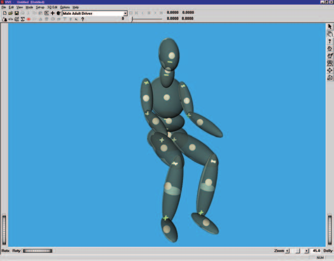
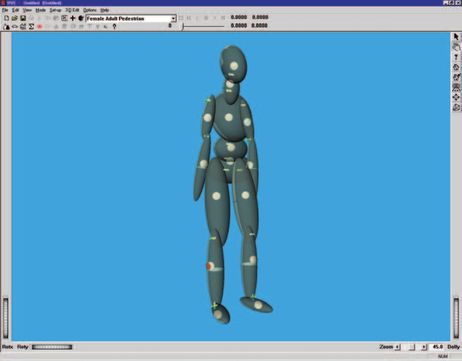
*Figure 5-1: Male Adult Driver and Female Adult Pedestrian, ready for analysis.*

## Creating the Vehicles

Now we have our humans, so let's add the vehicles. First, let's add the two vehicles involved in a low-speed, rear-end collision. One vehicle is a dark red 1991 Buick Skylark and the second is a forest green 1989 Ford F-150 Pickup:

- Choose *Vehicle Mode*. The Vehicle Editor is displayed.
- Click *Add New Object*. The Vehicle Information dialog is displayed. The Vehicle Information dialog allows the user to select the basic vehicle attributes according to *Type, Make, Model, Year* and *Body Style*.

  > **NOTE:** The Vehicle Information dialog also allows you to edit the Driver Location, Engine Location, Number of Axles and Drive Axle(s). These options affect the basic vehicle configuration and do not need to be changed for our tutorial.

- Using the option buttons, click each button to choose the following vehicle from the database:
  - Type = *Passenger Car*
  - Make = *Buick*
  - Model = *Skylark*
  - Year = *1985-1991*
  - Body Style = *4-Door*
  - Source Database = *Tutorial.db*
- Click *OK* to add *Buick Skylark* to the Active Vehicles list.

Now, let's add the 1989 Ford F-150 pickup:

- Click *Add New Object*. The Vehicle Information dialog is displayed.
- Click on the option buttons in the Vehicle Information dialog to choose the second vehicle according to the following attributes:
  - Type = *Pickup*
  - Make = *Ford*
  - Model = *F-150*
  - Year = *1988-1991*
  - Body Style = *Fleetside*
  - Source Database = *Tutorial.db*
- Click *OK* to add *Ford F-150* to the Active Vehicles list.

Finally, let's add the aqua blue 1997 Plymouth Van to the case. The Plymouth Van was involved in the pedestrian impact.

- Click *Add New Object*. The Vehicle Information dialog is displayed.
- Click on the option buttons in the Vehicle Information dialog to choose the following vehicle from the database:
  - Type = *Van*
  - Make = *Plymouth*
  - Model = *Voyager*
  - Year = *1996-1999*
  - Body Style = *Van*
  - Source Database = *Tutorial.db*
- Click *OK* to add *Plymouth Voyager* to the Active Vehicles list.

Now, we have all the vehicles required for our case.

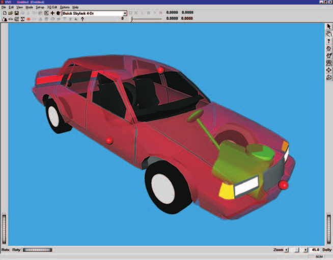
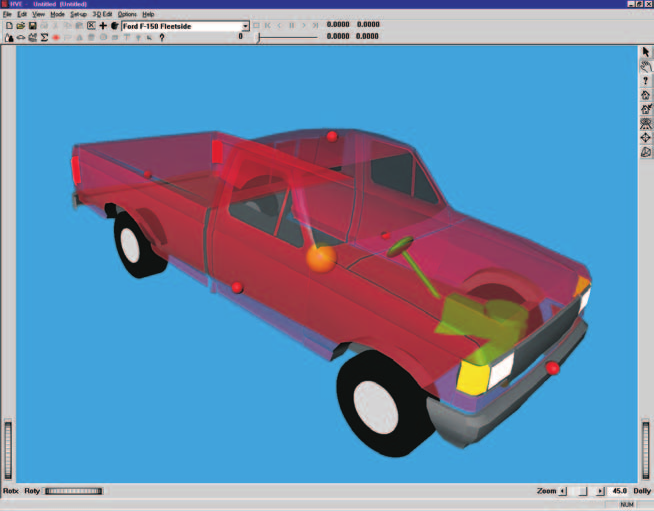
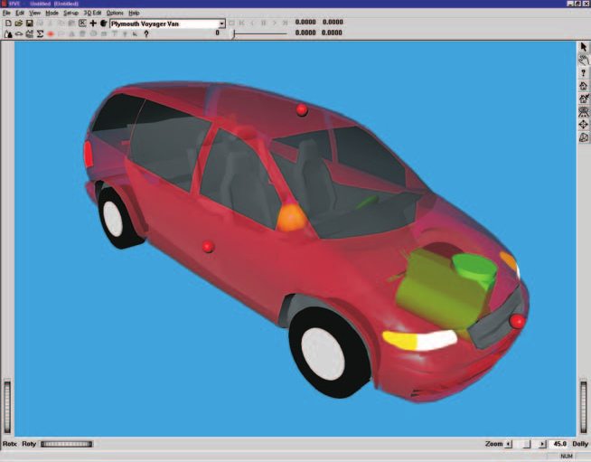
*Figure 5-2: Buick Skylark 4-Dr, Ford F-150 Fleetside and Plymouth Voyager Van.*

### Editing the Vehicles

Next, we will edit the vehicles to change their color. In addition, we need to add contact surfaces to the Buick and Plymouth Van for the human simulations. The contact surfaces are the *physical* surfaces that interact with the human ellipsoids to produce forces.

Let's start with the Buick. This vehicle was struck from the rear, and we wish to simulate its occupant during the low-speed impact.

To edit the Buick, perform the following steps:

- First, select the *Buick Skylark* from the Active Vehicles drop-down list, making it the current vehicle. The Buick is now displayed in the Vehicle Editor.

Let's remove a portion of the vehicle exterior so we can see inside the vehicle more easily. The HVE 3-D Editor was previously used to remove the passenger compartment, and we saved the modified geometry file by the name `PCBuickNoTop.h3d`. To assign the modified geometry file:

- Click on the CG and choose *Geometry File, Open*. The Drawing File Selection dialog is displayed. Double-click on *PCBuickNoTop.h3d*. The vehicle is redisplayed with the new geometry file exposing the vehicle interior.
- To change the vehicle's color from bright red to dark red, click on the CG and choose *Color*. The Vehicle Color dialog is displayed (see Figure 5-3), showing the vehicle's current color (the small black square in the *color wheel*) and intensity (the arrow in the *intensity slider*). Leave the color unchanged; to darken the vehicle, click on the intensity slider and drag it from the right end of the slider towards the middle.

  > **NOTE:** The color chip on the left shows the current color.

- When the color is to your liking, close the dialog by clicking on the close button in the upper right-hand corner of the dialog.

  > **NOTE:** The vehicle's apparent color may be slightly misleading because the vehicle is translucent when displayed in the Vehicle Editor. The actual color will be used whenever the vehicle is displayed during Event and Playback mode.

*Figure 5-3: Vehicle Color dialog.*

Next, let's add the contact surfaces for the Buick. We'll need a minimum of three surfaces for our simulation: a seat bottom, a seat back and a head rest.

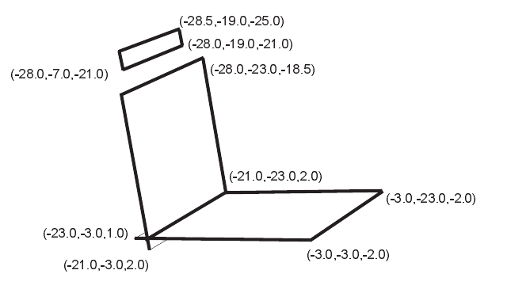
*Figure 5-4: Seat Bottom, Seat Back and Head Rest contact surfaces.*

To add the contact surfaces, perform the following steps:

- Click on the CG and choose *Contact Surfaces*. The Contact Surfaces dialog is displayed (see Figure 5-5), and we're ready to create the contact surfaces for the Buick.
- Click *Add* and enter `Seat Bottom`, followed by \<*Enter*\>.
- *Interior* is already selected as the default location to identify this contact as an interior contact surface.
- Enter the coordinates for 3 corners of the seat bottom, as shown in the table below:

**Table 5-1 — Seat Bottom Contact Surface Coordinates**

| | First Corner | Middle Corner | Third Corner |
|---|---|---|---|
| x | -23.0 | -3.0 | -3.0 |
| y | -3.0 | -3.0 | -23.0 |
| z | 1.0 | -2.0 | -2.0 |

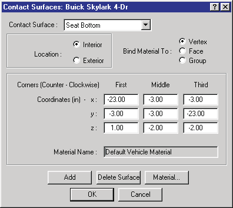
*Figure 5-5: Contact Surface dialog.*

> **NOTE:** Remember to enter three consecutive corners in counter-clockwise order to establish the positive side of the surface.

> **NOTE:** The order is important! If we enter the coordinates in the wrong order, no force will be produced between the human and vehicle.

> **NOTE:** You can tab between fields in this dialog, making it quicker to enter the coordinate data.

The *Seat Bottom* contact surface is complete. Next, let's create a contact surface for the seat back:

- Again, click *Add* and enter `Seat Back`, followed by \<*Enter*\>. *Interior* is already selected. Enter the coordinates for three corners of the seat back (Table 5-2):

**Table 5-2 — Seat Back Contact Surface Coordinates**

| | First Corner | Middle Corner | Third Corner |
|---|---|---|---|
| x | -21.0 | -21.0 | -28.0 |
| y | -3.0 | -23.0 | -23.0 |
| z | 2.0 | 2.0 | -18.5 |

Finally, let's create a contact surface for the head rest:

- Again, click *Add* and enter `Head Rest`, followed by \<*Enter*\>. *Interior* is already selected. Enter the coordinates for three corners of the head rest (Table 5-3):

**Table 5-3 — Head Rest Contact Surface Coordinates**

| | First Corner | Middle Corner | Third Corner |
|---|---|---|---|
| x | -28.0 | -28.0 | -28.5 |
| y | -7.0 | -19.0 | -19.0 |
| z | -21.0 | -21.0 | -25.0 |

- Click *OK* to remove the Contact Surface dialog.

The Buick is displayed with its surfaces.

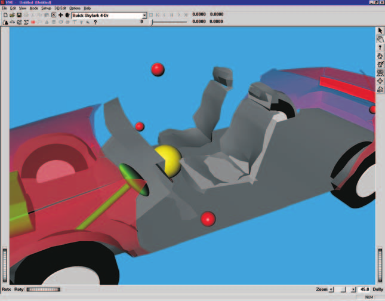
*Figure 5-6: Buick Skylark after adding contact surfaces for the seat and headrest.*

> **NOTE:** If the contact surfaces are not displayed, choose Options in the main menu bar and click on Show Contacts.

Using the viewer thumb wheels, rotate the vehicle and look at each side of the surfaces. Note the contact side is light colored (i.e., the positive side), while the other side is dark.

Now, let's change the color of the Plymouth Van, and add *Bumper, Grille, Hood* and *Windshield* contacts to its exterior (see Figure 5-7). These contact surfaces will be used for the pedestrian impact simulation.

To change the vehicle's color from red to blue, perform the following steps:

- Select the *Plymouth Voyager* from the Active Vehicles drop-down list, making it the current vehicle. The vehicle is displayed in the viewer, ready to edit.
- Click on the CG and choose *Color*. The Vehicle Color dialog is displayed, showing the vehicle's current color (in the *color wheel*) and intensity (in the *intensity slider*). Click on the hot spot (the small black square in the color wheel) and drag it to the middle of the blue area. Next, darken the vehicle slightly by dragging the intensity slider from the right end of the slider towards the middle.
- When the color is to your liking, close the dialog by clicking on the close button in the upper right-hand corner of the dialog.

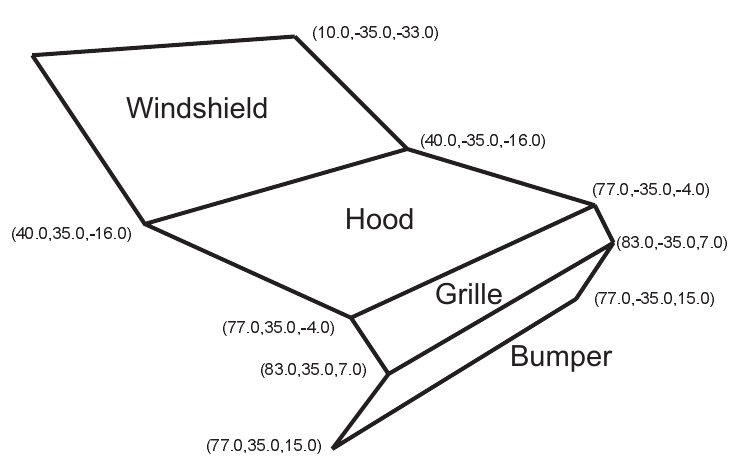
*Figure 5-7: Bumper, Grille, Hood and Windshield contact surfaces.*

To create the contact surfaces for the van, perform the following steps:

- Click on the CG and choose *Contact Surfaces*. The Contact Surfaces dialog is displayed.
- Click *Add* and enter `Bumper`, followed by \<*Enter*\>. Click on *Exterior* and enter the coordinates for 3 corners of the front end (Table 5-4).

**Table 5-4 — Plymouth Van Bumper Contact Surface Coordinates**

| | First Corner | Middle Corner | Third Corner |
|---|---|---|---|
| x | 83.0 | 77.0 | 77.0 |
| y | 35.0 | 35.0 | -35.0 |
| z | 7.0 | 15.0 | 15.0 |

Now, let's create the Grille contact surface:

- Again, click *Add* and enter `Grille`, followed by \<*Enter*\>. Click on *Exterior* and enter the coordinates for three corners of the grille:

**Table 5-5 — Plymouth Van Grille Contact Surface Coordinates**

| | First Corner | Middle Corner | Third Corner |
|---|---|---|---|
| x | 83.0 | 83.0 | 77.0 |
| y | 35.0 | -35.0 | -35.0 |
| z | 7.0 | 7.0 | -4.0 |

Now, let's create the Hood contact surface:

- Again, click *Add* and enter `Hood`, followed by \<*Enter*\>. Click on *Exterior* and enter the coordinates for three corners of the hood:

**Table 5-6 — Plymouth Van Hood Contact Surface Coordinates**

| | First Corner | Middle Corner | Third Corner |
|---|---|---|---|
| x | 40.0 | 77.0 | 77.0 |
| y | 35.0 | 35.0 | -35.0 |
| z | -16.0 | -4.0 | -4.0 |

The last contact surface for the *Plymouth Van* is the Windshield:

- Again, click *Add* and enter `Windshield`, followed by \<*Enter*\>. Click on *Exterior* and enter the coordinates for three corners of the windshield:

**Table 5-7 — Plymouth Van Windshield Contact Surface Coordinates**

| | First Corner | Middle Corner | Third Corner |
|---|---|---|---|
| x | 40.0 | 40.0 | 10.0 |
| y | 35.0 | -35.0 | -35.0 |
| z | -16.0 | -16.0 | -33.0 |

- Click *OK* to remove the Contact Surface dialog.

The vehicle is displayed with its surfaces.

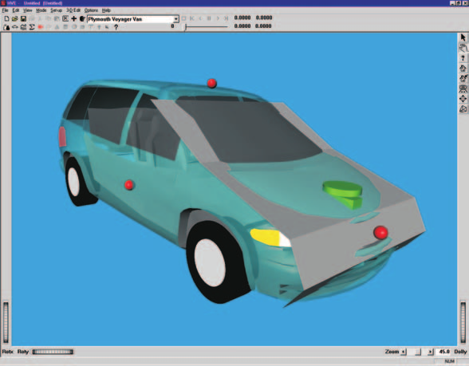
*Figure 5-8: Plymouth Van after adding the Bumper, Grille, Hood and Windshield contact surfaces.*

Again, use the viewer thumb wheels to rotate the vehicle and look at each side of the surfaces. Note the contact side is light colored (i.e., the positive side), while the other side is dark.

Finally, let's change the color of the Ford pickup from red to forest green:

- Click on *Ford F-150* in the Active Vehicles list. The vehicle is displayed in the viewer, ready to edit.
- Click on the CG and choose *Color*. The Vehicle Color dialog is displayed. Click on the hot spot in the color wheel and drag it to the middle of the green area. Next, darken the vehicle by dragging the intensity slider from the right end of the slider towards the middle. Remember, the color chip on the left shows the current color.
- When the color is to your liking, close the dialog by clicking on the close button in the upper right-hand corner of the dialog.

We now have all three vehicles required for the two simulation studies in this case.

## Creating the Environment

Now, let's add the environment.

- Choose *Environment Mode*. The Environment Editor is displayed.

Let's use one of the sample environments shipped with HVE.

- Click on *Add New Object*. The Environment Information dialog is displayed.
- Using the Location Database combo box, choose *Beaverton, Oregon, USA*. The latitude, longitude and GMT (hours from the prime meridian) are displayed for the selected location.
- Edit the date and time of the incident we are studying, `4/22/96` and `1630`, respectively.
- Edit the angle from *true north* to the earth-fixed X axis in our environment, `56` degrees.

  > **NOTE:** The Latitude, Longitude, GMT, Date/Time and angle from true north are used to position the sun in the scene. This is, of course, important because the sun is the primary light source for the scene.

- To add the environment geometry file to our case, click on *Open*. The Environment Geometry File Selection dialog is displayed.
- Click on the *Files of Type* option list and choose *HVE Geometry Files (\*.h3d)*. A list of environment geometry files using the HVE file format is displayed in a list box.
- Double-click on *2T4_Intersection.h3d* to choose the environment file and remove the dialog.
- Press *OK*.

The selected environment is added to our case and displayed in the Environment Viewer. Use the viewer thumb wheels to view the scene.

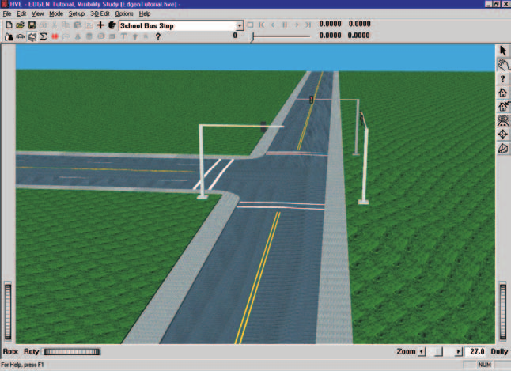
*Figure 5-9: 3-D Environment used for our tutorial.*

## Saving the Case

Now that we've created all the objects (*humans, vehicles* and *environment*) for our case, let's save the case file.

- Click on the *File* menu and choose *Save*. The Save-as File Selection dialog is displayed.

  > **NOTE:** The Save-as dialog is displayed because the case has not been saved previously, so we need to enter a filename.

- In the Case Title text field, replace Untitled with `EDHIS Tutorial Case`.

  > **NOTE:** The Case Title is displayed as a heading on all printed output reports.

- In the Filename text field, enter `EdhisTutorial`.
- Click *SAVE*. The current case data are saved in the `hve/supportFiles/case` subdirectory.

  > **NOTE:** Saving the file occasionally is a highly recommended practice.

## Creating the Events

We are going to perform two simulation studies: one study is an occupant simulation of a low-speed, rear-end collision and the other is a pedestrian impact.

### Collision Simulation

For the low-speed rear-end collision, we need a collision pulse. We can get the collision pulse directly using the EDSMAC4 collision simulator:

> **NOTE:** If you don't have EDSMAC4 on your HVE system, you may skip the EDSMAC4 event. The collision pulse for this event is shipped with HVE, and may be loaded by selecting EdhisTutorialCollisionPulse from the Collision Pulse File Selection dialog.

- Choose *Event Mode*. The Event Editor is displayed.
- Click on *Add New Object*. The Event Information dialog is displayed.
- Select *Buick Skylark* and the *Ford F-150* from the Active Vehicles list.
- Select *EDSMAC4* from the *Calculation Method* options list.
- Enter a name for the event, `Buick vs Ford`.

  > **NOTE:** HVE will append the name of the calculation method to the event name, thus the complete event name will become "EDSMAC4, Buick vs Ford."

- Press *OK* to create the event and display the event editor.

Now, we're ready to set up the first event.

- Choose *Set-up* from the menu bar and select *Position/Velocity*. The Buick is displayed at the earth-fixed origin.
- Click on the vehicle's X-Y manipulator (see Figure 5-10), wait for it to turn bright yellow (indicating it has been selected), and drag it to its impact position, X=`24` ft, Y=`75` ft. Click the yaw manipulator and rotate it to its heading angle, `-90` degrees.

  > **NOTE:** Be sure to keep the mouse button depressed while you drag the manipulators.

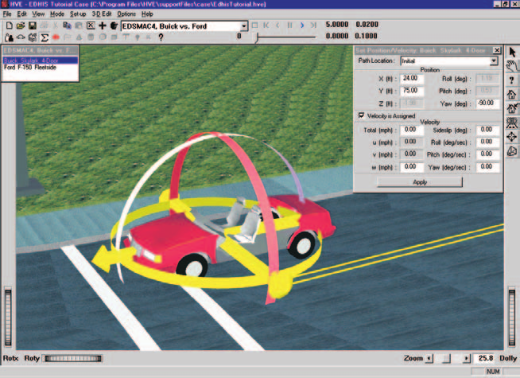
*Figure 5-10: Positioning the Buick Skylark using the manipulators.*

> **NOTE:** Adjust the viewer by dollying back (using the Dolly thumb wheel) until you can see the entire intersection.

> **NOTE:** To select the X-Y manipulator, the viewer must be in Pick mode, as indicated by the highlighted arrow in the upper right corner of the viewer.

> **NOTE:** If you can't position the vehicle at the exact coordinates, simply enter them in the dialog (in fact, it's often easier to directly enter the coordinates using the dialog).

- Click the *Velocity Is Assigned* checkbox. Since it was stopped at impact, leave the value assigned at `0` mph.

Event set-up for the Buick is now complete. Let's set up the Ford pickup.

- Select *Ford F-150* in the Event Humans & Vehicles list, then choose *Position/Velocity* from the *Set-up* menu. The Ford is displayed at the earth-fixed origin. Drag it to its impact position, X=`24` ft, Y=`91` ft, Yaw=`-90` degrees. Click *Velocity Is Assigned*, and enter an initial velocity of `10` mph.
- Choose *Simulation Controls* from the Options menu and change the Output Time Interval from `0.1` sec to `0.005` sec. Click *OK* to accept the change.

  > **NOTE:** We reduced the output interval because we're going to use the acceleration output from this simulation as the collision pulse for our occupant simulation, so we want more detail; selecting the smaller output interval provides the acceleration at 0.005 second increments, rather than the default value, 0.1 second. Note the entire duration of a collision is only about 0.1 second, so the default interval might actually skip the entire collision!

- Using the Event Controller, click *Play* to execute the event. Allow the event to run until just after the vehicles separate, t = `0.25` sec. Then press *Pause/Stop* to end the event.

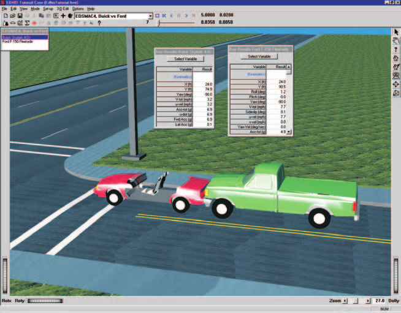
*Figure 5-11: HVE Event Editor executing the EDSMAC4 Event.*

> **NOTE:** While the event is executing, watch the current results (especially acceleration) in Key Results windows.

### Occupant Simulation

The EDSMAC4 event has provided us with the collision pulse; now let's use EDHIS to study the driver's behavior during impact.

- Select *Add New Object*. The Event Information dialog is displayed.
- Select *Buick Skylark* and the *Male Adult Driver* from the Active Vehicles list and Active Human list, respectively.
- Select *EDHIS* from the Calculation Methods options list.
- Enter a name for the first EDHIS event: `Buick Occupant`.
- Press *OK* to display the event editor.

Now, let's set up and execute the occupant simulation event using EDHIS:

- Using the Event Editor dialog, select *Buick Skylark* from the Event Humans & Vehicles list, then select *Set-up* from the menu bar and choose *Position/Velocity*. The Buick is displayed at the earth-fixed origin.
- Use the Position/Velocity dialog to assign the same initial position as the one used in the previous EDSMAC4 event, X=`24` ft, Y=`75` ft and heading=`-90` deg.

  > **NOTE:** Be sure to press \<Enter\> to apply the values displayed in the Position/Velocity dialog.

- Click the *Velocity Is Assigned* check box. Leave the value assigned at `0` mph.
- Choose *Collision Pulse* from the Set-up menu. The collision pulse dialog is displayed (see Figure 5-12). Click on the *Pulse Data Source* option list and choose *EDSMAC4, Buick vs Ford*. The collision pulse (acceleration vs time history) for the Buick Skylark during the low-speed impact is displayed numerically (in a user-editable table) and graphically.
- Press *OK* to accept the collision pulse.

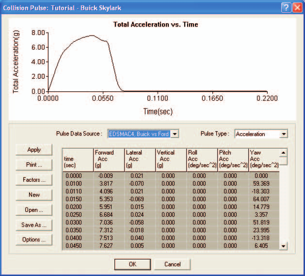
*Figure 5-12: Collision Pulse dialog for Buick Skylark.*

Before we position the human, we'll attach the camera to the vehicle.

> **NOTE:** This tip really helps while positioning occupants because it allows you to move the camera relative to the vehicle, thus you can quickly focus on the interaction between the human and the seat cushion, an important part of placing the human in an equilibrium position.

To attach the camera to the vehicle, perform the following steps:

- Choose *Set Camera* from the View menu. The Set Camera dialog is displayed (see Figure 5-13).
- Click the *View From This Object* option list and choose *Buick Skylark 4-Dr*. Enter the Camera Position coordinates, x=`0`, y=`-20`, z=`0`.
- Click the *Look At This Object* option list and choose *Buick Skylark 4-Dr*. Enter the coordinates, x=`0`, y=`0`, z=`0`.
- Press *OK*.

The viewer displays the vehicle as viewed from the vehicle-fixed coordinates, 0, -20, 0.

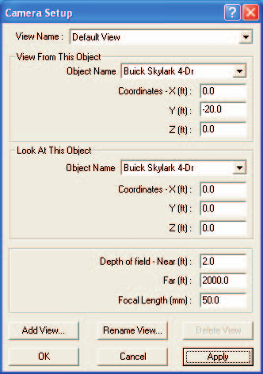
*Figure 5-13: Set Camera dialog.*

Now we're ready to position the driver in the Buick.

- Select *Male Adult Driver* from the Event Humans & Vehicles list, then choose *Position/Velocity* from the Set-up menu. The occupant is displayed at the vehicle-fixed origin. A set of manipulators is attached to the human to allow us to position him in the seat (refer to Figure 5-14).

  > **NOTE:** The Position/Velocity dialog displays the current position and orientation of the human relative to the vehicle-fixed coordinate system.

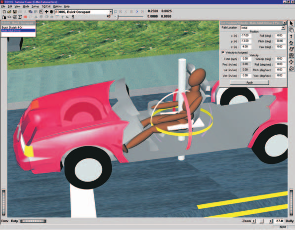
*Figure 5-14: Human manipulators used for positioning the human.*

To position the occupant, let's first use the x-y plane manipulator to position the human over the middle of the seat at x = -17 in, y = -13 in.

- Click on the x-y plane manipulator (a white, horizontal plane through the human's pelvis segment) and drag the human to x=`-17`, y=`-13`, then release the mouse.

  > **NOTE:** You may wish to use the rotX thumb wheel to get a better view of the human relative to the seat.

  > **NOTE:** If the human is not located exactly at -17, -13, you can enter the values directly in the Position/Velocity dialog.

Use the z manipulator (a white rod along the human's z axis) to set the elevation.

- Click on the z manipulator and drag the human up to `-5` inches (again, you may use the dialog to enter the exact value).

Next, we'll use the pitch manipulator to lean the occupant back in the seat:

- Click on the purple pitch band and drag the human, tilting him back until the pitch equals 30 degrees.

  > **NOTE:** Again, you may wish to use the rotX and rotY thumb wheels to gain a better view. You might also want to rotate the scene to get a better angle on the pitch manipulator band in order to select it.

Now the human is seated properly, but his legs protrude through the floorboard (we won't make the obvious comment!). Let's position the legs:

- Click on the lower left leg. The orientation manipulators are displayed.
- Click on the pitch manipulator and drag the leg until the pitch angle is `-30.0` degrees.
- Repeat the above two steps to position the lower right leg.

The human is now properly positioned in the seat. The last step in positioning is to assign an initial velocity:

- Click on the human pelvis segment in order to select it.

  > **NOTE:** We must select the pelvis, which is the main segment, in order to assign an initial velocity to the human; otherwise, we would have simply assigned an initial velocity to the lower left leg.

- Click the *Velocity Is Assigned* checkbox in the Position/Velocity dialog, and enter a forward velocity of `0` mph.

  > **NOTE:** Because the human is defined as an occupant (as opposed to a pedestrian), the initial velocity is defined relative to the vehicle.

The final step in the event set-up is to set up contacts and assign combined material property data for the human ellipsoid to contact surface interactions:

- If the Male is not currently selected in the Event Humans and Vehicles list, click on it, making it the current object.
- Choose *Contacts* from the *Set-up* Menu (Figure 5-15).
- Under the Objects list, click *Select All*.
- Under the Targets list, click *Select All*.
- Below, in the Combined Material Properties section, click *Select All*.

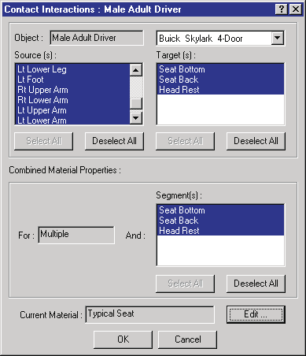
*Figure 5-15: Combined Material Properties dialog.*

- Click *Edit* to edit the combined material properties.
- Click *Open* to open a saved combined material property data set.
- Double-click on `TypicalSeat.matl` to select it and close the dialog.
- Click *OK* to accept the new material properties.
- Click *OK* to accept the assigned contacts.

The contacts are now assigned and we are ready to proceed with executing the simulation.

- Using the Event Controller, click *Play* to execute the event. Allow the event to run until the end of the simulation.

Since our goal for this event is to study how the impact severity affects force and head acceleration, let's look at some Key Results during execution:

- If Key Results windows are not displayed, choose *Show Key Results* from the Options menu.
- Drag the Key Results windows to a convenient location, where they do not block the view but still allow us access to the viewer thumb wheel controls (in case we want to change the view).
- Click on *Select Variable* in the *Male Adult Driver* Key Results window. The Variable Selection dialog for *Male Adult Driver* is displayed.

Let's add *Head Forward Acceleration* and *Head Pitch Acceleration* to the Key Results window:

- Click *Kinematics*, *Head*. The Variable Selection list for Head Kinematics is displayed.
- Select *Fwd Accel* (Forward Acceleration) and *Pitch Accel* (Pitch Acceleration) from the list.

Next, let's add the *Head* vs *Head Rest* contact force:

- Click *Contacts* and choose *Head, Head* and *Buick Skylark Head Rest* from the cascade menus. The Variable Selection list for Head vs Head Rest contact is displayed (see Figure 5-16).

  > **NOTE:** The first time Head is displayed, it refers to the Head segment; the second time refers to the contact ellipsoid named Head that is attached to the Head segment.

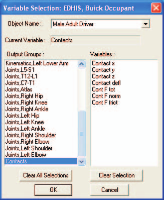
*Figure 5-16: Key Results Variable Selection dialog.*

- Select *Force* from the list.
- Press *OK* to add the selected variables to the Key Results window.

Now, we're ready to execute the event once again:

- Using the Event Controller, click *Reset* to clear the previous results and then click *Play* to execute the event.

We have finished our occupant simulation. You may wish to view it a few more times by pressing *Reverse* and *Play*. Note the time-dependent results displayed in the Key Results windows. You might also wish to add additional output variables to the Key Results window.

### Pedestrian Simulation

Using EDHIS to simulate a pedestrian impact is very similar to the previous occupant simulation. Let's proceed:

- Click *Add New Object*. The Event Information dialog is displayed.
- Select *Plymouth Voyager* and the *Female Adult Pedestrian* from the Active Vehicles list and Active Humans list, respectively.
- Select *EDHIS* from the Calculation Methods options list.
- Edit the event name: `Plymouth/Pedestrian Impact`.
- Press *OK* to display the event editor.

Now, let's set up and execute the pedestrian simulation event using EDHIS, as shown in Figure 5-17.

- Using the Event Editor dialog, select *Plymouth Voyager* from the Event Humans & Vehicles list, then select *Set-up* from the menu bar and choose *Position/Velocity*. The Plymouth Van is displayed at the earth-fixed origin. Drag the vehicle to its impact position, X=`-20` ft, Y=`37` ft, Yaw=`0` degrees.
- Click the *Velocity Is Assigned* check box. Enter the Plymouth Van's impact speed, `35` mph.

Next, position the pedestrian.

- Select *Female Adult Pedestrian* from the Event Humans & Vehicles list, then select *Set-up* from the menu bar and choose *Position/Velocity*. The human is displayed at the earth-fixed origin.

  > **NOTE:** The human is half buried in the environment; this occurs because AutoPosition does not apply to humans.

- Use the Position/Velocity dialog to enter the impact position of the human relative to the earth-fixed coordinate system: X=`-10` ft, Y=`37` ft, Z=`-3.5` ft, Yaw=`90` degrees.

  > **NOTE:** Be sure to press \<Enter\>, otherwise, the entered values do not take effect.

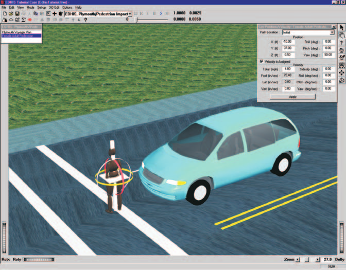
*Figure 5-17: Setting up the EDHIS Pedestrian Impact simulation.*

Now, let's enter the initial velocity of the pedestrian:

- Click on the *Velocity Is Assigned* checkbox and enter the velocity, `4` mph.

The final step in the event set-up is to set up contacts and assign combined material property data for the human ellipsoid to contact surface interactions. Let's start with the Bumper.

- If the Female is not currently selected in the Event Humans and Vehicles list, click on it, making it the current object.
- Choose *Contacts* from the Set-up Menu.
- Under the Objects list, click *Select All*.
- Under the Targets list, click *Select All*.
- Below, in the Combined Material Properties section, first select *Bumper*.
- Click *Edit* to edit the combined material properties.
- Click *Open* to open a saved combined material property data set.
- Double-click on `TypicalRoofPillar.matl` to select it and close the dialog.
- Click *OK* to accept the new material properties.

The Grille and Hood have the same material properties, so we will assign them together.

- Click on *Bumper* to deselect it and click on both *Grille* and *Hood* to select them.
- Click *Edit* to edit the combined material properties.
- Click *Open* to open a saved combined material property data set.
- Double-click on `TypicalDoorUndamaged.matl` to select it and close the dialog.
- Click *OK* to accept the new material properties.

Finally, we assign the material properties for the Female to Windshield contact.

- Click on both *Grille and Hood* to deselect them and click on *Windshield* to select it.
- Click *Edit* to edit the combined material properties.
- Click *Open* to open a saved combined material property data set.
- Double-click on `TypicalWindshield.matl` to select it and close the dialog.
- Click OK to close the Combined Material Properties dialog.

The pedestrian impact is now set up and ready to execute.

- Using the Event Controller, click *Play* to execute the event. Allow the event to run until the pedestrian rebounds from the collision.

  > **NOTE:** EDHIS is designed to simulate human occupant or pedestrian motion up to the point of first impact. We should therefore terminate the event no later than 0.15 seconds.

We have now completed the three events.

## Viewing Results

Now that we have produced our EDHIS simulations, let's take a detailed look at the results. The Playback Editor is used for reviewing and printing reports for each event in the current case, as well as for producing video output.

> **NOTE:** The events simulated in this tutorial might be included, along with the results from several other EDC Reconstruction and Simulation Model tutorials, in the HVE User's Manual Tutorial, Chapter 32.

> **NOTE:** In this tutorial, we will only review the output reports produced by the EDHIS Buick Occupant event. Feel free to view the EDSMAC4 and EDHIS Pedestrian events as well.

EDHIS produces the following reports:

- **Messages** — A list of messages produced by the current run
- **Accident History** — A table of initial and final positions and velocities
- **Event Data** — A table containing the collision pulse used in the EDHIS event
- **Human Data** — A series of tables containing the human data used by EDHIS
- **Injury Data** — A table containing the injury tolerances, followed by a table containing values exceeding the allowable tolerances during the event
- **Vehicle Data** — A series of tables containing the vehicle data used by EDHIS
- **Program Data** — A table containing program control information
- **Variable Output** — A table containing time-dependent simulation results
- **Trajectory Simulation** — A 3-D visualization of the event, displayed at a user-selectable time interval

To view the output reports, we need to be in Playback mode:

- Choose *Playback Mode*. The Playback Editor is displayed.

### Report Windows

The reports listed above are displayed by selecting Report Windows. Each Report Window contains an individual report.

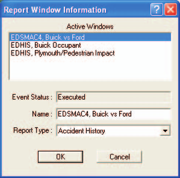
*Figure 5-18: Report Window Information dialog.*

To view the reports produced by the *EDHIS Tutorial* Case, perform the following steps:

- Click *Add New Object*. The Report Window Information dialog is displayed, and includes a list of the active events (*EDSMAC4, Buick vs Ford*, *EDHIS, Buick Occupant* and *EDHIS, Plymouth/Pedestrian Impact* are the events in this tutorial). The Report Window Information dialog also includes the user-editable *Report Window Name* text field and *Selected Output* option list.
- Select the desired event name from the Active Events list.
- Click on the *Selected Output* option list and choose any of the available reports.
- Press OK to display the report.

The selected report is displayed in a resizable window. The following sections illustrate the reports produced for the *EDHIS, Buick Occupant* event.

### Messages

EDHIS produces several messages, depending on the outcome of the event. For a complete listing and explanation of these messages, refer to [Chapter 6](06-messages.md).

To view the Messages report: click *Add New Object*, select *EDHIS, Buick Occupant* from the Active Events list, choose *Messages* from the *Selected Output* option list, and press *OK*.

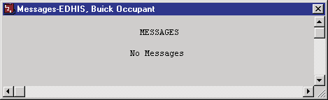
*Figure 5-19: Messages Report for EDHIS, Buick Occupant.*

### Accident History

The Accident History report displays the earth-fixed positions and velocities for the three human segments and the vehicle at the start of the run.

To view it: click *Add New Object*, select *EDHIS, Buick Occupant*, choose *Accident History* from the *Selected Output* option list, and press *OK*.

> **NOTE:** The Accident History report and several other reports contain more information than fits into the default window size. Use the scroll bars or resize the dialog to view the entire report.

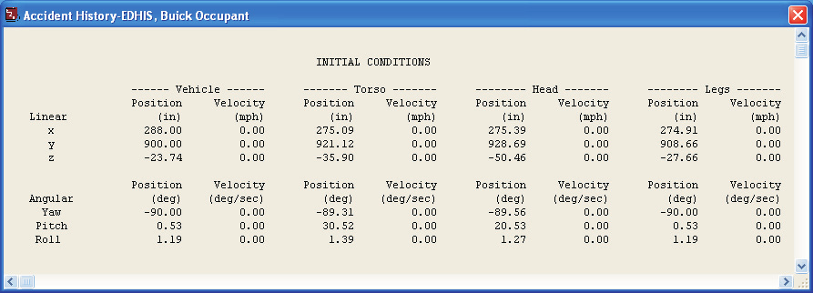
*Figure 5-20: Accident History Report for EDHIS Buick Occupant.*

### Event Data

The Event Data report displays the acceleration pulse used in the EDHIS event.

To view it: click *Add New Object*, select *EDHIS, Buick Occupant*, choose *Event Data* from the *Selected Output* option list, and press *OK*.

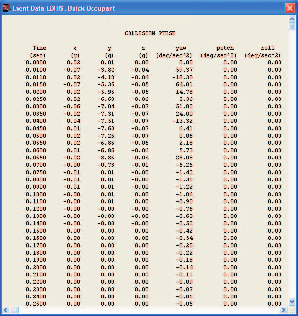
*Figure 5-21: Event Data Report for EDHIS Buick Occupant.*

### Human Data

The Human Data report displays the human segment and joint properties, as well as the human contact ellipsoid information.

To view it: click *Add New Object*, select *EDHIS, Buick Occupant*, choose *Human Data* from the *Selected Output* option list, and press *OK*.

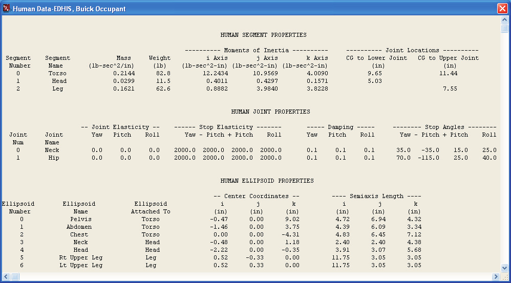
*Figure 5-22: Human Data Report for EDHIS, Buick Occupant.*

### Injury Data

The Injury Data report displays the results of injury calculations that compare simulated tolerance levels with those specified for the human.

To view it: click *Add New Object*, select *EDHIS, Buick Occupant*, choose *Injury Data* from the *Selected Output* option list, and press *OK*.

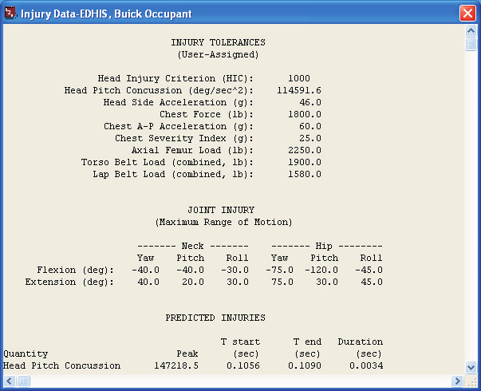
*Figure 5-23: Injury Data Report for EDHIS, Buick Occupant.*

### Vehicle Data

The Vehicle Data report displays the contact properties (location and physical properties), collision pulse and restraint systems parameters.

To view it: click *Add New Object*, select *EDHIS, Buick Occupant*, choose *Vehicle Data* from the *Selected Output* option list, and press *OK*.

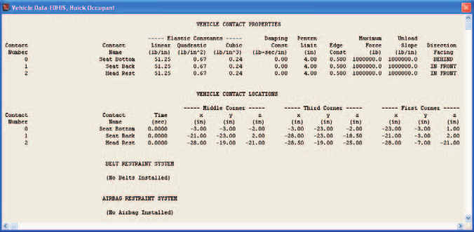
*Figure 5-24: Vehicle Data Report for EDHIS, Buick Occupant.*

### Program Data

The Program Data report displays the simulation controls and other program control information.

To view it: click *Add New Object*, select *EDHIS, Buick Occupant*, choose *Program Data* from the *Selected Output* option list, and press *OK*.

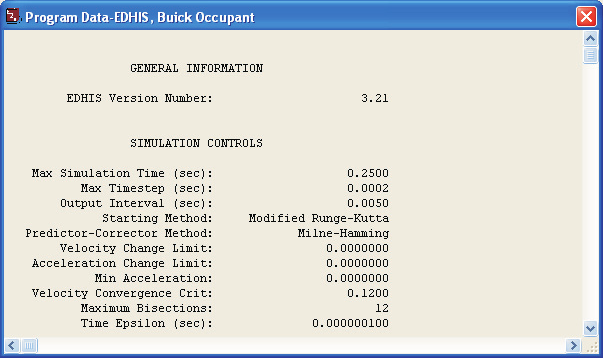
*Figure 5-25: Program Data Report for EDHIS, Buick Occupant.*

### Variable Output

To view the Variable Output report for the *EDHIS, Buick Occupant* event: click *Add New Object*, select *EDHIS, Buick Occupant*, choose *Variable Output* from the *Selected Output* option list, and press *OK*.

The Variable Output report is displayed for the *EDHIS, Buick Occupant* event. The table is initially empty, so the next step is to select the time-dependent results we wish to display in the table.

#### Variable Selection

The purpose of our study is to determine the potential for head or neck injury, so let's select head position and velocity and forward and pitch accelerations from the Kinematics output group. Let's also add head vs headrest contact force from the Contacts output group. To display these variables:

- Click on *Select Variables* in the Variable Output window. The Variable Selection dialog is displayed.
- Click on the Object Name option list and choose *Male Adult Driver*. The Human Variable Groups list is displayed.

Let's add the Kinematics variables first:

- Click *Kinematics*, *Head*. The Variable Selection list for Head Kinematics is displayed.
- Select *x, y, z* positions, *pitch* orientation, *Fwd Velocity*, *Pitch Velocity*, *Fwd Acceleration* and *Pitch Acceleration* from the list.

Next, let's add the Head vs Head Rest contact force:

- Click *Contacts* and choose *Head, Head, Buick Skylark*, and *Head Rest* from the cascade menus. The Variable Selection list for Head vs Head Rest contact is displayed (see Figure 5-26).

  > **NOTE:** The first time Head is displayed, it refers to the Head segment; the second time refers to the ellipsoid named Head that is attached to the Head segment.

- Select *Cont F tot* (total contact force) from the variable list.
- Press *OK* to add the selected variables to the Variable Output window.

The Variable Output report for the *EDHIS, Buick Occupant* now includes Forward and Pitch Head Accelerations and the contact force between the headrest and head, as shown in Figure 5-27. Feel free to use the above steps to add additional parameters to the variable output table and view the results.

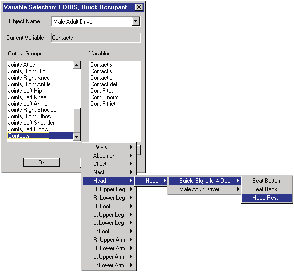
*Figure 5-26: Variable Selection dialog.*
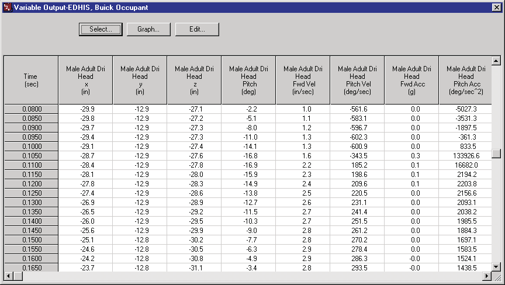
*Figure 5-27: Variable Output report for EDHIS, Buick Occupant.*

### Trajectory Simulation

The Trajectory Simulation provides a 3-dimensional visualization of the vehicle and occupant motion during the event.

To view it: click *Add New Object*, select *EDHIS, Buick Occupant*, choose *Trajectory Simulation* from the *Selected Output* option list, and press *OK*.

The Trajectory Simulation viewer is displayed for the *EDHIS, Buick Occupant* event. The human and vehicle are shown at their initial positions.

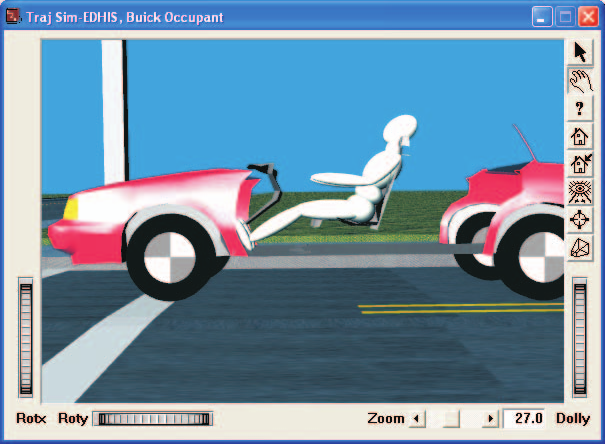
*Figure 5-28: Trajectory Simulation for EDHIS, Buick Occupant.*

To visualize the motion, perform the following steps:

- Click *Play* (single right-arrow). The simulation begins and is displayed at the current Playback output interval.
- Click *Pause*. The simulation stops.
- Click *Reverse* (single left-arrow). The simulation plays in reverse.
- Click *Pause*. The simulation stops.
- Click *Rewind* (left arrow with bar). The simulation returns to the start.
- Click *Advance to End* (right arrow with bar). The simulation advances to the end of the run.

### Printing

The final step is to print the above reports. Printing reports is simple. All you do is choose a report and print it. For example:

- Click the dialog header for *Variable Output - EDHIS, Buick Occupant*. The dialog header is highlighted and the Variable Output window pops to the top of the display (if it isn't there already), indicating it is the current window.
- Click on the *File* menu and choose *Print*. The Print dialog is displayed, allowing the user to select from several available options.

  > **NOTE:** Alternatively, you can click on the print icon in the upper menu bar.

- Press *OK*. The Variable Output report is printed on the system printer.

That's all there is to it! You can print any other report using the same two steps described above.

> **NOTE:** The Print dialog provides several options. Refer to the Windows or Printer User's Manual for more information.

> **NOTE:** For several reports it may be best to print in landscape rather than portrait mode.

> **NOTE:** The font size of both the printed reports and screen display may be edited by clicking on the Options menu and choosing Preferences. Use the Font Size option list to change the size.

---
*Previous: [Chapter 4 — Calculation Method](04-calculation-method.md) | Next: [Chapter 6 — Messages](06-messages.md)*

<!-- NAV -->

---

← Previous: [Chapter 4 — Calculation Method](04-calculation-method.md)  |  [Index](README.md)  |  Next: [Chapter 6 — Messages](06-messages.md) →

<!-- /NAV -->
