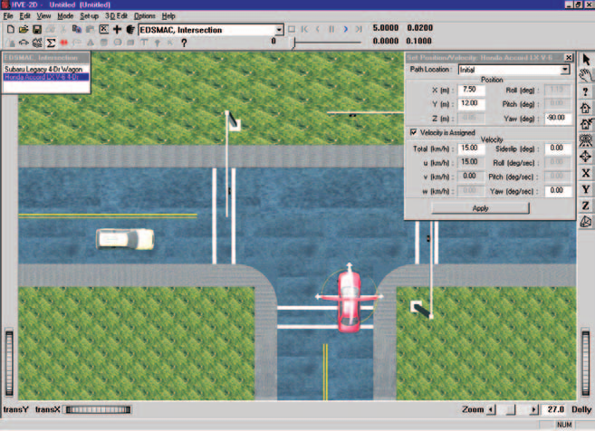
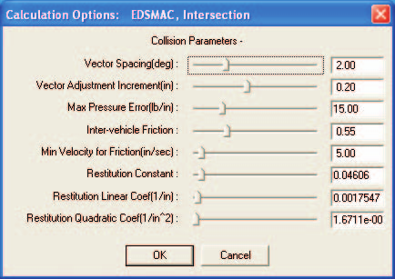
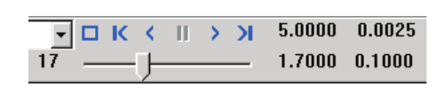

# Chapter 2 — EDSMAC Program Input

This chapter defines the objects (vehicles and environment) and the event set-up parameters (positions, driver controls, and so forth) used by the EDSMAC analysis. In general, the chapter is divided into the following sections:

- **Objects** — The number of vehicles, and the specific vehicle parameters actually used by EDSMAC.
- **Events** — The various options available for setting up and executing an EDSMAC event.

## Objects Overview

The objects used by the EDSMAC model are:

- **Vehicles** — One or two vehicles may be studied by EDSMAC.
- **Environment** — Like the *real* world, EDSMAC has exactly one environment.

> NOTE: The environment is used in any reconstruction or simulation model.

The following sections describe how the vehicle and environment provide the required inputs to the EDSMAC calculation model.

## Vehicles

EDSMAC uses one or two vehicles created using the Vehicle Editor (see Figure 2-1). Vehicles are selected from the Vehicle Database by choosing the following attributes:

- **Type** — EDSMAC supports the following vehicle types: *Passenger Car, Pickup, Sport-Utility, Van,* and *Truck,* within the limits defined by number of axles and drive axles; see below.
- **Make** — EDSMAC supports all available vehicle makes.
- **Model** — EDSMAC supports all available vehicle models, within the limits defined by number of axles and drive axles; see below.
- **Year** — EDSMAC supports all available vehicle years.
- **Body Style** — EDSMAC supports all available vehicle body styles.

Each vehicle also has the following additional user-editable parameters:

- **Driver Location** — The *Driver Location* is not used by EDSMAC. However, if you would like the vehicle to have any steerable axles, *Driver Location* must not be *None*.
- **Engine Location** — The *Engine Location* is not used by EDSMAC. However, if you would like the Throttle Table to be available during Event mode, *Engine Location* must not be *None*.
- **Number of Axles** — EDSMAC supports only 2-axled vehicles.
- **Drive Axle(s)** — The *Drive Axle* is used by EDSMAC to determine which wheels to include in the Throttle Table during Event mode.

To add a vehicle to the current case, perform the following steps:

1. Choose Vehicle Mode. The Vehicle Editor is displayed.
2. Choose *Add New Object*. The Vehicle Information dialog is displayed.
3. Click on the *Type, Make, Model, Year* and *Body Style* option buttons to select a vehicle from the database.
4. If desired, modify the *Driver Location, Engine Location, Number of Axles* and *Drive Axle(s)* for the current vehicle.
5. Enter a name for the current vehicle. A default name is supplied for each selected vehicle. Its name is user-editable, and does not affect calculations.

   > NOTE: Duplicate vehicle names are not allowed in the same case.

6. Click *OK* to add the vehicle to the current case.

*Figure 2-1: Vehicle Editor.*

The following Vehicle Parameter groups are assigned using the Vehicle Editor:

- Sprung Mass (Inertias, Move CG, Inter-vehicle Connections)
- Unsprung Mass (Wheel Location, Tire Data, Suspension Data)
- Exterior (Overall Dimensions, Stiffness Coefficients)
- Steering System

The specific data used in each of the above parameter groups are defined in Tables 2-1 through 2-3.

### Sprung Mass

**Table 2-1. Vehicle Sprung Mass Parameters Used By EDSMAC.**

| Parameter | Description |
|---|---|
| Weight | Total vehicle weight |
| Total Yaw Inertia | Rotational inertia about the vehicle-fixed z axis |
| Move CG x | Relocates the CG in the vehicle-fixed x direction. This entry causes an automatic adjustment of all other vehicle dimensions to reflect the new CG location. |

#### Inertias

EDSMAC uses the total vehicle weight (converted to mass according to the current gravitational constant; see Environment), and the yaw rotational inertia.

> NOTE: The yaw inertia displayed in the Inertias dialog applies only to the sprung mass. EDSMAC does not include independent degrees of freedom for the unsprung masses. Therefore, the inertial contributions of the unsprung masses are added to the sprung mass yaw inertia to calculate the total yaw inertia used by EDSMAC.

#### Move CG

Move CG is not used directly by EDSMAC. Its current value does not show up in the results. However, the Move CG fields may be used to quickly move the vehicle's center of gravity. The x coordinates for the wheels are updated to reflect the new CG location.

#### Geometry File

The Geometry File is not used by EDSMAC.

#### Inter-vehicle Connections

Inter-vehicle connections are not used by EDSMAC.

### Unsprung Mass

**Table 2-2. Vehicle Unsprung Mass Parameters Used By EDSMAC.**

| Parameter | Description |
|---|---|
| Wheel Location | The vehicle-fixed x,y wheel center coordinates |
| Dual Tire | Flag indicating position has dual tires |
| Tire Slide Friction | The slide coefficient of friction for each tire |
| Tire Cornering Stiffness | Tire lateral force per unit of tire lateral slip for small amounts of lateral slip |

#### Wheel Location

Although HVE-2D provides values for the vehicle-fixed x,y coordinates of each wheel, EDSMAC uses the following three parameters: $a$, the distance from the CG to the front axle; $b$, the distance from the CG to the rear axle; $tw$, the average of the front and rear track widths.

> NOTE: EDSMAC uses the average $x_{wheel}$ for the front wheels to calculate $a$ and the average $x_{wheel}$ for the rear wheels to calculate $b$. Similarly, EDSMAC uses the total distance between right-side and left-side tires to calculate track width. Bilateral symmetry is assumed. Finally, EDSMAC does not use $z_{wheel}$ for calculations.

#### Tire

The HVE-2D tire parameters provide the following data groups:

- Friction Data
- Cornering Stiffness Data
- Slip-vs Rolloff Table

EDSMAC's use of these parameters is described below.

##### Friction Data

EDSMAC uses the slide friction coefficient.

> NOTE: If there is any doubt about which value is actually used by EDSMAC, you can check the Vehicle Data output report.

> NOTE: During an event, the actual tire-terrain friction used during the current timestep is the product of the slide friction coefficient and the terrain friction multiplier for the polygon beneath the tire. Mathematically,
> $$\mu_{Tire\text{-}terrain} = \mu_{Slide} \times Mult_{Polygon}$$

##### Cornering Stiffness Data

EDSMAC uses the Cornering Stiffness value.

> NOTE: If there is any question about which value is actually used by EDSMAC, you can check the Vehicle Data output report.

##### Slip-vs Rolloff Table

EDSMAC does not use the Slip-Rolloff data.

#### Suspension

EDSMAC does not use the Suspension data.

#### Brake

EDSMAC does not use the Brake data.

### Exterior

EDSMAC uses the following Vehicle Exterior data:

- Exterior Dimensions
- Frontal $K_v$ Stiffness Coefficient

**Table 2-3. Vehicle Exterior and Steering System Parameters Used By EDSMAC.**

| Parameter | Description |
|---|---|
| CG to Front, Right, Back and Left | The vehicle's exterior dimensions |
| Frontal $K_v$ Stiffness Coefficient | The stiffness of the vehicle exterior (assumed to be uniform on all sides) |
| Steering Gear Ratio | Ratio of the angle at the steering wheel to the angle at the wheel |

> NOTE: EDSMAC assumes the exterior structure is homogeneous and does not use different stiffness values for the front, sides, and rear. The $K_v$ stiffness coefficient entered for the frontal surface is applied to all other surfaces of the vehicle!

### Steering System Data

EDSMAC uses the Steering System to determine which axles are steerable. Only steerable wheels are displayed in the Driver Controls, Steer Table. In addition, if the Steer Table *At Driver* option is used, the steering gear ratio parameter is used to compute the steer angle at each steerable tire.

### Brake System Data

EDSMAC does not use the Brake System data.

## Environment

EDSMAC uses the environment created by the Environment Editor (see Figure 2-2). The environment is created by defining the following groups of attributes:

- Visual Data
- Physical Data

*Figure 2-2: Environment Editor.*

### Creating an Environment

To add an environment to the current case, perform the following steps:

1. Choose Environment Mode. The Environment Editor is displayed.
2. Click *Add New Object*. The Environment Information dialog is displayed.
3. Click on the *Location* combo box to select the desired city, state and country, and associated *Latitude*, *Longitude* and *GMT*.
4. Edit the *Time* and *Date* for the event.
5. Edit the *Angle of the X Axis, Wind Speed* and *Direction*, *Barometric Pressure* and *Temperature* for the event.
6. Edit the *Gravity Constant* for the event.
7. Edit the environment name. A default name is supplied for the current environment. The name is user-editable, and does not affect calculations.
8. Click *OK* to add the environment to the current case.

### Visual Data

The following visual parameters may be edited:

- **Environment Location** — A database containing the name (City/State/Country), Latitude and Longitude and GMT for the selected location.
- **Time and Date** — The local standard time and date for the event.

The visual data are not used by the event; they are provided for studies related to visibility at the time of an event (e.g., avoidability of an accident).

> NOTE: The visual data (Location, Time, Date and Angle of earth-fixed X axis) affect the lighting of the event! Depending on your view (Camera Position) the scene may be shaded and difficult to see. If the time is after sundown, the view will be dark.

### Physical Data

The Physical Data groups are:

- Angle of X Axis
- Wind Speed and Direction
- Atmospheric Temperature and Pressure
- Gravity Constant
- Surface Geometry

The specific physical environment data used by EDSMAC are described below and in Table 2-4.

**Table 2-4. Environment Parameters used by EDSMAC.**

| Parameter | Description |
|---|---|
| Gravitational Constant | The local acceleration of gravity |
| Surface Geometry, Friction Factor | The polygon database used to create the environment |

#### Angle Of X Axis

The angle of the X axis is used to position the earth-fixed coordinate system on the surface of the earth.

> NOTE: The angle is specified relative to true north. If you are using a compass to determine direction at the scene of an accident, you should provide a local correction factor before entering this angle.

> NOTE: The angle of the X axis affects how you visualize an EDSMAC event because it affects the location of the sun.

#### Wind Speed and Direction

EDSMAC does not use the Wind Speed or Direction.

#### Atmospheric Temperature and Pressure

EDSMAC does not use the atmospheric temperature and pressure.

#### Gravitational Constant

The gravitational constant converts mass to force. An object's mass and rotational inertias are properties that are the same throughout the universe; however the weight of an object is dependent on the local gravitational constant.

> NOTE: All user-entered weights are divided by this gravitational constant and stored as mass.

#### Surface Geometry

The Surface Geometry is used by the tire model in EDSMAC to calculate the friction multiplier for the current X,Y position of each tire.

## Event

EDSMAC uses the Event Editor (see Figure 2-3) to create, set up and execute an event. Each of these topics is described below.

*Figure 2-3: Event Editor, setting up and executing an EDSMAC event.*

### Creating an Event

An EDSMAC event is created using the Event Information dialog.

To create an EDSMAC event:

1. Choose Event Mode. The Event Editor is displayed.
2. Click *Add New Object*. The Event Information dialog is displayed.
3. Select one or two vehicles from the Active Vehicles list.
4. Select the calculation model, *EDSMAC*, from the Calculation Model options list.
5. Enter an event name. A default name is supplied for the selected event. The name is user-editable, and does not affect calculations.

   > NOTE: Duplicate event names are not allowed in the same case.

6. Click *OK* to create the EDSMAC event.

> NOTE: If you choose a vehicle that is not compatible with EDSMAC, a message will be displayed describing the problem. You will not be allowed to proceed until EDSMAC-compatible objects are selected.

### Setting Up an Event

EDSMAC uses the following *event set-up* options:

- Position/Velocity
- Driver Controls

The specific Event Set-up data used by EDSMAC are defined in Table 2-5.

**Table 2-5. Event Set-up Parameters used by EDSMAC.**

| Parameter | Description |
|---|---|
| Vehicle Initial Position | The earth-fixed X,Y coordinates and yaw angle of each vehicle at the start of the simulation |
| Vehicle Initial Velocity | The forward and lateral linear velocities, and the yaw angular velocity, at the start of the run |
| Driver Controls, Steer Table | Steer Table Option; Steering Wheel Angle vs Time or Tire Steer Angle vs Time |
| Driver Controls, Brake Table | Brake Table Option; Wheel Force vs Time or Percent Available Friction vs Time |
| Driver Controls, Throttle Table | Throttle Table Option; Wheel Force vs Time or Percent Available Friction vs Time |

#### Position/Velocity

Each vehicle is positioned relative to the earth-fixed coordinate system by supplying the X,Y,Z coordinates of its CG, and the roll ($\Phi$), pitch ($\Theta$) and yaw ($\Psi$) angles about the vehicle's x, y and z axes, respectively.

> NOTE: Z is equal to the CG height above ground, and roll and pitch are equal to 0.0.

The vehicle velocities are supplied in the form of a total velocity and sideslip angle.

> NOTE: The vehicle-fixed u (forward) and v (side) velocity components are calculated according to the user-entered total velocity and sideslip angle. Vertical velocity is set to zero.

EDSMAC uses the following positions and velocities:

- **Initial Position** — The X,Y coordinates and heading angle of the vehicle at the start of the simulation. Only the initial position is used by EDSMAC.

  > NOTE: Other positions may be supplied as target positions, used to assess how closely the simulated path matches the actual path during a run. Refer to the User's Manual, Options Menu, for more information about Target positions.

- **Initial Velocity** — The total velocity and sideslip angle of the vehicle(s) at the start of the simulation.

  > NOTE: Initial positions and velocities must be entered for each vehicle in an EDSMAC event.

#### Driver Controls

EDSMAC uses the following Driver Controls:

- **Steering** — A table of steering inputs as a function of time. The *At Driver* and *At Axle* options are supported.
- **Braking** — A table of braking inputs as a function of time. The *Wheel Force* and *Percent Available Friction* options are supported.
- **Throttle** — A table of throttle inputs as a function of time. The *Wheel Force* and *Percent Available Friction* options are supported.

##### Brake

Typical values for non-braking rolling resistance for passenger car tires are provided for reference in Table 2-6 [11]. These values should be entered in the Driver Controls - Brakes dialog using the Percent Available Friction option.

Representative values for locked-wheel (slide) friction coefficients for passenger car tires on a variety of surfaces are also provided, in Table 2-7 [10]. While the table is very complete, EDC makes no claim as to the accuracy of the data. The user is urged to perform thorough research in order to supply EDSMAC with the best possible data.

**Table 2-6. Rolling Resistance Braking Inputs for Pavement [11].**

| Tire/Wheel Condition | % Available Friction |
|---|---|
| Normal Inflation | $0.010 / \mu$ |
| Partial Inflation | $0.013 / \mu$ |
| Damaged | 0.0 to 1.0 |
| Engine Braking — High Gear | $0.150/\mu$ to $0.200/\mu$ |
| Engine Braking — Low Gear | $0.200/\mu$ to $0.400/\mu$ |

**Table 2-7. Tire-Ground Friction Coefficients on Various Surfaces [10].**

| Surface | Dry <30 mph | Dry >30 mph | Wet <30 mph | Wet >30 mph |
|---|---|---|---|---|
| Portland Cement — New, Sharp | 0.80 - 1.20 | 0.70 - 1.00 | 0.50 - 0.80 | 0.40 - 0.75 |
| Portland Cement — Traveled | 0.60 - 0.80 | 0.60 - 0.75 | 0.45 - 0.70 | 0.45 - 0.65 |
| Portland Cement — Polished | 0.55 - 0.75 | 0.50 - 0.65 | 0.45 - 0.65 | 0.45 - 0.60 |
| Asphalt or Tar — New, Sharp | 0.80 - 1.20 | 0.65 - 1.00 | 0.50 - 0.80 | 0.45 - 0.75 |
| Asphalt or Tar — Traveled | 0.60 - 0.80 | 0.55 - 0.70 | 0.50 - 0.80 | 0.45 - 0.75 |
| Asphalt or Tar — Polished | 0.55 - 0.75 | 0.45 - 0.65 | 0.45 - 0.65 | 0.40 - 0.60 |
| Asphalt or Tar — Excess Tar | 0.50 - 0.60 | 0.35 - 0.60 | 0.30 - 0.60 | 0.25 - 0.55 |
| Gravel — Packed, Oiled | 0.55 - 0.85 | 0.50 - 0.80 | 0.40 - 0.80 | 0.40 - 0.60 |
| Gravel — Loose | 0.40 - 0.70 | 0.40 - 0.70 | 0.45 - 0.75 | 0.45 - 0.75 |
| Cinders — Packed | 0.50 - 0.70 | 0.50 - 0.70 | 0.65 - 0.75 | 0.65 - 0.75 |
| Rock — Crushed | 0.55 - 0.75 | 0.55 - 0.75 | 0.55 - 0.75 | 0.55 - 0.75 |
| Ice — Smooth | 0.10 - 0.25 | 0.07 - 0.20 | 0.05 - 0.10 | 0.05 - 0.10 |
| Snow — Packed | 0.30 - 0.55 | 0.35 - 0.55 | 0.30 - 0.60 | 0.30 - 0.60 |
| Snow — Loose | 0.10 - 0.25 | 0.10 - 0.20 | 0.30 - 0.60 | 0.30 - 0.60 |

#### Damage Profile

EDSMAC does not use the Damage Profile data.

> NOTE: EDSMAC produces a simulated damage profile.

#### Payload

The Payload Data are not used by EDSMAC. Payload inertias may be added to the vehicle inertias and the CG may be moved longitudinally and/or vertically using the Move CG dialog.

#### Wheels

Wheel Data is not used by EDSMAC.

#### Accelerometers

EDSMAC does not support accelerometers.

### Simulation Controls

EDSMAC uses the Vehicle Collision, Separation and Trajectory integration timesteps and the maximum simulation time parameters in the Simulation Controls dialog (see Options Menu, Simulation Controls). The Simulation parameters used by EDSMAC are shown in Table 2-8.

**Table 2-8. Simulation Control Parameters used by EDSMAC.**

| Parameter | Description |
|---|---|
| Vehicle Collision Integration Timestep | The integration timestep used during the collision phase |
| Vehicle Separation Integration Timestep | The integration timestep used for the first 100 time steps of the simulation (or until collision occurs); also used for the first 100 after the end of the collision phase |
| Vehicle Trajectory Integration Timestep | The integration timestep used before and after the collision phase (after 100 timesteps without collision, as described above) |
| Output Interval | The timestep used to send output results back to HVE-2D or HVE |
| Maximum Simulation Time | Maximum length of the run |
| Min Linear Velocity | The linear velocity used to terminate the run (if the linear and angular velocities for both vehicles are simultaneously less than these termination velocities, the run terminates) |
| Min Angular Velocity | The angular velocity used to terminate the run (if the linear and angular velocities for both vehicles are simultaneously less than these termination velocities, the run terminates) |

The output time interval is the interval at which output results (positions, velocities, accelerations, forces) are reported back to HVE-2D. This has a direct effect on the tabular results available in the Playback Editor, Variable Output table (see Chapter 3 — Output, Variable Output).

> NOTE: For analyses of gross vehicle motion, damage, and rest position, an output interval of 0.10 is generally sufficiently small.

> NOTE: For analyses of vehicle accelerations or collision pulses, smaller output intervals are recommended.

> NOTE: The output time interval should be an even multiple of the vehicle trajectory integration timestep. For example, if the integration timestep is 0.02, the output interval might be 5 x 0.02, or 0.10.

### Calculation Options

*Figure 2-4: EDSMAC Event Calculation Options dialog, available from the Options menu.*

EDSMAC has the following parameter options (see the code-verified reference page [EDSMAC Calculation Options](../../10-calculation-options/CalcOptEDSMAC.md) for internal variable names, defaults and allowed ranges):

- **Vector Spacing** — This angle, *DELPSI*, determines the angular interval between RHO vectors (see Calculation Method). The default value is 2 degrees (range 1 to 5 degrees). *(updated: the original manual recommended 1 degree; the current default in the code and dialog is 2.0 degrees.)*
- **Vector Adjustment Increment** — This increment, *DELRHO*, determines the incremental adjustment for each RHO vector as the collision routine seeks to establish force equilibrium between vehicles. Default 0.20 in (range 0.01 to 0.5 in).
- **Max Pressure Error** (Vector Force Tolerance) — This value, *ALAMB*, is the allowable difference in the force per unit width exerted by RHO vectors for each vehicle. A small value is obviously preferable. In general, it should not exceed 50 lb/in (about 100 N/cm). Default 15 lb/in.
- **Inter-vehicle Friction** — This value, *AMU*, represents the coefficient of sliding friction between the vehicle exteriors. Default 0.55.
- **Minimum Velocity for Friction** — This value, *ZETAV*, represents the minimum relative surface velocity at which the full inter-vehicle friction is achieved. Default 5 in/sec. *(updated: the original manual swapped the variable names AMU and ZETAV for these two options; per the source code, AMU is the friction coefficient and ZETAV is the minimum velocity.)*
- **Restitution Coefficients** — These three values, $C_0$, $C_1$, and $C_2$, are the constant, linear and quadratic terms used for the parametric restitution model used in EDSMAC ($e = C_0 - C_1\delta + C_2\delta^2$, with defaults 0.04606, 0.0017547 /in and 1.6711×10⁻⁵ /in²).

### Get Surface Information

Both HVE and HVE-2D use a function called GetSurfaceInfo to determine on which environment polygon the tire is riding. This function searches below the X,Y coordinates of each tire contact patch, and uses a user-editable algorithm to determine the friction and other characteristics of the surface beneath.

The default method for GetSurfaceInfo is *From Previous Polygon, Sorted*. This results in fast execution while enforcing friction-zone precedence. Refer to the User's Manual and to the [Get Surface Information Options](../../10-calculation-options/CalcOptEDSMAC.md#terrain-search-options-moved-to-the-get-surface-information-dialog) notes for further information about how GetSurfaceInfo works. *(updated: these terrain search options are now set in the separate Get Surface Information Options dialog rather than in the EDSMAC Calculation Options; the "By Elevation" method is not supported.)*

### Executing An Event

To execute an EDSMAC event, use the Event Controller, shown in Figure 2-3 as a component of the Event Editor, and again in Figure 2-5. The Event Controller's buttons have the following functions:

*Figure 2-5: Event Controller, used for starting and stopping event execution; it can also replay previously executed events, both forward and backward.*

- **Reset** — Reinitialize the calculation model for re-execution
- **Rewind to Start** — Return to the start of the simulation
- **Reverse** — Play the simulation backwards
- **Pause** — Pause the simulation
- **Play** — Execute the event or play the simulation forwards
- **Advance to End** — Advance to the end of the simulation

> NOTE: If you make changes to any of the vehicle or environment parameters or event set-up options (see previous sections), those changes will have no effect unless you press Reset before pressing Play.

> NOTE: Remember to use the Options Menu to choose useful options, such as Key Results, Axes, Velocity Vectors and Skidmarks.

### Barrier Collisions

The collision algorithm used by EDSMAC was not designed to accommodate barrier collisions (barrier being defined as an infinitely rigid object that absorbs no energy during impact). The reason is clear upon close inspection of the collision algorithm; it requires that both colliding objects be deformable (see Chapter 4 and references 3, 4, 6, and 7 for a detailed description of the collision algorithm).

That being said, EDSMAC may often be used successfully for barrier collisions and pole impacts by making certain adjustments. These adjustments are as follows:

- To create the barrier, start by choosing any supported vehicle type from the Vehicle Database.
- Increase the barrier's front stiffness to about 1000 lb/in².
- If the object being struck is an immovable barrier, such as a bridge abutment or large pole, increase the weight to 1,000,000 lb and the yaw inertia to 1,000,000 lb-sec²-in to help prevent its movement during impact.
- Change the object's dimensions as required.

  > NOTE: The EDSMAC collision algorithm views the object as a rectangle, regardless of the shape of the geometry file.

- From EDSMAC's Calculation Options dialog, reduce the Vector Adjustment Increment to 0.02 in (from the default value, 0.2 in), and increase the Vector Force Tolerance (Max Pressure Error) to 25 lb/in (from its default value, 15 lb/in).
- For fixed barriers, select the Driver Controls, Brakes dialog and assign a large braking value (i.e., Percent Available Friction = 1.0) to further help prevent movement.
- Finally, set up the simulation so the first timestep involving a collision force occurs with a small overlap between the vehicle and barrier. This may be accomplished by reducing the trajectory and separation integration timesteps or by adjusting the initial positions as required for a small overlap at the start of the collision phase.

  > NOTE: This is especially true for pole impacts! The pole may be completely engulfed by the vehicle before a collision is detected, resulting in a fatal error during the collision phase.

---

[Previous: Chapter 1 — Program Description](01-program-description.md) | [Next: Chapter 3 — EDSMAC Program Output](03-program-output.md)

<!-- NAV -->

---

← Previous: [Chapter 1 — EDSMAC Program Description](01-program-description.md)  |  [Index](README.md)  |  Next: [Chapter 3 — EDSMAC Program Output](03-program-output.md) →

<!-- /NAV -->
