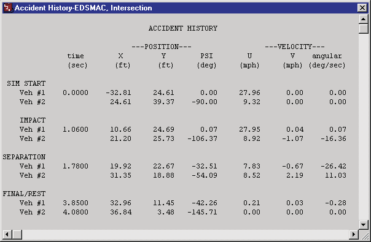
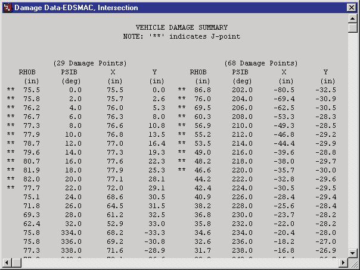
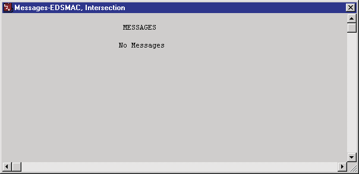
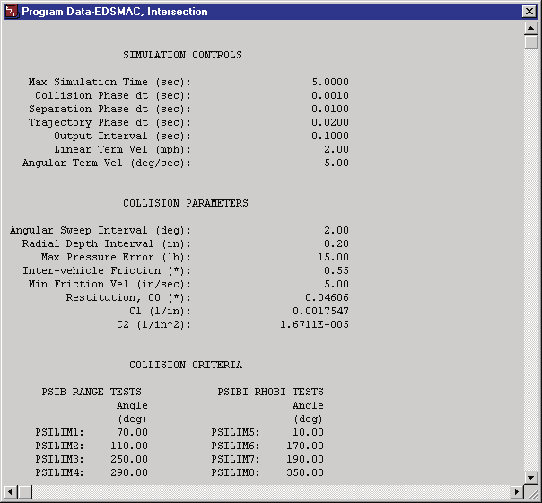
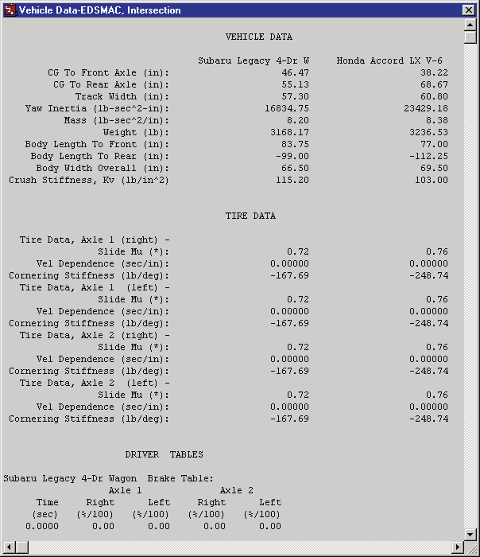
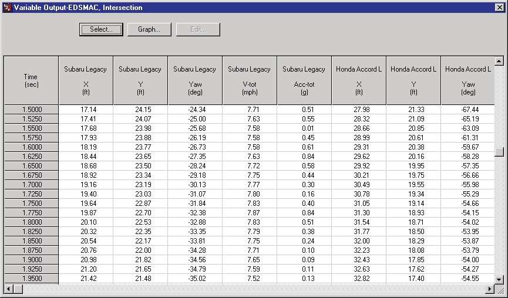
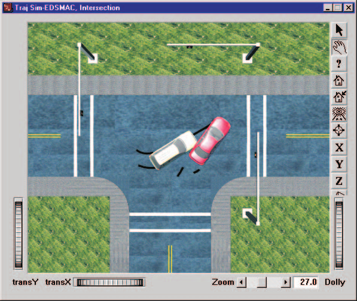
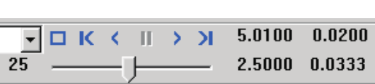

# Chapter 3 — EDSMAC Program Output

This chapter defines the outputs available from an EDSMAC event. The reports produced by EDSMAC are available in the Playback Editor.

## Output Overview

EDSMAC produces three types of output reports:

- **Alpha-Numeric Reports** — Reports containing text and numeric information, such as vehicle dimensional parameters
- **Variable Output Tables** — Reports containing tabular simulation results as a function of time
- **Trajectory Simulations** — Viewers containing dynamic, visual simulations

> NOTE: Each of these reports may be printed on the system printer. To print a report, click on the menu bar of the desired output report (the menu bar will change colors indicating that it is selected), then either choose Print from the Files menu or click on the Print icon in the toolbar. Refer to the User's Manual for further details.

To view any of these reports, perform the following steps:

1. Choose Playback Mode. The Playback Editor is displayed.
2. Choose *Add New Object*. The Report Window Information dialog is displayed, showing a list of all the current events in the case.
3. Select an EDSMAC event from the list. Once an event is selected, the Selected Output option list is displayed, containing all the available reports for the selected event.
4. Choose the desired report from the Selected Output list.
5. Enter a Report Window Name. A default name is supplied for the selected report window. The name is user-editable, and does not affect calculations.

   > NOTE: Duplicate Report Window names are not allowed. Because the name is truncated to 30 characters, you should ensure that two truncated names are not the same.

6. Click *OK* to display the report.

## Alpha-Numeric Reports

EDSMAC produces the following alpha-numeric reports:

- **Accident History** — A table of initial, impact, separation and final positions and velocities for each vehicle in the current event
- **Damage Data** — A table containing the vehicle collision ('RHO') vectors in both cylindrical and Cartesian coordinates, and a table containing the beginning and end of each damage range, its CDC, PDOF, total delta-V and peak acceleration
- **Messages** — A list of messages produced by the current event
- **Program Data** — A table containing program control information for the current event
- **Vehicle Data** — A series of tables containing the vehicle data and driver controls data used by the current EDSMAC event

An example of each of these numeric output reports from EDSMAC is described below.

### Accident History

The Accident History Report displays a table of initial, impact, separation and final positions and velocities for each vehicle. For each of the phases SIM START, IMPACT, SEPARATION and FINAL/REST, the report lists the time, the position (X, Y in ft, and heading angle PSI in deg) and the velocity (forward u and lateral v in mph, and angular velocity in deg/sec) of each vehicle.

*Figure 3-1: Typical Accident History Output Report issued by EDSMAC.*

### Damage Data

The Damage Data Report includes the following information:

- **Vehicle Damage Summary** — A table containing the collision ('RHO') vector information in two forms: RHO vector length and angle, and RHO vector x,y endpoint coordinates.

  > NOTE: This table is used to define the damage profile.

- **Vehicle Damage Ranges** — A table containing the starting and ending points for each damage range, along with its CDC, PDOF, total delta-V and peak acceleration.

*Figure 3-2: Typical Damage Data Output Report issued by EDSMAC (only a portion of the complete report is shown); '\*\*' in the summary indicates a J-point.*

### Messages

A typical Messages Report simply lists the messages (or "No Messages") produced during event execution. For a complete listing of messages issued by EDSMAC, see [Chapter 6 — Messages](06-messages.md).

*Figure 3-3: Typical Messages Output Report issued by EDSMAC.*

### Program Data

The Program Data Report includes the following information:

- **Simulation Controls** — Integration parameters used for the current event (maximum simulation time; collision, separation and trajectory phase timesteps; output interval; linear and angular termination velocities).
- **Collision Parameters** — Parameters used within the collision model (angular sweep interval DELPSI, radial depth interval DELRHO, max pressure error ALAMB, inter-vehicle friction AMU, min friction velocity ZETAV, and restitution coefficients C0, C1, C2).
- **Collision Criteria** — Parameters used to determine which side (front, back, right or left) a RHO vector intersects; used to determine the RHO vector's initial length (the PSILIM1–PSILIM8 angle limits for the PSIB range and RHOBI tests).

*Figure 3-4: Typical Program Data Output Report issued by EDSMAC.*

### Vehicle Data

The Vehicle Data Report includes the following information:

- **Vehicle Dimensional and Inertial Properties** — The dimensional and inertial parameters used by each vehicle in the current event (CG to front and rear axle, track width, yaw inertia, mass, weight, body length to front and rear, overall body width, and crush stiffness $K_v$).

  > NOTE: The yaw inertia displayed in the Vehicle Data report includes the inertial contributions of the unsprung masses. These masses are added to the sprung mass yaw inertia to calculate the total yaw inertia used by EDSMAC.

- **Tire Properties** — The tire parameters used by each vehicle in the current event (slide friction, velocity dependence, cornering stiffness, for each axle and side).
- **Driver Data** — Individual Driver Control tables for steering, braking and throttle used by each vehicle in the current event.

*Figure 3-5: Typical Vehicle Data Output Report issued by EDSMAC (only a portion of the complete report is shown).*

## Graphic Reports

EDSMAC produces no Graphic Output Reports.

> NOTE: Graphs of simulation results vs time may be produced using the Variable Output window (see next section).

## Variable Output Table

EDSMAC produces a Variable Output table containing the time-based simulation results. The Variable Output groups produced by EDSMAC are as follows:

### Vehicle Output Groups

- **Kinematics** — Position, velocity and acceleration for each vehicle
- **Kinetics** — Summation of collision forces and moments acting at the CG of each vehicle
- **Tire** — The tire output parameters existing at the tire contact patch (compare with Wheel Output, below)
- **Wheel** — The wheel output parameters existing at the wheel's hub. Information about the position of each wheel (compare with Tire output, above).
- **Driver** — Current levels of driver inputs (steering, braking and throttle)

An example of a Variable Output table is shown in Figure 3-6. A detailed listing of each Variable Output parameter produced by EDSMAC is found in Table 3-1.

**Table 3-1. Vehicle Variable Output Data**

| Parameter | Description |
|---|---|
| Vehicle Kinematic Data | X,Y,Z position of CG; $\Phi,\Theta,\Psi$ orientation; total linear velocity, u,v,w components; sideslip angle; r angular velocity; total linear acceleration, fwd and side components; u-dot, v-dot linear components; r-dot angular components |
| Vehicle Kinetic Data | $\Sigma F_x$, $\Sigma F_y$, $\Sigma M_z$ (collision); $\Sigma F_x$, $\Sigma F_y$, $\Sigma M_z$ (tires) |
| Tire Data | X,Y,Z position of tire contact patch; slip angle; $F'_x$, $F'_y$, $F'_z$; skid flag |
| Wheel Data | x,y,z location of each wheel; $F_x$, $F_y$, $F_z$; steer angle ($\delta$) at each steerable wheel |
| Driver Data (\*) | Steering wheel angle |

(\*) If Driver Control option was 'At Driver'

*Figure 3-6: Typical Variable Output table from EDSMAC.*

## Trajectory Simulation

EDSMAC produces a trajectory simulation of the current event. The trajectory simulation is a visualization of the vehicle position data displayed in the Variable Output table (see previous section).

*Figure 3-7: Typical EDSMAC Trajectory Simulation.*

### Displaying a Trajectory Simulation

The Trajectory Simulation is controlled using the Playback Controller (see Figure 3-8). The Playback Controller's buttons have the following functions:

- **Reset** — Return to the start of the simulation
- **Rewind to Start** — Return to the start of the simulation
- **Reverse** — Play the simulation backwards
- **Pause** — Pause the simulation
- **Play** — Execute the event or play the simulation forwards
- **Advance to End** — Advance to the end of the simulation

*Figure 3-8: Playback Controller, used for controlling Trajectory and Damage Profile Simulations.*

### Displaying a Damage Profile Simulation

EDSMAC produces a dynamic simulation of the vehicle damage profile. The simulated damage is displayed in the Damage Profile viewer (see Figure 3-9). The vehicle is initially displayed in its original shape without damage. To display a time-history of the damage, use the Playback Controller (see Figure 3-8).

> NOTE: A Trajectory Simulation window must be open in order to enable the Playback Controller.

*Figure 3-9: Typical EDSMAC Damage Profile Simulation.*

---

[Previous: Chapter 2 — Program Input](02-program-input.md) | [Next: Chapter 4 — Calculation Method](04-calculation-method.md)

<!-- NAV -->

---

← Previous: [Chapter 2 — EDSMAC Program Input](02-program-input.md)  |  [Index](README.md)  |  Next: [Chapter 4 — Calculation Method](04-calculation-method.md) →

<!-- /NAV -->
