# Chapter 5 — EDSMAC Tutorial

## Description

This tutorial illustrates a very common use of EDSMAC, that is, to perform a time-distance study to evaluate accident avoidability. We'll be able to watch as the vehicles approach each other and determine the first point of visibility between vehicles.

This tutorial is a continuation of the EDCRASH Tutorial, wherein the initial vehicle velocities were estimated. You may wish to review that tutorial before continuing.

Like all EDSMAC events, the procedure involves the following basic steps:

- Create the vehicle(s)
- Create the environment
- Execute the EDSMAC event
- Review the EDSMAC output reports

This basic procedure is described in detail in this tutorial.

> NOTE: It is assumed that HVE-2D is up and running, and that the user is familiar with HVE-2D's basic features, such as using dialogs and viewers, as well as the HVE-2D Editors. The purpose of this tutorial is to illustrate those features while setting up and executing an EDSMAC event.

## Getting Started

> NOTE: If you just finished the EDCRASH Tutorial, you have already created your vehicles and environment and may proceed directly to Creating the Events. The same suggestion applies if you already did the EDCRASH Tutorial and saved the case; if so, simply open that case and skip ahead.

As in other tutorials, before we get started with our current tutorial, let's set the user options so we're all starting on the same page.

> NOTE: All options simply affect the appearance in a viewer during Event or Playback mode.

> NOTE: Some of the following options are "Toggles" that switch between two different modes. Make sure these options are set correctly.

To set the initial user options, choose the following from the Options Menu:

- *ON:* Show Key Results
- *OFF:* Show Axes
- *OFF:* Show Velocity Vectors
- *ON:* Show Skidmarks
- *OFF:* Show Targets
- *ON:* AutoPosition
- Units equals *S.I.*

  > NOTE: As we'll see when we create the environment, our EDSMAC Tutorial takes place in Australia; thus, we require metric units.

- Render Options:
  - Show Vehicles as *Actual*
  - *Phong* Render Method
  - Complexity equals *Object*
  - Render Quality equals *5*
  - Texture Quality equals *1*
  - Anti-aliasing equals *1*

The remaining options will automatically initialize to their default conditions. We're now ready to proceed with the tutorial.

## Creating the Vehicles

Let's add the vehicles to our case. The first vehicle is a white, 1996 Ford Escort 2-Door Hatchback; the second vehicle is a dark red 1995 Nissan Sentra 4-door Sedan. Let's add the first vehicle:

1. If the Vehicle Editor is not the current editor, choose *Vehicle Mode*. The Vehicle Editor is displayed.
2. Click *Add New Object*. The Vehicle Information dialog is displayed. The Vehicle Information dialog allows the user to select the basic vehicle attributes according to *Type, Make, Model, Year* and *Body Style*.

   > NOTE: The Vehicle Information dialog also allows you to edit the Driver Location, Engine Location, Number of Axles and Drive Axle(s). These options are assigned default values for each vehicle. For our tutorial, only driver location must be edited.

3. Using the option buttons, click each button to choose the following vehicle from the database:
   - Type = *Passenger Car*
   - Make = *Ford*
   - Model = *Escort*
   - Year = *1991-1996*
   - Body Style = *2-Door Hatchback*
   - Source Database = *Tutorial.db*
   - Driver Location = *Right*
4. Click *OK* to add *Ford Escort* to the Active Vehicles list.

The Ford Escort is added to the case. Next, let's add the Nissan Sentra.

1. Click *Add New Object*. The Vehicle Information dialog is displayed.
2. Using the option buttons, click each button to choose the following vehicle from the database:
   - Type = *Passenger Car*
   - Make = *Nissan*
   - Model = *Sentra*
   - Year = *1995-1999*
   - Body Style = *4-Door*
   - Source Database = *Tutorial.db*
   - Driver Location = *Right*
3. Click *OK* to add *Nissan Sentra* to the Active Vehicles list.

We now have the vehicles required for our study, as shown in Figure 5-1.

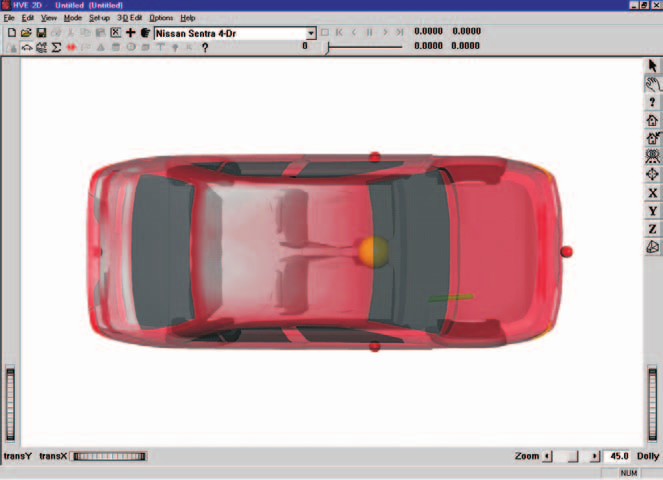

*Figure 5-1: Ford Escort (above) and Nissan Sentra (below).*

### Editing the Vehicles

Next, we'll edit the vehicles to change their color and weight. In addition, we'll change the stiffness of the Nissan Sentra, using values derived from our initial reconstruction analysis.

Start by changing the color of the Ford Escort:

1. Select the *Ford Escort* from the Active Vehicles drop-down list, making it the current vehicle. The Ford Escort is now displayed in the Vehicle Editor.
2. Click on the CG and choose *Color*. The Vehicle Color dialog is displayed (see Figure 5-2), showing the vehicle's current color (the small black square, or *hot spot*, in the color wheel) and intensity (the arrow in the intensity slider). Click on the hot spot and drag it to the center of the circle. To lighten the vehicle, click on the intensity slider and drag it to the far right end.

   > NOTE: The color chip on the left shows the current color.

3. When the color is to your liking, close the dialog by clicking the close button on the upper right corner of the dialog.

*Figure 5-2: Vehicle Color dialog, used for assigning the vehicle color.*

> NOTE: The vehicle's apparent color may be slightly misleading because the vehicle is translucent when displayed in the Vehicle Editor. The actual color will be used whenever the vehicle is displayed during Event and Playback mode.

Next, let's change the Escort's weight. Perform the following steps:

1. Click on the CG and choose *Inertias*. The Inertias dialog is displayed (see Figure 5-3), and we're ready to change the vehicle's weight.
2. In the *Total Weight* text field, replace the existing weight, `10283` Newtons, with the measured value, `11037` Newtons.

   > NOTE: The weight is entered as a force (Newtons). Mass units (kg) are calculated and displayed.

   > NOTE: The dialog might display 10283.5, or a similar number, because the weight is actually divided by the current gravity constant and stored as mass. Extra precision results when the mass is multiplied by the current gravity constant and redisplayed.

3. If not already selected, click the checkbox for *Auto Update Inertia When Weight Changes*.
4. Press *OK* to accept the weight value and update the Total Yaw Inertia of the vehicle.

The Ford Escort is now ready for use in our tutorial. Using the viewer thumb wheels and/or manipulators, pan, zoom and look at the vehicle.

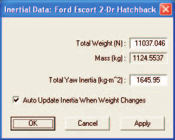

*Figure 5-3: Vehicle Inertias dialog, used for editing the current weight and yaw inertia.*

> NOTE: It is important to be able to manipulate (pan and zoom) the objects in the current viewer. Refer to the User's Manual (see Window Manager Basics) for more information.

Now, let's change the color, weight and stiffness of the Nissan Sentra:

1. Click on *Nissan Sentra* in the Active Vehicles list, making it the current vehicle. The Nissan Sentra is now displayed in the Vehicle Editor.
2. Click on the CG and choose *Color*. The Vehicle Color dialog is displayed. The vehicle's color is fine, but we need to darken it. To darken the vehicle, click on the intensity slider and drag it to the middle of the range.
3. When the color is to your liking, close the dialog by clicking the close button on the upper right corner of the dialog.

Next, let's change the Nissan's weight:

1. Click on the CG and choose *Inertias*. The Inertias dialog is displayed.
2. In the *Total Weight* text field, replace the existing weight, `10858` Newtons, with the measured value, `11282` Newtons.

   > NOTE: Again, the value displayed in the dialog may contain extra precision, for reasons explained earlier.

3. If not already selected, click the checkbox for *Auto Update Inertia When Weight Changes*.
4. Press *OK* to accept the weight value and update the Total Yaw Inertia of the vehicle.

Finally, let's change the stiffness of the vehicle. From a previous reconstruction analysis, the A and B stiffnesses were re-calculated in order to balance the forces (the technique is described in references [20] and [21]). Based on this analysis, a new $K_v$ stiffness was calculated.

1. Click on the front side surface icon (red sphere). The CG to Front dialog is displayed.
2. Click *Stiffness*. The Stiffness Coefficients dialog for the front surface is displayed, as shown in Figure 5-4.

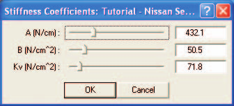

*Figure 5-4: Vehicle Stiffness dialog, used for editing the current A, B and Kv stiffness coefficients for the current surface. Note that EDSMAC uses the front side value of Kv for the entire vehicle.*

> NOTE: It is obviously of great importance to recognize that EDSMAC assumes the stiffness is uniform about the exterior of the vehicle, and that EDSMAC uses the value assigned for the FRONT surface.

To edit the current $K_v$ stiffness value:

1. In the $K_v$ Stiffness field, replace the current value, `71.8`, with the calculated value, `89.2` N/cm².
2. Click *OK* to update the stiffness.
3. Click *OK* again to remove the CG to Front dialog.

The Nissan Sentra is now ready for use in our tutorial. Using the viewer controls (thumb wheels and manipulators), view the vehicle.

Now, we have both vehicles ready for our study.

## Saving the Case

Now that we've created vehicles for our case, let's save the case file.

1. Click on the *File* menu and choose *Save*. The Save-as File Selection dialog is displayed.

   > NOTE: If you began this case using the EDCRASH Tutorial, your case will be saved using the existing filename, EdcrashTutorial.

   > NOTE: If you started this tutorial as a new case, the Save-as dialog is displayed because the case has not been saved previously, so we need to enter a filename. Continue with the following steps.

2. In the Case Title text field, enter `EDSMAC Tutorial, Visibility Study`.

   > NOTE: The Case Title is displayed as a heading on all printed output reports.

3. In the Filename text field, enter `EDSMACTutorial`.
4. Click *SAVE*. The current case data are saved in the `/supportFiles/case` subdirectory.

   > NOTE: Saving the file occasionally is a highly recommended practice.

## Creating the Environment

Now, let's add the environment:

1. Choose *Environment Mode*. The Environment Editor is displayed.
2. Click on *Add New Object*. The Environment Information dialog is displayed.
3. Using the Location Database combo box, choose *Sydney, NSW, Australia*. The latitude (35.30.00S), longitude (151.10.00E) and GMT, hours from the prime meridian (+10) are displayed for the selected location.

   > NOTE: If Sydney were not included in your Location Database, you could add it simply by typing in a new location name, latitude, longitude and GMT.

4. Edit the name for the accident site, `Blind Intersection`.
5. Edit the date and time of the incident we are studying, `7/23/97` and `1330`, respectively.
6. Edit the angle from *true north* to the earth-fixed X axis in our environment, `-10` degrees.

   > NOTE: The Latitude, Longitude, GMT, Date/Time and angle from true north are used to position the sun in the scene. This is, of course, important because the sun is the primary light source for the scene.

7. To add the environment geometry file to our case, click on *Open*. The Environment Geometry File Selection dialog is displayed.
8. Assure that the *Files of Type* option is set to *HVE Geometry Files (\*.h3d)*. A list of environment geometry files using the .h3d file format is displayed in a list box. Double-click on *EdcrashEdsmacTutorial_2D.h3d* to choose the environment file and remove the dialog.
9. Press *OK*.

The selected environment is added to our case and displayed in the Environment Viewer (see Figure 5-5). Use the viewer thumb wheels to view the scene.

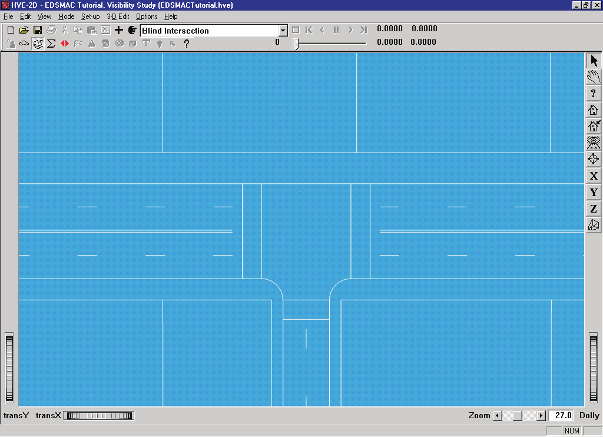

*Figure 5-5: Environment used for our EDSMAC tutorial.*

## Creating Events

As mentioned at the outset, this EDSMAC tutorial is an avoidability study in which visibility plays a key role. With this in mind, we will start simulating the event well before impact to illustrate the visibility between vehicles, as obstructed by the building on the southwest corner of the intersection.

To create the event, perform the following steps:

1. Choose *Event Mode*. The Event Editor is displayed.
2. Click on *Add New Object*. The Event Information dialog is displayed.
3. Select *Ford Escort* and *Nissan Sentra* from the Active Vehicles list. The vehicles are added to the Event Humans and Vehicles list.
4. Select *EDSMAC* from the *Calculation Method* options list.
5. Enter a name for the event, `Visibility Study`.

   > NOTE: The name of the calculation method will be appended to the event name, thus the complete event name will become "EDSMAC, Visibility Study."

6. Press *OK* to display the event editor.

Now, we're ready to set up the event. This step involves placing the vehicles in the environment and assigning driver controls:

1. Select *Ford Escort* from the Event Humans & Vehicles list.
2. Choose *Set-up* from the menu bar, select *Position/Velocity*. The Escort is displayed in its initial position at the earth-fixed origin.
3. Click on the vehicle's X-Y manipulator (see Figure 5-6), wait for it to turn bright yellow (indicating it has been selected), and drag it to its initial position, X=`35` m, Y=`15` m. Click the yaw manipulator and rotate it to its heading angle, `180` degrees.

   > NOTE: To select the X-Y manipulator, the viewer must be in Pick mode, as indicated by the highlighted arrow in the upper right corner of the viewer (see Figure 5-6).

   > NOTE: Adjust the viewer by dollying back (using the Dolly thumb wheel) until you can see the entire intersection.

   > NOTE: Be sure to keep the mouse button depressed while you drag the manipulators.

   > NOTE: If you can't position the vehicle at the exact coordinates, simply enter them in the dialog (in fact, it's often easier to directly enter the coordinates using the dialog).

   > NOTE: When entering coordinates using the Position/Velocity dialog, remember to press \<Enter\>; otherwise, the values will not be assigned.

4. Click the *Velocity Is Assigned* checkbox. Enter the initial total velocity, `40` km/h, followed by *Apply* (or simply press \<Enter\>).

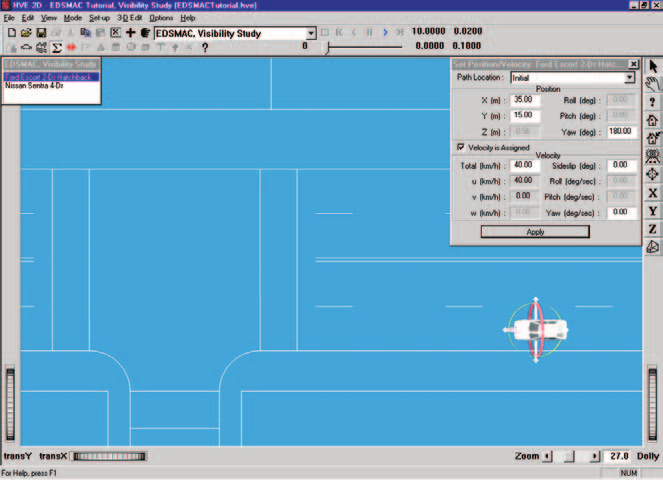

*Figure 5-6: Positioning the Ford Escort using the Event Editor. The manipulators can be used to drag and drop the vehicle into position. Click on the cross-bars to drag the vehicle on the road surface; click on the circular yellow ribbon to rotate the vehicle about its yaw axis.*

Next, let's enter the driver controls:

1. Choose *Set-up* from the menu bar, select *Driver Controls*. The Driver Controls dialog is displayed. The default driver control table, *Steering*, is also displayed for editing.

   > NOTE: Two Steer Table options are available: 'At Steering Wheel' and 'At Axle'. We'll use the default method, 'At Steering Wheel'.

2. Enter the values shown in Table 5-1 into the steer table.

**Table 5-1. Steer table entries for the Ford Escort.**

| Time (sec) | Steer Angle at Steering Wheel (degrees) |
|---|---|
| 1.50 | 0.0 |
| 2.00 | 90.0 |

Next, let's assign the Brake Table for the Ford Escort:

1. Click the *Brake* tab on the Driver Controls dialog. The Brake dialog is displayed for the Ford Escort.

   > NOTE: Two Brake Table options are available: 'Available Friction' and 'Wheel Force'. We'll use the default method, 'Available Friction'.

2. Enter the Escort's brake table using the *% Available Friction* (default) method — enter the values shown in Table 5-2 into the table.
3. Click *OK* to accept the Ford Escort's steering and brake tables.

**Table 5-2. Brake table for Ford Escort.**

| Time (sec) | R/F | L/F | R/R | L/R |
|---|---|---|---|---|
| 2.25 | 0.00 | 0.00 | 0.00 | 0.00 |
| 2.35 | 1.00 | 1.00 | 1.00 | 1.00 |
| 2.70 | 1.00 | 1.00 | 1.00 | 1.00 |
| 2.80 | 1.00 | 1.00 | 0.01 | 0.01 |

*(Percent Available Friction, %/100)*

Event set-up for the Ford Escort is now complete. Let's set up the Nissan Sentra:

1. Select the Nissan Sentra from the Event Humans and Vehicles list.
2. Choose *Set-up* from the menu bar, select *Position/Velocity*. The Nissan is displayed at its initial position at the earth-fixed origin.
3. Click on the vehicle's X-Y manipulator (see Figure 5-7), wait for it to turn bright yellow (indicating it has been selected), and drag it to its initial position, X=`3.5` m, Y=`39` m. Click the yaw manipulator and rotate it to its heading angle, `-90` degrees.

   > NOTE: Be sure to keep the mouse button depressed while you drag the manipulators.

4. Click the *Velocity is Assigned* check box and enter the initial velocity, `35` km/h, followed by \<Enter\>.

   > NOTE: Remember to press Apply or \<Enter\>. Otherwise, the value will not be assigned.

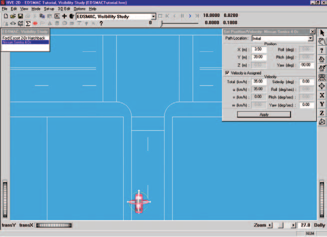

*Figure 5-7: Positioning the Nissan Sentra using the Event Editor.*

The Nissan's initial position and velocity are now established. Let's enter the driver controls. In this case, there are no driver inputs, per se. However, after impact the vehicle coasts to rest, so we need to enter rolling resistances:

1. Choose *Set-up* from the menu bar, and select *Driver Controls*. The Driver Controls dialog is displayed.
2. Click the *Brake* tab. The Brake Table is displayed.
3. Click on the *Table Is* option list and choose the *Available Friction* option.
4. Enter the rolling resistances after impact, as shown in Table 5-3.
5. Press *OK* to accept the table.

**Table 5-3. Post-impact rolling resistances for the Nissan Sentra.**

| Time (sec) | R/F | L/F | R/R | L/R |
|---|---|---|---|---|
| 2.70 | 0.00 | 0.00 | 0.00 | 0.00 |
| 2.80 | 0.20 | 0.20 | 0.01 | 0.01 |

*(Percent Available Friction, %/100)*

This event lasts more than 5 seconds. To prevent premature termination, let's increase the default maximum simulation time.

1. Click on the Options menu and choose *Simulation Controls*. The Simulation Controls dialog is displayed.
2. Edit the *Maximum Time*, changing it from `5` to `10` seconds.
3. Press *OK* to update the simulation controls.

Now, we're ready to position the camera to view the event.

- Use the viewer controls (thumb wheels, zoom slider and direct *hand-in-viewer* manipulator) to set the view similar to that shown in Figure 5-8.

Next, let's set up the Key Results windows:

- If Key Results windows are not displayed, choose *Show Key Results* from the Options menu.
- Drag the Key Results windows to a convenient location, where they do not block the view but still allow us access to the viewer thumb wheel controls (in case we want to change the view).

Now, we're ready to execute the event.

- Using the Event Controller, press *Play* to execute the event.

Watch as the vehicles approach each other, collide, and roll to their rest positions.

> NOTE: You can adjust the view while the event is executing, or you can press Pause/Stop to temporarily stop the event while setting the view, then press Play to continue it.

> NOTE: Remember to pay attention to the Key Results windows; in this case, you might be interested in the position and velocity of each vehicle at initial visibility.

We have now completed the event.

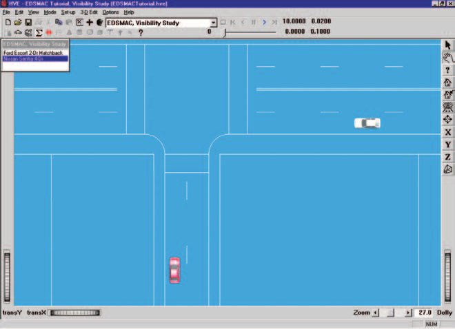

*Figure 5-8: Overall view of the scene after event set-up is complete.*

## Viewing Results

Now that we have produced our EDSMAC simulations, let's take a detailed look at the results. The Playback Editor is used for reviewing and printing reports for each event in the current case, as well as for producing video output.

EDSMAC produces the following reports:

- **Accident History** — A table of initial, impact, separation and final positions and velocities for each vehicle
- **Damage Data** — A table of damage profile coordinates, CDC, PDOF, Delta-V and Peak Acceleration for each vehicle
- **Damage Profiles** — A 3-D visualization of the damage to each vehicle, linked to the Playback Controller
- **Messages** — A list of messages produced by the current run
- **Program Data** — A table containing program control information
- **Trajectory Simulation** — A 3-D visualization of the event, displayed at a user-selectable time interval
- **Variable Output** — A table containing user-selectable, time-dependent simulation results for each vehicle
- **Vehicle Data** — Tables containing all of the vehicle data and driver control data used by the simulation

To view the output reports, we need to be in Playback mode:

- Choose *Playback Mode*. The Playback Editor is displayed.

### Report Windows

The reports listed above are displayed by selecting Report Windows. Each Report Window contains an individual report.

To view the reports produced by the *EDSMAC, Visibility Study* event, perform the following steps:

1. Choose Playback Mode. The Playback Editor is displayed.
2. Click *Add New Object*. The Report Window Information dialog is displayed, as shown in Figure 5-9, and includes a list of the active events (*EDSMAC, Visibility Study* is the only event in this tutorial). The Report Window Information dialog also includes the user-editable *Report Window Name* text field and *Selected Output* option list.
3. Select *EDSMAC, Visibility Study* from the Active Events list.
4. Click on the *Select Output* option list and choose any of the available reports.
5. Press *OK* to display the report.

The selected report will be displayed in a resizable window. The following pages illustrate the reports produced for the *EDSMAC, Visibility Study* event.

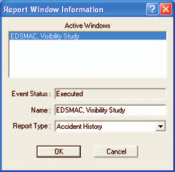

*Figure 5-9: Report Window Information dialog, showing the name of the event(s) in the current case.*

### Accident History

The Accident History report displays the positions and velocities for each vehicle at key times (Start of Run, Impact, Separation and Final/Rest) during the run.

To view the Accident History report for the *EDSMAC Visibility Study* event, perform the following steps:

1. Click *Add New Object*. The Report Window Information dialog is displayed.
2. Select *EDSMAC, Visibility Study* from the Active Events list.
3. Click on the *Select Output* option list and choose *Accident History*.
4. Press *OK*.

The Accident History report is displayed for the *EDSMAC, Visibility Study* event, as shown in Figure 5-10.

> NOTE: The vehicles are listed in the order in which they were selected when creating the event. This is the same order in which they appear in the active objects list in the Event Editor.

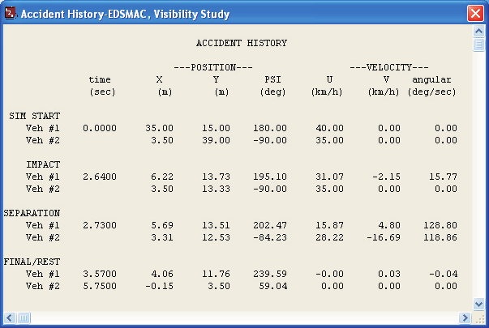

*Figure 5-10: Accident History Report for EDSMAC, Visibility Study.*

### Damage Data

The Damage Data report displays a table of collision vector results for each vehicle. The collision vectors determine the total force on each vehicle. In addition, the endpoints of the collision vectors define the damage profile.

The collision vectors are displayed both in cylindrical coordinates (RHO, PSI) and Cartesian coordinates (x,y).

Following the table of collision vectors, the Damage Ranges are displayed. The Damage Ranges report includes the beginning and ending point for each damaged region on the exterior (up to 10 regions may be displayed for each vehicle), followed by the CDC, PDOF, Delta-V and Peak Acceleration for each damage region.

To view the Damage Data report for the *EDSMAC Visibility Study* event, perform the following steps:

1. Click *Add New Object*. The Report Window Information dialog is displayed.
2. Select *EDSMAC, Visibility Study* from the Active Events list.
3. Click on the *Select Output* option list and choose *Damage Data*.
4. Press *OK*.

The Damage Data report is displayed for the *EDSMAC, Visibility Study* event, as shown in Figure 5-11.

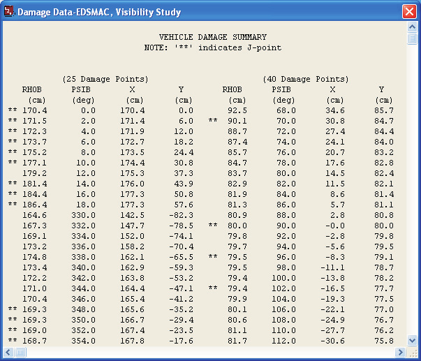

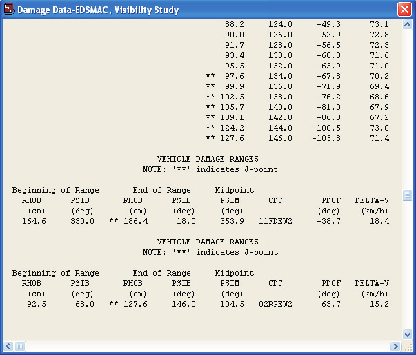

*Figure 5-11: Damage Data Report for EDSMAC, Visibility Study. The two images show the top and bottom portions of the report which contain important information about the event.*

### Damage Profiles

The Damage Profiles report provides a visual representation of the damage to each vehicle. This report is linked to the Playback Controller through the Trajectory Simulation. Therefore, in order to see any damage in the Damage Profiles report window, you must first open a Trajectory Simulation for the event.

To view the Damage Profiles report produced by the *EDSMAC, Visibility Study* event, perform the following steps:

1. Click *Add New Object*. The Report Window Information dialog is displayed.
2. Select *EDSMAC, Visibility Study* from the Active Events list.
3. Click on the *Select Output* option list and choose *Damage Profiles*.
4. Press *OK*.

With a Trajectory Simulation also open, use the Playback Controller to view the damage to each vehicle dynamically.

The Damage Profiles simulation for the Nissan Sentra in *EDSMAC, Visibility Study* is shown in Figure 5-12.

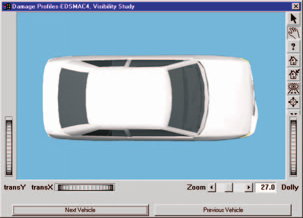

*Figure 5-12: Damage Profile Report for Nissan Sentra in EDSMAC, Visibility Study.*

### Messages

EDSMAC produces several messages, depending on the outcome of the run. For a complete list and explanation of these messages, refer to [Chapter 6](06-messages.md).

To view the Messages report produced by the *EDSMAC, Visibility Study* event, perform the following steps:

1. Click *Add New Object*. The Report Window Information dialog is displayed.
2. Select *EDSMAC, Visibility Study* from the Active Events list.
3. Click on the *Select Output* option list and choose *Messages*.
4. Press *OK*.

The Messages report for the *EDSMAC, Visibility Study* event is shown in Figure 5-13.

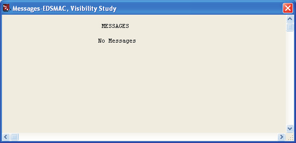

*Figure 5-13: Messages Report for EDSMAC, Visibility Study.*

### Program Data

The Program Data report displays the simulation controls (integration time steps and termination conditions), collision parameters used by the EDSMAC collision algorithm and the hard-coded values (RHOB Tests) used to determine if a vector passes through the end (front or back) or side (left or right).

To view the Program Data report for the *EDSMAC, Visibility Study* event, perform the following steps:

1. Click *Add New Object*. The Report Window Information dialog is displayed.
2. Select *EDSMAC, Visibility Study* from the Active Events list.
3. Click on the *Select Output* option list and choose *Program Data*.
4. Press *OK*.

The Program Data report is displayed for the *EDSMAC, Visibility Study* event, as shown in Figure 5-14.

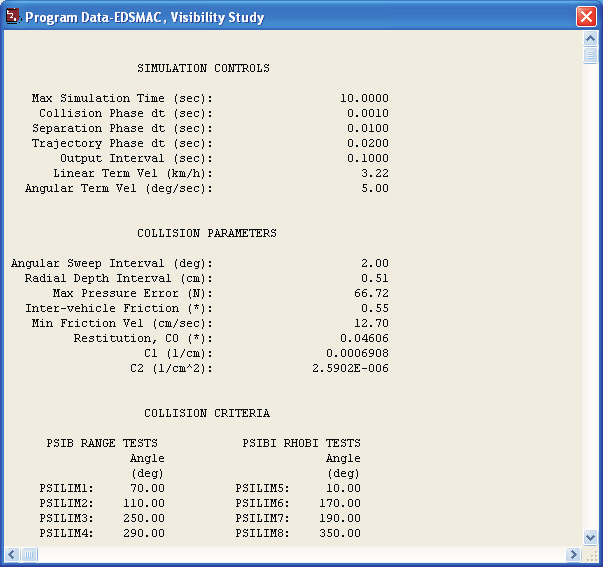

*Figure 5-14: Program Data Report for EDSMAC, Visibility Study.*

### Trajectory Simulation

The Trajectory Simulation report is a dynamic visualization, much like the Event mode viewer, controlled by the Event Controller.

> NOTE: A significant difference between the simulation in the Event Editor and the Playback Editor is that no calculations take place in Playback mode.

To view the Trajectory Simulation for the *EDSMAC, Visibility Study* event, perform the following steps:

1. Click *Add New Object*. The Report Window Information dialog is displayed.
2. Select *EDSMAC, Visibility Study* from the Active Events list.
3. Click on the *Select Output* option list and choose *Trajectory Simulation*.
4. Press *OK*.

The Trajectory Simulation viewer is displayed for the *EDSMAC, Visibility Study* event. The vehicles are shown at their initial positions.

To visualize the motion, perform the following steps:

1. Click *Play* (single right-arrow). The simulation begins and is displayed at the current Playback output interval.
2. Click *Pause*. The simulation stops.
3. Click *Reverse* (single left-arrow). The simulation plays in reverse.
4. Click *Pause*. The simulation stops.
5. Click *Rewind* (left arrow with bar). The simulation returns to the start.

Click *Advance to End* (right arrow with bar) — the simulation advances to the end of the run.

The Trajectory Simulation for *EDSMAC, Visibility Study* is shown in Figure 5-15.

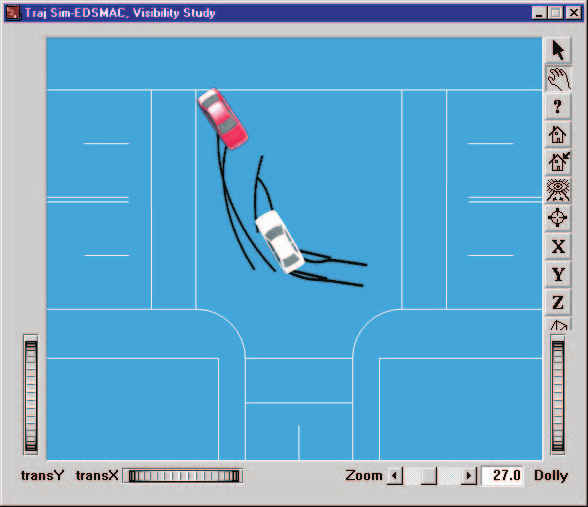

*Figure 5-15: Trajectory Simulation for EDSMAC, Visibility Study, displaying the crash sequence at the end of the event.*

### Variable Output

The Variable Output table displays all the time-dependent results computed by EDSMAC. To view the Variable Output report for the *EDSMAC, Visibility Study* event, perform the following steps:

1. Click *Add New Object*. The Report Window Information dialog is displayed.
2. Select *EDSMAC, Visibility Study* from the Active Events list.
3. Click on the *Select Output* option list and choose *Variable Output*.
4. Press *OK*.

The Variable Output report is displayed for the *EDSMAC, Visibility Study* event. The next step is to select the time-dependent results we wish to display in the table.

#### Variable Selection

The purpose of our EDSMAC study is to evaluate the avoidability of the accident based on speeds and visibility. To document the path positions as a function of time, let's select the position, velocity and acceleration from the Variable Selection dialog.

1. Click on *Select Variables* in the Variable Output window. The Variable Selection dialog is displayed, as shown in Figure 5-16.

The Object Name option list displays the first vehicle, *Ford Escort 2-Dr Hatchback*. The *Kinematics* output group is the default selection and the Kinematics Variables list is displayed. Let's add X, Y, Yaw, $V_{total}$ and Accel total to the Key Results window:

2. Select *X, Y, Yaw, V-tot* and *Acc-tot* from the list.

Next, let's add the same parameters for the Nissan Sentra:

3. Click on the *Object Name* option list and choose *Nissan Sentra 4-Dr*. The Kinematics variable list is displayed.
4. Select *X, Y, Yaw, V-tot* and *Acc-tot* from the list.

   > NOTE: Feel free to add additional variables to the Variable Output window.

5. Press *OK* to add the selected variables to the Variable Output window.

The Variable Output report for the *EDSMAC, Visibility Study* event now includes position, velocity and acceleration for both vehicles, plus any other variables you may have added (see Figure 5-17).

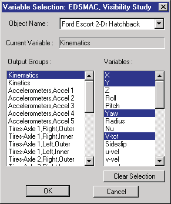

*Figure 5-16: Variable Selection dialog, used for selecting the results displayed in the Output Report.*

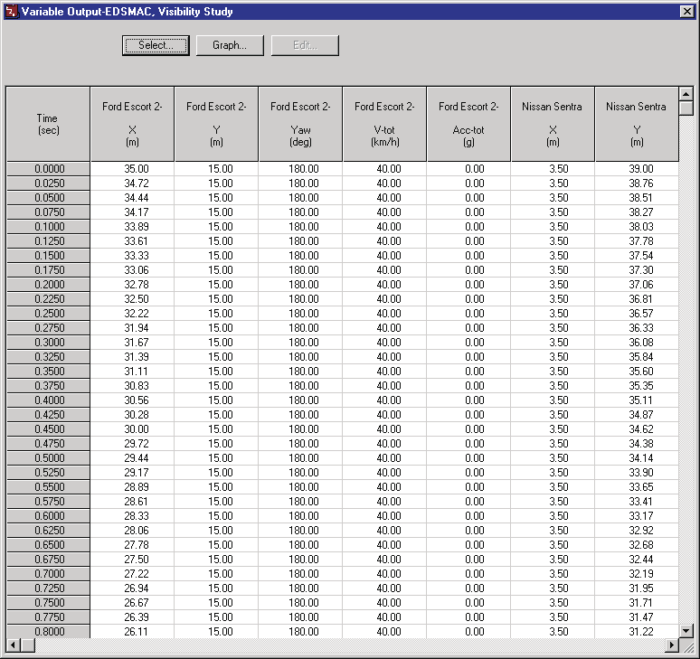

*Figure 5-17: Variable Output report for EDSMAC, Visibility Study, displaying the selected results.*

### Vehicle Data

The Vehicle Data report displays the vehicle data, tire data and driver tables for each vehicle in the event.

To view the Vehicle Data report for the *EDSMAC, Visibility Study* event, perform the following steps:

1. Click *Add New Object*. The Report Window Information dialog is displayed.
2. Select *EDSMAC, Visibility Study* from the Active Events list.
3. Click on the *Select Output* option list and choose *Vehicle Data*.
4. Press *OK*.

A portion of the Vehicle Data report is displayed for *EDSMAC, Visibility Study* in Figure 5-18.

> NOTE: The Vehicle Data, Damage Data (previous pages) and several other reports contain more information than fits into the default window size. Use the scroll bars, resize the dialog, or adjust the font size to view the entire report.

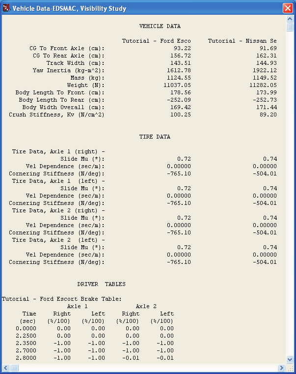

*Figure 5-18: Vehicle Data Report for EDSMAC, Visibility Study. Only a portion of the report is displayed; use the scroll bars to review the remaining report.*

### Printing

The final step is to print the above reports. Printing reports is simple. All you do is choose a report and print it. For example:

1. Click on the *Variable Output - EDSMAC, Visibility Study* report window. The window is highlighted and pops to the top of the display (if it isn't there already), indicating it is the current window.
2. Click on the *File* menu and choose *Print*. The Print dialog is displayed, allowing the user to select from several available print options.

   > NOTE: Alternatively, you can click on the print icon in the main menu bar.

3. Press *OK*. The Variable Output report is printed on the system printer.

That's all there is to it! You can print any other report using the same three steps described above.

> NOTE: The Print dialog provides several options. Refer to your Windows or printer manual for more information.

> NOTE: For several reports it may be best to print in landscape rather than portrait mode.

> NOTE: The font size of both the printed reports and screen display may be edited by clicking on the Options menu and choosing Preferences. Use the Font Size option list to change the size.

---

[Previous: Chapter 4 — Calculation Method](04-calculation-method.md) | [Next: Chapter 6 — Messages](06-messages.md)

<!-- NAV -->

---

← Previous: [Chapter 4 — Calculation Method](04-calculation-method.md)  |  [Index](README.md)  |  Next: [Chapter 6 — Messages](06-messages.md) →

<!-- /NAV -->
