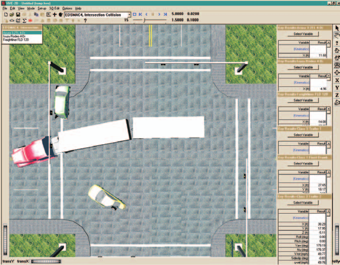

# Chapter 1 — EDSMAC4 Program Description

## Overview

EDSMAC4 (Engineering Dynamics Corporation Simulation Model of Automobile Collisions, 4th Revision) is a simulation analysis of single- or multiple-vehicle crashes. It is based on the program called SMAC [1,2,3,4,5], developed at Calspan for NHTSA, and includes several major extensions and enhancements developed by Engineering Dynamics Corporation [6,7]. EDSMAC4 uses a set of assumed or estimated initial conditions, including positions, velocities and driver controls, provided by the user for each vehicle. EDSMAC4 then predicts the outcome of a crash by simulating the vehicle trajectories and damage profiles.

The output generated by EDSMAC4 is a time history of the vehicle kinematics (position, velocity, and acceleration), kinetics (summation of tire and collision forces and moments acting at the CG), and tire skidmarks for the duration of the crash sequence. The program also computes the resulting damage profiles, the Collision Deformation Classifications, or CDC (see reference 8; also refer to your EDCRASH Physics manual, Program Inputs), Principal Direction of Force, or PDOF (again, see reference 8), delta-V (a measure of crash severity) and peak acceleration for each damage range. EDSMAC4 also produces a collision pulse (acceleration vs time history) useful for occupant simulations, such as EDHIS.

Accident investigators can use EDSMAC4 to determine how the crash may have occurred. By repeated adjustments of the initial conditions and driver braking (or acceleration) and steering inputs, the user will converge on the data that best match the known accident site evidence (usually rest positions, skidmarks, and vehicle damage).

*Figure 1-1: Typical EDSMAC4 Event, showing a complex intersection event involving several vehicles, with Key Results windows along the right edge of the 3-D viewer.*

In addition to vehicle-to-vehicle collisions, EDSMAC4 may also be used for many types of barrier collisions, including pole impacts. Specific procedures are provided in [Chapter 2](02-program-input.md).

Users of EDCRASH will find it convenient to first analyze the accident using EDCRASH to estimate the impact speeds, then use these speeds as the initial conditions for the EDSMAC4 program. The resulting confirming analysis is both very complete and very powerful.

Accident researchers can use EDSMAC4 to simulate an actual staged collision test. This can be done before the test in order to predict or anticipate the results and help during test preparations. Test parameters may be adjusted based on EDSMAC4 results to help ensure the test is successful. After the test, the researcher can note the differences between the actual and simulated collision and modify the EDSMAC4 input in order to obtain a better match.

An extremely useful feature of EDSMAC4 is the ability to quickly and easily review the results associated with different input scenarios. Termed *what if* analysis, changes can be made to an isolated variable or set of variables in order to identify their effect on the outcome. Only the inputs that change need to be modified; the program saves all the previously entered information. For example, the sensitivity of the results to initial velocity, or post-impact driver control, can be studied by merely changing those parameters.

Another useful feature of the program is the ability to display the results in 3-D viewers. These trajectory simulations display the vehicles at user-specified time intervals during the sequence. Using the Playback Editor, it is simple and easy to create a digital movie file.

## Model Inputs

EDSMAC4 inputs include one or more vehicles, and an optional environment with terrain geometry. Event set-up parameters include vehicle initial positions and velocities and driver controls (steering, brakes and throttle).

## Model Outputs

EDSMAC4 output reports include Accident History, Damage Data, Driver Data, Environment Data, Event Data, Messages, Program Data, Vehicle Data, Variable Output, Trajectory Simulations and Damage Profile Simulations. The acceleration vs time history provides a collision pulse available for use in any HVE-compatible occupant impact simulator.

## Validation

EDSMAC4 was validated first by direct comparison with earlier versions of EDSMAC to ensure the basic model was intact after porting the original codes to the C programming language and making the model HVE-compatible. Additional validation was performed comparing EDSMAC4 results to other models, as well as direct comparison with controlled collision experiments [24].

## HVE-2D and HVE

EDSMAC4 is compatible with both HVE-2D and HVE. While EDSMAC4 has been extended and revalidated for use in the HVE environment to account for 3-D terrain, EDSMAC4 is essentially a 2-dimensional physics simulation program.

If you are using EDSMAC4 within the HVE environment, the Human, Vehicle, and Environment Editors will have additional features that are not available in HVE-2D. These features are described in great detail in the HVE User's Manual. While some dialogs do look different between HVE-2D and HVE, the required input for EDSMAC4 is found in both. Where there are differences related to the use of EDSMAC4, these differences are noted in this manual.

## Basic Procedure

The procedure for using EDSMAC4 is substantially the same as using any simulator in the HVE-2D or HVE environment:

1. Use the Vehicle Editor to add one or more vehicles to the case.
2. Optionally, use the Environment Editor to create a visual and physical environment.
3. Use the Event Editor to set up and execute the EDSMAC4 simulation model by performing the following steps:
   - Choose one or more vehicles from the list of vehicles created earlier.
   - Choose the EDSMAC4 calculation model.
   - Position the vehicle(s) in the environment, and assign velocities.
   - Assign driver controls (Steering, Braking, Throttle) to each vehicle.
   - Execute the simulation event, comparing the simulation results with actual or measured results.
4. Modify the inputs as required to achieve the desired match between the simulation and the actual event.

Finally, use the Playback Editor to view the various reports and trajectory simulations. If desired, include the event along with other events in the Playback Window and produce a digital movie of the simulation.

---
*Next: [Chapter 2 — EDSMAC4 Program Input](02-program-input.md)*

<!-- NAV -->

---

← Previous: [EDSMAC4 — Multi-Vehicle Collision Simulator](README.md)  |  [Index](README.md)  |  Next: [Chapter 2 — EDSMAC4 Program Input](02-program-input.md) →

<!-- /NAV -->
