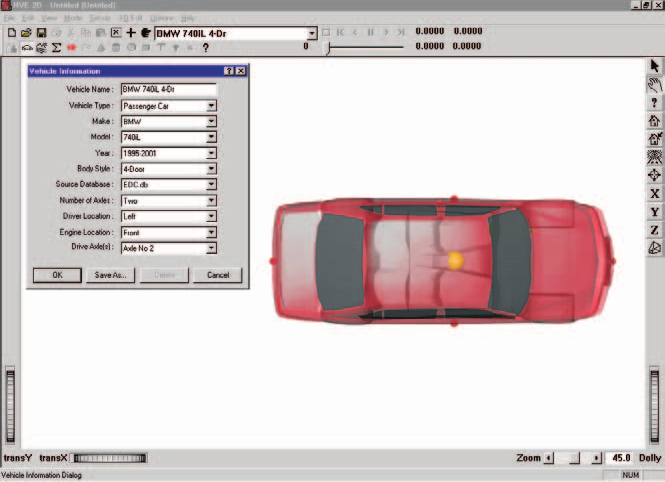
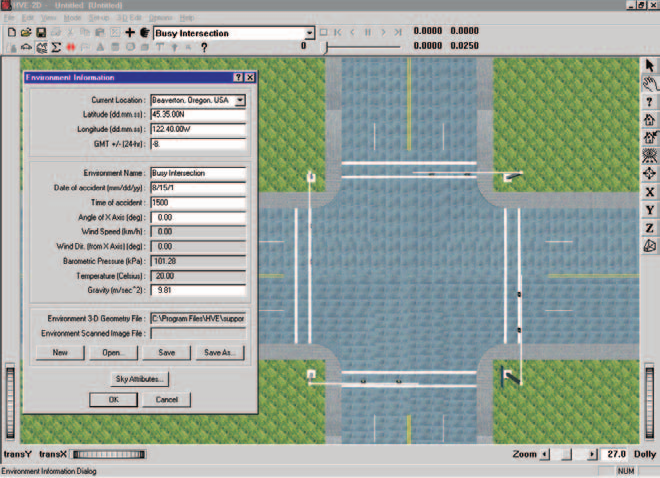
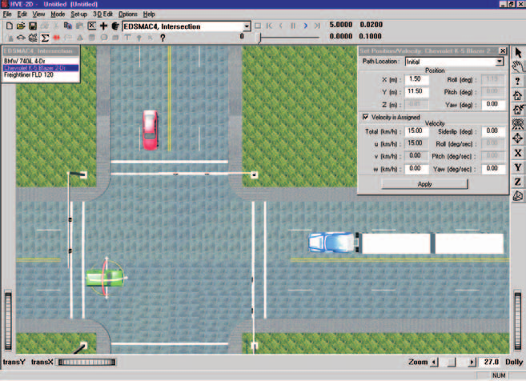
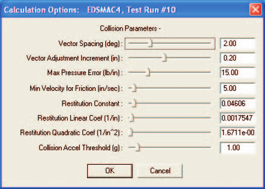
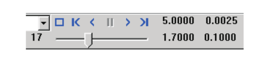

# Chapter 2 — EDSMAC4 Program Input

This chapter defines the objects (vehicles and environment) and the event set-up parameters (positions, driver controls, and so forth) used by the EDSMAC4 analysis. In general, the chapter is divided into the following sections:

- **Objects** — The number of vehicles, and the specific vehicle parameters actually used by EDSMAC4.
- **Events** — The various options available for setting up and executing an EDSMAC4 event.

## Objects Overview

The objects used by the EDSMAC4 model are:

- **Vehicles** — One or more vehicles may be studied by EDSMAC4. The maximum number of vehicles in a single EDSMAC4 event is 20 (`MAXVEH` in `Physics/Source/Edsmac4/SMADEF.H`).
- **Environment** — Like the real world, EDSMAC4 has exactly one environment.

> **NOTE:** The environment is used in any reconstruction or simulation model.

The following sections describe how the vehicle and environment provide the required inputs to the EDSMAC4 calculation model.

## Vehicles

EDSMAC4 uses one or more vehicles created using the Vehicle Editor. Vehicles are selected from the Vehicle Database by choosing the following attributes:

- **Type** — EDSMAC4 supports the following vehicle types: Passenger Car, Pickup, Sport-Utility, Van, Truck, Trailer, Dolly, Fixed Barrier and Movable Barrier.
- **Make** — EDSMAC4 supports all available vehicle makes.
- **Model** — EDSMAC4 supports all available vehicle models, within the limits defined by number of axles and drive axles; see below.
- **Year** — EDSMAC4 supports all available vehicle years.
- **Body Style** — EDSMAC4 supports all available vehicle body styles (except Class 2 Hinged Drawbar Dolly).

Each vehicle also has the following additional user-editable parameters:

- **Driver Location** — The Driver Location is not used by EDSMAC4. However, if you would like the vehicle to have any steerable axles, Driver Location must not be None.
- **Engine Location** — The Engine Location is not used by EDSMAC4. However, if you would like the Throttle Table to be available during Event mode, Engine Location must not be None.
- **Number of Axles** — EDSMAC4 supports 1-, 2- or 3-axled vehicles.
- **Drive Axle(s)** — The Drive Axle is used by EDSMAC4 to determine which wheels to include in the Throttle Table during Event mode.

To add a vehicle to the current case, perform the following steps:

1. Choose Vehicle Mode. The Vehicle Editor is displayed.
2. Choose Add New Object. The Vehicle Information dialog is displayed.
3. Click on the Type, Make, Model, Year and Body Style option buttons to select a vehicle from the database.
4. If desired, modify the Driver Location, Engine Location, Number of Axles and Drive Axle(s) for the current vehicle.
5. Enter a name for the current vehicle. A default name is supplied for each selected vehicle. Its name is user-editable, and does not affect calculations.

   > **NOTE:** Duplicate vehicle names are not allowed in the same case.

6. Click OK to add the vehicle to the current case.

*Figure 2-1: Vehicle Editor.*

The following Vehicle Parameter groups are assigned using the Vehicle Editor:

- Sprung Mass — Inertias, Move CG, Inter-vehicle Connections
- Unsprung Mass — Wheel Location, Tire Data, Suspension Data
- Exterior — Overall Dimensions, Stiffness Coefficients
- Steering System

The specific data used in each of the above parameter groups are defined in Tables 2-1 through 2-3.

### Sprung Mass

**Table 2-1: Vehicle Sprung Mass Parameters Used By EDSMAC4**

| Parameter | Description |
|---|---|
| Total Weight | Total vehicle weight |
| Total Yaw Inertia | Rotational inertia about the vehicle-fixed z axis |
| Move CG x,z | Relocates the CG in the vehicle-fixed x and z directions. This entry causes an automatic adjustment of all other vehicle dimensions to reflect the new CG location. |
| Inter-vehicle Connections (x, y, z, Max Articulation Angle) | Vehicle-fixed x,y,z connection coordinates; Maximum Articulation Angle (rear connection) |

#### Inertias

EDSMAC4 uses the total vehicle weight (converted to mass according to the current gravitational constant; see Environment), and the total yaw rotational inertia.

#### Move CG

Move CG is not used directly by EDSMAC4. Its current value does not show up in the results. However, the Move CG fields may be used to quickly move the vehicle's center of gravity. The x and z coordinates for the wheels are updated to reflect the new CG location.

> **NOTE:** Bilateral symmetry is assumed. In HVE, moving the CG in the +y or −y direction will have no effect on the EDSMAC4 calculations.

#### Geometry File

The Geometry File is not used by EDSMAC4 for physics calculations (it is used for visualization, tessellation in the Vehicle Mesh dialog, and — in the current version — optionally for initializing the collision perimeter; see the **Use Vehicle Geometry for Rho Vector Init** calculation option). *(updated: the current EDSMAC4 can derive initial RHO vector lengths from the vehicle body mesh when this option is checked; see [EDSMAC4 Calculation Options](../../10-calculation-options/CalcOptEDSMAC4.md).)*

#### Inter-vehicle Connections

EDSMAC4 uses the x,y,z Connection Locations when articulated vehicles are simulated. The Maximum Articulation Angle is also used.

The Connection y coordinate is user-editable only in HVE.

> **NOTE:** Every trailer will have a pre-defined front connection. However, not every tow vehicle has a pre-defined rear connection. Use the Vehicle Editor to confirm the vehicle has a connection.

> **NOTE:** Be sure both vehicles have the proper connections (Hitch/Ball or King Pin/Fifth Wheel).

> **NOTE:** The connection elevation above ground must be the same for the tow vehicle and the trailer. Otherwise, the vehicle will accelerate or decelerate on level ground (the 2-D equations of motion have no way of knowing how to handle non-normal tire forces). *(updated: the current version can automatically reconcile mismatched hitch heights at event initialization via the **Inter-Vehicle Connection** calculation option — the hitch z-coordinates are adjusted, not the vehicle positions; see [EDSMAC4 Calculation Options](../../10-calculation-options/CalcOptEDSMAC4.md).)*

### Unsprung Mass

**Table 2-2: Vehicle Unsprung Mass Parameters Used By EDSMAC4**

| Parameter | Description |
|---|---|
| Wheel Location | The vehicle-fixed x,y,z wheel center coordinates |
| Dual Tire | Flag indicating wheel position has dual tires |
| Tire Radius | Tire radius in unloaded condition (editable in HVE) |
| Tire Slide Friction | The slide coefficient of friction for each tire |
| Tire Friction Table, Test Load/Speed | The load and speed for a given set of friction results (EDSMAC4 uses the middle load and middle speed) |
| Friction In-use Factor | Multiplier for slide friction |
| Tire Cornering Stiffness | Tire lateral force per unit of tire lateral slip for small amounts of lateral slip |
| Cornering Stiffness In-use Factor | Multiplier for Cornering Stiffness |

#### Wheel Location

Unlike previous SMAC models, EDSMAC4 uses the values for the vehicle-fixed x,y,z coordinates of each wheel. This allows the researcher to study the effects of wheels displaced by damage (see Event, this chapter).

Within HVE-2D, wheel x and y coordinates may be changed. Bilateral symmetry is enforced. Within HVE, wheel x,y,z coordinates may be changed independently for each wheel.

#### Tire

Single or dual tires may be supplied at each wheel position. The HVE-2D tire parameters provide the following data groups (additional parameters are available in HVE, but they are not used by EDSMAC4):

- Physical Data
- Friction Table
- Cornering Stiffness Table
- Slip-vs-Rolloff Table

EDSMAC4's use of these parameters is described below.

#### Physical Data

EDSMAC4 uses the unloaded tire radius at each wheel to establish the vehicle's static CG elevation. In HVE, tire unloaded radius is user-editable.

#### Friction Table

EDSMAC4 uses the slide friction coefficient.

EDSMAC4's tire model does not incorporate load dependence. If friction data for more than one load are supplied, EDSMAC4 uses the friction coefficient for the middle load.

> **NOTE:** If there is any doubt about which value is actually used by EDSMAC4, you can check the Vehicle Data output report.

EDSMAC4's tire model has the capability to include speed dependence. If friction data are entered for more than one speed, EDSMAC4 calculates a speed dependence factor (see [Chapter 4 — Calculation Method](04-calculation-method.md)).

Friction In-use Factor, available in HVE, is a convenient way to reduce or increase the slide friction value during the entire run for a specific tire.

> **NOTE:** During an event, the actual tire-terrain friction used during the current timestep is the product of the slide friction coefficient, the in-use factor and the terrain friction multiplier for the polygon beneath the tire. Mathematically,
>
> $$\mu_{Tire-terrain} = \mu_{Slide} \times InUseFactor \times Mult_{Polygon}$$

#### Cornering Stiffness Table

EDSMAC4 uses the Cornering Stiffness value.

EDSMAC4 does not use the HVE Fy vs Slip Angle table, but instead uses the cornering stiffness parameter directly. If cornering stiffness data for more than one load and/or speed are supplied, EDSMAC4 uses the cornering stiffness for the middle load and/or speed.

> **NOTE:** If there is any question about which value is actually used by EDSMAC4, you can check the Vehicle Data output report.

Cornering stiffness In-use Factor, available in HVE, is a convenient way to reduce or increase the cornering stiffness value during the entire run for a specific tire. *(The original manual said "slide friction value" here; the factor applies to cornering stiffness.)*

> **NOTE:** If you are simulating a vehicle with a flat tire, you'll probably want to reduce the In-use Factor to about 0.1.

#### Slip-vs-Rolloff Table

EDSMAC4 does not use the Slip-Rolloff data.

#### Suspension

The HVE-2D Suspension Model provides the following data:

- Inter-tandem Load Transfer

EDSMAC4 supports all suspension types, including those with tandem axles. However, the suspension at each wheel is not modeled, per se. Rather, roll couple distribution is used.

**Table 2-3: Vehicle Suspension and Steering Parameters Used By EDSMAC4**

| Parameter | Description |
|---|---|
| Inter-tandem Axle Load Transfer | Rear-to-front inter-axle load transfer due to braking of tandem axles |
| Steering Gear Ratio | Ratio of the angle at the steering wheel to the angle at the wheel |

#### Inter-tandem Axle Load Transfer

If three axles are supplied for the vehicle, the vehicle is assumed to have tandem rear axles. In this case, a longitudinal load transfer due to braking may be simulated by supplying an Inter-tandem Load Transfer Coefficient.

Studies have shown the value of −0.38 to be representative of typical four-spring suspension systems [4]. The negative sign indicates load transfer from the front to the rear axle.

The value for walking beam suspensions with 100% torque rod effectiveness is 0.0 [14]. For non-perfect torque rods with effectiveness less than 100%, the load transfer is:

$$\left(\frac{AAA}{R}\right)\left(\frac{100 - T_e}{100}\right)$$

where:

- $AAA$ = inter-tandem dimension
- $R$ = tire radius
- $T_e$ = torque rod efficiency

#### Brake

EDSMAC4 does not use the (vehicle) Brake data.

### Exterior

EDSMAC4 uses the following Vehicle Exterior Data:

- Exterior Dimensions
- A and B Stiffness Coefficients

**Table 2-4: Vehicle Exterior Parameters Used By EDSMAC4**

| Parameter | Description |
|---|---|
| CG to Front, Right, Back and Left | The vehicle's exterior dimensions |
| A Stiffness Coefficient | The initial deflection constant for each side. This coefficient represents the force per unit of damage width required to initiate damage. |
| B Stiffness Coefficient | The linear spring rate for each side of the crushed surface. This coefficient represents the force required per inch of crush depth per inch of damage width. |

> **NOTE:** Unlike EDSMAC, EDSMAC4 uses individual stiffness values for the front, sides and back. Note also the use of A and B stiffness coefficients, rather than $K_L$, is unique to EDSMAC4.

### Steering System Data

EDSMAC4 uses the Steering System to determine which axles are steerable. Only steerable wheels are displayed in the Driver Controls, Steer Table. In addition, if the Steer Table, At Driver option is used, the steering gear ratio parameter is used to compute the steer angle at each steerable tire.

*(updated: in the current version the Steering System data are also used by the optional dynamic steer degree of freedom — see the **Steer DOF** calculation option in [EDSMAC4 Calculation Options](../../10-calculation-options/CalcOptEDSMAC4.md). When Steer DOF is Normal, Append or AutoStart, steer angles are computed from the torques acting on the steering system rather than taken directly from the steer tables.)*

### Brake System Data

EDSMAC4 does not use the Brake System data.

## Environment

EDSMAC4 uses the environment created by the Environment Editor. The environment is created by defining the following groups of attributes:

- Visual Data
- Physical Data

*Figure 2-2: Environment Editor.*

### Creating an Environment

To add an environment to the current case, perform the following steps:

1. Choose Environment Mode. The Environment Editor is displayed.
2. Click Add New Object. The Environment Information dialog is displayed.
3. Click on the Location combo box to select the desired city, state and country, and associated Latitude, Longitude and GMT.
4. Edit the Time and Date for the event.
5. Edit the Angle of the X Axis, Wind Speed and Direction, Barometric Pressure and Temperature for the event.
6. Edit the Gravity Constant for the event.
7. Edit the environment name. A default name is supplied for the current environment. The name is user-editable, and does not affect calculations.
8. Click OK to add the environment to the current case.

### Visual Data

The following visual parameters may be edited:

- **Environment Location** — A database containing the name (City/State/Country), Latitude, Longitude and GMT for the selected location.
- **Time and Date** — The local standard time and date for the event.

The visual data are not used by the event; they are provided for studies related to visibility at the time of an event (e.g., avoidability of an accident).

> **NOTE:** The visual data (Location, Time, Date and Angle of earth-fixed X axis) affect the lighting of the event! Depending on your view (Camera Position) the scene may be shaded and difficult to see. If the time is after sundown, the view will be dark.

### Physical Data

The Physical Data groups are:

- Angle of X Axis
- Wind Speed and Direction
- Atmospheric Temperature and Pressure
- Gravity Constant
- Surface Geometry

**Table 2-5: Environment Parameters used by EDSMAC4**

| Parameter | Description |
|---|---|
| Gravitational Constant | The local acceleration of gravity |
| 3-D Surface Geometry (Friction Factor, Elevation, Slope) | The polygon database used to create the environment |

#### Angle Of X Axis

The angle of the X axis is used to position the earth-fixed coordinate system on the surface of the earth.

> **NOTE:** The angle is specified relative to true north. If you are using a compass to determine direction at the scene of an accident, you should provide a local correction factor before entering this angle.

> **NOTE:** The angle of the X axis affects how you visualize an EDSMAC4 event because it affects the location of the sun.

#### Wind Speed and Direction

EDSMAC4 does not use the Wind Speed or Direction.

#### Atmospheric Temperature and Pressure

EDSMAC4 does not use the atmospheric temperature and pressure.

#### Gravitational Constant

The gravitational constant converts mass to force. An object's mass and rotational inertias are properties that are the same throughout the universe; however, the weight of an object is dependent on the local gravitational constant.

> **NOTE:** All user-entered weights are divided by this gravitational constant and stored as mass.

#### 3-D Surface Geometry

The Surface Geometry is used by the tire model in EDSMAC4 to calculate the friction multiplier for the current X,Y position of each tire. In HVE, it is also used to calculate the elevation and slope.

If the elevation changes result in a vehicle roll or pitch angle that exceeds the allowable angle, the simulation will terminate and report an "Excessive Roll or Pitch Angle" error condition. This message is issued by HVE/LibHve (during surface-geometry evaluation), not by EDSMAC4 itself, so it does not appear in the EDSMAC4 message catalog in [Chapter 6 — Messages](06-messages.md).

*(updated: the current version can also use water polygons in the terrain, together with the **Hydroplane Model** calculation option, to model reduced tire friction due to hydroplaning; see [EDSMAC4 Calculation Options](../../10-calculation-options/CalcOptEDSMAC4.md).)*

## Event

EDSMAC4 uses the Event Editor to create, set up and execute an event. Each of these topics is described below.

*Figure 2-3: Event Editor, setting up and executing an EDSMAC4 event.*

### Creating An Event

An EDSMAC4 event is created using the Event Information dialog. To create an EDSMAC4 event:

1. Choose Event Mode. The Event Editor is displayed.
2. Click Add New Object. The Event Information dialog is displayed.
3. Select one or more vehicles from the Active Vehicles list.
4. Select the calculation model, EDSMAC4, from the Calculation Model options list.
5. Enter an event name. A default name is supplied for the selected event. The name is user-editable, and does not affect calculations.

   > **NOTE:** Duplicate event names are not allowed in the same case.

6. Click OK to create the EDSMAC4 event.

> **NOTE:** If you choose a vehicle that is not compatible with EDSMAC4, such as a single-axle hinged drawbar dolly, a message will be displayed describing the problem. You will not be allowed to proceed until EDSMAC4-compatible objects are selected.

### Setting Up an Event

EDSMAC4 uses the following event set-up options:

- Position/Velocity
- Driver Controls
- Vehicle Mesh
- Wheel (Tire Blow-out and Wheel Displacement)
- Accelerometers

**Table 2-6: Event Set-up Parameters used by EDSMAC4**

| Parameter | Description |
|---|---|
| Vehicle Initial Position | The earth-fixed X,Y coordinates and yaw angle of each vehicle at the start of the simulation |
| Vehicle Initial Velocity | The forward and lateral linear velocities, and the yaw angular velocity, at the start of the run |
| Driver Controls, Steer Table | Steer Table Option; Steering Wheel Angle vs Time or Tire Steer Angle vs Time |
| Driver Controls, Brake Table | Brake Table Option; Wheel Force vs Time or Percent Available Friction vs Time |
| Driver Controls, Throttle Table | Throttle Table Option; Wheel Force vs Time or Percent Available Friction vs Time |
| Vehicle Mesh | Maximum Side Length (Tessellation), Inter-vehicle Friction |
| Wheels, Tire Blowout | Start time, duration, stiffness factor, and rolling resistance factor; available for each tire |
| Wheels, Displacement | Start time, duration, change in x,y,z coordinates, change in camber; available for each tire |
| Accelerometers | The x,y coordinates of up to 5 accelerometers |

#### Position/Velocity

Each vehicle is positioned relative to the earth-fixed coordinate system by supplying the X,Y,Z coordinates of its CG, and the roll ($\phi$), pitch ($\theta$) and yaw ($\psi$) angles about the vehicle's x, y and z axes, respectively.

> **NOTE:** In HVE-2D, Z is equal to the CG height above ground, and roll and pitch are equal to 0.0.

> **NOTE:** In HVE, Z, roll and pitch are supplied automatically by HVE using AutoPosition.

The vehicle velocities are supplied in the form of a total velocity and sideslip angle.

> **NOTE:** The vehicle-fixed u (forward) and v (side) velocity components are calculated according to the user-entered total velocity and sideslip angle. Vertical velocity is set to zero.

EDSMAC4 uses the following positions and velocities:

- **Initial Position** — The X,Y coordinates and heading angle of the vehicle at the start of the simulation. Only the initial position is used by EDSMAC4.

  > **NOTE:** Other positions may be supplied as target positions, used to assess how closely the simulated path matches the actual path during a run. Refer to the User's Manual, Options Menu, for more information about Target positions.

- **Initial Velocity** — The total velocity and sideslip angle of the vehicle(s) at the start of the simulation.

  > **NOTE:** Initial positions and velocities must be entered for each single or tow vehicle in an EDSMAC4 event.

#### Driver Controls

EDSMAC4 uses the following Driver Controls:

- **Steering** — A table of steering inputs as a function of time. The At Driver and At Axle options are supported.
- **Braking** — A table of braking inputs as a function of time. The Wheel Force and Percent Available Friction options are supported.
- **Throttle** — A table of throttle inputs as a function of time. The Wheel Force and Percent Available Friction options are supported.
- **HVE Driver** — The HVE Driver Model is a closed-loop driver control model that uses driver control attributes to attempt to follow a user-specified path. The path is constructed of Path/Location positions set up by the user. This model is described in detail in Reference [27].

##### Brake

Typical values for non-braking rolling resistance for passenger car tires are provided below for reference in Table 2-7 [11]. These values should be entered in the Driver Controls — Brakes dialog using the Percent Available Friction option.

Representative values for locked-wheel (slide) friction coefficients for passenger car tires on a variety of surfaces are also provided, in Table 2-8 [10]. While the table is very complete, EDC makes no claim as to the accuracy of the data. The user is urged to perform thorough research in order to supply EDSMAC4 with the best possible data.

**Table 2-7: Rolling Resistance Braking Inputs for Pavement [11]**

| Tire/Wheel Condition | % Available Friction |
|---|---|
| Normal Inflation | $0.010/\mu$ |
| Partial Inflation | $0.013/\mu$ |
| Damaged | 0.0 to 1.0 |
| Engine Braking — High Gear | $0.150/\mu$ to $0.200/\mu$ |
| Engine Braking — Low Gear | $0.200/\mu$ to $0.400/\mu$ |

**Table 2-8: Tire-Ground Friction Coefficients on Various Surfaces [10]**

| Surface | Dry <30 mph | Dry >30 mph | Wet <30 mph | Wet >30 mph |
|---|---|---|---|---|
| **Portland Cement** | | | | |
| New, Sharp | 0.80 – 1.20 | 0.70 – 1.00 | 0.50 – 0.80 | 0.40 – 0.75 |
| Traveled | 0.60 – 0.80 | 0.60 – 0.75 | 0.45 – 0.70 | 0.45 – 0.65 |
| Polished | 0.55 – 0.75 | 0.50 – 0.65 | 0.45 – 0.65 | 0.45 – 0.60 |
| **Asphalt or Tar** | | | | |
| New, Sharp | 0.80 – 1.20 | 0.65 – 1.00 | 0.50 – 0.80 | 0.45 – 0.75 |
| Traveled | 0.60 – 0.80 | 0.55 – 0.70 | 0.50 – 0.80 | 0.45 – 0.75 |
| Polished | 0.55 – 0.75 | 0.45 – 0.65 | 0.45 – 0.65 | 0.40 – 0.60 |
| Excess Tar | 0.50 – 0.60 | 0.35 – 0.60 | 0.30 – 0.60 | 0.25 – 0.55 |
| **Gravel** | | | | |
| Packed, Oiled | 0.55 – 0.85 | 0.50 – 0.80 | 0.40 – 0.80 | 0.40 – 0.60 |
| Loose | 0.40 – 0.70 | 0.40 – 0.70 | 0.45 – 0.75 | 0.45 – 0.75 |
| **Cinders** | | | | |
| Packed | 0.50 – 0.70 | 0.50 – 0.70 | 0.65 – 0.75 | 0.65 – 0.75 |
| **Rock** | | | | |
| Crushed | 0.55 – 0.75 | 0.55 – 0.75 | 0.55 – 0.75 | 0.55 – 0.75 |
| **Ice** | | | | |
| Smooth | 0.10 – 0.25 | 0.07 – 0.20 | 0.05 – 0.10 | 0.05 – 0.10 |
| **Snow** | | | | |
| Packed | 0.30 – 0.55 | 0.35 – 0.55 | 0.30 – 0.60 | 0.30 – 0.60 |
| Loose | 0.10 – 0.25 | 0.10 – 0.20 | 0.30 – 0.60 | 0.30 – 0.60 |

#### Damage Profile

EDSMAC4 does not use the (user-entered) Damage Profile data.

> **NOTE:** EDSMAC4 produces a simulated damage profile.

#### Vehicle Mesh

The Vehicle Mesh dialog allows the user to do the following:

- Tessellate the vehicle geometry file (mesh)
- Select a pair of vehicles and edit their inter-vehicle friction properties

The **Tessellation** option allows the user to add additional detail to the 3-D Geometry File (also referred to as a mesh). The option is enabled by clicking on the Tessellate check box. The user then enters a value for the maximum length of a side for any triangle in the mesh. Each triangle is then evaluated, and any side longer than the specified value is cut in half until the resulting triangle has no sides longer than the specified value. The process of creating new and smaller triangles is called tessellation. This process is useful for vehicle meshes having extremely large triangles, especially for Generic Vehicles.

The **Inter-vehicle** option allows the user to choose the value for the coefficient of sliding friction (internal variable `AMU`; default 0.55) between the exteriors of the selected pair of objects. *(updated: the original manual labeled this coefficient ZETAV. In the source code `amu` is the inter-vehicle friction coefficient and `zetav` is the minimum sliding velocity for full friction. The per-pair value is stored in `VehicleMesh.Mu` and read by the collision routine `Coll2.cpp`; it is no longer part of the Calculation Options dialog.)*

#### Payload

The Payload Data are not used by EDSMAC4. Payload inertias may be added to the vehicle inertias and the CG may be moved longitudinally and/or vertically using the Move CG dialog.

> **NOTE:** Lateral relocation of the CG is not supported by EDSMAC4.

#### Collision Pulse

The Collision Pulse data are not used by EDSMAC4.

> **NOTE:** EDSMAC4 produces a collision pulse (time history of longitudinal, lateral and angular velocities) that may be used by other HVE-compatible physics models (i.e., EDHIS and GATB occupant simulation models).

#### Wheels

EDSMAC4 supports the Tire Blowout Model [26] and Wheel Displacement option. These options allow the user to study event-related phenomena at each wheel.

- **Tire Blowout** — The start time, deflation duration, deflated stiffness factor, and deflated rolling resistance factor for a blown tire.
- **Wheel Displacement** — The start time, displacement duration, change in x,y,z coordinates (z is available only in HVE) of the wheel center, and change in camber due to a wheel displacement.

> **NOTE:** This option is particularly useful for collisions in which a wheel was struck and displaced during impact.

> **NOTE:** The Tire Blowout and Wheel Displacement options can be used concurrently.

#### Accelerometers

EDSMAC4 allows the user to place virtual accelerometers in the vehicle at up to five vehicle-fixed locations. These accelerometers can be used to track the total acceleration and acceleration components at various locations within the vehicle (e.g., specific seat locations). The accelerometer outputs are included in the Variable Output, Accelerometer group (see [Chapter 3, Variable Output](03-program-output.md#variable-output-table)).

### Simulation Controls

EDSMAC4 uses the Vehicle Collision, Separation and Trajectory integration timesteps and the maximum simulation time parameters in the Simulation Controls dialog (see Options Menu, Simulation Controls).

The output time interval is the interval at which output results (positions, velocities, accelerations, forces) are reported back to HVE-2D or HVE. This has a direct effect on the tabular results available in the Playback Editor Variable Output table (see [Chapter 3 — Output, Variable Output](03-program-output.md#variable-output-table)).

**Table 2-9: Simulation Control Parameters used by EDSMAC4**

| Parameter | Description |
|---|---|
| Vehicle Collision Integration Timestep | The integration timestep used during the collision phase |
| Vehicle Separation Integration Timestep | The integration timestep used for the first 100 timesteps of the simulation (or until collision occurs); also used for the first 100 timesteps after the end of the collision phase |
| Vehicle Trajectory Integration Timestep | The integration timestep used before and after the collision phase (after 100 timesteps without collision, as described above) |
| Output Interval | The timestep used to send output results back to HVE-2D or HVE |
| Maximum Simulation Time | Maximum length of the run |
| Min Linear Velocity | The linear velocity used to terminate the run (if the linear and angular velocities for both vehicles are simultaneously less than these termination velocities, the run terminates) |
| Min Angular Velocity | The angular velocity used to terminate the run (if the linear and angular velocities for both vehicles are simultaneously less than these termination velocities, the run terminates) |

> **NOTE:** For analyses of gross vehicle motion, damage, and rest position, an output interval of 0.10 sec is generally sufficiently small.

> **NOTE:** For analyses of vehicle accelerations or collision pulses, smaller output intervals are recommended.

> **NOTE:** The output time interval should be an even multiple of the vehicle trajectory integration timestep. For example, if the integration timestep is 0.02, the output interval might be 5 × 0.02, or 0.10.

### Calculation Options

*Figure 2-4: EDSMAC4 Event Calculation Options, available from the Options menu.*

EDSMAC4 has the following calculation option parameters. For the complete, code-verified dialog reference (internal variable names, defaults and all current options), see **[EDSMAC4 Calculation Options](../../10-calculation-options/CalcOptEDSMAC4.md)**.

- **Vector Spacing** — This angle, `DELPSI`, determines the angular interval between RHO vectors (see [Calculation Method](04-calculation-method.md)). *(updated: the current program default is 2 degrees; the original manual recommended 1 degree.)*
- **Vector Adjustment Increment** — This increment, `DELRHO`, determines the incremental adjustment for each RHO vector as the collision routine seeks to establish force equilibrium between vehicles. Default 0.20 in.
- **Vector Force Tolerance** — This value, `ALAMB`, is the allowable difference in the force exerted by corresponding RHO vectors for each vehicle. A small value is obviously preferable. In general, it should not exceed 50 lb/in (about 100 N/cm). Default 15 lb/in.
- **Minimum Velocity for Friction** — This value, `ZETAV`, represents the minimum relative surface velocity at which the full inter-vehicle friction is achieved. Default 5 in/sec. *(updated: the original manual attributed the name AMU to this option; in the source code `zetav` is the minimum velocity and `amu` is the inter-vehicle friction coefficient, which is now set per vehicle pair in the Vehicle Mesh dialog.)*
- **Restitution Coefficients** — These three values, $C_0$, $C_1$ and $C_2$, are the constant, linear and quadratic terms used for the parametric restitution model used in EDSMAC4. Defaults 0.04606, 0.0017547 1/in and 0.000016711 1/in².
- **Use Vehicle Geometry for Rho Vector Init** *(new)* — Initializes the RHO (crush perimeter) vectors from the vehicle's actual body mesh geometry rather than the idealized rectangle.
- **Steer DOF** *(new)* — Off / Normal / Append / AutoStart; enables the dynamic steer degree of freedom.
- **Inter-Vehicle Connection** *(new)* — Selects how mismatched hitch heights between connected vehicles are reconciled at event initialization (hitch z-coordinates are adjusted, not vehicle positions).
- **Connection Model** *(new)* — Selects how connection (hitch) constraint stiffness and damping are derived: Use Both Vehicles (derives them from the *lighter* vehicle's weight), Use Heavier Vehicle (default), or Use Tow Veh Properties.
- **Hydroplane Model** *(new)* — Off or NASA; applies the NASA hydroplaning model at tires travelling over water polygons.
- **Accident History Basis** *(new)* — Impact Force or Acceleration; the criterion used to bound each collision phase in the Accident History report. With the Acceleration basis, the **Threshold (g)** value is the minimum total acceleration required to initiate the collision phase of a crash; delta-V integration begins at this point.
- **Damage Data Format** *(new)* — Traditional or Collision Data (default), plus the Include Free Space setting.

### Get Surface Information

Both HVE-2D and HVE use a function called GetSurfaceInfo to determine on which environment polygon each tire is riding. This function searches below the X,Y coordinates of each tire contact patch, and uses a user-selectable algorithm to determine the friction and other characteristics of the surface beneath.

The default GetSurfaceInfo method is From Previous Polygon, Sorted (friction zones and water polygons are checked first, then the search spreads outward from the previous polygon). Refer to the User's Manual — and the [Terrain Search Options section of the Calculation Options reference](../../10-calculation-options/CalcOptEDSMAC4.md#terrain-search-options-get-surface-information) — for further information about how GetSurfaceInfo works. *(updated: the original manual named the plain "From Previous Polygon" method as the default.)*

### Executing An Event

To execute an EDSMAC4 event, use the Event Controller, a component of the Event Editor. The Event Controller's buttons have the following functions:

- **Reset** — Reinitialize the calculation model for re-execution
- **Rewind to Start** — Return to the start of the simulation
- **Reverse** — Play the simulation backwards
- **Pause** — Pause the simulation
- **Play** — Execute the event or play the simulation forwards
- **Advance to End** — Advance to the end of the simulation

*Figure 2-5: Event Controller, used for starting and stopping event execution. The Event Controller can also be used for replaying previously executed events, both forward and backward.*

> **NOTE:** If you make changes to any of the vehicle or environment parameters or event set-up options (see previous sections), those changes will have no effect unless you press Reset before pressing Play.

> **NOTE:** Remember to use the Options Menu to choose useful options, such as Key Results, Axes, Velocity Vectors and Skidmarks.

### Barrier Collisions

The original SMAC collision algorithm was not designed to accommodate barrier collisions (barrier being defined as an infinitely rigid object that absorbs no energy when struck). The reason is clear upon close inspection of the collision algorithm: it requires that both colliding objects be deformable (see references 3, 4, 6 and 7 for a detailed description of the original SMAC collision algorithm).

The collision algorithm developed for EDSMAC4 has been improved significantly. These changes, along with other improvements, allow EDSMAC4 to be used for many barrier and pole impacts. For a complete description of the new algorithm, see references 21 and 22.

> **NOTE:** The use of smaller than normal integration timesteps is sometimes required for impacts with small objects, such as poles. Otherwise, the pole may be completely engulfed by the vehicle before a collision is detected, resulting in a fatal error during the collision phase.

> **NOTE:** Barriers with large aspect ratios (long and skinny) can be problematic, especially if impacted near the ends where there are fewer RHO vectors (see [Chapter 4 — Calculation Method](04-calculation-method.md)). To avoid this, make your barriers square and contact them in the center. You can apply a realistic geometry file so that they "look right."

---
*Previous: [Chapter 1 — Program Description](01-program-description.md) — Next: [Chapter 3 — EDSMAC4 Program Output](03-program-output.md)*

<!-- NAV -->

---

← Previous: [Chapter 1 — EDSMAC4 Program Description](01-program-description.md)  |  [Index](README.md)  |  Next: [Chapter 3 — EDSMAC4 Program Output](03-program-output.md) →

<!-- /NAV -->
