# Chapter 3 — EDSMAC4 Program Output

This chapter defines the outputs available from an EDSMAC4 event. The reports produced by EDSMAC4 are available in the Playback Editor.

## Output Overview

EDSMAC4 produces three types of output reports:

- **Alpha-Numeric Reports** — Reports containing text and numeric information, such as vehicle dimensional parameters
- **Variable Output Tables** — Reports containing tabular simulation results as a function of time
- **Trajectory Simulations** — Viewers containing dynamic, 3-D visual simulations

> **NOTE:** Each of these reports may be printed on the system printer. To print a report, click on the menu bar of the desired output report (the menu bar will change colors indicating that it is selected), then either choose Print from the Files menu or click on the Print icon in the toolbar. Refer to the User's Manual for further details.

To view any of these reports, perform the following steps:

1. Choose Playback Mode. The Playback Editor is displayed.
2. Choose Add New Object. The Report Window Information dialog is displayed, showing a list of all the current events in the case.
3. Select an EDSMAC4 event from the list. Once an event is selected, the Selected Output option list is displayed, containing all the available reports for the selected event.
4. Choose the desired report from the Selected Output list.
5. Enter a Report Window Name. A default name is supplied for the selected report window. The name is user-editable, and does not affect calculations.

   > **NOTE:** Duplicate Report Window names are not allowed. Because the name is truncated to 30 characters, you should ensure that two truncated names are not the same.

6. Click OK to display the report.

## Alpha-Numeric Reports

EDSMAC4 produces the following alpha-numeric reports:

- **Accident History** — A table of initial, impact, separation and final positions and velocities for each vehicle in the current event
- **Damage Data** — A table containing the vehicle collision ("RHO") vectors in both cylindrical and Cartesian coordinates, and a table containing the beginning and end of each damage range, its CDC, PDOF, total delta-V and peak acceleration
- **Driver Data** — Individual Driver Control tables for steering, braking and throttle used by each vehicle in the current event
- **Environment Data** — Information describing the environment data used by the current EDSMAC4 event
- **Event Data** — A table containing event-related parameters for the current event
- **Messages** — A list of messages produced by the current event
- **Program Data** — A table containing program control information for the current event
- **Vehicle Data** — A series of tables containing the vehicle data used by the current EDSMAC4 event

### Accident History

The Accident History Report displays a table of initial, impact, separation and final positions and velocities for each vehicle.

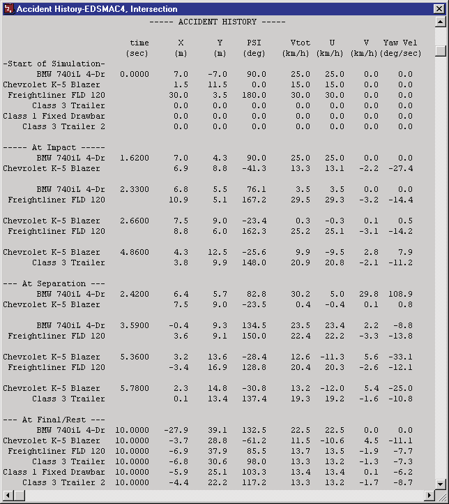
*Figure 3-1: Typical Accident History Output Report issued by EDSMAC4.*

*(updated: the criterion used to detect the beginning and end of each collision phase reported here is selectable via the **Accident History Basis** calculation option — Impact Force (default) or Acceleration with a threshold in g; see [EDSMAC4 Calculation Options](../../10-calculation-options/CalcOptEDSMAC4.md#accident-history-basis).)*

### Damage Data

The Damage Data Report includes the following information:

- **Vehicle Damage Summary** — A table containing the collision ("RHO") vector information in two forms: RHO vector length and angle, and RHO vector x,y endpoint coordinates.

  > **NOTE:** This table is used to define the damage profile.

- **Vehicle Damage Ranges** — A table containing the starting and ending points for each damage range, along with its CDC, PDOF, total delta-V and peak acceleration.

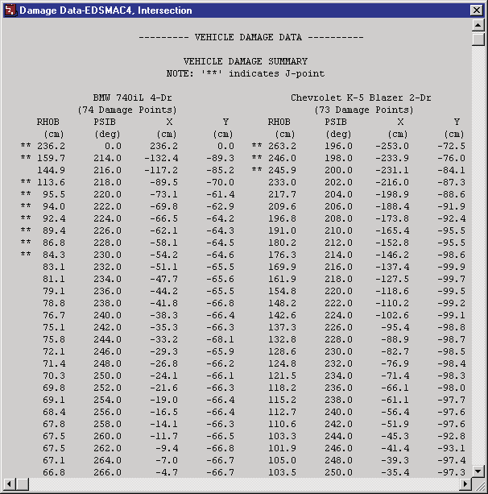
*Figure 3-2: Typical Damage Data Output Report issued by EDSMAC4.*

*(updated: the report layout is selectable via the **Damage Data Format** calculation option — Traditional or Collision Data (default); see [EDSMAC4 Calculation Options](../../10-calculation-options/CalcOptEDSMAC4.md#damage-data-format).)*

### Driver Data

The Driver Data report displays a table of user-entered driver control tables for steering, braking and throttle for each vehicle in the event.

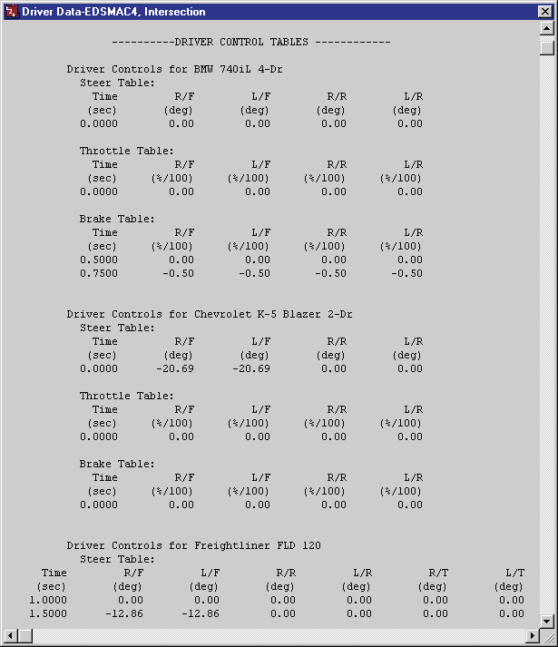
*Figure 3-3: Typical Driver Data Output Report issued by EDSMAC4.*

### Environment Data

The Environment Data report displays the physical and visual information describing the environment. This information is displayed in two sections:

- **General Environment Data** — Physical parameters describing the environment (Temperature and Pressure are not used in the EDSMAC4 calculations).
- **3-D Environment Terrain Data** — Geometric parameters describing the terrain.

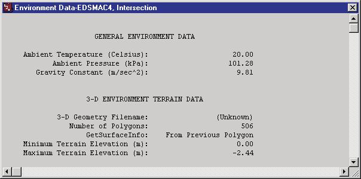
*Figure 3-4: Typical Environment Data Output Report issued by EDSMAC4.*

> **NOTE:** A detailed description of the terrain vertex information is not practical owing to its potentially large size (a terrain is often composed of several thousand vertices). However, it is possible to view the terrain information (friction multiplier, slope, elevation, and so forth) beneath each tire at each timestep during the simulation by selecting the tire terrain outputs in the Variable Output, Tires output group (see Variable Output later in this chapter).

### Event Data

The Event Data report displays event-specific information for each vehicle:

- **Accelerometer Data** — Vehicle-fixed coordinates for up to five accelerometers (the acceleration vs. time history for each accelerometer is found in Variable Output, described later in this chapter).
- **Wheel Displacement Data** — User-defined time and displacement parameters for each displaced wheel location.
- **Tire Blow-out** — User-defined time and tire blow-out parameters for each blown tire.

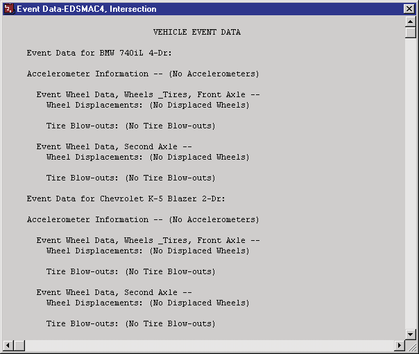
*Figure 3-5: Typical Event Data Output Report issued by EDSMAC4.*

### Messages

The Messages report lists the messages produced during execution of the current event. For a complete listing of messages issued by EDSMAC4, see [Chapter 6](06-messages.md).

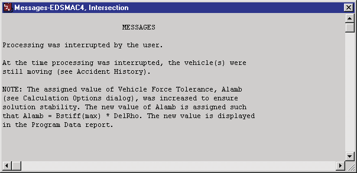
*Figure 3-6: Typical Messages Output Report issued by EDSMAC4.*

### Program Data

The Program Data Report includes the following information:

- **Simulation Controls** — Integration parameters used for the current event.
- **Collision Parameters** — Parameters used within the collision model.
- **Collision Criteria** — Parameters used to determine which side (front, back, right or left) a RHO vector intersects; used to determine the RHO vector's initial length.

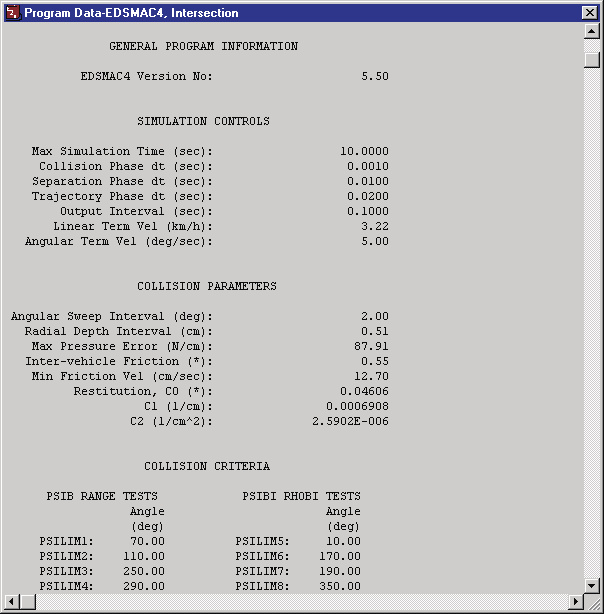
*Figure 3-7: Typical Program Data Output Report issued by EDSMAC4.*

### Vehicle Data

The Vehicle Data Report includes the following information:

- **Vehicle Dimensional and Inertial Properties** — The dimensional and inertial parameters used by each vehicle in the current event.

  > **NOTE:** The yaw inertia displayed in the Vehicle Data report includes the inertial contributions of the unsprung masses. These masses are added to the sprung mass yaw inertia to calculate the total yaw inertia used by EDSMAC4.

- **Tire Properties** — The tire parameters used by each vehicle in the current event.

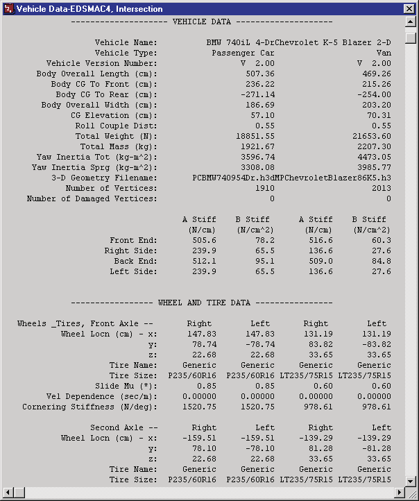
*Figure 3-8: Typical Vehicle Data Output Report issued by EDSMAC4.*

## Graphic Reports

EDSMAC4 produces no Graphic Output Reports.

> **NOTE:** Graphs of simulation results vs time may be produced using the Variable Output window (see next section).

## Variable Output Table

EDSMAC4 produces a Variable Output table containing the time-based simulation results. The Variable Output groups produced by EDSMAC4 are as follows:

### Vehicle Output Groups

- **Kinematics** — Position, velocity and acceleration for each vehicle
- **Kinetics** — Summation of collision forces and moments acting at the CG of each vehicle
- **Accelerometers** — Linear acceleration at each user-specified accelerometer location for each vehicle
- **Tire** — The tire output parameters existing at the tire contact patch (compare with Wheel output, below)
- **Wheel** — The wheel output parameters existing at the wheel's hub; information about the position of each wheel (compare with Tire output, above)
- **Connections** — Trailer articulation angle and connection forces for each articulated vehicle
- **Driver** — Current levels of driver inputs (steering, braking and throttle)

**Table 3-1: Vehicle Variable Output Data**

| Parameter | Description |
|---|---|
| Vehicle Kinematic Data | X,Y,Z position of CG; $\phi,\theta,\psi$ orientation; total linear velocity, u,v,w components; sideslip angle; r angular velocity; total linear acceleration, forward, side components; $\dot{u}$, $\dot{v}$ linear components; $\dot{r}$ angular component |
| Vehicle Kinetic Data | $\Sigma F_x$, $\Sigma F_y$, $\Sigma M_z$ (collision); $\Sigma F_x$, $\Sigma F_y$, $\Sigma M_z$ (tires); $\Sigma F_x$, $\Sigma F_y$, $\Sigma M_z$ (connection) |
| Accelerometer Data | Total linear acceleration; forward, lateral components of linear acceleration at each user-specified accelerometer location |
| Tire Data | X,Y,Z position of tire contact patch; slip angle; $F'_x$, $F'_y$, $F'_z$; skid flag |
| Wheel Data | x,y,z location of each wheel; $F_x$, $F_y$, $F_z$; steer angle ($\delta$) at each steerable wheel |
| Connection Data | Articulation angle, $F_x$, $F_y$, $F_z$ at each connection |
| Driver Data (*) | Steering wheel angle |

(*) If Driver Control option was At Driver

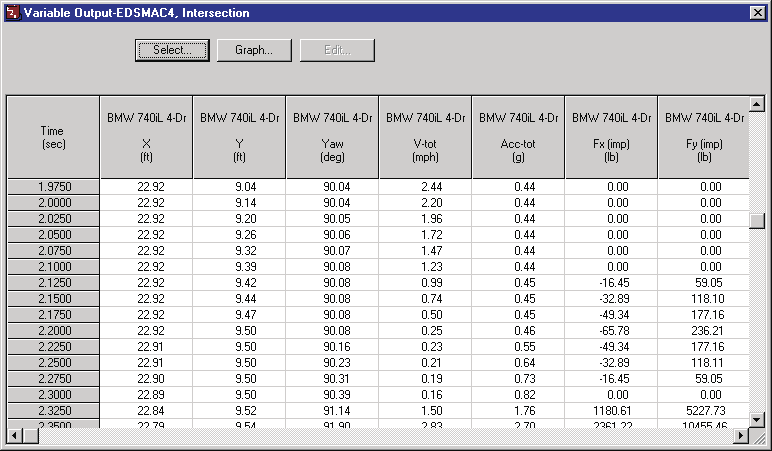
*Figure 3-9: Typical Variable Output table from EDSMAC4.*

## Trajectory Simulation

EDSMAC4 produces a trajectory simulation of the current event. The trajectory simulation is a 3-D visualization of the vehicle position data displayed in the Variable Output table (see previous section).

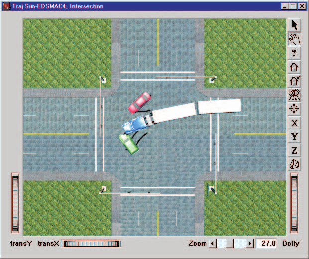
*Figure 3-10: Typical EDSMAC4 Trajectory Simulation.*

### Displaying a Trajectory Simulation

The Trajectory Simulation is controlled using the Playback Controller. The Playback Controller's buttons have the following functions:

- **Reset** — Return to the start of the simulation
- **Rewind to Start** — Return to the start of the simulation
- **Reverse** — Play the simulation backwards
- **Pause** — Pause the simulation
- **Play** — Execute the event or play the simulation forwards
- **Advance to End** — Advance to the end of the simulation

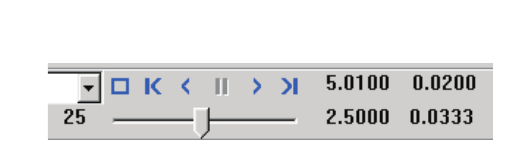
*Figure 3-11: Playback Controller, used for controlling Trajectory and Damage Profile Simulations.*

### Displaying a Damage Profile Simulation

EDSMAC4 produces a dynamic simulation of the vehicle damage profile. The simulated damage is displayed in the Damage Profile viewer. The vehicle is initially displayed in its original shape without damage. To display a time-history of the damage, use the Playback Controller.

> **NOTE:** A Trajectory Simulation window must be open in order to enable the Playback Controller.

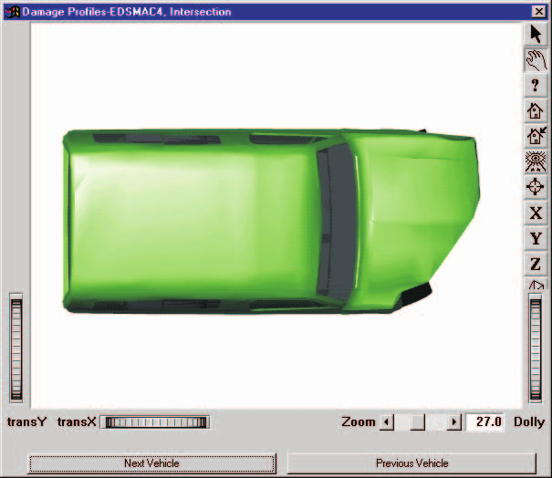
*Figure 3-12: Typical EDSMAC4 Damage Profile Simulation.*

---
*Previous: [Chapter 2 — Program Input](02-program-input.md) — Next: [Chapter 4 — Calculation Method](04-calculation-method.md)*

<!-- NAV -->

---

← Previous: [Chapter 2 — EDSMAC4 Program Input](02-program-input.md)  |  [Index](README.md)  |  Next: [Chapter 4 — Calculation Method](04-calculation-method.md) →

<!-- /NAV -->
