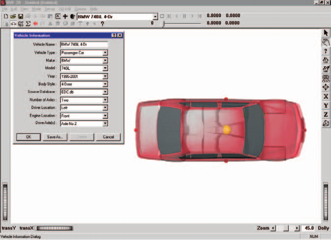
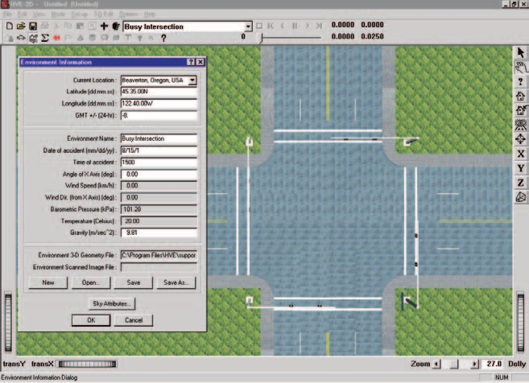
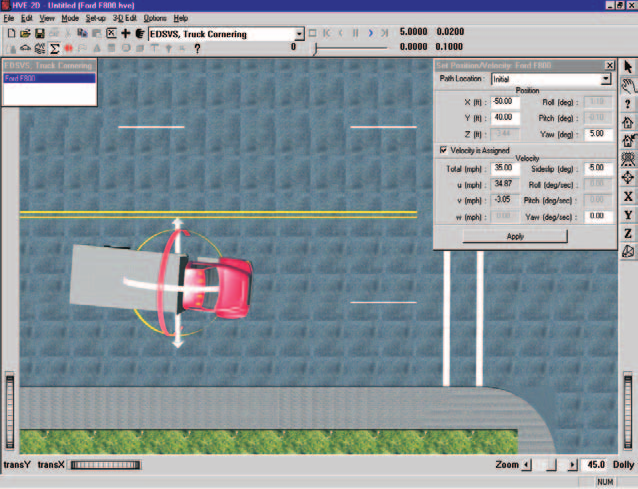
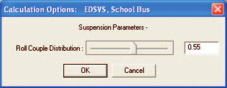
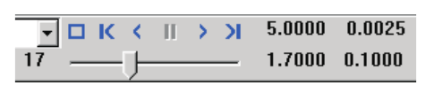

# Chapter 2 — EDSVS Program Input

This chapter defines the objects (vehicles and environment) and the event set-up parameters (positions and velocities, driver controls, and so forth) used by the EDSVS analysis. In general, the chapter is divided into the following sections:

- **Objects** — The number of vehicles, and the specific vehicle parameters actually used by EDSVS.
- **Events** — The various HVE-2D options available for setting up and executing an EDSVS event.

## Objects Overview

The objects used by the EDSVS model are:

- **Vehicles** — One vehicle may be studied by EDSVS.
- **Environment** — Like the *real* world, EDSVS has exactly one environment.

> NOTE: The environment is used in any reconstruction or simulation model.

The following sections describe how the vehicle and environment provide the required inputs to the EDSVS calculation model.

## Vehicles

EDSVS uses one vehicle created using the Vehicle Editor (see Figure 2-1). Vehicles are selected from the Vehicle Database by choosing the following attributes:

- **Type** — EDSVS supports the following vehicle types: *Passenger Car, Pickup, Van, Sport-utility, Truck* and *Movable Barrier*.
- **Make** — EDSVS supports all available vehicle makes.
- **Model** — EDSVS supports all available vehicle models, within the limits defined by number of axles and drive axles; see below.
- **Year** — EDSVS supports all available vehicle years.
- **Body Style** — EDSVS supports all available vehicle body styles.

Each vehicle also has the following additional user-editable parameters:

- **Driver Location** — The *Driver Location* is not used by EDSVS. However, *Driver Location* must not be *None*; otherwise, the Driver Controls (Steering, Throttle, Brakes) will not be available during Event mode.
- **Engine Location** — The Engine Location is not used by EDSVS. However, *Engine Location* must not be *None*; otherwise, the Throttle Table will not be available during Event mode.
- **Number of Axles** — EDSVS supports 2- and 3-axle vehicles.
- **Drive Axle(s)** — EDSVS supports all drive axles.

To add a vehicle to the current case, perform the following steps:

1. Choose Vehicle Mode. The Vehicle Editor is displayed.
2. Click *Add New Object*. The Vehicle Information dialog is displayed.
3. Click on the *Type, Make, Model, Year* and *Body Style* option buttons to select a vehicle from the database.
4. If desired, modify the *Driver Location, Engine Location, Number of Axles* and *Drive Axle(s)* for the current vehicle.
5. Enter a name for the current vehicle. A default name is supplied for each selected vehicle. Its name is user-editable, and does not affect calculations.

   > NOTE: Duplicate vehicle names are not allowed in the same case.

6. Click *OK* to add the vehicle to the current case.

*Figure 2-1: HVE-2D Vehicle Editor.*

The following Vehicle Parameter groups are used by EDSVS:

- Sprung Mass
  - Inertias
  - Move CG
- Unsprung Mass
  - Wheel Location
  - Tire Data
  - Suspension Data
  - Brake Data
- Steering System

> NOTE: The Exterior Data Group (Overall Dimensions, Structural Stiffness Coefficients), Brake System and Drivetrain are not used by EDSVS.

The specific data used in each of the above parameter groups are defined in Tables 2-1 through 2-3.

### Sprung Mass

The Sprung Mass parameters are shown in Table 2-1. Information on each group is provided below.

**Table 2-1: Vehicle Sprung Mass Parameters Used By EDSVS**

| Parameter | Description |
|---|---|
| Weight | Total vehicle weight |
| Total Yaw Inertia | Rotational inertia of the sprung mass about the vehicle-fixed z axis |
| Move CG (x, y, z) | Relocates the CG in the vehicle-fixed x, y and z directions. This entry causes an automatic adjustment of all vehicle coordinate-related parameters (e.g., wheel locations). |

#### Inertias

EDSVS uses the total vehicle weight (converted to mass using the current gravitational constant; see Environment), and the total yaw rotational inertia.

#### Move CG

Move CG is not used directly by EDSVS. Its current value does not show up in the results. However, all Move CG fields may be used to quickly move the vehicle's center of gravity; the x and z coordinates for the wheels are updated to reflect the new CG location.

> **HVE:** If using HVE, the CG may also be relocated in the vehicle-fixed y direction.

#### Geometry File

The Geometry File is not used by EDSVS.

#### Inter-vehicle Connections

Inter-vehicle Connection parameters are not used by EDSVS.

### Unsprung Mass

The Unsprung Mass parameters used by EDSVS are shown in Table 2-2. Information on each group is provided below.

**Table 2-2: Vehicle Unsprung Mass, Brake and Tire Parameters Used By EDSVS**

| Parameter | Description |
|---|---|
| Wheel Location | Vehicle-fixed x,y,z coordinates for each wheel |
| Anti-lock Effectiveness | The percentage of gain in longitudinal braking force due to anti-lock |
| Tire Unloaded Radius | Tire radius in unloaded condition (editable in HVE) |
| Tire Friction Table, Test Load/Speed | The load and speed for a given set of friction results (EDSVS uses the middle load and middle speed) |
| Peak Longitudinal Friction, Slide Friction, Slip at Peak Friction and Longitudinal Stiffness | Tire frictional properties |
| Friction In-use Factor | Multiplier for Peak and Slide Friction |
| Cornering Stiffness | Tire lateral force per unit of tire lateral slip for small amounts of lateral slip |
| Cornering Stiffness In-use Factor | Multiplier for Cornering Stiffness |

#### Wheel Location

Although HVE-2D provides values for the vehicle-fixed x,y,z coordinates of each wheel, EDSVS uses only the following five values: $a$, the distance from the CG to the front axle; $b$, the distance from the CG to the rear axle; $tw_f$, the front track width; $tw_r$, the rear track width; and $z_w$, the vertical distance from the CG to the wheel (for each wheel).

> NOTE: EDSVS uses the average $x_{wheel}$ for the front wheels to calculate $a$ and the average $x_{wheel}$ for the rear wheels to calculate $b$. Similarly, EDSVS uses the total distance between right-side and left-side tires to calculate track width. Bilateral symmetry is assumed. Finally, EDSVS uses tire radius and $z_{wheel}$ to calculate CG elevation above ground.

> **HVE:** In HVE, tire radius is user-editable.

#### Brake

EDSVS uses the wheel brake system Antilock Effectiveness. The specific parameters used by EDSVS are shown in Table 2-2.

#### Tire

The HVE-2D tire parameters provide the following data groups:

- Physical Data
- Friction Data
- Cornering Stiffness Data
- Slip vs Rolloff Table

EDSVS's use of these parameters is described below.

##### Physical Data

The Tire Physical Data used by EDSVS are shown in Table 2-2. The tire's unloaded radius is used to establish the vehicle's CG elevation. Other physical data parameters are not used.

> **HVE:** In HVE, tire unloaded radius is user-editable.

##### Friction Data

The Friction Data used by EDSVS are shown in Table 2-2. EDSVS uses both Peak and Slide Friction values.

> **HVE:** The EDSVS tire model does not incorporate load- or speed-dependence. If friction data for more than one load or speed are supplied in the HVE Tire Data dialog, EDSVS uses the parameters for the middle load and/or speed.

> NOTE: If any doubt exists about which value is actually used by the EDSVS tire model, you can check the Vehicle Data output report.

> **HVE:** *In-use Factor*, available in HVE, is a convenient way to reduce or increase the friction values (peak and slide friction) by making just one adjustment.

##### Cornering Stiffness Data

EDSVS uses the Cornering Stiffness value, as shown in Table 2-2.

> **HVE:** EDSVS does not use the HVE $F_y$ vs Slip Angle table, but instead uses the cornering stiffness parameter directly. If cornering stiffness data for more than one load or speed are supplied, EDSVS uses the parameters for the middle load and/or speed.

> NOTE: If any doubt exists about which value is actually used by the EDSVS tire model, you can check the Vehicle Data output report.

> **HVE:** Cornering Stiffness *In-use Factor*, available in HVE, is a convenient way to reduce or increase the dependent cornering stiffness values for all speeds and loads by making just one adjustment.

> NOTE: If you are simulating a vehicle with a flat tire, you'll probably want to reduce the In-use Factor to about 0.1.

##### Slip vs Rolloff Table

EDSVS uses the longitudinal Slip vs Rolloff Table.

#### Suspension

The HVE-2D Suspension Model provides the following data:

- Inter-tandem Load Transfer

EDSVS supports all suspension types, including those with tandem axles. However, the suspension at each wheel is not modeled, per se. Rather, *roll couple distribution* (see Event, Calculation Options) is used. *(updated: in the current physics engine the roll couple distribution used by the simulation is read from the vehicle's suspension data, `Suspension.RollCoupleDist`, set on the Vehicle Editor's suspension screen — see [EDSVS Calculation Options](../../10-calculation-options/CalcOptEDSVS.md).)*

##### Inter-tandem Axle Load Transfer

If three axles are supplied for the vehicle, the vehicle is assumed to have tandem rear axles. In this case, a longitudinal load transfer due to braking may be simulated by supplying an Inter-tandem Load Transfer Coefficient.

Studies have shown the value of -0.38 to be representative of typical four spring suspension systems [4]. The negative sign indicates load transfer from the front to the rear axle.

The value for walking beam suspensions with 100% torque rod effectiveness is 0.0 [14]. For non-perfect torque rods with effectiveness less than 100%, the load transfer is:

$$\left(\frac{AAA}{R}\right)\left(\frac{100 - T_e}{100}\right)$$

where:

| Symbol | Meaning |
|---|---|
| $AAA$ | inter-tandem dimension |
| $R$ | tire radius |
| $T_e$ | torque rod efficiency |

**Table 2-3: Vehicle Suspension and Steering Parameters Used By EDSVS**

| Parameter | Description |
|---|---|
| Inter-tandem Axle Load Transfer | Rear-to-front inter-axle load transfer due to braking of tandem axles |
| Steering Gear Ratio | Ratio of the angle at the steering wheel to the angle at the wheel |

### Exterior

The Vehicle Exterior Data (Exterior Dimensions, Stiffness) are not used by EDSVS.

### Steering System Data

EDSVS uses the steering gear ratio if the *At Steering Wheel* Steering Table option is used during Event set-up (see Table 2-3). Otherwise, the steering system data are not used by EDSVS.

### Brake System Data

The Brake System data are not used by EDSVS.

## Environment

EDSVS uses the environment created by the Environment Editor (see Figure 2-2). The environment is created by defining the following groups of attributes:

- Visual Data
- Physical Data

*Figure 2-2: Environment Editor.*

### Creating an Environment

To add an environment to the current case, perform the following steps:

1. Choose Environment Mode. The Environment Editor is displayed.
2. Click *Add New Object*. The Environment Information dialog is displayed.
3. Click on the *Location* combo box to select the desired city, state and country, and associated *Latitude, Longitude* and *GMT*.
4. Enter the *Time* and *Date* for the event.
5. Enter the *Angle of the X axis, Wind Speed* and *Direction, Barometric Pressure* and *Temperature* for the event.
6. Enter the *Gravity Constant* for the event.
7. Enter an environment name. A default name is supplied for the current environment. The name is user-editable, and does not affect calculations.
8. Click *OK* to add the environment to the current case.

### Visual Data

The following visual parameters may be edited:

- **Environment Location** — A database containing the name (City/State/Country), Latitude and Longitude and GMT for the selected location.
- **Time and Date** — The local standard time and date for the event.

The visual data are not used by the event; they are provided for studies related to visibility at the time of an event (e.g., avoidability of an accident).

> NOTE: The visual data (Location, Time, Date and Angle of earth-fixed X axis) affect the lighting of the event! Depending on your view (Camera Position) the scene may be shaded and difficult to see. If the time is after sundown, the view will be dark.

### Physical Data

The Physical Data groups are:

- Angle of X Axis
- Wind Speed and Direction
- Atmospheric Temperature and Pressure
- Gravity Constant
- Surface Geometry

The specific physical environment data used by EDSVS are described below; see also Table 2-4.

**Table 2-4: Environment Model Parameters Used By EDSVS**

| Parameter | Description |
|---|---|
| Gravitational Constant | Local gravitational constant |
| 3-D Surface Geometry (Friction Factor, Elevation, Slope) | The polygon database used to create the environment |

#### Angle Of X Axis

The angle of the X axis is used to position the earth-fixed coordinate system on the surface of the earth.

> NOTE: The angle is specified relative to true north. If you are using a compass to determine direction at the scene of an accident, you should provide a correction factor before entering this angle.

> NOTE: The angle of the X axis affects how you visualize an EDSVS event because it affects the location of the sun.

#### Wind Speed and Direction

Wind Speed and Direction are not used by EDSVS.

#### Atmospheric Temperature and Pressure

Atmospheric temperature and pressure are not used by EDSVS.

#### Gravity Constant

The gravity constant converts mass to force. An object's mass and rotational inertias are properties that are the same throughout the universe; however, the weight of an object is dependent on the local gravitational constant.

#### Surface Geometry

The Surface Geometry is used by the tire model in EDSVS to calculate the friction multiplier for the current X,Y position of the tire.

> **HVE:** In HVE, it is also used to calculate the elevation and slope.

> **HVE:** If the elevation changes result in a vehicle roll or pitch that exceeds the allowable angle, EDSVS will terminate and report an error condition (Excessive Roll or Pitch Angle). See [Chapter 6 — Messages](06-messages.md) for more information.

## Event

EDSVS uses the Event Editor (see Figure 2-3) to create, set up and execute an event. Each of these topics is described below.

### Creating an Event

An EDSVS event is created using the Event Information dialog.

To create an EDSVS event:

1. Choose Event Mode. The Event Editor is displayed.
2. Click *Add New Object*. The Event Information dialog is displayed.
3. Select one vehicle from the Active Vehicles list.
4. Select the calculation model, *EDSVS*, from the Calculation Model options list.
5. Enter an event name. A default name is supplied for the selected event. The name is user-editable, and does not affect calculations.

   > NOTE: Duplicate event names are not allowed in the same case.

6. Click *OK* to create the EDSVS event.

> NOTE: If you choose a vehicle that is not compatible with EDSVS, a message will be displayed describing the problem. You will not be allowed to proceed until EDSVS-compatible objects are selected.

### Setting Up an Event

EDSVS uses the following *event set-up* options:

- Position/Velocity
- Driver Controls
- Payload Data

The specific Event Set-up data used by EDSVS are defined in Table 2-5.

*Figure 2-3: HVE-2D Event Editor, setting up and executing an EDSVS event.*

**Table 2-5: Event Set-up Parameters Used By EDSVS**

| Parameter | Description |
|---|---|
| Vehicle Initial Position | The earth-fixed X,Y coordinates and heading angle of the vehicle at the start of the simulation |
| Vehicle Initial Velocity | The forward linear velocity and sideslip, and the yaw angular velocity at the start of the run |
| Driver Controls, Steer Table | Steer Table Option: Steering Wheel Angle vs Time or Tire Steer Angle vs Time |
| Driver Controls, Brake Table | Brake Table Option: Wheel Force vs Time or Percent Available Friction vs Time |
| Driver Controls, Throttle Table | Throttle Table Option: Wheel Force vs Time or Percent Available Friction vs Time |
| Payload Data | Payload Exists option; Payload vehicle-fixed x,y,z coordinates; Payload Weight, Yaw Inertia |

#### Position/Velocity

Like all simulations, EDSVS requires initial positions and velocities to be supplied by the user.

The vehicle is positioned relative to the earth-fixed coordinate system by supplying the X,Y,Z coordinates of its CG, and roll ($\Phi$), pitch ($\Theta$) and yaw ($\Psi$) angles about vehicle x, y and z axes, respectively.

> NOTE: In HVE-2D, Z is equal to the CG height above ground, and roll and pitch are equal to 0.0.

> **HVE:** In HVE, Z, roll and pitch are supplied automatically using AutoPosition.

The vehicle velocities are supplied in the form of a total velocity and sideslip angle.

> NOTE: The vehicle-fixed u (forward) and v (side) velocity components are calculated using the total velocity and sideslip angle. Vertical velocity is set to zero.

#### Driver Controls

EDSVS uses the following Driver Controls:

- **Steering** — A table of steering inputs as a function of time. The *At Steering Wheel* and *At Axle* options are supported.
- **Braking** — A table of braking inputs as a function of time. The *Wheel Force* and *Percent Available Friction* options are supported.
- **Throttle** — A table of throttle inputs as a function of time. The *Wheel Force* and *Percent Available Friction* options are supported.

The Driver Controls Data used by EDSVS are shown in Table 2-5.

##### Brake

Typical values for non-braking rolling resistance for passenger car tires are provided below for reference in Table 2-6 [11]. These values should be entered in the Driver Controls - Brakes dialog using the Percent Available Friction option.

Representative values for locked-wheel (slide) friction coefficients for passenger car tires on a variety of surfaces are also provided, in Table 2-7 [10]. While the table is very complete, EDC makes no claim as to the accuracy of the data. The user is urged to perform thorough research in order to supply EDSVS with the best possible data.

**Table 2-6: Rolling Resistance Braking Inputs for Pavement [11]**

| Tire/Wheel Condition | % Available Friction |
|---|---|
| Normal Inflation | $0.010/\mu$ |
| Partial Inflation | $0.013/\mu$ |
| Damaged | 0.0 to 1.0 |
| Engine Braking — High Gear | $0.150/\mu$ to $0.200/\mu$ |
| Engine Braking — Low Gear | $0.200/\mu$ to $0.400/\mu$ |

**Table 2-7: Tire-Ground Friction Coefficients on Various Surfaces [10]**

| Surface | Dry <30 mph | Dry >30 mph | Wet <30 mph | Wet >30 mph |
|---|---|---|---|---|
| Portland Cement — New, Sharp | 0.80 - 1.20 | 0.70 - 1.00 | 0.50 - 0.80 | 0.40 - 0.75 |
| Portland Cement — Traveled | 0.60 - 0.80 | 0.60 - 0.75 | 0.45 - 0.70 | 0.45 - 0.65 |
| Portland Cement — Polished | 0.55 - 0.75 | 0.50 - 0.65 | 0.45 - 0.65 | 0.45 - 0.60 |
| Asphalt or Tar — New, Sharp | 0.80 - 1.20 | 0.65 - 1.00 | 0.50 - 0.80 | 0.45 - 0.75 |
| Asphalt or Tar — Traveled | 0.60 - 0.80 | 0.55 - 0.70 | 0.45 - 0.70 | 0.40 - 0.65 |
| Asphalt or Tar — Polished | 0.55 - 0.75 | 0.45 - 0.65 | 0.45 - 0.65 | 0.40 - 0.60 |
| Asphalt or Tar — Excess Tar | 0.50 - 0.60 | 0.35 - 0.60 | 0.30 - 0.60 | 0.25 - 0.55 |
| Gravel — Packed, Oiled | 0.55 - 0.85 | 0.50 - 0.80 | 0.40 - 0.80 | 0.40 - 0.60 |
| Gravel — Loose | 0.40 - 0.70 | 0.40 - 0.70 | 0.45 - 0.75 | 0.45 - 0.75 |
| Cinders — Packed | 0.50 - 0.70 | 0.50 - 0.70 | 0.65 - 0.75 | 0.65 - 0.75 |
| Rock — Crushed | 0.55 - 0.75 | 0.55 - 0.75 | 0.55 - 0.75 | 0.55 - 0.75 |
| Ice — Smooth | 0.10 - 0.25 | 0.07 - 0.20 | 0.05 - 0.10 | 0.05 - 0.10 |
| Snow — Packed | 0.30 - 0.55 | 0.35 - 0.55 | 0.30 - 0.60 | 0.30 - 0.60 |
| Snow — Loose | 0.10 - 0.25 | 0.10 - 0.20 | 0.30 - 0.60 | 0.30 - 0.60 |

#### Damage Profile

The Damage Profile Data are not used by EDSVS.

#### Payload

The Payload Data used by EDSVS include the payload coordinates relative to the vehicle's CG, the payload mass and yaw inertia.

> NOTE: Payload positioning is relative to the vehicle CG, not the rear suspension.

### Simulation Controls

EDSVS uses the current simulation control parameters in the Simulation Controls dialog (see Options Menu, Simulation Controls). The Simulation parameters used by EDSVS are shown in Table 2-8.

> NOTE: The output time interval should be an even multiple of the vehicle trajectory integration timestep. For example, if the integration timestep is 0.02, the output interval might be 5 x 0.02, or 0.10.

**Table 2-8: Simulation Control Parameters Used By EDSVS**

| Parameter | Description |
|---|---|
| Vehicle Trajectory Integration Timestep | The integration timestep used by the numerical integration routine |
| Output Interval | The timestep used to send output results back to HVE-2D |
| Maximum Simulation Time | Maximum length of the run |
| Min Linear Velocity | The linear velocity used to terminate the run (if the linear and angular velocities are simultaneously less than these termination velocities, the run terminates) |

### Calculation Options

*Figure 2-4: Calculation Options dialog for EDSVS.*

The historically documented calculation option was:

- Roll Couple Distribution

*(updated: the original manual listed two calculation options — Roll-Couple Distribution and GetSurfaceInfo. In the current software the EDSVS engine does not present or use a Calculation Options dialog: it sets `CalcMethodHeader.Options.CalcOptionsDlgIsUsed = FALSE` (`Svsinput.cpp`), so no calculation-options dialog is shown for EDSVS and no `calcFloat`/`calcInt`/`calcOption` value is read by the engine. The Roll Couple Distribution used by the simulation is taken from the vehicle's suspension data (see below), and the GetSurfaceInfo terrain-search method is selected in the separate Get Surface Information Options dialog on the Options menu. Figure 2-4 above is retained for historical reference only; the dialog it shows is not active for EDSVS.)*

**Roll Couple Distribution** describes the ratio of lateral load transferred between the front and rear suspensions during cornering. This distribution depends directly on the characteristics of the front and rear suspension systems and chassis stiffness. As EDSVS is a 3-degree of freedom analysis, the effects of the suspension system and chassis are included in this one parameter. A good approximation for the fraction of the total load transfer borne by the front axle can be obtained by dividing the roll moment produced at the front suspension by the total roll moment (i.e., the total produced by both front and rear suspensions together) during a steady turn. Note that a neutral vehicle will tend to have a lateral load transfer coefficient equal to the percentage of load on the front axle; an understeering vehicle will tend to have a greater value and an oversteering vehicle will have a lesser value.

*(updated: the Roll Couple Distribution is not entered through an EDSVS Calculation Options dialog. The current EDSVS physics engine assigns it directly from the vehicle's suspension data — `Vehicle[0].Wheel[0][0].Suspension.RollCoupleDist` in `Svsinput.cpp`, with the rear fraction computed as `gam2 = 1 - gam1` — so the value used by the simulation follows the vehicle editor's suspension setting. See the code-verified reference: [EDSVS Calculation Options](../../10-calculation-options/CalcOptEDSVS.md).)*

#### Get Surface Information

Both HVE-2D and HVE use a function called GetSurfaceInfo to determine on which environment polygon each tire is riding. This function searches below the X,Y coordinates of each tire contact patch, and uses a user-selectable algorithm to determine the friction and other characteristics of the surface beneath.

The default value of GetSurfaceInfo is *From Previous Polygon*. This results in fastest execution, but does not work for all environments. Refer to the User's Manual for further information about how GetSurfaceInfo works.

*(updated: the surface-search method is no longer part of the EDSVS Calculation Options dialog. It is selected in the separate Get Surface Information Options dialog (Options menu), which offers From First Polygon, From Previous Polygon and From Previous Polygon (Sorted); the By Elevation method is not supported. See [EDSVS Calculation Options](../../10-calculation-options/CalcOptEDSVS.md).)*

### Executing An Event

*Figure 2-5: Event Controller, used for starting and stopping event execution. The Event Controller can also be used for replaying previously executed events, both forward and backward.*

To execute an EDSVS event, use the Event Controller, shown in Figure 2-5. The Event Controller's buttons have the following functions:

- **Reset** — Reinitialize the calculation model for re-execution
- **Rewind to Start** — Return to the start of the simulation
- **Reverse** — Play the simulation backwards
- **Pause** — Pause the simulation
- **Play** — Execute the event or play the simulation forwards
- **Advance to End** — Advance to the end of the simulation

> NOTE: If you make changes to any of the event set-up options (see previous section), those changes will have no effect unless you press Reset before pressing Play.

> NOTE: Remember to use the Options Menu to choose useful options, such as Key Results, Axes, Velocity Vectors and Skidmarks.

---

[Previous: Chapter 1 — Program Description](01-program-description.md) | [Contents](README.md) | [Next: Chapter 3 — EDSVS Program Output](03-program-output.md)

<!-- NAV -->

---

← Previous: [Chapter 1 — EDSVS Program Description](01-program-description.md)  |  [Index](README.md)  |  Next: [Chapter 3 — EDSVS Program Output](03-program-output.md) →

<!-- /NAV -->
