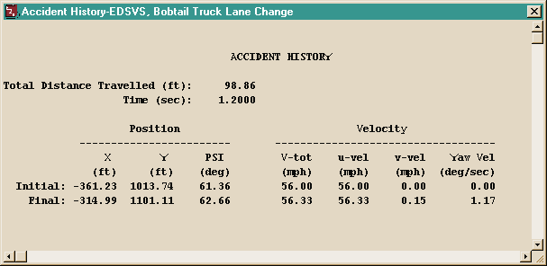
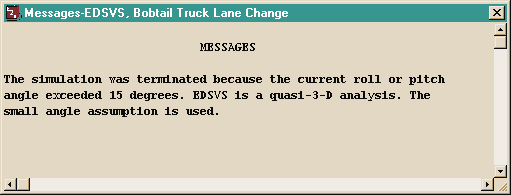
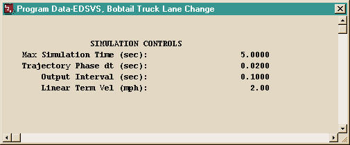
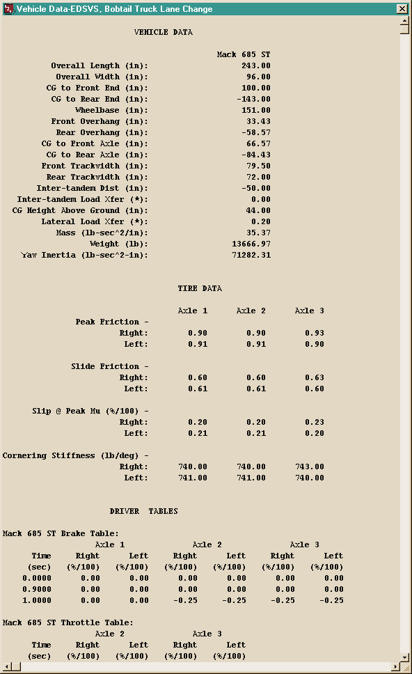
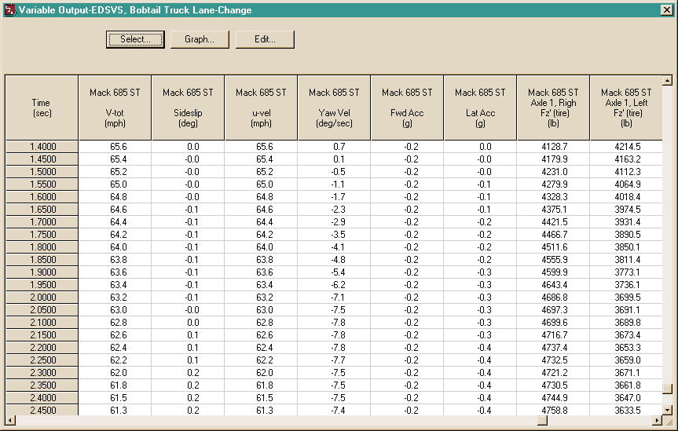
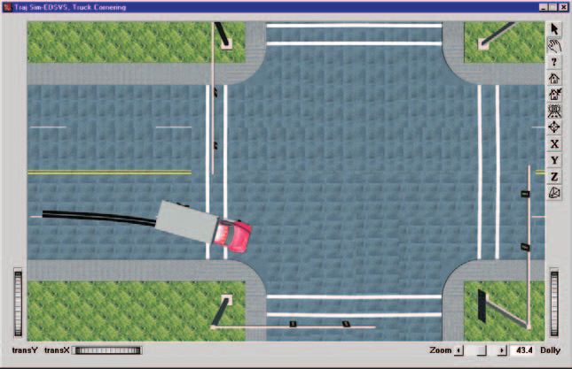
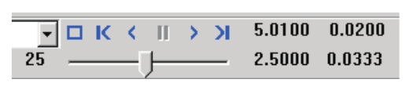

# Chapter 3 — EDSVS Program Output

This chapter defines the outputs available from an EDSVS event. The reports produced by EDSVS are available in the Playback Editor.

## Overview

EDSVS produces three types of output reports:

- **Alpha-Numeric Reports** — Reports containing text and numeric information, such as vehicle dimensional parameters
- **Variable Output Tables** — Reports containing tabular simulation results as a function of time
- **Trajectory Simulations** — Viewers containing dynamic, visual simulations

> NOTE: Each of these reports may be printed on the system printer. To print a report, click on the menu bar of the desired output report (the menu bar will change colors indicating that it is selected), then either choose Print from the Files menu or click on the Print icon in the toolbar. Refer to the User's Manual for further details.

To view any of these reports, perform the following steps:

1. Choose Playback Mode. The Playback Editor is displayed.
2. Click *Add New Object*. The Report Window Information dialog is displayed, showing a list of all the current events in the case.
3. Select an EDSVS event from the Active Events List. Once an event is selected, the Selected Output option list is displayed, containing all the available reports for the selected event.
4. Choose the desired report from the Selected Output list. The available output reports are:
   - Messages
   - Accident History
   - Program Data
   - Vehicle Data
   - Trajectory Simulation
   - Variable Output
5. Enter a Report Window Name. A default name is supplied for the selected preview window. The name is user-editable, and does not affect calculations.

   > NOTE: Duplicate Report Window names are not allowed. Because names are truncated to 30 characters, you should ensure that two truncated names are not the same.

6. Click *OK* to display the report.

## Alpha-Numeric Reports

EDSVS produces the following alpha-numeric reports:

- **Messages** — A list of messages produced by the current run
- **Accident History** — A table of initial and final positions and velocities
- **Vehicle Data** — A series of tables containing the vehicle data used by EDSVS
- **Program Data** — A table containing program control information for the current run

An example of each of these numeric output reports from EDSVS is shown on the following pages.

### Accident History

The Accident History Report displays a table of initial and final positions and velocities for the vehicle. A typical Accident History Report is shown in Figure 3-1.

*Figure 3-1: Typical Accident History Output Report issued by EDSVS.*

The report shows the Total Distance Travelled and Time, along with Initial and Final rows containing Position (X, Y, PSI) and Velocity (V-tot, u-vel, v-vel, Yaw Vel) values. *(Verified against the current report layout in `Physics/Source/Edsvs/EDSVS.rsc`, which also supports a "Rest" row.)*

### Messages

A typical Messages Report is shown in Figure 3-2. For a complete listing of messages issued by EDSVS, see [Chapter 6](06-messages.md).

*Figure 3-2: Typical Messages Output Report issued by EDSVS.*

### Program Data

The Program Data Report includes the following information:

- **Simulation Controls** — Integration parameters used for the current event (Max Simulation Time, Trajectory Phase dt, Output Interval, Linear Term Vel)

*(updated: the current Program Data report also includes a General Program Information section — HVE Version, EDSVS Version, Date and Time of Execution, Dimension Basis — and General Environment Data and 3-D Environment Terrain Data sections, including the 3-D geometry filename, number of polygons, the GetSurfaceInfo mode, minimum/maximum terrain elevation, and counts of water, curb, friction-zone and road polygons; see `EDSVS.rsc`.)*

A typical Program Data Report is shown in Figure 3-3.

*Figure 3-3: Typical Program Data Output Report issued by EDSVS.*

### Vehicle Data

The Vehicle Data Report includes the following information:

- **Vehicle Dimensional and Inertial Properties** — The dimensional and inertial parameters used by EDSVS in the current event (Overall Length and Width, CG to Front/Rear End, Wheelbase, Front/Rear Overhang, CG to Front/Rear Axle, Front/Rear Trackwidth, Inter-tandem Distance and Load Transfer, CG Height Above Ground, Lateral Load Transfer, Mass, Weight, Yaw Inertia).

  > NOTE: The Total Yaw Inertia adds the effect of the unsprung masses (i.e., the wheel and axle masses) to the sprung mass; thus, the value printed is greater than the one displayed in the Vehicle Editor's Inertias dialog.

- **Tire Properties** — The tire parameters used by EDSVS in the current event (Peak Friction, Slide Friction, Slip @ Peak Mu, Cornering Stiffness and Antilock Efficiency, right and left, for each axle).
- **Driver Tables** — Individual Driver Control tables for steering, braking, throttle and gear selection used by EDSVS in the current event.

A portion of a typical Vehicle Data Report is shown in Figure 3-4.

*Figure 3-4: Typical Vehicle Data Output Report issued by EDSVS (only a portion of the total report is shown).*

## Graphic Reports

EDSVS produces no Graphic Output Reports.

> NOTE: Graphs of simulation results vs time may be produced using the Variable Output window (see next section).

## Variable Output Table

EDSVS produces a Variable Output table containing the time-based simulation results. The Variable Output groups produced by EDSVS are as follows:

### Vehicle Output Groups

- **Kinematics** — Position, velocity and acceleration for the vehicle
- **Tire** — The tire output parameters existing at the tire contact patch (compare with Wheel Output, below)
- **Wheel** — The wheel output parameters existing at the wheel's hub position of each wheel (compare with Tire output, above)
- **Driver** — Current levels of driver inputs (steering, braking and throttle)

An example of a Variable Output table is shown in Figure 3-5. A detailed listing of each Variable Output parameter produced by EDSVS is found in Table 3-1. For more information about Variable Output parameters, refer to the User's Manual, Chapter 16, Event Model.

**Table 3-1: Vehicle Variable Output Data**

| Parameter | Description |
|---|---|
| Vehicle Kinematic Data | X,Y,Z position of CG; $\Phi,\Theta,\Psi$ orientation; Path Radius of CG; $\nu$ (Course Angle); Total linear velocity, u,v,w components; Sideslip angle; r angular velocity; Total linear acceleration, forward and side components; u-dot, v-dot linear components; r-dot angular components |
| Tire Data | X,Y,Z position of tire contact patch; Slip Angle; $F'_x$, $F'_y$, $F'_z$; Skid Flag |
| Wheel Data | x,y,z location of each wheel; $F_x$, $F_y$, $F_z$; Steer Angle ($\delta$) at each steerable wheel |
| Driver Data (*) | Steering wheel angle |

(*) If Driver Control option was *At Steering Wheel*.

*Figure 3-5: Typical Variable Output report.*

## Trajectory Simulations

EDSVS produces a trajectory simulation of the current event. The trajectory simulation is a visualization of the data displayed in the Variable Output table (see previous section). An example of a trajectory simulation is shown in Figure 3-6.

*Figure 3-6: Typical EDSVS Trajectory Simulation.*

### Displaying a Trajectory Simulation

The Trajectory Simulation is controlled using the Playback Controller (see Figure 3-7).

The Playback Controller's buttons have the following functions:

- **Reset** — Returns to the start of the simulation and reinitializes the video output device (this applies a hardware reset and is otherwise the same as the *Rewind to Start* button, below)
- **Rewind to Start** — Return to the start of the simulation
- **Reverse** — Play the simulation backwards
- **Pause** — Pause the simulation
- **Play** — Execute the event or play the simulation forwards
- **Advance to End** — Advance to the end of the simulation

*Figure 3-7: Playback Controller.*

> NOTE: The Playback Controller is also used for controlling the Playback Window. This window is used for combining events and for making movie files. Refer to the User's Manual for more information on the Playback Window and making movie files.

---

[Previous: Chapter 2 — Program Input](02-program-input.md) | [Contents](README.md) | [Next: Chapter 4 — EDSVS Calculation Method](04-calculation-method.md)

<!-- NAV -->

---

← Previous: [Chapter 2 — EDSVS Program Input](02-program-input.md)  |  [Index](README.md)  |  Next: [Chapter 4 — EDSVS Calculation Method](04-calculation-method.md) →

<!-- /NAV -->
