# Chapter 5 — EDSVS Tutorial

This tutorial comes from the EDC Simulations seminar. It provides a good example of the use of the driver input tables. In particular, it illustrates how the driver tables use linear interpolation to compute the current steer angle.

The goal of this tutorial is simply to make the simulated vehicle follow the desired path. Only steering is required, so the scope is limited, but extremely useful.

Like all EDSVS events, the procedures involve the following basic steps:

- Create the vehicles
- Create the environment
- Execute the EDSVS event
- Review the EDSVS output reports

These basic procedures are described in detail in this tutorial.

> NOTE: It is assumed that HVE-2D is up and running, and that the user is familiar with HVE-2D's basic features, such as using HVE-2D's dialogs and viewers, as well as the HVE-2D Editors. The purpose of this tutorial is to illustrate those features while setting up and executing an EDSVS event.

## Getting Started

As in other tutorials, before we get started with our current tutorial, let's set the user options so we're all starting on the same page.

> NOTE: In HVE-2D, all options simply affect the appearance in a viewer during Event or Playback mode.

> **HVE:** However, in HVE, AutoPosition affects the data used in the analysis. For example, if AutoPosition is On, the vehicle position conforms to the local surface; otherwise, the position is set by the Position/Velocity dialog. Obviously, the resulting difference in initial conditions could substantially change the event.

> NOTE: Some of the following options are "toggles" that switch between two different modes. Make sure these options are set correctly.

To set the initial user options, choose the following from the Options Menu:

- ON: *Show* Key Results
- OFF: *Show* Axes
- OFF: *Show* Contacts *(HVE)*
- OFF: *Show* Belt Anchors *(HVE)*
- OFF: *Show* Velocity Vectors
- ON: *Show* Skidmarks
- OFF: *Show* Targets
- ON: *AutoPosition* *(HVE)*
- Units equals *U.S.*
- Render Options:
  - Show Humans as *Actual* *(HVE)*
  - Show Vehicles as *Actual* *(HVE)*
  - *Phong* Shading Mode *(HVE)*
  - Complexity equals *Object* *(HVE)*
  - Render Quality equals *5*
  - Texture Quality equals *1* *(HVE)*
  - Anti-aliasing equals *1*

The remaining options will automatically initialize to their default conditions. We're now ready to proceed with the tutorial.

Our goal is to use EDSVS to drive a 1997 Ford Explorer along the path described in Figure 5-1. This tutorial shows us how to perform this simulation.

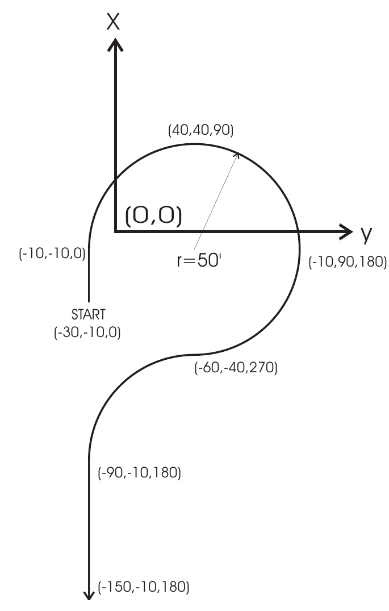
*Figure 5-1: Path for EDSVS Simulation Tutorial. The path starts at (-30,-10,0), passes (-10,-10,0), follows a circle of radius 50 ft through (40,40,90) and (-10,90,180), reverses curvature through (-60,-40,270), then continues through (-90,-10,180) to (-150,-10,180). Coordinates are (X, Y, heading in degrees).*

## Creating the Vehicle

Now let's add the vehicle to our case. The vehicle is a dark green 1997 Ford Explorer:

1. If the Vehicle Editor is not the current editor, choose *Vehicle Mode*. The Vehicle Editor is displayed.
2. Click *Add New Object*. The Vehicle Information dialog is displayed. The Vehicle Information dialog allows the user to select the basic vehicle attributes according to *Type, Make, Model, Year* and *Body Style*.

   > NOTE: The Vehicle Information dialog also allows you to edit the Driver Location, Engine Location, Number of Axles and Drive Axle(s). The Ford Explorer is a 4-wheel drive vehicle, but we're going to select 2-wheel drive for the tutorial.

3. Using the option buttons, click each button to choose the following vehicle from the database:
   - Type = *Sport Utility*
   - Make = *Ford*
   - Model = *Explorer*
   - Year = *1995-1999*
   - Body Style = *4-Door*
   - Source Database = *Tutorial.db*
   - Drive Axles = *Axle No. 2*
4. Click *OK* to add *Ford Explorer* to the Active Vehicles list.

The Ford Explorer is displayed in the viewer, as shown in Figure 5-2.

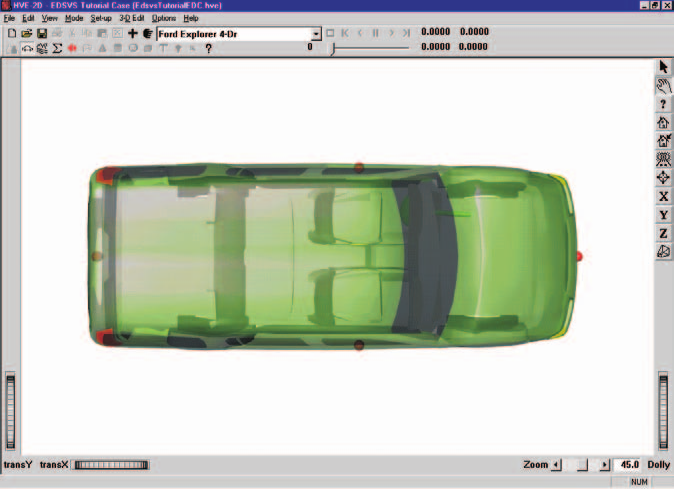
*Figure 5-2: Ford Explorer before editing.*

### Editing the Vehicle

Next, we will edit the vehicle to change its color and weight. To edit the color, perform the following steps:

1. Click on the CG (the CG may be hidden under the seat or other interior object; however, the CG icon is located at the vehicle CG; therefore, if you click at the intersection of lines connecting the exterior balls (left-right and front-rear), you will select the CG) and choose *Color*. The Vehicle Color dialog is displayed (see Figure 5-3), showing the vehicle's current color (the small black square, or *hot spot*, in the *color wheel*) and intensity (the arrow in the *intensity slider*). Click on the hot spot and drag it to the middle of the green area. To darken the vehicle, click on the intensity slider and drag it from the right end of the slider towards the middle.

   > NOTE: The color chip on the left shows the current color.

2. When the color is to your liking, close the dialog by clicking the close button on the upper right corner of the dialog.

   > NOTE: The vehicle's apparent color may be slightly misleading because the vehicle is translucent when displayed in the Vehicle Editor. The actual color will be used whenever the vehicle is displayed during Event and Playback mode.

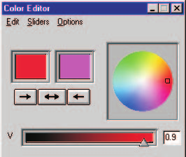
*Figure 5-3: Vehicle Color dialog, used for assigning the vehicle color.*

Next, let's change the weight. Perform the following steps:

1. Click on the CG and choose *Inertias*. The Inertias dialog is displayed, and we're ready to change the vehicle's weight.

   > NOTE: Only total weight and total yaw inertia is used by the 3-DOF EDSVS calculations.

2. In the *Total Weight* text field, replace the existing weight, `4295`, with the measured value, `4405` lb (see Figure 5-4).

   > NOTE: The dialog might initially display 4294.836, or a similar number, because the weight is actually divided by the current gravity constant and stored as mass. Extra precision results when the mass is multiplied by the current gravity constant and redisplayed.

3. If not already selected, click the checkbox for *Auto Update Inertia When Weight Changes*.
4. Press *OK* to accept the weight value and update the Total Yaw Inertia of the vehicle.

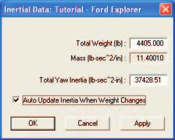
*Figure 5-4: Vehicle Inertias dialog, used for editing the current weight and yaw inertia. The values in this dialog are customized for this simulation.*

## Creating the Environment

Now, let's add the environment:

1. Choose *Environment Mode*. The Environment Editor is displayed.
2. Click *Add New Object*. The Environment Information dialog is displayed.
3. Using the Location Database combo box, choose *Beaverton, Oregon, USA*. The latitude, longitude and GMT (hours from the prime meridian) are displayed for the selected location.
4. Enter the date and time of the incident we are studying, `8/8/97` and `1230`, respectively.
5. Enter the angle from *true north* to the earth-fixed X axis in our environment, `165` degrees.

   > NOTE: The Latitude, Longitude, GMT, Date/Time and angle from true north are used to position the sun in the scene. This is, of course, important because the sun is the primary light source for the scene.

6. To add the environment geometry file to our case, click on *Open*. The Environment Geometry File Selection dialog is displayed.
7. Click on the *File of Type* option list and choose *HVE Geometry Files (\*.h3d)*. A list of environment geometry files using the .h3d file format is displayed in a list box. Double-click on *EdsvsTutorial.h3d* to choose the environment file and remove the dialog.
8. Press *OK*.

The selected environment is added to our case and displayed in the Environment Viewer (see Figure 5-5). Use the viewer thumb wheels and/or manipulators to view the scene.

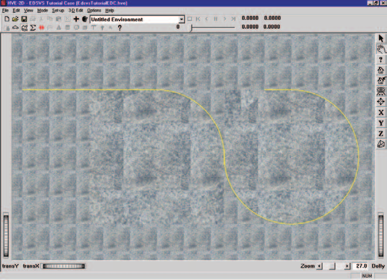
*Figure 5-5: Environment used for our EDSVS tutorial.*

## Saving the Case

Now that we've created all the objects (*vehicle* and *environment*) for our case, let's save the case file.

1. Click on the *File* menu and choose *Save*. The Save-as File Selection dialog is displayed.

   > NOTE: The Save-as dialog is displayed because the case has not been saved previously, so we need to enter a filename.

2. Place the mouse cursor in the Case Title text field and enter `EDSVS Tutorial Case`.

   > NOTE: The Case Title is displayed as a heading on all printed output reports.

3. Place the mouse cursor in the Filename text field and enter `EdsvsTutorial`.
4. Click *SAVE*. The current case data are saved in the `/supportFiles/case` subdirectory.

   > NOTE: Saving the file occasionally is a highly recommended practice.

## Creating Events

As mentioned at the outset of the tutorial, we are going to simulate a vehicle traveling along a pre-determined path to learn more about the use of HVE-2D driver tables. To create the event, perform the following steps:

1. Choose *Event Mode*. The Event Editor is displayed.
2. Click *Add New Object*. The Event Information dialog is displayed.
3. Select *Ford Explorer* from the Active Vehicles list.
4. Select *EDSVS* from the *Calculation Method* options list.
5. Enter a name for the event, `Steering Maneuver`.

   > NOTE: HVE-2D will append the name of the calculation method to the event name, thus the complete event name will become "EDSVS, Steering Maneuver."

6. Press *OK* to display the event editor.

Now, we're ready to set up the event.

1. Using the Event Editor dialog, select *Ford Explorer* from the Event Humans & Vehicles list, then choose *Set-up* from the menu bar and select *Position/Velocity*. The Explorer is displayed at the earth-fixed origin.
2. Click on the vehicle's X-Y manipulator (see Figure 5-6), wait for it to turn bright yellow (indicating it has been selected), and drag it to its initial position, X = `-30` ft, Y = `-10` ft. Click the yaw manipulator and rotate it to its heading angle, `0` degrees.

   > NOTE: To select the X-Y manipulator, the viewer must be in Pick mode, as indicated by the highlighted arrow in the upper right corner of the viewer (see Figure 5-6).

   > NOTE: Be sure to keep the mouse button depressed while you drag the manipulators.

   > NOTE: Adjust the viewer by dollying back (using the Dolly thumb wheel) until you can see the entire course.

   > NOTE: If you can't position the vehicle at the exact coordinates, simply enter them in the dialog (in fact, it's often easier to directly enter the coordinates using the dialog, especially for heading angle).

3. Click the *Velocity Is Assigned* checkbox. Enter the initial velocity, `20` mph, then click *Apply*.

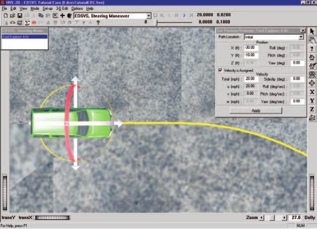
*Figure 5-6: Vehicle positioning using the HVE-2D Event Editor. The manipulators can be used to drag and drop the vehicle into position.*

> NOTE: When entering coordinates and velocities using the Position/Velocity dialog, remember to press \<Enter\>; otherwise, the values will not be assigned.

The vehicle initial conditions are now established. Let's enter the driver controls. But, before we enter the steer angle data, let's be smart: Although we could simply find the steer angles by trial and error, instead we'll use a simple formula to arrive at a very good estimate. From the vehicle wheelbase and desired path radius, it can be shown the required steer angle is approximated by:

$$\delta = \arctan\left(\frac{wheelbase}{radius}\right)$$

> NOTE: The accuracy of this estimate is normally an acceptable initial estimate unless the vehicle is sideslipping.

Noting the wheelbase of the vehicle is 112 inches and the desired path radius is 50 feet (600 in), the required steer angle is about 11 degrees at the wheels.

> NOTE: An initial attempt using 11 degrees caused the vehicle's path to be too large. We'll use 11.25 degrees in our table.

To enter the steer angles, perform the following steps:

1. Click on the Set-up Menu and select *Driver Controls*. The Driver Controls dialog appears and the Steering Table is displayed.
2. Click on the *Table Is* option list and choose the *At Axle* option.
3. Enter the steer angles for the front wheels, as shown below:

**Table 5-1: Steering Table for the EDSVS, Steering Maneuver event**

| Time (sec) | Steer Angle at Axle (deg) — Axle 1, Right | Steer Angle at Axle (deg) — Axle 1, Left |
|---|---|---|
| 0.50 | 0.00 | 0.00 |
| 0.60 | 11.25 | 11.25 |
| 9.50 | 11.25 | 11.25 |
| 10.00 | -11.25 | -11.25 |
| 12.65 | -11.25 | -11.25 |
| 13.75 | 0.00 | 0.00 |

4. Press *OK* to accept the steering table.

This event lasts more than 5 seconds. To prevent premature termination, let's increase the default maximum simulation time.

1. Click on the Options menu and choose *Simulation Controls*. The Simulation Controls dialog is displayed.
2. Edit the *Maximum Time*, changing it from `5` to `20` seconds.
3. Press *OK* to update the simulation controls.

Since our goal for this event is to follow a desired path, let's look at some Key Results during execution:

1. If Key Results windows are not displayed, choose *Show Key Results* from the Options menu.
2. Drag the Key Results windows to a convenient location, where they do not block the view but still allow us access to the viewer thumb wheel controls (in case we want to change the view).
3. Click on *Select Variables* in the *Ford Explorer* Key Results window. The Variable Selection dialog for *Ford Explorer* is displayed.

Let's add *Wheel Fx, Fy, Fz* and *Steer Angle* to the Key Results window:

1. Choose *Wheels, Axle 1, Right* from the variable output groups list. The Variable Selection list for the right front wheel is displayed (see Figure 5-7).
2. Select *Fx, Fy, Fz* wheel forces and *Delta (whl)* (Steer Angle) from the list.

   > NOTE: The above procedure adds the forces for the right front wheel only; you might wish to add the variables for the remaining three tires.

3. Press *OK* to add the selected variables to the list.

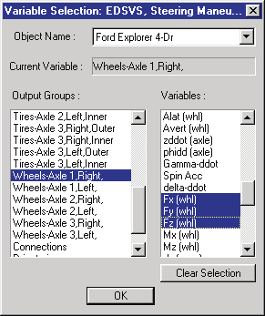
*Figure 5-7: Key Results Variable Selection dialog, used for selecting variables to be displayed in the Key Results window.*

Now, we're ready to execute the event.

- Using the Event Controller, click *Play* to execute the event. Allow the event to run until completion at t = 20 seconds.

The EDSVS event is shown at time t = 3.10 seconds in Figure 5-8. Note the vehicle travels within 2 feet and 2 degrees of each path position defined in Figure 5-1.

> NOTE: While the event is executing, watch the current results (especially the X,Y path coordinates and heading angle) in the Key Results windows.

We have now completed the event.

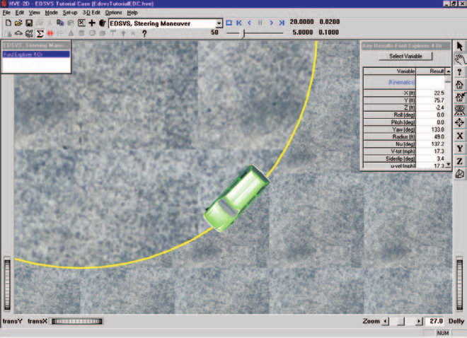
*Figure 5-8: HVE-2D Event Editor executing the EDSVS Event.*

## Viewing Results

Now that we have produced our EDSVS simulations, let's take a detailed look at the results. The Playback Editor is used for reviewing and printing reports for each event in the current case, as well as for producing video output.

EDSVS produces the following reports:

- **Accident History** — A table of initial and final positions and velocities
- **Messages** — A list of messages produced by the current run
- **Program Data** — A table containing program control information
- **Trajectory Simulation** — A visualization of the event, displayed at a user-selectable time interval
- **Variable Output** — A table containing time-dependent simulation results
- **Vehicle Data** — A series of tables containing the vehicle data used by EDSVS

To view the output reports, we need to be in Playback mode:

- Choose *Playback Mode*. The Playback Editor is displayed.

### Report Windows

The reports listed above are displayed by selecting Report Windows. Each Report Window contains an individual report.

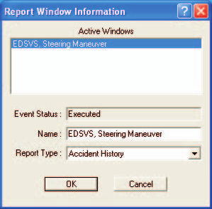
*Figure 5-9: Report Window Information dialog, showing the name of the event(s) in the current case.*

To view the reports produced by the *EDSVS, Steering Maneuver* event, perform the following steps:

1. Click *Add New Object*. The Report Window Information dialog is displayed, as shown in Figure 5-9, and includes a list of the active events (*EDSVS, Steering Maneuver* is the only event in this tutorial). The Report Window Information dialog also includes the user-editable *Report Window Name* text field and *Selected Output* option list.
2. Select *EDSVS, Steering Maneuver* from the Active Events list.
3. Click on the *Selected Output* option list and choose any of the available reports.
4. Press *OK* to display the report.

The selected report will be displayed in a resizable window. The following pages illustrate the reports produced for the *EDSVS, Steering Maneuver* event.

### Accident History

The Accident History report displays the time and total distance traveled, as well as position and velocity information for the start and end of the run.

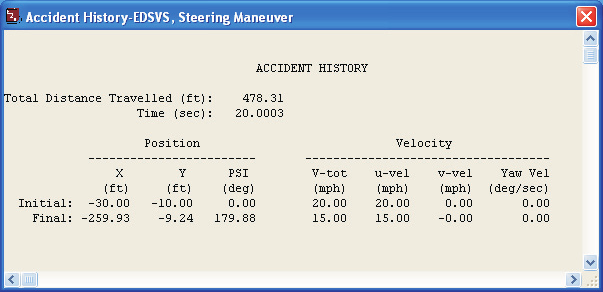
*Figure 5-10: Accident History Report for EDSVS, Steering Maneuver. Total distance travelled 478.31 ft in 20.0 sec; Initial: X = -30.00, Y = -10.00, PSI = 0.00, V-tot = 20.00 mph; Final: X = -259.93, Y = -9.24, PSI = 179.88, V-tot = 15.00 mph.*

To view the Accident History report for the *EDSVS, Steering Maneuver* event, perform the following steps:

1. Click *Add New Object*. The Report Window Information dialog is displayed.
2. Select *EDSVS, Steering Maneuver* from the Active Events list.
3. Click on the *Selected Output* option list and choose *Accident History*.
4. Press *OK*.

The Accident History report is displayed for the *EDSVS, Steering Maneuver* event, as shown in Figure 5-10.

> NOTE: The Accident History report and several other reports contain more information than fits into the default window size. Use the scroll bars or resize the dialog to view the entire report.

### Messages

EDSVS produces a number of messages, depending on the outcome of the event. For a complete list and explanation of the messages produced by EDSVS, see [Chapter 6](06-messages.md).

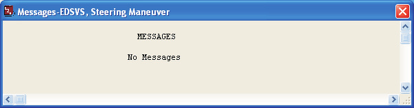
*Figure 5-11: Messages Report for EDSVS, Steering Maneuver (showing "No Messages").*

To view the Messages report produced by the *EDSVS, Steering Maneuver* event, perform the following steps:

1. Click *Add New Object*. The Report Window Information dialog is displayed.
2. Select *EDSVS, Steering Maneuver* from the Active Events list.
3. Click on the *Selected Output* option list and choose *Messages*.
4. Press *OK*.

The Messages report is displayed for the *EDSVS, Steering Maneuver* event, as shown in Figure 5-11.

### Program Data

The Program Data report for EDSVS displays the simulation controls used for the current event.

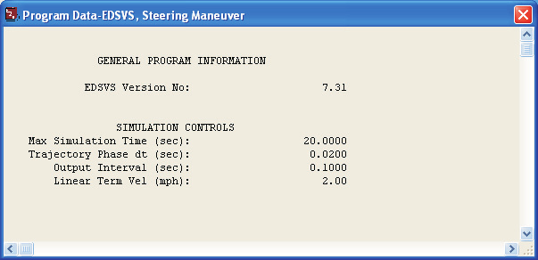
*Figure 5-12: Program Data Report for EDSVS, Steering Maneuver. Shows General Program Information (EDSVS Version No: 7.31 in the original) and Simulation Controls (Max Simulation Time 20.0 sec, Trajectory Phase dt 0.0200 sec, Output Interval 0.1000 sec, Linear Term Vel 2.00 mph).*

To view the Program Data report for the *EDSVS, Steering Maneuver* event, perform the following steps:

1. Click *Add New Object*. The Report Window Information dialog is displayed.
2. Select *EDSVS, Steering Maneuver* from the Active Events list.
3. Click on the *Selected Output* option list and choose *Program Data*.
4. Press *OK*.

The Program Data report is displayed for the *EDSVS, Steering Maneuver* event, as shown in Figure 5-12.

### Vehicle Data

The Vehicle Data report displays the vehicle data, tire data and driver control tables for the EDSVS vehicle.

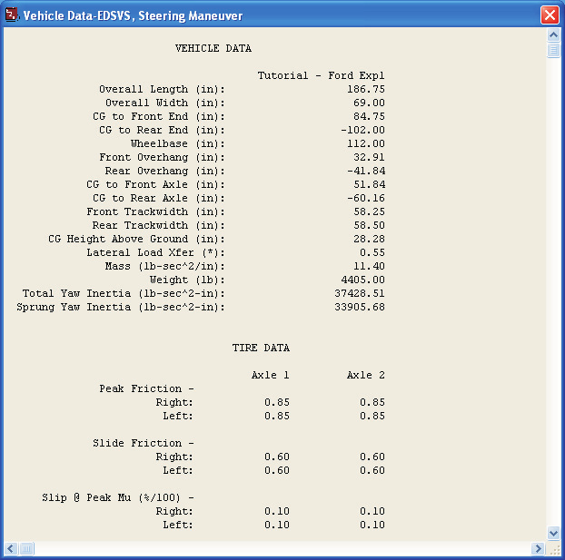
*Figure 5-13: Vehicle Data Report for EDSVS, Steering Maneuver. Shows dimensional data (Overall Length 186.75 in, Wheelbase 112.00 in, CG Height Above Ground 28.28 in, Lateral Load Xfer 0.55, Weight 4405.00 lb, Total Yaw Inertia 37428.51 lb-sec²-in, Sprung Yaw Inertia 33905.68 lb-sec²-in) and Tire Data (Peak Friction 0.85, Slide Friction 0.60, Slip @ Peak Mu 0.10).*

To view the Vehicle Data report for the *EDSVS, Steering Maneuver* event, perform the following steps:

1. Click *Add New Object*. The Report Window Information dialog is displayed.
2. Select *EDSVS, Steering Maneuver* from the Active Events list.
3. Click on the *Selected Output* option list and choose *Vehicle Data*.
4. Press *OK*.

A portion of the Vehicle Data report displayed for *EDSVS, Steering Maneuver* is shown in Figure 5-13.

### Variable Output

To view the Variable Output report for the *EDSVS, Steering Maneuver* event, perform the following steps:

1. Click *Add New Object*. The Report Window Information dialog is displayed.
2. Select *EDSVS, Steering Maneuver* from the Active Events list.
3. Click on the *Selected Output* option list and choose *Variable Output*.
4. Press *OK*.

The Variable Output report is displayed for the *EDSVS, Steering Maneuver* event. The table is initially empty, so the next step is to select the time-dependent results we wish to display in the table.

#### Variable Selection

The purpose of our EDSVS study is to make our vehicle follow a desired path. To document the resulting path, as well as some other pertinent results, let's select the CG path coordinates and path radius from the Variable Selection dialog.

1. Click on *Select* in the Variable Output window. The Variable Selection dialog for *Ford Explorer* is displayed, as shown in Figure 5-14.

The Kinematics Output group is the default selection and the Kinematics variable list is displayed. Let's add *X, Y, Yaw* and *Path Radius* to the Variable Output window:

2. Select *X, Y, Yaw* and *Radius* from the list.

Next, let's add the right front tire forces and steer angle:

3. Choose *Wheels, Axle 1, Right* from the variable groups list. The Variable Selection list is displayed.
4. Select *Fx, Fy, Fz* and *Delta (whl)* from the variable list.

   > NOTE: Feel free to add additional variables to the Variable Output window.

5. Press *OK* to add the selected variables to the Variable Output window.

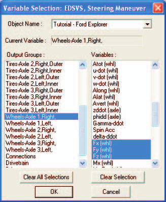
*Figure 5-14: Variable Selection dialog, used for selecting the results displayed in the Output Report. The variable list is displayed after selecting the Wheels group and selecting Axle 1, Right Side.*

The Variable Output report for the *EDSVS, Steering Maneuver* event now includes X,Y path coordinates and heading angle, path radius, and right front Fx, Fy, Fz tire forces, steer angle, plus any other variables you may have added (see Figure 5-15).

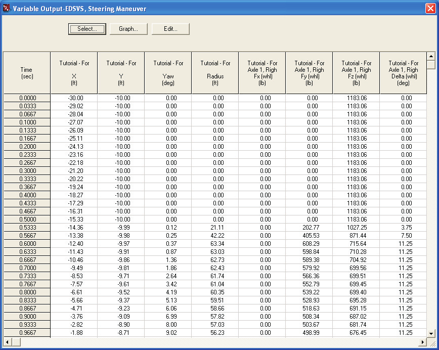
*Figure 5-15: Variable Output report for EDSVS, Steering Maneuver, displaying the selected results.*

### Trajectory Simulation

Finally, let's display a trajectory simulation for this event. To view the Trajectory Simulation for the *EDSVS, Steering Maneuver* event, perform the following steps:

1. Click *Add New Object*. The Report Window Information dialog is displayed.
2. Select *EDSVS, Steering Maneuver* from the Active Events list.
3. Click on the *Selected Output* option list and choose *Trajectory Simulation*.
4. Press *OK*.

The Trajectory Simulation viewer is displayed for the *EDSVS, Steering Maneuver* event (see Figure 5-16). The vehicle is shown at its initial position.

To visualize the motion, use the Playback Controller to perform the following steps:

1. Click *Play* (single right-arrow). The simulation begins and is displayed at the current Playback output interval.
2. Click *Pause*. The simulation stops.
3. Click *Reverse* (single left-arrow). The simulation plays in reverse.
4. Click *Rewind* (left arrow with bar). The simulation returns to the start.
5. Click *Advance to End* (right arrow with bar). The simulation advances to the end of the run.

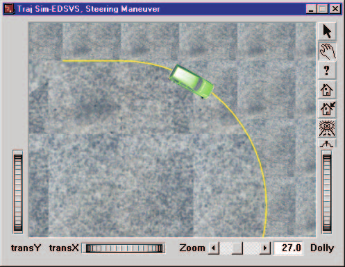
*Figure 5-16: Trajectory Simulation for EDSVS, Steering Maneuver, displaying the selected results.*

### Printing

The final step is to print the above reports. Printing reports is simple. All you do is choose a report and print it. For example:

1. Click on the dialog header of the *Variable Output - EDSVS, Steering Maneuver* report. Your selection is highlighted and the Variable Output window pops to the top of the display (if it isn't there already), indicating it is the current window.
2. Click on the *File* menu and choose *Print*. The Print dialog is displayed, allowing the user to select from several available print options.

   > NOTE: Alternatively, you can click on the print icon in the main menu bar.

3. Press *OK*. The Variable Output report is printed on the system printer.

That's all there is to it! You can print any other report using the same three steps described above.

> NOTE: The Print dialog provides several options. Refer to the User's Manual for more information.

> NOTE: For several reports it may be best to print in landscape rather than portrait mode.

> NOTE: The font size of both the printed reports and screen display may be changed by clicking on the Options menu and choosing Preferences. Use the Font Size option list to change the size.

---

[Previous: Chapter 4 — Calculation Method](04-calculation-method.md) | [Contents](README.md) | [Next: Chapter 6 — EDSVS Messages](06-messages.md)

<!-- NAV -->

---

← Previous: [Chapter 4 — EDSVS Calculation Method](04-calculation-method.md)  |  [Index](README.md)  |  Next: [Chapter 6 — EDSVS Messages](06-messages.md) →

<!-- /NAV -->
