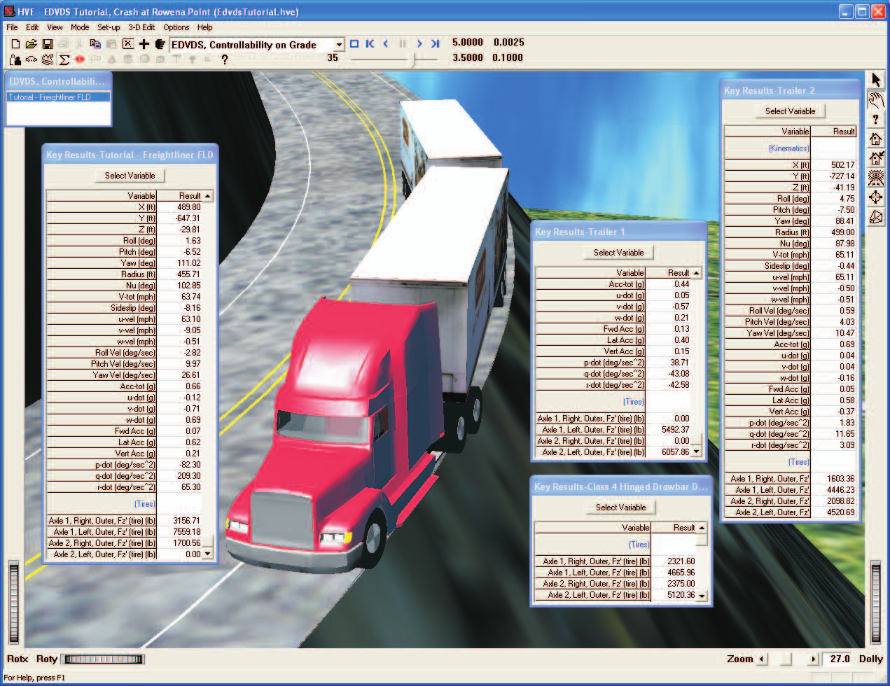

# Chapter 1 — EDVDS Program Description

## Overview

**EDVDS** (**E**ngineering **D**ynamics Corporation **V**ehicle **D**ynamics **S**imulator) is a simulation of the dynamic response of a vehicle towing up to three trailers. It is based on a program called Phase 4 developed at the University of Michigan Transportation Research Institute [1]. EDVDS simulates the vehicle's response to driver inputs (accelerating, braking and steering). EDVDS determines how the vehicle responds to these inputs by generating the vehicle path, velocity, acceleration, tire forces, and other data as a function of time.

EDVDS includes several extensions to the original Phase 4 program. These extensions, developed by Engineering Dynamics Corporation, include a full 3-dimensional simulation capability, an updated suspension model with jounce and rebound stops, an updated semi-empirical tire model that supports a full 360 degree range of slip angles and a 2-step radial tire stiffness, and the ability of each tire to respond to an arbitrary 3-D terrain.

Vehicle design engineers can use EDVDS to assess how various changes to suspension and tire parameters affect vehicle handling behavior. After setting up a series of simulation experiments, such as step-steer or J-turn maneuvers, alternate ramp traversals or a timed series of brake application pressures, engineers can vary the vehicle design parameters of interest and quickly determine their effect. Other examples include the effect of changes in vehicle weight distribution, wheelbase, track width, CG height, tire friction, cornering stiffness, hitch or kingpin location and other parameters.

Accident investigators can use EDVDS to determine how a driver may have lost vehicular control. By repeated adjustments of the throttle, braking and steering input tables, the researcher will converge on those driver inputs which match accident site evidence. Thus, the user learns how a driver's inputs may have affected the cause and/or outcome of an accident.

*Figure 1-1: EDVDS Event illustrating a commercial vehicle loss of control on a downhill grade.*

EDVDS employs full 3-dimensional engineering models with up to 23 degrees of freedom for each vehicle. The program supports up to 4 axles per vehicle, solid axle suspension types with inter-tandem load transfer, and single and dual tires. Combination vehicles are connected using fixed and converter dollys with rigid or hinged drawbars. EDVDS also employs a comprehensive drivetrain model with engine performance parameters and multi-gear transmissions and differentials.

Tire vs terrain is modeled transparently to the user. At each simulation timestep, the EDVDS tire model uses HVE's `GetSurfaceInfo()` function to query the terrain's physical characteristics (elevation, slope and friction) beneath each tire. The EDVDS tire model then uses this information to determine current tire forces at each tire.

## Model Inputs

EDVDS inputs include one to six vehicles (a tow vehicle and up to three trailers; the latter two including front dollys with drawbars) and an optional 3-D environment. Event set-up parameters include vehicle initial positions and velocities, various driver control options (steering, braking and throttle) and payloads.

## Model Outputs

EDVDS output reports include Messages, Accident History, Program Data, Vehicle Data, Variable Output and Trajectory Simulations.

## Validation

An interim version of the EDVDS simulation model (internally referred to as EDPH4) was first ported to HVE from the original Phase 4 code. EDPH4 was then validated by direct comparison with results obtained using Phase 4. These in-house validations included validation studies in the original Phase 4 research documents [1,3], as well as additional validations to test the various program options. The equations of motion were then extended significantly; this resulted in the code called EDVDS. The code was extended to eliminate many of the simplifying assumptions in the original Phase 4 code. These changes are described in [Chapter 4](04-calculation-method.md) of this manual as well as in reference [28]. Final validation of the EDVDS is also presented in reference [28].

One of the main reasons for extending the original code was to allow it to take advantage of the HVE simulation environment. These changes allow the user to position the combination vehicle anywhere in the environment (the original code required the tow vehicle to begin at the inertial origin) and to drive directly on a 3-D terrain.

## Basic Procedure

The procedure for using EDVDS is substantially the same as using any simulator in the HVE environment:

- Use the Vehicle Editor to add a tow vehicle, up to three trailers and up to two dollys to the case. Optionally, edit any of the default vehicle parameters.
- Optionally, use the Environment Editor to create a visual and physical environment.
- Use the Event Editor to set up and execute the EDVDS simulation model by performing the following steps:
  - Choose the tow vehicle and trailer(s) *in that order* from the list of vehicles created earlier.
  - Choose the EDVDS calculation model.
  - Position the tow vehicle in the environment, and assign an initial velocity.
  - Optionally, edit the trailer's default position and velocity.
  - Assign driver controls (Steering, Braking, Throttle) for the tow vehicle and trailer.
  - Optionally, assign payloads to any of the vehicles.
  - Execute the simulation event.
  - Modify the initial conditions and driver inputs as required to achieve the desired match between the simulation and actual event.
- Use the Playback Editor to view the various reports and trajectory simulations. If desired, produce a video output of the simulation.

<!-- NAV -->

---

← Previous: [EDVDS — Vehicle Dynamics Simulator](README.md)  |  [Index](README.md)  |  Next: [Chapter 2 — EDVDS Program Input](02-program-input.md) →

<!-- /NAV -->
