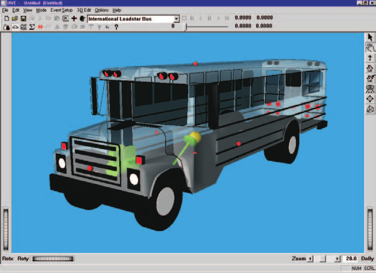
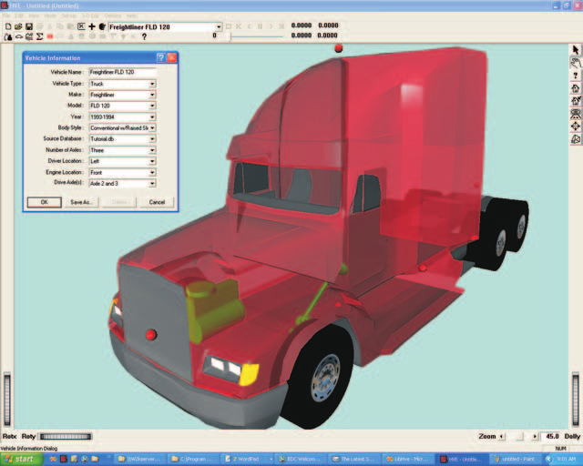
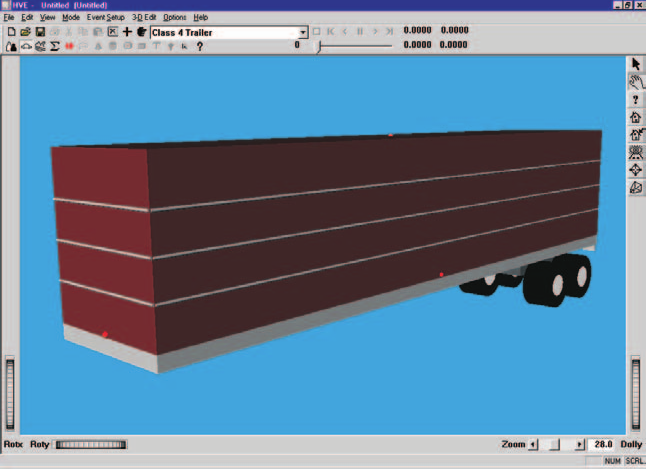
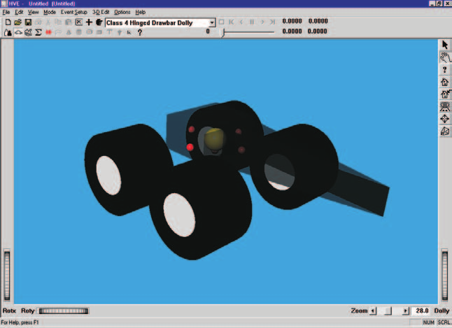
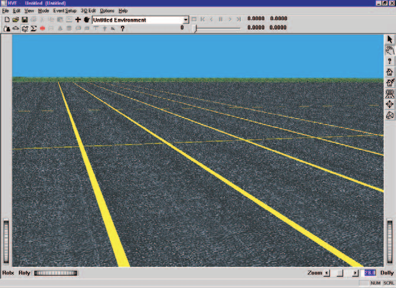
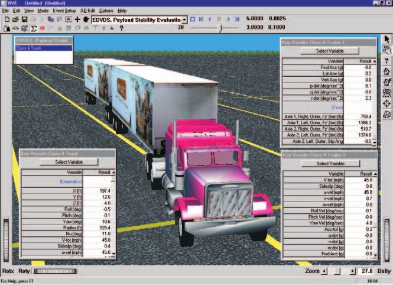
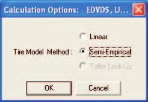

# Chapter 2 — EDVDS Program Input

This chapter defines the objects (humans, vehicles and environment) and the event set-up parameters (positions, damage profiles, driver controls, and so forth) used by the EDVDS analysis. In general, the chapter is divided into the following sections:

- **Objects** — The number of humans and vehicles, and the specific human and vehicle parameters actually used by EDVDS.
- **Events** — The various HVE options available for setting up and executing an EDVDS event.

## Objects Overview

The objects used by the EDVDS model are:

- **Humans** — Humans are not simulated by EDVDS.
- **Vehicles** — Up to six vehicles (a tow vehicle and up to three trailers and two dollys) may be included in an EDVDS event.
- **Environment** — Like the *real* world, EDVDS has exactly one environment.

> **NOTE:** The environment is used in any HVE-compatible reconstruction or simulation model.

The following sections describe how the vehicle and environment provide the required inputs to the EDVDS calculation model.

## Vehicles

EDVDS uses up to six vehicles created using the HVE Vehicle Editor (see Figures 2-1, 2-2 and 2-3). Vehicles are selected from the Vehicle Database by choosing the following attributes:

- **Type** — EDVDS supports the following vehicle types: *Passenger Car, Pickup, Van, Sport-Utility, Truck, Trailer* and *Dolly*.
- **Make** — EDVDS supports all available vehicle makes.
- **Model** — EDVDS supports all available vehicle models, within the limits defined by number of axles and drive axles; see below.
- **Year** — EDVDS supports all available vehicle years.
- **Body Style** — EDVDS supports all available vehicle body styles.

Each vehicle also has the following additional user-editable parameters:

- **Driver Location** — The *Driver Location* is not used by EDVDS. However, *Driver Location* for the tow vehicle must not be *None*; otherwise, the Driver Controls (Steering, Brakes, Throttle, Gear Selection) will not be available during Event mode.
- **Engine Location** — The *Engine Location* is not used by EDVDS. However, *Engine Location* for the tow vehicle must not be *None*; otherwise, the Throttle Table will not be available during Event mode.
- **Number of Axles** — The tow vehicle may include two or three axles; trailers and dollys may have either one or two axles.
- **Drive Axle(s)** — EDVDS supports all drive axles.

To add a vehicle to the current HVE case, perform the following steps:

1. Choose Vehicle Mode. The Vehicle Editor is displayed.
2. Choose *Add New Object*. The Vehicle Information dialog is displayed.
3. Click on the *Type, Make, Model, Year* and *Body Style* option buttons to select a vehicle from the database.
4. If desired, modify the *Driver Location, Engine Location, Number of Axles* and *Drive Axle(s)* for the current vehicle.
5. Enter a name for the current vehicle. A default name is supplied for each selected vehicle. Its name is user-editable, and does not affect calculations.

   > **NOTE:** Duplicate vehicle names are not allowed in the same case.

6. Click *OK* to add the vehicle to the current case.

*Figure 2-1: Typical Truck (above) and Tow Vehicle (below).*

*Figure 2-2: EDVDS Trailer — a Class 4 trailer from the HVE Generic Vehicle library.*

*Figure 2-3: EDVDS Dolly — a Class 4 Converter Dolly from the HVE Generic Vehicle library.*

The following Vehicle Parameter groups are used by EDVDS:

- Sprung Mass
  - Inertias
  - Move CG
  - Inter-vehicle Connections
- Unsprung Mass
  - Wheel Location
  - Tire Data
  - Suspension Data
  - Brake Data
- Steering System
- Brake System
- Drivetrain

> **NOTE:** The Exterior Data Group (Overall Dimensions, Structural Stiffness Coefficients) is not used by EDVDS.

> **NOTE:** Be sure both vehicles have the proper connections (King Pin/Fifth Wheel, Pintle Hook/Eye, or Ball/Hitch). If the connections are not compatible, or if connections are not supplied, a message will be issued during Event Set-up.

The specific vehicle data used in each of the above parameter groups are defined in Tables 2-1 through 2-5.

### Sprung Mass

The Sprung Mass parameter groups used by EDVDS are shown in Table 2-1. Information on each group is provided below.

**Table 2-1: Vehicle Sprung Mass Parameters Used By EDVDS**

| Parameter | Description |
|---|---|
| Sprung Weight | Weight of sprung mass |
| Sprung Mass Roll, Pitch and Yaw Inertia | Rotational inertias of sprung mass about the vehicle-fixed x, y and z axes, respectively |
| Move CG x,z | Relocates the CG in the vehicle-fixed x and z directions (lateral relocation is not supported by EDVDS). This entry causes an automatic adjustment of all vehicle coordinate-related parameters (e.g., contact surface, belt anchor points). |
| Inter-vehicle Connections | Vehicle-fixed x,y,z connection coordinates; rear connections also include maximum articulation angle. |

#### Inertias

EDVDS uses the total vehicle weight (converted to mass according to the current gravitational constant; see Environment), and the roll, pitch and yaw rotational inertias of the sprung mass.

The total weight is used because it is the value traditionally obtained from data sources. The equations of motion require that the sprung mass be known. To obtain this value, EDVDS simply deducts the weight of the suspensions and wheels.

> **NOTE:** The inertial contributions of the front and rear suspensions are added to calculate the total yaw inertia reported in the Vehicle Data output report.

#### Move CG

Move CG is not directly used by EDVDS. Its current value does not show up in the results. However, the Move CG fields may be used to quickly move the vehicle's center of gravity; the x,y,z coordinates for the wheels are updated to reflect the new CG location.

#### Geometry File

The Geometry File is not used by EDVDS.

#### Contact Surfaces

Contact Surface parameters are not used by EDVDS.

#### Belt Restraints

Belt Restraint parameters are not used by EDVDS.

#### Airbag Restraints

Airbag Restraint parameters are not used by EDVDS.

#### Inter-vehicle Connections

Inter-vehicle Connection parameters define the type, location and properties of the front and rear vehicle connections. The x,z location is specified relative to the vehicle CG. The z coordinates for each vehicle determine the elevation at the connection point, and thus establish the pitch angle of the trailer.

Dollys may be either *fixed* or *converter* dollys. A fixed dolly is permanently attached to the front of the trailer and normally has a hinged drawbar. A converter dolly is removable. It normally has a hinged fifth wheel and a fixed drawbar. See [Chapter 4](04-calculation-method.md) for more information about drawbar types and their characteristics.

*Maximum Articulation Angle* is only supplied for rear connections.

> **NOTE:** Every trailer will have a pre-defined front connection. However, not every tow vehicle has a pre-defined rear connection. Use the Vehicle Editor to confirm the vehicle has a connection.

> **NOTE:** If no connection is supplied, EDVDS cannot be executed; a message will be displayed during Event Set-up.

> **NOTE:** The rear connection of the first tow vehicle must be a fifth wheel. If it is not, a message will be displayed during Event Set-up.

#### Drag Forces

Drag Force parameters are not used by EDVDS.

### Unsprung Mass

The Unsprung Mass parameters used by EDVDS are shown in Table 2-2. Information on each group is provided in this section.

**Table 2-2: Vehicle Unsprung Mass Parameters Used By EDVDS**

| Parameter | Description |
|---|---|
| Wheel Location | Vehicle-fixed x,y,z coordinates for each wheel |
| Brake Time Lag | Time required for brake system pressure to reach the brake actuation chamber |
| Brake Time Rise | Time required for air to fill the brake actuation chamber and begin stroking the pushrod |
| Brake Torque Ratio | The ratio of effective brake torque at the wheel to fluid pressure in the wheel cylinder |

#### Wheel Location

For each vehicle in the simulation, EDVDS uses the following wheel location parameters:

- **X_wheel** — the longitudinal distance from the CG to each axle.

  > **NOTE:** X_wheel is assumed to be the same for left and right-side tires. If different values are entered, EDVDS uses the average.

- **Y_wheel** — the lateral distance from the CG to each axle.

  > **NOTE:** Y_wheel is assumed to be the same for left and right-side tires. If different values are entered, EDVDS uses the average (thus, bilateral symmetry is assumed).

- **Z_wheel** — the vertical distance from the CG to each axle.

  > **NOTE:** Z_wheel is initially assumed to be the same for left and right-side tires.

#### Brake

EDVDS uses the wheel brake system *Time Lag, Time Rise* and *Brake Torque Ratio*. The specific parameters used by EDVDS are shown in Table 2-2.

EDVDS also fully supports the HVE Brake Designer. Refer to the Brake Designer section of the HVE User's Manual for more information.

#### Tire

EDVDS allows the user to choose from three tire models:

- **Linear** — A simplified model, useful for non-limit maneuvers
- **Tire Model (Semi-Empirical)** — A good, general purpose tire modeling method
- **Tire Table** — The most sophisticated tire modeling technique *(updated: the Table Look-Up method is not currently available; it is greyed out in the Calculation Options dialog and the physics engine rejects it with an error if it is ever selected — see `Vdsinput2.cpp`, `ERROR_TIRE_MODEL_NOT_SUPPORTED`)*

The modeling technique selected is dependent upon the particular needs of the analysis. The desired tire model is an EDVDS calculation option (see [Event](#calculation-options)).

The HVE tire parameters provide the following data groups:

- Physical Data
- Friction Table
- Cornering Stiffness Table
- Camber Stiffness Table
- Slip-vs Rolloff Table

EDVDS's use of these parameters is described below.

##### Physical Data

The Tire Physical Data used by EDVDS are shown in Table 2-3. When AutoPosition is *On*, the tires' unloaded radii are used to establish the vehicle's initial CG elevation.

##### Friction Table

The Friction Data used by EDVDS are shown in Table 2-3. The EDVDS tire model includes load- and speed-dependent friction properties.

The *In-use Factor* is a convenient way to reduce or increase the dependent friction values (peak and slide friction) by making just one adjustment.

**Table 2-3: Vehicle Unsprung Mass, Tire Parameters Used By EDVDS**

| Parameter | Description |
|---|---|
| Tire Unloaded Radius | Radius of the undeflected tire |
| Tire Initial and Secondary Deflection Rates, the Deflection at Secondary Rate and Maximum Deflection | The initial spring rate of the tire, and the spring rate after a specified amount of tire deflection. The maximum deflection is used to determine when tire deflection exceeds an allowable value. |
| Pneumatic Trail | The distance from the center of the contact patch to the center of pressure |
| Aligning Torque Coefficient | Moment about tire's vertical axis as a result of slip angle |
| Weight, Spin Inertia | The weight and rotational inertia (about the spin axis) of the tire/wheel/brake assembly |
| Tire Friction Table, Test Load/Speed | The load and speed for a given set of friction results |
| Peak Longitudinal and Lateral Friction, Slide Friction, Slip at Peak Friction and Longitudinal Stiffness | Tire frictional properties at the specified load and speed |
| Friction In-use Factor | Multiplier for Longitudinal, Lateral and Slide friction and Longitudinal Stiffness |
| Tire Cornering Stiffness Table, Test Load and Speed | The load and speed for a given cornering stiffness result |
| Cornering Stiffness | Tire lateral force per unit of tire lateral slip for small amounts of lateral slip |
| Cornering Stiffness In-use Factor | Multiplier for Cornering Stiffness values |
| Tire Camber Stiffness Table, Test Load and Speed | The load and speed for a given camber stiffness result |
| Camber Stiffness | Tire lateral force per unit of camber angle for small camber angles |
| Camber Stiffness In-use Factor | Multiplier for Camber Stiffness values |
| Slip vs Rolloff Data | Reduction in longitudinal tire force as a result of lateral slip, and the reduction in lateral tire force as a result of concurrent longitudinal tire slip |

##### Cornering Stiffness Table

The Cornering Stiffness data used by EDVDS are shown in Table 2-3. EDVDS uses the $F_y$ vs Slip Angle table if the Tire Table modeling option is selected; otherwise, the cornering stiffness is used. Cornering stiffness data may be load- and speed-dependent.

The *In-use Factor* is a convenient way to reduce or increase the dependent cornering stiffness values for all speeds and loads by making just one adjustment.

> **NOTE:** If you are simulating a vehicle with a flat tire, you probably want to reduce the In-use Factor to about 0.1.

##### Camber Stiffness Table

The Camber Stiffness data used by EDVDS are shown in Table 2-3. EDVDS uses the $F_y$ vs Camber Angle table if the Tire Table modeling option is selected; otherwise, the Camber Stiffness is used. Camber stiffness data may be load- and speed-dependent.

The *In-use Factor* is a convenient way to reduce or increase the dependent camber stiffness values for all speeds and loads by making just one adjustment.

> **NOTE:** If you are simulating a vehicle with a flat tire, you'll probably want to reduce the In-use Factor to about 0.1.

##### Slip vs Rolloff Table

The Longitudinal and Lateral Slip vs Rolloff Tables are used if the Tire Table tire model method is used. The longitudinal slip vs rolloff table defines the loss of longitudinal tire force when the tire is steered (compared to an un-steered tire). The lateral slip vs rolloff table defines the loss in lateral tire force when the tire is braked or accelerated (compared to a free-rolling tire).

*(updated: because the Table Look-Up tire model method is currently disabled, the $F_y$ vs Slip Angle, $F_y$ vs Camber Angle and Slip vs Rolloff tables are not used by the current version of EDVDS.)*

#### Suspension

The HVE Suspension Model provides the following data groups:

- Springs and Shocks
- Inertia
- Jounce/Rebound Stops
- Spindle Axis
- Camber Table
- Anti-pitch Table
- Roll Steer Table

EDVDS supports only solid axle suspensions. EDVDS's use of the suspension parameters is described below.

##### Inter-tandem Load Transfer

If three axles are supplied for the tow vehicle, or two axles are supplied for the trailer or dolly, the vehicle is assumed to have tandem axles. In this case, a longitudinal load transfer due to braking may be simulated by supplying an Inter-tandem Load Transfer Coefficient.

##### Springs and Shocks

EDVDS uses the individual spring rates for the right and left springs on an axle. They need not be equal.

Roll Center Height and Lateral Spring Spacing apply for each axle.

> **NOTE:** Remember that roll center height is measured from the sprung mass CG, and is positive downwards.

Damping properties, like spring rates, are applied to the right and left sides of each axle; they need not be equal.

The Spring and Shock data used by EDVDS are shown in Table 2-4.

##### Inertias

Inertial mass parameters do not include the weight of the brake assemblies or wheels (brake and wheel inertias are included with the tire). The Suspension Inertia data used by EDVDS are shown in Table 2-4.

**Table 2-4: Vehicle Unsprung Mass, Suspension Parameters Used By EDVDS**

| Parameter | Description |
|---|---|
| Suspension Type | Solid Axle, Tandem Axles (4-Spring or Walking Beam) |
| Ride Rate, Front and Rear | Linear spring rate for the selected suspension |
| Auxiliary Roll Stiffness | Roll stiffness from an anti-sway bar |
| Roll Center Height | For solid axle suspensions, the distance from the CG to the roll axis at the suspension |
| Lateral Spring Spacing | The lateral distance between springs |
| Damping Rate | Velocity-dependent suspension damping rate |
| Coulomb Friction | Force required to initiate suspension movement |
| Friction Null Band | Suspension velocity required for full coulomb friction |
| Suspension Weight | For solid axle suspensions, the weight of the axle, not including tires, wheels and brakes |
| Suspension Roll/Yaw Inertia | For solid axle suspensions, the rotational inertia about the vehicle-fixed x and z axes |
| Jounce/Rebound Stop, Max Deflection | Deflection from equilibrium to jounce and rebound stops |
| Jounce/Rebound Stop Linear, Cubic Stiffness | Stiffness constants for suspension stops |
| Jounce/Rebound Stop Energy Ratio | Restitution for stop, defined as the ratio of the non-conserved energy to total energy absorbed by the suspension stop |
| Camber | Camber value |
| Roll Steer | The ratio of axle steer to sprung mass roll angle |

##### Jounce and Rebound Stops

The linear and cubic deflection rate of the suspension stops is used to limit the travel of each suspension. The values need not be exact; their primary purpose is to prevent excessive excursion of an axle. The Jounce and Rebound Stop data used by EDVDS are shown in Table 2-4.

##### Spindle Axis

The Spindle Axis data are not used by EDVDS.

##### Camber and Half-Track Change Tables

Solid axle camber may be assigned to each wheel. The camber data used by EDVDS are shown in Table 2-4. Half-track change tables are not used by EDVDS.

##### Anti-pitch

The Anti-pitch tables are not used by EDVDS.

##### Roll Steer

The roll steer constant is used by each axle. Roll steer defines the amount of steering produced as the sprung mass rolls about the roll axis.

### Exterior

The Vehicle Exterior Data (Exterior Dimensions, Stiffness) are not used by EDVDS.

### Steering System Data

EDVDS uses the steering gear ratio if the *At Driver* Steering Table option is used during Event set-up. See Table 2-5. Otherwise the steering system data are not used.

### Brake System Data

The brake system pedal ratio (system pressure per unit of pedal force) is used if the *At Driver* Brake Table option is used during Event set-up. See Table 2-5. Otherwise the Brake System Data are not used by EDVDS.

**Table 2-5: Vehicle Steering, Brake System and Drivetrain Parameters Used By EDVDS**

| Parameter | Description |
|---|---|
| Steering Gear Ratio | Ratio of the angle at the steering wheel to the angle at the tire |
| Brake Master Cylinder Ratio | Brake system pressure produced per unit of pedal force applied by the driver |
| Engine Table | Engine Torque vs Speed Table for Wide-open and Closed Throttle Tables for Torque vs speed. Defines range from idle to maximum RPM. |
| Transmission Gear Table | Table of numeric ratio for each of up to 12 forward speeds plus reverse |
| Differential Gear Table | Differential numeric ratio (only single speed is supported) |

> **NOTE:** For vehicles with air brake systems, the Pedal Ratio is assigned a value of 1.0; thus, the entered pedal force is the same as the system brake application pressure.

> **NOTE:** See also Wheel Brake Data (Unsprung Mass Parameters) for related information about the vehicle's brake system parameters.

### Drivetrain Data

Engine power as a function of engine speed is defined for both wide-open throttle and closed throttle positions. The Drivetrain data (engine power vs. speed, transmission ratio, differential ratio, drivetrain inertia) are used if the *Percent Wide-open Throttle* option is used during Event set-up (see Table 2-7).

The drivetrain data used by EDVDS are shown in Table 2-5.

The user-entered Power vs. Engine Speed Table defines the valid range of engine speeds for a given event. If the maximum engine speed in the table is exceeded, the simulation terminates with an error message (see [Messages](06-messages.md)).

> **NOTE:** The typical solution to this problem is to shift sooner.

The transmission may have up to 12 forward ratios, plus reverse and neutral. The differential may have up to three ratios.

## Environment

EDVDS uses the environment created by the HVE Environment Editor (see Figure 2-4). The environment is created by defining the following groups of attributes:

- Visual Data
- Physical Data

### Creating an Environment

To add an environment to the current HVE case, perform the following steps:

1. Choose Environment Mode. The Environment Editor is displayed.
2. Click on *Add New Object*. The Environment Information dialog is displayed.
3. Click on the *Location* combo box to select the desired city, state and country, and associated *Latitude, Longitude* and *GMT*.
4. Enter the *Time* and *Date* for the event.
5. Enter the *Angle of the X axis, Wind Speed* and *Direction, Barometric Pressure* and *Temperature* for the event.
6. Enter the *Gravity Constant* for the event.
7. Enter an environment name. A default name is supplied for the current environment. The name is user-editable, and does not affect calculations.
8. Click *OK* to add the environment to the current case.

*Figure 2-4: HVE Environment Editor.*

### Visual Data

The following visual parameters may be edited:

- **Environment Location** — A database containing the name (City/State/Country), Latitude and Longitude and GMT for the selected location.
- **Time and Date** — The local standard time and date for the event.

The visual data are not used by the event; they are provided for studies related to visibility at the time of an event (e.g., avoidability of an accident).

> **NOTE:** The visual data (Location, Time, Date and Angle of earth-fixed X axis) affect the lighting of the event! Depending on your view (Camera Position) the scene may be shaded and difficult to see. If the time is after sundown, the view will be dark.

### Physical Data

The Physical Data groups are:

- Angle of X Axis
- Wind Speed and Direction
- Atmospheric Temperature and Pressure
- Gravity Constant
- 3-D Surface Geometry

The specific physical environment data used by EDVDS are described below; see also Table 2-6.

**Table 2-6: Environment Model Parameters Used By EDVDS**

| Parameter | Description |
|---|---|
| Gravitational Constant | Local gravitational constant |
| 3-D Surface Geometry (Elevation, Surface Normal, Friction Factor) | The polygon database used to create the 3-D environment |

#### Angle Of X Axis

The angle of the X axis is used to position the earth-fixed coordinate system on the surface of the earth.

> **NOTE:** The angle is specified relative to true north. If you are using a compass to determine direction at the scene of an accident, you should provide a correction factor before entering this angle.

> **NOTE:** The angle of the X axis affects how you visualize an EDVDS event because it affects the location of the sun.

#### Wind Speed and Direction

Wind Speed and Direction are not used by EDVDS.

#### Atmospheric Temperature and Pressure

Atmospheric temperature and pressure are not used by EDVDS unless the HVE Brake Designer is used. If the Brake Designer is used, atmospheric temperature and pressure are used in the calculation of brake temperatures.

#### Gravity Constant

The gravity constant converts mass to force. An object's mass and rotational inertias are properties that are the same throughout the universe; however the weight of an object is dependent on the local gravitational constant.

#### 3-D Surface Geometry

The 3-D Surface Geometry is used by the tire model in EDVDS to calculate the elevation, slope and friction multiplier for the current X,Y position of the tire.

## Event

EDVDS uses the HVE Event Editor (see Figure 2-5) to create, set up and execute an event. Each of these topics is described below.

*Figure 2-5: HVE Event Editor.*

### Creating An Event

An EDVDS event is created using the Event Information dialog.

To create an EDVDS event:

1. Choose Event Mode. The Event Editor is displayed.
2. Click on *Add New Object*. The Event Information dialog is displayed.
3. Select the tow vehicle from the Active Vehicles list.
4. Optionally, select the trailer or trailers and dollys from the Active Vehicles list.

   > **NOTE:** HVE creates the vehicle train in the order the vehicles are selected. Therefore, the vehicles must be selected in the correct order.

5. Select the calculation model, *EDVDS*, from the Calculation Model options list.
6. Enter an event name. A default name is supplied for the selected event. The name is user-editable, and does not affect calculations.

   > **NOTE:** Duplicate event names are not allowed in the same case.

7. Click *OK* to create the EDVDS event.

   > **NOTE:** If you choose a vehicle that is not compatible with EDVDS, or if the tow vehicle connections are incompatible with the trailer, a message will be displayed describing the problem. You will not be allowed to proceed until EDVDS-compatible objects are selected.

**Table 2-7: Event Set-up Parameters Used By EDVDS**

| Parameter | Description |
|---|---|
| Vehicle Initial Position | The earth-fixed X,Y,Z coordinates and roll, pitch, yaw angles of the vehicle at the start of the simulation |
| Vehicle Initial Velocity | The forward, lateral and vertical linear velocities, and the roll, pitch and yaw angular velocities at the start of the run |
| Driver Controls, Steer Table | Steer Table Option; Steering Wheel Angle vs Time or Tire Steer Angle vs Time |
| Driver Controls, Brake Table | Brake Table Option; Brake Pedal Force vs Time |
| Driver Controls, Throttle Table | Throttle Table Option; Throttle Position vs Time |
| Driver Controls, Gear Table | Transmission Gear, Differential Gear vs. Time |
| Driver Controls, HVE Driver Model | Path Follower parameters; see HVE User's Manual |
| Payload Data | Payload Exists Option; Payload CG x,z coordinates; Payload Weight; Payload Roll, Pitch and Yaw Rotational Inertias |

### Setting Up an Event

EDVDS uses the following *event set-up* options:

- Position/Velocity
- Driver Controls
- Payloads

The specific Event Set-up data used by EDVDS are defined in Table 2-7.

#### Position/Velocity

Like all simulations, EDVDS requires initial positions and velocities to be supplied by the user.

The tow vehicle is positioned relative to the earth-fixed coordinate system by supplying the X,Y,Z coordinates of its CG, and roll ($\Phi$), pitch ($\Theta$) and yaw ($\Psi$) angles about vehicle x, y and z axes, respectively.

> **NOTE:** Z, roll and pitch may be supplied automatically by HVE using AutoPosition.

The trailer is positioned relative to the tow vehicle by supplying the initial roll, pitch and yaw articulation angles. The default articulation angles are 0.0 degrees.

The tow vehicle linear velocities are supplied in the form of a total velocity and sideslip angle.

> **NOTE:** The vehicle-fixed u (forward) and v (side) velocity components are calculated using the total velocity and sideslip angle.

The trailer articulation angular velocities are assigned relative to the tow vehicle. Zero angular velocity is assumed as a default, and values need not be entered.

#### Driver Controls

EDVDS uses the following Driver Controls:

- **Steering** — A table of steering inputs as a function of time. The *At Driver* and *At Axle* options are supported.
- **Braking** — A table of braking inputs as a function of time. The *Wheel Force* and *Percent Available Friction* options are supported.
- **Throttle** — A table of throttle inputs as a function of time. The *Wheel Force* and *Percent Available Friction* options are supported.
- **Gears** — A table of transmission and differential gear selections as a function of time.
- **HVE Driver Model** — A closed-loop model that determines the driver steering inputs required to cause the vehicle to follow the desired path. The HVE Driver Model is described in the HVE User's Manual and in Reference [29].

The Driver Controls Data used by EDVDS are shown in Table 2-7.

#### Damage Profile

The Damage Profile Data are not used by EDVDS.

#### Payload

The Payload Data used by EDVDS include the payload coordinates relative to the vehicle's CG, and the payload rotational inertias.

> **NOTE:** Lateral payload offset is not supported.

> **NOTE:** Payload positioning is relative to the vehicle CG, not the rear suspension.

#### Collision Pulse

The Collision Pulse data are not used by EDVDS.

#### Contacts

The Contacts data are not used by EDVDS.

#### Restraints

The Restraints data are not used by EDVDS.

### Simulation Controls

EDVDS uses the current simulation control parameters in the Simulation Controls dialog (see Options Menu, Simulation Controls). The Simulation parameters used by EDVDS are shown in Table 2-8.

**Table 2-8: Simulation Control Parameters Used By EDVDS**

| Parameter | Description |
|---|---|
| Vehicle Trajectory Integration Timestep | The integration timestep used by the numerical integration routine |
| Output Interval | The timestep used to send output results back to HVE |
| Maximum Simulation Time | Maximum length of the run |
| Minimum Linear Velocity | The linear velocity used to terminate the run (if the linear and angular velocities are simultaneously less than these termination velocities, the run terminates) |
| Minimum Angular Velocity | The angular velocity used to terminate the run (if the linear and angular velocities are simultaneously less than these termination velocities, the run terminates) |

> **NOTE:** The output time interval should be an even multiple of the vehicle trajectory integration timestep. For example, if the integration timestep is 0.0025 sec, the output interval might be 20 x 0.0025, or 0.0500 sec.

### Executing An Event

#### Calculation Options

EDVDS has one calculation option (see Figure 2-6); for full details see the [EDVDS Calculation Options reference](../../10-calculation-options/CalcOptEDVDS.md):

- **Tire Model Method** — Select from three methods: Linear (the default; to be used only for simple, non-limit maneuvers), Semi-Empirical (the most robust method) and Table Look-Up (not currently implemented; the choice is greyed out in the dialog and rejected by the physics engine).

*(updated: the original manual stated that Semi-Empirical is the default. In the current code the dialog initializes `calcOptions.calcInt[0] = 0`, which is Linear (`LINEAR_TIRE`); Semi-Empirical is `TIRE_MODEL = 1`. See `HVEINV-64/EdVdsDlg.cpp` and `Physics/Source/Edvds/Vdsinput2.cpp`.)*

> **NOTE:** EDVDS will terminate with an error message if you select the Linear tire model method for an event that results in tire longitudinal or lateral slip beyond the linear range.

*Figure 2-6: EDVDS Calculation Options dialog.*

#### Get Surface Information

This option determines how EDVDS selects the current terrain properties from the environment 3-D geometry file. The default value is *From Previous Polygon*. This option results in fastest execution, but does not work for all environments. Refer to the HVE User's Manual for further information about how GetSurfaceInfo works.

*(updated: the terrain search method is no longer part of the EDVDS Calculation Options dialog; it is selected in the separate Get Surface Information Options dialog (Options menu). The available methods are From First Polygon, From Previous Polygon and From Previous Polygon, Sorted. The By Elevation method is not supported by EDVDS — selecting it causes the event to terminate with an error (`ERROR_BAD_EVENT_GETSURFACE_OPT3_NOT_SUPPORTED` in `Vdsinput2.cpp`).)*

#### Event Execution

To execute an EDVDS event, use the Event Controller, shown in Figure 2-7. The Event Controller's buttons have the following functions:

- **Reset** — Reinitialize the calculation model for re-execution
- **Rewind to Start** — Return to the start of the simulation
- **Reverse** — Play the simulation backwards
- **Pause** — Pause the simulation
- **Play** — Execute the event or play the simulation forwards
- **Advance to End** — Advance to the end of the simulation

*Figure 2-7: Event Controller, used for starting and stopping event execution. The Event Controller can also be used for replaying previously executed events, both forward and backward.*

> **NOTE:** If you make changes to any of the event set-up options (see previous section), those changes will have no effect unless you press Reset before pressing Play.

> **NOTE:** Remember to use HVE's Options Menu to choose useful options, such as Key Results, Axes, Velocity Vectors and Skidmarks.

<!-- NAV -->

---

← Previous: [Chapter 1 — EDVDS Program Description](01-program-description.md)  |  [Index](README.md)  |  Next: [Chapter 3 — EDVDS Program Output](03-program-output.md) →

<!-- /NAV -->
