# Chapter 3 — EDVDS Program Output

This chapter defines the outputs available from an EDVDS event. The reports produced by EDVDS are available in the HVE Playback Editor.

## Overview

EDVDS produces three types of output reports:

- **Alpha-Numeric Reports** — Reports containing text and numeric information, such as vehicle dimensional parameters
- **Variable Output Tables** — Reports containing tabular simulation results as a function of time
- **Trajectory Simulations** — Viewers containing dynamic, 3-D visual simulations

> **NOTE:** Each of these reports may be printed on the system printer. To print a report, click on the menu bar of the desired output report (the menu bar will change colors indicating that it is selected), then either choose Print from HVE's Files menu or click on the Print icon in the toolbar. Refer to the HVE User's Manual for further details.

To view any of these reports, perform the following steps:

1. Choose Playback Mode. The Playback Editor is displayed.
2. Click *Add New Object*. The Report Window Information dialog is displayed, showing a list of all the current events in the case.
3. Select an EDVDS event from the list. Once an event is selected, the Selected Output option list is displayed, containing all the available reports for the selected event.
4. Choose the desired report from the Selected Output list. The available output reports are:
   - Messages
   - Accident History
   - Program Data
   - Vehicle Data
   - Trajectory Simulation
   - Variable Output
5. Enter a Report Window Name. A default name is supplied for the selected preview window. The name is user-editable, and does not affect calculations.

   > **NOTE:** Duplicate Report Window names are not allowed. Because HVE truncates the name to 30 characters, you should ensure that two truncated names are not the same.

6. Click *OK* to display the report.

## Alpha-Numeric Reports

EDVDS produces the following alpha-numeric reports:

- **Messages** — A list of messages produced by the current run
- **Accident History** — A table of initial and final positions and velocities
- **Driver Controls** — A table of user-entered vehicle driver controls
- **Environment Data** — A table describing the environment physical and geometrical properties
- **Program Data** — A table containing program control information for the current run
- **Vehicle Data** — A series of tables containing the vehicle data used by EDVDS

An example of each of these numeric output reports from EDVDS is shown on the following pages.

### Messages

A typical Messages Report is shown in Figure 3-1. For a complete listing of messages issued by EDVDS, see [Chapter 6](06-messages.md).

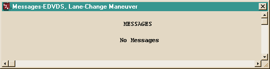
*Figure 3-1: An Example of a Message Output Report issued by EDVDS.*

### Accident History

The Accident History Report displays a table of initial and final positions and velocities for each vehicle (tow vehicle and trailers). A typical Accident History Report is shown in Figure 3-2.

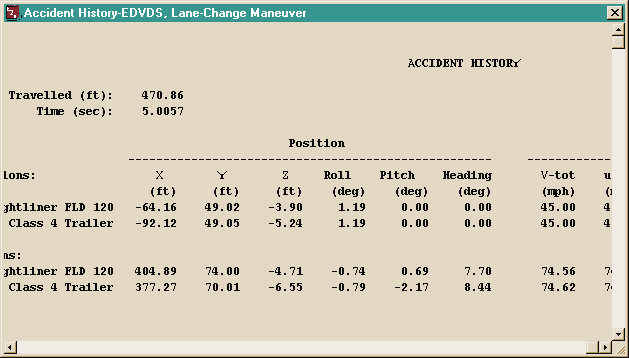
*Figure 3-2: An Example of an Accident History Output Report issued by EDVDS.*

### Driver Controls

The Driver Controls report displays a table of user-entered driver control tables for steering, braking and throttle for each vehicle in the event. A portion of a typical Driver Data report is displayed in Figure 3-3.

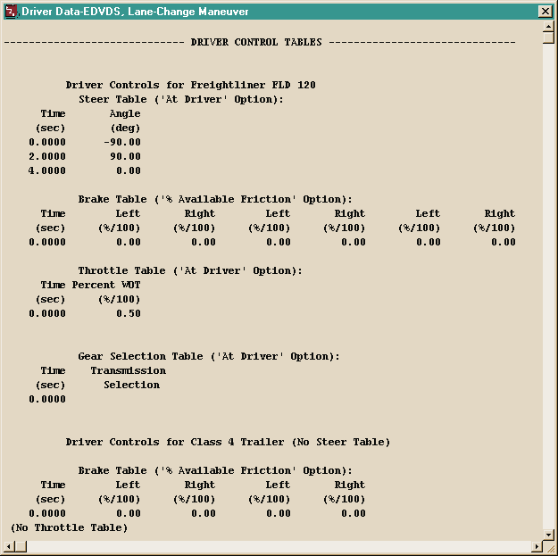
*Figure 3-3: An Example of a Driver Controls Output Report issued by EDVDS.*

### Environment Data

The Environment Data report displays the physical and visual information describing the environment. This information is displayed in two sections:

- **General Environment Data** — Physical parameters describing the environment (Temperature and Pressure are not used in the EDVDS calculations) *(updated: the original manual said "EDSMAC4" here, a typographical error carried over from another manual)*
- **3-D Environment Terrain Data** — Geometric parameters describing the terrain, including the 3-D geometry filename, number of polygons, the current GetSurfaceInfo method (From First Polygon, From Previous Polygon, From Previous Polygon Sorted, or By Elevation) and the minimum/maximum terrain elevations.

A typical Environment Data report is displayed in Figure 3-4.

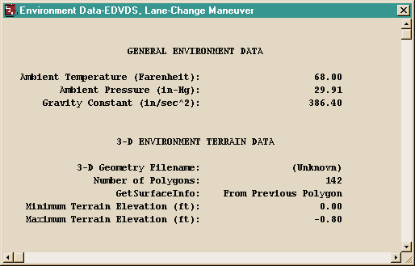
*Figure 3-4: An Example of an Environment Data Output Report issued by EDVDS.*

> **NOTE:** A detailed description of the terrain vertex information is not practical owing to its large size (a terrain is often composed of several thousand vertices). However, it is possible to view the terrain information (friction multiplier, slope, elevation, and so forth) beneath each tire at each timestep during the simulation by selecting the tire terrain outputs in the Variable Output, Tires output group (see Variable Output later in this chapter).

### Program Data

The Program Data Report includes the following information:

- **General Information** — EDVDS version number and model options used for the current event (HVE version, EDVDS version, date and time of execution, Tire Model Method and dimension basis)
- **Simulation Controls** — Integration parameters used for the current event (Maximum Simulation Time, Integration Time Step, Output Interval, Linear Termination Velocity, Velocity Convergence Criterion, Maximum Bisections)

A typical Program Data Report is shown in Figure 3-5.

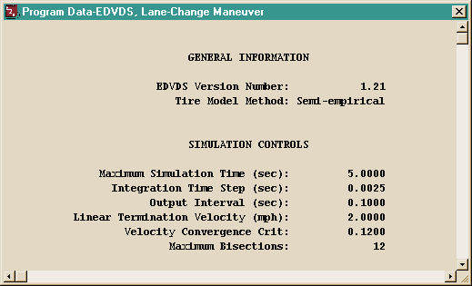
*Figure 3-5: An Example of a Program Data Output Report issued by EDVDS.*

### Vehicle Data

The Vehicle Data Report includes the following information:

- **Vehicle Dimensional and Inertial Properties** — The dimensional and inertial parameters used by EDVDS in the current event.

  > **NOTE:** The Total Yaw Inertia adds the effect of the unsprung masses (i.e., the wheel and axle masses) to the sprung mass; thus, the value printed is greater than the one displayed in the Vehicle Editor's Inertias dialog.

- **Suspension Properties** — The suspension parameters used by EDVDS in the current event.
- **Tire Properties** — The tire parameters used by EDVDS in the current event.
- **Brake Properties** — The wheel brake parameters used by EDVDS in the current event.

A portion of a typical Vehicle Data Report is shown in Figure 3-6 (Parts 1-5).

> **NOTE:** The entire Vehicle Data report can be quite lengthy, especially for a combination vehicle with several trailers and dollys.

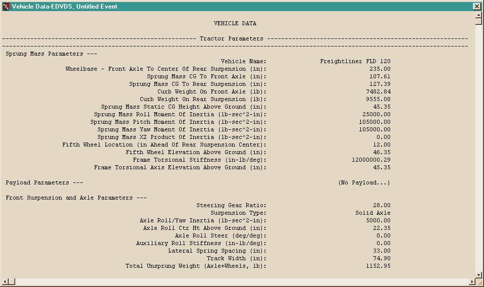
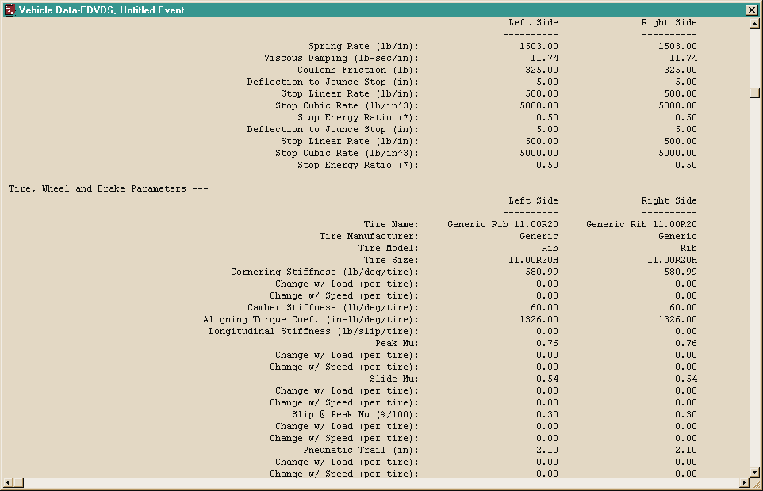
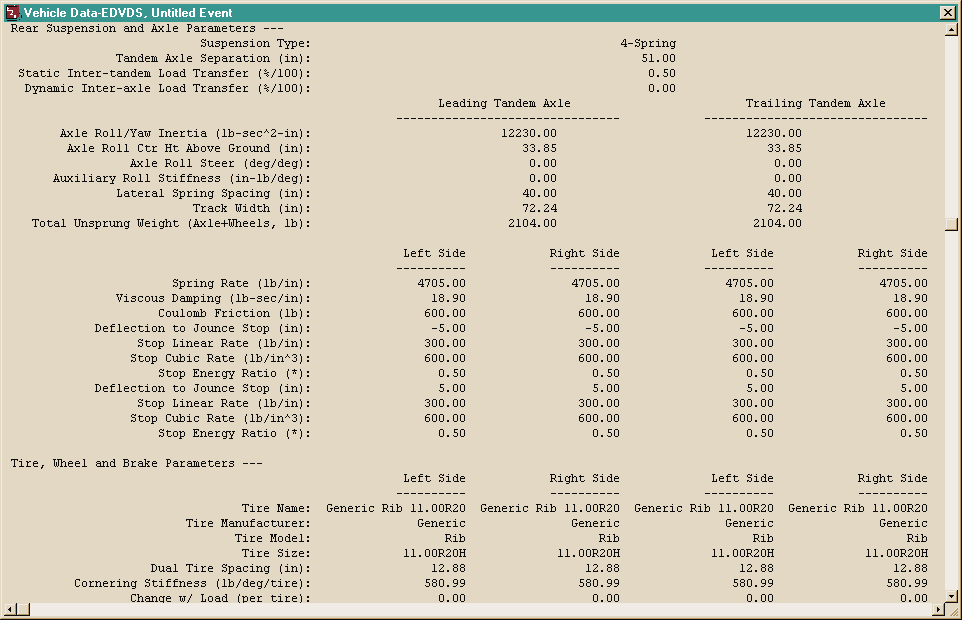
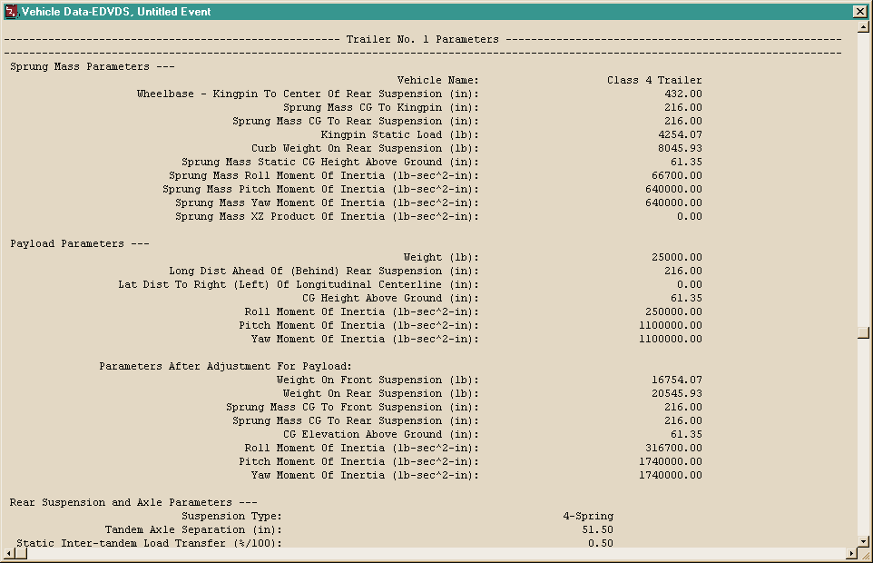

*Figure 3-6 (parts 1-5): An Example of a Vehicle Data Output Report issued by EDVDS, showing Tractor Sprung Mass, Suspension and Axle, Tire/Wheel/Brake, Trailer and Payload parameter sections.*

## Graphic Reports

EDVDS produces no Graphic Output Reports.

> **NOTE:** Graphs of simulation results vs time may be produced using the Variable Output window (see next section).

## Variable Output Table

EDVDS produces a Variable Output table containing the time-based simulation results. The Variable Output groups produced by EDVDS are as follows:

### Vehicle Output Groups

- **Kinematics** — Position, velocity and acceleration for the vehicle
- **Kinetics** — Forces and moments acting on the sprung mass
- **Accelerometers** — Linear accelerations at user-specified locations on the vehicle
- **Tire** — The tire output parameters existing at the tire contact patch (compare with Wheel Output, below)
- **Wheel** — The wheel output parameters existing at the wheel's hub. Information about the position of each wheel (compare with Tire output, above)
- **Connections** — The articulation angles and inter-vehicle connection forces
- **Driver** — Current levels of driver inputs (steering, braking, throttle and gear ratios)

An example of a Variable Output table is shown in Figure 3-7. A detailed listing of each Variable Output parameter produced by EDVDS is found in Table 3-1. For more information about HVE Variable Output parameters, refer to the HVE User's Manual, Chapter 16, Event Model.

**Table 3-1: Vehicle Variable Output Data**

| Parameter | Description |
|---|---|
| Vehicle Kinematic Data | X,Y,Z position of CG; $\Phi,\Theta,\Psi$ orientation; Total linear velocity, u,v,w components; Sideslip, course angles; p,q,r angular velocity; Total linear accel, fwd, side, vert components; u-dot, v-dot, w-dot linear components; p-dot, q-dot, r-dot angular components |
| Kinetic Data | $\Sigma F_x$, $\Sigma F_y$, $\Sigma F_z$ (Suspension); $\Sigma M_x$, $\Sigma M_y$, $\Sigma M_z$ (Suspension); $\Sigma F_x$, $\Sigma F_y$, $\Sigma F_z$ (Connection); $\Sigma M_x$, $\Sigma M_y$, $\Sigma M_z$ (Connection) |
| Accelerometer Data | Total linear acceleration; forward, lateral, vertical components for each accelerometer |
| Tire Data | X,Y,Z position of tire contact patch; $F_x'$, $F_y'$, $F_z'$ of tire contact patch; Loaded Tire Radius; Longitudinal Slip; Slip Angle; Skid Flag |
| Wheel Data | x,y,z location of wheel; Camber, Steer angle of wheel; Wheel Spin Velocity; $F_x$, $F_y$, $F_z$ of wheel; Jounce/Rebound displacement, velocity; Spring, Damping and Anti-pitch Suspension Force; Drive and Brake Torque at wheel; Brake Pressure at wheel |
| Connection Data | Articulation roll, pitch, yaw; Articulation p,q,r angular velocity; Articulation p-dot, q-dot, r-dot angular acceleration; Connection $F_x$, $F_y$, $F_z$; Connection $M_x$, $M_y$, $M_z$ |
| Drivetrain Data | Engine Speed, Power and Torque; Transmission and Differential Numeric Ratio |
| Driver Data (*) | Steering wheel angle; Throttle position; Brake Pedal Force and Master Cylinder Pressure; Transmission and Differential Gear Selection |

(*) If Driver Control option was 'At Driver'

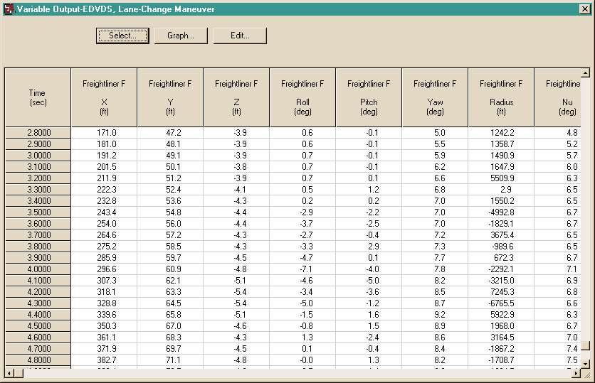
*Figure 3-7: Typical Variable Output Table for an EDVDS event.*

## Trajectory Simulations

EDVDS produces a trajectory simulation of the current event. The trajectory simulation is a 3-D visualization of the data displayed in the Variable Output table (see previous section). An example of a trajectory simulation is shown in Figure 3-8.

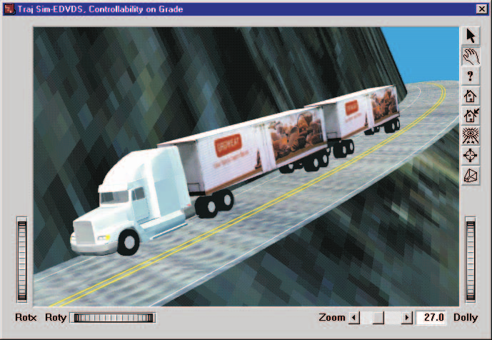
*Figure 3-8: Typical EDVDS Trajectory Simulation.*

### Displaying a Trajectory Simulation

The Trajectory Simulation is controlled using the Playback Controller (Figure 3-9). The Playback Controller's buttons have the following functions:

- **Reset** — Returns to the start of the simulation and reinitializes the video output device (this applies a hardware reset and is otherwise the same as the *Rewind to Start* button, below)
- **Rewind to Start** — Return to the start of the simulation
- **Reverse** — Play the simulation backwards
- **Pause** — Pause the simulation
- **Play** — Execute the event or play the simulation forwards
- **Advance to End** — Advance to the end of the simulation

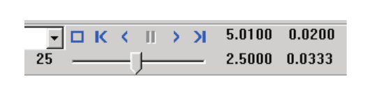
*Figure 3-9: Playback Controller.*

<!-- NAV -->

---

← Previous: [Chapter 2 — EDVDS Program Input](02-program-input.md)  |  [Index](README.md)  |  Next: [Chapter 4 — Calculation Method](04-calculation-method.md) →

<!-- /NAV -->
