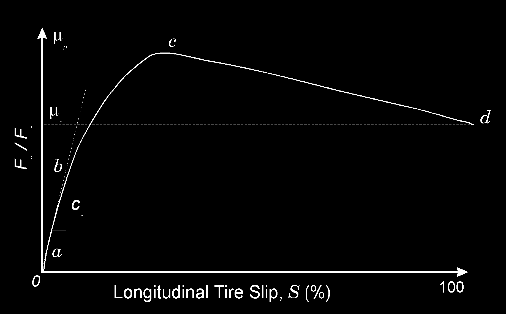
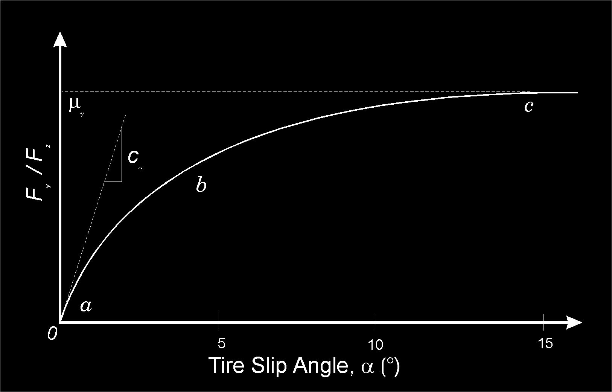
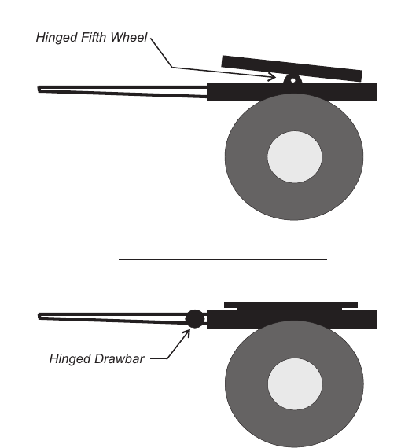

# Chapter 4 — Calculation Method

## Basis for Analysis

EDVDS is a dynamic analysis of a unit or combination vehicle (tractor towing up to three trailers). The first trailer is a semi-trailer, while the second and third trailers are full trailers with the front of the trailer supported by a dolly (fixed or converter type). Each vehicle front and rear suspension may have single or tandem axles. Tandem axles may be of the 4-spring or walking beam variety. The vehicles have user-definable steering and brake systems.

The mathematical model for EDVDS was developed from a program, called Phase 4, developed for the U.S. Federal Highway Administration (FHWA) by the University of Michigan Transportation Research Institute [1-5]. EDC ported the original Phase 4 to execute in the HVE simulation environment (this process also involved rewriting the model using the C programming language). EDC then modified the code as follows:

- The equations of motion were rewritten and extended to allow complete 3-dimensional motion. The small angle assumption was eliminated.
- The equations of motion were generalized to allow the vehicle positions to be at any location (the original Phase 4 code required the tow vehicle to start in equilibrium at the earth-fixed origin) at the start of the simulation.
- The Phase 4 user-written ROAD subroutine was replaced by HVE's `GetSurfaceInfo()` function, allowing the vehicles to drive on an arbitrary 3-D surface.
- The in-line solution of the equations of motion was replaced by a simultaneous solutions procedure.

For successful use of EDVDS, a good understanding of vehicle and tire dynamics is extremely useful and is recommended. However, the following discussion is limited to the general analytical approach. For a detailed treatise on the subject of vehicle dynamics and simulation programs, the user is referred to the references listed at the end of this Program Manual as well as those listed in HVE Appendix VI, References.

## Equations of Motion

Three coordinate systems are required for the equations of motion:

- The vehicle-fixed x,y,z coordinate system is fixed to the vehicle's CG and defines motion of the vehicle sprung mass, with x defined along the longitudinal vehicle axis, y defined to the right, and z directed down. Vehicle rotations are defined about these axes as roll (about the x axis), pitch (about the y axis) and yaw (about the z axis).
- The earth-fixed X,Y,Z coordinate system is fixed to the earth (as its name implies). The current vehicle sprung mass position is defined by this coordinate system.
- The tire axis system is fixed to the tire, and defines the direction of the tire plane, x′, relative to the vehicle-fixed coordinate system due to its current steer angle, $\delta$.

Each sprung mass includes six degrees of freedom (X,Y,Z, roll, pitch, yaw). Each axle includes two degrees of freedom (axle z and roll). Each wheel also includes a spin degree of freedom for dynamic braking calculations.

The required equations of motion for each vehicle sprung mass are:

$$\Sigma F_x = m(\dot{u} - vr + wq)$$

$$\Sigma F_y = m(\dot{v} + ur - wp)$$

$$\Sigma F_z = m(\dot{w} + uq - vp)$$

$$\Sigma M_x = I_x \dot{p} + qr(I_z - I_y)$$

$$\Sigma M_y = I_y \dot{q} + pr(I_x - I_z)$$

$$\Sigma M_z = I_z \dot{r} + pq(I_y - I_x)$$

where:

| Symbol | Definition |
|---|---|
| $m$ | vehicle sprung mass |
| $I_x, I_y, I_z$ | roll, pitch and yaw rotational moments of inertia |
| $u, v, w$ | forward, lateral and vertical velocities (vehicle-fixed components) |
| $p, q, r$ | roll, pitch and yaw angular velocities (about vehicle-fixed x, y and z axes, respectively) |
| $\Sigma F_x, \Sigma F_y, \Sigma F_z$ | summation of external forces in the vehicle-fixed x, y and z directions, respectively |
| $\Sigma M_x, \Sigma M_y, \Sigma M_z$ | summation of external moments about the vehicle-fixed x, y and z axes, respectively |

The equations of motion for each axle are

$$\Sigma F_u = m_u \ddot{z}_{axle}$$

$$\Sigma M_u = I_{x,u} \ddot{\phi}$$

where:

| Symbol | Definition |
|---|---|
| $m_u$ | axle unsprung mass (including wheels) |
| $I_{x,u}$ | axle roll moment of inertia |
| $z_{axle}$ | vertical axle displacement (vehicle-fixed z component) |
| $\phi$ | axle roll displacement (vehicle-fixed roll angle) |
| $\Sigma F_{z,u}$ | summation of external forces acting on the axle (vehicle-fixed component) |
| $\Sigma M_{x,u}$ | summation of external moments acting on the axle about the vehicle-fixed x axis |

Finally, the equations of motion for wheel spin for each wheel are

$$\Sigma M_w = I_w \ddot{\Omega}$$

where:

| Symbol | Definition |
|---|---|
| $I_w$ | wheel total spin inertia (including tire, rim and rotating brake components) |
| $\Omega$ | wheel rotational displacement about spin axis |
| $\Sigma M_w$ | summation of moments acting about the vehicle-fixed wheel spin axis |

EDVDS solves these equations of motion at discrete time intervals (specified by the vehicle trajectory integration timestep, see HVE User's Manual, Simulation Controls). The current accelerations are integrated, using numerical integration, to predict velocity and position at the start of the next timestep. EDVDS uses *Hamming's Modified Predictor-Corrector* integration method [22]. Use of a predictor-corrector method helps to ensure stable results. A predictor-corrector method estimates the future position and velocity based on the current acceleration history, and then, once they are calculated, compares the predicted results with the calculated results. If the error is too large (as defined by the user-entered Velocity Convergence Criterion; see Simulation Controls), the integration timestep is halved and the equations of motion are re-executed until a stable solution is found (or until the number of re-executions exceeds the user-entered value for Maximum Bisections, causing the run to terminate; see Simulation Controls).

## External Forces

External forces are applied at the tire-road interface and at the inter-vehicle connections. Because these forces completely define the motion of the vehicle(s), it is important that the user fully understand how they are calculated.

### Tire Forces

Unfortunately, pneumatic tires do not behave in an easy-to-calculate manner. Rather, these properties are functions of several variables and are extremely non-linear.

Vertical tire force, $F_z$, is calculated directly from tire radial stiffness and current tire deflection (that is, the difference between undeflected tire radius and the current distance from the wheel center to the road surface). Mathematically, this is expressed as

$$F_z = k_t \delta$$

where:

| Symbol | Definition |
|---|---|
| $k_t$ | radial tire stiffness |
| $\delta$ | radial tire deflection |

Longitudinal tire force, $F_x$, and lateral tire force, $F_y$, are strongly dependent on the current vertical tire force. Historically, two methods have been used to compute longitudinal and lateral tire forces. Either formulas utilizing experimental coefficients are used (this method is referred to as a *tire model*) or tables containing test data at various speed and load conditions are applied according to the current speed and load conditions (this method is referred to as a *table look-up* method). EDVDS uses both of these methods, allowing the user to choose from three tire model options:

- Linear Tire Model
- Semi-empirical Tire Model
- Table Look-up with Slip vs Roll-off *(updated: not implemented in the current version — see below)*

These tire modeling options are described below.

> **NOTE:** The desired tire model is selected by choosing Calculation Options during Event Set-up. See [Chapter 2](02-program-input.md) (Program Input) and [Chapter 5](05-tutorial.md) (EDVDS Tutorial) for further details, and the [EDVDS Calculation Options reference](../../10-calculation-options/CalcOptEDVDS.md).

#### Linear Tire Model

The linear tire model is the simplest of models and should be used only for non-limit maneuvers. In fact, the simulation will terminate if the longitudinal tire slip exceeds 0.25 (25 percent) or the lateral tire slip angle exceeds 0.25 radians.

The linear tire model uses the tire's longitudinal and lateral stiffnesses to calculate $F_x$ and $F_y$, respectively. The linear model has no load- or speed-dependence. Rather, a simple linear relationship is assumed:

$$F_x = C_s S$$

and

$$F_y = C_\alpha \alpha$$

where:

| Symbol | Definition |
|---|---|
| $F_x$ | Longitudinal Tire Force |
| $C_s$ | Tire Longitudinal Stiffness |
| $S$ | Longitudinal Slip |
| $F_y$ | Lateral Tire Force |
| $C_\alpha$ | Tire Cornering Stiffness |
| $\alpha$ | Tire Slip Angle |

These relationships are shown in Figures 4-1 and 4-2. Note that tire forces in the linear tire model are not assumed to be limited by friction because, as mentioned above, the simulation terminates before a friction-limiting condition exists.

*Figure 4-1: Typical longitudinal tire force vs slip relationship. A linear tire model would use slope b, while a robust tire model would follow the slope from a to d. $\mu_p$ and $\mu_s$ are peak and slide friction, respectively; $C_s$ is the longitudinal stiffness.*

*Figure 4-2: Typical lateral tire force vs slip angle relationship. $C_\alpha$ is the cornering stiffness and $\mu_y$ is the lateral friction coefficient.*

#### Semi-empirical Tire Model

The semi-empirical tire model was developed at the University of Michigan Transportation Research Institute and is described fully in reference [1]. An overview of that discussion is provided below for completeness.

The semi-empirical tire model describes empirically what is occurring at the tire-road shear interface, according to the current tire-road conditions. It employs a simplified theory including an adhesion region and a sliding region.

The major assumptions made by the tire model are:

- The contact patch can be divided into two regions; an adhesion region and a sliding region.
- The shear force generated in the adhesion region depends on the elastic properties of the tire and the shear force generated in the sliding region depends on the frictional properties at the tire-road interface.

The inputs required by the tire model are:

- $F_o$ — Vertical load for middle of up to three test loads.
- $V_o$ — Longitudinal velocity for middle of up to three test speeds.
- $\mu_p, \mu_s, S_p$ — Peak and slide tire-road friction and longitudinal slip at $\mu_p$, at $F_o$ and $V_o$ (these data generate a $\mu$-slip curve at $F_o$, $V_o$).
- $C_\alpha$ — Cornering stiffness at $F_o$, $V_o$.

The tire data for the semi-empirical tire model require the above data at one load and speed. If the HVE tire data for the selected tire contain data for more than one load or speed, the rates of change for those parameters with respect to load and/or speed are also used by the model. For example, if $C_\alpha$ data for more than one load are supplied, then $\partial C_\alpha / \partial F_z$ is calculated from the difference in $C_\alpha$ for the maximum and minimum loads.

From these data, the following intermediate parameters are computed:

$$a = (1.0 - S'_p)^2 (1.0 + S'_p)$$

$$b = (1.0 - S'_p)\left(\mu'_s (S'_p + 2.0) - \mu'_p (2.0 S'_p + 1.0)\right)$$

$$c = (\mu'_s - \mu'_p)\,\mu'_s$$

$$B = -\frac{b + \sqrt{b^2 - 4ac}}{2a}$$

$$A = \mu'_s + B$$

$$C = \mu'_s + B(1.0 - S'_p)$$

$\mu$ and $C_s$ are then computed as follows:

$$C_s = \frac{C^2 F_{z_0} (1.0 - S'_p)}{4.0\, S'_p (C - \mu'_p)}$$

$$\mu = A - BS$$

Based on these parameters $X_s/L$, the fraction of the sliding region of the total contact patch ($L$ is the total length of the contact patch, and $X_s$ is the length of the sliding region), is calculated as follows:

$$D_i = \sqrt{(C_s S)^2 + (C'_\alpha \tan\alpha)^2}$$

$$\frac{X_s}{L} = \frac{\mu F_z (1.0 - S)}{2.0\, D_i}$$

If $X_s/L > 1.0$ it is limited to 1.0 (note that $X_s/L = 1.0$ means there is no sliding region). If $X_s/L \geq 1.0$, the longitudinal and lateral tire forces, $F_x$ and $F_y$, respectively, are:

$$F_x = \frac{C_s S}{1.0 - S}$$

$$F_y = \frac{-C'_\alpha \tan\alpha}{1.0 - S}$$

If $X_s/L < 1.0$, there is some sliding at the tire-road interface. For this condition, the tire forces in the adhesion region and sliding region are computed separately. The $F_x$ and $F_y$ tire forces in the adhesion region are:

$$F_{x_a} = C_s S \left(\frac{\mu F_z}{2.0 D_i}\right)^2 (1.0 - S)$$

and

$$F_{y_a} = -C'_\alpha \tan\alpha \left(\frac{\mu F_z}{2.0 D_i}\right)^2 (1.0 - S)$$

The tire force components in the sliding region are:

$$F_{x_s} = \mu F_z (1.0 - X_s/L)\left(\frac{S}{\sqrt{S^2 + \tan^2\alpha}}\right)$$

$$F_{y_s} = -\mu F_z (1.0 - X_s/L)\left(\frac{\tan\alpha}{\sqrt{S^2 + \tan^2\alpha}}\right)$$

The total tire force is the sum of the force in the adhesion and sliding regions,

$$F_x = F_{x_a} + F_{x_s}$$

and

$$F_y = F_{y_a} + F_{y_s}$$

The aligning torque, $A_t$, is approximated as follows:

$$A_t \cong -F_y X'_p (X_s/L) + F_y F_x C'_y$$

The tire model uses the current vertical tire load, $F_z$, and the fraction of the sliding region at the tire-road interface to set the skid flag, $SF$:

$$\text{if} \begin{Bmatrix} F_z > F_{z,min} \\ \text{and} \\ X_s/L < \tau \end{Bmatrix}, \; SF = TRUE$$

#### Table Look-up Tire Model

The table look-up tire model is not implemented in EDVDS. *(This remains true in the current code: `Vdsinput2.cpp` returns `ERROR_TIRE_MODEL_NOT_SUPPORTED` if the Table Look-Up option is selected, and the option is greyed out in the Calculation Options dialog.)*

### Connection Forces

The equations of motion are solved by assuming constraint forces exist at the inter-vehicle connection locations. The constraint equations are solved for each integration timestep by calculating the earth-fixed X,Y,Z location of the connections on each vehicle, and assuming a constraint force exists between the connections, acting along a line between the connection points. The constraint force is equal to the product of the spring rate and distance between connections plus the product of the damping rate and the linear velocity between connections. For 5th wheel connections between vehicles, the relative roll angular displacements and velocities are used, in conjunction with torsional stiffness and damping factors, to calculate the roll transfer between tow vehicle and trailer. This method also allows for the ability to model the roll compliance at the 5th wheel connection.

### Suspension Forces

The suspension is modeled by linear springs and dampers on each axle, separated by a user-specified lateral spring spacing. The suspension is free to move only in the linear z direction, and to rotate about the user-entered suspension roll center, so longitudinal and lateral forces from the tires are applied directly at the CG.

The current suspension force in the z direction is the product of the user-entered spring rate and the spring deflection, plus the product of the user-entered damping rate and the spring deflection rate, plus the coulomb friction in the suspension.

Axle roll is calculated using the current spring force and lateral spring spacing. Roll stiffness may be increased with the addition of an anti-sway bar.

As a result of the changes made to the original Phase 4 model, the static suspension force no longer drops out of the equations. For a vehicle in equilibrium, the force reported for each suspension is that force required to support the sprung mass in static equilibrium.

#### Tandem Axles

For tandem axles, braking causes suspension force to be added to the lead axle and removed from the trailing axle as follows:

$$SF_{LeadingAxle} = SF_{LeadingAxle} + (F_{Shift} T_{Brake}) / \Delta X$$

$$SF_{TrailingAxle} = SF_{TrailingAxle} - (F_{Shift} T_{Brake}) / \Delta X$$

where:

| Symbol | Definition |
|---|---|
| $SF_{Leading Axle}$ | Total suspension force on lead axle |
| $SF_{Trailing Axle}$ | Total suspension force on trailing axle |
| $F_{Shift}$ | User-entered *Inter-tandem Load Transfer Coefficient* |
| $T_{Brake}$ | Total brake torque for all axles on the tandem axle set |
| $\Delta X$ | Tandem axle spacing |

> **NOTE:** A negative coefficient reduces the suspension force on the lead axle.

## Brake System

EDVDS uses HVE's *At Pedal* driver controls option. Using this option, the user enters a table of *Brake Pedal Force vs Time*.

> **NOTE:** The concept of brake pedal application force does not apply to air brake systems that use a treadle valve. Therefore, all HVE heavy truck models set the brake Pedal Ratio equal to 1.0; thus, your entry into the brake table is really System Pressure vs Time.

EDVDS also uses the following wheel brake options:

- **T_Lag** — Time lag between the time of pedal application and the onset of pressure rise at the wheel.
- **T_Rise** — Time required to fill the air chamber and begin producing brake torque
- **Brake Torque Ratio** — The resulting brake torque per unit of brake pressure in the air chamber.

> **NOTE:** T_Lag and T_Rise are often ignored for passenger cars. However, for truck air brake systems, T_Lag and T_Rise may be significant and should be considered.

The current brake torque, $TQ_{Brake}$, at each wheel is calculated as follows:

$$TQ_{Brake} = BTQ \times P_{Brake}$$

where:

| Symbol | Definition |
|---|---|
| $BTQ$ | Brake torque ratio for the wheel |
| $P_{Brake}$ | Current brake pressure at the wheel, including time lag and time rise |

### Antilock Model

The EDVDS anti-lock model is not implemented.

## Steering System

The steer angle at each steerable wheel is determined from the current user-entered Steer Table value or the HVE Driver Model calculated value for steer angle.

If the current angle is determined from the HVE Steer Table, the user has two options for entering steer angles:

- **At Axle** — The angle at each wheel is derived directly from the steer table for each wheel. Left and right wheels need not have the same steer angle.
- **At Steering Wheel** — The angle at each wheel is the product of the user-entered steering wheel angle and the vehicle's steering gear ratio. The steer angles at both wheels are equal.

If the HVE Driver Model has been used, the HVE Driver Model is a closed-loop driver control model that uses driver control attributes and the EDVDS vehicle dynamics model to attempt to follow a user-specified path.

## Dollys

Two types of dollys are supported by EDVDS:

- **Converter (Fixed Drawbar) Dolly** — The fifth wheel articulates about the pitch axis, and the drawbar is rigidly attached to the dolly. The result is that brake torque is resisted at the pintle hook of the tow vehicle.

  > **NOTE:** Thus, trailer braking results in a vertical load transfer to the rear of the tow vehicle.

- **Fixed (Hinged Drawbar) Dolly** — The fifth wheel is fixed to the trailer and is not free to articulate about its pitch axis. The drawbar is hinged.

  > **NOTE:** Thus, there is no load transfer to the tow vehicle.

These two dolly types are shown in Figure 4-3.

*Figure 4-3: Converter (above, hinged fifth wheel) and Fixed (below, hinged drawbar) dollys.*

## Assumptions

In order to provide a useful analysis, EDVDS makes several assumptions. If EDVDS is to be properly used, it is important these assumptions and their consequences be understood. In some cases, data which violate these assumptions will cause a fatal error, along with a message indicating the reason for the error. In other cases, the error is not with the data but with the use of the program under conditions which violate the assumptions inherent to the computations. EDVDS will issue results which may not be valid for the given circumstances.

Before using EDVDS, be sure the events you wish to simulate are within the scope of the program analysis defined by the following assumptions:

### All External Forces Applied At Tires

Aerodynamic effects are ignored. This assumption may become a significant factor at excessive speeds. In addition, undercarriage contact with the ground caused by impact-related damage is not considered.

<!-- NAV -->

---

← Previous: [Chapter 3 — EDVDS Program Output](03-program-output.md)  |  [Index](README.md)  |  Next: [Chapter 5 — EDVDS Tutorial](05-tutorial.md) →

<!-- /NAV -->
