# Chapter 5 — EDVDS Tutorial

## Description

This tutorial examines the use of EDVDS to study the controllability of a truck tractor towing a set of 45-foot highway doubles down a mountain road. The vehicle is attempting to negotiate a down-hill curve to the right; the maneuver is further complicated by a substantial super-elevation, a narrow shoulder, and a near-vertical cliff at the shoulder's edge. Ultimately, the combination vehicle leaves the road and rolls over (one question we wish to address in our simulation analysis is whether the vehicle rolled over *before* or *after* it left the road), tumbling down the steep embankment. This sequence of events serves to illustrate the sophisticated capabilities of EDVDS.

Like all EDVDS events, the procedure involves the following basic steps:

- Create the vehicle(s)
- Create the environment
- Execute the EDVDS event(s)
- Review the EDVDS output reports

This basic procedure is described in detail in this tutorial.

> **NOTE:** We assume that HVE is up and running, and that you are familiar with HVE's basic features, such as using HVE's dialogs and viewers, as well as the HVE Editors. The purpose of this tutorial is to illustrate those features while setting up and executing an EDVDS event.

## Getting Started

As in other tutorials, before we get started with our current tutorial, let's set the user options so we're all starting on the same page.

> **NOTE:** Most options simply affect the appearance in a viewer during Event or Playback mode. However, some options affect the data used in the analysis. For example, if AutoPosition is On, the vehicle position conforms to the local surface; otherwise, the position is set by the Position/Velocity dialog. Obviously, the resulting difference in initial conditions could substantially change the event.

> **NOTE:** Some of the following options are "Toggles" that switch between two different modes. Make sure these options are set correctly.

To set the initial user options, choose the following from the Options Menu:

- ON: Show Key Results
- OFF: Show Axes
- ON: Show Contacts
- OFF: Show Velocity Vectors
- ON: Show Skidmarks
- OFF: Show Targets
- ON: AutoPosition
- Units equals U.S.
- Render Options:
  - Show Humans as *Actual*
  - Show Vehicles as *Actual*
  - *Phong* Render Method
  - Complexity equals *Object*
  - Render Quality equals *5*
  - Anti-aliasing equals *1*

The remaining options will automatically initialize to their default conditions. We're now ready to proceed with the tutorial.

## Creating the Vehicles

Now let's add the vehicles to our case. The tow vehicle is a 1994 Freightliner FLD-120 conventional tractor; the trailers are both 45-ft semi-trailers. The second semi-trailer is supported at the front by a tandem-axle converter dolly.

Let's create the vehicles, starting with the tractor:

- If the Vehicle Editor is not the current editor, choose *Vehicle Mode*. The Vehicle Editor is displayed.
- Click *Add New Object*. The Vehicle Information dialog is displayed. The Vehicle Information dialog allows the user to select the basic vehicle attributes according to *Type, Make, Model, Year* and *Body Style*.

> **NOTE:** The Vehicle Information dialog also allows you to edit the Driver Location, Engine Location, Number of Axles and Drive Axle(s). Our tutorial does not require any of these modifications.

> **NOTE:** A 'tractor' is a 'truck' with a fifth wheel; there is no need for a separate 'tractor' vehicle type.

- Using the option buttons, click each button to choose the following vehicle from the database:
  - Type = *Truck*
  - Make = *Freightliner*
  - Model = *FLD-120*
  - Year = *1994*
  - Body Style = *Conventional w/Raised Sleeper*
  - Source Database = *Tutorial.db*
- Click *OK* to add *Freightliner FLD-120* to the Active Vehicles list.

The Freightliner tractor is displayed in the 3-D viewer, as shown in Figure 5-1.

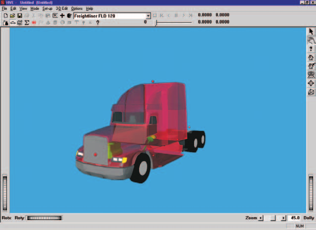
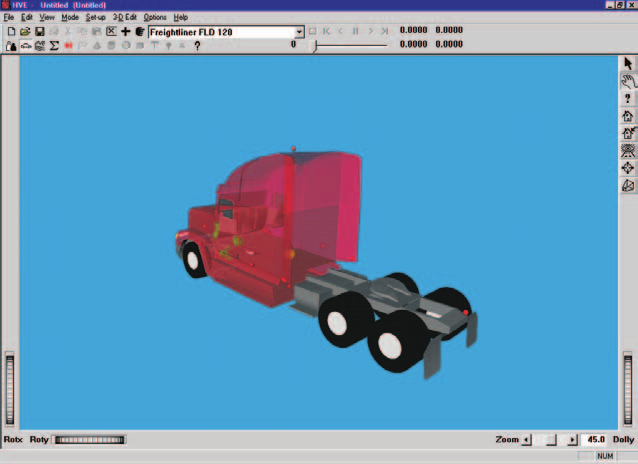
*Figure 5-1: 1994 Freightliner FLD-120 Conventional Tractor, front view (top) and rear view (bottom)*

Next, let's add the first semi-trailer. We don't have the exact vehicle, so we'll create it from the Generic Vehicle database:

- Click *Add New Object*. The Vehicle Information dialog is displayed.
- Using the option buttons, click each button to choose the following vehicle from the database:
  - Type = *Trailer*
  - Make = *Generic*
  - Model = *Generic*
  - Year = *Generic*
  - Body Style = *Class 4*

The default vehicle name is *Class 4 Trailer*. Let's change it:

- Replace the default name; enter `Trailer 1`.
- Click *OK* to add *Trailer 1* to the Active Vehicles list.

The 45-ft semi-trailer is displayed in the viewer, as shown in Figure 5-2.

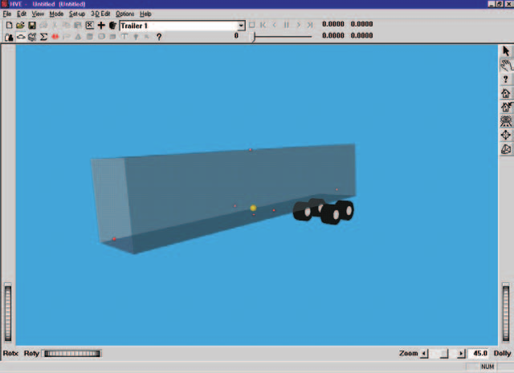
*Figure 5-2: Trailer 1, a 45-ft semi-trailer.*

Now let's add the second semi-trailer. Again, we don't have the exact vehicle, so we'll create it from the Generic Vehicle database:

- Click *Add New Object*. The Vehicle Information dialog is displayed.
- Using the option buttons, click each button to choose the following vehicle from the database:
  - Type = *Trailer*
  - Make = *Generic*
  - Model = *Generic*
  - Year = *Generic*
  - Body Style = *Class 4*

The default vehicle name is *Class 4 Trailer*. Let's change it:

- Replace the default name; enter `Trailer 2`.
- Click *OK* to add *Trailer 2* to the Active Vehicles list.

The second semi-trailer is displayed in the viewer, as shown in Figure 5-3.

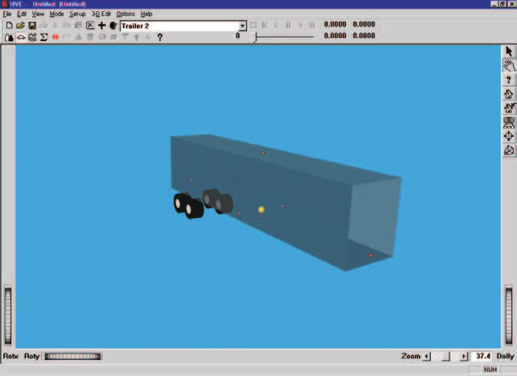
*Figure 5-3: Trailer 2, also a 45-ft semi-trailer. The front of this trailer is supported by the converter dolly displayed in Figure 5-4.*

Finally, let's add the converter dolly that supports the front of the second semi-trailer. Again, we don't have the exact vehicle, so we'll create it from the Generic Vehicle database:

- Click *Add New Object*. The Vehicle Information dialog is displayed.
- Using the option buttons, click each button to choose the following vehicle from the database:
  - Type = *Dolly*
  - Make = *Generic*
  - Model = *Generic*
  - Year = *Generic*
  - Body Style = *Class 4 Hinged Drawbar*

The default vehicle name is *Class 4 Hinged Drawbar Dolly*. Let's change it:

- Replace the default name; enter `Trailer 2 Dolly`.
- Click *OK* to add *Trailer 2 Dolly* to the Active Vehicles list.

The dolly is displayed in the viewer, as shown in Figure 5-4.

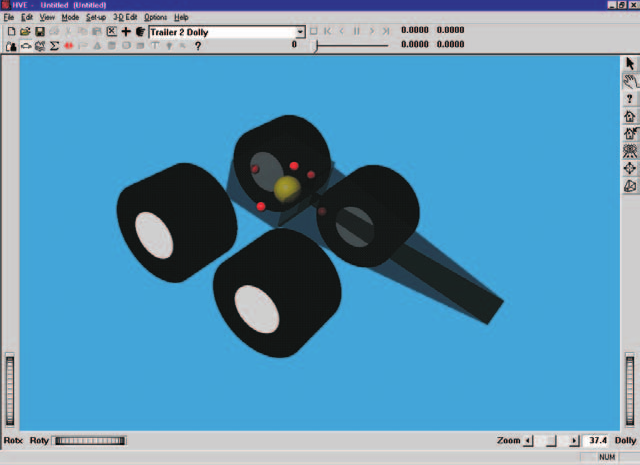
*Figure 5-4: Trailer 2 Dolly, a Generic Class 4 dolly from the HVE Generic Vehicle Database. It has a hinged fifth wheel and fixed drawbar.*

### Editing the Vehicles

Our Freightliner is ready to go, with the exception of changing its color. However, the trailers and dolly require some editing. Let's begin by editing the color of the Freightliner tractor:

- Choose *Freightliner FLD-120* from the Active Vehicles drop-down list, making it the current vehicle. The Freightliner tractor is now displayed in the Vehicle Editor.
- Click on the CG and choose *Color*. The Vehicle Color dialog is displayed (see Figure 5-5), showing the vehicle's current color (the small black square, or *hot spot*, in the *color wheel*) and intensity (the arrow in the *intensity slider*). Click on the hot spot and drag it to the center of the color wheel, making it white. To dull the color slightly, click on the intensity slider and drag it towards the center of the slider's range.

> **NOTE:** The color chip on the left shows the current color.

- When the color is to your liking, close the dialog by clicking on the close button in the upper right-hand corner of the dialog.

> **NOTE:** The vehicle's apparent color may be slightly misleading because the vehicle is translucent when displayed in the Vehicle Editor. The actual color will be used whenever the vehicle is displayed during Event and Playback mode.

*Figure 5-5: Vehicle Color dialog, used for assigning the vehicle color.*

Next, let's edit the first semi-trailer by adding a geometry file, changing the weight and changing the connection height. Let's begin by adding the 3-D geometry file. A 45 foot van trailer geometry file, appropriately named *TLVdsTutorTrlr45Van.h3d*, was prepared by EDC and placed in the `../images/vehicles` subdirectory. To attach the geometry file to the trailer, perform the following steps:

- Choose *Trailer 1* from the Active Vehicles drop-down list, making it the current vehicle. Trailer 1 is now displayed in the 3-D Vehicle Viewer.
- Click on the CG, choose *Geometry File* and select *Open*. The Geometry dialog is displayed (see Figure 5-6), and we're ready to select a geometry file from the list box.
- Set Files of Type to be *HVE Geometry Files (\*.h3d)*.
- Scroll down the list and double-click on *TLVdsTutorTrlr45Van.h3d*.

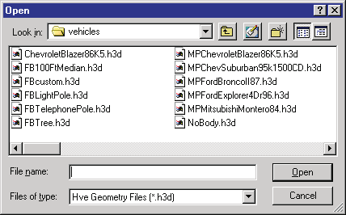
*Figure 5-6: Vehicle Geometry File selection dialog, used for adding or changing the vehicle 3-D geometry file for the current vehicle.*

The new geometry file is applied to the generic trailer (see Figure 5-7).

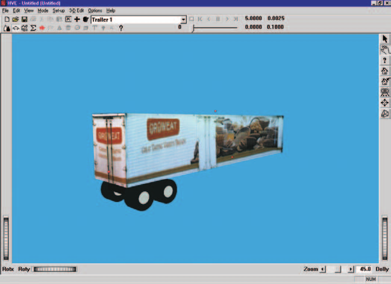
*Figure 5-7: Trailer 1 after adding its geometry file. Note the geometry file includes texture maps to create its realistic appearance.*

Next, let's change the trailer's weight:

- Click on the CG and choose *Inertias*. The Inertias dialog is displayed (see Figure 5-8), and we're ready to change the weight.
- In the *Total Weight* text field, replace the existing weight, 12,300 lb, with the measured value, `13135` lb.

> **NOTE:** The dialog might initially display 12300.001, or a similar number, because the weight is actually divided by the current gravity constant and stored as mass. Extra precision results when the mass is multiplied by the current gravity constant and redisplayed.

- If not already selected, click the checkbox for *Auto Update Inertia When Weight Changes*.
- Press *OK* to update the trailer's inertial properties.

Finally let's change the connection height:

- Click on the CG and choose *Connections*. The Connections dialog is displayed.
- In the z field for the Front Connection, replace the existing height, 12 in, with the value to match the tractor of `15` in.
- Press *OK* to update the trailer's connection height.

The first semi-trailer is ready for our EDVDS simulation analysis.

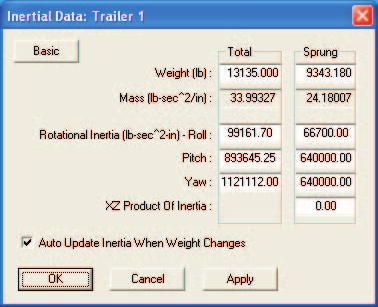
*Figure 5-8: Vehicle Inertias dialog, used for editing the current weight and roll, pitch and yaw rotational inertias.*

Let's change the parameters for the second trailer, starting with the geometry file:

- Choose *Trailer 2* in the Active Vehicles drop-down list, making it the current vehicle. Trailer 2 is now displayed in the 3-D Vehicle Viewer.
- Click on the CG, choose *Geometry File* and select *Open*. The Geometry dialog is displayed (same as shown earlier in Figure 5-6), and we're ready to select a geometry file from the list box.
- Set Files of Type to be *HVE Geometry Files (\*.h3d)*.
- Scroll down the list and double-click on *TLVdsTutorTrlr45Van.h3d*.

The new geometry file is applied to the generic trailer, and it should look just like the first trailer (see Figure 5-7). Next, let's change the trailer's weight:

- Click on the CG and choose *Inertias*. The Inertias dialog is displayed, as shown in Figure 5-8, and we're ready to change the weight.
- In the *Total Weight* text field, replace the existing weight, 12,300 lb, with the measured value, `13135` lb.
- If not already selected, click the checkbox for *Auto Update Inertia When Weight Changes*.
- Press *OK* to update the trailer's inertial properties.

Finally, let's increase the default lag time in the left rear trailer brake:

- Click on the left rear wheel and choose *Brake*. The Wheel Brake dialog is displayed (see Figure 5-9), and we're ready to edit the brake characteristics for the left rear wheel.
- In the *Time Lag* data field, replace the default value, 0.175 sec, with `0.305` sec.
- Press *OK* to update the trailer's brake characteristics for the left rear wheel position.

The second semi-trailer is now ready for our EDVDS simulation analysis.

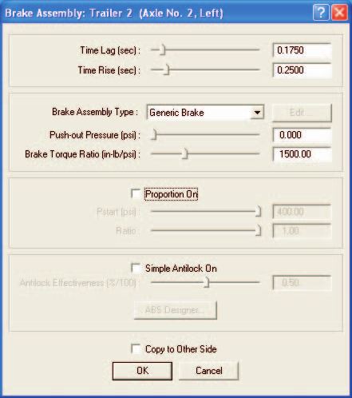
*Figure 5-9: Vehicle Wheel Brake dialog, used for editing the brake attributes for the selected wheel.*

Finally, let's increase the dolly's drawbar length:

- Choose *Trailer 2 Dolly* from the Active Vehicles drop-down list, making it the current vehicle. Trailer 2 Dolly is now displayed in the 3-D Vehicle Viewer.
- Click on the CG and choose *Connections*. The Vehicle Connections dialog is displayed (see Figure 5-10).
- In the *Front Connection, x-coordinate* data field, replace the default value, 96.0 in, with `120.0` in.
- Press *OK* to update the dolly's drawbar length.

The dolly is redisplayed with its new drawbar length.

> **NOTE:** The default geometry file is automatically modified to include the increased drawbar length. This would not be true if we had used a custom 3-D geometry file; we'd have to explicitly edit the geometry file if we wished to visualize the increased length.

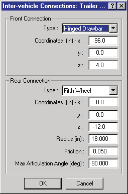
*Figure 5-10: Vehicle Connections dialog, used for editing the current front and rear inter-vehicle connections.*

All the vehicle units are now ready for our simulation study. Using the viewer controls (thumb wheels and manipulators), rotate and look at each of the vehicles we've created.

## Creating the Environment

Now, let's add the environment:

- Choose *Environment Mode*. The Environment Editor is displayed.
- Click on *Add New Object*. The Environment Information dialog is displayed.
- Using the Location Database combo box, choose *Hood River, Oregon, USA*. The latitude (45.40.00N), longitude (121.11.00W) and GMT, hours from the prime meridian (-8.0) are displayed for the selected location.
- Enter a name for the environment: `Rowena Point`.
- Enter the date and time of the incident we are studying, `4/30/98` and `1330`, respectively.
- Enter the angle from *true north* to the earth-fixed X axis in our environment, `180.0` degrees.

> **NOTE:** The Latitude, Longitude, GMT, Date/Time and angle from true north are used to position the sun in the scene. This is, of course, important because the sun is the primary light source for the scene.

- To add the environment geometry file to our case, click on *Open*. The Environment Geometry File Selection dialog is displayed.
- Choose *Files of Type* to *HVE Geometry Files (\*.h3d)*. A list of environment geometry files using the HVE file format is displayed in a list box.
- Double-click on *RowenaPoint.h3d* to choose the environment file and remove the dialog.

> **NOTE:** We used a total station to survey this site, downloaded the resulting 3-D geometry data into a popular CAD program, performed some editing operations, and imported the result into HVE. We then used HVE's 3-D Editor to apply textures, which were actually photos of the rock walls and vegetation taken at the scene.

> **NOTE:** You have probably seen this view many times in nationally televised car commercials.

- Press *OK*.

The selected environment is added to our case and displayed in the Environment Viewer (see Figure 5-11). Use the viewer thumb wheels to view the scene.

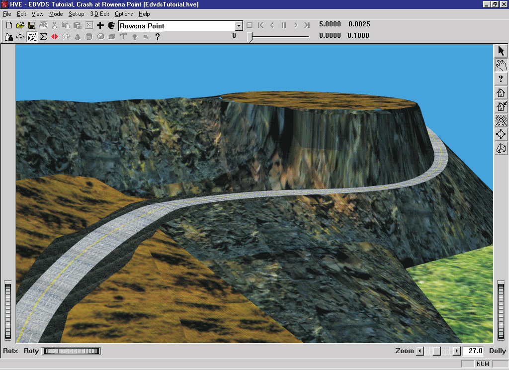
*Figure 5-11: 3-D Environment for our EDVDS tutorial. The original 3-D geometry for this environment was obtained using a total station. Textures were created from photos taken at the scene.*

## Saving the Case

Now that we've created all the objects (*vehicles* and *environment*) for our case, let's save the case file.

- Click on the *File* menu and choose *Save*. The Save-as File Selection dialog is displayed.

> **NOTE:** The Save-as dialog is displayed because the case has not been saved previously, so we need to enter a filename.

- Place the mouse cursor in the Case Title text field and enter `EDVDS Tutorial, Crash at Rowena Point`.

> **NOTE:** The Case Title is displayed as a heading on all printed output reports.

- Place the mouse cursor in the Filename text field and enter `EdvdsTutorial`.
- Click *SAVE*. The current case data are saved in the `hve/supportFiles/case` subdirectory.

> **NOTE:** Saving the file occasionally is a highly recommended practice.

## Creating the Event

As mentioned at the outset of the tutorial, we are going to simulate the loss of control of a set of highway doubles while attempting to negotiate a curve. To create the event, perform the following steps:

- Choose *Event Mode*. The Event Editor is displayed.
- Click on *Add New Object*. The Event Information dialog is displayed.
- Select *Freightliner FLD-120, Trailer 1, Trailer 2 Dolly* and *Trailer 2* **in that order** from the Active Vehicles list.

> **NOTE:** The vehicles **must** be selected in that order! The order of selection is used by HVE to determine the order of the vehicles in the combination vehicle.

- Select *EDVDS* from the *Calculation Method* options list.
- Enter a name for the event, `Controllability on Grade`.

> **NOTE:** HVE will append the name of the calculation method to the event name, thus the complete event name will become "EDVDS, Controllability on Grade."

- Press *OK* to display the event editor.

Now, we're ready to set up the event.

- Using the Event Editor dialog, select *Freightliner FLD-120* from the Event Humans & Vehicles list, then choose *Set-up* from the menu and select *Position/Velocity*. The complete combination vehicle is displayed in the environment, with the Freightliner's CG located at the earth-fixed X,Y origin, as shown in Figure 5-12. The entire vehicle is resting on the inclined surface with the trailers and dollys connected at a zero articulation angle.

> **NOTE:** Even though you didn't select the trailers or dolly from the Event Humans and Vehicles list (in fact, they're not even in the list), they are automatically attached to the tractor and displayed in the Event viewer because the trailer and dolly are "child" vehicles, that is, HVE knows that their positions are not independent from the tractor; they are attached to it.

Our EDVDS Tutorial provides us with a great opportunity to thoroughly explore the subject of positioning vehicles in a 3-D environment. We face the following challenges:

- First, we don't know the coordinates of the desired initial position, so we can't simply enter them in the Position/Velocity dialog.
- We have a complex, 3-dimensional surface, so placing the vehicles in a near-equilibrium position could take a lot of time and patience.
- We have a combination vehicle with four individual units (tow vehicle, two trailers and a dolly) and a total of 18 wheels to position on the surface, so positioning each individual vehicle wheel could take even more time and patience.

Fortunately, HVE's AutoPosition feature greatly simplifies the task of positioning vehicles in a complex, 3-dimensional environment:

- Click on the Freightliner's X-Y manipulator (see Figure 5-12), wait for it to turn bright yellow (indicating it has been selected), and drag the vehicle slowly down towards the road.

> **NOTE:** To select the X-Y manipulator, the viewer must be in Pick mode, as indicated by the highlighted arrow in the upper right corner of the viewer (see Figure 5-12).

> **NOTE:** Be sure to keep the mouse button depressed while you drag the manipulators.

> **NOTE:** The Z coordinates for the tow vehicle and each trailer are automatically determined using HVE's AutoPosition feature option.

> **NOTE:** As you drag the tow vehicle, the trailers follow the tow vehicle down the slope.

> **NOTE:** Adjust the viewer by panning, rotating and dollying back (use either the thumb wheels or direct manipulation of the viewer) until you can see the desired portion of the downhill grade.

- Click the yaw manipulator and rotate the tow vehicle until it is aligned with the road, approximately `90` degrees.
- Again, click on the X-Y manipulator and drag the vehicle up the hill, intermittently clicking on the yaw manipulator to keep the entire trailer-train on the road.
- Ultimately, the tow vehicle should be placed at X=`445` ft, Y=`-945` ft and Yaw=`65` deg as shown in Figure 5-13.
- Click the *Velocity Is Assigned* checkbox. Enter the initial velocity, `55` mph.

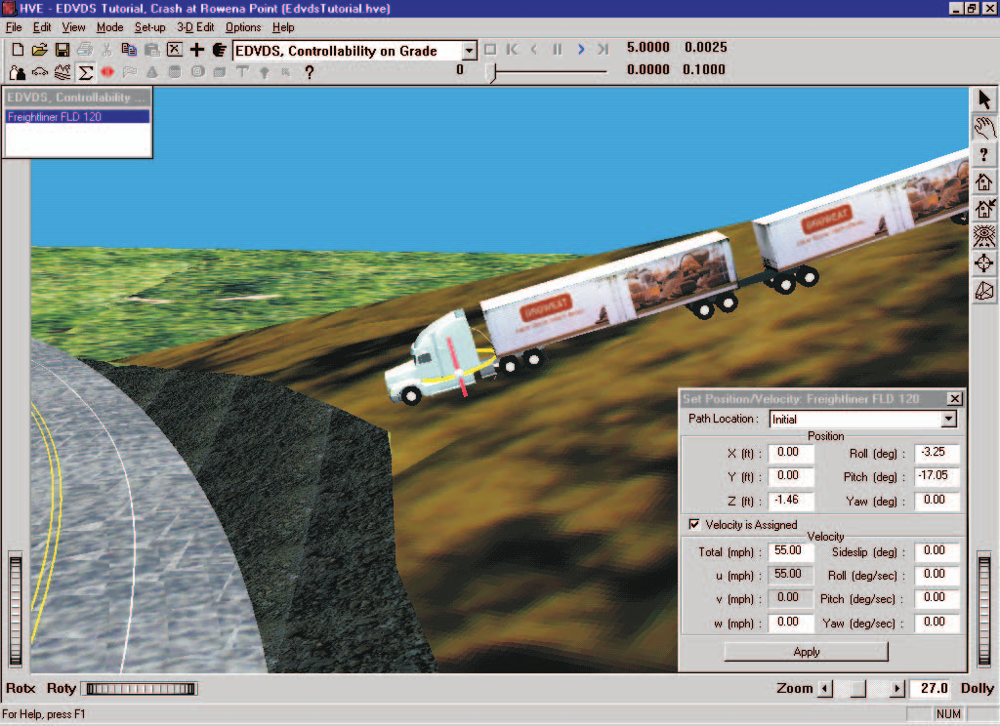
*Figure 5-12: Positioning the combination vehicles in the environment. The vehicle is initially placed at the earth-fixed origin. AutoPosition is a big help for complex, 3-dimensional environments such as this one because it places the entire trailer-train on the earth's surface. Without AutoPosition, we'd first have to find the vehicles, and then spend a lot of time positioning the individual vehicles so each tire was on the surface.*

*Figure 5-13: Positioning the Freightliner FLD-120 tractor at its initial position.*

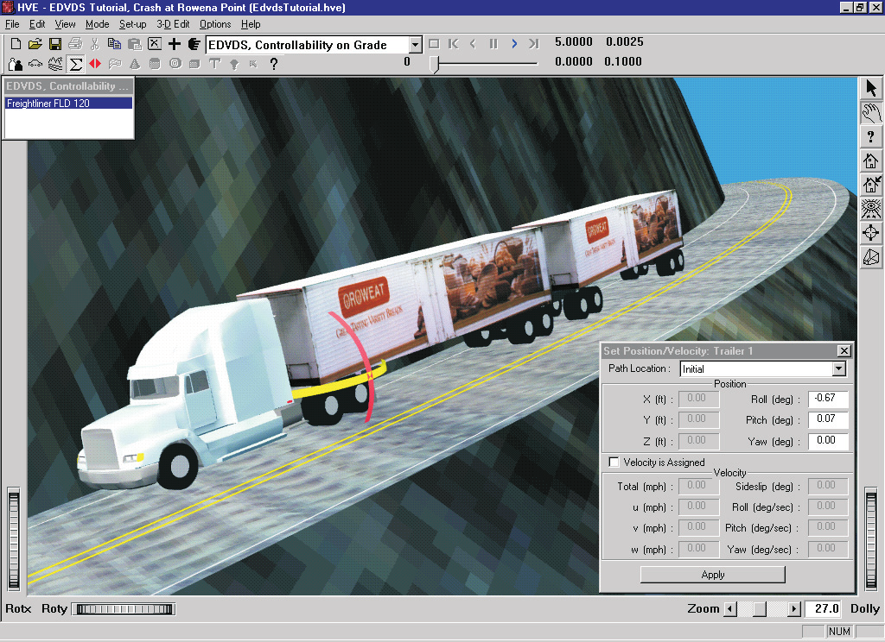
*Figure 5-14: Positioning Trailer 1 at its initial position.*

After the Freightliner tractor is positioned (see Figure 5-13), we need to position the trailers and dolly:

- Click on *Trailer 1*. The orientation manipulator is displayed and its initial orientation is displayed in the Position/Velocity dialog, as shown in Figure 5-14.

> **NOTE:** The X,Y,Z coordinates are not displayed because the trailer is connected to a tow vehicle, thus, it has no X,Y,Z degrees of freedom.

> **NOTE:** Because the trailer is attached to a tow vehicle, the angles shown are articulation angles relative to the tow vehicle, not absolute (earth-fixed) angles.

Trailer 1's position is acceptable, so let's position the dolly and second trailer:

- Click on *Trailer 2 Dolly* (it's easiest to click on its wheels). The orientation manipulator is displayed and its initial orientation is displayed in the Position/Velocity dialog.
- Click and drag the yellow yaw manipulator until the dolly's initial yaw articulation angle is about `-2` degrees, as shown in Figure 5-15.
- Click on *Trailer 2*. The orientation manipulator is displayed and its initial orientation is displayed in the Position/Velocity dialog.
- Click and drag the yellow yaw manipulator until *Trailer 2*'s initial yaw articulation angle is about `-2` degrees, as shown in Figure 5-16.

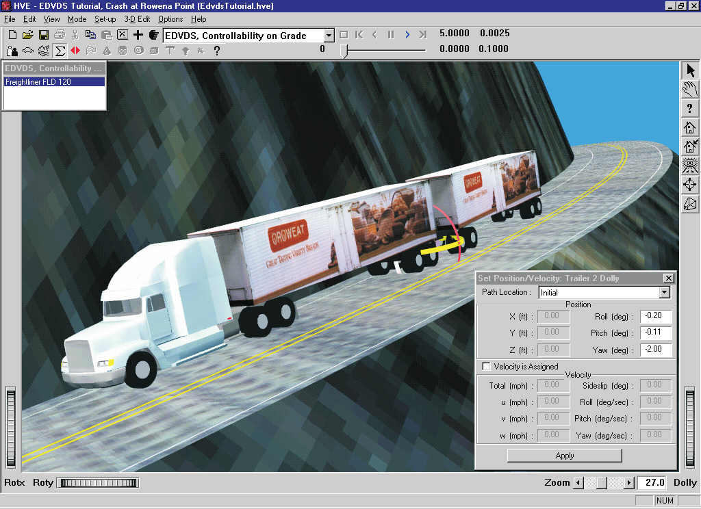
*Figure 5-15: Positioning Trailer 2 Dolly at its initial position.*

*Figure 5-16: Positioning Trailer 2 at its initial position.*

The vehicles' initial conditions are now established. Let's enter a payload for each trailer:

- Using the Event viewer, click on *Trailer 1*. The orientation manipulator is displayed and its initial orientation is displayed in the Position/Velocity dialog.
- Click on the *Set-up* menu and choose *Payload*. The Payload dialog for Trailer 1 is displayed (see Figure 5-17).
- Click on the *Payload Exists* check box. The data fields in the Payload dialog are enabled.
- Enter a weight for the payload; enter `25000` lb.
- Enter a roll moment of inertia; enter `200000` lb-sec²-in.
- Enter a pitch moment of inertia; enter `1500000` lb-sec²-in.
- Enter a yaw moment of inertia; enter `1500000` lb-sec²-in.
- Press *OK* to accept the payload data for *Trailer 1*.

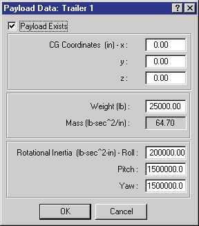
*Figure 5-17: Payload dialog, used for assigning a payload to each trailer.*

Next, let's add a payload to the second trailer:

- Using the Event viewer, click on *Trailer 2*. The orientation manipulator is displayed and its initial orientation is displayed in the Position/Velocity dialog.
- Click on the *Set-up* menu and choose *Payload*. The Payload dialog for *Trailer 2* is displayed (refer to the dialog shown earlier in Figure 5-17).
- Click on the *Payload Exists* check box. The data fields in the Payload dialog are enabled.
- Enter a weight for the payload; enter `25000` lb.
- Enter a roll moment of inertia; enter `200000` lb-sec²-in.
- Enter a pitch moment of inertia; enter `1500000` lb-sec²-in.
- Enter a yaw moment of inertia; enter `1500000` lb-sec²-in.
- Press *OK* to accept the payload data for *Trailer 2*.

> **NOTE:** EDVDS does not support lateral payload offset.

> **NOTE:** The version of EDVDS used in this tutorial requires that the payload CG coordinates be 0,0,0. This will not be the case in future versions; check your release notes to confirm the status of your version of EDVDS.

Next, let's enter the driver controls. We'll start with the Freightliner's Steer Table. To enter the steer angles, perform the following steps:

- Choose *Set-up* from the Menu and select *Driver Controls*. The Driver Controls dialog is displayed. The default driver control table, *Steering*, is also displayed for editing.
- Click on the *Table Is* option list and choose the *At Steering Wheel* option.
- Enter the steer angles for the Freightliner Tractor, as shown in Table 5-1 and Figure 5-18.

**Table 5-1: Steering Table for the Freightliner tractor**

| Time (sec) | Steering Wheel Angle (degrees) |
|-----------|-------------------------------|
| 0.00 | 75.0 |
| 2.00 | 180.0 |
| 5.00 | 220.0 |

Next, let's assign the Brake Table for the Freightliner:

- Click the Brake tab on the Driver Controls dialog. The Brake Table is displayed.
- Click on the *Table Is* option list and choose the *Pedal Force* option (for air brakes, *Pedal Force* equals *Treadle Pressure*).
- Enter the values shown in Table 5-2 and Figure 5-19.
- Press *OK* to accept the steering and brake tables.

**Table 5-2: Brake Table entries for the Freightliner tractor**

| Time (sec) | Brake Pedal Force (lb) |
|-----------|------------------------|
| 0.00 | 0.00 |
| 3.50 | 0.00 |
| 3.60 | 65.00 |

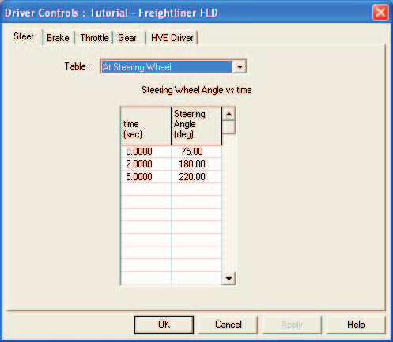
*Figure 5-18: Driver Controls, Steer Table dialog. Our tutorial uses the At Steering Wheel option.*

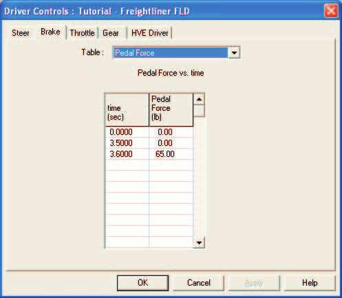
*Figure 5-19: Driver Controls, Brake Table dialog. Our tutorial uses the Pedal Force option. (NOTE: For trucks with air brake systems, the vehicle's Brake Pedal Ratio is set equal to 1.0; thus, the entered pedal force value equals the treadle valve pressure.)*

Since our goal for this event is to see what causes the vehicle to roll over, let's look at some Key Results during execution:

- If Key Results windows are not displayed, choose *Show Key Results* from the Options menu.
- Drag the Key Results windows to a convenient location, where they do not block the view but still allow us access to the viewer thumb wheel controls (in case we want to change the view).
- Click on *Select Variables* in the *Freightliner FLD-120* Key Results window. The Variable Selection dialog for *Freightliner FLD-120* is displayed.

Let's add *Tire Fz'* to the Freightliner's Key Results window:

- Click *Tires* and choose *Axle 1, Right, Outer* from the cascade menus. The Variable Selection list for the right front tire is displayed (see Figure 5-20).
- Select *Fz'* from the list.
- Click *Tires* and choose *Axle 1, Left, Outer* from the cascade menus. The Variable Selection list for the left front tire is displayed; select *Fz'* from the list.
- Repeat the above steps for Freightliner's rear tandem axles, choosing *Fz'* for *Axle 2* and *Axle 3*.
- Press *OK* to include the new variables in the Key Results dialog.

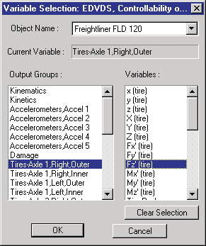
*Figure 5-20: Key Results Variable Selection dialog, used for selecting variables to be displayed in the Key Results window.*

Next, let's add the vertical tire forces for the trailers:

- Click on *Select Variables* in the *Trailer 1* Key Results window. The Variable Selection dialog for *Trailer 1* is displayed.

Let's add *Tire Fz'* to the trailer's Key Results window:

- Click *Tires* and choose *Axle 1, Right, Outer* from the cascade menus. The Variable Selection list for the front tandem axle, right side, is displayed; select *Fz'* from the list.
- Repeat the above steps for the trailer's remaining tires.
- Press *OK* to display the new variables in the Key Results dialog.

Using the same procedure, proceed to add any other Key Results of interest to you.

Now, we're ready to execute the event.

- Using the Event Controller, click *Play* to execute the event. Allow the event to run until completion.

> **NOTE:** While the event is executing, watch the current results (especially the Velocity, Acceleration and Fz values) in the Key Results windows.

The EDVDS event is shown at time, t = 3.5 seconds in Figure 5-21, just as the vehicle is leaving the road.

> **NOTE:** By reviewing the individual wheel vertical wheel loads, Fz, in the Key Results windows, we can see it was the trailer's right front wheel that lifted, as noted by the negative value for Fz.

We have now completed the event.

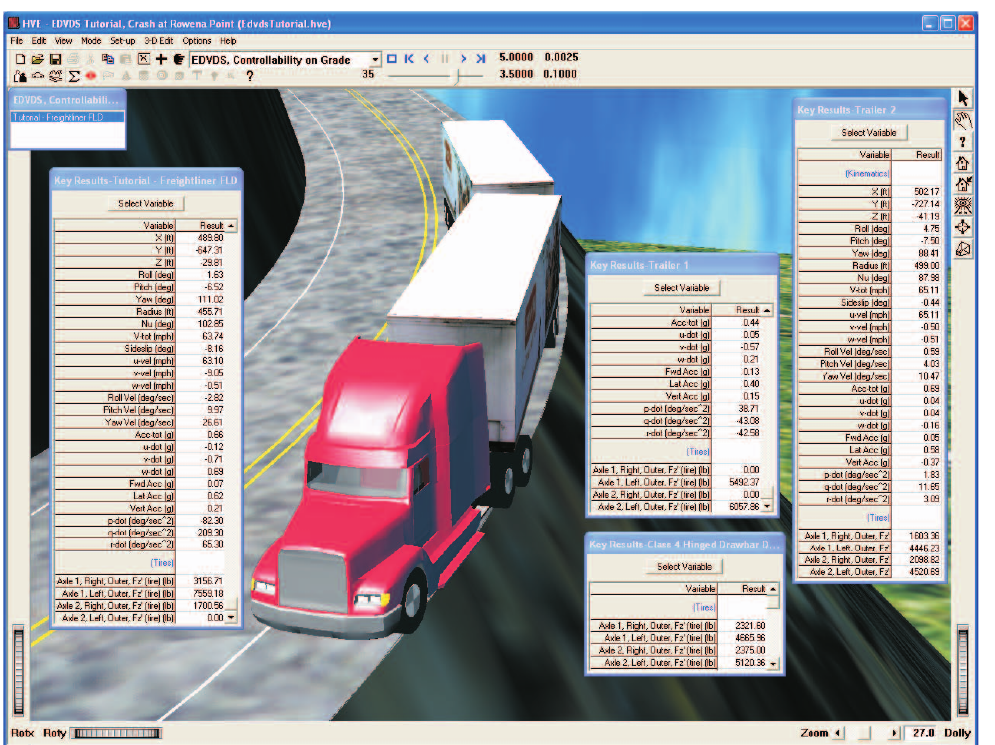
*Figure 5-21: EDVDS Controllability on Grade Event at t = 3.5 seconds.*

## Viewing Results

Now that we have produced our EDVDS simulations, let's take a detailed look at the results. The Playback Editor is used for reviewing and printing reports for each event in the current case, as well as for producing video output.

EDVDS produces the following reports:

- **Messages** — A list of messages produced by the current run
- **Accident History** — A table of initial and final positions and velocities
- **Vehicle Data** — A series of tables containing the vehicle data used by EDVDS
- **Program Data** — A table containing program control information
- **Variable Output** — A table containing user-selected, time-dependent simulation results
- **Trajectory Simulation** — A 3-D visualization of the event, displayed at a user-selectable time interval

To view the output reports, we need to be in Playback mode:

- Choose *Playback Mode*. The Playback Editor is displayed.

### Report Windows

The reports listed above are displayed by selecting Report Windows. Each Report Window contains an individual report.

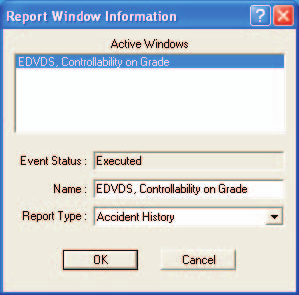
*Figure 5-22: Report Window Information dialog, showing the name of each event in the current case.*

To view the reports produced by the *EDVDS, Controllability on Grade* event, perform the following steps:

- Click *Add New Object*. The Report Window Information dialog is displayed, as shown in Figure 5-22, and includes a list of the active events (*EDVDS, Controllability on Grade* is the only event in this tutorial). The Report Window Information dialog also includes the user-editable *Window Name* text field and *Selected Output* option list.
- Select *EDVDS, Controllability on Grade* from the Active Events list.
- Click on the *Selected Output* option list and choose any of the available reports.
- Press *OK* to display the report.

The selected report will be displayed in a resizable window. The following pages illustrate the reports produced for the *EDVDS, Controllability on Grade* event.

### Messages

EDVDS produces a number of messages, depending on the outcome of the event. For a complete list and explanation of these messages, see [Chapter 6](06-messages.md).

To view the Messages report produced by the *EDVDS, Controllability on Grade* event, perform the following steps:

- Click *Add New Object*. The Report Window Information dialog is displayed.
- Select *EDVDS, Controllability on Grade* from the Active Events list.
- Click on the *Selected Output* option list and choose *Messages*.
- Press *OK*.

The Messages report is displayed for the *EDVDS, Controllability on Grade* event, as shown in Figure 5-23.

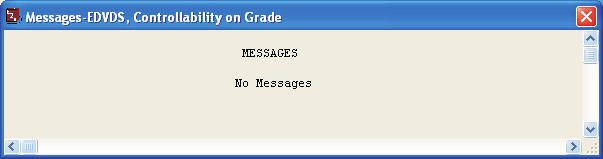
*Figure 5-23: Messages Report for EDVDS, Controllability on Grade.*

### Accident History

The Accident History report displays the time and total distance traveled, as well as position and velocity at the start and end of the run.

To view the Accident History report for the *EDVDS, Controllability on Grade* event, perform the following steps:

- Click *Add New Object*. The Report Window Information dialog is displayed.
- Select *EDVDS, Controllability on Grade* from the Active Events list.
- Click on the *Selected Output* option list and choose *Accident History*.
- Press *OK*.

The Accident History report is displayed for the *EDVDS, Controllability on Grade* event, as shown in Figure 5-24.

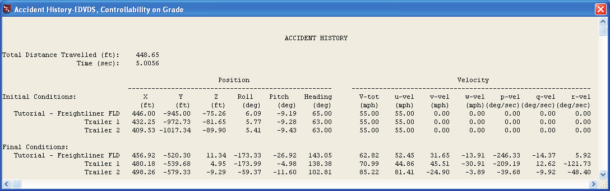
*Figure 5-24: Accident History Report for EDVDS, Controllability on Grade.*

### Vehicle Data

The Vehicle Data report for EDVDS displays vehicle data, tire data and driver control tables for each vehicle in the event.

> **NOTE:** The Vehicle Data report is too large to fit in the viewer. Use the scroll bars to view the entire report.

To view the Vehicle Data report for the *EDVDS, Controllability on Grade* event, perform the following steps:

- Click *Add New Object*. The Report Window Information dialog is displayed.
- Select *EDVDS, Controllability on Grade* from the Active Events list.
- Click on the *Selected Output* option list and choose *Vehicle Data*.
- Press *OK*.

A portion of the Vehicle Data report displayed for *EDVDS, Controllability on Grade* is shown in Figure 5-25.

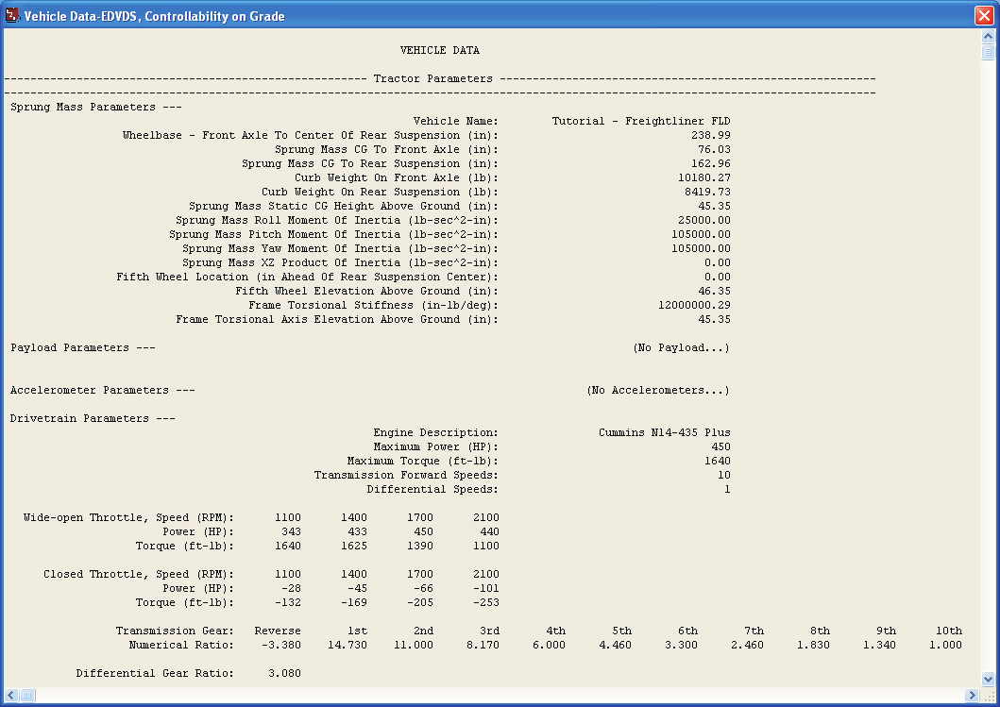
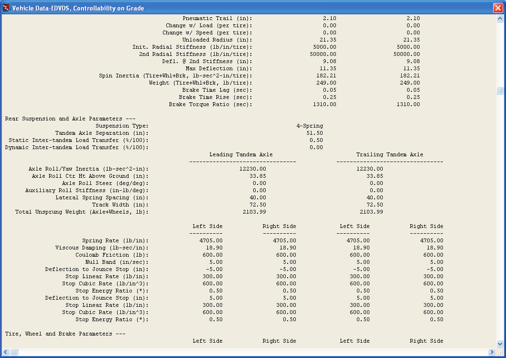
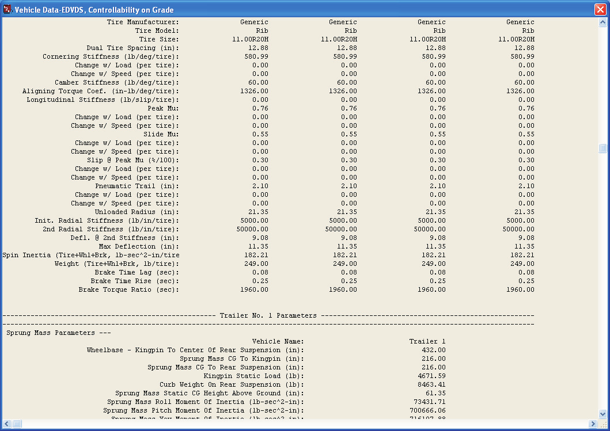
*Figure 5-25 (3 parts): Vehicle Data Report for EDVDS, Controllability on Grade — sprung mass parameters, drivetrain parameters, suspension and tire parameters for the Freightliner.*

### Program Data

The Program Data report contains the simulation controls used by the EDVDS event.

To view the Program Data report for the *EDVDS, Controllability on Grade* event, perform the following steps:

- Click *Add New Object*. The Report Window Information dialog is displayed.
- Select *EDVDS, Controllability on Grade* from the Active Events list.
- Click on the *Selected Output* option list and choose *Program Data*.
- Press *OK*.

The Program Data report is displayed for the *EDVDS, Controllability on Grade* event, as shown in Figure 5-26. The report includes the EDVDS version number and the tire model method under General Information, and the Maximum Simulation Time, Integration Time Step, Output Interval, Linear Termination Velocity, Velocity Convergence Criterion and Maximum Bisections under Simulation Controls. *(updated: the version number shown in the legacy figure reflects the release current at the time of printing; the current source reports version 18.00, and the Tire Model Method line reads either "Linear" or "Semi-empirical".)*

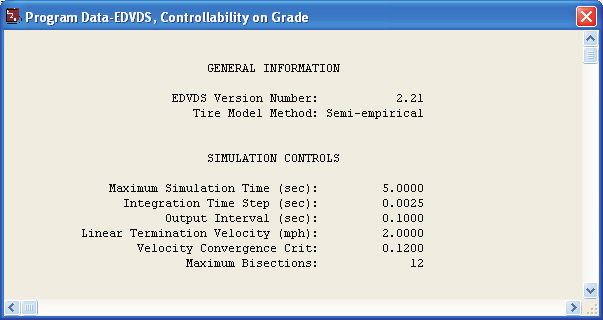
*Figure 5-26: Program Data Report for EDVDS, Controllability on Grade.*

### Variable Output

To view the Variable Output report for the *EDVDS, Controllability on Grade* event, perform the following steps:

- Click *Add New Object*. The Report Window Information dialog is displayed.
- Select *EDVDS, Controllability on Grade* from the Active Events list.
- Click on the *Selected Output* option list and choose *Variable Output*.
- Press *OK*.

The Variable Output report is displayed for the *EDVDS, Controllability on Grade* event. The table is initially empty, so the next step is to select the time-dependent results we wish to display in the table.

#### Variable Selection

The purpose of our event is to determine the vehicle's propensity for rollover, so let's display the velocities, accelerations and vertical tire forces from the Variable Selection dialog.

- Click on *Select Variables* in the Variable Output window. The Variable Selection dialog is displayed, allowing us to choose variables to display in the Variable Output table.

First, let's add the velocities and accelerations. These variables belong to the Kinematics output group; this is the default group, and the Kinematics Variables list for the *Freightliner FLD-120* tractor is already displayed.

- Select *V-tot*, *Fwd Acc* and *Lat Acc* from the list.

Next, let's add the vertical wheel loads:

- Click *Tires* and choose *Axle 1, Right, Outer* from the cascade menus. The Variable Selection list for the right front tire is displayed (see Figure 5-27).
- Select *Fz'* from the list.
- Click *Tires* and choose *Axle 1, Left, Outer* from the cascade menus. The Variable Selection list for the left front tire is displayed; select *Fz'* from the list.
- Repeat the above steps for the Freightliner's rear tandem axles, choosing *Fz'* for *Axle 2* and *Axle 3*.

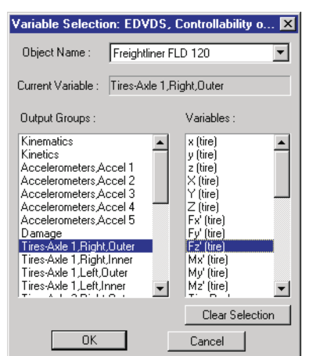
*Figure 5-27: Variable Selection Dialog.*

Next, let's add the vertical tire forces for the semi-trailer:

- Click on the *Object Name* option list and choose *Trailer 1*. The Kinematics Variables list for the first semi-trailer is displayed.
- Click *Tires* and choose *Axle 1, Right, Outer* from the cascade menus. The Variable Selection list for the front tandem axle, right side, is displayed; select *Fz'* from the list.
- Repeat the above steps for the trailer's remaining tires.
- Press *OK*.

The Variable Output report for the *EDVDS, Controllability on Grade* event now includes tow vehicle velocity and acceleration and vertical tire loads for each wheel location, as shown in Figure 5-28.

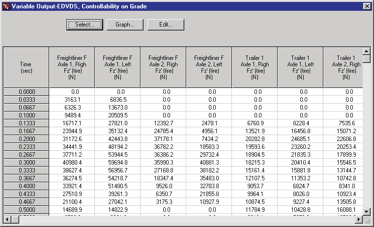
*Figure 5-28: Variable Output Table for EDVDS, Controllability on Grade, showing the selected variables.*

### Trajectory Simulation

Finally, let's display a trajectory simulation for this event. To view the Trajectory Simulation for the *EDVDS, Controllability on Grade* event, perform the following steps:

- Click *Add New Object*. The Report Window Information dialog is displayed.
- Select *EDVDS, Controllability on Grade* from the Active Events list.
- Click on the *Selected Output* option list and choose *Trajectory Simulation*.
- Press *OK*.

The Trajectory Simulation viewer is displayed for the *EDVDS, Controllability on Grade* event (see Figure 5-29). The tractor and trailer are shown at their initial positions.

To visualize the motion as the tractor-trailer attempts to negotiate the down-hill curve, perform the following steps:

- Click *Play* (single right-arrow). The simulation begins and is displayed at the current Playback output interval.
- Click *Pause*. The simulation stops.
- Click *Reverse* (single left-arrow). The simulation plays in reverse.
- Click *Pause*. The simulation stops.
- Click *Rewind* (left arrow with bar). The simulation returns to the start.
- Click *Advance to End* (right arrow with bar). The simulation advances to the end of the run.

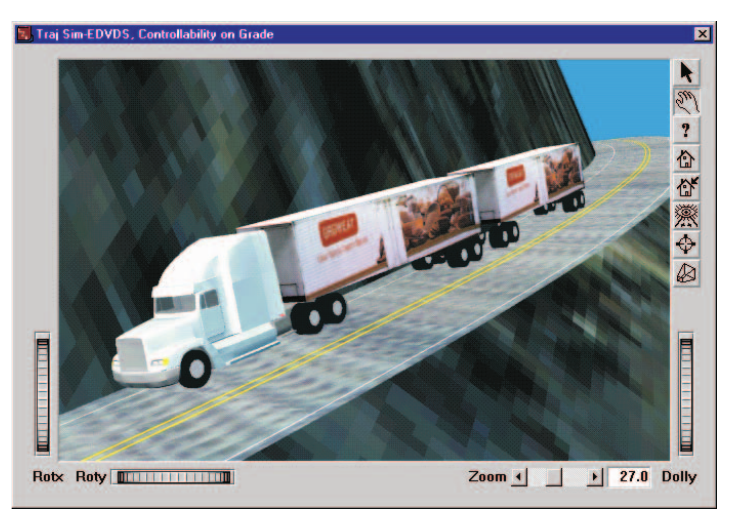
*Figure 5-29: Trajectory Simulation for EDVDS, Controllability on Grade.*

### Printing

The final step is to print the above reports. Printing reports is simple. All you do is choose a report and print it. For example:

- Click on the dialog header of the *Accident History - EDVDS, Controllability on Grade* report. Your selection is highlighted and the Accident History window pops to the top of the display (if it isn't there already), indicating it is the current window.
- Click on the *File* menu and choose *Print*. The Print dialog is displayed, allowing the user to select from several available print options.

> **NOTE:** Alternatively, you can click on the print icon in the upper menu bar.

- Press *OK*. The Accident History output report is printed on the system printer.

That's all there is to it! You can print any other report using the same two steps described above.

> **NOTE:** The Print dialog provides several options. Refer to your Windows or printer manual for more information.

> **NOTE:** For several reports it may be best to print in landscape rather than portrait mode.

> **NOTE:** The font size of both the printed reports and screen display may be edited by clicking on the Options menu and choosing Preferences. Use the Font Size option list to change the size.

<!-- NAV -->

---

← Previous: [Chapter 4 — Calculation Method](04-calculation-method.md)  |  [Index](README.md)  |  Next: [Chapter 6 — Messages](06-messages.md) →

<!-- /NAV -->
