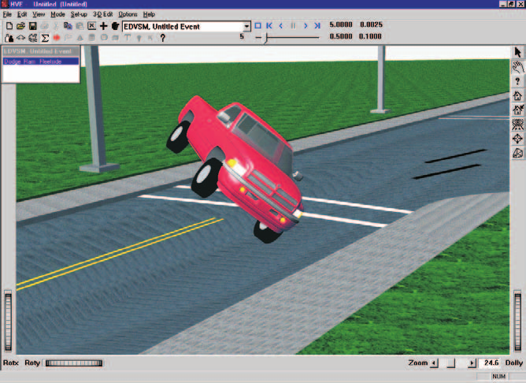

# Chapter 1 — EDVSM Program Description

## Overview

EDVSM (**E**ngineering **D**ynamics Corporation **V**ehicle **S**imulation **M**odel) is a 3-dimensional analysis of the response of a unit vehicle to a driver's inputs (steering, throttle, brakes, gear selection). EDVSM is based on the HVOSM model developed at Calspan [1,2,3]. The original HVOSM model was developed in two versions: The Roadside Design version (RD2) was developed for studying vehicle interactions with the roadside environment, while the Vehicle Dynamics version (VD2) was developed for studying vehicle response to driver inputs. EDVSM was derived from the VD2 version of HVOSM, and includes several extensions and refinements provided by Engineering Dynamics Corporation [4].

EDVSM computes vehicle kinematics (position, velocity and acceleration vs time), from forces defined at the tire-road interface, as well as from aerodynamics. EDVSM is useful for predicting and visualizing a vehicle's response to driver's inputs, as well as to study the effects of various design parameters on vehicle behavior.

The EDVSM vehicle model is *fully* three-dimensional. It includes six degrees of freedom for the sprung mass. It also includes degrees of freedom for both independent and solid axle suspension types. A wheel spin degree of freedom is also included for each wheel, and a steer degree of freedom exists for the steering system. Refer to the [Calculation Method](04-calculation-method.md) chapter of this manual for a detailed description of the simulation model.

*Figure 1-1: EDVSM Event.*

EDVSM includes detailed models of braking systems to allow the study of vehicle brake system characteristics on vehicle behavior during severe driving maneuvers, such as that which might occur during accident avoidance. EDVSM also has a detailed drivetrain model that includes an engine, transmission and differential. The drivetrain model may be used for detailed studies of a vehicle's response to throttle inputs and gear selection.

## Model Inputs

EDVSM inputs include one vehicle and an optional environment. Event set-up parameters include vehicle initial position and velocity, and various driver control options (steering, braking, throttle and gear selection).

## Model Outputs

EDVSM output reports include Messages, Accident History, Vehicle Data, Program Control Data, Variable Output and Trajectory Simulations. The Variable Output groups include vehicle kinematics, tire forces, radius and longitudinal and lateral slip, wheel position, suspension deflection and forces, engine power, torque and RPM, transmission and differential ratios, and driver steering, throttle, brakes and gear selection inputs.

## Validation

EDVSM was validated first by direct comparison with HVOSM to ensure the basic model was intact after porting the original FORTRAN code to C and making the model HVE-compatible. Additional validation was performed comparing EDVSM results to other models as well as direct comparison with controlled handling maneuvers. Validation results are reported in references 3 and 4.

## Basic Procedure

The procedure for using EDVSM is substantially the same as using any simulator in the HVE environment:

- Use the Vehicle Editor to add one or more vehicles to the case. Optionally, edit any of the default vehicle parameters.
- Optionally, use the Environment Editor to create a visual and physical environment.
- Use the Event Editor to set up and execute the EDVSM simulation model by performing the following steps:
  - Choose one vehicle from the list of vehicles created earlier.
  - Choose the EDVSM calculation model.
  - Position the vehicle in the environment.
  - Assign driver controls (Steering, Braking, Throttle, Gear Selection).
- Execute the simulation event.
- Modify the inputs as required to achieve the desired match between the simulation and actual event.
- Use the Playback Editor to view the various reports and trajectory simulations. If desired, produce a video output of the simulation.

<!-- NAV -->

---

← Previous: [EDVSM — Engineering Dynamics Corporation Vehicle Simulation Model](README.md)  |  [Index](README.md)  |  Next: [Chapter 2 — EDVSM Program Input](02-program-input.md) →

<!-- /NAV -->
