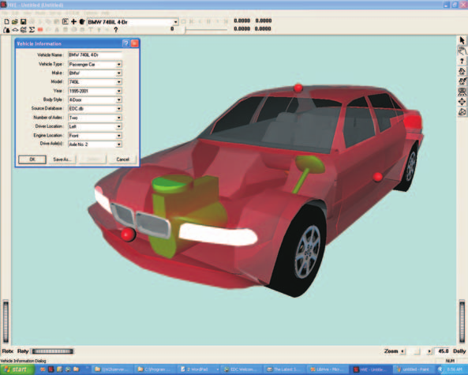
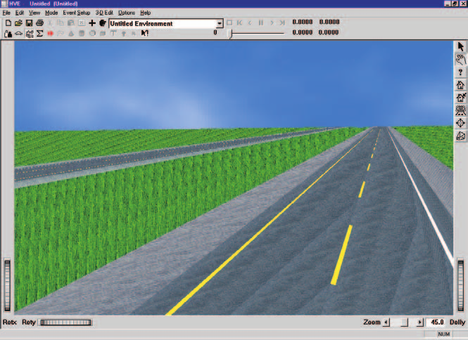
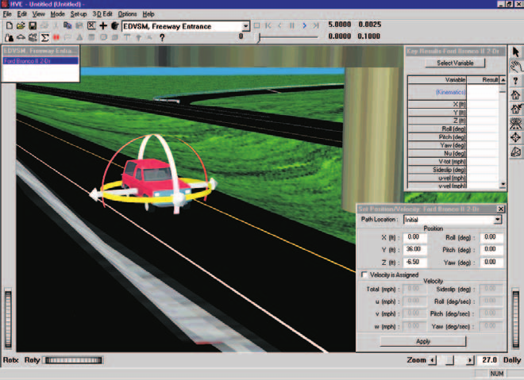
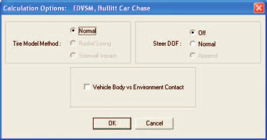
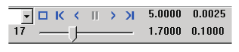

# Chapter 2 — EDVSM Program Input

This chapter defines the objects (humans, vehicles and environment) and the event set-up parameters (positions, damage profiles, driver controls, and so forth) used by the EDVSM analysis. In general, the chapter is divided into the following sections:

- **Objects** - The number of humans and vehicles, and the specific human and vehicle parameters actually used by EDVSM.
- **Events** - The various HVE options available for setting up and executing an EDVSM event.

## Objects Overview

The objects used by the EDVSM model are:

- **Humans** - Humans are not simulated by EDVSM.
- **Vehicles** - One vehicle may be studied by EDVSM.
- **Environment** - Like the *real* world, EDVSM has exactly one environment.

> **NOTE:** The environment is used in any HVE-compatible reconstruction or simulation model.

The following sections describe how the vehicle and environment provide the required inputs to the EDVSM calculation model.

## Vehicles

EDVSM uses one vehicle created using the HVE Vehicle Editor (see Figure 2-1). Vehicles are selected from the Vehicle Database by choosing the following attributes:

- **Type** - EDVSM supports the following vehicle types: *Passenger Car, Pickup, Van, Sport-Utility, Truck* and *Movable Barrier*.
- **Make** - EDVSM supports all available vehicle makes.
- **Model** - EDVSM supports all available vehicle models, within the limits defined by number of axles and drive axles; see below.
- **Year** - EDVSM supports all available vehicle years.
- **Body Style** - EDVSM supports all available vehicle body styles.

Each vehicle also has the following additional user-editable parameters:

- **Driver Location** - The *Driver Location* is not used by EDVSM. However, *Driver Location* must not be *None*; otherwise, the Driver Controls (Steering, Throttle, Brakes, Gear Selection) will not be available during Event mode.
- **Engine Location** - The Engine Location is not used by EDVSM. However, *Engine Location* must not be *None*; otherwise, the Throttle Table will not be available during Event mode.
- **Number of Axles** - EDVSM supports only 2-axled vehicles.
- **Drive Axle(s)** - EDVSM supports only *Axle 1* or *Axle 2* as the drive axle; 4-wheel drive vehicles are not supported.

To add a vehicle to the current HVE case, perform the following steps:

1. Choose Vehicle Mode. The Vehicle Editor is displayed.
2. Click *Add New Object*. The Vehicle Information dialog is displayed.
3. Click on the *Type, Make, Model, Year* and *Body Style* option buttons to select a vehicle from the database.
4. If desired, modify the *Driver Location, Engine Location, Number of Axles* and *Drive Axle(s)* for the current vehicle.
5. Enter a name for the current vehicle. A default name is supplied for each selected vehicle. Its name is user-editable, and does not affect calculations.

   > **NOTE:** Duplicate vehicle names are not allowed in the same case.

6. Click *OK* to add the vehicle to the current case.

*Figure 2-1: HVE Vehicle Editor.*

The following vehicle parameter groups are used by EDVSM:

- Sprung Mass Group
  - Inertias
  - Move CG
  - Drag Forces
- Unsprung Mass Group
  - Wheel Location
  - Tire Data
  - Suspension Data
  - Brake Data
- Steering System Group
- Brake System Group
- Drivetrain Group

> **NOTE:** The Exterior Data Group Parameters (Overall Dimensions, Structural Stiffness Coefficients) are not used by EDVSM.

The specific data used in each of the above parameter groups are defined in tables 2-1 through 2-4.

### Sprung Mass

The Sprung Mass parameters are shown in Table 2-1. Information on each group is provided below.

**Table 2-1 Vehicle Sprung Mass Parameters Used By EDVSM**

| Parameter | Description |
|---|---|
| Sprung Weight | Weight of vehicle sprung mass |
| Sprung Mass Roll, Pitch and Yaw Inertia | Rotational inertias of sprung mass about the vehicle-fixed x, y and z axes, respectively |
| Move CG x,y,z | Relocates the CG in the vehicle-fixed x, y and z directions. This entry causes an automatic adjustment of all vehicle coordinate-related parameters (e.g., contact surface, belt anchor points). |
| Constant, Linear and Quadratic Drag Forces | Rolling resistance force coefficients. The quadratic term includes vehicle area (i.e., $C_d \times Area$) and is used in aerodynamic calculations. |
| NumVertices, Vertex x,y,z | x,y,z coordinates for each vertex in the vehicle 3-D Geometry file. |

#### Inertias

EDVSM uses the vehicle sprung weight (converted to mass according to the current gravitational constant; see Environment), and the roll, pitch and yaw rotational inertias of the sprung mass. The total weight may be entered since it is the value traditionally obtained from data sources. The equations of motion require that the sprung mass be known. To obtain this value, EDVSM simply deducts the weight of the suspensions and wheels.

#### Move CG

Move CG is not directly used by EDVSM. Its current value does not show up in the results. However, the Move CG fields may be used to quickly move the vehicle's center of gravity; the x,y,z coordinates for the wheels are updated to reflect the new CG location.

> **NOTE:** Bilateral symmetry is assumed. Moving the CG in the +y or -y direction will have no effect on the EDVSM calculations.

#### Geometry File

The Geometry File is used by the EDVSM Body Model for computing forces and moments on the sprung mass during rollover. The vertex information in the 3-D Geometry file is automatically loaded into EDVSM and used during the calculations. See reference 7 for details.

#### Contact Surfaces

Contact Surface parameters are not used by EDVSM.

#### Belt Restraints

Belt Restraint parameters are not used by EDVSM.

#### Airbag Restraints

Airbag Restraint parameters are not used by EDVSM.

#### Inter-vehicle Connections

Inter-vehicle Connection parameters are not used by EDVSM.

#### Drag Forces

EDVSM uses a second-order polynomial to model drag forces that resist vehicle motion. Three terms are used. The rolling resistance constant is simply force resisting the vehicle's forward motion normally associated with tire rolling resistance. The second term has a linear velocity dependence, also normally associated with tire rolling resistance. The third term has a second-order velocity dependence, normally associated with aerodynamic drag.

> **NOTE:** The entered value for aerodynamic drag coefficient includes the frontal area of the vehicle! (I.e., rather than entering a typical value, such as $C_d = 0.39$, you should first multiply the value by the frontal area.) For example, if the frontal area was 3000 in², you would enter 0.39*3000, or 1170.

### Unsprung Mass

The Unsprung Mass parameters used by EDVSM are shown in Table 2-2. Information on each group is provided below.

**Table 2-2 Vehicle Unsprung Mass Parameters Used By EDVSM**

| Parameter | Description |
|---|---|
| Wheel Location | Vehicle-fixed x,y,z coordinates for each wheel |
| Brake Push-out Pressure | The wheel cylinder pressure required to initiate brake torque |
| Brake Torque Ratio | The ratio of effective brake torque at the wheel to fluid pressure in the wheel cylinder |
| Proportion, Pstart | The brake master cylinder pressure at which proportioning begins |
| Proportion Ratio | The ratio of wheel cylinder pressure to master cylinder pressure after the onset of proportioning |
| Brake Designer Parameters | Parameters used by the HVE Brake Designer |

#### Wheel Location

Although HVE provides values for the vehicle-fixed x,y,z coordinates of each wheel, EDVSM uses the following four parameters: $a$, the distance from the CG to the front axle; $b$, the distance from the CG to the rear axle; $tw_f$, the front track width; and $tw_r$, the rear track width.

> **NOTE:** EDVSM uses the average $x_{wheel}$ for the front wheels to calculate $a$ and the average $x_{wheel}$ for the rear wheels to calculate $b$. Similarly, EDVSM uses the total distance between right-side and left-side tires to calculate track width. Bilateral symmetry is assumed. Finally, EDVSM uses the average $z_{wheel}$ for each axle to establish vertical wheel position for calculations.

#### Wheel Brake Parameters

EDVSM uses the push-out pressure and brake torque ratio. Proportioning may also be specified. All wheel brake parameters are assumed to be the same for the right and left side wheels. The parameters are used only if the *At Driver* Brake Table option is used during Event set-up. The specific parameters used by EDVSM are shown in Table 2-2.

EDVSM also fully supports the HVE Brake Designer. Refer to the Brake Designer Manual for more information.

#### Tire

The HVE tire parameters provide the following data groups:

- Physical Data
- Friction Table
- Cornering Stiffness Table
- Camber Stiffness Table
- Slip-vs Rolloff Table

EDVSM's use of these parameters is described below.

##### Physical Data

The Physical Data used by EDVSM are shown in Table 2-3. If the current tire deflection exceeds the maximum deflection, a fatal error occurs. This prevents the model from computing an excessive tire force. For example, give a tire deflection of 15 inches and reasonable values for tire deflection rates, EDVSM could easily predict a vertical tire force of 100,000 lb (about 450,000 N).

> **NOTE:** If EDVSM terminates due to excessive tire deflection when a tire hits a curb, try reducing the integration timestep and/or add a small slope to the curb.

The weight and spin inertia should include the rim and brake inertias.

##### Friction Table

The Friction Data used by EDVSM are shown in Table 2-3. EDVSM requires that friction data are provided for at least two loads and speeds.

> **NOTE:** If only one load and/or speed are provided for a given tire, EDVSM will automatically produce a duplicate set of friction data at a slightly greater load and speed.

The *In-use Factor* is a convenient way to reduce or increase the dependent friction values for all speeds and loads by making just one adjustment.

**Table 2-3 Vehicle Unsprung Mass, Tire Parameters Used By EDVSM**

| Parameter | Description |
|---|---|
| Tire Unloaded Radius | Vehicle-fixed x,y,z coordinates for each wheel |
| Tire Initial and Secondary Deflection Rates, the Deflection at Secondary Rate and Maximum Deflection | The initial spring rate of the tire, and the spring rate after a specified amount of tire deflection. The maximum deflection is used to determine when tire deflection exceeds an allowable value. |
| Pneumatic Trail | The distance from the center of the contact patch to the center of pressure |
| Weight, Spin Inertia | The weight and rotational inertia (about the spin axis) of the tire/wheel/brake assembly |
| Tire Friction Table, Test Load/Speed | The load and speed for a given set of friction results |
| Peak Longitudinal and Lateral Friction, Slide Friction, Slip at Peak Friction and Longitudinal Stiffness | Tire frictional properties at the specified load and speed |
| Friction In-use Factor | Multiplier for Longitudinal, Lateral and Slide friction and Longitudinal Stiffness |
| Tire Cornering Stiffness Table, Test Load and Speed | The load and speed for a given cornering stiffness result |
| Cornering Stiffness | Tire lateral force per unit of tire lateral slip for small amounts of lateral slip |
| Cornering Stiffness In-use Factor | Multiplier for Cornering Stiffness values |
| Tire Camber Stiffness Table, Test Load and Speed | The load and speed for a given camber stiffness result |
| Camber Stiffness | Tire lateral force per unit of camber angle for small camber angles |
| Camber Stiffness In-use Factor | Multiplier for Camber Stiffness values |

##### Cornering Stiffness Table

The Cornering Stiffness data used by EDVSM are shown in Table 2-3. EDVSM does not use the $F_y$ vs Slip Angle table, but instead uses the cornering stiffness parameter directly. EDVSM requires that cornering stiffness data are provided for at least two loads and two speeds. Like the Friction Data described above, if fewer values are supplied, EDVSM will generate the additional required parameters.

The *In-use Factor* is a convenient way to reduce or increase the dependent cornering stiffness values for all speeds and loads by making just one adjustment.

> **NOTE:** If you are simulating a vehicle with a flat tire, you'll probably want to use the HVE Blow-out Model. See Event Set-up.

##### Camber Stiffness Table

The Camber Stiffness data used by EDVSM are shown in Table 2-3. EDVSM does not use the $F_y$ vs Camber Angle table, but instead uses the camber stiffness parameter directly. EDVSM requires that camber stiffness data are provided for at least three loads and two speeds. Like the Friction Data described earlier, if fewer values are supplied, EDVSM will generate the additional required parameters.

The *In-use Factor* is a convenient way to reduce or increase the dependent camber stiffness values for all speeds and loads by making just one adjustment.

##### Slip vs Rolloff Table

EDVSM does not use the Slip-Rolloff data.

#### Suspension

The HVE Suspension parameters provide the following data groups:

- Springs and Shocks
- Inertia
- Jounce/Rebound Stops
- Spindle Axis
- Camber Table
- Anti-pitch Table
- Roll Steer Table

EDVSM supports independent and solid axle suspensions. Independent suspension types do not use inertial properties (the weight of the suspension arms is ignored; the weight of the brake and wheel are included with the tire). Solid axle suspension types use different camber and roll-steer parameters. Spindle axis is only available for steerable wheels (see Steering System). EDVSM's use of these parameters is described below.

##### Springs and Shocks

EDVSM uses the ride rate at the wheel, not the spring rate of the spring. The ride rate for left and right side wheels is assumed to be the same. If different values are entered for left and right side wheels, EDVSM will compute and use the average.

Roll center height and lateral spring spacing apply only to solid axle suspensions.

> **NOTE:** Remember that roll center height is measured from the sprung mass CG, and is positive downwards.

Damping rate, like ride rate, applies at the wheel, not the shock location, and left and right side shocks are assumed to be the same.

The Spring and Shock data used by EDVSM are shown in Table 2-4.

##### Inertias

Inertial parameters apply only to solid axle suspensions, and do not include the brake assemblies or wheels (brake and wheel inertias are included with the tire). The Suspension Inertia data used by EDVSM are shown in Table 2-4.

##### Jounce and Rebound Stops

The linear and cubic deflection rate of the suspension stops is the effective value at the wheel. Left and right side suspension stops are assumed to be the same (again, the average is used). The Jounce and Rebound Stop data used by EDVSM are shown in Table 2-4.

##### Spindle Axis

If the Steer Degree of Freedom option is selected (see Event Set-up), the spindle axis information are used for each steerable wheel. These parameters include the steering Stop Angles and Stop Stiffness.

##### Camber and Half-track Change Tables

Camber and half-track tables apply only to independent suspension types. The properties for the right side and left side tires are assumed to be the same (again, the average is used). Solid axles do not use the tables, rather they use a single value that remains constant during the simulation. The camber and half-track data used by EDVSM are shown in Table 2-4.

**Table 2-4 Vehicle Unsprung Mass, Suspension Parameters Used By EDVSM**

| Parameter | Description |
|---|---|
| Suspension Type | Solid Axle or Independent |
| Ride Rate, Front and Rear | Linear spring rate effective at the wheel |
| Auxiliary Roll Stiffness | Roll stiffness from an anti-sway bar |
| Roll Center Height | For solid axle suspensions, the distance from the CG to the roll axis at the suspension |
| Lateral Spring Spacing | For solid axle suspensions, the lateral distance between springs |
| Damping Rate, Front and Rear | Damping rate effective at the wheel |
| Coulomb Friction | Force required to initiate suspension movement |
| Friction Null Band | Suspension velocity required for full coulomb friction |
| Suspension Weight | For solid axle suspensions, the weight of the axle, not including tires, wheels and brakes |
| Suspension Roll/Yaw Inertia | For solid axle suspensions, the rotational inertia about the vehicle-fixed x and z axes |
| Jounce/Rebound Stop, Max Deflection | Deflection from equilibrium to jounce and rebound stops |
| Jounce/Rebound Stop Linear, Cubic Stiffness | Stiffness constants for rebound stops |
| Jounce/Rebound Stop Energy Ratio | Restitution for stop, defined as the ratio of the non-conserved energy to total energy absorbed by the suspension stop |
| Camber & Half-track Change | For independent suspensions, uses a table of Camber and Half-track Change vs suspension jounce and rebound. For solid axle suspensions, uses constant camber value. |
| Spindle Axis Data | Steering Stop Angles and Stiffness |
| Anti-pitch | Table of Anti-pitch force vs suspension jounce and rebound |
| Roll Steer | For solid axle suspensions, the ratio of wheel steer to sprung mass roll angle. For independent suspensions, Constant, Linear, Quadratic and Cubic coefficients defining relationship between wheel steer and wheel jounce/rebound |

##### Anti-pitch

The Anti-pitch properties for the right side and left side tires are assumed to be the same (again, the average is used). The Anti-pitch data used by EDVSM are shown in Table 2-4.

##### Roll Steer

A Roll Steer vs Jounce/Rebound Table is used for independent suspension types; a single value is used for solid axles. The roll steer properties for the right side and left side tires are assumed to be the same (again, the average is used). The Roll Steer data used by EDVSM are shown in Table 2-4.

### Exterior

EDVSM uses the Kv Stiffness value for roll-over simulations. The other Vehicle Exterior Data (Exterior Dimensions, A and B Stiffnesses) are not used by EDVSM.

### Steering System Data

EDVSM uses the steering gear ratio if the *At Driver* Steering Table option is used during Event set-up. See Table 2-5. In addition, if the Steer Degree of Freedom option is selected (see Event Set-up), the Steering Column Inertia and Friction are also used.

### Brake System Data

The brake system pedal ratio (system pressure per unit of pedal force) is used if the *At Pedal* Brake Table option is used during Event set-up. See Table 2-5. Otherwise, the Brake System Data are not used by EDVSM.

> **NOTE:** See also Wheel Brake Data (Unsprung Mass Parameters) for related information.

### Drivetrain Data

The Drivetrain Data (engine torque vs RPM, transmission ratio, differential ratio) are used if the *Percent Wide-open Throttle* option is used during Event set-up. See Table 2-5. Otherwise, the Drivetrain Data are not used by EDVSM.

The user-entered Power vs Engine Speed Table defines the valid range of engine speeds for a given event. If the maximum speed is exceeded, the simulation terminates with an error message (see Messages).

> **NOTE:** The typical solution to this problem is to shift sooner.

The transmission may have up to 12 forward ratios, plus reverse and neutral. The differential may have only one ratio.

> **NOTE:** If the Differential Table contains more than one forward speed, EDVSM will report an incompatible drivetrain.

**Table 2-5 Vehicle Exterior, Steering, Brake System and Drivetrain Parameters Used By EDVSM**

| Parameter | Description |
|---|---|
| Kv Stiffness Coefficient | Linear stiffness coefficient for vehicle exterior |
| Steering Gear Ratio | Ratio of the angle at the steering wheel to the angle at the tire |
| Brake Master Cylinder Ratio | Brake system pressure produced per unit of pedal force applied by the driver |
| Engine Table | Engine Torque vs Speed Table for Wide-open and Closed Throttle Tables for Torque vs speed. Defines range from idle to maximum RPM. |
| Transmission Gear Table | Table of numeric ratio for each of up to 12 forward speeds plus reverse. |
| Differential Gear Table | Differential numeric ratio (only single speed is supported) |

## Environment

EDVSM uses the environment created by the HVE Environment Editor (see Figure 2-2). The environment is created by defining the following groups of attributes:

- Visual Data
- Physical Data

### Creating an Environment

To add an environment to the current HVE case, perform the following steps:

1. Choose Environment Mode. The Environment Editor is displayed.
2. Click *Add New Object*. The Environment Information dialog is displayed.
3. Click on the *Location* combo box to select the desired city, state and country, and associated *Latitude, Longitude* and *GMT*.
4. Edit the *Time* and *Date* for the event.
5. Edit the *Angle of the X axis, Wind Speed* and *Direction, Barometric Pressure* and *Temperature* for the event.
6. Edit the *Gravity Constant* for the event.
7. Edit the environment name. A default name is supplied for the current environment. The name is user-editable, and does not affect calculations.
8. Click *OK* to add the environment to the current case.

The Visual and Physical attribute groups are defined below.

*Figure 2-2: Environment Editor.*

### Visual Data

The following visual parameters may be edited:

- **Environment Location** - A database containing the name (City/State/Country), Latitude and Longitude and GMT for the selected location.
- **Time and Date** - The local standard time and date for the event.

The visual data are not used by the event; they are provided for studies related to visibility at the time of an event (e.g., avoidability of an accident).

> **NOTE:** The visual data (Location, Time, Date and Angle of earth-fixed X axis) affect the lighting of the event! Depending on your view (Camera Position) the scene may be shaded and difficult to see. If the time is after sundown, the view will be dark.

### Physical Data

The Physical Data groups are:

- Angle of X Axis
- Wind Speed and Direction
- Atmospheric Temperature and Pressure
- Gravity Constant
- 3-D Surface Geometry

The specific physical environment data used by EDVSM are described below; see also Table 2-6.

**Table 2-6 Environment Model Parameters Used By EDVSM**

| Parameter | Description |
|---|---|
| Wind Speed and Direction | Velocity (magnitude and direction relative to the earth-fixed X axis) used in aerodynamics calculations. |
| Air Temperature | Ambient air temperature used in aerodynamic calculations. |
| Air Pressure | Ambient air pressure used in aerodynamic calculations. |
| Gravitational Constant | Local gravitational constant. |
| 3-D Surface Geometry (Elevation, Surface Normal, Friction Factor) | The polygon database used to create the 3-D environment. |

#### Angle Of X Axis

The angle of the X axis is used to position the earth-fixed coordinate system on the surface of the earth.

> **NOTE:** The angle is specified relative to true north. If you are using a compass to determine direction at the scene of an accident, you should provide a correction factor before entering this angle.

The angle of the X axis is used in the aerodynamics calculations to convert wind direction (which is entered according to true North) to the earth-fixed coordinate system (the direction required by the aerodynamics calculations in EDVSM). See Wind Speed and Direction, below.

> **NOTE:** The angle of the X axis affects how you visualize an EDVSM event because it affects the location of the sun.

#### Wind Speed and Direction

Wind Speed and Direction are not used by EDVSM.

> **NOTE:** Enter the wind direction relative to true north. EDVSM will convert the direction to the earth-fixed coordinate system according to the current Angle of X Axis.

#### Atmospheric Temperature and Pressure

Atmospheric Temperature and Pressure are used to calculate the density of the air. The density, in turn, is used in the aerodynamics calculations. Temperature and density are also used in the calculation of brake temperatures if the HVE Brake Designer is used.

#### Gravity Constant

The gravity constant converts mass to force. An object's mass and rotational inertias are properties that are the same throughout the universe; however the weight of an object is dependent on the local gravitational constant.

#### 3-D Surface Geometry

The 3-D Surface Geometry is used by the tire model in EDVSM to calculate the elevation, slope and friction multiplier for the current X,Y position of the tire.

Rapid changes in surface elevation, such as curbs, during one integration timestep may cause severe tire force causing the run to terminate. If this occurs, you should try reducing the integration timestep or smoothing, to the degree possible, the surface.

## Event

EDVSM uses the HVE Event Editor (see Figure 2-3) to create, set up and execute an event. Each of these topics is described below.

### Creating An Event

An EDVSM event is created using the Event Information dialog.

To create an EDVSM event:

1. Choose Event Mode. The Event Editor is displayed.
2. Click *Add New Object*. The Event Information dialog is displayed.
3. Select one vehicle from the Active Vehicles list.
4. Select the calculation model, *EDVSM*, from the Calculation Model options list.
5. Enter an event name. A default name is supplied for the selected event. The name is user-editable, and does not affect calculations.

   > **NOTE:** Duplicate event names are not allowed in the same case.

6. Click *OK* to create the EDVSM event.

> **NOTE:** If you choose a vehicle that is not compatible with EDVSM, a message will be displayed describing the problem. You will not be allowed to proceed until EDVSM-compatible objects are selected.

### Setting Up an Event

EDVSM uses the following *event set-up* options:

- Position/Velocity
- Driver Controls

The specific Event Set-up data used by EDVSM are defined in Table 2-7.

#### Position/Velocity

Like all simulations, EDVSM requires initial positions and velocities to be supplied by the user.

*Figure 2-3: HVE Event Editor, setting up and executing an EDVSM event.*

The vehicle is positioned relative to the earth-fixed coordinate system by supplying the X,Y,Z coordinates of its CG, and roll ($\Phi$), pitch ($\Theta$) and yaw ($\Psi$) angles about vehicle x, y and z axes, respectively. The vehicle velocities are supplied in the form of a total velocity, sideslip angle and vertical velocity.

> **NOTE:** The vehicle-fixed u (forward) and v (side) velocity components are calculated using the total velocity and sideslip angle.

#### Driver Controls

EDVSM uses the following Driver Controls:

- **Steering** - A table of steering inputs as a function of time. The *At Driver* and *At Axle* options are supported.
- **Braking** - A table of braking inputs as a function of time. The *At Pedal* option is supported.
- **Throttle** - A table of throttle inputs as a function of time. The *Percent Wide-open Throttle* option is supported.
- **Gear Selection** - A table of gear changes as a function of time for the transmission (multi-speed differentials are not supported).
- **HVE Driver Model** - A closed-loop model that determines the driver steering inputs required to cause the vehicle to follow a desired path. The HVE Driver Model is described in the HVE User's Manual and in reference 9.

The Driver Controls Data used by EDVSM are shown in Table 2-7.

**Table 2-7 Event Set-up Parameters used by EDVSM**

| Parameter | Description |
|---|---|
| Vehicle Initial Position | The earth-fixed X,Y,Z coordinates and roll, pitch, yaw angles of the vehicle at the start of the simulation |
| Vehicle Initial Velocity | The forward, lateral and vertical linear velocities, and the roll, pitch and yaw angular velocities at the start of the run. |
| Driver Controls, Steer Table | Steer Table Option; Steering Wheel Angle vs Time or Tire Steer Angle vs Time |
| Driver Controls, Brake Table | Brake Table Option; Brake Pedal Force vs Time |
| Driver Controls, Throttle Table | Throttle Table Option; Throttle Position vs Time |
| Driver Controls, Gear Table | Gear Table Option; Number of Shifts; Gear Selection vs Time |
| Driver Controls, HVE Driver | Path Description, General Parameters, Driver Descriptors, Neuromuscular Filter |

#### Damage Profile

The Damage Profile Data are not used by EDVSM.

#### Payload

The Payload Data are not used by EDVSM. Payload inertias may be added to the vehicle inertias and the CG may be moved longitudinally and/or vertically using the Move CG dialog.

> **NOTE:** Lateral relocation of the CG is not supported by EDVSM.

#### Collision Pulse

The Collision Pulse data are not used by EDVSM.

#### Wheels

EDVSM supports the HVE Tire Blow-out Model. The inputs are the tire and duration for the blowout and stiffness and rolling resistance multipliers for the blown tire. The HVE Tire Blow-out Model is described in the HVE User's Manual (see Event Set-up options) and in reference 9.

EDVSM also supports the HVE Brake Designer. When the Brake Designer is used, the user can specify initial temperatures for the brake linings and drum. Refer to the HVE Brake Designer Manual for more information.

#### Accelerometers

EDVSM allows the user to supply up to five virtual accelerometers at user-defined x,y,z (vehicle-fixed) coordinates. The current acceleration output for each location is provided in the EDVSM output tracks (see [Chapter 3, EDVSM Output](03-program-output.md)).

#### Contacts

The Contacts data are not used by EDVSM.

#### Restraints

The Restraints data are not used by EDVSM.

### Simulation Controls

EDVSM uses the current simulation control parameters in the Simulation Controls dialog (see Options Menu, Simulation Controls). The Simulation parameters used by EDVSM are shown in Table 2-8.

**Table 2-8 Simulation Control Parameters used by EDVSM**

| Parameter | Description |
|---|---|
| Vehicle Trajectory Integration Timestep | The integration timestep used by the numerical integration routine |
| Output Interval | The timestep used to send output results back to HVE |
| Maximum Simulation Time | Maximum length of the run |
| Min Linear Velocity | The linear velocity used to terminate the run (if the linear and angular velocities are simultaneously less than these termination velocities, the run terminates). |
| Min Angular Velocity | The angular velocity used to terminate the run (if the linear and angular velocities are simultaneously less than these termination velocities, the run terminates). |

### Calculation Options

*Figure 2-4: Calculation Options dialog for EDVSM.*

EDVSM includes three Calculation options:

- Tire Model
- Steer Degree of Freedom
- Vehicle Body vs. Environment Contact

For the current, code-verified details of the Calculation Options dialog (control IDs, defaults and stored option values), see the [EDVSM Calculation Options reference](../../10-calculation-options/CalcOptEDVSM.md).

#### Tire Model

EDVSM provides three tire model options. These are described below.

- **Normal** - This is the default method. Tire forces are assumed to act at a point contact.
- **Radial Spring** - This method (not implemented) allows multiple contact points about the tire's circumferential perimeter. It allows for improved modeling of tire interaction with extremely non-uniform surfaces (e.g., potholes, curbs).
- **Sidewall Impact** - This method (not implemented) also uses the radial spring model, but in addition, allows forces to act on the side of the tire. This method is most applicable to sidewall vs curb impact, and similar interactions.

*(updated: In the current code the Radial Spring and Sidewall Impact options remain unimplemented — they are disabled in the Calculation Options dialog, and the physics model rejects them if selected. Normal is the only usable Tire Model Method.)*

#### Steer Degree of Freedom

The Steer Degree of Freedom (DOF) model has three options.

- **Off** - The steer degree of freedom is not included in the calculations. *(This is the default.)*
- **Normal** - Steering inputs are determined by forces and moments produced at the tire-terrain interface. The model is active during the entire event, over-riding any open-loop steer table.
- **Append** - This model (not implemented) operates the same way as the Normal option, except it is activated only after the last time entry in the open-loop steer tables.

*(updated: In the current code, Steer DOF is stored in calcInt[2]; Off maps to the NO_CURB solution mode and Normal to NO_CURB_W_STEER. The Append option remains unimplemented — it is disabled in the dialog and rejected by the physics.)*

#### Vehicle Body vs. Environment Contact

The Vehicle Body vs. Environment Contact check box is used when the user intends to simulate the rollover of a vehicle where the body of the vehicle contacts the ground. If the vehicle rolls over in a simulation without the box checked, the event may terminate with unexpected results.

*(updated: This option is stored in calcBoolean[0] and sets the AllowRollover flag in the physics; it enables the HVOSM hardpoint body-mesh/terrain contact model and rollover simulation. It is off by default.)*

### GetSurfaceInfo Method

This option determines how the tire model searches for polygons beneath the tire. Refer to the HVE User's Manual for more information.

### Executing An Event

To execute an EDVSM event, use the Event Controller, shown in Figure 2-3 as a component of the Event Editor, and again in Figure 2-5, below. The Event Controller's buttons have the following functions:

- **Reset** - Reinitialize the calculation model for re-execution
- **Rewind to Start** - Return to the start of the simulation
- **Reverse** - Play the simulation backwards
- **Pause** - Pause the simulation
- **Play** - Execute the event or play the simulation forwards
- **Advance to End** - Advance to the end of the simulation

*Figure 2-5: Event Controller, used for starting and stopping event execution. The Event Controller can also be used for replaying previously executed events, both forward and backward.*

> **NOTE:** If you make changes to any of the event set-up options (see previous section), those changes will have no effect unless you press Reset before pressing Play.

> **NOTE:** Remember to use HVE's Options Menu to choose useful options, such as Key Results, Axes, Velocity Vectors and Skidmarks.

<!-- NAV -->

---

← Previous: [Chapter 1 — EDVSM Program Description](01-program-description.md)  |  [Index](README.md)  |  Next: [Chapter 3 — EDVSM Program Output](03-program-output.md) →

<!-- /NAV -->
