# Chapter 3 — EDVSM Program Output

This chapter defines the outputs available from an EDVSM event. The reports produced by EDVSM are available in the HVE Playback Editor.

## Overview

EDVSM produces three types of output reports:

- **Alpha-Numeric Reports** - Reports containing text and numeric information, such as vehicle dimensional parameters
- **Variable Output Tables** - Reports containing tabular simulation results as a function of time
- **Trajectory Simulations** - A 3-D viewer containing dynamic, visual simulations of the vehicle trajectory during the run.
- **Damage Profile Simulations** - A 3-D viewer containing dynamic, visual damage simulation as it occurs during the run.

> **NOTE:** Each of these reports may be printed on the system printer. To print a report, click on the menu bar of the desired output report (the menu bar will change colors indicating that it is selected), then either choose Print from HVE's Files menu or click on the Print icon in the toolbar. Refer to the HVE User's Manual for further details.

To view any of these reports, perform the following steps:

1. Choose Playback Mode. The Playback Editor is displayed.
2. Click *Add New Object*. The Report Window Information dialog is displayed, showing a list of all the current events in the case.
3. Select an EDVSM event from the list. Once an event is selected, the Selected Output option list is displayed, containing all the available reports for the selected event.
4. Choose the desired report from the Selected Output list.
5. Enter a Report Window Name. A default name is supplied for the selected report window. The name is user-editable, and does not affect calculations.

   > **NOTE:** Duplicate Report Window names are not allowed. Because HVE truncates the name to 30 characters, you should ensure that two truncated names are not the same.

6. Click *OK* to display the report.

## Alpha-Numeric Reports

EDVSM produces the following alpha-numeric reports:

- **Messages** - A list of messages produced by the current run
- **Accident History** - A table of initial and final positions and velocities
- **Driver Controls** - A report of all the driver control inputs (Steering, Braking, Throttle, Gear Selection) for the current run.
- **Environment Data** - A table describing the environment physical and visual parameters used during the run.
- **Vehicle Data** - A series of tables containing the vehicle data used by EDVSM
- **Program Data** - A table containing program control information for the current run

An example of each of these numeric output reports from EDVSM is shown on the following pages.

### Messages

A typical Messages Report is shown in Figure 3-1. For a complete listing of messages issued by EDVSM, see [Chapter 6, Messages](06-messages.md).

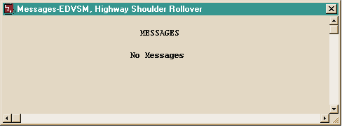

*Figure 3-1: Typical Messages output report issued by EDVSM.*

### Accident History

The Accident History Report displays a table of initial and final positions and velocities for the vehicle. A typical Accident History Report is shown in Figure 3-2. The report includes total distance traveled and total time, plus initial and final X, Y, PSI position and V-tot, u-vel, v-vel and yaw velocity.

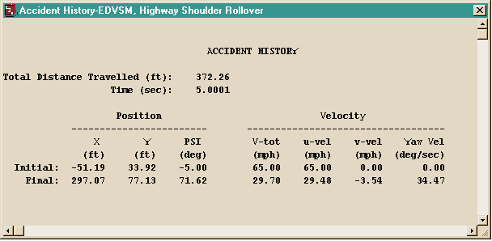

*Figure 3-2: Typical Accident History output report issued by EDVSM.*

### Driver Controls

The Driver Controls Report displays a table of driver steering, braking, throttle and gear selections for the vehicle. A typical Driver Controls Report is shown in Figure 3-3 (Brake Table of Pedal Force vs time, Throttle Table by axle, Gear Table and Steer Table of Steering Wheel angle vs time).

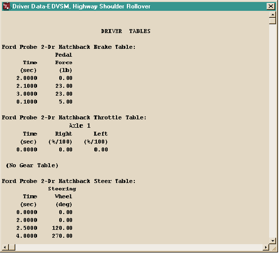

*Figure 3-3: Typical Driver Controls output report issued by EDVSM.*

### Environment Data

The Environment Data Report displays the physical and visual information describing the environment (ambient temperature and pressure, gravity constant, 3-D geometry filename, number of polygons, GetSurfaceInfo method and minimum terrain elevation). A typical Environment Data Report is shown in Figure 3-4.

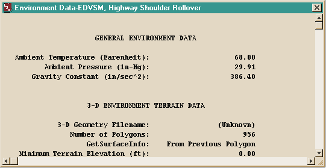

*Figure 3-4: Typical Environment Data output report issued by EDVSM.*

> **NOTE:** A detailed description of the vertex information is not practical, owing to its large size (a terrain often is composed of several thousand vertices). However, it is possible to view the terrain information (friction multiplier, slope, elevation and so forth) beneath each tire during the entire sequence by selecting the tire terrain outputs in the Variable Output, Tires output group (see Variable Output, later in this chapter).

### Vehicle Data

The Vehicle Data Report includes the following information:

- **Vehicle Dimensional and Inertial Properties** - The dimensional and inertial parameters as were used by EDVSM in the current event.
- **Suspension Properties** - The suspension parameters as were used by EDVSM in the current event.
- **Brake System Properties** - The brake system parameters as were used by EDVSM in the current event.
- **Tire Properties** - The tire parameters as were used by EDVSM in the current event.

A portion of a typical Vehicle Data Report is shown in Figures 3-5a, b, and c (a vehicle data report consumes several pages). The report begins with General Vehicle Information (overall length and width, CG-to-front/rear end, wheelbase, track widths, overhangs, CG-to-axle distances, CG height, total weight, aerodynamic drag data), followed by Sprung Mass Data (mass, weight, rotational inertias), Suspension Data (per-axle suspension type, wheel locations, unsprung weights, roll steer, auxiliary roll stiffness, ride and damping rates, suspension friction, jounce/rebound stops, energy loss ratio), Camber and Half-track Tables, Anti-pitch Table, Brake System Data (pedal ratio and per-wheel brake type, torque ratio, pushout pressure and proportioning data) and Tire Data (physical data, deflection rates, friction tables at each test load and speed, cornering and camber stiffness data).

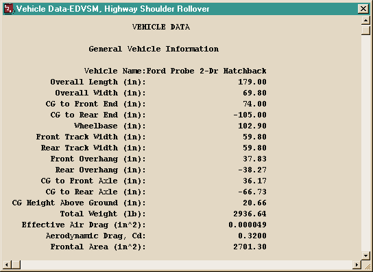

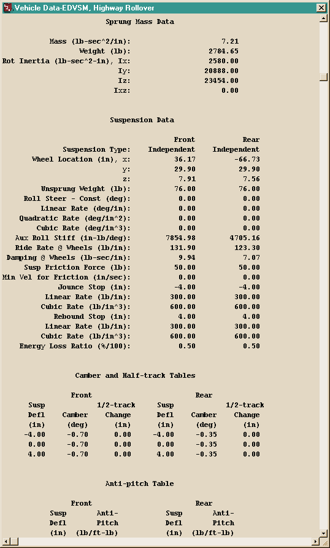

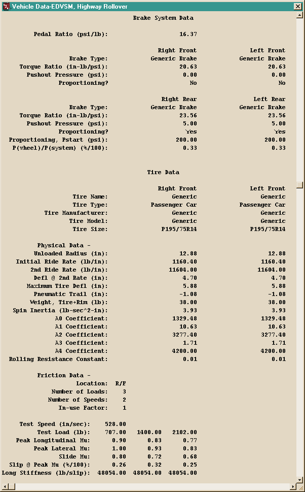

*Figure 3-5a/b/c: Typical Vehicle Data output report issued by EDVSM.*

### Program Data

The Program Data Report includes the following information:

- **Simulation Controls** - Integration parameters used for the current event
- **General Information** - EDVSM version number and internally assigned constants used for the current event

A typical Program Data Report is shown in Figure 3-6. The Simulation Controls section reports the integration method (Fixed Runge-Kutta), maximum simulation time, normal integration timestep, output interval, and the linear and angular termination velocities. The General Information section reports the EDVSM version number, wheel spin integration constant, terminal wheel spin velocity, pitch index angle and driveline inertia.

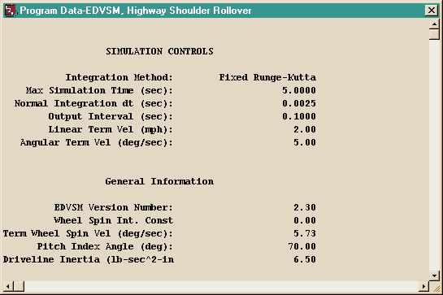

*Figure 3-6: Typical Program Data output report issued by EDVSM.*

## Graphic Reports

EDVSM produces no Graphic Output Reports.

> **NOTE:** Graphs of simulation results vs time may be produced using the Variable Output window (see next section).

## Variable Output Table

EDVSM produces a Variable Output table containing the time-based simulation results. The Variable Output groups produced by EDVSM are as follows:

### Vehicle Output Groups

- **Kinematics** - Position, velocity and acceleration for the vehicle sprung mass
- **Kinetics** - Forces and moments acting on the sprung mass
- **Accelerometers** - Linear accelerations at user-specified locations on the vehicle
- **Tire** - The tire output parameters existing at the tire contact patch (compare with Wheel Output, below)
- **Wheel** - The wheel output parameters existing at the wheel's hub (compare with Tire Output, above)
- **Drivetrain** - Current levels of driving torque and other information related to the drivetrain
- **Driver** - Current levels of driver inputs (steering, braking, throttle and gear ratios)

An example of a Variable Output table is shown in Figure 3-7. A detailed listing of each Variable Output parameter produced by EDVSM is found in Table 3-1. For more information about HVE Variable Output parameters, refer to the HVE Operations Manual, Chapter 16, Event Model.

**Table 3-1 Vehicle Variable Output Data**

| Parameter | Description |
|---|---|
| Vehicle Kinematic Data | X,Y,Z position of CG; $\Phi,\Theta,\Psi$ orientation; Total linear velocity, u,v,w components; Sideslip, course angles; p,q,r angular velocity; Total linear accel, fwd, side, vert components; u-dot, v-dot, w-dot linear components; p-dot, q-dot, r-dot angular components |
| Kinetic Data | $\Sigma F_x$, $\Sigma F_y$, $\Sigma F_z$ (Suspension); $\Sigma M_x$, $\Sigma M_y$, $\Sigma M_z$ (Suspension); $\Sigma F_x$, $\Sigma F_y$, $\Sigma F_z$ (Collision); $\Sigma M_x$, $\Sigma M_y$, $\Sigma M_z$ (Collision); $F_x$ (Aerodynamic) |
| Accelerometer Data | Total linear accel; forward, Lat, Vert components for each accelerometer |
| Tire Data | X,Y,Z position of tire contact patch; $F_{x'}$, $F_{y'}$, $F_{z'}$ of tire contact patch; Loaded Tire Radius; Longitudinal Slip; Slip Angle; Skid Flag |
| Wheel Data | x,y,z location of wheel; Camber, Steer angle of wheel; Wheel Spin Velocity; $F_x$, $F_y$, $F_z$ of wheel; Jounce/Rebound displacement, velocity; Spring, Damping and Anti-pitch Suspension Force; Drive and Brake Torque at wheel; Brake Pressure at wheel |
| Drivetrain Data | Engine Speed, Power and Torque; Transmission and Differential Numeric Ratio |
| Driver Data | Steering wheel angle; Throttle position; Brake Pedal Force and Master Cylinder Pressure; Transmission and Differential Gear Selection |

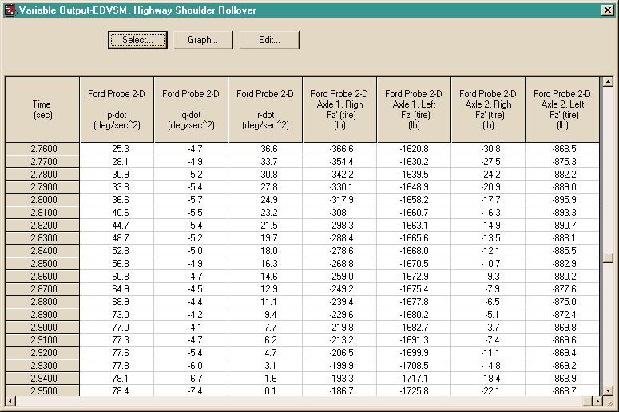

*Figure 3-7: Typical Variable Output report produced by EDVSM.*

## Trajectory Simulations

EDVSM produces a trajectory simulation of the current event. The trajectory simulation is a 3-D visualization of the data displayed in the Variable Output Table (see previous section). An example of a trajectory simulation is shown in Figure 3-8.

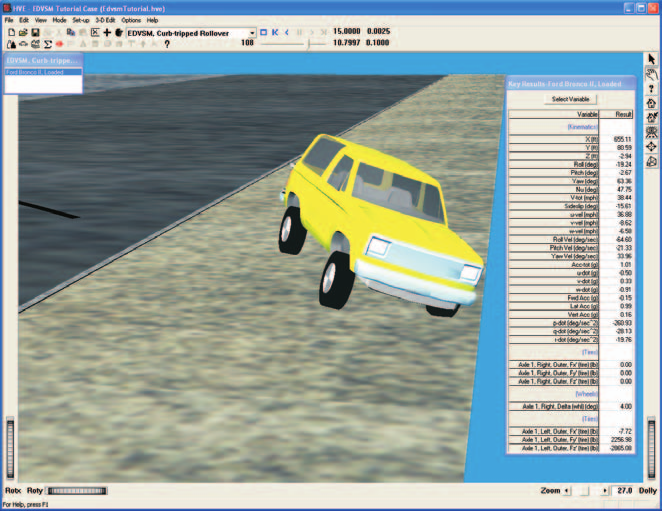

*Figure 3-8: Typical Trajectory Simulation output produced by EDVSM.*

### Displaying a Trajectory Simulation

The Trajectory Simulation is controlled using the Playback Controller (see Figure 3-9).

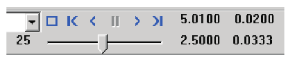

*Figure 3-9: Playback Controller.*

The Playback Controller's buttons have the following functions:

- **Reset** - Returns to the start of the simulation and reinitialize the video output device (this applies a hardware reset and is otherwise the same as the *Rewind to Start* button, below).
- **Rewind to Start** - Return to the start of the simulation
- **Reverse** - Play the simulation backwards
- **Pause** - Pause the simulation
- **Play** - Execute the event or play the simulation forwards
- **Advance to End** - Advance to the end of the simulation

> **NOTE:** The Playback Controller also includes additional features used for creating video. Refer to the HVE User's Manual, Playback Editor and Video Output sections, for further details.

## Damage Profile Simulations

EDVSM produces a damage profile simulation of the current event. The damage profile simulation is a 3-D visualization of the 3-D vertex data stored in the Damage output group in the Variable Output Table.

> **NOTE:** The Damage output group is not currently displayable in the Variable Output table.

An example of a damage profile simulation is shown in Figure 3-10.

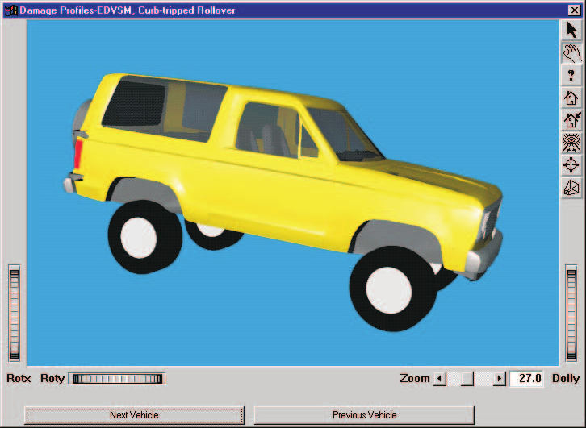

*Figure 3-10: Typical Damage Profile output produced by an EDVSM rollover simulation.*

To display a Damage Profile simulation use the Event Controller (see Figure 3-9), just as in the Trajectory Simulation.

> **NOTE:** Because the Event Controller is enabled by the Trajectory Simulation, you must have the corresponding Trajectory Simulation open in order to "play" the Damage Profile.

<!-- NAV -->

---

← Previous: [Chapter 2 — EDVSM Program Input](02-program-input.md)  |  [Index](README.md)  |  Next: [Chapter 4 — Calculation Method](04-calculation-method.md) →

<!-- /NAV -->
