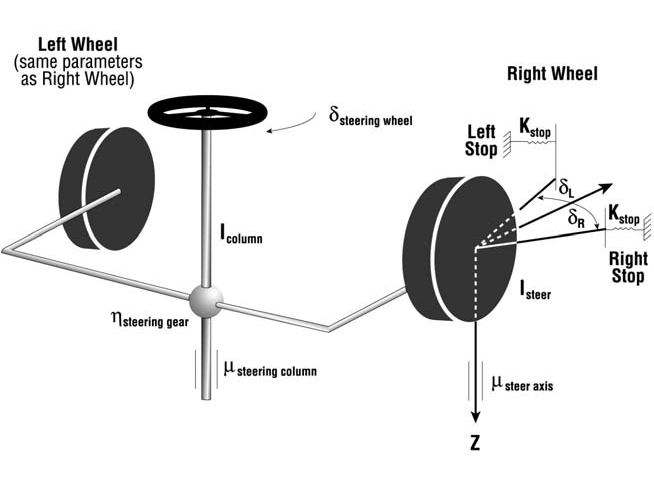
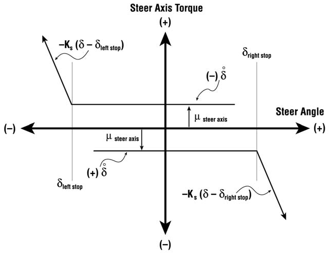
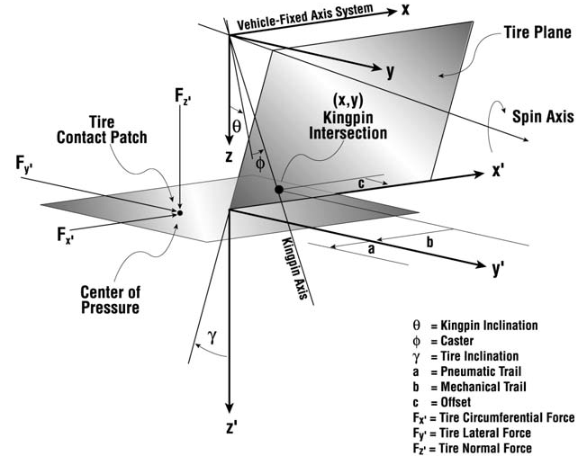

# Chapter 4 — Calculation Method

## Basic Vehicle Model

The vehicle model used by EDVSM was originally developed for the HVOSM. The reader is referred to original program documentation [1-3] for a detailed description of the model. Validation of EDVSM is published in [4].

## Steering System

The steering system in EDVSM includes the steering gear ratio (steer angle at the steering wheel divided by the steer angle at the axle). This ratio is used when the *At Steering Wheel* steer table option is selected.

EDVSM also incorporates an extended version of HVOSM's Steer Degree of Freedom model. The Steer Degree of Freedom model is activated by selecting the *Normal* option in EDVSM's Calculation Options dialog (see the [EDVSM Calculation Options reference](../../10-calculation-options/CalcOptEDVSM.md)).

> **NOTE:** The Append option is not supported by EDVSM.

The engineering model used by the Steer Degree of Freedom option is shown in Figure 4-1. The linkage is assumed to be rigid, thus the angular acceleration about the steering axis is the same for right-side and left-side wheels. External steer forces are generated at the tire-road interface, thus producing a moment about each tire's steering axis according to the tire's pneumatic trail. The moments are resisted by steer system inertia and internal coulomb friction. Steering is limited by right and left steering stops at each wheel.

*Figure 4-1: EDVSM steering system model used for the steer degree of freedom.*

Application of Newton's 2nd law to the steering system, ignoring inertial coupling effects, results in

$$\sum M_{Steering} = I_{Steering}\,\ddot{\delta}$$

where

| Symbol | Definition |
|---|---|
| $\sum M_{Steering}$ | Sum of external moments acting on steering system components |
| $I_{Steering}$ | Total rotational inertia of steering system components |
| $\delta$ | Steer angle of each steerable wheel about its steerable axis (thus, $\ddot{\delta}$ is the angular acceleration) |

The sum of external moments is

$$\sum M_{Steering} = M_{Stops} + M_{Steer\ Axis\ Friction} + M_{Steering\ Column\ Friction} + M_{Tires}$$

where

| Symbol | Definition |
|---|---|
| $M_{Stops}$ | Moments about wheel steer axis produced by contact with steering stops |
| $M_{Steer\ Axis\ Friction}$ | Moments about wheel steer axis produced by coulomb friction in the steering ball joints or king pin |
| $M_{Steering\ Column\ Friction}$ | Moment about the steering column axis produced by coulomb friction between the steering shaft and bushings or bearings |
| $M_{Tires}$ | Moments about the wheel steer axis produced by the tire forces and pneumatic trail at the tire-ground shear interface (contact patch) |

### Steering Stop Torque

Steer angles are limited by steering stops at the right- and left-side wheels. Each wheel's steering stops limit the steer angle for both right and left steering inputs for a given wheel; the right-steer and left-steer stop angles are assumed to be equal.

> **NOTE:** The user-entered value for the right steering stop is used as the stop angle for both left and right turns.

The steering stop torque at each stop is

$$M_{Stop} =
\begin{cases}
0, & \text{for } \delta_{Steer} \le \delta_{Stop} \text{ or } \mathrm{sgn}\delta_{Steer} \ne \mathrm{sgn}\dot{\delta}_{Steer} \\
K_{Stop}\left(\delta_{Steer} - \delta_{Stop}\right), & \text{for } \delta_{Steer} > \delta_{Stop}
\end{cases}$$

where

| Symbol | Definition |
|---|---|
| $K_{Stop}$ | Steering stop mechanical stiffness for specified steering stop |
| $\delta_{Steer}$ | Steer angle at wheel |
| $\delta_{Stop}$ | Angle of steering stop |

The above equations are for right steer; a steer to the left produces the same torque magnitude but opposite in direction. The general characteristic for steer axis torque is shown in Figure 4-2.

*Figure 4-2: Steer axis friction and stop torque vs. steer angle.*

### Steer Axis and Steering Column Friction Torque

Friction torque is also produced by rotation of the wheel about its steer axis and by rotation of the steering shaft in the steering column bushings. However, no torque is produced unless the steer velocity is non-zero. Thus, a minimum value of steer velocity is required to develop the assigned frictional torque. This minimum steer velocity is called a friction *null band*. The combined steering friction torque for each wheel is

$$M_{SteerAxis + SteeringColumn} =
\begin{cases}
0, & \text{for } \left|\dot{\delta}_{Steer}\right| \le \varepsilon \\
\left(\mu_{SteerAxis} + 0.5\,\mu_{Steering\ Column}\right), & \text{for } \left|\dot{\delta}_{Steer}\right| > \varepsilon
\end{cases}$$

where

| Symbol | Definition |
|---|---|
| $\varepsilon$ | Steering friction null band |
| $\mu_{Steer\ Axis}$ | Steer axis friction torque for each wheel |
| $\mu_{Steering\ Column}$ | Steering column friction torque |

### Tire-Ground Torque

Forces at the tire-ground shear interface are the external input to the steering system. Because these forces do not act through the steer axis at its intersection with the ground plane (see Figure 4-3), an external moment about the steer axis is produced.

*Figure 4-3: Close-up view of torque-producing mechanism at tire-ground shear interface.*

Inspection of Figure 4-3 reveals the idealized point of application of the tire force, $F_x, F_y, F_z$, acts at a distance $b - a$ in the x' direction, and $c$ in the y' direction, from the wheel steer axis intersection with the ground plane.

> **NOTE:** EDVSM assumes the offset, $c$, and mechanical trail, $b$, are zero.

The external moment thus produced about the steer axis at each tire is

$$M_{Tire} = -F_x\left(r_y + r_z\gamma\right) + F_y\left(r_x + \left(T_P + T_M\right)\cos\delta_G\,\cos\theta_x\right) + F_z\left(r_x\gamma\right)$$

where

| Symbol | Definition |
|---|---|
| $F_x, F_y, F_z$ | Vehicle-fixed tire force components |
| $r_x, r_y, r_z$ | Vehicle-fixed components of distance from wheel center to tire-ground contact point |
| $T_P$ | Tire pneumatic trail ($a$ in Figure 4-3) |
| $T_M$ | Mechanical trail ($b$ in Figure 4-3; assumed = 0) |
| $\gamma$ | Inclination angle (angle from tire z' axis to ground surface normal) |
| $\delta_G$ | Wheel vehicle-fixed steer angle relative to ground plane |
| $\theta_x$ | Angle from vehicle x-axis to ground plane |

### Steering System Rotational Inertia

The rotational inertia of the entire steering system is

$$I_{Steering} = I_{Steer,Rt} + I_{Steer,Lt} + I_{Column} \times \eta$$

where

| Symbol | Definition |
|---|---|
| $I_{Steer,Rt}$ | Total steer rotational inertia for right-side wheel: tire + rim + any steering portion of brake |
| $I_{Steer,Lt}$ | Total rotational inertia for left-side wheel |
| $I_{Column}$ | Total rotational inertia of steering column, including steering gearbox |
| $\eta$ | Steering gear ratio |

<!-- NAV -->

---

← Previous: [Chapter 3 — EDVSM Program Output](03-program-output.md)  |  [Index](README.md)  |  Next: [Chapter 5 — EDVSM Tutorial](05-tutorial.md) →

<!-- /NAV -->
