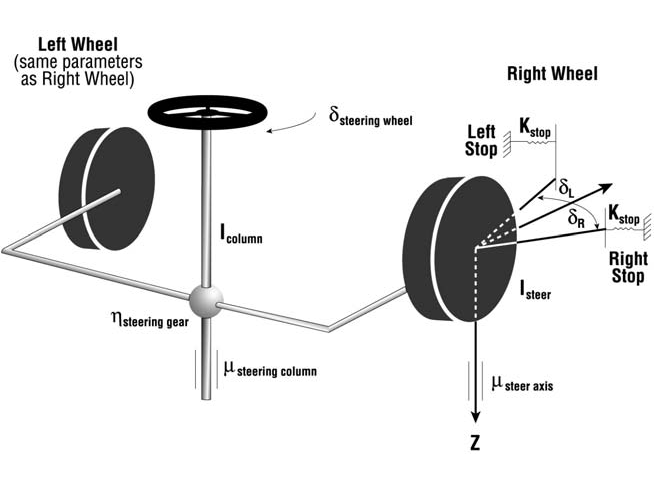
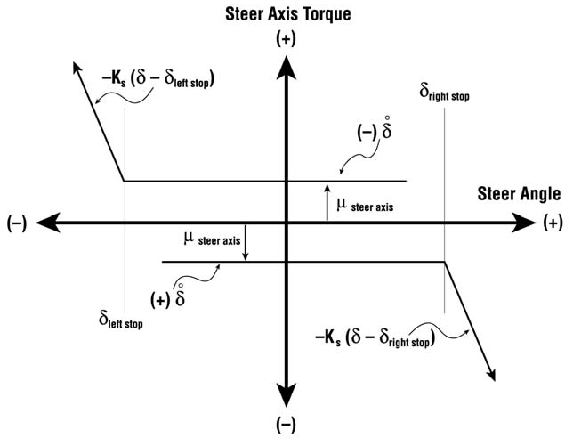
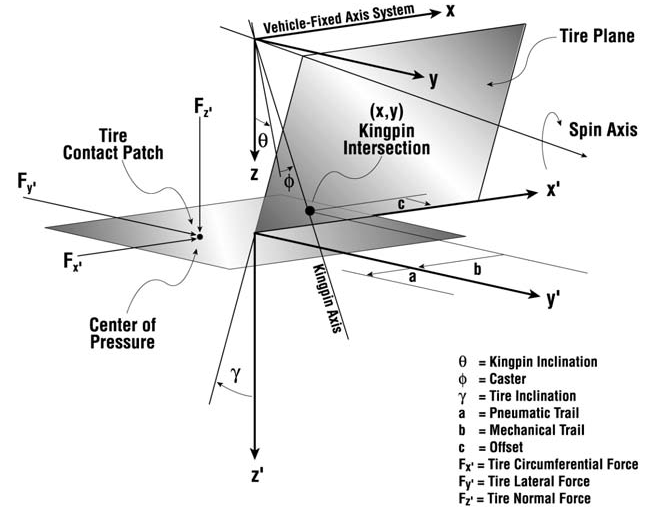

# Chapter 4 — Calculation Method

## Basic Vehicle Model

The vehicle model used by EDVSM was originally developed for the HVOSM. The reader is referred to original program documentation [1-3] for a detailed description of the model. Validation of EDVSM is published in [4].

### Degrees of freedom

EDVSM carries eleven degrees of freedom:

| Group | Count | Description |
|---|---:|---|
| Sprung mass | 6 | Three translations and three rotations of the vehicle body |
| Suspension | 4 | A vertical displacement and a roll rotation at each of the front and rear axles |
| Steering | 1 | The steer degree of freedom described later in this chapter |

Each wheel additionally carries a spin degree of freedom, advanced separately
from the main solution.

For a solid axle, the axle's vertical displacement and roll angle combine to
give the displacement at each wheel:

$$\delta_{Left} = \delta_{Axle} + \frac{T}{2}\,\phi_{Axle},
  \qquad
  \delta_{Right} = \delta_{Axle} - \frac{T}{2}\,\phi_{Axle}$$

where $T$ is the track width. For an independent suspension the two wheels are
uncoupled and each carries its own displacement directly.

### Equations of motion

The six sprung-mass equations and the four suspension equations are coupled
through the inertia of the vehicle, so they are assembled into a single
ten-by-ten system and solved together at each timestep:

$$\mathbf{M}\,\ddot{\mathbf{q}} = \mathbf{F}$$

where $\mathbf{M}$ is the generalized mass matrix, rebuilt each timestep because
it depends on the current suspension displacements and vehicle orientation, and
$\mathbf{F}$ collects the tire, suspension, aerodynamic and gravitational
contributions together with the Coriolis and centrifugal terms. The system is
solved by Gaussian elimination; a singular matrix terminates the run.

The remaining states follow by kinematics rather than by solving equations of
motion. The vehicle's orientation rates come from the body-fixed angular
velocities through the standard Euler relations,

$$\dot{\phi} = p + \left(q\sin\phi + r\cos\phi\right)\tan\theta$$

$$\dot{\theta} = q\cos\phi - r\sin\phi$$

$$\dot{\psi} = \left(q\sin\phi + r\cos\phi\right)\sec\theta$$

and the earth-fixed position rates come from resolving the body-fixed velocity
through the vehicle's direction cosine matrix:

$$\dot{\mathbf{X}} = \mathbf{A}\,\mathbf{u}$$

> **NOTE:** The $\sec\theta$ in the yaw rate is singular at a pitch angle of 90 degrees. This is inherent to the Euler angle sequence and is the reason the model is not suited to extreme pitch attitudes.

*(updated: earlier editions covered only the steering system and referred the
reader to the HVOSM documentation for everything else.)*

### Suspension forces

The force at each wheel station is the sum of a spring force and a friction
force. The spring is linear within its free travel and stiffens sharply beyond
it:

$$F_{Spring} =
\begin{cases}
k\,\delta + \lambda\left[k_{e}\left(\delta - \omega_{e}\right) + k'_{e}\left(\delta - \omega_{e}\right)^3\right],
   & \delta > \omega_{e}\\[6pt]
k\,\delta,
   & \omega_{c} \le \delta \le \omega_{e}\\[6pt]
k\,\delta + \lambda\left[k_{c}\left(\delta - \omega_{c}\right) + k'_{c}\left(\delta - \omega_{c}\right)^3\right],
   & \delta < \omega_{c}
\end{cases}$$

where $k$ is the suspension rate, $\omega_{e}$ and $\omega_{c}$ are the
extension and compression stop displacements, and $k$ and $k'$ with subscripts
$e$ and $c$ are the linear and cubic rates of the extension and compression
stops. The cubic term is what gives a stop its progressive feel rather than a
hard step in rate.

The factor $\lambda$ applies **only to the stop term**, and only while the stop
is unloading — that is, while the displacement and its rate have opposite signs.
It is the suspension's stop energy-dissipation factor. Setting it to 1 makes the
stop perfectly elastic; a value below 1 makes the stop absorb energy, which is
what a real bump stop does.

Damping is Coulomb rather than viscous:

$$F_{Friction} =
\begin{cases}
\dfrac{C_f}{\varepsilon}\,\dot{\delta}, & \left|\dot{\delta}\right| < \varepsilon\\[10pt]
C_f\,\mathrm{sgn}\,\dot{\delta}, & \left|\dot{\delta}\right| \ge \varepsilon
\end{cases}$$

where $C_f$ is the Coulomb friction force and $\varepsilon$ the friction
velocity band. The band exists purely to avoid a discontinuity at zero velocity:
without it a vehicle standing still would never settle, because the friction
force would chatter between $\pm C_f$.

> **NOTE:** There is no viscous damper rate in the EDVSM suspension model. All suspension damping comes from the Coulomb friction force and from the stop dissipation factor. A shock absorber's rate must therefore be represented through the Coulomb friction value, which is an approximation — it produces a force independent of velocity rather than proportional to it.

### Aerodynamic and road-load force

A single longitudinal resistance force is applied to the sprung mass, opposing
forward motion:

$$F_{x} = -\left(C_1\,u\left|u\right| + C_2\,u + C_3\,\mathrm{sgn}\,u\right)$$

where $u$ is the vehicle's forward velocity. The three terms are the
conventional road-load breakdown: $C_1$ is the aerodynamic drag term, which
grows with the square of speed; $C_2$ is a velocity-proportional term; and
$C_3$ is a constant rolling term. The force is applied only above a forward
speed of 1 in/sec, so that a stationary vehicle is not pushed backwards.

> **NOTE:** No aerodynamic side force, lift or moment is computed. The resistance acts along the vehicle's forward axis only.

### Tire forces

EDVSM carries two separate tire models. A **radial spring model** produces the
vertical force, and is what allows the vehicle to climb a curb or drop into a
pothole: the tire is represented as a ring of radial springs, and the vertical
force is the assembled reaction of every spring in contact with the terrain, so
the force depends on the shape of the ground beneath the tire and not merely on
the height of the wheel centre. The spring rate increases beyond a user-entered
deflection to represent the tire bottoming on its rim.

The **shear forces** — longitudinal and lateral — are computed from the friction
available at the contact patch.

The longitudinal friction coefficient varies with longitudinal slip, $s$. Below
the slip at which friction peaks, $s_p$, it rises to the peak value. Above it,
the coefficient falls along a parabola from the peak value to the sliding value
at full lock:

$$\mu_x(s) = \mu_{Slide} + \left(\mu_{Peak} - \mu_{Slide}\right)
             \left(\frac{s - 1}{s_p - 1}\right)^2,
             \qquad s_p \le s \le 1$$

The parabola is constructed with its vertex at $s = 1$, so the friction curve
flattens as the wheel approaches full lock rather than continuing to fall.

The longitudinal force is then

$$F_x = -\mu_x\,F_z\,\mathrm{sgn}\,u_{Ground}$$

and the lateral force available is what is left of the friction envelope:

$$F_{s,max} = \sqrt{\left(\mu_y F_z\right)^2 - \varepsilon\,F_x^2},
  \qquad
  \varepsilon = \left(\frac{\mu_y}{\mu_x}\right)^2$$

> **NOTE:** This is an *ellipse*, not the friction circle used by EDSMAC, EDSVS and EDVTS. The factor $\varepsilon$ is the squared ratio of the lateral to the longitudinal friction coefficient, so the envelope is circular only where the two coefficients are equal. Where a tire's longitudinal and lateral friction differ — which is the normal case — EDVSM will not give the same combined-slip behaviour as the friction-circle programs for otherwise identical tire data.

The Fiala model is then applied to that remaining capacity through the
non-dimensional sideslip parameter $\bar\beta$, formed from the tire's cornering
stiffness, the slip angle and the available lateral force:

$$F_s =
\begin{cases}
F_{s,max}\left(\bar\beta - \dfrac{\bar\beta\left|\bar\beta\right|}{3}
   + \dfrac{\bar\beta^3}{27}\right), & \left|\bar\beta\right| < 3\\[10pt]
F_{s,max}\,\mathrm{sgn}\,\bar\beta, & \left|\bar\beta\right| \ge 3
\end{cases}$$

A wheel is flagged as skidding when the Fiala model saturates, or when the
longitudinal slip passes the peak — in either case only if the vertical load
exceeds the minimum load for a skidmark, so that a lightly loaded wheel does not
draw a mark.

A rolling resistance moment opposes wheel rotation once the spin rate exceeds a
small threshold:

$$M_{Roll} = -C_{RR}\,F_z\,r\,\mathrm{sgn}\,\omega$$

### Wheel spin

Each wheel carries a spin degree of freedom, advanced separately from the main
ten-by-ten solution. The torque balance at a wheel is

$$I_{Spin}\,\dot\omega = T_{Drive} + T_{Brake} - F_x\,r + M_{Roll}$$

where $T_{Drive}$ is that wheel's share of the axle torque and $r$ is the
wheel's rolling radius.

> **NOTE:** The two wheels of a driven axle are not independent. The differential couples them, so each wheel's spin acceleration depends on the brake torque, tire force and rolling resistance at **both** wheels of the axle. A wheel that loses traction therefore affects the spin of its partner, which is what allows the model to reproduce one-wheel spin on a split-friction surface.

Brake torques are limited at low wheel speed, so that a nearly stopped wheel
cannot be driven backwards by its own brake.

## Steering System

The steering system in EDVSM includes the steering gear ratio (steer angle at the steering wheel divided by the steer angle at the axle). This ratio is used when the *At Steering Wheel* steer table option is selected.

EDVSM also incorporates an extended version of HVOSM's Steer Degree of Freedom model. The Steer Degree of Freedom model is activated by selecting the *Normal* option in EDVSM's Calculation Options dialog (see the [EDVSM Calculation Options reference](../../10-calculation-options/CalcOptEDVSM.md)).

> **NOTE:** The Append option is not supported by EDVSM.

The engineering model used by the Steer Degree of Freedom option is shown in Figure 4-1. The linkage is assumed to be rigid, thus the angular acceleration about the steering axis is the same for right-side and left-side wheels. External steer forces are generated at the tire-road interface, thus producing a moment about each tire's steering axis according to the tire's pneumatic trail. The moments are resisted by steer system inertia and internal coulomb friction. Steering is limited by right and left steering stops at each wheel.

*Figure 4-1: EDVSM steering system model used for the steer degree of freedom.*

Application of Newton's 2nd law to the steering system, ignoring inertial coupling effects, results in

$$\sum M_{Steering} = I_{Steering}\,\ddot{\delta}$$

where

| Symbol | Definition |
|---|---|
| $\sum M_{Steering}$ | Sum of external moments acting on steering system components |
| $I_{Steering}$ | Total rotational inertia of steering system components |
| $\delta$ | Steer angle of each steerable wheel about its steerable axis (thus, $\ddot{\delta}$ is the angular acceleration) |

The sum of external moments is

$$\sum M_{Steering} = M_{Stops} + M_{Steer\ Axis\ Friction} + M_{Steering\ Column\ Friction} + M_{Tires}$$

where

| Symbol | Definition |
|---|---|
| $M_{Stops}$ | Moments about wheel steer axis produced by contact with steering stops |
| $M_{Steer\ Axis\ Friction}$ | Moments about wheel steer axis produced by coulomb friction in the steering ball joints or king pin |
| $M_{Steering\ Column\ Friction}$ | Moment about the steering column axis produced by coulomb friction between the steering shaft and bushings or bearings |
| $M_{Tires}$ | Moments about the wheel steer axis produced by the tire forces and pneumatic trail at the tire-ground shear interface (contact patch) |

### Steering Stop Torque

Steer angles are limited by steering stops at the right- and left-side wheels. Each wheel's steering stops limit the steer angle for both right and left steering inputs for a given wheel; the right-steer and left-steer stop angles are assumed to be equal.

> **NOTE:** The user-entered value for the right steering stop is used as the stop angle for both left and right turns.

The steering stop torque at each stop is

$$M_{Stop} =
\begin{cases}
-K_{Stop}\left(\left|\delta_{Steer}\right| - \delta_{Stop}\right)\mathrm{sgn}\,\delta_{Steer}, & \left|\delta_{Steer}\right| > \delta_{Stop} \text{ and } \mathrm{sgn}\,\dot{\delta}_{Steer} = \mathrm{sgn}\,\delta_{Steer} \\[6pt]
0, & \text{otherwise}
\end{cases}$$

*(updated: earlier editions gave the stop torque as a positive multiple of the
overtravel. The torque opposes the overtravel, and it is released as soon as the
wheel begins to turn back out of the stop, however far into the stop it still
is.)*

where

| Symbol | Definition |
|---|---|
| $K_{Stop}$ | Steering stop mechanical stiffness for specified steering stop |
| $\delta_{Steer}$ | Steer angle at wheel |
| $\delta_{Stop}$ | Angle of steering stop |

The above equations are for right steer; a steer to the left produces the same torque magnitude but opposite in direction. The general characteristic for steer axis torque is shown in Figure 4-2.

*Figure 4-2: Steer axis friction and stop torque vs. steer angle.*

### Steer Axis and Steering Column Friction Torque

Friction torque is also produced by rotation of the wheel about its steer axis and by rotation of the steering shaft in the steering column bushings. However, no torque is produced unless the steer velocity is non-zero. Thus, a minimum value of steer velocity is required to develop the assigned frictional torque. This minimum steer velocity is called a friction *null band*. The combined steering friction torque for each wheel is

$$M_{SteerAxis + SteeringColumn} =
\begin{cases}
0, & \text{for } \left|\dot{\delta}_{Steer}\right| \le \varepsilon \\[6pt]
-\left(\mu_{SteerAxis} + 0.5\,\mu_{Steering\ Column}\right)\mathrm{sgn}\,\dot{\delta}_{Steer}, & \text{for } \left|\dot{\delta}_{Steer}\right| > \varepsilon
\end{cases}$$

*(updated: earlier editions gave the friction torque without the sign that makes
it oppose the steer velocity. Note also that the torque switches on abruptly at
the null band rather than being blended through zero, so the null band should
not be set larger than necessary.)*

The steering column friction torque is referred to the wheel steer axis through
the steering gear ratio before the half is taken, and half of the result is
applied at each of the two wheels.

where

| Symbol | Definition |
|---|---|
| $\varepsilon$ | Steering friction null band |
| $\mu_{Steer\ Axis}$ | Steer axis friction torque for each wheel |
| $\mu_{Steering\ Column}$ | Steering column friction torque |

### Tire-Ground Torque

Forces at the tire-ground shear interface are the external input to the steering system. Because these forces do not act through the steer axis at its intersection with the ground plane (see Figure 4-3), an external moment about the steer axis is produced.

*Figure 4-3: Close-up view of torque-producing mechanism at tire-ground shear interface.*

Inspection of Figure 4-3 reveals the idealized point of application of the tire force, $F_x, F_y, F_z$, acts at a distance $b - a$ in the x' direction, and $c$ in the y' direction, from the wheel steer axis intersection with the ground plane.

> **NOTE:** EDVSM assumes the offset, $c$, and mechanical trail, $b$, are zero.

The external moment thus produced about the steer axis at each tire is

$$M_{Tire} = -F_x\left(r_y + r_z\gamma\right) + F_y\left(r_x + \left(T_P + T_M\right)\cos\delta_G\,\cos\theta_x\right) + F_z\left(r_x\gamma\right)$$

where

| Symbol | Definition |
|---|---|
| $F_x, F_y, F_z$ | Vehicle-fixed tire force components |
| $r_x, r_y, r_z$ | Vehicle-fixed components of distance from wheel center to tire-ground contact point |
| $T_P$ | Tire pneumatic trail ($a$ in Figure 4-3) |
| $T_M$ | Mechanical trail ($b$ in Figure 4-3; assumed = 0) |
| $\gamma$ | Inclination angle (angle from tire z' axis to ground surface normal) |
| $\delta_G$ | Wheel vehicle-fixed steer angle relative to ground plane |
| $\theta_x$ | Angle from vehicle x-axis to ground plane |

> **NOTE:** Unlike SIMON, EDVSM does not include a gyroscopic precession moment
> about the steer axis from the spinning wheels, and it does not include a scrub
> radius term. The mechanical trail really is treated as zero.

*(updated: this note describes the scope of the EDVSM steering model relative to
the more detailed treatment in SIMON.)*

*(updated: hydroplaning is **not** modeled by EDVSM. The HVE physics library provides hydroplaning models (NASA, NASA-TTI, Gallaway), but only SIMON and EDSMAC4 invoke them; EDVSM offers no Hydroplaning Model calculation option, and any water-related tire output variables it reports are unused placeholders. See [SIMON — Hydroplaning Model](../SIMON/04-calculation-method.md#hydroplaning-model).)*

### Steering System Rotational Inertia

The rotational inertia of the entire steering system is

$$I_{Steering} = I_{Steer,Rt} + I_{Steer,Lt} + I_{Column} \times \eta$$

where

| Symbol | Definition |
|---|---|
| $I_{Steer,Rt}$ | Total steer rotational inertia for right-side wheel: tire + rim + any steering portion of brake |
| $I_{Steer,Lt}$ | Total rotational inertia for left-side wheel |
| $I_{Column}$ | Total rotational inertia of steering column, including steering gearbox |
| $\eta$ | Steering gear ratio |

The steering column friction torque is scaled by the same ratio.

<!-- NAV -->

---

← Previous: [Chapter 3 — EDVSM Program Output](03-program-output.md)  |  [Index](README.md)  |  Next: [Chapter 5 — EDVSM Tutorial](05-tutorial.md) →

<!-- /NAV -->
