# Chapter 5 — EDVSM Tutorial

## Description

This tutorial is based on the EDVSM validation study described in SAE Paper No. 970895 [4]. The validation study includes a curb-tripped rollover of a Ford Bronco II. In this tutorial, we extend this validation study by illustrating how a tire blow-out at various wheel positions affects the vehicle response.

Like all EDVSM events, the procedure involves the following basic steps:

- Create the vehicle(s)
- Create the environment
- Execute the EDVSM event(s)
- Review the EDVSM output reports

This basic procedure is described in detail in this tutorial.

> **NOTE:** It is assumed that HVE is up and running, and that the user is familiar with HVE's basic features, such as using HVE's dialogs and viewers, as well as the HVE Editors. The purpose of this tutorial is to illustrate those features while setting up and executing an EDVSM event.

## Getting Started

As in other tutorials, before we get started with our current tutorial, let's set the user options so we're all starting on the same page.

> **NOTE:** Most options simply affect the appearance in a viewer during Event or Playback mode. However, some options affect the data used in the analysis. For example, if AutoPosition is On, the vehicle position conforms to the local surface; otherwise, the position is set by the Position/Velocity dialog. Obviously, the resulting difference in initial conditions could substantially change the event.

> **NOTE:** Some of the following options are "Toggles" that switch between two different modes. Make sure these options are set correctly.

To set the initial user options, choose the following from the Options Menu:

- ON: Show Key Results
- OFF: Show Axes
- OFF: Show Contacts
- OFF: Show Velocity Vectors
- ON: Show Skidmarks
- OFF: Show Targets
- ON: AutoPosition
- Units equals U.S.
- Render Options:
  - Show Humans as *Actual*
  - Show Vehicles as *Actual*
  - *Phong* Render Method
  - Complexity equals *Object*
  - Render Quality equals *5*
  - Texture Quality equals *1*
  - Anti-aliasing equals *1*

The remaining options will automatically initialize to their default conditions. We're now ready to proceed with the tutorial.

Our goal is to use EDVSM to simulate a handling experiment conducted by the University of Missouri [6]. This tutorial shows us how to perform this simulation.

## Creating the Vehicle

First let's add the vehicle to our case. The vehicle is a yellow 1984 Ford Bronco II:

- If the Vehicle Editor is not the current editor, choose *Vehicle Mode*. The Vehicle Editor is displayed.
- Click *Add New Object*. The Vehicle Information dialog is displayed. The Vehicle Information dialog allows the user to select the basic vehicle attributes according to *Type, Make, Model, Year* and *Body Style*.

> **NOTE:** The Vehicle Information dialog also allows you to edit the Driver Location, Engine Location, Number of Axles and Drive Axle(s). The Ford Bronco II is a 4-wheel drive vehicle, but we're going to select 2-wheel drive for the tutorial.

- Using the option buttons, click each button to choose the following vehicle from the Vehicle Database:
  - Type = *Sport-Utility*
  - Make = *Ford*
  - Model = *Bronco II*
  - Year = *1984-1991*
  - Body Style = *2-Door*
  - Source Database = *Tutorial.db*
  - Drive Axle = *Axle 2*

> **NOTE:** The Ford Bronco II is a 4-wheel drive vehicle. Because it was used in 2-wheel drive mode during the handling experiments, we must edit the default Drive Axle option.

- Edit the default name; enter `Ford Bronco II, Loaded`.
- Click *OK* to add *Ford Bronco, Loaded* to the Active Vehicles list.

The Ford Bronco II is displayed in the viewer, as shown in Figure 5-1.

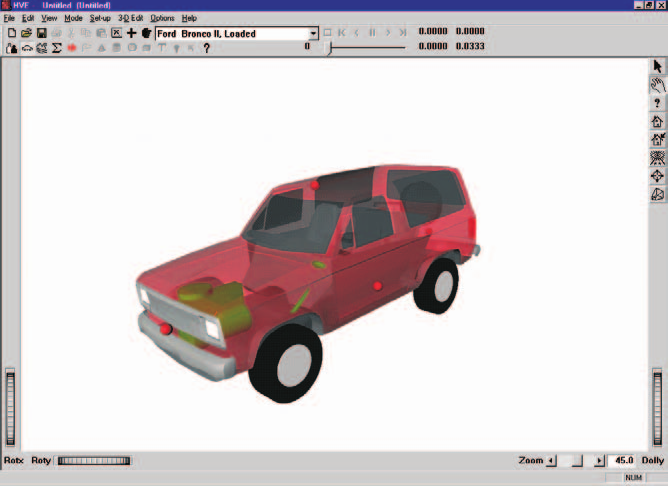

*Figure 5-1: Ford Bronco II, Loaded before editing.*

### Editing the Vehicle

Next, we will edit the vehicle to change its color and inertias (the test vehicle was fitted with outriggers to prevent a catastrophic rollover; these outriggers and other test equipment affected the vehicle's inertial properties). In addition, we'll add an anti-sway bar to the rear suspension, and disable the left, front brake (this was done as part of the handling experiment to help ensure directional control and test repeatability).

To edit the color, perform the following steps:

- Click on the CG and choose *Color*. The Vehicle Color dialog is displayed (see Figure 5-2), showing the vehicle's current color (the small black square, or *hot spot*, in the *color wheel*) and intensity (the arrow in the *intensity slider*). Click on the hot spot and drag it to the yellow area. To lighten the vehicle, click on the intensity slider and drag it to the far right end of the range.

> **NOTE:** The color chip on the left shows the current color.

*Figure 5-2: Vehicle Color dialog, used for assigning the vehicle color.*

- When the color is to your liking, close the dialog by clicking on the close button in the upper right-hand corner of the dialog.

> **NOTE:** The vehicle's apparent color may be slightly misleading because the vehicle is translucent when displayed in the Vehicle Editor. The actual color will be used whenever the vehicle is displayed during Event and Playback mode.

Next, let's change the weight and rotational inertias to account for the outriggers installed on the test vehicle to prevent rollover. Perform the following steps:

- Click on the CG and choose *Inertias*. The Inertias dialog is displayed, and we're ready to change the vehicle's inertias.
- In the *Total Weight* text field, replace the existing weight, 3594, with the measured (test) value, `4329.2` lb.

> **NOTE:** The dialog might initially display 3593.906, or a similar number, because the weight is actually divided by the current gravity constant and stored as mass. Extra precision results when the mass is multiplied by the current gravity constant and redisplayed.

- In the *Sprung Inertia, Roll* text field, replace the existing roll inertia, 3133.83, with the measured value, `5372.4` lb-sec²-in.
- In the *Sprung Inertia, Pitch* text field, replace the existing pitch inertia, 21680.97, with the measured value, `23666.9` lb-sec²-in.
- In the *Sprung Inertia, Yaw* text field, replace the existing yaw inertia, 23239.0, with the measured value, `26100.85` lb-sec²-in.

The Inertias dialog now appears as shown in Figure 5-3.

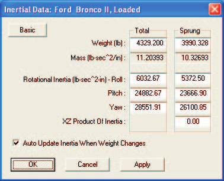

*Figure 5-3: Vehicle Inertias dialog, used for editing the current weight and roll, pitch and yaw rotational inertias.*

- Make sure the checkbox for *Auto Update Inertia When Weight Changes* is not selected, as you do not want to overwrite your input values.
- Press *OK* to accept the new weight and rotational inertias.

Next, let's add a 1-inch anti-sway bar at the rear suspension:

- Click on either rear wheel. The Wheel pop-up menu is displayed.
- Choose *Suspension*. The Suspension Information dialog for the selected wheel is displayed (see Figure 5-4).
- Choose *Springs and Shocks*. The Springs and Shocks dialog for the selected wheel is displayed.
- In the *Auxiliary Roll Stiffness* data field, replace the existing value, 0.00, with the calculated value for a 1-inch anti-sway bar, `1310.0` in-lb/deg. The dialog now appears as shown in Figure 5-5.

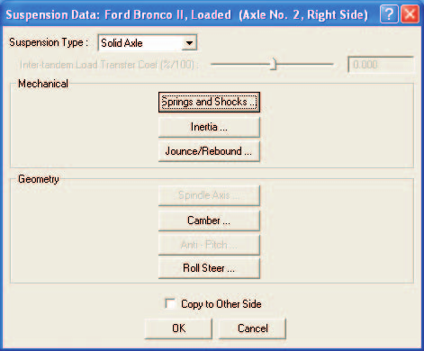

*Figure 5-4: Vehicle Suspension Information dialog, used for selecting various suspension data groups for editing.*

- Press *OK* to accept the new auxiliary roll stiffness.
- Press *OK* again to remove the Suspension Information dialog.

Finally, let's disable the left front brake by setting its brake torque ratio to zero:

- Click on the left front wheel. The Wheel pop-up menu is displayed.
- Choose *Brake*. The Brake Assembly dialog for the left front wheel is displayed.
- In the *Torque Ratio* data field, replace the existing value, 27.66 in-lb/psi, with the desired value, `0.0`, to disable the left front brake. The dialog now appears as shown in Figure 5-6.
- Press *OK* to accept the modified brake torque ratio for the left front wheel.

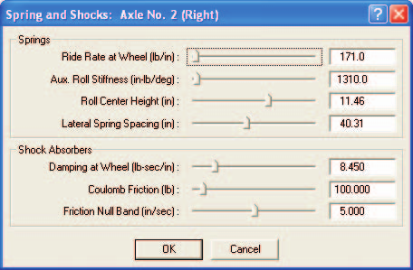

*Figure 5-5: Springs and Shocks dialog, used for editing the current auxiliary roll stiffness due to the anti-sway bar.*

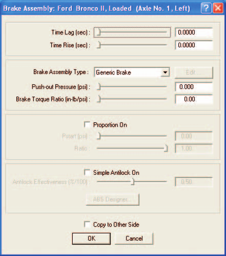

*Figure 5-6: Wheel Brake dialog, used for editing the brake parameters for the left front wheel.*

The vehicle is now ready for use in our events. Using the viewer thumb wheel, rotate and look at the vehicle. Note that the thumb wheels rotate the vehicle about the *viewer* axes, not the *vehicle* axes.

> **NOTE:** Remember HVE's 3-D viewers have 2 modes: Pick and Manipulate (the icon in the upper right corner of the viewer displays the current mode). In Pick mode, you can use the thumb wheels to adjust the view. In Manipulate mode, you can use the left mouse button to rotate the view and the middle mouse button to pan back and forth. Refer to the HVE User's Manual, Overview (Window Manager Basics) for more information about using HVE's viewer controls.

## Creating the Environment

Now, let's add the environment:

- Choose *Environment Mode*. The Environment Editor is displayed.
- Click on *Add New Object*. The Environment Information dialog is displayed.
- Using the Location Database combo box, choose *Jefferson City, Missouri, USA*. The latitude (38.58N), longitude (92.20W) and GMT, hours from the prime meridian (-6.00), are displayed for the selected location.
- Edit the date and time of the experimental study, `7/11/93` and `1500`, respectively.
- Edit the angle from *true north* to the earth-fixed X axis in our environment, `165` degrees.

> **NOTE:** The Latitude, Longitude, GMT, Date/Time and angle from true north are used to position the sun in the scene. This is, of course, important because the sun is the primary light source for the scene.

- Edit the default environment name; enter `Jefferson City Airport`.
- To add the environment geometry file to our case, click on *Open*. The Environment Geometry File Selection dialog is displayed.
- Click on the *Files of Type* option list and choose *HVE Geometry Files (\*.h3d Files)*. A list of environment geometry files using the HVE file format is displayed in a list box. Double-click on *EDVSMValidAASHTOCurb.h3d* to choose the environment file and remove the dialog.
- Press *OK*.

The selected environment is added to our case and displayed in the Environment Viewer (see Figure 5-7). Use the viewer thumb wheels to view the scene.

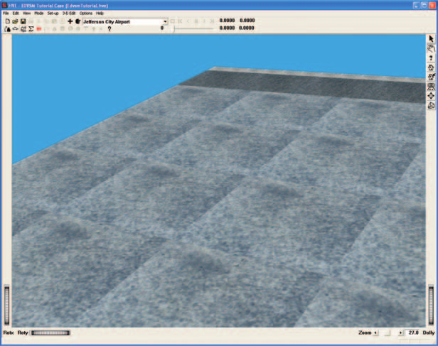

*Figure 5-7: 3-D Environment used for our EDVSM tutorial.*

### Saving the Case

Now that we've created all the objects (*vehicle* and *environment*) for our case, let's save the case file.

- Click on the *File* menu and choose *Save*. The Save-as File Selection dialog is displayed.

> **NOTE:** The Save-as dialog is displayed because the case has not been saved previously, so we need to enter a filename.

- In the Case Title text field, replace Untitled with `EDVSM Tutorial Case`.

> **NOTE:** The Case Title is displayed as a heading on all printed output reports.

- Place the mouse cursor in the Filename text field and enter `EdvsmTutorial`.
- Click *SAVE*. The current case data are saved in the `hve/supportFiles/case` subdirectory.

> **NOTE:** Saving the file occasionally is a highly recommended practice.

## Creating the Events

As mentioned at the outset of the tutorial, our EDVSM tutorial includes several events. The first event is a curb-tripped rollover prepared as part of the EDVSM validation project. The next four events simply use the first event, and introduce a blow-out at each of the four tires.

### Rollover Validation Event

To create the rollover event, perform the following steps:

- Choose Event Mode. The Event Editor is displayed.
- Click on *Add New Object*. The Event Information dialog is displayed.
- Select *Ford Bronco II, Loaded* from the Active Vehicles list.
- Select *EDVSM* from the *Calculation Method* options list.
- Enter a name for the event, `Curb-tripped Rollover`.

> **NOTE:** HVE will append the name of the calculation method to the event name, thus the complete event name will become "EDVSM, Curb-tripped Rollover."

- Press *OK* to display the event editor.

Now, we're ready to set up the first event.

- Using the Event Editor dialog, select *Ford Bronco II, Loaded* from the Event Humans & Vehicles list, then choose *Set-up* from the menu bar and select *Position/Velocity*. The Ford Bronco is displayed at the earth-fixed origin.
- If the Bronco is not visible in the viewer, use the *Dolly* thumb wheel to dolly back until the Bronco becomes visible. Then, pan the viewer until the vehicle is in the center of the viewer, and dolly back in (a good exercise in using viewers!).
- Click on the vehicle's X-Y manipulator (see Figure 5-8), wait for it to turn bright yellow (indicating it has been selected), and drag it to its initial position, X=`123` ft, Y=`0` ft. Its initial heading angle is 0 degrees and need not be modified.

> **NOTE:** Be sure to keep the mouse button depressed while you drag the manipulators.

> **NOTE:** Adjust the viewer by dollying back (using the Dolly thumb wheel) until you can see enough of the entire scene.

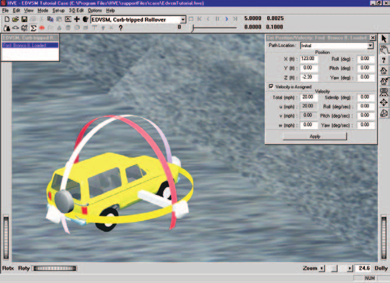

*Figure 5-8: Vehicle positioning using the HVE Event Editor. The manipulators can be used to drag and drop the vehicle into position.*

> **NOTE:** To select the X-Y manipulator, the viewer must be in Pick mode, as indicated by the highlighted arrow in the upper right corner of the viewer (see Figure 5-8).

> **NOTE:** If you can't position the vehicle at the exact coordinates, simply enter them in the dialog (in fact, it's often easier to directly enter the coordinates using the dialog).

- Click the *Velocity Is Assigned* checkbox. Enter the initial velocity, `20` mph.

> **NOTE:** Remember to press Apply or \<Enter\> after entering a value; otherwise the value is not assigned!

The vehicle initial conditions are now established. Let's enter the driver controls. The steering inputs were obtained from the validation study [reference 4]. However, the throttle, brake and gear selection were not documented in the study and were determined by repeated adjustments until the correct vehicle acceleration was achieved.

#### Steering Input

To enter the steer angles, perform the following steps:

- Click on the Set-up Menu, select *Driver Controls*. The Driver Controls dialog is displayed with an empty steer table.
- Click on the *Table* option list and choose the *At Axle* option.
- Enter the steer angles for the front wheels, as shown below:

**Table 5-1: Steer Table entries for the Ford Bronco.**

| Time (sec) | Steer Angle at Axle (deg), Right Front | Steer Angle at Axle (deg), Left Front |
|---|---|---|
| 0.00 | 0.00 | 0.00 |
| 7.42 | 0.20 | 0.20 |
| 7.97 | 1.19 | 1.19 |
| 8.63 | 3.50 | 3.50 |
| 10.21 | 4.00 | 4.00 |
| 12.00 | 4.00 | 4.00 |

The steering table is now ready for our event.

#### Throttle Input

To enter the throttle table, perform the following steps:

- Click on the Driver Controls dialog's *Throttle* tab. The Throttle Table is displayed.
- Click on the *Table* option list and choose the *Wide-open Throttle* option.
- Enter the throttle position, as shown below.

**Table 5-2: Throttle Table entries for the Ford Bronco.**

| Time (sec) | Throttle Position (Percent WOT) |
|---|---|
| 0.00 | 0.78 |
| 5.30 | 0.78 |
| 7.50 | 0.60 |
| 10.30 | 0.57 |
| 10.40 | 0.00 |

The throttle table is now ready for our event.

#### Gear Selection Input

To enter the gear selection, perform the following steps:

- Click on the Driver Controls dialog's *Gear* tab. The Gear Selection Table is displayed.
- Click on the *Number of Shifts* option list and choose *1 Shift*.
- Enter the time and gear selection, as shown below:

**Table 5-3: Gear Selection table entries for the Ford Bronco.**

| Time (sec) | Gear Selection |
|---|---|
| 0.00 | Shift Into 2nd |

> **NOTE:** The gear selection and throttle tables were created by trial and error as required to match the experimental and simulated velocity profiles.

#### Brake Input

To enter the brake input, perform the following steps:

- Click on the Driver Controls dialog's *Brakes* tab. The Brake Table is displayed.
- Click on the *Table Is* option list and choose Pedal *Force*.
- Enter the brake pedal force, as shown below:

**Table 5-4: Brake Table entries for the Ford Bronco.**

| Time (sec) | Brake Pedal Force (lb) |
|---|---|
| 10.30 | 0.00 |
| 10.40 | 10.75 |

- Press *OK* to accept the driver control tables.

The driver control inputs are now complete.

#### Simulation Controls

This event lasts more than 5 seconds. To prevent premature termination, let's increase the default maximum simulation time.

- Click on the Options menu and choose *Simulation Controls*. The Simulation Controls dialog is displayed.
- Edit the *Maximum Time*, changing it from `5` to `15` seconds.
- Press *OK* to update the simulation controls.

#### Calculation Options

In this event, we intend to simulate the rollover of a vehicle where the body of the vehicle may contact the ground. We need to activate the *Vehicle Body vs. Environment Contact* subroutine by checking the *Vehicle Body vs. Environment Contact* checkbox in the Calculation Options dialog (see the [EDVSM Calculation Options reference](../../10-calculation-options/CalcOptEDVSM.md) for a description of all EDVSM calculation options).

- Click on the Options menu and choose *Calculation Options*. The Calculation Options dialog is displayed.
- Click the checkbox for *Vehicle Body vs. Environment Contact*.
- Press *OK* to update the calculation options.

#### Key Results

Let's look at some Key Results during execution:

- If the Key Results window is not displayed, choose *Show Key Results* from the Options menu.
- Drag the Key Results window to a convenient location, where it does not block the view but still allows access to the viewer thumb wheel controls (in case we want to change the view).
- Click on *Select Variables* in the *Ford Bronco II, Loaded* Key Results window. The Variable Selection dialog for *Ford Bronco II, Loaded* is displayed.

The vehicle kinematics are already selected. Let's add *Tire Fx', Fy', Fz'* and *Steer Angle* to the Key Results window:

- Click *Tires, Axle 1, Right, Outer* from the variable group list. The Variable Selection list for the right front tire is displayed (see Figure 5-9).

> **NOTE:** For calculation methods that support dual-tired vehicles, you can select the 'Inner' or 'Outer' tire; however, EDVSM does not support dual tires.

- Select *Fx', Fy', and Fz'* tire forces from the list.

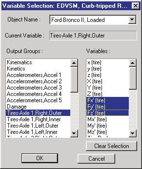

*Figure 5-9: Key Results Variable Selection dialog, used for selecting variables to be displayed in the Key Results window.*

- Repeat the above steps by choosing the tire forces for the left front, right rear and left rear tires.

Now, let's add the wheel steer angles to our Key Results window:

- Click *Wheels, Axle 1, Right* from the variable group list. The Variable Selection list for the right front wheel is displayed.
- Choose *Delta* from the Variable Selection list.
- Repeat the above steps to choose Delta for the left front wheel.
- Press *OK* to add the selected variables to the Key Results window.

Now, we're ready to execute the event.

- Using the Event Controller, click *Play* to execute the event. Allow the event to run until the vehicle strikes the curb and rolls over.

> **NOTE:** The simulation terminates with an error because the vehicle travels beyond the terrain boundary.

The EDVSM event is shown in Figure 5-10.

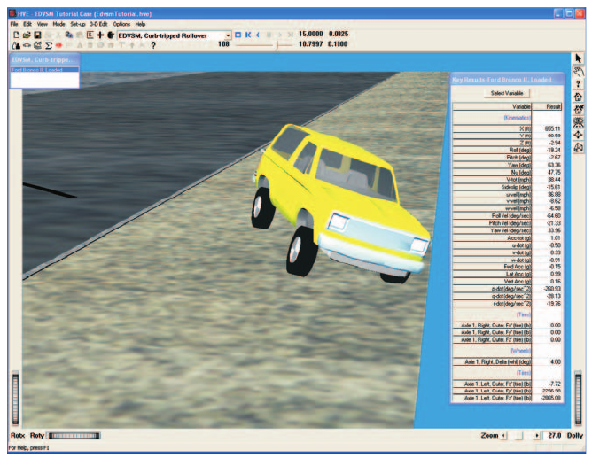

*Figure 5-10: HVE Event Editor executing the EDVSM Curb-tripped Rollover event.*

> **NOTE:** While the event is executing, watch the current results in the Key Results windows.

We have now completed the first event.

### Creating Tire Blow-out Simulations

The next four events in our Tutorial use EDVSM to study the vehicle's response to a loss of pressure at various tire locations during a cornering maneuver. In this parameter study, we will change only the wheel location at which the blow-out occurs, so any difference in vehicle response is attributable solely to the location of the blown tire. To simplify our study, we'll use the current environment.

To study the effect of a blow-out at the right front tire, perform the following steps:

- Click on *Add New Object*. The Event Information dialog is displayed.
- Select *Ford Bronco II, Loaded* from the Active Vehicles list.
- Select *EDVSM* from the *Calculation Method* options list.
- Edit the event name: `R/F Tire Blow-out`.
- Press *OK* to display the event editor.

Now, we're ready to set up (i.e., supply *position, velocity, driver controls and tire blow-out parameters*) for the right front tire blow-out event.

- Choose *Set-up* from the menu bar and select *Position/Velocity*. The Ford Bronco is displayed at the earth-fixed origin.
- Using the Position/Velocity dialog, enter the vehicle's initial position, X=`123` ft, Y=`0` ft. Its initial heading angle is 0 degrees and need not be modified.
- Click the *Velocity Is Assigned* checkbox. Enter the initial velocity, `50` mph.

The vehicle initial conditions are now established. Let's enter the driver controls. Only steering inputs need to be supplied. To enter the steer angles, perform the following steps:

- Choose *Set-up* from the menu bar and select *Driver Controls*. The Driver Controls dialog is displayed with the default steer table. The default steer table option, *At Steering Wheel*, is the option we'll use in our study.
- Enter the steering wheel angles, as shown below:

**Table 5-5: Steer Table entries for the EDVSM Blow-out Studies events. (The same table will be used for all blow-out simulation events.)**

| Time (sec) | Steer Angle at Steering Wheel (deg) |
|---|---|
| 1.00 | 0.0 |
| 1.50 | 45.0 |

- Press *OK* to accept the steer table.

Now, let's set up the HVE Tire Blow-out Model.

- Choose *Set-up* from the menu bar and select *Wheels*. The Wheels dialog is displayed with the Tire Blow-out information (see Figure 5-11).
- Click on the *Axle No.* option list and choose *Axle No. 1*. Click on the *Right* side radio button. Click in the *Tire is Blown* check box. The default blow-out parameters for the right front tire are displayed.
- Enter the *Start Time*, `3.0` seconds.
- Enter the *Duration*, `0.2` seconds.
- Enter the *Stiffness Factor*, `0.10`.

> **NOTE:** The Stiffness Factor reduces the tire's radial tire stiffness, cornering stiffness and camber stiffness.

- Enter the Rolling Resistance Factor, `10`.

> **NOTE:** The Rolling Resistance Factor increases the tire rolling resistance.

- Press *OK* to apply the tire blow-out parameters.

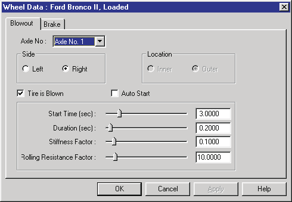

*Figure 5-11: HVE Wheels dialog with Tire Blow-out Model option.*

Now, we're ready to execute the event.

- Using the Event Controller, click *Play* to execute the event to simulate the loss of pressure at the right front tire. Allow the event to run until the simulation terminates at t = 5.00 seconds.

The EDVSM event is shown in Figure 5-12.

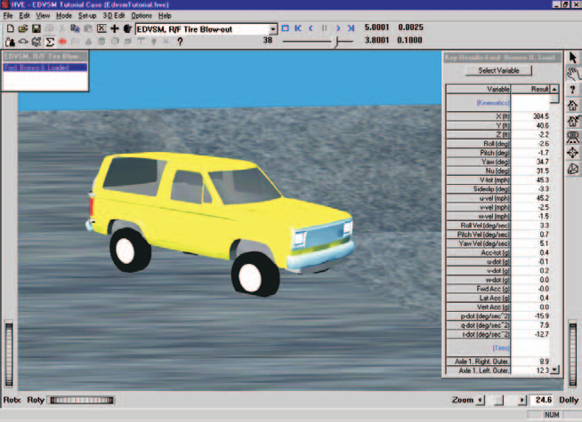

*Figure 5-12: HVE Event Editor executing the EDVSM R/F Tire Blowout simulation.*

> **NOTE:** While the event is executing, watch the current results in the Key Results windows.

To study the effect of a blow-out at the left front tire, perform the following steps:

- Click on *Add Event*. The Event Information dialog is displayed.
- Select *Ford Bronco II, Loaded* from the Active Vehicles list.
- Select *EDVSM* from the *Calculation Method* options list.
- Enter a name for the event, `L/F Tire Blow-out`.
- Press *OK* to display the event editor.

Repeat the steps used in the previous event to set up our left front tire blow-out simulation:

- Choose *Set-up* from the menu bar, select *Position/Velocity*.
- Directly enter the vehicle's initial position, X=`123` ft, Y=`0` ft. Its initial heading angle is 0 degrees and need not be modified.
- Click the *Velocity Is Assigned* checkbox. Enter the initial velocity, `50` mph.

To enter the steer angles, perform the following steps:

- Click on the *Set-up* Menu, select *Driver Controls*. The Steering Table dialog is displayed.
- Enter the steering wheel angles, as shown earlier in Table 5-5.
- Press *OK* to accept the steering table.

Now, let's set up the HVE Tire Blow-out Model.

- Choose *Set-up* from the menu bar and select *Wheels*. The Wheels dialog is displayed with the Tire Blow-out information.
- Click on the *Axle No.* option list and choose *Axle No. 1*. Click on the *Left* side radio button. Click in the *Tire is Blown* check box. The default blow-out parameters for the left front tire are displayed.
- Enter the *Start Time*, `3.0` seconds.
- Enter the *Duration*, `0.2` seconds.
- Enter the *Stiffness Factor*, `0.10`.
- Enter the Rolling Resistance Factor, `10`.
- Press *OK* to apply the tire blow-out parameters.

Now, we're ready to execute the event.

- Using the Event Controller, click *Play* to execute the event to simulate the loss of pressure at the left front tire. Allow the event to run until the simulation terminates at t = 5.00 seconds.

The EDVSM event is shown in Figure 5-13.

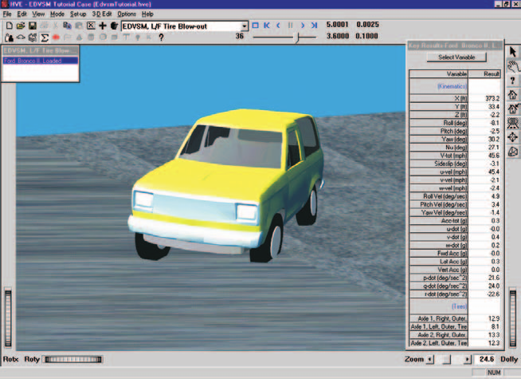

*Figure 5-13: HVE Event Editor executing the EDVSM L/F Tire Blowout simulation.*

> **NOTE:** While the event is executing, watch the current results in the Key Results windows.

To study the effect of a blow-out at the right rear tire, perform the following steps:

- Click on *Add Event*. The Event Information dialog is displayed.
- Select *Ford Bronco II, Loaded* from the Active Vehicles list.
- Select *EDVSM* from the *Calculation Method* options list.
- Enter a name for the event, `R/R Tire Blow-out`.
- Press *OK* to display the event editor.

Repeat the steps used in the previous event to set up our right rear tire blow-out simulation:

- Choose *Set-up* from the menu bar, select *Position/Velocity*.
- Directly enter the vehicle's initial position, X=`123` ft, Y=`0` ft. Its initial heading angle is 0 degrees and need not be modified.
- Click the *Velocity Is Assigned* checkbox. Enter the initial velocity, `50` mph.

To enter the steer angles, perform the following steps:

- Click on the *Set-up* Menu, select *Driver Controls*. The Steering Table dialog is displayed.
- Enter the steering wheel angles, as shown earlier in Table 5-5.
- Press *OK* to accept the steering table.

Now, let's set up the HVE Tire Blow-out Model.

- Choose *Set-up* from the menu bar and select *Wheels*. The Wheels dialog is displayed with the Tire Blow-out information.
- Click on the *Axle No.* option list and choose *Axle No. 2*. Click on the *Right* side radio button. Click in the *Tire is Blown* check box. The default blow-out parameters for the right rear tire are displayed.
- Enter the *Start Time*, `3.0` seconds.
- Enter the *Duration*, `0.2` seconds.
- Enter the *Stiffness Factor*, `0.10`.
- Enter the Rolling Resistance Factor, `10`.
- Press *OK* to apply the tire blow-out parameters.

Now, we're ready to execute the event.

- Using the Event Controller, click *Play* to execute the event to simulate the loss of pressure at the right rear tire. Allow the event to run until the simulation terminates at t = 5.00 seconds.

The EDVSM event is shown in Figure 5-14.

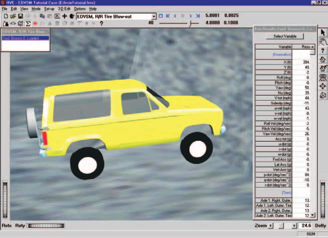

*Figure 5-14: HVE Event Editor executing the EDVSM R/R Tire Blowout simulation.*

> **NOTE:** While the event is executing, watch the current results in the Key Results windows.

To study the effect of a blow-out at the left rear tire, perform the following steps:

- Click on *Add Event*. The Event Information dialog is displayed.
- Select *Ford Bronco II, Loaded* from the Active Vehicles list.
- Select *EDVSM* from the *Calculation Method* options list.
- Enter a name for the event, `L/R Tire Blow-out`.
- Press *OK* to display the event editor.

Repeat the steps used in the previous event to set up our left rear tire blow-out simulation:

- Choose *Set-up* from the menu bar and select *Position/Velocity*.
- Directly enter the vehicle's initial position, X=`123` ft, Y=`0` ft. Its initial heading angle is 0 degrees and need not be modified.
- Click the *Velocity Is Assigned* checkbox. Enter the initial velocity, `50` mph.

To enter the steer angles, perform the following steps:

- Click on the *Set-up* Menu, select *Driver Controls*. The Steering Table dialog is displayed.
- Enter the steering wheel angles, as shown earlier in Table 5-5.
- Press *OK* to accept the steering table.

Set up the HVE Tire Blow-out Model.

- Choose *Set-up* from the menu bar and select *Wheels*. The Wheels dialog is displayed with the Tire Blow-out information.
- Click on the *Axle No.* option list and choose *Axle No. 2*. Click on the *Left* side radio button. Click in the *Tire is Blown* check box. The default blow-out parameters for the left rear tire are displayed.
- Enter the *Start Time*, `3.0` seconds.
- Enter the *Duration*, `0.2` seconds.
- Enter the *Stiffness Factor*, `0.10`.
- Enter the Rolling Resistance Factor, `10`.
- Press *OK* to apply the tire blow-out parameters.

Now, we're ready to execute the event.

- Using the Event Controller, click *Play* to execute the event to simulate the loss of pressure at the left rear tire. Allow the event to run until the simulation terminates at t = 5.00 seconds.

The EDVSM event is shown in Figure 5-15.

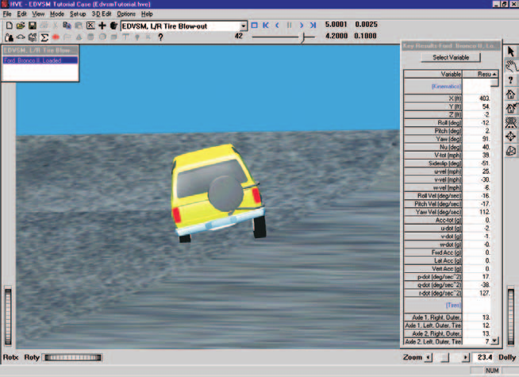

*Figure 5-15: HVE Event Editor executing the EDVSM L/R Tire Blowout simulation.*

> **NOTE:** While the event is executing, watch the current results in the Key Results windows.

We have now created four events simulating a tire blow-out. The only difference in these events is the location of the blown tire. Thus, any differences in vehicle behavior are attributable solely to the location of the blown tire.

### Observations

Note the vehicle is in a right turn, thus the vertical tire force is shifted from the right-side to the left-side tires. As a result, the left-side (outside) tires are more heavily loaded and produce a greater portion of the cornering force.

It follows, then, that a blow-out in the left-side tires should have a greater effect on vehicle handling and controllability. This fact is confirmed by the simulation results.

Note also the difference in vehicle cornering response for blow-outs at the front tires compared to the rear tires. Front tire blow-outs cause the vehicle to *tend* to maintain a straight-ahead path, or *plow*. This is generally referred to as an *understeer* characteristic. For rear tire blow-outs, the vehicle tends to become unstable and spin out. This is generally referred to as an *oversteer* characteristic. Oversteer is generally considered an undesirable characteristic, although a small tendency for oversteer is often designed into high-performance vehicles.

Spend a few minutes reviewing each event, noting how the location of the blown tire affects response. You'll find this procedure useful the next time you need to reconstruct an accident involving a tire blow-out.

It is quite instructive to look carefully at all tire forces ($F_{x'}$, $F_{y'}$, $F_{z'}$) before, during and after the blow-out to learn exactly how a blown tire affects vehicle behavior.

> **NOTE:** Look carefully; you'll see a lot of interesting phenomena taking place.

You might also find it interesting to change the amount and timing of the steering and introduce braking to observe the effect on vehicle behavior for the various blown-tire locations. The blow-out model is extremely powerful! For additional information about vehicle response to tire blow-out, see reference [8].

One final, but very important point: This tutorial involves a Ford Bronco II. This particular vehicle was selected because it was included in a rigorous validation study involving vehicle rollover [6]. In this study, the vehicle was subjected to extremely violent experimental conditions (i.e., curb-tripped impact) in an effort to induce a rollover response. The Ford Bronco II's response to these conditions, as well as to the tire blow-out simulations included in this tutorial, is substantially the same as the response of other multi-purpose vehicles.

*(updated: The original manual cited reference [7] for tire blow-out response; the correct citation in the Chapter 7 reference list is [8], Blythe, Day, Grimes, "3-Dimensional Simulation of Vehicle Response to Tire Blow-outs," SAE 980221.)*

## Viewing Results

Now that we have produced our EDVSM simulations, let's take a detailed look at the results. The Playback Editor is used for reviewing and printing reports for each event in the current case, as well as for producing video output.

EDVSM produces the following reports:

- **Messages** — A list of messages produced by the current run
- **Accident History** — A table of initial and final positions and velocities
- **Environment Data** — A list of the visual and physical environment parameters used by EDVSM
- **Vehicle Data** — A series of tables containing the vehicle data used by EDVSM, including tire blow-out information
- **Program Data** — A table containing program control information
- **Variable Output** — A table containing user-selectable, time-dependent simulation results
- **Trajectory Simulation** — A 3-D visualization of the event, displayed at a user-selectable time interval
- **Damage Profiles** — A 3-D visualization of the vehicle damage, displayed at a user-selectable time interval

To view the output reports, we need to be in Playback mode:

- Choose *Playback Mode*. The Playback Editor is displayed.

> **NOTE:** Our tutorial uses the Curb-tripped Rollover event to illustrate the procedures for viewing output reports. You can use the same procedures for viewing reports for any of the events in the case.

### Report Windows

The reports listed above are displayed by selecting Preview Windows. Each Report Window contains an individual report.

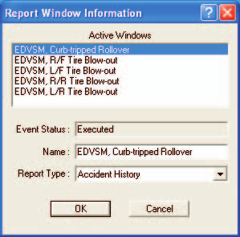

*Figure 5-16: Report Window Information dialog, showing the name of each event in the current case.*

To view the reports produced by the *EDVSM, Curb-tripped Rollover* event, perform the following steps:

- Click *Add New Object*. The Report Window Information dialog is displayed, as shown in Figure 5-16, and includes a list of the active events (*EDVSM, Curb-tripped Rollover* is the event whose output we'll review in this tutorial). The Report Window Information dialog also includes the user-editable *Report Window Name* text field and *Selected Output* option list.
- Select *EDVSM, Curb-tripped Rollover* from the Active Events list.
- Click on the *Selected Output* option list and choose any of the available reports.
- Press *OK* to display the report.

The selected report will be displayed in a resizable window. The following pages illustrate the reports produced for the *EDVSM, Curb-tripped Rollover* event.

### Messages

EDVSM produces a number of messages, depending on the outcome of the event. For a complete listing and explanation of the messages, refer to [Chapter 6](06-messages.md).

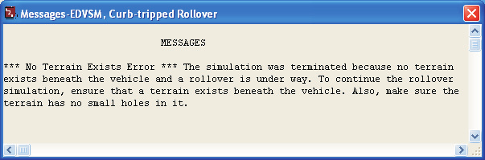

*Figure 5-17: Messages report for EDVSM, Curb-tripped Rollover.*

To view the Messages report produced by the *EDVSM, Curb-tripped Rollover* event, perform the following steps:

- Click *Add New Object*. The Report Window Information dialog is displayed, and includes a list of the active events.
- Select *EDVSM, Curb-tripped Rollover* from the Active Events list.
- Click on the *Selected Output* option list and choose *Messages*.
- Press *OK*.

The Messages report is displayed for the *EDVSM, Curb-tripped Rollover* event, as shown in Figure 5-17.

### Accident History

The Accident History report displays the time and total distance traveled, as well as the position and velocity at the start and end of the run.

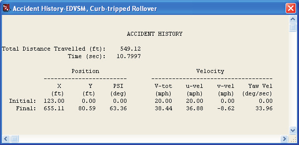

*Figure 5-18: Accident History report for EDVSM, Curb-tripped Rollover.*

To view the Accident History report for the *EDVSM, Curb-tripped Rollover* event, perform the following steps:

- Click *Add New Object*. The Report Window Information dialog is displayed.
- Select *EDVSM, Curb-tripped Rollover* from the Active Events list.
- Click on the *Selected Output* option list and choose *Accident History*.
- Press *OK*.

The Accident History report is displayed for the *EDVSM, Curb-tripped Rollover* event, as shown in Figure 5-18.

### Environment Data

The Environment Data report displays the physical and visual parameters describing the environment.

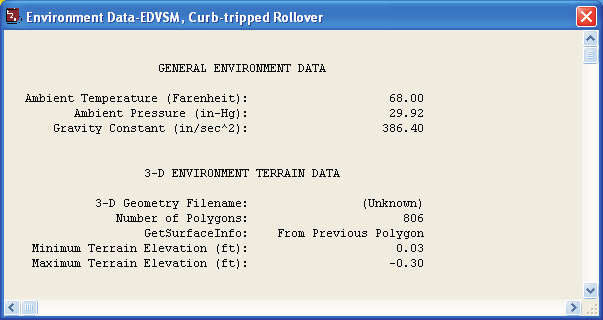

*Figure 5-19: Environment Data report for EDVSM, Curb-tripped Rollover.*

To view the Environment Data report for the *EDVSM, Curb-tripped Rollover* event, perform the following steps:

- Click *Add New Object*. The Report Window Information dialog is displayed.
- Select *EDVSM, Curb-tripped Rollover* from the Active Events list.
- Click on the *Selected Output* option list and choose *Environment Data*.
- Press *OK*.

The Environment Data report is displayed for the *EDVSM, Curb-tripped Rollover* event, as shown in Figure 5-19.

### Vehicle Data

The Vehicle Data report for EDVSM contains all the vehicle data groups (Sprung Mass, Suspension, Tire, Brake and Driver Controls).

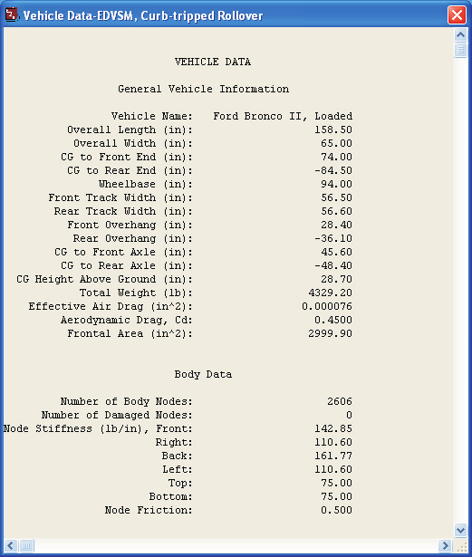

*Figure 5-20: Vehicle Data report for EDVSM, Curb-tripped Rollover.*

To view the Vehicle Data report for the *EDVSM, Curb-tripped Rollover* event, perform the following steps:

- Click *Add New Object*. The Report Window Information dialog is displayed.
- Select *EDVSM, Curb-tripped Rollover* from the Active Events list.
- Click on the *Selected Output* option list and choose *Vehicle Data*.
- Press *OK*.

A portion of the Vehicle Data report displayed for *EDVSM, Curb-tripped Rollover* is shown in Figure 5-20.

> **NOTE:** The EDVSM Vehicle Data report is too large to fit in the viewer. Use the scroll bars to view the entire report.

### Program Data

The Program Data report includes the simulation control parameters and other run-time information.

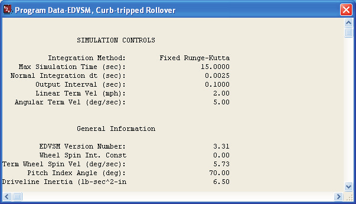

*Figure 5-21: Program Data report for EDVSM, Curb-tripped Rollover.*

To view the Program Data report for the *EDVSM, Curb-tripped Rollover* event, perform the following steps:

- Click *Add New Object*. The Report Window Information dialog is displayed.
- Select *EDVSM, Curb-tripped Rollover* from the Active Events list.
- Click on the *Selected Output* option list and choose *Program Data*.
- Press *OK*.

The Program Data report is displayed for the *EDVSM, Curb-tripped Rollover* event, as shown in Figure 5-21.

### Variable Output

The Variable Output report is a table of user-selectable, time-dependent simulation results for the current event. To view the Variable Output report for the *EDVSM, Curb-tripped Rollover* event, perform the following steps:

- Click *Add New Object*. The Report Window Information dialog is displayed.
- Select *EDVSM, Curb-tripped Rollover* from the Active Events list.
- Click on the *Selected Output* option list and choose *Variable Output*.
- Press *OK*.

The Variable Output report is displayed for the *EDVSM, Curb-tripped Rollover* event. The table is initially empty, so the next step is to select the time-dependent results we wish to display in the table.

#### Variable Selection

The purpose of our EDVSM study is to illustrate a rollover sequence. To document the resulting path, as well as some other pertinent results, let's select the CG path coordinates, velocity and acceleration from the Variable Selection dialog.

- Click on *Select Variables* in the *Ford Bronco II, Loaded* Variable Output window. The Variable Selection dialog for *Ford Bronco II, Loaded* is displayed, as shown in Figure 5-22.

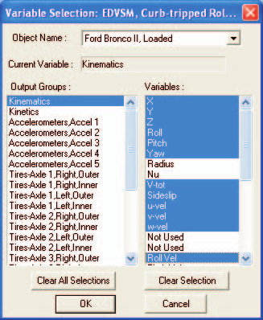

*Figure 5-22: Variable Selection dialog, used for selecting results displayed in the Variable Output table.*

The Kinematics Output group is the default selection and the Kinematics variable list is displayed. Let's add *X, Y, Yaw* and *Path Radius* to the Key Results window:

- Select *X, Y, Z, Roll, Pitch, Yaw, V-tot, Sideslip, u-vel, v-vel, w-vel, Roll Vel, Pitch Vel, Yaw Vel, Acc-tot, Fwd Acc, Lat Acc, Vert Acc, p-dot, q-dot* and *r-dot* from the list.

> **NOTE:** Feel free to add additional variables to the Variable Output window. You might be especially interested in the tire forces.

- Press *OK* to add the selected variables to the Variable Output table.

The Variable Output report for the *EDVSM, Curb-tripped Rollover* event now includes the selected results (see Figure 5-23).

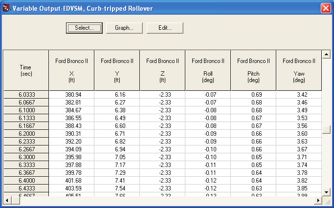

*Figure 5-23: Variable Output report for EDVSM, Curb-tripped Rollover, displaying the selected results.*

### Trajectory Simulation

Let's display a trajectory simulation for this event. To view the Trajectory Simulation for the *EDVSM, Curb-tripped Rollover* event, perform the following steps:

- Click *Add New Object*. The Report Window Information dialog is displayed.
- Select *EDVSM, Curb-tripped Rollover* from the Active Events list.
- Click on the *Selected Output* option list and choose *Trajectory Simulation*.
- Press *OK*.

The Trajectory Simulation viewer is displayed for the *EDVSM, Curb-tripped Rollover* event (see Figure 5-24). The viewer shows the vehicle at its initial position.

To visualize the motion, perform the following steps:

- Click *Play* (single right-arrow). The simulation begins and is displayed at the current Playback output interval.
- Click *Pause*. The simulation stops.
- Click *Reverse* (single left-arrow). The simulation plays in reverse.
- Click *Pause*. The simulation stops.
- Click *Rewind* (left arrow with bar). The simulation returns to the start.
- Click *Advance to End* (right arrow with bar). The simulation advances to the end of the run.

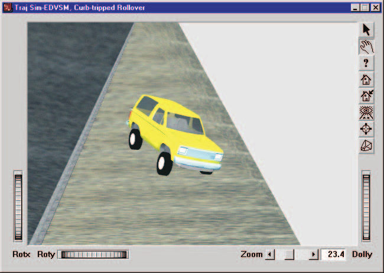

*Figure 5-24: Trajectory Simulation for EDVSM, Curb-tripped Rollover, displaying the vehicle at the moment of rollover.*

### Damage Profiles

Finally, let's display the damage profile simulation for the event. To view the Damage Profiles for the *EDVSM, Curb-tripped Rollover* event, perform the following steps:

- Click *Add New Object*. The Report Window Information dialog is displayed.
- Select *EDVSM, Curb-tripped Rollover* from the Active Events list.
- Click on the *Selected Output* option list and choose *Damage Profiles*.
- Press *OK*.

The Damage Profiles simulation viewer is displayed for the *EDVSM, Curb-tripped Rollover* event (see Figure 5-25). The vehicle is displayed in its initial condition. To visualize the damage to the vehicle, use the Event Controller in the same manner as for the Trajectory Simulation.

> **NOTE:** Because the Trajectory Simulation enables the Event Controller, you must have a Trajectory Simulation open for this event in order to "play" the Damage Profile.

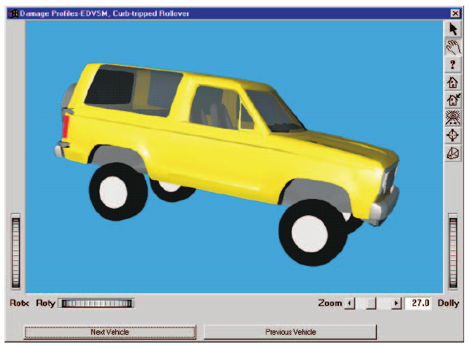

*Figure 5-25: Damage Profile for EDVSM, Curb-tripped Rollover, displaying the vehicle at the end of the simulation.*

### Printing

The final step is to print the above reports. Printing reports is simple. All you do is choose a report and print it. For example:

- Click on the dialog header of the *Variable Output - EDVSM, Curb-tripped Rollover* report. The dialog header is highlighted and the Variable Output window pops to the top of the display (if it isn't there already), indicating it is the current window.
- Click on the *File* menu and choose *Print*. The Print dialog is displayed, allowing the user to select from several available print options.

> **NOTE:** Alternatively, you can click on the print icon in the upper menu bar.

- Press *OK*. The Variable Output report is printed on the system printer.

That's all there is to it! You can print any other report using the same three steps described above.

> **NOTE:** The Print dialog provides several options. Refer to the HVE User's Manual for more information.

> **NOTE:** The font size of both the printed reports and screen display may be edited by clicking on the Options menu and choosing Preferences. Use the Font Size option list to change the size.

<!-- NAV -->

---

← Previous: [Chapter 4 — Calculation Method](04-calculation-method.md)  |  [Index](README.md)  |  Next: [Chapter 6 — Messages](06-messages.md) →

<!-- /NAV -->
