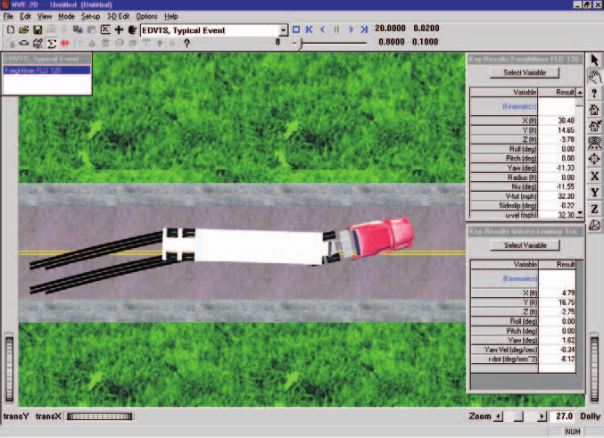

# Chapter 1 — EDVTS Program Description

## Overview

**EDVTS** (Engineering Dynamics Corporation Vehicle Trailer Simulator) is a simulation analysis of an articulated vehicle (either a passenger car pulling a standard trailer, or a commercial tractor-trailer vehicle) to driver inputs (accelerating, braking and steering). It is based on a program called TBSTT developed at the University of Michigan Transportation Research Institute [14]. EDVTS determines how the vehicle responds to the inputs by generating the path, velocity, acceleration, tire force, and other data as a function of time.

Accident investigators can use EDVTS to determine how a driver may have lost vehicular control. By repeated adjustments of the throttle, braking and steering input tables, the user will converge on those driver inputs which match accident site evidence. EDVTS can also be used to study the handling effects due to changes in vehicle weight distribution, wheelbase, track width, CG height, tire friction, cornering stiffness, hitch or kingpin location and other parameters.

An extremely useful feature of EDVTS is the ability to quickly and accurately review the results generated from different input scenarios. Termed *what if* analysis, changes can be made to an isolated variable or set of variables and the effects are displayed immediately. For example, the sensitivity of the trajectory to various front/rear tire combinations can be studied simply by changing the tire data; the sensitivity to CG location can be studied by moving its position. However, the major purpose of EDVTS can be realized by changing the driver input tables (throttle, braking and steering) until the resulting trajectory matches the actual trajectory produced by the vehicle during a particular maneuver. Thus, the user learns how a driver's inputs may have affected the outcome of an accident.

*Figure 1-1: EDVTS Event.*

## Model Inputs

EDVTS inputs include two vehicles (one tow vehicle and one trailer) and an optional environment. Event set-up parameters include vehicle initial positions and velocities, and various driver control options (steering, braking and throttle).

## Model Outputs

EDVTS output reports include Accident History, Messages, Program Data, Trajectory Simulations, Variable Output and Vehicle Data.

## Validation

The EDVTS simulation model was first validated by direct comparison with results using TBSTT. These in-house validations included a validation study in the original TBSTT research document [14].

The in-use accuracy of the program is dependent upon several factors. Because EDVTS is a 4-degree of freedom analysis (three degrees of freedom for the tow vehicle and one for the trailer), jounce and rebound suspension effects are ignored. Therefore, the program is well suited for the study of vehicle trajectories on low-friction surfaces, such as ice and snow. It also serves as an excellent first-order approximation for normally encountered road surfaces, such as dry asphalt and concrete. Good geometrical, inertial, and tire data are essential for accurate results.

**[HVE]** EDVTS has been extended and revalidated for use in the HVE environment to account for 3-D terrain. Vehicle roll and pitch angles are allowed and accounted for within the limits of the small angle assumption (normally 15 degrees). See reference 25 for further details regarding the validation of EDVTS.

## HVE-2D and HVE

EDVTS is compatible with both HVE-2D and HVE. While EDVTS has been extended and revalidated for use in the HVE environment to account for 3-D terrain (described above), EDVTS is essentially a 2-dimensional physics simulation program.

**[HVE]** If you are using EDVTS within the HVE environment, the Human, Vehicle, and Environment Editors will have additional features that are not available in HVE-2D. These features are described in great detail in the HVE User's Manual. While some dialogs do look different between HVE-2D and HVE, the required input for EDVTS is found in both. Where there are differences related to the use of EDVTS, these differences are noted in this manual. Information specific to HVE is designated with a **[HVE]** marker throughout this manual.

## Basic Procedure

The procedure for using EDVTS is substantially the same as using any simulator in the HVE environment:

- Use the Vehicle Editor to add a tow vehicle and a trailer to the case. Optionally, edit any of the default vehicle parameters.
- Optionally, use the Environment Editor to create a visual and physical environment.
- Use the Event Editor to set up and execute the EDVTS simulation model by performing the following steps:
  - Choose the tow vehicle and trailer *in that order* from the list of vehicles created earlier.
  - Choose the EDVTS calculation model.
  - Position the tow vehicle in the environment, and assign an initial velocity.
  - Optionally, edit the trailer's default position and velocity.
  - Assign driver controls (Steering, Braking, Throttle) for the tow vehicle and trailer.
- Execute the simulation event.
- Modify the initial conditions and driver inputs as required to achieve the desired match between the simulation and actual event.
- Use the Playback Editor to view the various reports and trajectory simulations. If desired, produce a video output of the simulation.

---

[Contents](README.md) | [Next: Chapter 2 — Program Input](02-program-input.md)

<!-- NAV -->

---

← Previous: [EDVTS — Vehicle-Trailer Simulator](README.md)  |  [Index](README.md)  |  Next: [Chapter 2 — EDVTS Program Input](02-program-input.md) →

<!-- /NAV -->
