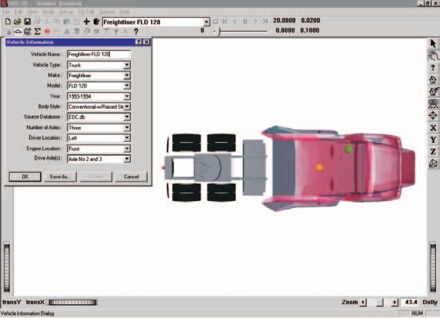
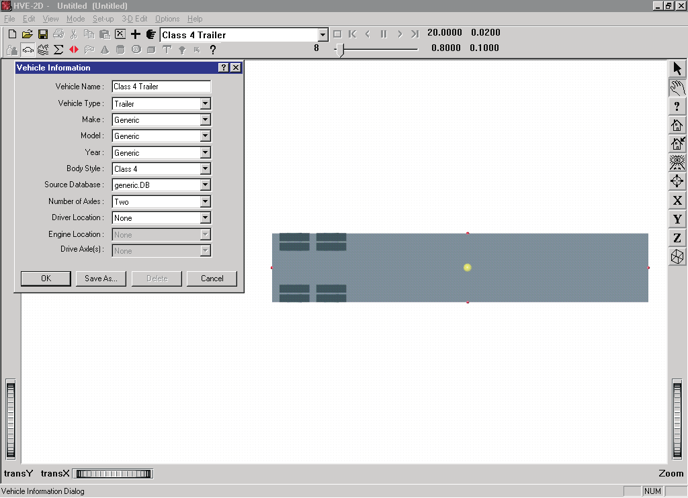
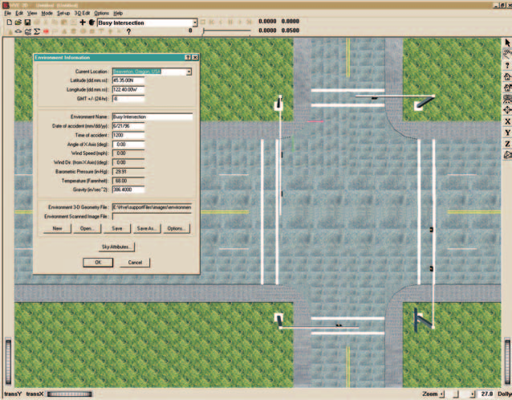
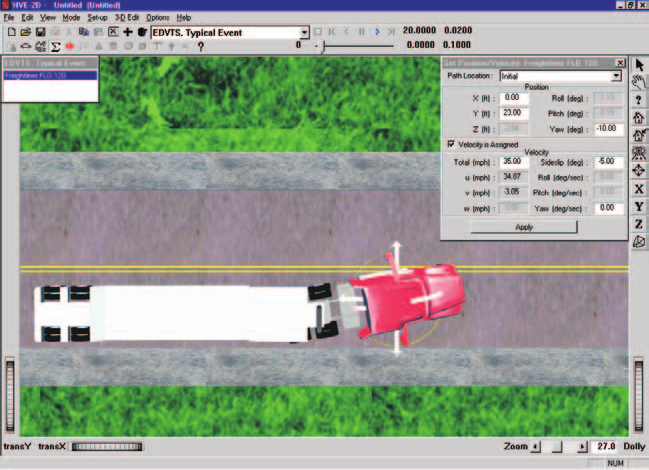
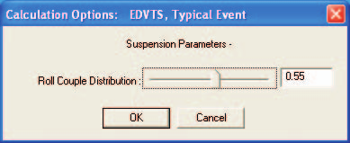
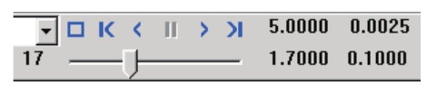

# Chapter 2 — EDVTS Program Input

This chapter defines the objects (vehicles and environment) and the event set-up parameters (positions and velocities, driver controls, and so forth) used by the EDVTS analysis. In general, the chapter is divided into the following sections:

- **Objects** — The number of vehicles and the specific vehicle parameters actually used by EDVTS.
- **Events** — The various HVE-2D options available for setting up and executing an EDVTS event.

## Objects Overview

The objects used by the EDVTS model are:

- **Vehicles** — Two vehicles (a tow vehicle and a trailer) may be studied by EDVTS.
- **Environment** — Like the *real* world, EDVTS has exactly one environment.

> NOTE: The environment is used in any HVE-compatible reconstruction or simulation model.

The following sections describe how the vehicle and environment provide the required inputs to the EDVTS calculation model.

## Vehicles

EDVTS uses two vehicles created using the Vehicle Editor (see Figures 2-1 and 2-2). Vehicles are selected from the Vehicle Database by choosing the following attributes:

- **Type** — EDVTS supports the following vehicle types: *Passenger Car, Pickup, Van, Sport-Utility, Truck, Trailer* and *Movable Barrier*.
- **Make** — EDVTS supports all available vehicle makes.
- **Model** — EDVTS supports all available vehicle models, within the limits defined by number of axles and drive axles; see below.
- **Year** — EDVTS supports all available vehicle years.
- **Body Style** — EDVTS supports all available vehicle body styles.

Each vehicle also has the following additional user-editable parameters:

- **Driver Location** — The *Driver Location* is not used by EDVTS. However, *Driver Location* must not be *None*; otherwise, the Driver Controls (Steering, Throttle, Brakes) will not be available during Event mode.
- **Engine Location** — The Engine Location is not used by EDVTS. However, Engine Location must not be *None*; otherwise, the Throttle Table will not be available during Event mode.
- **Number of Axles** — EDVTS supports 2- and 3-axled tow vehicles and 1- and 2-axled trailers.
- **Drive Axle(s)** — EDVTS supports all drive axles.

To add a vehicle to the current HVE case, perform the following steps:

- Choose Vehicle Mode. The Vehicle Editor is displayed.
- Choose *Add New Object*. The Vehicle Information dialog is displayed.
- Click on the *Type, Make, Model, Year* and *Body Style* option buttons to select a vehicle from the database.
- If desired, modify the *Driver Location, Engine Location, Number of Axles* and *Drive Axle(s)* for the current vehicle.
- Enter a name for the current vehicle. A default name is supplied for each selected vehicle. Its name is user-editable, and does not affect calculations.

> NOTE: Duplicate vehicle names are not allowed in the same case.

- Click *OK* to add the vehicle to the current case.

*Figure 2-1: HVE-2D Vehicle Editor, adding a tow vehicle to the current case.*

*Figure 2-2: HVE-2D Vehicle Editor, adding a trailer to the current case.*

The following Vehicle Parameter groups are used by EDVTS:

- Sprung Mass
  - Inertias
  - Move CG
  - Inter-vehicle Connections
- Unsprung Mass
  - Wheel Location
  - Tire Data
  - Suspension Data
  - Brake Data
- Steering System

> NOTE: The Exterior Data Group (Overall Dimensions, Structural Stiffness Coefficients), Brake System and Drivetrain are not used by EDVTS.

The specific data used in each of the above parameter groups are defined in Tables 2-1 through 2-3.

### Sprung Mass

The Sprung Mass parameters are shown in Table 2-1. Information on each group is provided below.

**Table 2-1: Vehicle Sprung Mass Parameters Used By EDVTS**

| Parameter | Description |
|---|---|
| Weight | Total vehicle weight |
| Total Yaw Inertia | Total rotational inertia about the vehicle-fixed z axis |
| Move CG (x, y, z) | Relocates the CG in the vehicle-fixed x, y and z directions. This entry causes an automatic adjustment of all vehicle coordinate-related parameters (e.g., contact surface, belt anchor points). |
| Connection x,z | Vehicle-fixed location of the connection |
| Connection Friction, Radius and Maximum Articulation Angle | Connection properties |

#### Inertias

EDVTS uses the total vehicle weight (converted to mass according to the current gravitational constant; see Environment), and the total yaw rotational inertia.

The total weight is used because it is the value traditionally obtained from data sources. Because EDVTS does not have separate degrees of freedom for the unsprung masses, the Total Yaw Moment of inertia used by EDVTS is the sum of the sprung mass yaw inertia plus the additional yaw inertia created by the individual wheels. See also EDVTS Output, Vehicle Data report.

#### Move CG

Move CG is not directly used by EDVTS. Its current value does not show up in the results. However, the Move CG fields may be used to quickly move the vehicle's center of gravity; the x and z coordinates for the wheels are updated to reflect the new CG location.

**[HVE]** If using HVE, the CG may also be relocated in the vehicle-fixed y direction.

#### Geometry File

The Geometry File is not used by EDVTS.

#### Inter-vehicle Connections

Inter-vehicle Connection parameters define the type, location and properties of the front and rear vehicle connections. The x,z location is specified relative to the vehicle CG. The z coordinates for each vehicle determine the elevation at the connection point, and thus establish the pitch angle of the trailer.

The Connection Friction, Radius and Maximum Articulation Angle are only supplied for rear connections.

> NOTE: Every trailer will have a pre-defined front connection. However, not every tow vehicle has a pre-defined rear connection. Use the Vehicle Editor to confirm the vehicle has a connection.

> NOTE: If no connection is supplied, EDVTS cannot be executed; a message will be displayed during Event Set-up.

> NOTE: Be sure both vehicles have the proper connections (Hitch/Ball or King Pin/Fifth Wheel). If the connections are not compatible, or if connections are not supplied, a message will be issued during Event Set-up.

> NOTE: The connection elevation above ground must also be the same for the tow vehicle and the trailer. Otherwise, the vehicle will accelerate or decelerate on level ground (the 2-D equations of motion have no way of knowing how to handle non-normal tire forces).

### Unsprung Mass

The Unsprung Mass parameters used by EDVTS are shown in Table 2-2. Information on each group is provided below.

**Table 2-2: Vehicle Unsprung Mass, Brake and Tire Parameters Used By EDVTS**

| Parameter | Description |
|---|---|
| Wheel Location | Vehicle-fixed x,y,z coordinates for each wheel |
| Anti-lock Effectiveness | The percentage of gain in longitudinal braking force due to anti-lock |
| Tire Unloaded Radius | Tire radius in unloaded condition (editable in HVE) |
| Tire Friction Table, Test Load/Speed | The load and speed for a given set of friction results (EDVTS uses the middle load and middle speed) |
| Peak Longitudinal Friction, Slide Friction, Slip at Peak Friction and Longitudinal Stiffness | Tire frictional properties |
| Friction In-use Factor | Multiplier for Longitudinal and Slide Friction |
| Cornering Stiffness | Tire lateral force per unit of tire lateral slip for small amounts of lateral slip |
| Cornering Stiffness In-use Factor | Multiplier for Cornering Stiffness |

#### Wheel Location

Although HVE-2D provides values for the vehicle-fixed x,y,z coordinates of each wheel, EDVTS uses only the following parameters:

- **Tow Vehicle** — $a$, the distance from the CG to the front axle; $b$, the distance from the CG to the rear axle; $tw_f$, the front track width; $tw_r$, the rear track width, and $z_w$, the vertical distance from the CG to the wheel (for each wheel).
- **Trailer** — $d$, the distance from the CG to the rear axle; $tw_r$, the rear track width, and $z_w$, the vertical distance from the CG to the wheel (for each wheel).

> NOTE: For Tandem rear suspensions, the average track width of the two axles is used.

> NOTE: EDVTS uses the average $x_{wheel}$ for the front wheels to calculate $a$ and the average $x_{wheel}$ for the rear wheels to calculate $b$. Similarly, EDVTS uses the total distance between right-side and left-side tires to calculate track width. Bilateral symmetry is initially assumed. Finally, EDVTS uses $z_{wheel}$ and the tire radius (see Tire Parameters) to calculate CG elevation above ground.

**[HVE]** NOTE: In HVE, tire radius is user-editable.

#### Brake

EDVTS uses the wheel brake system Antilock Effectiveness. The specific parameters used by EDVTS are shown in Table 2-2.

#### Tire

The HVE tire parameters provide the following data groups:

- Physical Data
- Friction Table
- Cornering Stiffness Table
- Slip-vs Rolloff Table

EDVTS's use of these parameters is described below.

#### Physical Data

The Tire Physical Data used by EDVTS are shown in Table 2-2. The tire's unloaded radius is used to establish the vehicle's CG elevation. Other physical data parameters are not used.

**[HVE]** In HVE, tire unloaded radius is user-editable.

#### Friction Data

The Friction Data used by EDVTS are shown in Table 2-2. EDVTS uses both Peak and Slide Friction values.

**[HVE]** The EDVTS tire model does not incorporate load- or speed-dependence. If friction data for more than one load or speed are supplied, EDVTS uses the friction parameters for the middle load and/or speed.

> NOTE: If any doubt exists about which value is actually used by the EDVTS tire model, you can check the Vehicle Data output report.

**[HVE]** The *In-use Factor* is a convenient way to reduce or increase the dependent friction values (peak and slide friction) by making just one adjustment.

#### Cornering Stiffness Data

The Cornering Stiffness data used by EDVTS are shown in Table 2-2.

**[HVE]** EDVTS does not use the $F_y$ vs Slip Angle table, but instead uses the cornering stiffness parameter directly. If cornering stiffness data for more than one load or speed are supplied, EDVTS uses the parameters for the middle load and/or speed.

> NOTE: If any doubt exists about which value is actually used by the EDVTS tire model, you can check the Vehicle Data output report.

**[HVE]** Cornering Stiffness *In-use Factor* is a convenient way to reduce or increase the dependent cornering stiffness values for all speeds and loads by making just one adjustment.

> NOTE: If you are simulating a vehicle with a flat tire, you'll probably want to reduce the In-use Factor to about 0.1.

#### Slip vs Rolloff Table

EDVTS uses the longitudinal Slip vs Rolloff Table. Lateral rolloff is not used.

#### Suspension

The HVE-2D Suspension Model provides the following data groups:

- Inter-tandem Load Transfer

EDVTS supports all suspension types, including those with tandem axles. However, the suspension at each wheel is not modeled, per se. Rather, *roll couple distribution* (see Event Editor, Calculation Options) is used.

**Table 2-3: Vehicle Suspension and Steering Parameters Used By EDVTS**

| Parameter | Description |
|---|---|
| Inter-tandem Axle Load Transfer | Rear-to-front inter-axle load transfer due to braking of tandem axles |
| Steering Gear Ratio | Ratio of the angle at the steering wheel to the angle at the wheel |

#### Inter-tandem Axle Load Transfer

If three axles are supplied for the vehicle, the vehicle is assumed to have tandem rear axles. In this case, a longitudinal load transfer due to braking may be simulated by supplying an Inter-tandem Load Transfer Coefficient.

Studies have shown the value of -0.38 to be representative of typical four spring suspension systems [4]. The negative sign indicates load transfer from the front to the rear axle.

The value for walking beam suspensions with 100% torque rod effectiveness is 0.0 [14]. For non-perfect torque rods with effectiveness less than 100%, the load transfer is:

$$\left(\frac{AAA}{R}\right)\left(\frac{100 - T_e}{100}\right)$$

where:

| Symbol | Meaning |
|---|---|
| $AAA$ | inter-tandem dimension |
| $R$ | tire radius |
| $T_e$ | torque rod efficiency |

### Exterior

The Vehicle Exterior Data (Exterior Dimensions, Stiffness) are not used by EDVTS.

### Steering System Data

EDVTS uses the steering gear ratio if the *At Steering Wheel* Steering Table option is used during Event set-up (see Table 2-3). Otherwise, the steering system data are not used by EDVTS.

### Brake System Data

The Brake System data are not used by EDVTS.

## Environment

EDVTS uses the environment created by the Environment Editor (see Figure 2-3). The environment is created by defining the following groups of attributes:

- Visual Data
- Physical Data

*Figure 2-3: Environment Editor.*

### Creating an Environment

To add an environment to the current HVE case, perform the following steps:

- Choose Environment Mode. The Environment Editor is displayed.
- Choose *Add New Object*. The Environment Information dialog is displayed.
- Click on the *Location* combo box to select the desired city, state and country, and associated *Latitude*, *Longitude* and *GMT*.
- Edit the *Time* and *Date* for the event.
- Edit the *Angle of the X axis, Wind Speed* and *Direction*, *Barometric Pressure* and *Temperature* for the event.
- Edit the *Gravity Constant* for the event.
- Edit the environment name. A default name is supplied for the current environment. The name is user-editable, and does not affect calculations.
- Click *OK* to add the environment to the current case.

### Visual Data

The following visual parameters may be edited:

- **Environment Location** — A database containing the name (City/State/Country), Latitude and Longitude and GMT for the selected location.
- **Time and Date** — The local standard time and date for the event.

The visual data are not used by the event; they are provided for studies related to visibility at the time of an event (e.g., avoidability of an accident).

> NOTE: The visual data (Location, Time, Date and Angle of earth-fixed X axis) affect the lighting of the event! Depending on your view (Camera Position) the scene may be shaded and difficult to see. If the time is after sundown, the view will be dark.

### Physical Data

The Physical Data groups are:

- Angle of X Axis
- Wind Speed and Direction
- Atmospheric Temperature and Pressure
- Gravity Constant
- Surface Geometry

The specific physical environment data used by EDVTS are described below; see also Table 2-4.

**Table 2-4: Environment Model Parameters Used By EDVTS**

| Parameter | Description |
|---|---|
| Gravitational Constant | Local gravitational constant |
| 3-D Surface Geometry (Friction Factor, Elevation, Slope) | The polygon database used to create the 3-D environment |

#### Angle Of X Axis

The angle of the X axis is used to position the earth-fixed coordinate system on the surface of the earth.

> NOTE: The angle is specified relative to true north. If you are using a compass to determine direction at the scene of an accident, you should provide a correction factor before entering this angle.

> NOTE: The angle of the X axis affects how you visualize an EDVTS event because it affects the location of the sun.

#### Wind Speed and Direction

Wind Speed and Direction are not used by EDVTS.

#### Atmospheric Temperature and Pressure

Atmospheric temperature and pressure are not used by EDVTS.

#### Gravity Constant

The gravity constant converts mass to force. An object's mass and rotational inertias are properties that are the same throughout the universe; however the weight of an object is dependent on the local gravitational constant.

#### Surface Geometry

The Surface Geometry is used by the tire model in EDVTS to calculate the friction multiplier for the current X,Y position of the tire.

**[HVE]** In HVE, it is also used to calculate the elevation and slope.

**[HVE]** If the elevation changes result in a vehicle roll or pitch that exceeds the allowable angle, EDVTS will terminate and report an error condition (Excessive Roll or Pitch Angle). See [Chapter 6 — Messages](06-messages.md) for more information.

## Event

EDVTS uses the Event Editor (see Figure 2-4) to create, set up and execute an event. Each of these topics is described below.

### Creating an Event

An EDVTS event is created using the Event Information dialog.

To create an EDVTS event:

- Choose Event Mode. The Event Editor is displayed.
- Choose *Add New Object*. The Event Information dialog is displayed.
- Select the tow vehicle from the Active Vehicles list.
- Select the trailer from the Active Vehicles list.

> NOTE: HVE creates the vehicle train in the order the vehicles are selected. Therefore, the vehicles must be selected in the correct order.

- Select the calculation model, *EDVTS*, from the Calculation Model options list.
- Enter an event name. A default name is supplied for the selected event. The name is user-editable, and does not affect calculations.

> NOTE: Duplicate event names are not allowed in the same case.

- Click *OK* to create the EDVTS event.

> NOTE: If you choose a vehicle that is not compatible with EDVTS, or if the tow vehicle connections are incompatible with the trailer, a message will be displayed describing the problem. You will not be allowed to proceed until EDVTS-compatible objects are selected.

### Setting Up an Event

EDVTS uses the following *event set-up* options:

- Position/Velocity
- Driver Controls
- Payload Data

The specific Event Set-up data used by EDVTS are defined in Table 2-5.

*Figure 2-4: HVE-2D Event Editor, setting up and executing an EDVTS event.*

**Table 2-5: Event Set-up Parameters Used by EDVTS**

| Parameter | Description |
|---|---|
| Vehicle Initial Position | The earth-fixed X,Y coordinates and heading angle of the tow vehicle, and the articulation angle of the trailer, at the start of the simulation |
| Vehicle Initial Velocity | The forward and lateral linear velocities, and the yaw and articulation angular velocities at the start of the run |
| Driver Controls, Steer Table | Steer Table Option: Steering Wheel Angle vs Time or Tire Steer Angle vs Time |
| Driver Controls, Brake Table | Brake Table Option: Wheel Force vs Time or Percent Available Friction vs Time |
| Driver Controls, Throttle Table | Throttle Table Option: Wheel Force vs Time or Percent Available Friction vs Time |
| Payload Data | Payload Exists option; Payload vehicle-fixed x,y,z coordinates; Payload Weight, Yaw Inertia |

#### Position/Velocity

Like all simulations, EDVTS requires initial positions and velocities to be supplied by the user.

The tow vehicle is positioned relative to the earth-fixed coordinate system by supplying the X,Y,Z coordinates of its CG, and roll ($\Phi$), pitch ($\Theta$) and yaw ($\Psi$) angles about vehicle x, y and z axes, respectively.

> NOTE: In HVE-2D, Z is equal to the CG height above ground, and roll and pitch are equal to 0.0.

**[HVE]** NOTE: In HVE, Z, roll and pitch are supplied automatically by AutoPosition.

The trailer is positioned relative to the tow vehicle by supplying the initial articulation angle, $\gamma$. The default articulation angle is 0.0 degrees.

The tow vehicle linear velocities are supplied in the form of a total velocity and sideslip angle.

> NOTE: The vehicle-fixed u (forward) and v (side) velocity components are calculated using the total velocity and sideslip angle. Vertical velocity is set to zero.

The trailer articulation angular velocity is assigned relative to the tow vehicle.

#### Driver Controls

EDVTS uses the following Driver Controls:

- **Steering** — A table of steering inputs as a function of time. The *At Steering Wheel* and *At Axle* options are supported.
- **Braking** — A table of braking inputs as a function of time. The *Wheel Force* and *Percent Available Friction* options are supported.
- **Throttle** — A table of throttle inputs as a function of time. The *Wheel Force* and *Percent Available Friction* options are supported.

The Driver Controls Data used by EDVTS are shown in Table 2-5.

##### Brake

Typical values for non-braking rolling resistance for passenger car tires are provided below for reference in Table 2-7 [11]. These values should be entered in the Driver Controls - Brakes dialog using the Percent Available Friction option.

Representative values for locked-wheel (slide) friction coefficients for passenger car tires on a variety of surfaces are also provided, in Table 2-8 [10]. While the table is very complete, EDC makes no claim as to the accuracy of the data. The user is urged to perform thorough research in order to supply EDVTS with the best possible data.

**Table 2-7: Rolling Resistance Braking Inputs for Pavement [11]**

| Tire/Wheel Condition | % Available Friction |
|---|---|
| Normal Inflation | $0.010/\mu$ |
| Partial Inflation | $0.013/\mu$ |
| Damaged | 0.0 to 1.0 |
| Engine Braking — High Gear | $0.150/\mu$ to $0.200/\mu$ |
| Engine Braking — Low Gear | $0.200/\mu$ to $0.400/\mu$ |

**Table 2-8: Tire-Ground Friction Coefficients on Various Surfaces [10]**

| Surface | Dry <30 mph | Dry >30 mph | Wet <30 mph | Wet >30 mph |
|---|---|---|---|---|
| Portland Cement — New, Sharp | 0.80 - 1.20 | 0.70 - 1.00 | 0.50 - 0.80 | 0.40 - 0.75 |
| Portland Cement — Traveled | 0.60 - 0.80 | 0.60 - 0.75 | 0.45 - 0.70 | 0.45 - 0.65 |
| Portland Cement — Polished | 0.55 - 0.75 | 0.50 - 0.65 | 0.45 - 0.65 | 0.45 - 0.60 |
| Asphalt or Tar — New, Sharp | 0.80 - 1.20 | 0.65 - 1.00 | 0.50 - 0.80 | 0.45 - 0.75 |
| Asphalt or Tar — Traveled | 0.60 - 0.80 | 0.55 - 0.70 | 0.50 - 0.80 | 0.45 - 0.75 |
| Asphalt or Tar — Polished | 0.55 - 0.75 | 0.45 - 0.65 | 0.45 - 0.65 | 0.40 - 0.60 |
| Asphalt or Tar — Excess Tar | 0.50 - 0.60 | 0.35 - 0.60 | 0.30 - 0.60 | 0.25 - 0.55 |
| Gravel — Packed, Oiled | 0.55 - 0.85 | 0.50 - 0.80 | 0.40 - 0.80 | 0.40 - 0.60 |
| Gravel — Loose | 0.40 - 0.70 | 0.40 - 0.70 | 0.45 - 0.75 | 0.45 - 0.75 |
| Cinders — Packed | 0.50 - 0.70 | 0.50 - 0.70 | 0.65 - 0.75 | 0.65 - 0.75 |
| Rock — Crushed | 0.55 - 0.75 | 0.55 - 0.75 | 0.55 - 0.75 | 0.55 - 0.75 |
| Ice — Smooth | 0.10 - 0.25 | 0.07 - 0.20 | 0.05 - 0.10 | 0.05 - 0.10 |
| Snow — Packed | 0.30 - 0.55 | 0.35 - 0.55 | 0.30 - 0.60 | 0.30 - 0.60 |
| Snow — Loose | 0.10 - 0.25 | 0.10 - 0.20 | 0.30 - 0.60 | 0.30 - 0.60 |

#### Damage Profile

The Damage Profile Data are not used by EDVTS.

#### Payload

The Payload Data used by EDVTS include the payload coordinates relative to the vehicle's CG, the payload mass and yaw inertia.

> NOTE: Payload positioning is relative to the vehicle CG, not the rear suspension.

> NOTE: You must select the trailer before adding a payload. Placing the payload on the tow vehicle has no effect.

### Simulation Controls

EDVTS uses the current simulation control parameters in the Simulation Controls dialog (see Options Menu, Simulation Controls). The Simulation parameters used by EDVTS are shown in Table 2-6.

> NOTE: The output time interval should be an even multiple of the vehicle trajectory integration timestep. For example, if the integration timestep is 0.02, the output interval might be 5 x 0.02, or 0.10.

**Table 2-6: Simulation Control Parameters Used by EDVTS**

| Parameter | Description |
|---|---|
| Vehicle Trajectory Integration Timestep | The integration timestep used by the numerical integration routine |
| Output Interval | The timestep used to send output results back to HVE |
| Maximum Simulation Time | Maximum length of the run |
| Min Linear Velocity | The linear velocity used to terminate the run (if the linear and angular velocities are simultaneously less than these termination velocities, the run terminates) |

### Calculation Options

*(updated: The printed manual described two calculation options — Roll-Couple Distribution and GetSurfaceInfo — set through an EDVTS Calculation Options dialog. In the current version, **EDVTS does not present a Calculation Options dialog** (`Vtsinput.cpp` sets `CalcOptionsDlgIsUsed = FALSE`). The Roll Couple Distribution value is taken directly from the tow vehicle's suspension data (Vehicle Editor → Suspension Parameters; `Suspension.RollCoupleDist`, default 0.55), not from a per-event option. The terrain surface-search method (GetSurfaceInfo) is selected in the separate Get Surface Information Options dialog on the Options menu.)*

*Figure 2-5: The Calculation Options dialog shown in the original printed manual. This dialog is no longer presented for EDVTS; the roll-couple value now comes from the vehicle's suspension data.*

**Roll Couple Distribution** describes the ratio of lateral load transferred between the front and rear suspensions during cornering. This distribution depends directly on the characteristics of the front and rear suspension systems and chassis stiffness. As EDVTS is a limited-degree-of-freedom analysis, the effects of the suspension system and chassis are included in this one parameter. A good approximation for the fraction of the total load transfer borne by the front axle can be obtained by dividing the roll moment produced at the front suspension by the total roll moment (i.e., the total produced by both front and rear suspensions together) during a steady turn. Note that a neutral vehicle will tend to have a lateral load transfer coefficient equal to the percentage of load on the front axle; an understeering vehicle will tend to have a greater value and an oversteering vehicle will have a lesser value. The default value is 0.55 (55 percent of the roll couple carried by the front axle).

For full details of the current dialog and how the value is applied by the physics engine, see [EDVTS Calculation Options](../../10-calculation-options/CalcOptEDVTS.md).

#### Get Surface Information

Both HVE-2D and HVE use a function called GetSurfaceInfo to determine on which environment polygon each tire is riding. This function searches below the X,Y coordinates of each tire contact patch, and uses a user-selectable algorithm to determine the friction and other characteristics of the surface beneath.

The default value of GetSurfaceInfo is *From Previous Polygon*. This results in fastest execution, but does not work for all environments. Refer to the User's Manual for further information about how GetSurfaceInfo works.

*(updated: The surface-search method is now selected in the separate Get Surface Information Options dialog (Options menu), not in the EDVTS Calculation Options dialog. The available methods are From First Polygon, From Previous Polygon and From Previous Polygon (Sorted); the By Elevation method is not supported.)*

### Executing An Event

To execute an EDVTS event, use the Event Controller, shown in Figure 2-6. The Event Controller's buttons have the following functions:

- **Reset** — Reinitialize the calculation model for re-execution
- **Rewind to Start** — Return to the start of the simulation
- **Reverse** — Play the simulation backwards
- **Pause** — Pause the simulation
- **Play** — Execute the event or play the simulation forwards
- **Advance to End** — Advance to the end of the simulation

*Figure 2-6: Event Controller, used for starting and stopping event execution. The Event Controller can also be used for replaying previously executed events, both forward and backward.*

> NOTE: If you make changes to any of the event set-up options (see previous section), those changes will have no effect unless you press Reset before pressing Play.

> NOTE: Remember to use the Options Menu to choose useful options, such as Key Results, Axes, Velocity Vectors and Skidmarks.

---

[Previous: Chapter 1 — Program Description](01-program-description.md) | [Contents](README.md) | [Next: Chapter 3 — Program Output](03-program-output.md)

<!-- NAV -->

---

← Previous: [Chapter 1 — EDVTS Program Description](01-program-description.md)  |  [Index](README.md)  |  Next: [Chapter 3 — EDVTS Program Output](03-program-output.md) →

<!-- /NAV -->
