# Chapter 5 — EDVTS Tutorial

This tutorial examines a common use for EDVTS: the simulation analysis of a tractor-trailer off-ramp rollover accident. The purpose of the analysis is to determine if the rollover was the result of excessive speed or an abnormal loading condition (in this case, the payload CG was rather high).

We approach the analysis by first determining the CG location of the payload, then estimating the CG elevation of the combined vehicle and payload. This information is critical, because CG elevation is the primary independent variable we wish to hold constant while trying various speeds to estimate the *maximum* speed at which the offramp can be successfully negotiated. Once this speed is found, we can compare it to the posted off-ramp speed. If the speed is *less* than the posted speed, we conclude the vehicle was improperly loaded or the posted speed was too high (the latter conclusion would require further supporting analysis); otherwise, we can conclude the driver was speeding.

Like all EDVTS events, the procedure involves the following basic steps:

- Create the vehicles
- Create the environment
- Execute the EDVTS event(s)
- Review the EDVTS output reports

This basic procedure is described in detail in this tutorial.

> NOTE: It is assumed that HVE-2D is up and running, and that the user is familiar with HVE-2D's basic features. The purpose of this tutorial is to illustrate those features while setting up and executing an EDVTS event.

## Getting Started

As in other tutorials, before we get started with our current tutorial, let's set the user options so we're all starting on the same page.

> NOTE: In HVE-2D, all options simply affect the appearance in a viewer during Event or Playback mode.

**[HVE]** However, in HVE, AutoPosition affects the data used in the analysis. For example, if AutoPosition is On, the vehicle position conforms to the local surface; otherwise, the position is set by the Position/Velocity dialog. Obviously, the resulting difference in initial conditions could substantially change the event.

> NOTE: Some of the following options are "Toggles" that switch between two different modes. Make sure these options are set correctly.

To set the initial user options, choose the following from the Options Menu:

- ON: *Show* Key Results
- OFF: *Show* Axes
- **[HVE]** ON: *Show* Contacts
- OFF: *Show* Velocity Vectors
- ON: *Show* Skidmarks
- OFF: *Show* Targets
- **[HVE]** ON: *AutoPosition*
- Units equals *U.S.*
- Render Options:
  - Show Humans as *Actual*
  - Show Vehicles as *Actual*
  - *Phong* Render Method
  - **[HVE]** Complexity equals *Object*
  - Render Quality equals *5*
  - **[HVE]** Texture Quality equals *1*
  - Anti-aliasing equals *1*

The remaining options will automatically initialize to their default conditions. We're now ready to proceed with the tutorial.

## Creating the Vehicles

Now let's add the vehicles to our case. The tow vehicle is a chrome-yellow Mack truck tractor; the trailer is a 44 foot-long van trailer:

- If the Vehicle Editor is not the current editor, choose *Vehicle Mode*. The Vehicle Editor is displayed.
- Click *Add New Object*. The Vehicle Information dialog is displayed. The Vehicle Information dialog allows the user to select the basic vehicle attributes according to *Type, Make, Model, Year* and *Body Style*.

> NOTE: The Vehicle Information dialog also allows you to edit the Driver Location, Engine Location, Number of Axles and Drive Axle(s). Our tutorial does not require any of these modifications.

> NOTE: Our Vehicle Database does not include a Mack tractor, so we'll build one from a Generic Class 3 (short wheelbase, tandem axle) truck.

> NOTE: A 'tractor' is a 'truck' with a fifth wheel; there is no need for a separate 'tractor' vehicle type.

- Using the option buttons, click each button to choose the following vehicle from the database:
  - Type = *Truck*
  - Make = *Generic*
  - Model = *Generic*
  - Year = *Generic*
  - Body Style = *Class 3*

The default vehicle name is *Class 3 Truck*. Let's add something a little more descriptive:

- Replace the default name; enter `Mack Truck Tractor`.
- Click *OK* to add *Mack Truck Tractor* to the Active Vehicles list.

The Mack tractor is displayed in the viewer, as shown in Figure 5-1.

Next, let's add the 44 foot semi-trailer. Again, we don't have the exact vehicle in our database, so we'll create it, starting with a generic, tandem axle (Class 4) trailer. To create the trailer, perform the following steps:

- Click *Add New Object*. The Vehicle Information dialog is displayed.
- Using the option buttons, click each button to choose the following vehicle from the database:
  - Type = *Trailer*
  - Make = *Generic*
  - Model = *Generic*
  - Year = *Generic*
  - Body Style = *Class 4*

The default vehicle name is *Class 4 Trailer*. Let's change it:

- Replace the default name; enter `44 Ft Semi-trailer`.
- Click *OK* to add *44 Ft Semi-trailer* to the Active Vehicles list.
- The 44 foot semi-trailer is displayed in the viewer, as shown in Figure 5-2.

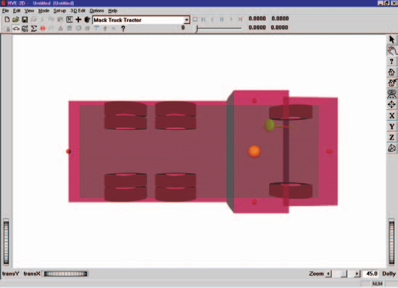
*Figure 5-1: Mack Truck Tractor, created from a generic Class 3 short wheelbase truck.*

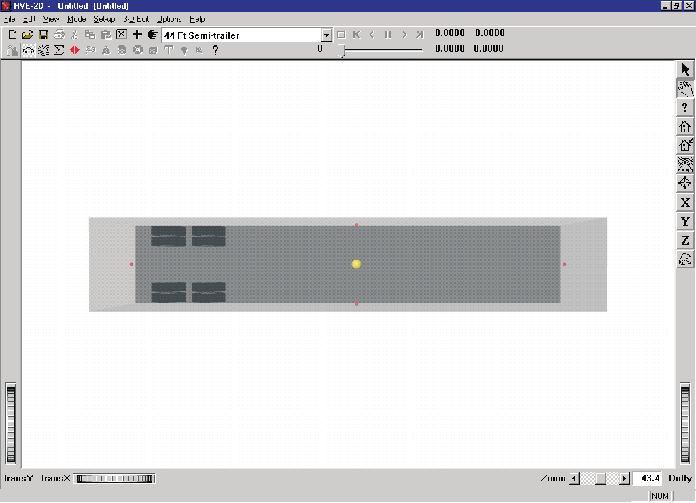
*Figure 5-2: 44 Ft Semi-trailer, created from a generic Class 4 Trailer.*

### Editing the Vehicles

This tutorial includes more vehicle editing than other tutorials, mainly because nearly every on-highway truck is custom built to some degree, and there are so many sizes of trailers. This gives us an opportunity to exercise more features of the Vehicle Editor. Let's begin by editing the color of the Mack tractor:

- Select *Mack Tractor* from the Active Vehicles list in the drop-down menu, making it the current vehicle. The Mack Tractor is now displayed in the Vehicle Editor Viewer.
- Click on the CG and choose *Color*. The Vehicle Color dialog is displayed (see Figure 5-3), showing the vehicle's current color (the small black square, or *hot spot*, in the *color wheel*) and intensity (the arrow in the *intensity slider*). Click on the hot spot and drag it to the outside of the yellow area. To brighten the color, click on the intensity slider and drag it to the far right end of the slider.

> NOTE: The color chip on the left shows the current color.

- When the color is to your liking, close the dialog by clicking the close button on the upper right corner of the dialog.

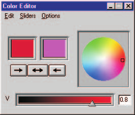
*Figure 5-3: Vehicle Color dialog, used for assigning the vehicle color.*

> NOTE: The vehicle's apparent color may be slightly misleading because the vehicle is translucent when displayed in the Vehicle Editor. The actual color will be used whenever the vehicle is displayed during Event and Playback mode.

Now, let's position the rear axles to match those of the Mack Tractor.

- Click on the right tire of the third axle and then choose *Wheel Location* from the pop-up menu. The Wheel Location dialog is displayed.
- Edit the x value of -127.75 in. to be `-161.50` in.
- Click the checkbox for *Copy To Other Side*.
- Click *OK* to move the third axle towards the rear of the vehicle.
- Now click on the right tire of the second axle and then choose *Wheel Location* from the pop-up menu. The Wheel Location dialog is displayed.
- Edit the x value of -76.25 in. to be `-110.00` in.
- Click the checkbox for *Copy To Other Side*.
- Click *OK* to move the second axle towards the rear of the vehicle.

Now, let's move the fifth wheel connection to the proper position:

- Click on the CG and choose *Connections*. The Connections dialog is displayed.
- Position the Rear Connection (Fifth Wheel) between the rear axles by changing the x coordinate from -92.0 in. to be `-135.75` in.
- Raise the height of the Rear Connection above the CG of the vehicle by changing the z coordinate from -3 in to be `-4` in.
- Click *OK* to move the connection to the proper position.

Next, let's add the 3-D geometry file for the Mack truck. The geometry file was previously digitized by EDC, named *TKMackTractor.h3d* and placed in the `supportFiles/images/vehicles` subdirectory. To attach the geometry file to our generic vehicle, perform the following steps:

- Click on the CG, choose *Exterior Geometry* and select *Open*. The Geometry File Selection dialog is displayed (see Figure 5-4), and we're ready to select a geometry file from the listbox.
- Click on the *Files of Type* option list and choose *HVE Geometry Files (\*.h3d)*.
- Scroll down the list and double-click on *TKMackTractor.h3d*.

The new geometry file is applied to the Mack Truck Tractor (see Figure 5-5).

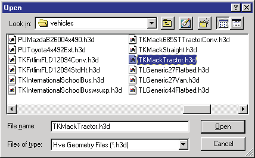
*Figure 5-4: Vehicle Geometry File Selection dialog, used for adding a 3-D geometry file to the Mack tractor.*

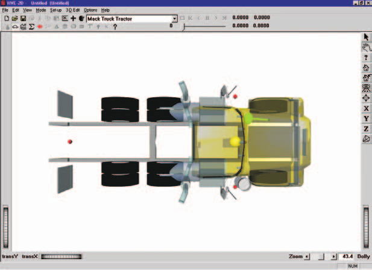
*Figure 5-5: Mack Tractor after adding its geometry file.*

Next, let's edit the trailer by changing its color and adding a geometry file.

Let's begin by editing the color of the 44 foot semi-trailer:

- Select the *44 Ft Semi-trailer* from the Active Vehicles drop-down list, making it the current vehicle. The trailer is now displayed in the Vehicle Editor Viewer.
- Click on the CG and choose *Color*. The Vehicle Color dialog is displayed, showing the vehicle's current color and intensity. Click on the hot spot and drag it to the yellow area near the outside of the color circle. To brighten the color, click on the intensity slider and drag it to the far right end of the slider.
- When the color is darkened to your liking, close the dialog by clicking the close button on the upper right corner of the dialog.

Next, let's add the 3-D geometry file. A generic 44 foot van trailer geometry file, appropriately named *TLGeneric44Van.h3d*, was prepared by EDC and placed in the `supportFiles/images/vehicles` subdirectory. To attach the geometry file to the trailer, perform the following steps:

- Click on the CG, choose *Exterior Geometry* and select *Open*. The Geometry dialog is displayed (see Figure 5-6), and we're ready to select a geometry file from the listbox.
- Scroll down the list and double-click on *TLGeneric44Van.h3d*.

The new geometry file is applied to the generic trailer (see Figure 5-7).

The tractor and trailer are now ready for our EDVTS simulation analysis.

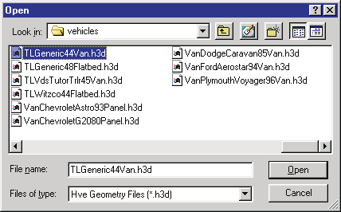
*Figure 5-6: Vehicle Geometry File Selection dialog, used for adding a 3-D geometry file to the 44 foot van trailer.*

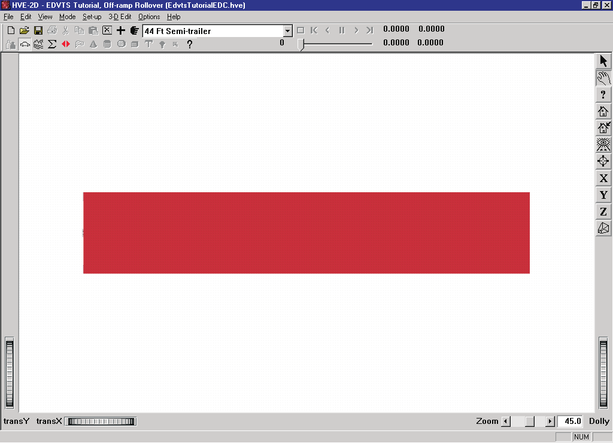
*Figure 5-7: 44 Ft Semi-trailer after adding its geometry file.*

## Creating the Environment

Now, let's add the environment:

- Choose *Environment Mode*. The Environment Editor is displayed.
- Click on *Add New Object*. The Environment Information dialog is displayed.
- Using the Location Database combo box, choose *Denver, Colorado, USA*. The latitude (39.45.00N), longitude (105.00.00W) and GMT, hours from the prime meridian (-7.0) are displayed for the selected location.
- Enter a name for the environment, `Freeway Offramp, Exit 342`.
- Enter the date and time of the incident we are studying, `10/22/00` and `1045`, respectively.
- Enter the angle from *true north* to the earth-fixed X axis in our environment, `0.0` degrees.

> NOTE: The Latitude, Longitude, GMT, Date/Time and angle from true north are used to position the sun in the scene. This is, of course, important because the sun is the primary light source for the scene.

- To add the environment geometry file to our case, click on *Open*. The Environment Geometry File Selection dialog is displayed.
- Click on the *Files of Type* option list and choose *HVE Geometry Files (\*.h3d)*. A list of environment geometry files using the .h3d file format is displayed in a list box.
- Double-click on *EdvtsTutorial_2D.h3d* to choose the environment file and remove the dialog.

**[HVE]** HVE users should double-click on *FreewayOfframp.h3d*.

- Press *OK*.

The selected environment is added to our case and displayed in the Environment Viewer (see Figures 5-8 and 5-9). Use the viewer thumb wheels to view the scene.

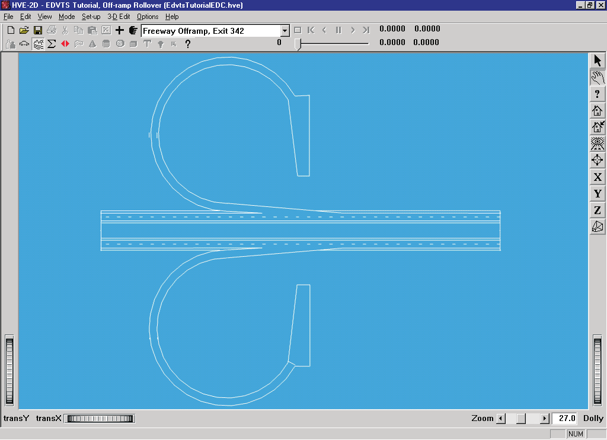
*Figure 5-8: HVE-2D environment used for the EDVTS tutorial.*

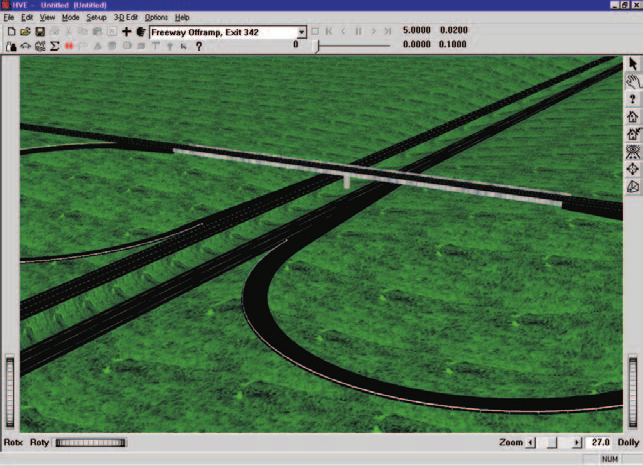
*Figure 5-9: HVE environment used for the EDVTS tutorial.*

## Saving the Case

Now that we've created all the objects (*vehicle* and *environment*) for our case, let's save the case file.

- Click on the *File* menu and choose *Save*. The Save-as File Selection dialog is displayed.

> NOTE: The Save-as dialog is displayed because the case has not been saved previously, so we need to enter a filename.

- In the Case Title text field, enter `EDVTS Tutorial, Off-ramp Rollover`.

> NOTE: The Case Title is displayed as a heading on all printed output reports.

- Place the mouse cursor in the Filename text field and enter `EdvtsTutorial`.
- Click *SAVE*. The current case data are saved in the `/supportFiles/case` subdirectory.

> NOTE: Saving the file occasionally is a highly recommended practice.

## Creating the Event

As mentioned at the outset of the tutorial, we are going to simulate a tractor-trailer offramp accident to determine if the offramp is negotiable at the posted speed. To create the event, perform the following steps:

- Choose *Event Mode*. The Event Editor is displayed.
- Click on *Add New Object*. The Event Information dialog is displayed.
- Select *Mack Truck Tractor* and *44 Ft Semi-trailer* from the Active Vehicles list.
- Select *EDVTS* from the *Calculation Method* options list.
- Enter a name for the event, `Offramp Rollover`.

> NOTE: The name of the calculation method will be appended to the event name, thus the complete event name will become "EDVTS, Offramp Rollover."

- Press *OK* to display the event editor.

Now, we're ready to set up the event.

- *Mack Truck Tractor* is the only object listed in the Event Humans & Vehicles list box. Choose *Set-up* from the main menu bar and select *Position/Velocity*. The Mack tractor and 44 foot semi-trailer are displayed in the environment. The Position/Velocity dialog for the tractor is also displayed. The tractor CG is located above the earth-fixed origin, and the trailer is connected to the tractor with a zero articulation angle.

> NOTE: Even though you didn't select the trailer from the Event Humans and Vehicles list (in fact, it's not even in the list), the trailer is automatically attached to the tractor and displayed in the Event viewer because the trailer is a "child" vehicle, that is, HVE-2D knows that the trailer's position is not independent from the tractor; it is attached to it.

- Click on the Mack truck's X-Y manipulator (see Figure 5-10), wait for it to turn bright yellow (indicating it has been selected), and drag it to its initial position, X=`250.0` ft, Y=`-48.0` ft (for HVE, X=`150.0` ft, Y=`-48.0` ft). In the Position/Velocity dialog, enter a heading (yaw) angle of `180.0` degrees.

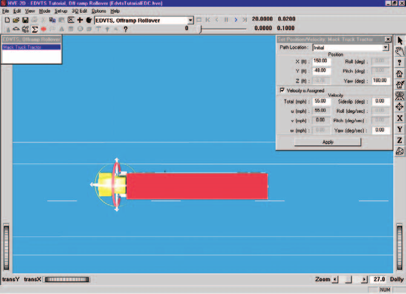
*Figure 5-10: Vehicle positioning using the Event Editor. The manipulators can be used to drag and drop the vehicle into position.*

> NOTE: To select the X-Y manipulator, the viewer must be in Pick mode, as indicated by the highlighted arrow in the upper right corner of the viewer (see Figure 5-10).

> NOTE: Be sure to keep the mouse button depressed while you drag the manipulators.

> NOTE: Adjust the viewer by dollying back (using the Dolly thumb wheel) until you can see the entire intersection.

> NOTE: If you can't position the vehicle at the exact coordinates, simply enter them in the Position/Velocity dialog (in fact, it's often easier to directly enter the coordinates using the dialog).

> NOTE: When entering coordinates using the Position/Velocity dialog, remember to press \<Enter\> or Apply; otherwise, the values will not be assigned.

- Click the *Velocity Is Assigned* checkbox. Enter the initial total velocity, `55` mph.

The vehicles' initial conditions are now established. Let's enter the driver controls. We'll start with the Mack tractor's steering table. After a little trial and error, we have arrived at a steer table that causes the vehicle to exit from the freeway onto the offramp and begin steering around the curve.

To enter the steer angles, perform the following steps:

- Click on the Set-up Menu, select *Driver Controls*. The Driver Controls dialog appears and the Steering Table is displayed.
- Click on the *Table Is* option list and choose the *At Steering Wheel* option.
- Enter the steer angles for the Mack Truck Tractor, as shown in Table 5-1, below:

**Table 5-1: Steer table entries for the Mack Truck Tractor**

| Time (sec) | Steer Angle at Steering Wheel (degrees) |
|---|---|
| 0.00 | 10.0 |
| 2.00 | 10.0 |
| 4.00 | 9.0 |
| 5.50 | 0.0 |
| 6.00 | 180.0 |
| 8.00 | 270.0 |

> NOTE: Note the simplicity of the steer table. The steering angle changes gradually, just like it does when you are really driving! Complex driver tables containing several rows of slightly-changing steer angles are usually a bad sign.

Next we enter the braking table:

- Since the Driver Controls dialog is still displayed, simply click on the *Brake* tab. The Brake Table dialog is displayed.
- Click on the *Table Is* option list and choose the *Available Friction* option.
- Enter the values shown in Table 5-2, below.
- Press *OK* to accept the brake table.

**Table 5-2: Brake table for Mack Truck Tractor**

| Time (sec) | Axle 1 Right | Axle 1 Left | Axle 2 Right | Axle 2 Left | Axle 3 Right | Axle 3 Left |
|---|---|---|---|---|---|---|
| 2.00 | 0.00 | 0.00 | 0.00 | 0.00 | 0.00 | 0.00 |
| 2.10 | 0.01 | 0.01 | 0.15 | 0.15 | 0.15 | 0.15 |
| 5.00 | 0.01 | 0.01 | 0.15 | 0.15 | 0.15 | 0.15 |
| 5.10 | 0.25 | 0.25 | 0.25 | 0.25 | 0.25 | 0.25 |

*(Values are Percent Available Friction, %/100.)*

This table causes the vehicle to begin coasting when the vehicle leaves the freeway at 2 seconds. Moderate braking begins at 5 seconds, just as the vehicle enters the turn.

Next, we need to enter the driver controls for the trailer. To perform this operation, we first need to select the trailer:

- If necessary, use the Event Viewer thumb wheels or manipulators to adjust the view so the trailer is visible.
- Click on the trailer in the Event Viewer. A set of manipulators is displayed at its connection to the tow vehicle, and the Position/Velocity dialog is displayed, as shown in Figure 5-11.

> NOTE: To select the vehicle, the viewer must be in Pick mode, as indicated by the highlighted arrow in the upper right corner of the viewer (see Figure 5-11).

> NOTE: We can't select the trailer from the Event Humans & Vehicle list because the trailer is not an independent vehicle; it is a "child" of the Mack Tractor. Therefore, the trailer is not displayed in this list.

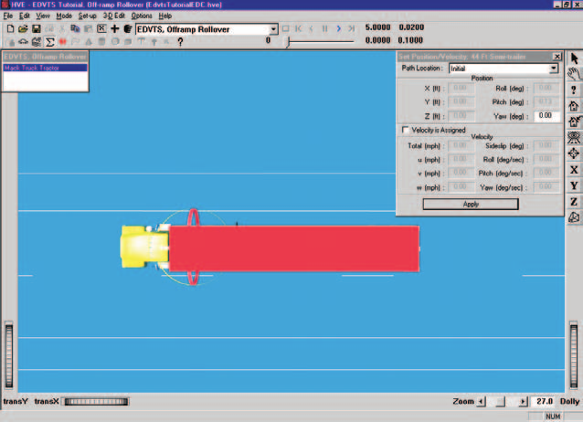
*Figure 5-11: Trailer positioning using the Event Editor. The manipulators are displayed at the connection between the tractor and trailer. The manipulators can be used to drag and drop the vehicle into position.*

Now, we're ready to enter the driver controls for the trailer. To enter the brake table, perform the following steps:

- Click on the Set-up Menu and select *Driver Controls*. The Driver Controls dialog appears.
- The *Brake* tab is the only available tab. The Brake Table is displayed.

> NOTE: The Steering, Throttle and Gear Selection options are not available in the Driver Controls cascade menu because the default Driver Location option for trailers is 'None' (see Vehicle Editor, Vehicle Information dialog).

- Click on the *Table Is* option list and choose the *Available Friction* option.
- Enter the brake table values for the 44 foot semi-trailer, as shown in Table 5-3:

**Table 5-3: Brake Table for the 44 Ft Semi-trailer**

| Time (sec) | Axle 1 Right | Axle 1 Left | Axle 2 Right | Axle 2 Left |
|---|---|---|---|---|
| 2.00 | 0.00 | 0.00 | 0.00 | 0.00 |
| 2.10 | 0.01 | 0.01 | 0.01 | 0.01 |
| 5.00 | 0.01 | 0.01 | 0.01 | 0.01 |
| 5.10 | 0.25 | 0.25 | 0.25 | 0.25 |

*(Values are Percent Available Friction, %/100.)*

> NOTE: The time and brake entries are identical to those used for the tow vehicle's rear tandem axles. We're assuming a pretty good brake system here; if desired, we could delay the time entries for the trailer and modify any specific entries to account for brake-to-brake variability.

- Press *OK* to accept the brake table for the trailer.

Now, let's add the payload to the trailer.

- Click on the Set-up menu and choose *Payload*. The trailer payload dialog is displayed.
- Click in the *Payload Exists* check box.
- Highlight the value in the *CG Coordinates*, z field and enter `-30.0` in.

> NOTE: Entering -30.0 locates the payload 30 inches above the unloaded trailer CG height.

- Highlight the value in the *Weight* field and enter `40000.0` lb.
- Highlight the value in the Rotational Inertia, Yaw field and enter `3360000.0` lb-sec²-in.
- Press *OK* to update the trailer's payload.

Finally, we must adjust the Roll Couple Distribution to reflect the fact that this is a heavy truck.

- In the **Vehicle Editor**, select the tow vehicle and open its **Suspension Parameters**.
- In the *Roll Couple Distribution* field, replace the default value, `0.55`, with a more representative value, `0.2`.
- Apply the change.

*(updated: The printed tutorial set this value through the Options menu's Calculation Options dialog. The current version does not present an EDVTS Calculation Options dialog; the roll-couple value is taken from the tow vehicle's suspension data (`Suspension.RollCoupleDist`). See [EDVTS Calculation Options](../../10-calculation-options/CalcOptEDVTS.md).)*

This event lasts more than 5 seconds. To prevent premature termination, let's increase the default maximum simulation time.

- Click on the Options menu and choose *Simulation Controls*. The Simulation Controls dialog is displayed.
- Edit the *Maximum Time*, changing it from `5` to `20` seconds.
- Press *OK* to update the simulation controls.

Since our goal for this event is to see if the vehicle rolls over, let's look at some Key Results during execution:

- If Key Results windows are not displayed, choose *Show Key Results* from the Options menu.
- Drag the Key Results windows to a convenient location, where they do not block the view but still allow us access to the viewer thumb wheel controls (in case we want to change the view).
- Click on *Select Variables* in the *Mack Truck Tractor* Key Results window. The Variable Selection dialog for *Mack Truck Tractor* is displayed.

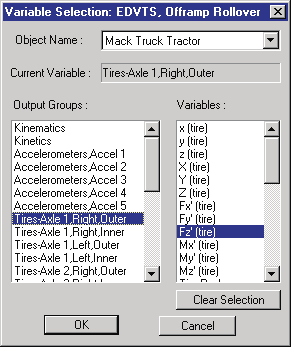
*Figure 5-12: Key Results Variable Selection dialog, used for selecting variables to be displayed in the Key Results window.*

Let's add *Tire Fz'* to the Mack's Key Results window:

- Choose *Tires, Axle 1, Right, Outer* from the variable group list. The Variable Selection list for the right front tire is displayed.
- Select *Fz'* from the list.
- Choose *Tires, Axle 1, Left, Outer* from the variable group list. The Variable Selection list for the left front tire is displayed; select *Fz'* from the list.
- Repeat the above steps for Mack's rear tandem axles, choosing *Fz'* for *Axle 2* and *Axle 3*.
- Press *OK* to include the new variables in the Key Results dialog.

Next, let's add the vertical tire forces for the trailer:

- Click on *Select Variables* in the *44 Ft Semi-trailer* Key Results window. The Variable Selection dialog for *44 Ft Semi-trailer* is displayed.

Add *Tire Fz'* to the trailer's Key Results window:

- Choose *Tires, Axle 1, Right, Outer* from the cascade menus. The Variable Selection list for the front tandem axle, right side, is displayed; select *Fz'* from the list.
- Repeat the above steps for the trailer's remaining tires.
- Press *OK* to display the new variables in the Key Results dialog.

Now, we're ready to execute the event.

- Using the Event Controller, click *Play* to execute the event. Allow the event to run until completion.

> NOTE: While the event is executing, watch the current results (especially the Velocity, Acceleration and Fz values) in the Key Results windows.

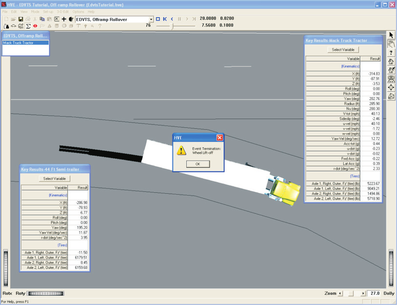
*Figure 5-13: Event Editor executing the EDVTS event.*

The EDVTS event terminates at time t = 7.56 seconds, when the event terminates due to the trailer's right front wheel lifting.

> NOTE: By reviewing the individual wheel vertical wheel loads, Fz, in the Key Results windows, we can see it was the trailer's right front wheel that lifted, as noted by the negative value for Fz.

> NOTE: EDVTS terminated and told HVE-2D to display a message alerting us to the reason for termination (note the message displayed in Figure 5-13).

We have now completed the event.

## Viewing Results

Now that we have produced our EDVTS simulation, let's take a detailed look at the results. The Playback Editor is used for reviewing and printing reports for each event in the current case, as well as for producing video output.

EDVTS produces the following reports:

- **Accident History** — A table of initial and final positions and velocities
- **Messages** — A list of messages produced by the current run
- **Program Data** — A table containing program control information
- **Trajectory Simulation** — A visualization of the event, displayed at a user-selectable time interval
- **Variable Output** — A table containing time-dependent simulation results
- **Vehicle Data** — A series of tables containing the vehicle data used by EDVTS

To view the output reports, we need to be in Playback mode:

- Choose *Playback Mode*. The Playback Editor is displayed.

### Report Windows

The reports listed above are displayed by selecting Report Windows. Each Report Window contains an individual report.

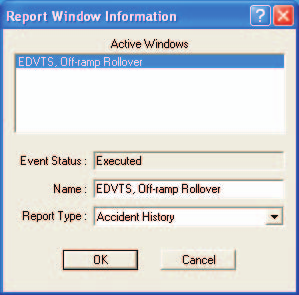
*Figure 5-14: Report Window Information dialog, showing the name of the event(s) in the current case.*

To view the reports produced by the *EDVTS, Offramp Rollover* event, perform the following steps:

- Click *Add New Object*. The Report Window Information dialog is displayed, as shown in Figure 5-14, and includes a list of the active events (*EDVTS, Offramp Rollover* is the only event in this file). The Report Window Information dialog also includes the user-editable *Report Window Name* text field and *Select Output* option list.
- Select *EDVTS, Offramp Rollover* from the Active Events list.
- Click on the *Select Output* option list and choose any of the available reports.
- Press *OK* to display the report.

The selected report will be displayed in a resizable window. The following pages illustrate the reports produced for the *EDVTS, Offramp Rollover* event.

### Accident History

The Accident History report displays the time and total distance traveled, as well as position and velocity at the start and end of the run.

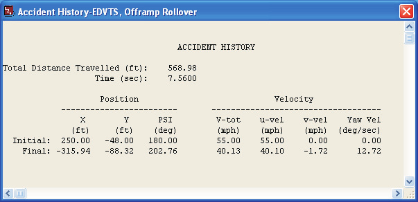
*Figure 5-15: Accident History Report for EDVTS, Offramp Rollover.*

To view the Accident History report for the *EDVTS, Offramp Rollover* event, perform the following steps:

- Click *Add New Object*. The Report Window Information dialog is displayed.
- Select *EDVTS, Offramp Rollover* from the Active Events list.
- Click on the *Select Output* option list and choose *Accident History*.
- Press *OK*.

The Accident History report is displayed for the *EDVTS, Offramp Rollover* event, as shown in Figure 5-15.

### Messages

EDVTS produces a number of messages, depending on the outcome of the event. For a complete list and explanation of these messages, see [Chapter 6](06-messages.md).

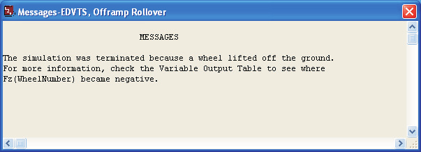
*Figure 5-16: Messages Report for EDVTS, Offramp Rollover.*

To view the Messages report produced by the *EDVTS, Offramp Rollover* event, perform the following steps:

- Click *Add New Object*. The Report Window Information dialog is displayed.
- Select *EDVTS, Offramp Rollover* from the Active Events list.
- Click on the *Select Output* option list and choose *Messages*.
- Press *OK*.

The Messages report is displayed for the *EDVTS, Offramp Rollover* event, as shown in Figure 5-16. (In this tutorial the report shows: "The simulation was terminated because a wheel lifted off the ground. For more information, check the Variable Output Table to see where Fz(WheelNumber) became negative.")

### Program Data

The Program Data report contains the EDVTS version number and the simulation controls used by the EDVTS event.

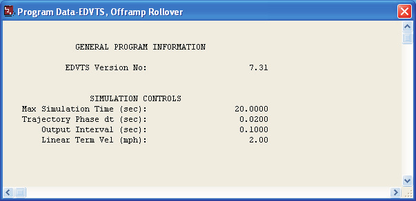
*Figure 5-17: Program Data Report for EDVTS, Offramp Rollover.*

To view the Program Data report for the *EDVTS, Offramp Rollover* event, perform the following steps:

- Click *Add New Object*. The Report Window Information dialog is displayed.
- Select *EDVTS, Offramp Rollover* from the Active Events list.
- Click on the *Select Output* option list and choose *Program Data*.
- Press *OK*.

The Program Data report is displayed for the *EDVTS, Offramp Rollover* event, as shown in Figure 5-17.

### Vehicle Data

The Vehicle Data report for EDVTS displays vehicle data, tire data and driver control tables for each vehicle in the event.

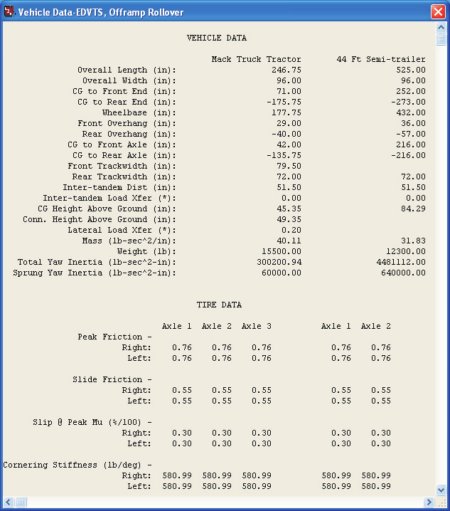
*Figure 5-18: Vehicle Data Report for EDVTS, Offramp Rollover.*

To view the Vehicle Data report for the *EDVTS, Offramp Rollover* event, perform the following steps:

- Click *Add New Object*. The Report Window Information dialog is displayed.
- Select *EDVTS, Offramp Rollover* from the Active Events list.
- Click on the *Select Output* option list and choose *Vehicle Data*.
- Press *OK*.

A portion of the Vehicle Data report displayed for *EDVTS, Offramp Rollover* is shown in Figure 5-18.

> NOTE: The Vehicle Data report is too large to fit in the viewer. Use the scroll bars to view the entire report.

### Variable Output

The Variable Output report provides variable values at each timestep in tabular form. It is possible to print these values versus time and export this table as a text file.

To view the Variable Output report for the *EDVTS, Offramp Rollover* event, perform the following steps:

- Click *Add New Object*. The Report Window Information dialog is displayed.
- Select *EDVTS, Offramp Rollover* from the Active Events list.
- Click on the *Select Output* option list and choose *Variable Output*.
- Press *OK*.

The Variable Output report is displayed for the *EDVTS, Offramp Rollover* event. The table is initially empty, so the next step is to select the time-dependent results we wish to display in the table.

#### Variable Selection

The purpose of our event is to determine the vehicle's propensity for rollover, so let's display the velocities, accelerations and vertical tire forces from the Variable Selection dialog.

- Click on *Select Variables* in the Variable Output window. The Variable Selection dialog is displayed, allowing us to choose variables to display in the Variable Output table.

First, let's add the velocities and accelerations. These variables belong to the Kinematics output group; this is the default group, and the Kinematics Variables list for the Mack Tractor is already displayed.

- Select *V-tot, Fwd Acc* and *Lat Acc* from the list.

Next, let's add the vertical wheel loads:

- Choose *Tires, Axle 1, Right, Outer* from the variable groups list. The Variable Selection list for the right front tire is displayed (see Figure 5-19).
- Select *Fz'* from the list.
- Choose *Tires, Axle 1, Left, Outer* from the variable groups list. The Variable Selection list for the left front tire is displayed; select *Fz'* from the list.
- Repeat the above steps for Mack's rear tandem axles, choosing *Fz'* for *Axle 2* and *Axle 3*.

Next, let's add the vertical tire forces for the semi-trailer:

- Click on the *Object Name* option list and choose *44 Ft Semi-trailer*. The Kinematics Variables list for the semi-trailer is displayed.
- Choose *Tires, Axle 1, Right, Outer* from the variable group list. The Variable Selection list for the front tandem axle, right side, is displayed; select *Fz'* from the list.
- Repeat the above steps for the trailer's remaining tires.
- Press *OK*.

The Variable Output report for the *EDVTS, Offramp Rollover* event now includes tow vehicle velocity and acceleration and vertical tire loads for each wheel location, as shown in Figure 5-20.

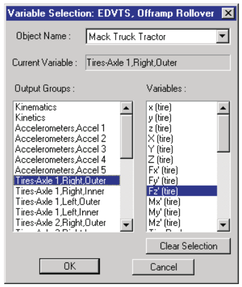
*Figure 5-19: Variable Selection dialog, used for selecting the results displayed in the Output Report.*

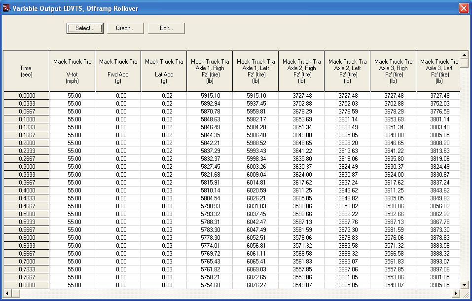
*Figure 5-20: Variable Output Report for EDVTS, Offramp Rollover, displaying the selected results.*

### Trajectory Simulation

Finally, let's display a trajectory simulation for this event. To view the Trajectory Simulation for the *EDVTS, Offramp Rollover* event, perform the following steps:

- Click *Add New Object*. The Report Window Information dialog is displayed.
- Select *EDVTS, Offramp Rollover* from the Active Events list.
- Click on the *Select Output* option list and choose *Trajectory Simulation*.
- Press *OK*.

The Trajectory Simulation viewer is displayed for the *EDVTS, Offramp Rollover* event (see Figure 5-21). The tractor and trailer are shown at their initial positions.

To visualize the motion as the tractor-trailer attempts to negotiate the off-ramp, perform the following steps using the Playback Controller:

- Click *Play* (single right-arrow). The simulation begins and is displayed at the current Playback output interval.
- Click *Pause*. The simulation stops.
- Click *Reverse* (single left-arrow). The simulation plays in reverse.
- Click *Pause*. The simulation stops.
- Click *Rewind* (left arrow with bar). The simulation returns to the start.
- Click *Advance to End* (right arrow with bar). The simulation advances to the end of the run.

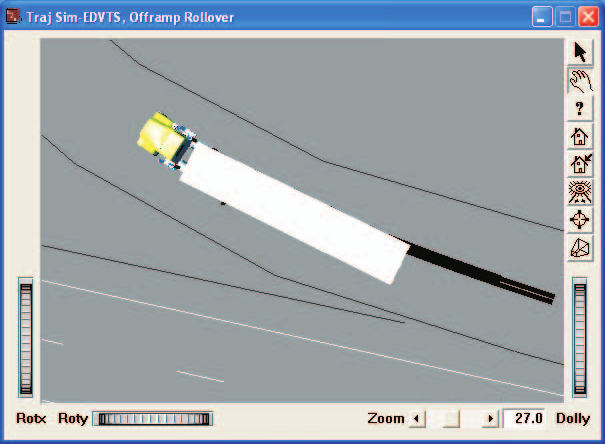
*Figure 5-21: Trajectory Simulation for EDVTS, Offramp Rollover, showing the tractor-trailer near the end of the run, before the inside trailer wheels lift off the ground.*

### Printing

The final step is to print the above reports. Printing reports is simple. All you do is choose a report and print it. For example:

- Click on the dialog header of the *Variable Output - EDVTS, Offramp Rollover* report. The dialog header is highlighted and the Variable Output window pops to the top of the display (if it isn't there already), indicating it is the current window.
- Click on the *File* menu and choose *Print*. The Print dialog is displayed, allowing the user to select from several available print options.

> NOTE: Alternatively, you can click on the print icon in the main menu bar.

- Press *OK*. The Variable Output report is printed on the system printer.

That's all there is to it! You can print any other report using the same three steps described above.

> NOTE: The Print dialog provides several options. Refer to your printer's User Manual for more information.

> NOTE: For several reports it may be best to print in landscape rather than portrait mode.

> NOTE: The font size of both the printed reports and screen display may be edited by clicking on the Options menu and choosing Preferences. Use the Font Size option list to change the size.

---

[Previous: Chapter 4 — Calculation Method](04-calculation-method.md) | [Contents](README.md) | [Next: Chapter 6 — Messages](06-messages.md)

<!-- NAV -->

---

← Previous: [Chapter 4 — Calculation Method](04-calculation-method.md)  |  [Index](README.md)  |  Next: [Chapter 6 — Messages](06-messages.md) →

<!-- /NAV -->
