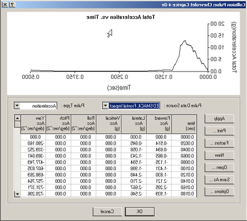
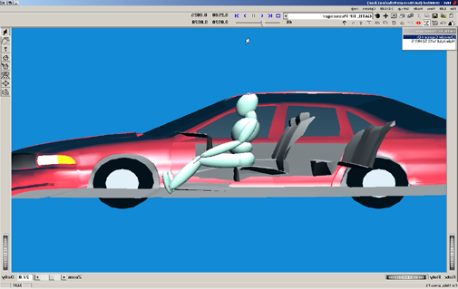

# Chapter 1 — Program Description

## Overview

GATB (**G**raphical **A**rticulated **T**otal **B**ody) is a computer model developed by Collision Engineering Associates, Inc. based on the computer program ATB (Articulated Total Body). GATB is a graphical version of the computer program ATB. The ATB model was originally developed to model the dynamic response of crash test dummies and, with later modifications, the dynamic response of a human in a crash [1]. The ATB model is very generic in nature and can be used to model any system of rigid bodies connected by a variety of different joints. The GATB implementation of this model is used to model human response to a crash environment. The generic nature of the ATB model should not intimidate the user. All of the standard data inputs are automatically generated by the GATB implementation. This allows the user to concentrate on analyzing the problem and not being concerned with which option to use or exactly how to set up the human, contact panels, etc.

GATB computes a number of values: human kinematics (position, velocity, and acceleration vs time), joint angles and torques, contact forces between the human and contact panels attached to the vehicle, contact forces between humans or between a single human's limbs.

The GATB model may be used to study occupants or pedestrians involved in motor vehicle collisions. There may be up to four human occupants studied in the same GATB run, either restrained or unrestrained. The restraint model is based upon the harness routines in the ATB-V.1 program.

The GATB and ATB programs are based on the original work done by Calspan Corporation in 1975 when the Crash Victim Simulator (CVS) was developed [2, 3]. In 1980, Calspan modified the earlier versions of ATB and CVS, combined them, and formed version 20 of CVS and version II of ATB. These versions were thoroughly documented in a four volume set of manuals [4]. Since that time, further development of the ATB model has been conducted at Wright-Patterson Air Force Base [1]. This version of GATB is based upon ATB-V.1 released in June, 1998 [5].

The GATB program uses the human model in HVE. This human model consists of 15 segments and 14 joints as shown in Table 1-1. The position and orientation of the Pelvis segment along with orientations of the other 14 segments produces a model with 48 degrees-of-freedom for each human. The vehicle motion is defined and therefore not a degree-of-freedom in the model.

| Segment Name | Joint Name | Segment Connections |
|---|---|---|
| Pelvis | L5-S1 | Pelvis to Abdomen |
| Abdomen | T12-L1 | Abdomen to Chest |
| Chest | C7-T1 | Chest to Neck |
| Neck | Atlas | Neck to Head |
| Head | | |
| Right Upper Leg | Right Hip | Pelvis to Right Upper Leg |
| Right Lower Leg | Right Knee | Right Upper Leg to Right Lower Leg |
| Right Foot | Right Ankle | Right Lower Leg to Right Foot |
| Left Upper Leg | Left Hip | Pelvis to Left Upper Leg |
| Left Lower Leg | Left Knee | Left Upper Leg to Left Lower Leg |
| Left Foot | Left Ankle | Left Lower Leg to Left Foot |
| Right Upper Arm | Right Shoulder | Chest to Right Upper Arm |
| Right Lower Arm | Right Elbow | Right Upper Arm to Right Lower Arm |
| Left Upper Arm | Left Shoulder | Chest to Left Upper Arm |
| Left Lower Arm | Left Elbow | Left Upper Arm to Left Lower Arm |

**Table 1-1: List of HVE human segments and joints**

*(Code note: the 15-segment/14-joint model matches the current HVE human structure in `Physics/Include/HUMAN.H` — `MAXHVESEGMENTS` is 15, with up to 3 contact ellipsoids and up to 4 joints per segment.)*

## Model Inputs

GATB inputs include at least one human (up to four), one vehicle, and an optional environment. Event set-up parameters for the human(s) include initial position, seat location (left-front, center-rear, pedestrian, etc.), restraint usage, etc. Parameters for the vehicle include vehicle initial position, velocity, acceleration pulse, etc. The vehicle movement is defined by the initial 6 degree-of-freedom (dof) data (X, Y, Z, Roll, Pitch, Yaw), linear and angular, velocity vector, and the acceleration pulse. The acceleration pulse, or collision pulse, may be entered by the user or obtained directly from another HVE event, such as an EDSMAC run, as shown in Figure 1-1. The human motion is then calculated as the human body segments interact with the contact panels that are attached to the vehicle. Figure 1-2 shows a right front seat passenger response to a frontal impact.

*Figure 1-1: Example of EDSMAC collision pulse.*

*Figure 1-2: GATB run showing right front occupant in frontal impact.*

## Model Outputs

GATB output reports include Accident History, Human Data, Injury Data, Messages, Program Data, Results, Trajectory Simulation, Variable Output Tables, and Vehicle Data.

## Validation

GATB was validated against several ATB runs [6]. The GATB program basically extracts all the data from HVE, creates an ATB program input file, and then executes a version of the ATB program. The basic validation consisted of checking that the correct data was being extracted from HVE and that the data being returned to HVE was being correctly identified. The validation effort confirmed that GATB produces the same results as the ATB program. The ATB program has been previously validated to produce reasonable predictions of human response to motor vehicle collisions [1, 4, 5].

## Basic Operation

The procedure for using GATB is substantially the same as using any reconstruction or simulation model in the HVE environment:

- Use the Human Editor to add one or more humans to the case. Edit the human properties to match specific case information.
- Use the Vehicle Editor to add one or more vehicles to the case. Edit the vehicle properties to match specific case information.

> **NOTE:** Review the following chapter, GATB Program Input, to confirm those parameters that affect the GATB program results; many physical parameters are not used by GATB, and therefore, do not affect the results.

- Use the Environment Editor to create a visual environment.
- Use the Event Editor to set up and execute the GATB calculation model by performing the following steps:
  - Choose at least one human and one vehicle from the list of humans and vehicles created earlier.
  - Choose the GATB calculation model.
  - Position the vehicle and human at the Initial Position.
  - Enter or select an Acceleration Pulse.
  - Execute the GATB simulation event.
- Modify the inputs as required to achieve the desired match between the simulation results and the actual event.
- Finally, use the Playback Editor to view the various reports and trajectory simulations. If desired, produce a video output of the simulation.

<!-- NAV -->

---

← Previous: [GATB — Graphical Articulated Total Body](README.md)  |  [Index](README.md)  |  Next: [Chapter 2 — Program Input](02-program-input.md) →

<!-- /NAV -->
