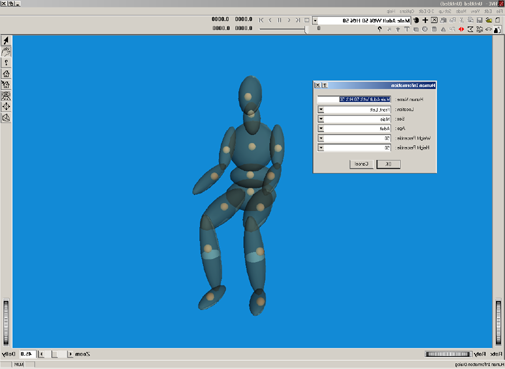
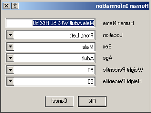
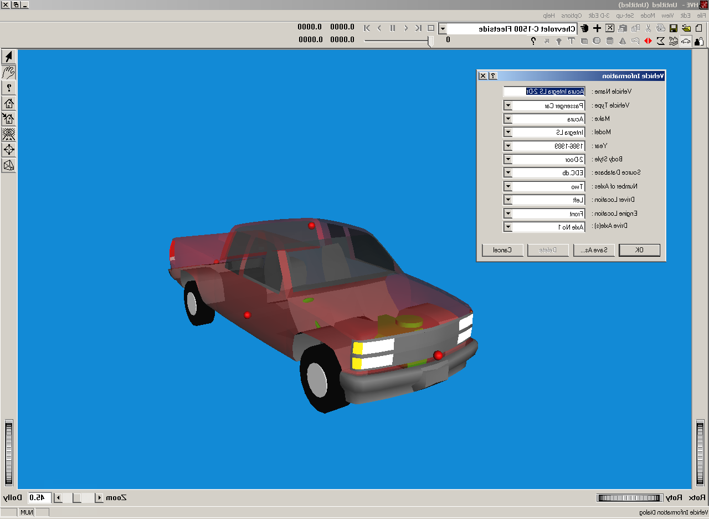
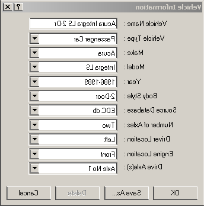
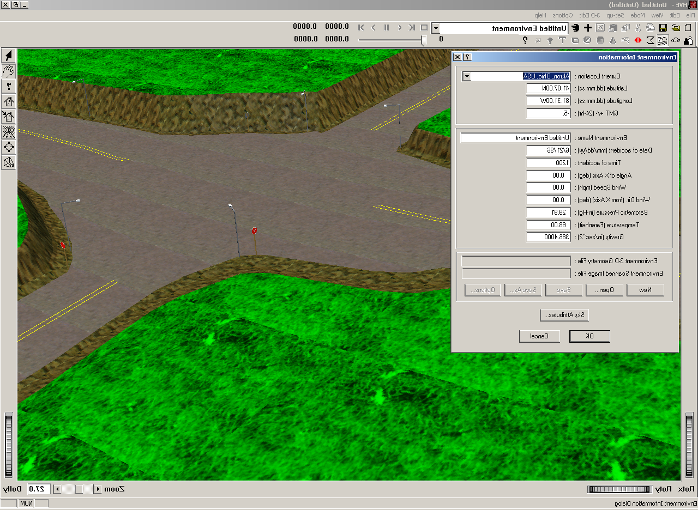
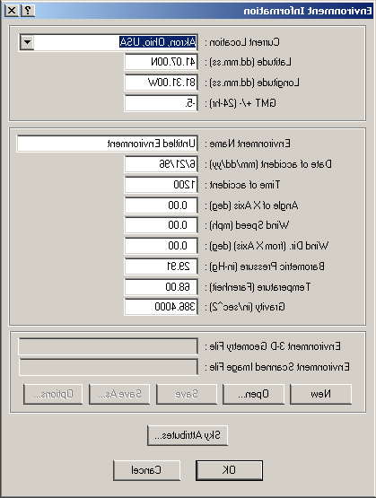
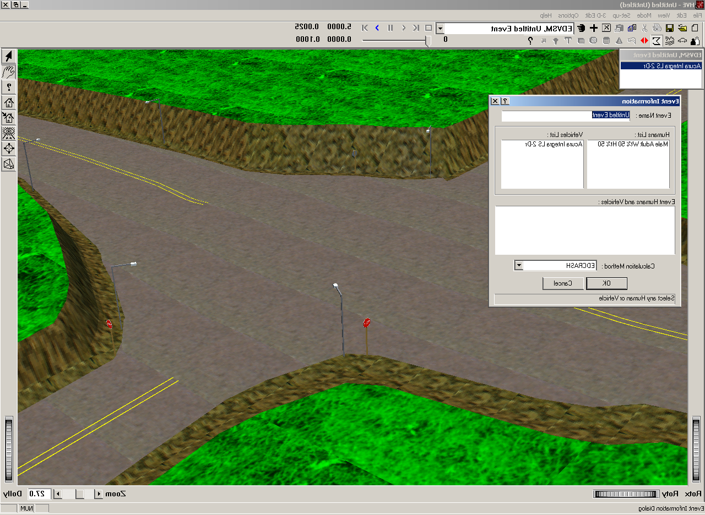
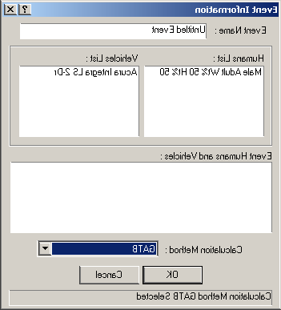

# Chapter 2 — Program Input

This chapter defines the objects (humans, vehicles and environment) and the event set-up parameters (positions, velocities, acceleration pulse, etc.) used by the GATB analysis. In general, the chapter is divided into the following sections:

- **Objects** — The number of humans and vehicles, and the specific human and vehicle parameters actually used by GATB.
- **Events** — The various HVE options available for setting up and executing a GATB event.

## Objects Overview

The objects used by the GATB model are:

- **Humans** — At least 1 human, either an occupant or a pedestrian, may be studied by GATB. Up to 4 humans can be studied in the same GATB run.
- **Vehicles** — 1 vehicle may be studied by GATB.
- **Environment** — GATB uses an environment if present, but it is not required.

> **NOTE:** The environment is used in any HVE-compatible reconstruction or simulation model.

The following sections describe how the human, vehicle, and environment provide the required inputs to the GATB calculation models.

## Human

GATB uses humans created using the HVE Human Editor (see Figure 2-1). Humans are selected from the Human Database by choosing the following attributes:

- **Location** — The user may choose from any available occupant position (i.e., R/F, L/F) or, alternatively, choose Pedestrian.

> **NOTE:** HVE displays the human motion relative to the vehicle.

- **Sex** — The user may choose Male or Female.
- **Age** — The user may choose Adult or from a list of child ages. See Table 2-1 and Table 2-2.
- **Weight Percentile** — The user may choose from a list of available percentiles. See Table 2-2 and Appendix A (GEBOD Data Pages).
- **Height Percentile** — The user may choose from a list of available percentiles. See Table 2-2 and Appendix A (GEBOD Data Pages).

*(updated: As of HVE Version 10, new humans are added to the case using the GEBOD Human Information dialog rather than the classic database-driven dialog described above. In the GEBOD dialog the user selects a **Subject Type** (Child, Female, Male or User-defined) and a **Basis** for the body generation (Age, Weight, Height, or All — i.e. age, weight and height together); the GEBOD body generator then produces the full 15-segment data set for the requested subject. The classic dialog is still shown when editing humans created from the pre-Version 10 human database. See [Human Information Dialog](../../07-humans/HumanInfoDlg.md) for full dialog details.)*

*Figure 2-1: Scene Image of HVE Human Editor.*

| Child Ages | Standing Height (inches) | Weight (lbs) |
|---|---|---|
| 3 yr. old | 38.94 | 23.08 |

**Table 2-1: List of available HVE human children**

*(updated: the classic human database also includes 6-, 9- and 12-year-old children; the GEBOD Human Information dialog can generate a child of any age from regression data.)*

| Weight %'s | Height %'s |
|---|---|
| 2.5, 50, 97.5 | 2.5, 5.0, 50.0, 95.0, 97.5 |

**Table 2-2: List of available HVE human adults (available weight and height percentiles)**

*(updated: the original table listed only the 2.5 weight percentile; the classic database provides 2.5, 50 and 97.5 weight percentiles, and the GEBOD dialog accepts arbitrary values when the Basis includes Weight and/or Height.)*

To add a human to the current HVE case, perform the following steps:

*Figure 2-2: Human Information dialog box.*

- Choose Human Mode. The Human Editor is displayed.
- Click on the (+) sign on the tool bar to add a human. The Human Information dialog is displayed — Figure 2-2.
- Click on the *Location* option list and select a location for the current human.

> **NOTE:** For information about using the Human Editor refer to the HVE Operations Manual.

> **NOTE:** If you choose R/F, L/F, etc., the human will be a vehicle occupant. If you choose Pedestrian, the human will be a pedestrian.

- Click on the *Sex, Age, Weight Percentile* and *Height Percentile* option buttons to choose a human from the database. *(updated: in the GEBOD dialog, choose the Subject Type and Basis, then enter the age, weight and/or height values.)*
- Enter a name for the current human. A default name is supplied for each selected human. This name is user-editable and does not affect calculations.

> **NOTE:** Duplicate human names are not allowed in the same case.

- Click OK to add the human to the current case.

The following Human Parameter groups are used by GATB:

- Inertias
- Ellipsoids
- Joints

The GATB human is modeled with 15 mass segments connected by 14 joints. Refer to *Chapter 4, Calculation Method*, for important details describing how the GATB human model is derived. See Table 1-1 and the GEBOD Data Pages.

The specific data in each of the above parameter groups that are actually used by GATB are defined in Tables 2-3, 2-4, and 2-5.

### Inertias

The Human Inertial Data used by GATB are shown in Table 2-3. This data is obtained from the GEBOD program [7]. See Tables 2-1, 2-2 and the GEBOD Data Pages for a complete list of humans.

| Parameter | Description |
|---|---|
| Segment Weight | Weight of each of the 15 body segments. |
| Segment Principal Moments of Inertia (X, Y, Z) | Rotational inertias of each segment about its principal axes. |

**Table 2-3: List of Inertial Data used in GATB**

*(updated: the table body was blank in the printed manual; the parameters above are the per-segment inertial data defined in `Physics/Include/HUMAN.H` — `SegmentInertia { Mass; RotInertia[3]; }` — and shown in the GATB Human Data output report.)*

### Ellipsoids

Ellipsoids are used for predicting contact forces between the human and vehicle. Penetration of an ellipsoid into a vehicle contact surface results in the calculation of force on the human.

The Human Ellipsoid Data used by GATB are shown in Table 2-4. HVE allows up to 3 ellipsoids per HVE segment. *(updated: the original manual marked this "Not Implemented Yet"; the current human structure in `HUMAN.H` implements up to 3 contact ellipsoids per segment — `MAXELLIPSOIDSPERSEGMENT` = 3.)*

> **NOTE:** If principal axes are rotated and you choose to show contact surfaces, you will not be looking at a true picture of the human-vehicle interaction. However, the forces will be correctly calculated according to the inputs being considered.

| Parameter | Description |
|---|---|
| Ellipsoid Name | Up to 30 characters, used to identify the ellipsoid. |
| Ellipsoid Center Coordinates | Segment-fixed x, y, z coordinates of the ellipsoid center. |
| Ellipsoid Semiaxes | Semi-axis lengths of the ellipsoid along its principal axes. |
| Ellipsoid Principal Axes | Yaw, pitch and roll orientation of the ellipsoid principal axes relative to the segment axes. |

**Table 2-4: List of Ellipsoid Data used in GATB**

*(updated: the printed table listed only the Ellipsoid Name row; the center coordinates, semiaxes and principal-axis rows above are the ellipsoid data actually carried in `HUMAN.H` — `SegmentEllipsoid { EllipsoidName; Coord[3]; Length[3]; PrincipalAxes[3]; Material; }` — and echoed in the GATB Human Data report.)*

### Joints

Joints are used to connect together each of the 15 segments. The Human Joint Data used by GATB are shown in Table 2-5.

| Parameter | Description |
|---|---|
| Joint k Location | Distance from segment CG to joint along the segment-fixed k axis. |
| Joint yaw, pitch, and roll stop angles | Articulation yaw, pitch, and roll angles at which joint stop properties are applied. |
| Stop elasticity — i, j, k axes | Elasticity of the joint stops for yaw, pitch, and roll rotations. Applies to both (+) and (−) directions. |
| Linear Elastic Coefficient | Elastic properties of the joint in the normal range of motion (i.e., between the joint stops). |

**Table 2-5: Human Joint Parameters used in GATB**

*(Cross-reference: the full set of joint properties available in HVE — joint type, stop angles and elasticities in both directions, energy dissipation, linear/quadratic/cubic elastic coefficients, damping, and injury tolerance angles — is described in [Human Joint Properties Dialog](../../07-humans/HumJntPropDlg.md). Each segment may carry up to 4 joints — `MAXJOINTSPERSEGMENT` = 4 in `HUMAN.H`.)*

## Vehicle

GATB uses 1 vehicle created using the HVE Vehicle Editor (see Figure 2-3). Vehicles are selected from the Vehicle Database by choosing the following attributes:

- **Type** — GATB supports the following vehicle types: *Passenger Car, Pickup, Sport-Utility, Van, Truck, Trailer, Dolly, Fixed Barrier,* and *Movable Barrier.*
- **Make** — GATB supports all available vehicle makes.
- **Model** — GATB supports all available vehicle models, within the limits defined by number of axles and drive axles.
- **Year** — GATB supports all available vehicle years.
- **Body Style** — GATB supports all available vehicle body styles.

Each vehicle also has the following additional user-editable parameters:

- **Driver Location** — The driver location is used by GATB to determine if the airbag is a driver-type or a passenger-type airbag.
- **Engine Location** — The engine location is not used by GATB.
- **Number of Axles** — GATB supports 2- and 3-axled vehicles.
- **Drive Axle(s)** — The drive axle attribute is not used by GATB.

To add a vehicle to the current HVE case, perform the following steps:

- Choose Vehicle Mode. The Vehicle Editor is displayed.
- Click on the (+) sign to add a new vehicle. The Vehicle Information dialog is shown. (See Figure 2-4)
- Click on the *Type, Make, Model, Year* and *Body Style* option buttons to select a vehicle from the database.
- If desired, modify the *Driver Location, Engine Location, Number of Axles* and *Drive Axle(s)* for the current vehicle.

Enter a name for the current vehicle. A default name is supplied for each selected vehicle. This name is user-editable, and does not affect calculations.

> **NOTE:** Duplicate vehicle names are not allowed in the same case.

*Figure 2-3: Using the Vehicle Editor.*

- Click OK to add the vehicle to the current case.

*Figure 2-4: Vehicle Information dialog.*

The following Vehicle Parameter groups are used by GATB:

- Move CG
- Contact Surfaces
- Belt Restraints
- Airbag Restraints

The specific data used in each of the above parameter groups are defined in Tables 2-6 through 2-8.

### Sprung Mass

Remember, GATB is not a *vehicle* simulator! The motion of the vehicle is determined by a user-supplied collision (acceleration) pulse, along with initial vehicle position and velocity. Therefore, the vehicle data required by GATB is limited to that which is required to establish interaction forces between the human and vehicle.

### Inertias

Inertial parameters are not used by GATB. The vehicle's motion is supplied by assigning an initial velocity and a collision pulse (see Event Editor later in chapter).

### Move CG

Move CG is not directly used by GATB. Its current value does not show up in the results. However, the Move CG fields may be used to quickly move the vehicle's center of gravity; the x, y, z coordinates for the contact surfaces, belt anchor points and airbag location are updated to reflect the new location.

### Geometry File

The geometry file plays no role in the GATB calculations. However, there are some smart things that may be done for occupant simulation. Remembering that an occupant is inside the vehicle, and may be difficult to see, the following two suggestions will help greatly:

- Choose NoBody.h3d as the geometry file. As its name implies, NoBody.h3d is a null geometry file (it has all the required data structures, but no surface polygons), or
- Edit the vehicle's geometry file and remove the roof and roof supports.

> **NOTE:** Remember to save the file with a new name, such as PCFordTaurus4DrSNoRoof.xxx, to avoid losing the original geometry file!

### Contact Surfaces

Vehicle contact surfaces are the surfaces that interact with human ellipsoids to produce forces on the human. Up to 25 contact surfaces are allowed by GATB, the properties for which are shown in Table 2-6.

| Parameter | Description |
|---|---|
| Contact Surface Name | Up to 30 characters, used to identify the surface. |
| Contact Surface Location | Interior or Exterior; provides the default status that determines whether a contact surface is allowed or ignored during force calculations. |
| Contact Surface x, y, z corner coordinates | Vehicle-fixed x, y, z coordinates for three consecutive corners of the current contact surface, supplied in a counter-clockwise order. The positive side of the surface is specified by the right-hand rule. |
| Contact Surface Quadratic Stiffness | Second-order stiffness of the ellipsoid vs. contact surface pair. |
| Contact Surface Cubic Stiffness | Third-order stiffness of the ellipsoid vs. contact surface pair. |
| Contact Surface Damping Constant | Velocity-dependent damping properties between the ellipsoid and contact surface. |

**Table 2-6: HVE contact surface information used in GATB**

### Belt Restraints

Belt restraints are an extremely important aspect of GATB's functionality. The ability to study the effect of restraint system usage (or non-usage) is an important one.

A belt restraint system may be supplied for up to nine seat positions. Although HVE assigns default positions for each belt system, these are arbitrary and may be replaced by user-entered information. Belt Parameters used by GATB are shown in Table 2-7.

> **NOTE:** At this point, you are saying the vehicle has a belt installed at a specific location. Whether or not the belt is used is event-dependent! See Event Set-up, Restraints later in this chapter for more information.

| Parameter | Description |
|---|---|
| Seat Position | Seat position within vehicle (R/F, L/F, etc.). |
| Belt Section | Torso or lap. |
| Belt Anchor Point x, y, z Coordinates | Vehicle-fixed x, y, z coordinates for one end of the belt (the other end of the belt is attached to a human segment). |
| Belt Linear Stretch Rate | Linear stretch rate of the belt material. |
| Belt Quadratic Stretch Rate | Second-order stretch rate of the belt material. |

**Table 2-7: HVE belt restraint data used in GATB**

*(Code note: each belt system has separate left and right lap and torso sections; the human's belt injury tolerances are likewise stored as separate Left/Right Lap and Torso values — `HumanTolerance { ... LeftLap; LeftTorso; RightLap; RightTorso; }` in `HUMAN.H`.)*

### Airbag Restraints

Like belt restraints, airbag restraints are also an extremely important aspect of GATB's functionality.

An airbag restraint system may be supplied for up to nine seat positions. Like belt restraints, default positions for each airbag may be replaced by user-entered information. Airbag Parameters used by GATB are shown in Table 2-8.

> **NOTE:** At this point, you are saying the vehicle has an airbag installed at a specific location. Whether or not the airbag deploys is event-dependent! See Event Set-up, Restraints later in this chapter for more information.

| Parameter | Description |
|---|---|
| Seat Position for Current Airbag | Seat position within vehicle (R/F, L/F, etc.). |
| Bag Anchor Point x, y, z Coordinates | Vehicle-fixed x, y, z coordinates of the airbag. |
| Initial Bag Radius | Initial radius of airbag. |
| Passenger Bag Length | If a passenger seat position (i.e., no steering column), the airbag length. |
| Initial Bag Pressure | Initial pressure inside of the airbag. |
| Bag Membrane Thickness | Thickness of the airbag material. |
| Bag Full Inflation Volume | Volume of the airbag at full inflation. |
| Bag Vent Discharge Coefficient | Thermodynamic discharge coefficient of vent. |
| Bag Vent Area | Area of the vent. |
| Force Convergence Criterion | Allowable difference between force on airbag and force on human. |

**Table 2-8: Airbag restraint data used in GATB**

*(Note: the printed manual labeled the vent-area row "Bag Penetration for Force"; the description — area of the vent — identifies it as the bag vent area.)*

### Inter-vehicle Connections

Inter-vehicle connections are not used by GATB.

### Drag Forces

Drag forces are not used by GATB.

### Unsprung Mass

Unsprung Mass parameters (Wheel Location, Tire, Suspension and Brakes) are not used by GATB.

> **NOTE:** Wheel location and tire size are used to visualize the vehicle, but play no role in GATB simulation calculations.

### Exterior

The Vehicle Exterior Data (Exterior Dimensions, Stiffness) are not used by GATB.

### Steering System Data

Steering System Data are not used by GATB.

### Brake System Data

Brake System Data are not used by GATB.

## Environment

GATB uses the environment created by the HVE Environment Editor (see Figure 2-5). The environment is created by defining the following groups of attributes:

- Visual Data
- Physical Data

### Visual Data

The following visual parameters may be edited:

- **Environment Location** — A database containing the name (City/State/Country), Latitude and Longitude and GMT for the selected location.
- **Time and Date** — The local standard time and date for the event.
- **Angle of X Axis** — The angle of the earth-fixed X axis relative to true north.

The visual data are not used by the event; they are provided for studies related to visibility at the time of an event (e.g., avoidability of an accident).

*Figure 2-5: HVE Environment Editor.*

> **NOTE:** The visual data (Location, Time, Date and Angle of Earth-fixed X axis) affect the lighting of the event! Depending on your view (Camera Position) the scene may be shaded and difficult to see. If the time is after sundown, the view will be dark.

### Physical Data

The Physical Data groups are:

- Wind Speed and Direction
- Atmospheric Temperature and Pressure
- Gravity Constant
- 3-D Surface Geometry

*Figure 2-6: Environment Information dialog.*

To add an environment to the current HVE case, perform the following steps:

- Choose Environment Mode. The Environment Editor is displayed.
- Click on the (+) sign on the toolbar to add a new environment. The Environment Information dialog is displayed, Figure 2-6.
- Click on the *Location* combo box to select the desired city, state and country, and associated latitude, longitude and GMT.
- Enter the *Time* and *Date* for the event.
- Enter the *Angle of the X axis, Wind Speed* and *Direction, Barometric Pressure* and *Temperature* for the event.
- Enter the *Gravity Constant* for the event.
- Enter an environment name. A default name is supplied for the current environment. The name is user-editable, and does not affect calculations.
- Click OK to add the environment to the current case.

Visual parameters are not used by GATB. The specific physical environment data used by GATB are described below.

### Angle of X Axis

The angle of the X axis is used to position the earth-fixed coordinate system on the surface of the earth.

> **NOTE:** The angle is specified relative to true north. If you are using a compass to determine direction at the scene of an accident, you should provide a correction factor before entering this angle.

> **NOTE:** The angle of the X axis affects how you visualize a GATB event, but does not affect any calculations.

### Wind Speed and Direction

Wind Speed and Direction are not used by GATB.

### Atmospheric Temperature and Pressure

Atmospheric Temperature and Pressure are not used by GATB.

### Gravity Constant

The gravity constant converts mass to force. An object's mass and rotational inertias are properties that are the same throughout the universe; however the weight of an object is dependent on the local gravitational constant.

### 3-D Surface Geometry

The 3-D Surface Geometry is not used by GATB.

> **NOTE:** If a contact panel named GROUND is defined, the program builds a flat contact panel 200 ft × 200 ft, centered at the vehicle x, y position and at z = 0.

## Event

GATB uses the HVE Event Editor (see Figure 2-7) to create, set up and execute an event. Each of these topics is described below.

### Creating a GATB Event

A GATB event is created using the Event Information dialog. To create a GATB event:

- Choose Event Mode. The Event Editor is displayed.
- Click on the (+) sign on the toolbar to add an event. The Event Information dialog is displayed, Figure 2-8.
- Select at least 1 human from the Active Humans list.
- Select 1 vehicle from the Active Vehicles list.
- Select *GATB* from the Calculation Method options list.
- Enter an event name. A default name is supplied for the selected event. The name is user-editable, and does not affect calculations.

*Figure 2-7: Event Editor in HVE.*

> **NOTE:** Duplicate event names are not allowed.

- Click OK to create the GATB event.

> **NOTE:** If you choose an object that is not compatible with GATB, a message will be displayed describing the problem. You will not be allowed to proceed until GATB-compatible objects are selected.

### Setting Up a GATB Event

GATB uses the following *event set-up* options:

- Initial Position/Velocity
- Collision Pulse
- Contacts
- Restraints
- Calculation Options

*Figure 2-8: Adding a new event.*

The specific Event Set-up data used by GATB are defined in Table 2-9.

| Parameter | Description |
|---|---|
| Initial Position / Velocity | Vehicle and human initial conditions. |
| Vehicle Collision Pulse | Time-dependent table of the vehicle forward, lateral, and vertical components of linear acceleration, and the yaw, pitch, and roll angular accelerations. |
| Contacts | A table of allowable interactions between human ellipsoids and vehicle contact surfaces. |
| Belt Restraints In-Use Switch | Determines whether the selected belt restraint system (torso or lap) is in use. |
| Segment Attachment | The name of the segment to which the belt ends are attached. |
| Attachment Coordinates | The segment-fixed i, j, k coordinates for the belt attachment point. |
| Belt Slack | Initial slack in the belt. |

**Table 2-9: List of Event Data**

### Position/Velocity

Like all simulations, GATB requires initial positions and velocities to be supplied by the user.

The vehicle is positioned relative to the earth-fixed coordinate system by supplying the X, Y, Z coordinates of its CG, and roll ($\Phi$), pitch ($\Theta$) and yaw ($\Psi$) angles about vehicle x, y, and z axes, respectively. The vehicle velocities are supplied in the form of a total velocity, sideslip angle and vertical velocity.

> **NOTE:** The vehicle-fixed u (forward) and v (side) velocity components are calculated using the total velocity and sideslip angle.

Human positions and velocities are assigned relative to the vehicle-fixed coordinate system.

> **NOTE:** The same is true for output reports: all the kinematic data displayed in Variable Output is reported relative to the vehicle for humans.

The position of a human is defined by the center of gravity of its pelvis segment (this is called the *main segment*). Thus, the positions and velocities are actually those assigned for the pelvis. (However, human positions may be further defined for each additional segment (i.e., *Head, Left Upper Leg*, and so forth) by $\Phi$, $\Theta$, $\Psi$ articulations (supplied in that order) at the joints. Angular velocities may be supplied as well.)

GATB is a 15-mass, 14-joint model. Articulation angular positions and velocities may be entered by clicking on the neck segment (to set the initial conditions for the C7-T1, or Neck, joint), and by clicking on the Right and Left Upper Leg segments (to set the initial conditions for the Hip joint). These joints are modeled by GATB and their motion will be affected by subsequent human-vehicle interaction. Any of the other segment positions may be supplied as well. Position/Velocity Data used by GATB are shown in Table 2-10.

| Parameter | Description |
|---|---|
| Vehicle Initial Position | The earth-fixed x, y, z coordinates and the roll, pitch, and yaw orientations of the vehicle at the start of the run. |
| Vehicle Initial Velocity | The forward, lateral, and vertical linear velocities, and the roll, pitch, and yaw angular velocities of the vehicle at the start of the run. |

**Table 2-10: Position and velocity data used in GATB**

*(Note: the second row was mislabeled "Vehicle Initial Position" in the printed manual; its description identifies it as the initial velocity.)*

### Driver Controls

The Driver Controls Data are not used by GATB.

### Damage Profile

The Damage Profile Data are not used by GATB.

### Payload

The Payload Data are not used by GATB.

### Collision Pulse

The collision pulse provides the vehicle acceleration vs. time history for the event. The data are provided in the form of a table. The current value of forward, side and vertical linear accelerations, and roll, pitch and yaw angular accelerations is obtained from this table using linear interpolation. Once obtained, the accelerations are integrated during each time step to determine vehicle velocity and position.

> **NOTE:** HVE allows you to supply a collision pulse directly from a previously run EDSMAC event, or any physics program that produces a collision pulse, as well as from a directory of user-saved collision pulses. See References 5 and 6 for additional information.

> **NOTE:** There are also options available to define the vehicle motion using a velocity-time data file or a position-time data file.

> **NOTE:** Because of the significant difference in the mass of a human compared to a vehicle, a collision pulse is not normally required for a pedestrian impact simulation.

### Contacts

The Contacts dialog allows the user to selectively remove specific human ellipsoid vs vehicle contact surface interactions for consideration by the event. This practice is useful because every interaction requires computational overhead. Removing unnecessary calculations reduces calculation time.

By default, the Contacts dialog assumes interaction between every human ellipsoid and vehicle contact surface. When an ellipsoid name is selected from the ellipsoids list box, all the vehicle contact surface names will be highlighted in the Contacts list box. Click on any highlighted contact surface to remove it from consideration.

> **NOTE:** Actually, GATB does some pre-screening: If the current human is an occupant, only interior contact surfaces will be highlighted; if the current human is a pedestrian, only exterior surfaces will be highlighted.

### Restraints

The Restraints dialog determines if a belt or airbag restraint system is in use for the current event.

> **NOTE:** If the current vehicle does not have a restraint system installed at the position specified for the current human, no restraints will be available for selection. If necessary, use the Vehicle Editor to install a restraint system at the desired seat position.

For belt restraint systems, Torso and Lap belt sections may be supplied individually. The following in-use parameters are required for each belt section:

- **Attached To** — The name of the human segment (Pelvis, Abdomen, Chest…) to which the belt is attached.
- **Attachment Coordinates** — The segment-fixed coordinates of the anchor point for the left and right belt sections.
- **Belt Slack** — The initial slack in the belt for the left and right belt sections.

> **NOTE:** Negative slack may be supplied to model belt pre-loading.

For airbag restraint systems, the following in-use parameters may be supplied:

- **Deployment Time** — The simulation time at which the bag begins to inflate.
- **Fill Duration** — The time interval during which airbag filling occurs.

### Simulation Controls

GATB uses the current simulation control parameters in the Simulation Controls dialog (see Options Menu, Simulation Controls). The Simulation parameters used by GATB are shown in Table 2-11.

| Parameter | Description |
|---|---|
| Human Collision Integration Time Step | Not adjustable — set to 0.0005 sec. |

**Table 2-11: Simulation control data used in GATB**

### Calculation Options

There are several calculation options available in GATB. Each of these options allows for special situations where the default data may not sufficiently model the event being analyzed.

**Use External File** — This option is used when the user wants to make detailed changes to the existing input file (gatb.ain) and have this input file used again without regenerating all the data. This is useful when very specific data in the input file needs to be changed, but the GATB implementation does not allow the user a dialog to enter it. It is also useful when running someone else's .ain file. Use this option with extreme care; there is no error checking on the input values outside of the ATB model and unexpected results may cause computational errors that are not handled by HVE. Before making any changes to a .ain file or using this option, the user must be very familiar with ATB and all the options available in the base version of ATB.

**Use Pulse File** — This option is available to allow users to utilize an external pulse file. This allows someone to produce a pulse file using a non-HVE program and then to use it in the GATB run. The basic format of the pulse file is: Time, X, Y, Z, Yaw, Pitch, Roll for position-based pulse in seconds, inches, and degrees; Time, V-x, V-y, V-z, Roll velocity, Pitch velocity, Yaw velocity for velocity-based pulse in seconds, in/sec, deg/sec; Time, A-x, A-y, A-z, Roll acceleration, Pitch acceleration, Yaw acceleration in seconds, g's, and deg/sec².

> **NOTE:** The input data is in a different order for position-based pulse than for velocity-based or acceleration-based pulse file.

**Belt Contacts** — This option allows the user to determine how the restraint contact points are moved during the simulation. GATB automatically generates additional contact points based on the 2 points entered by the user for each segment. These points consist of a point on the centerline of the segments, for the pelvis and torso, and a point on the top of the shoulder for the torso belt. These points can all move along the surface of the segments but stay in the same place along the belt webbing (option 1 — All Slide), or the user-entered points can move along the surface while the additional points generated can stay in the same place on the segment, but move along the belt webbing (option 2 — Some Slide), or all the points used, both those entered and those generated, can stay at the same place on the segment but move along the webbing (option 3 — None Slide).

> **NOTE:** If the belt points are allowed to move on the surface of the segment some of the points may be "dropped" from the belt as they "slide" off the segment. Setting the option to None Slide prevents this, but may not model the belt interaction as accurately.

### Executing An Event

To execute a GATB event, use the Event Controller, shown in Figure 2-7 as a component of the Event Editor, and again in Figure 2-9, below. The Event Controller's buttons have the following functions:

*Figure 2-9: Simulation control buttons.*

- **Reset** — Reinitialize the calculation model for re-execution.
- **Rewind to Start** — Return to the start of the simulation.
- **Reverse** — Play the simulation backwards.
- **Pause** — Pause the simulation.
- **Execute** — Execute the event or play the simulation forwards.
- **Advance to End** — Advance to the end of the simulation.

> **NOTE:** If you make changes to any of the event set-up options (see previous section), those changes will have no effect unless you press Reset before pressing Execute.

> **NOTE:** Remember to use HVE's Options Menu to choose useful options, such as Key Results, Axes, Velocity Vectors and Contacts.

<!-- NAV -->

---

← Previous: [Chapter 1 — Program Description](01-program-description.md)  |  [Index](README.md)  |  Next: [Chapter 3 — Program Output](03-program-output.md) →

<!-- /NAV -->
