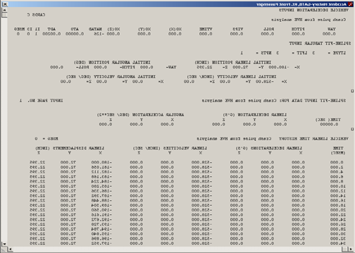
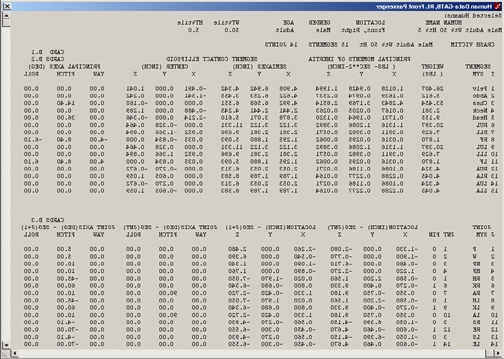
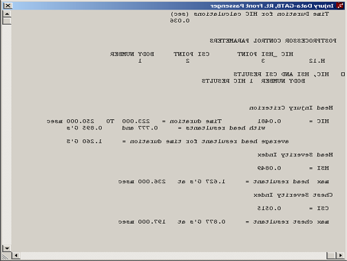
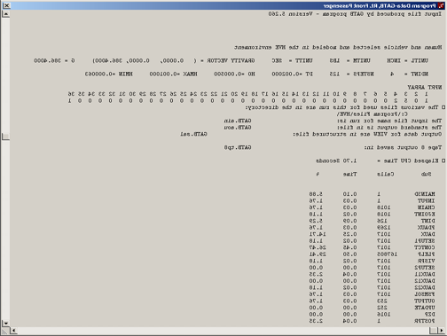
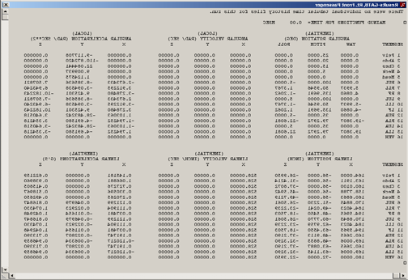
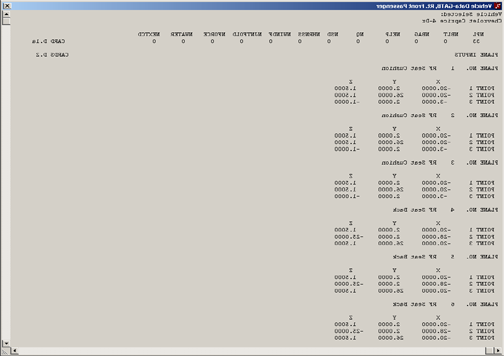
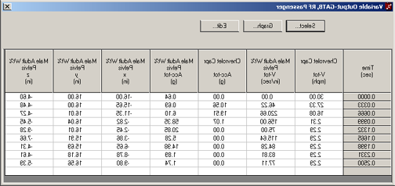
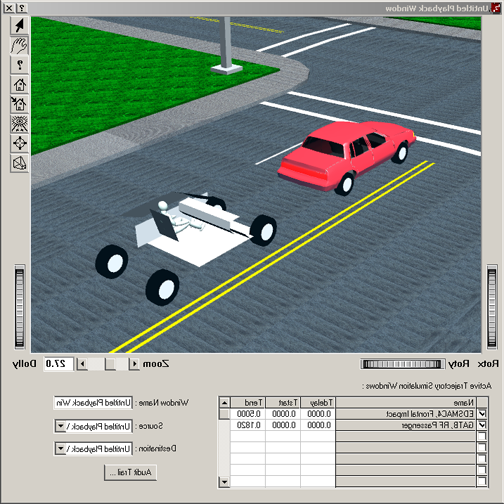

# Chapter 3 — Program Output

This chapter defines the outputs available from a GATB event. The reports produced by GATB are available in the HVE Playback Editor.

## Overview

GATB produces three types of output reports:

- **Alpha-Numeric Reports** — Reports containing text and numeric information, such as vehicle dimensional parameters.
- **Variable Output Tables** — Reports containing tabular simulation results as a function of time.
- **Trajectory Simulations** — Viewers containing dynamic, 3-D visual simulations.

> **NOTE:** Each of these reports may be printed on the system printer. To print a report, select the report in the Playback Editor's Active Windows list, then choose Print from HVE's Files menu. Refer to the HVE Operations Manual for further details.

To view any of these reports, perform the following steps:

- Choose Playback Mode by clicking the Playback button on the tool bar. The Playback Editor is displayed.
- Click on the (+) sign on the tool bar to add a Playback Report. The Preview Window Information dialog is displayed, showing a list of all the current events in the case.
- Select a GATB event from the list. Once an event is selected, the Selected Output option list is displayed containing all the available reports for the selected event. See Table 3-1.

| Available Output Options |
|---|
| Accident History |
| Human Data |
| Injury Data |

**Table 3-1: Available GATB Event Output Options**

- Choose the desired report from the Selected Output list.
- Enter a Preview Window Name. A default name is supplied for the selected preview window. The name is user-editable, and does not affect calculations.

> **NOTE:** Duplicate Preview Window names are not allowed. Because HVE truncates the name to 30 characters, you should ensure that two truncated names are not the same.

- Click OK to display the report.

## Alpha-Numeric Reports

GATB produces the following alpha-numeric reports:

- **Accident History** — A table of initial and final positions and velocities.
- **Human Data** — A series of tables containing the human data used by GATB.
- **Injury Data** — A table containing the HIC and CSI for each human.
- **Messages** — A list of messages produced by the current run.
- **Program Data** — A table containing program control information for the current run.
- **Results** — Tables containing human segment and joint data printed at approximately ten timesteps.
- **Vehicle Data** — A series of tables containing the vehicle data used by GATB.

An example of each of these numeric output reports from GATB is shown on the following pages.

### Accident History

The Accident History Report displays a table of initial and final positions and velocities for the human and vehicle. A typical Accident History Report is shown in Figure 3-1.

*Figure 3-1: Example of GATB Accident History output report.*

### Human Data

The Human Data Report includes the following information:

- **Segment Properties** — Inertial properties and joint locations for the Head, Torso, and Leg segments.
- **Joint Properties** — Elastic, damping, and stop angles for the Neck and Hip joints.
- **Ellipsoid Properties** — Name, Segment, center coordinates, and semi-axis lengths for each human ellipsoid.

A typical Human Data Report is shown in Figure 3-2. The report echoes the ATB "Crash Victim" input cards (Cards B.1–B.3): for each of the 15 segments it lists the weight, principal moments of inertia, contact ellipsoid semiaxes and center offsets, and principal-axis yaw/pitch/roll; for each of the 14 joints it lists the joint pin locations in both connected segments and the joint axis orientations.

*Figure 3-2: Typical GATB Human Data output report.*

### Injury Data

The Injury Data Report includes the HIC (Head Injury Criterion), HSI (Head Severity Index) and CSI (Chest Severity Index) results for each human: the HIC value with its time duration and average head resultant acceleration, the HSI value with the maximum head resultant acceleration and its time, and the CSI value with the maximum chest resultant acceleration and its time.

A typical Injury Data Report is shown in Figure 3-3.

*Figure 3-3: Typical GATB Injury Data output report.*

### Message

For a complete listing of messages issued by GATB, see [Chapter 6, Messages](06-messages.md).

### Program Data

The Program Data Report includes the following information:

- **Simulation Controls** — Integration parameters used for the current event.
- **Collision Pulse** — The acceleration vs. time history for the current event.
- **Contacts** — A list of all human ellipsoid vs. vehicle contact surface interactions that were ignored for the current event.

A typical Program Data Report is shown in Figure 3-4. The report also lists the GATB program version, unit system, gravity vector, integration parameters (NDINT, NSTEPS, DT, H0, HMAX, HMIN), the NPRT print-control array, the working file names (gatb.ain input file, gatb.aou standard output, .sal structured output for VIEW, and tape 8 output), and a table of elapsed CPU time by subroutine.

*Figure 3-4: Typical GATB Program Data output report.*

### Results

The Results Data Report includes tables containing human segment linear and angular positions, velocities, and accelerations, along with joint forces and torques. These tables are produced every 5 to 10 printout time intervals (i.e., output time interval = 0.002 sec; a table is produced every 10 to 20 msec, depending on maximum termination time selected). See Figure 3-5 for an example of a Results window.

*Figure 3-5: Example of GATB Results output report.*

### Vehicle Data

The Vehicle Data Report includes the following information:

- **Contact Surface Properties** — Name, elastic and damping properties, penetration limit, edge constant, maximum force, unloading slope, and relative initial position of the human with respect to the contact surface.
- **Contact Surface Location** — Name and corner coordinates for each contact surface.
- **Belt Restraints** — If in use, this section displays the name, location, and mechanical properties for each installed belt segment. In addition, this section also displays the human attachment point and initial belt slack.
- **Airbag Restraints** — If in use, this section displays the location, mechanical, and thermodynamic properties of the airbag, as well as its deployment time and fill duration.

A typical Vehicle Data report is shown in Figure 3-6.

*Figure 3-6: Typical GATB Vehicle Data output report.*

## Variable Output Table

GATB produces a Variable Output table containing the time-based simulation results. The Variable Output groups produced by GATB are as follows:

### Human Output Groups

| Parameter | Description |
|---|---|
| Human Kinematic Data (for Hip, Head, and Leg segments) | x, y, z coordinates; $\phi$, $\theta$, $\psi$ angles; total velocity, fwd, side, vert components; $\dot\phi$, $\dot\theta$, $\dot\psi$ angular velocities; total acceleration, fwd, side, vert components; $\ddot\phi$, $\ddot\theta$, $\ddot\psi$ angular accelerations (see note below). |
| Joint Data (for Neck and Hip joints) | $\phi$, $\theta$, $\psi$ joint articulation angles; $\phi$, $\theta$, $\psi$ joint elastic moments. |

**Table 3-2: Human Variable Output Data**

> **NOTE:** For humans, the human segment kinematics are defined relative to the vehicle-fixed coordinate system.

- **Human Kinematics** — Position, velocity, acceleration, and kinetic energy for each human segment.
- **Joints** — Articulation angles and torques for the Neck and Hip joints.
- **Contacts** — Contact force, deflection, and x, y contact coordinate for each human ellipsoid vs. vehicle contact impingement.
- **Belts** — Belt tension and stretch for each belt segment.
- **Airbag** — Airbag pressure, radius, contact force, and deflection.

### Vehicle Output Groups

| Parameter | Description |
|---|---|
| Vehicle Kinematic Data | x, y, z coordinates; $\phi$, $\theta$, $\psi$ orientation; total linear velocity, u, v, w components; sideslip, course angles; p, q, r angular velocity; total linear acceleration, fwd, side, vert components; $\dot u$, $\dot v$, $\dot w$ linear components; $\dot p$, $\dot q$, $\dot r$ angular components. |
| Wheel Data | x, y, z location of each wheel. |

**Table 3-3: Vehicle Variable Output Data**

- **Vehicle Kinematics** — Position, velocity, and acceleration for the vehicle.
- **Wheel** — The position of each wheel (required only to visualize the wheels during an event; not used in the calculations).
- **Contacts** — Contact force, deflection, and x, y contact coordinate for each human ellipsoid vs. vehicle contact impingement.
- **Belts** — Belt tension and stretch for each belt segment.
- **Airbag** — Airbag pressure, radius, contact force, and deflection.

> **NOTE:** The Contacts, Belts, and Airbag results for Human and Vehicle output groups are identical (Newton's 3rd law at work!)

An example of a Variable Output table is shown in Figure 3-7. A detailed listing of each Variable Output parameter produced by GATB is found in Tables 3-2 and 3-3.

*Figure 3-7: Example of Variable Output report.*

## Trajectory Simulations

GATB produces a trajectory simulation of the current event. The trajectory simulation is a 3-D visualization of the data displayed in the Variable Output table (see previous section).

*Figure 3-8: Example of Trajectory Simulation graphical view.*

### Displaying a Trajectory Simulation

The Trajectory Simulation is controlled using the Playback Controller (see Figure 3-9). The Playback Controller's buttons have the following functions:

*Figure 3-9: Playback controller buttons.*

- **Reset** — Returns to the start of the simulation and reinitializes the video output device (this applies a hardware reset and is otherwise the same as the Rewind to Start button, below).
- **Rewind to Start** — Return to the start of the simulation.
- **Reverse** — Play the simulation backwards.
- **Pause** — Pause the simulation.
- **Execute** — Execute the event or play the simulation forwards.
- **Advance to End** — Advance to the end of the simulation.

> **NOTE:** The Playback Controller also includes additional features used for creating video. Refer to the HVE Operations Manual, Playback Editor, and Video Output sections for further details.

<!-- NAV -->

---

← Previous: [Chapter 2 — Program Input](02-program-input.md)  |  [Index](README.md)  |  Next: [Chapter 4 — Calculation Method](04-calculation-method.md) →

<!-- /NAV -->
