# Chapter 5 — Tutorial

This tutorial provides examples illustrating two common applications of GATB: occupant modeling and pedestrian modeling.

Creating GATB events involves the following basic steps:

- Create the humans.
- Create the vehicles.
- Create the environment.
- Create and execute the GATB event.

Once the event has been executed, output reports can be viewed in the Playback Editor. These reports were discussed in [Chapter 3, Program Output](03-program-output.md).

The basic procedure for creating GATB events is described in detail in this tutorial.

> **NOTE:** It is assumed that HVE is up and running, and that the user is familiar with HVE's basic features. The purpose of this tutorial is to illustrate these features while setting up and executing a GATB event.

> **NOTE:** Environments are not required in the creation of a GATB event and are not discussed here. Review the HVE Operations Manual if you have questions regarding the creation of environments.

*(Updated: the dialogs referenced below — Human Information, Vehicle Information, Contact Surfaces, Position/Velocity, Collision Pulse, Contact Interactions, Simulation Controls — are the current HVE dialogs. The human-creation dialog is now the GEBOD-based **Human Information** dialog documented under [`docs/manuals/07-humans/`](../../07-humans/README.md). The workflow below matches the current release; only cosmetic dialog details may differ from the Fifth Edition screenshots.)*

## Getting Started

The first step is to set the user parameters.

> **NOTE:** Most options simply affect the appearance in a viewing window during Event or Playback mode. However, some options affect the data used in the analysis. For example, if AutoPosition is On, the vehicle position conforms to the local surface; otherwise, the position is set by the Position/Velocity dialog.

> **NOTE:** Some of the following options are "Toggles" that switch between two different modes. Make sure these options are set correctly.

To set the initial user options, choose the following from the Options Menu:

- Show Key Results
- Hide Axes
- Show Contacts
- Show Belt Anchors
- Hide Velocity Vectors
- Show Skid marks
- Hide Targets
- Turn AutoPosition On
- Units equals US
- Hide Grid

Render Options:

- Show Humans and Vehicles as Actual.
- Phong Render Shading Mode.
- Complexity equals Object.
- Render Quality equals 5.
- Texture Quality equals 1.
- Anti-Aliasing equals 1.

Set Playback to 0.0333 sec.

The remaining options will automatically initialize to their default conditions. We're now ready to proceed with the tutorial.

## Occupant Simulation Tutorial

### Creating the Humans

To create the human occupant in the collision, perform the following steps:

- If the HVE Human Editor is not the current editor, choose Human Mode by clicking the Human Mode button on the tool bar.

First, let's add the human occupant to the case.

- Click on the (+) sign in the tool bar to add a human. The **Human Information** dialog is displayed. The Human Information dialog includes option buttons allowing the user to select a seat position within the vehicle (alternatively, Pedestrian could be selected), and assign the human's attributes according to Sex, Age, Weight Percentile, and Height Percentile.

Use the option buttons to choose the following human attributes (Figure 5-1):

- Location = Front, Right
- Sex = Male
- Age = Adult
- Weight Percentile = 50
- Height Percentile = 5

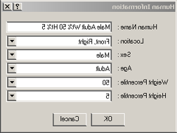
*Figure 5-1: Human Information dialog.*

> **NOTE:** The passenger's position is assumed to be on the right side of the vehicle.

> **NOTE:** Notice the human comes into the editor in a seated position. If Pedestrian had been selected as the Location for the human, then the human would appear in a standing position.

> *(Updated: in the current release the human is created through the GEBOD Human Information dialog. Subject Type may be Child, Female, Male or User, and the Basis of the anthropometry may be set to Age, Weight, Height or All. The Location/Sex/Age/Weight-Percentile/Height-Percentile choices used in this tutorial map onto that dialog. See the human-creation documentation under [`docs/manuals/07-humans/`](../../07-humans/README.md) for the full set of current controls.)*

> **NOTE:** If you are having difficulty in completing this portion of the tutorial, the file `GATBcreateHuman` in your `/HVE/supportFiles/case` directory contains all necessary information up to this point.

### Creating the Vehicles

Now that we have our human, let's add our vehicles.

- Choose Vehicle Mode by clicking on the Vehicle Mode button on the tool bar. The Vehicle Editor is displayed.
- Click the (+) sign on the tool bar to add a vehicle. The **Vehicle Information** dialog is displayed. The Vehicle Information dialog allows the user to select the basic vehicle attributes according to Type, Make, Model, Year, and Body Style.

> **NOTE:** The Vehicle Information dialog also allows you to edit the Driver Location, Engine Location, Number of Axles, and Drive Axle(s). These options affect the basic vehicle configuration and do not need to be changed for our tutorial.

Using the Option buttons, click each button to choose the following vehicle from the database:

- Type = Passenger Car
- Make = Buick
- Model = Skylark
- Year = 1985-1991
- Body Style = 4-Door

- Click OK to add Buick Skylark 4-Dr to the active vehicles list.
- Manipulate the view in the 3D viewing window to appear similar to that in Figure 5-2.

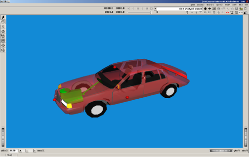
*Figure 5-2: View of Buick Skylark.*

> **NOTE:** This view is in the 2 o'clock position (the camera is at the right front corner of the vehicle, approximately 10-15 degrees above the XY plane), making the vehicle clearly visible. Now, let's add the second vehicle involved in our collision for this tutorial.

- Click the (+) sign on the tool bar to add another vehicle.

Using the Option buttons, click each button to choose the following vehicle from the database:

- Type = Passenger Car
- Make = Chevrolet
- Model = Caprice
- Year = 1991-1997
- Body Style = 4-Door

- Click OK to add Chevrolet Caprice 4-Dr to the active vehicles list.
- Manipulate the view in the 3D viewing window to appear similar to that in Figure 5-3.

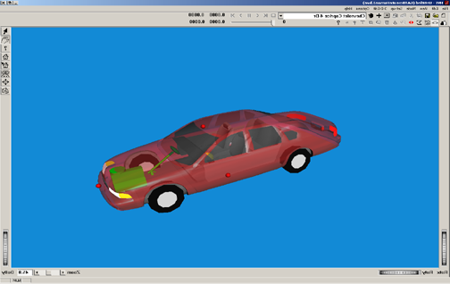
*Figure 5-3: View of Chevrolet Caprice.*

- Next, with the hand manipulator selected from the right toolbar, move the camera position closer to the vehicle by pushing the left and middle mouse buttons at the same time. Alternatively, use the dolly thumb wheel located on the right lower portion of the viewer to slowly move closer to the vehicle until you are just inside the outer shell or mesh of the vehicle. Your view will look similar to Figure 5-4.

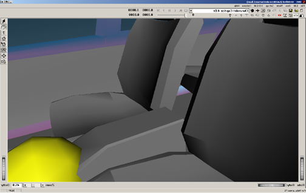
*Figure 5-4: Close-up view of vehicle interior.*

- Adjust the zoom slider located on the bottom right portion of the viewing window, or enter a number of approximately 100, to generate a wide angle view inside the vehicle similar to Figure 5-5.

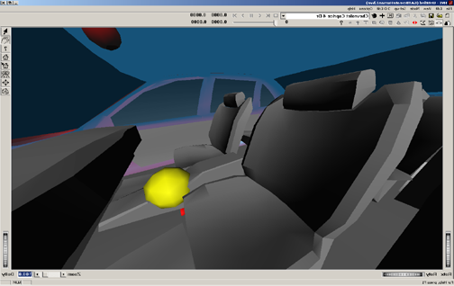
*Figure 5-5: Close-up, wide-angle view of vehicle interior.*

> **NOTE:** If you are having difficulty in completing this portion of the tutorial, the file `GATBcreateVehicles` in your `/HVE/supportFiles/case` directory contains all necessary information up to this point.

### Contact Panels

The contact panels will be entered for the right front seat position in this Chevrolet Caprice. This can be done using numerical values from the computer mesh if it has been measured in a CAD package such as AutoCAD. AutoCAD can be used to examine the mesh and extract detailed measurements of the interior, or it can be done visually, which is the way we will proceed in this tutorial. We will first position a contact panel for the seat cushion on the right front seat.

- Select the pointer mouse icon from the right toolbar.
- Click on the yellow ball representing the vehicle's center of mass.
- Select Contact Surfaces. This brings up the Contact Surfaces dialog box (Figure 5-6).
- Click on Add to add a contact surface.
- Enter the name `RF Seat Cushion`. Hit Enter.

> **NOTE:** One of the options available on the Contact Surfaces dialog box is the Material properties button. For the purposes of this tutorial, the default material will be used for all surfaces (Figure 5-7).

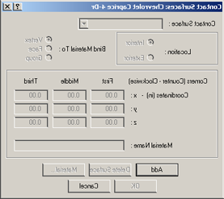
*Figure 5-6: Contact Surfaces dialog in Vehicle Editor.*

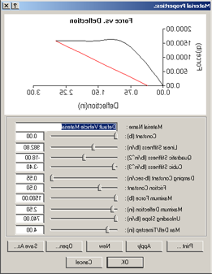
*Figure 5-7: Material Properties dialog in Vehicle Editor.*

> **NOTE:** The material values may not be exactly the same, but choose the default material.

To create the surface for the right front seat cushion, the following three points generate a surface with the correct orientation when viewed from the top:

| Corner (selection order) | x (in) | y (in) | z (in) |
|---|---|---|---|
| Left front corner of seat (First) | -2 | 2 | -2 |
| Left rear corner of seat (Second) | -18 | 2 | 1 |
| Right rear corner of seat (Third) | -18 | 22 | 1 |

See Figures 5-8 and 5-9.

- Click OK to accept the coordinates for this contact surface.

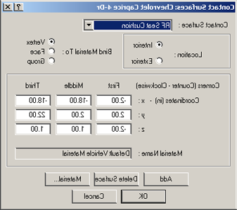
*Figure 5-8: Setting up RF Seat Cushion contact surface.*

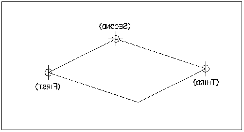
*Figure 5-9: Contact Surface corners and selection order.*

> **NOTE:** Figure 5-9 depicts the proper order for entering the corner coordinates. These corners must be entered in a counter-clockwise order in order to create the positive side of the surface facing upward. The positive side of the surface is the side of the surface that will be pushing the object.

> **NOTE:** There are other combinations that would produce a correctly oriented contact panel.

See Figures 5-10 through 5-12 for differing views of the contact panel just created.

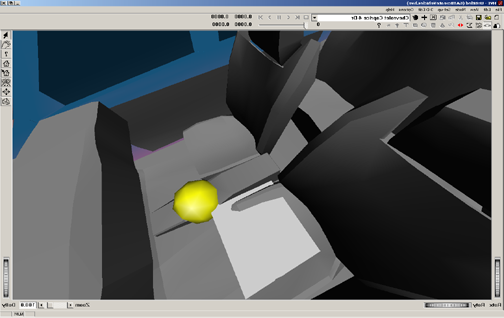
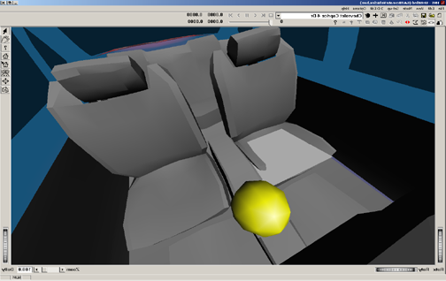
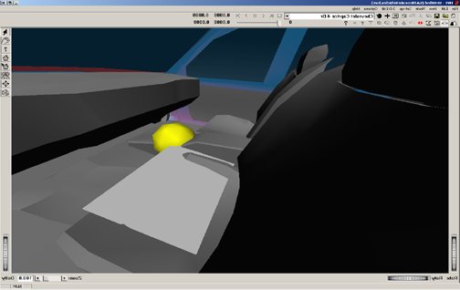
*Figures 5-10 through 5-12: Views of RF Seat Cushion contact surface.*

It is obvious that this first attempt at making the Right Front Seat Cushion contact panel creates a surface that is too narrow and does not extend rearward enough. This panel is also slightly above the seat cushion. By modifying one of the corner positions at a time, the correct seat panel can be determined visually.

Adjust the following corner coordinates to make the panel appear similar to Figure 5-15:

| Corner (selection order) | x (in) | y (in) | z (in) |
|---|---|---|---|
| Left front corner of seat (First) | -3 | 2 | -1 |
| Left rear corner of seat (Second) | -20 | 2 | 1.5 |
| Right rear corner of seat (Third) | -20 | 26 | 1.5 |

- Click OK to accept the coordinates for this contact surface.

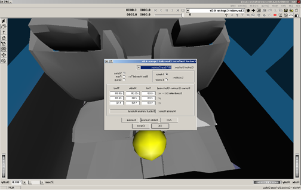
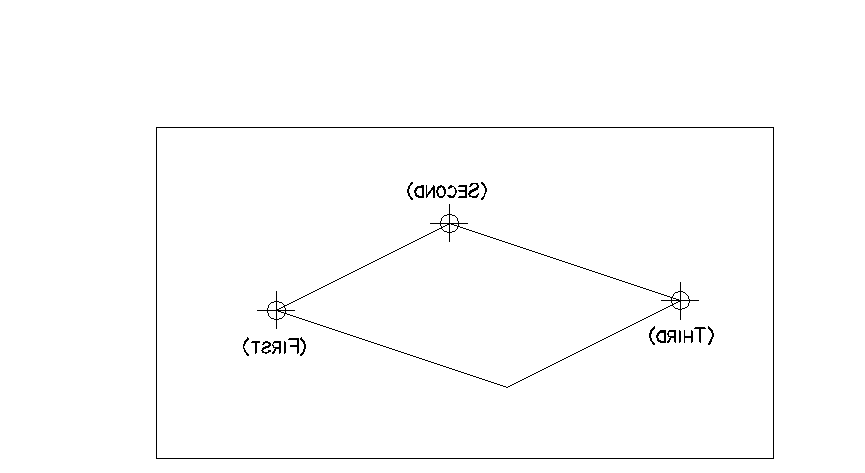
*Figures 5-13 and 5-14: Editing RF Seat Cushion contact surface and corner points.*

The visualization of the contact panel is shown in Figure 5-15. You can see that the flat contact panel does an adequate job of approximating the complex surface geometry of the seat cushion.

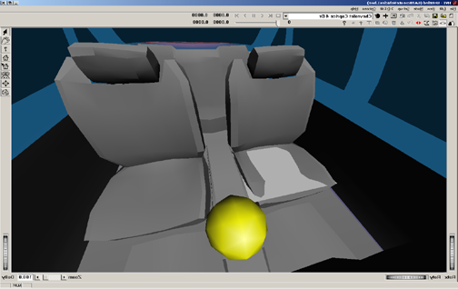
*Figure 5-15: Revised RF Seat Cushion contact surface.*

Create the remaining contact panels in the same manner as the Right Front Seat Cushion panel. The names and coordinates for the remaining panels are given in Table 5-1.

**Table 5-1: List of Contact Surface corner points**

| Name | Coord | First | Middle | Third | Material |
|---|---|---|---|---|---|
| RF Seat Back | X | -20.0 | -20.0 | -28.0 | Default Vehicle |
|              | Y | 26.0 | 2.0 | 2.0 | |
|              | Z | 1.5 | 1.5 | -25.0 | |
| Floor | X | 45.0 | -30.0 | -30.0 | Default Vehicle |
|       | Y | -32.0 | -32.0 | 32.0 | |
|       | Z | 8.5 | 8.5 | 8.5 | |
| Toe Pan | X | 34.0 | 30.0 | 30.0 | Default Vehicle |
|         | Y | -32.0 | -32.0 | 32.0 | |
|         | Z | 2.0 | 8.5 | 8.5 | |
| Rt. Side | X | 44.0 | 44.0 | -40.0 | Default Vehicle |
|          | Y | 32.0 | 32.0 | 32.0 | |
|          | Z | -12.0 | 8.5 | 8.5 | |

> **NOTE:** The 3 points entered for each contact surface define a parallelogram contact surface. For example, the side window contact surface in this example is not rectangular in shape.

> **NOTE:** The GATB program will not calculate a force if the contact occurs in the areas of no contact demonstrated in Figure 5-16.

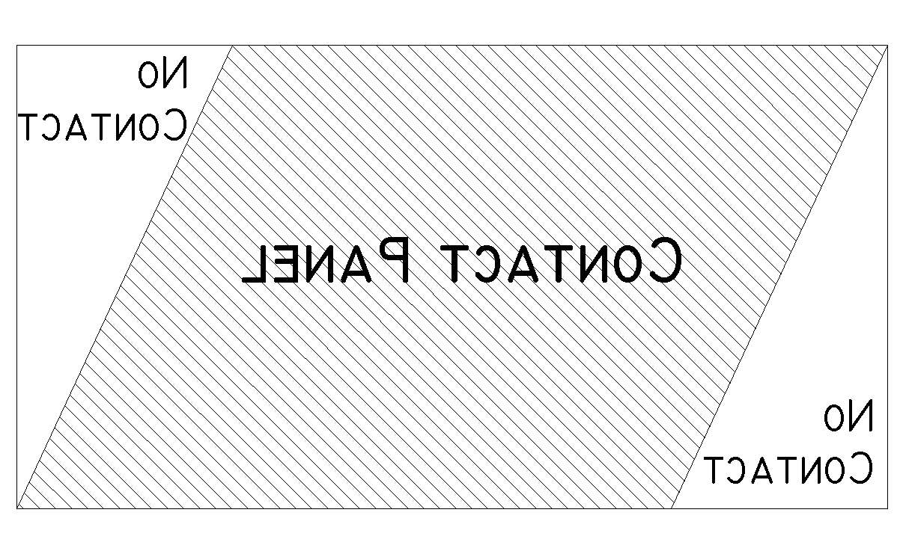
*Figure 5-16: Parallelogram contact surface.*

For purposes of illustrating the contact panels we have set the vehicle geometry to `NoBody.h3d`. Two different views of these completed contact panels are shown in Figures 5-17 and 5-18. If you choose to view the contact panels using the `NoBody.h3d` geometry file, you may return to the original geometry file by selecting the `PCChevroletImpala954-Dr.h3d` geometry file.

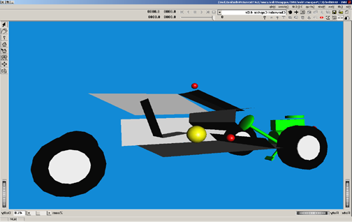
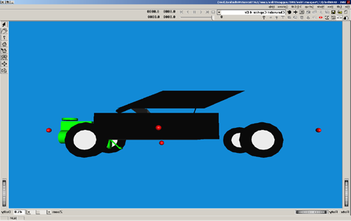
*Figures 5-17 and 5-18: Oblique and side views of contact surfaces.*

> **NOTE:** If you are having difficulty in completing this portion of the tutorial, the file `GATBcreateContactPanels` in your `/HVE/supportFiles/case` directory contains all necessary information up to this point.

### Creating and executing the Events

We will now create the simulations necessary for a head-on collision. The collision pulse needed can be directly obtained by using the EDSMAC4 collision simulator.

> **NOTE:** If you don't have EDSMAC4 on your HVE system, you may skip the EDSMAC4 event. The collision pulse for this event is shipped with GATB and may be loaded by selecting `GATBTutorialPulse1` from the Collision Pulse File Selection dialog.

- Choose Event Editor by clicking on the Event Editor button on the tool bar.
- Click on the (+) sign on the tool bar to add an event. The **Event Information** dialog is displayed (Figure 5-19).
- Select Buick Skylark 4-Dr and the Chevrolet Caprice 4-Dr from the Active Vehicles list.
- Select EDSMAC4 from the Calculation Method options list.
- Enter a name for the event: `Frontal Impact`.
- Press OK to display the Event Editor.

> **NOTE:** HVE will append the name of the calculation method to the event name, thus the complete event name will become "EDSMAC4, Frontal Impact".

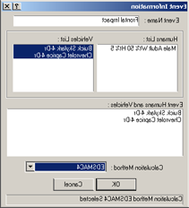
*Figure 5-19: Setting up EDSMAC4 event.*

Now we're ready to set up the event.

- Using the Event Editor dialog, select Buick Skylark 4-Dr from the Event Humans & Vehicles list.
- Choose Set-up from the menu bar.
- Select Position/Velocity and select Initial. The Buick is displayed at the earth-fixed origin.

In the Set Position/Velocity dialog for the Buick Skylark, enter:

- x (ft) = 30
- y (ft) = -6
- yaw (deg) = 180

- Click the Velocity is Assigned box in the Set Position/Velocity dialog and enter: Total (mph) = 25.
- Click Apply.

> **NOTE:** Be sure to press &lt;Enter&gt; or click Apply for the newly entered values in the Position/Velocity dialog to take effect.

- Select Chevrolet Caprice 4-Dr from the Event Humans & Vehicles list.
- Choose Set-up from the menu bar.
- Select Position/Velocity and select Initial. The Chevrolet is displayed at the earth-fixed origin.

In the Set Position/Velocity dialog for the Chevrolet Caprice, enter:

- x (ft) = 15
- y (ft) = -6
- yaw (deg) = 0

- Click the Velocity is Assigned box and enter: Total (mph) = 30.
- Click Apply.

Choose Simulation Controls from the Options menu and change the following options:

- Vehicle separation (s) = 0.001
- Vehicle trajectory (s) = 0.001
- Output time interval (s) = 0.002
- Maximum time (s) = 0.5

- Click OK.

> **NOTE:** We reduced the output interval because we're going to use the acceleration output from this simulation as the collision pulse for our occupant simulation. Because we want more detail, we select the smaller output interval. This provides the acceleration at 0.002 second increments rather than the default value, 0.1 second.

> **NOTE:** The entire duration of a collision is only about 0.1 second, so the default interval might actually skip over the entire collision!

- Using the Event Controller, click Execute on the tool bar to execute the event. Allow the event to run until just after the vehicles separate; then click Stop on the tool bar to end the event.

> **NOTE:** The complete EDSMAC4 printouts for this tutorial are found in Appendix A of the printed manual.

> **NOTE:** If you are having difficulty in completing this portion of the tutorial, the file `GATBcreateEDSMAC4` in your `/HVE/supportFiles/case` directory contains all necessary information up to this point.

### Occupant Simulation

The EDSMAC4 event has provided us with the collision pulse. Now, let's use GATB to study the passenger's behavior during impact.

- Click the (+) sign on the tool bar to add an event. The Event Information dialog is displayed.
- Select Chevrolet Caprice 4-Dr and the Male Adult Passenger from the Active Vehicles list and Active Human list, respectively.
- Select GATB from the Calculation Methods options list (Figure 5-20).
- Enter the name `RF Passenger` for the event.
- Press OK to display the event editor.

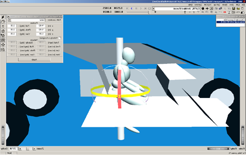
*Figure 5-20: Setting up the GATB event.*

Now, let's set up and execute the occupant simulation event using GATB.

- Using the Event Editor dialog, select Chevrolet Caprice 4-Dr from the Event Humans & Vehicles list.
- Select Set-up from the menu bar.
- Select Position/Velocity and select Initial. The Chevrolet is displayed at the earth-fixed origin.

In the Set Initial Position/Velocity dialog for the Chevrolet Caprice, enter:

- x (ft) = 15
- y (ft) = -6
- yaw (deg) = 0

- Click the Velocity is Assigned box and enter: Total (mph) = 0. Click Apply.
- Select Male Adult Human from the Event Humans & Vehicles list.
- Select Set-up from the menu bar.
- Select Position/Velocity and select Initial. The human will be displayed at the vehicle-fixed origin.

The human will be placed in the environment relative to the vehicle and will have an initial position of x = 0, y = 0, z = 0. This is the position of the human pelvis center of mass with respect to the vehicle center of mass.

> **NOTE:** The Position/Velocity dialog displays the current position and orientation of the human relative to the vehicle-fixed coordinate system. Also note that the units for position are in inches.

In the Set Initial Position/Velocity dialog for the human, enter:

- x (in) = -14
- y (in) = 16

- Click Apply. You will now see the human has moved from the center of mass of the vehicle to a position approximately in the right front seat of the vehicle (Figure 5-21).

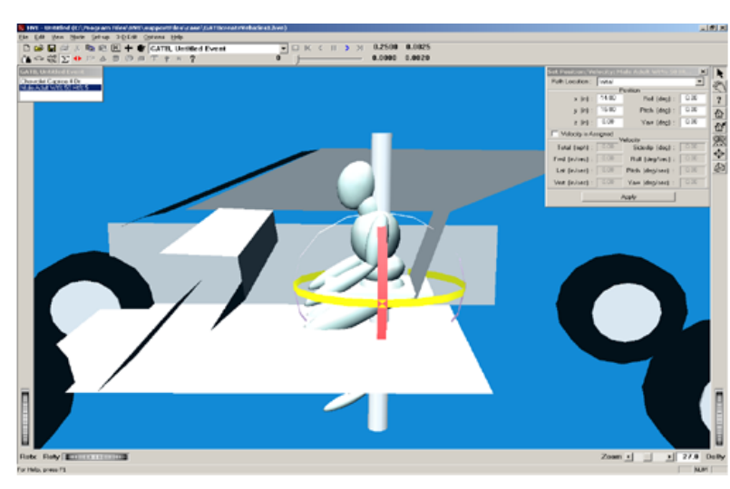
*Figure 5-21: Setting up Initial Human Position.*

> **NOTE:** The legs are embedded in the floor and the human is not in a normal seated position where the torso is in an approximately parallel position with the seat back.

- Change the pitch angle of the pelvis to 25 degrees.
- Select the Left Upper Leg of the human by using the mouse pointer icon to click on the ellipsoid.
- Enter a pitch angle of 80 degrees in the dialog box.
- Select the Left Lower Leg of the human and change its pitch angle to -50 degrees.
- Make the same changes to the Right Upper Leg (80 degrees) and Right Lower Leg (-50 degrees).

This will produce an initial positioning similar to Figure 5-22.

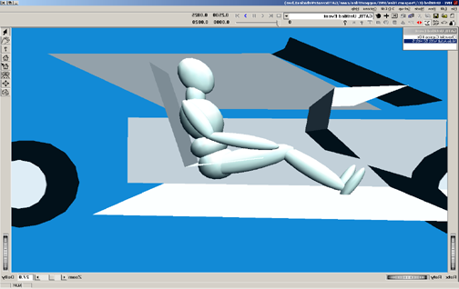
*Figure 5-22: Initial Position of RF Occupant.*

Notice that the pelvis is embedded in the seat cushion and that it needs to be moved upward. To correct this problem:

- Select the pelvis ellipsoid and change the vertical position to z = -4.6 in.

Notice the pelvis and chest are also forward, or in front of, the seat back.

- Select the pelvis ellipsoid and change its position to x = -16 in.
- Select the Velocity Is Assigned checkbox in the Position/Velocity dialog, and enter a forward velocity of 0.0 in/sec.

> **NOTE:** Because the human is defined as an occupant (as opposed to a pedestrian), the initial velocity is defined relative to the vehicle.

- Adjust the pitch angle of the Right and Left Upper Legs to 75 degrees.

Let's attach a camera to the vehicle to better see the human.

> **NOTE:** This tip really helps while positioning occupants because it allows you to move the camera relative to the vehicle; thus you can quickly focus on the interaction between the human and the seat cushion, an important part of placing the human in an equilibrium position.

- Choose Set Camera from the View menu. The Camera Setup dialog is displayed.
- Click the View From option list and choose Chevrolet Caprice 4-Dr.

Enter the following coordinates in the available fields:

- Camera Coordinates: x = -1.0, y = -10.0, z = -1.0
- Picture Center: x = 0.0, y = 0.0, z = -1.0
- Depth of Field: near = 2.0, far = 5000
- Focal Length: 50 mm

- Click Apply.

The new view of the vehicle and occupant for the vehicle-affixed camera is shown in Figure 5-23.

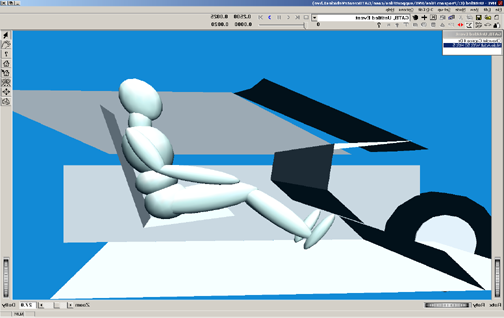
*Figure 5-23: View of occupant from specified camera position.*

Choose Simulation Controls from the Options menu and change:

- Output Interval Time (sec) = 0.002
- Maximum Time (sec) = 0.25

GATB requires that some information be entered in the Collision Pulse dialog box in order for the simulation to run properly. We will initialize this event with a zero collision pulse in order to examine the interaction between the stationary human and the vehicle contact panels.

- Select Chevrolet Caprice 4-Dr from the Event Humans & Vehicles list.
- Choose Collision Pulse from the Set-up menu.
- Select Acceleration as the Pulse Type.
- Ensure that in the table there is only one time entry for time 0.000 and that all of the column data is set to 0.000.

Once this has been completed, the occupant is close to equilibrium. We can now execute the simulation and examine how the occupant limbs move and adjust with the interacting forces from the contact panels.

> **NOTE:** Details of establishing an initial equilibrium for the occupant are beyond the scope of this simple tutorial.

> **NOTE:** In general, the linear and angular accelerations of every mass segment should be as small as possible in comparison to the acceleration pulse that will be used.

> **NOTE:** In low speed collisions, it is absolutely critical that the linear and angular accelerations be as close to zero as possible.

#### Establishing initial equilibrium

The basic equilibrium requirement is that any motion caused by being slightly out of equilibrium is negligible compared to the motion caused by the crash.

As a practical matter, the user will never be able to produce exact equilibrium (i.e., all linear and angular accelerations equal to zero).

Every analysis is different and there are no strict guidelines that define when the human position is close enough to equilibrium. In general, compare the linear acceleration for all the human segments to the linear acceleration of the crash pulse and ensure the human accelerations are much smaller.

In addition, the linear acceleration of all segments should be at least under 0.5 g's, with the possible exception of the feet, which should be at least under 1.0 g's.

> **NOTE:** On humans with small abdomens, it may not be possible to achieve 0.5 g's. In this case make it as low as possible, but certainly under 1.0 g's.

The basic procedure for establishing equilibrium is:

- Position the vehicle so that the roll, pitch, yaw and acceleration pulses are all zero.
- Set the initial velocity of the vehicle to zero.
- Click the Execute button on the tool bar to execute the program for one or two time steps.

> **NOTE:** The exact termination time is not critical.

- Go to the Playback Editor by clicking the Playback Editor button on the tool bar.
- Click on the (+) sign on the tool bar to add a report window.

The Report Window dialog will then appear with the active events shown.

> **NOTE:** If you have not run the EDSMAC4 simulation, the active events list will not include EDSMAC4.

- Highlight GATB, RF Passenger event (Figure 5-24).

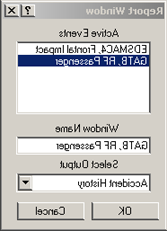
*Figure 5-24: Setting up a Report Window.*

Once the GATB event is highlighted, the available output reports are listed by clicking on the button next to the selected output. For this tutorial, we want to generate a Results Output Report.

- Click on the list of possible output reports and select Results.
- Click OK.

The Results Output Window is displayed (Figure 5-25).

In this example, our initial human position has the pelvis accelerating downward in the positive Z direction at approximately 0.62 g's. In order to position the occupant where this downward acceleration is smaller, we want to move the pelvis downward a small amount.

- Return to the Event Editor by clicking the Event Editor button on the tool bar.
- Click on the pelvis and change the Z position from z = -4.6 to z = -4.5.
- Click the Reset button on the tool bar to clear the event data.
- Click the Execute button on the tool bar to execute the event for one or two timesteps.
- Return to the Playback Editor by clicking on the Playback Editor button on the tool bar and view the Results window again (Figure 5-26).

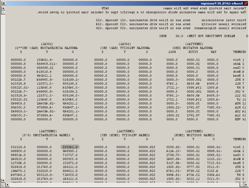
*Figure 5-25: Results Output Report in the Playback Editor.*

Notice the small differences between the two results windows (Figures 5-25 and 5-26). The linear acceleration for the pelvis in the Z direction has lowered. However, in examining the linear acceleration in the X direction for the pelvis, the value has increased from 0.145555 g's to 0.161370 g's.

There are other small changes with all of the mass segments, but you can see the effect that moving the pelvis downward slightly affects not only the linear acceleration of the pelvis in the Z direction, but affects the other mass segments in other directions as well.

To further confirm this, click on the Event Editor button on the toolbar.

- Select the pelvis with the pointer mouse icon.
- Change the position of the pelvis to z = -4.0.
- Clear the event data by clicking the Reset button on the tool bar.
- Execute the event for one or two timesteps.

Return to the Playback Editor and view the Output Results window. It should look like Figure 5-27.

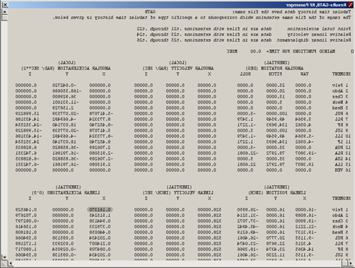
*Figure 5-26: Results report, after changes to Human Position.*

By reviewing this figure compared to the previous two figures, you can see the angular accelerations for the legs and feet have become quite large, and the linear accelerations particularly for the feet have become very large. Effectively, what we have done by moving the pelvis downward is position the feet into the floor so the floor will push back very hard.

> **NOTE:** When you move the pelvis on a human, all of the other segments move also because they are all linked in a hierarchy where the pelvis is the dominating mass.

- Return to the Event Editor by clicking the Event Editor button on the tool bar and change the Z position of the pelvis back to -4.6.
- Clear the event data by clicking the Reset button on the tool bar.
- Execute the event for two timesteps by clicking the Execute button on the tool bar.
- Confirm that the Output Results window appears the same as Figure 5-25.

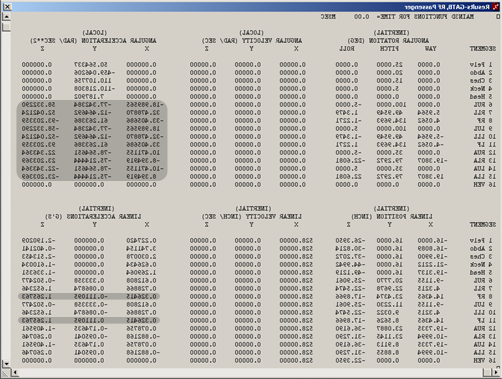
*Figure 5-27: Results report, after additional changes.*

For this example, we will not spend any additional effort in attempting to produce smaller linear accelerations.

Once the initial equilibrium has been established, the vehicle can then be positioned to the appropriate place in the environment with the appropriate orientation to match the event being modeled.

> **NOTE:** Recall that we changed the initial angles — roll, pitch, and yaw values — to zero degrees, the velocity to zero, and the crash pulse to zero, in order to help us obtain the initial equilibrium of this human.

#### Applying the crash pulse

The next step is to apply a crash pulse to the vehicle. This involves two parts.

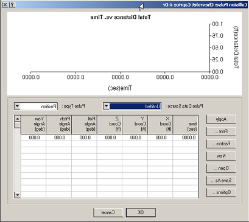
*Figure 5-28: Collision Pulse dialog, without a pulse.*

The first part is to set up the initial speed of the vehicle to match that of the crash being simulated. In this example, recall from the EDSMAC4 run that the initial speed is 30 mph.

- Go to the Event Editor by clicking on the Event Editor button on the tool bar.
- Choose the Chevrolet Caprice 4-Dr from the vehicles list.
- Select Set-up from the menu bar.
- Select Position/Velocity and click Initial.
- Assign the Velocity to 30 mph.
- Choose Set-up from the menu bar and select Collision Pulse.

The Collision Pulse dialog will appear like Figure 5-28.

- Select Acceleration as the Pulse Type.
- Select the collision pulse, EDSMAC4, Frontal Impact, from the Pulse Data Source drop-down menu. The window should look like Figure 5-29.

> If you do not have EDSMAC4 or were not able to execute the EDSMAC event, click Open in the Collision Pulse window and select the file `GATBTutorialPulse1`.

> If you are having difficulty in completing this portion of the tutorial, the file `GATBcreateGATBpassenger` in the `/HVE/supportFiles/case` directory contains all necessary information up to this point.

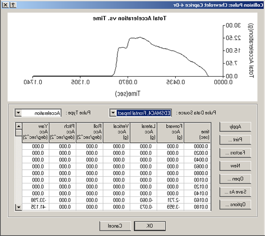
*Figure 5-29: Collision Pulse dialog, with EDSMAC4 pulse.*

At this point, you may be prompted that warnings exist. If you choose to look at those warnings, they may indicate that the yaw acceleration is higher than normal. Accept these as possible warnings, and when HVE asks you to see them again, just click Cancel. You will return to the Event Editor where you can now execute the event, which demonstrates occupant motion in a frontal car crash.

A side view from the left side of the vehicle helps you to visualize the forward motion. The camera setup for the left side view has the camera attached to the Chevrolet Caprice with the following camera coordinates:

- Camera Coordinates: x = -1, y = -10, z = -1
- Picture Center: x = 0, y = 0, z = -1
- Depth of Field: near = 2.0, far = 5000
- Focal Length: 50 mm

Another view that is helpful to demonstrate the side motion which occurs is positioned with the camera attached to the Chevrolet Caprice as follows:

- Camera Coordinates: x = -5, y = 2, z = -10
- Picture Center: x = 0, y = 2, z = -1
- Depth of Field: near = 2.0, far = 5000
- Focal Length: 50 mm

#### Changing the principal direction of force

To explain how the principal direction of force affects occupant motion, return to the EDSMAC4 event in the Event Editor.

- Select the Buick Skylark 4-Dr from the Event Humans & Vehicles list.
- Choose Set-up from the menu bar.
- Select Position/Velocity and select Initial.

Change the following values:

- x (ft) = 23
- y (ft) = 3.5
- yaw (deg) = 270

- Click Apply.
- Clear the calculation by pressing the Reset button on the tool bar.
- Execute the EDSMAC4 event.
- Return to the GATB event.
- Clear the calculation by pressing the Reset button on the tool bar.
- Execute the GATB event with the new EDSMAC4 collision pulse data by clicking the Execute button on the tool bar.

> If you do not have EDSMAC4 or were not able to execute the EDSMAC event, click Open in the Collision Pulse window and select the file `GATBTutorialPulse2`.

Notice that the occupant moves forward and to the right in this new collision configuration, as opposed to the purely frontal impact previously modeled.

This completes the examples of the occupant simulation.

You may wish to modify the crash pulse by rerunning the EDSMAC4 event and changing the direction of the crash pulse, and then importing it as previously described. You can also change the camera positions and explore other aspects of the occupant motion.

## Pedestrian Simulation Tutorial

Using GATB to simulate a pedestrian impact is very similar to the previous occupant simulation.

- Select File from the menu bar and save any previous work you would like to keep.

To create the human pedestrian in this example, perform the following steps:

- If the HVE Human Editor is not the current editor, choose Human Mode by clicking the Human Mode button on the tool bar.
- Click the (+) sign on the tool bar to add a human. The Human Information dialog is displayed. The Human Information dialog includes option buttons allowing the user to select a seat position within the vehicle (alternatively, Pedestrian could be selected), and assign the human's attributes according to Sex, Age, Weight Percentile and Height Percentile.

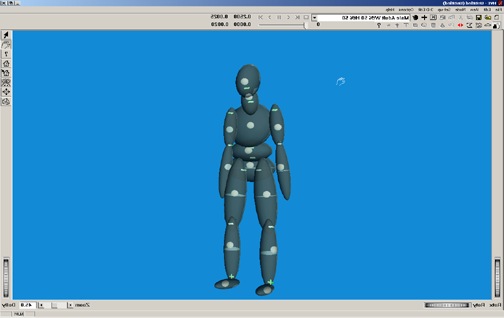
*Figure 5-30: Pedestrian Human in the Human Editor.*

Using these option buttons, click each one to choose the following human attributes:

- Location = Pedestrian
- Sex = Male
- Age = Adult
- Weight Percentile = 50
- Height Percentile = 50

> **NOTE:** Make sure the moment of inertia data for the right and left upper legs are:
> - Ixx (lb-sec²-inch) = 1.3599
> - Jyy (lb-sec²-inch) = 1.4348
> - Kzz (lb-sec²-inch) = 0.3769

> **NOTE:** If you are having difficulty completing this portion of the tutorial, the `GATBcreatePedestrian` file in your `/HVE/supportFiles/case` directory contains all necessary information up to this point.

### Creating the Vehicle

- Choose Vehicle Mode by clicking the Vehicle Mode button on the tool bar. The Vehicle Editor is displayed.
- Click the (+) sign on the toolbar to add a vehicle. The Vehicle Information dialog is displayed. The Vehicle Information dialog allows the user to select the basic vehicle attributes according to Type, Make, Model, Year, and Body Style.

Using the Option buttons, click each one to choose the following vehicle from the database:

- Type = Pickup
- Make = Dodge
- Model = Dakota
- Year = 1987-1996
- Body Style = Fleetside 4x4

- Click OK to add Dodge Dakota 4x4 to the active vehicles list.
- Create the exterior contact panels using the data from Table 5-2.

> **NOTE:** Make sure to select Location: Exterior when creating your contact surfaces, or your pedestrian simulation will generate an error.

> If you are having difficulty in completing this portion of the tutorial, the file `GATBcreateDodgeContacts` in your `/HVE/supportFiles/case` directory contains all necessary information up to this point.

**Table 5-2: Contact Surfaces to use in Pedestrian impact example**

| Name | Coord | First | Middle | Third | Material |
|---|---|---|---|---|---|
| Bumper-Front | X | 80.5 | 80.5 | 77.0 | Default Vehicle |
|              | Y | 0.0 | 0.0 | -25.0 | |
|              | Z | -4.0 | 3.0 | 3.0 | |
| Grill | X | 77.7 | 77.7 | 74.5 | Default Vehicle |
|       | Y | 0.0 | 0.0 | -25.0 | |
|       | Z | -15.0 | -2.0 | -2.0 | |

The completed contact panels are shown in Figures 5-31 and 5-32.

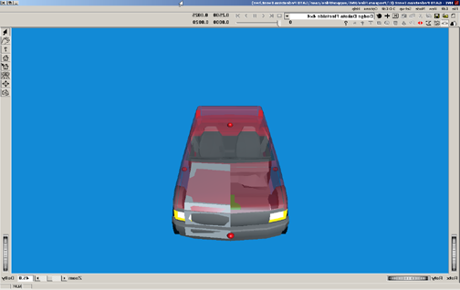
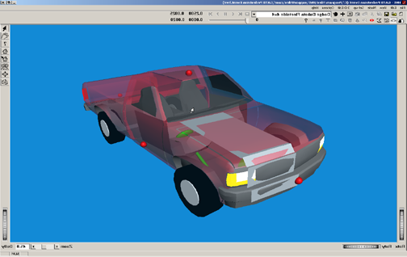
*Figures 5-31 and 5-32: Contact Surfaces on pickup.*

### Creating the Event

- Select the Event Editor by clicking the Event Editor button on the tool bar.
- Click the (+) sign on the tool bar to add an event. The Information Dialog is displayed (Figure 5-33).
- Choose the Dodge Dakota 4x4 and the Male Adult, 50% Wt., 50% Ht. from the Active Vehicles list and Active Humans list, respectively.
- Select GATB from the Calculation Methods options list.
- Edit the Event name: `Pickup/Pedestrian Impact`.
- Press OK to display the event editor.

Select Options from the menu bar and then Simulation Controls from the drop-down menu. Change the following options:

- Simulation Output Time Interval (sec) = 0.002
- Simulation Maximum Time (sec) = 1.0

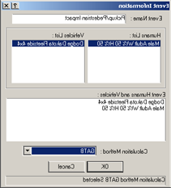
*Figure 5-33: Creating the Pedestrian impact event in the HVE Event Editor.*

Using the Event Editor dialog, select the Dodge Dakota 4x4 from the Event Humans & Vehicles list, then select Edit from the menu bar, choose Position/Velocity and click Initial. The vehicle is displayed at the earth-fixed origin.

Now, let's set up and execute the pedestrian simulation event using GATB.

Enter the following values in the appropriate boxes of the Position/Velocity, Initial dialog (Figure 5-34):

- x (ft) = 15.0
- y (ft) = -5.0
- z (ft) = -2.094
- Roll (deg) = 0.0
- Pitch (deg) = 0.0
- Yaw (deg) = 0.0
- Assigned Velocity (mph) = 15.0

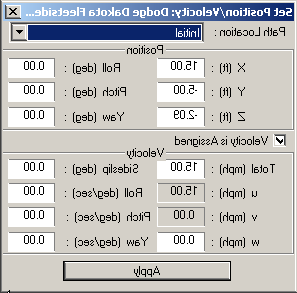
*Figure 5-34: Setting Initial Position / Velocity of Dodge Pickup.*

- Using the Event Editor dialog, select the Human from the Event Humans & Vehicles list, then select Set-up from the menu bar, choose Position/Velocity and click Initial. The human is displayed at the vehicle's origin (notice the human is half-buried in the vehicle geometry; this occurs because AutoPosition does not apply to humans). See Figure 5-35.

Enter the following data in the appropriate fields in the Position/Velocity, Initial dialog:

- x (ft) = 7.15
- y (ft) = -1.5
- z (ft) = -1.0
- Roll (deg) = 0.0
- Pitch (deg) = 0.0
- Yaw (deg) = 120.0
- Assigned Velocity (mph) = 1.0

The effects of these changes are displayed in Figure 5-36.

- Choose Set-up from the menu bar and select Collision Pulse.
- Select Acceleration as the Pulse Type.
- Ensure that in the table there is only one time entry for time 0.000 and that all of the column data is set to 0.000.
- Click OK to close the Collision Pulse window.

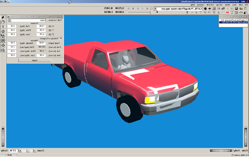
*Figure 5-35: Setting up pedestrian position.*

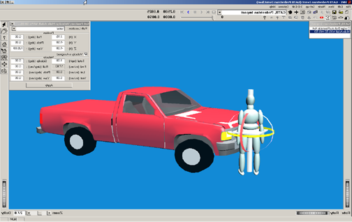
*Figure 5-36: Positioning the human in front of pickup.*

- Choose Set-up from the menu bar and select Contacts. The Contact Interactions dialog box will be shown (Figure 5-37).
- Choose Dodge Dakota Fleetside 4x4 from the object menu in the upper right-hand corner of the window.
- Click on the Select All button underneath the Human Source Object list to allow all human ellipsoids to interact with all of the contact surfaces attached to the Dodge Dakota pickup.
- Click OK to return to the Event Editor.

> **NOTE:** In order to reduce processing time for GATB events, it may be helpful to only designate contact interactions between specific contact surfaces. For example, if we were only examining the ground-feet interaction, we would only need to specify the left and right foot ellipsoids of the human and the GROUND object attached to the Dodge Dakota pickup truck.

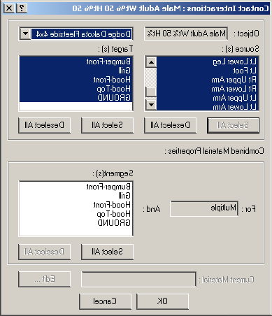
*Figure 5-37: Contact Interactions dialog box.*

In order to examine the interaction between the pedestrian and the GROUND contact panel, we need to set up the Key Results window to show the total force on each of the pedestrian's feet ellipsoids.

- In the Key Results window for the pedestrian, click on the Select Variable button.

In the Output Groups listing, choose the following variables:

- `Contacts:Rt Foot:Rt Foot:Dodge Dakota Fleetside 4x4:GROUND:Cont F tot`
- `Contacts:Lt Foot:Lt Foot:Dodge Dakota Fleetside 4x4:GROUND:Cont F tot`

Your Key Results Window should look like Figure 5-38.

- Execute 1 timestep, rewind to time 0.0 sec, and examine the foot-ground interaction.

> **NOTE:** Total weight of the pedestrian (173.5 lbs in this example) should be approximately equal to total force of both feet interacting with the ground.

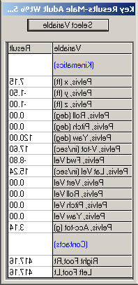
*Figure 5-38: Key Results window.*

Figure 5-38 shows total force from feet-ground contacts to be approximately 834 lbs. We must move the pedestrian up slightly.

- Change the Z position of the pedestrian to -1.053 feet. Results of this change are shown in Figure 5-39.

> **NOTE:** You may find it helpful to edit the `language.rsc` in the `/HVE/supportFiles/sys` directory in order to show 3 decimal digits.

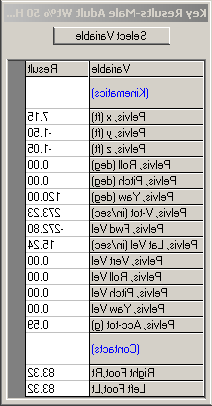
*Figure 5-39: Key Results window.*

We will use the collision pulse to approximate the vehicle braking.

- Enter the following collision pulse for the Dodge Dakota 4x4 (Table 5-3).

> **NOTE:** This crash pulse is available in the file `GATBTutorialPulse3`. Execute the run to analyze pedestrian behavior in this type of crash. The speeds of the vehicle and pedestrian can be modified, as well as braking effort on the pickup. Results of this run are shown in the following figures.

> If you are having difficulty in completing this portion of the tutorial, the file `GATBcreatePedestrianImpact` in your `/HVE/supportFiles/case` directory contains all necessary information up to this point.

**Table 5-3: Collision pulse to approximate hard braking by pickup**

| Time (s) | Forward Acceleration (g's) |
|---|---|
| 0.0 | -0.75 |
| 0.2 | -0.75 |
| 0.4 | -0.75 |
| 0.6 | -0.75 |

Examine Figures 5-40 through 5-43 for views of the pedestrian interaction with the pickup truck. Try several different scenarios, increasing and decreasing the speed of the pickup. Also try changing the initial velocity of the pedestrian to study how the motion across the vehicle changes.

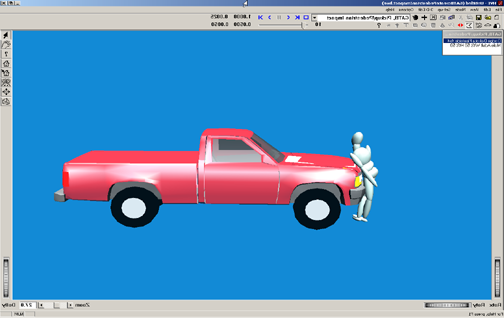
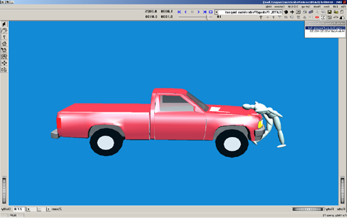
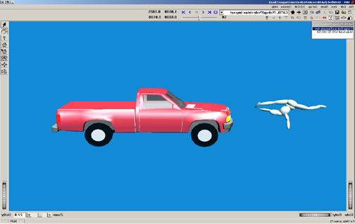
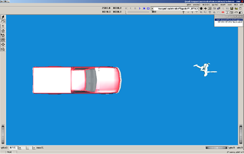
*Figures 5-40 through 5-43: Pedestrian interaction at Time = 0.05, 0.10, 0.50 and 1.00 sec.*

This completes the examples of the pedestrian simulation.

<!-- NAV -->

---

← Previous: [Chapter 4 — Calculation Method](04-calculation-method.md)  |  [Index](README.md)  |  Next: [Chapter 6 — Messages](06-messages.md) →

<!-- /NAV -->
