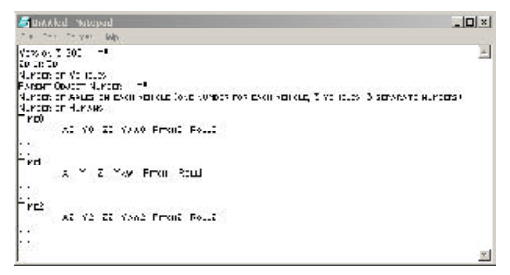
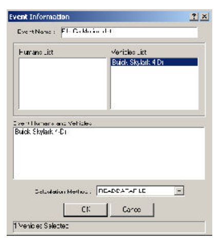
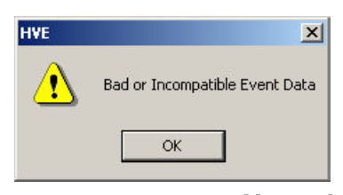

# Chapter 1 — Program Description

## Overview

There are a number of computer simulation programs used in accident reconstruction analysis that have not yet been ported to the HVE computing environment. In an effort to assist the users of these programs, ReadDataFile has been produced. This HVE-compatible program accepts an ASCII data file that contains motion data for selected objects and loads the motion data into HVE. Once this has been accomplished, the standard HVE tools are available to generate a three-dimensional visualization of the data. The ReadDataFile event can also be combined with other HVE events in the Playback Editor.

This program is **not** a simulation, although it may be used to create visualizations of simulation results. The data file must contain time-dependent position data for the objects selected. ReadDataFile interpolates this data and produces an HVE event with the data. In addition, the program calculates the velocity and acceleration data for the objects and places this data in the variable output tables for easy viewing, printing, or graphing.

ReadDataFile can be used with vehicle and human objects. The data contained in the file does not have to be generated with a simulation program. The data may be generated with a spreadsheet or other calculation method, as determined by the requirements of the user.

---

# Chapter 2 — Program Input

## General Use

The ReadDataFile program is used to import time-based positional data into HVE to produce an HVE event representing the motion data contained in a space-delimited ASCII data file. Any type of motion can be defined in the data file, including motion from simulations as well as motion calculated in other ways. For example, a data file can be created that contains the time-position data from a vehicle overturn, a load coming off of a vehicle, a pole falling down, a helicopter landing, etc. Virtually any object motion can be generated using the ReadDataFile program and an appropriate ASCII data file.

The basic file format is shown in Figure 1. Each data file can have time-dependent position data for up to 10 different objects *(updated: verified — the parser rejects events with more than 10 vehicles ("ReadDataFile is limited to 10 objects") and its per-vehicle arrays, `numAxlesInput[10]` and `ObjectParent[10]`, are sized for 10 vehicles; see `ReadDataFileinput.cpp` and `MAX_NUM_VEHICLES` in `ReadDataFiledef.h`)*. The details of the data file format are contained later in this manual, but in general every data file contains six lines at the top of the file describing the data in the file. After these first six lines, the data file contains a time entry followed by all of the position and orientation data for every object for that instant in time. This is followed by the next time entry along with the position and orientation data for that instant in time, and so on.

*Figure 1: General format of data file shown in a Notepad window, \*\* indicates change in format from previous versions. The general layout is: version line; tire-data key; number of vehicles; parent-object numbers; numbers of axles; number of humans; then repeated blocks of a time entry followed by one data line per object.*

The data file format is free-form, meaning spaces are ignored (except to separate data values). Note that there should not be any commas or tab characters in the data file. The data should be separated by one or more spaces. In general it is a good idea to "structure" the data file like the examples shown in this manual, with the time entry on a line by itself followed by a line of data values for each of the separate objects. This is not required but aids in visually checking the data.

> **NOTE:** The initial positions must be specified. They can be entered at 0,0,0 and the program will move them to match the data file. The initial velocity has no effect.

## Implementation

Prior to creating the ReadDataFile event, it is necessary to create the data file containing time-dependent position and orientation data for the various objects whose motion you wish to describe. The file should be of the format described in the previous section of this manual. Once that file is complete and in the correct format, save the file with a `.dat` extension in your HVE directory. For example, a valid file name would be `CarMotion.dat` and a valid path would be `C:\Program Files\HVE\CarMotion.dat`.

*(updated: the current code locates both the data file and its debug file relative to the HVE installation directory derived from the `HVESYSFILES` environment variable — the portion of that path preceding `supportFiles\sys`. The file name embedded in the event name is appended directly to that HVE directory path, so the data file must reside in the HVE program directory. Also note that the internal file-name buffer is `MAXFILENAMELEN` = 30 characters, so keep the data file name short.)*

To create a ReadDataFile event:

1. Create the object or objects whose motion you wish to describe using either the Human Editor or the Vehicle Editor.
2. Click on the Event Editor button to enter the Event Editor.
3. Click on the (+) sign to add an event. In the Event Name field enter `File:FILENAME`, where *FILENAME* is the title of the motion data file.  Figure 2 shows a sample Event Information dialog window. *(updated: the code extracts the file name by skipping exactly the five characters of the `File:` prefix in the event name, so the event name must begin with `File:` followed immediately by the data file name.)*
4. Select the objects in the Event Humans & Vehicles dialog box in the order that their motion data appears in the data file.
5. Set the Calculation Method type to *ReadDataFile* (shown as READDATAFILE in the method list).
6. Click OK to create the event.

*Figure 2: Event Information dialog window, showing an event named "File:CarMotion.dat" with a Buick Skylark 4 Dr selected and Calculation Method READDATAFILE.*

If an error message is printed, such as the one shown in Figure 3 ("Bad or Incompatible Event Data"), there could be a problem with the format of the data in your motion data file, or the data file may not be in the HVE directory. Verify that the proper number of objects are selected and that the motion data file describes the motion of the same number of objects. Another option when troubleshooting an error message when executing a ReadDataFile event is to view the debug file in the HVE program directory using a text viewer. This file contains information regarding the operation of ReadDataFile when trying to access your data file and may indicate where the error lies.

*(updated: the 2004 manual calls this debug file `ReadDataFileDebug.prn` in `C:\Program Files\HVE`. The current code writes it as `ReadDataDebugFile.prn` in the HVE program directory derived from the `HVESYSFILES` environment variable; see `ParseHveInput()` in `ReadDataFileinput.cpp`. The debug file echoes the expected basic file format, the header values as they are read, the number of data lines expected per time increment, and the ending time and time increment.)*

Once the event is created without any error messages, set the initial position for all of the objects contained in the event to arbitrary values. Since the initial positions and orientations of the objects are contained in the data file, HVE will discard these arbitrary entries and use the data file values for the initial position and orientation in the ReadDataFile event.

Click on the execute button to execute the ReadDataFile event.

*Figure 3: Error Message returned by ReadDataFile — an HVE alert dialog reading "Bad or Incompatible Event Data".*

<!-- NAV -->

---

← Previous: [ReadDataFile — User's Manual](README.md)  |  [Index](README.md)  |  Next: [Chapter 3 — Calculation Method](02-calculation-method.md) →

<!-- /NAV -->
