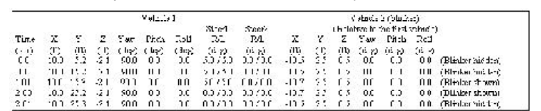
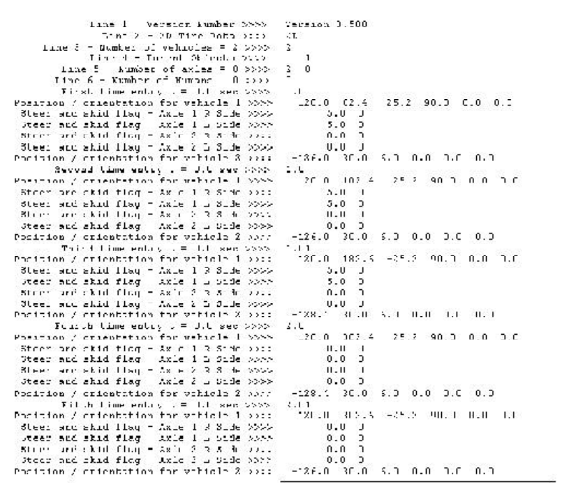

# Chapter 4 — Data File Format

## Overview

ReadDataFile requires a certain format for any data file that is to be used to describe vehicle motion. It is made up of a number of header lines followed by the time-dependent position and orientation data for each object to be included in the ReadDataFile event. All data contained in the data file should be space delimited. The following portions of this chapter explain this format.

## Header Format

The header of the ReadDataFile data file must contain six lines before any time-dependent data. These lines are used to specify the type of data that is contained in the file.

- **First Line** — contains the version number. The version number is used to determine possible options and data format changes from one version to another.

  *(updated: verified in `getFileDefinition()` in `ReadDataFileinput.cpp`. The line has the form `Version 3.500` — a word beginning with `V` or `v` followed by the version number. If this line is missing, the file is read as version 3.200 format, in which case the parent-object line (fourth line, below) must be omitted. The parent-object line is read only when the file version is 3.5 or later.)*

- **Second Line** — contains a key word, either `2D` or `3D`, to specify whether the data will be 2-dimensional tire data or fully 3-dimensional tire data.

  *(updated: the parser accepts `2D` or `2d` for two-dimensional data, but due to a quirk in the comparison logic only the uppercase `3D` is recognized for three-dimensional data — always write the key in uppercase.)*

The difference between 2D and 3D tire data is that 2D data only requires (and uses) the steer angle for all the axles specified along with the skid flag. Therefore, for 2D tire data only two data values are required for each specified axle for each time in the data file. For every axle there will be two lines of data, the first for the right side and the second for the left side. If only one axle is specified then it will reference the front axle. For a tractor truck with three axles, the first axle is the steer axle, the second axle is the front drive axle, and the third axle is the aft drive axle. If the number of axles is set at two for a three-axle vehicle then the steer axle and front drive axles would require two data lines each (right and left).

3D tire data contains more information. The displacement from normal position (x, y, z), the orientation from normal (steer, spin, camber or yaw, pitch, roll), the skid flag, and the contact location of the tire on the ground (cX, cY, cZ — used to draw skid) are all required for each time step. There are 10 data values required for each time step and each axle *side* for 3D tire data. Note that the ground contact (cX, cY, cZ) are relative to the world fixed coordinate system and the displacements and angles are with respect to the normal tire position.

*(updated: verified against `ReadDataFiledef.h` (`TIRE_ITEMS2D` = 2, `TIRE_ITEMS3D` = 10) and `ComputeData()` in `ReadDataFilemain.cpp`. The ten 3D values are read in the order: x y z yaw pitch roll skid-flag cX cY cZ. The x, y, z displacements are added to the wheel location defined in the Vehicle Editor; the contact-point z is raised 0.02 inches when drawn so the skid appears just above the road surface. The skid flag (0 = not skidding, 1 = skidding) and contact point are applied to both tires of a dual pair; for 2D data the contact points of dual tires are offset laterally from the wheel location by half the tire spacing.)*

- **Third Line** — Number of vehicles that this data file has data for.

- **Fourth Line** — Indicates the parent object for each of the objects. This allows relative motion of one object with respect to another.

For instance, relative data can be used to specify a windshield wiper rotating on the "parent" object. In this case the relative motion is simply rotational and the position does not move relative to the parent, even though the wiper may be moving relative to the world coordinates. Use zero (0) to indicate motion relative to the world, or the number of the object in the object list for relative motion. For example, if there are three vehicles in the event, specifying a "1" will cause motion in the data file to be relative to the first vehicle. There should be an entry on this line for every vehicle in the event, and they may all be zero. Entries, as always, should be separated by spaces. Also, the parent object must be specified prior to the child object. In other words, the second vehicle CANNOT be specified relative to the third vehicle... the parent must be specified before the child.

*(updated: verified — the parser rejects the file with an error if the first vehicle's parent is not 0 ("FIRST VEHICLE MUST REFERENCE THE FIXED COORD. SYSTEM") or if any vehicle's parent number is greater than its own position in the list ("Parent Vehicle MUST be defined before child vehicle"). For a child object, the interpolated position is transformed through the parent's position and orientation, and the child's yaw/pitch/roll are added to the parent's angles — see `TransCoords()` in `TransCoord.cpp`.)*

- **Fifth Line** — Number of axles on each of the vehicles.

A number must be included for each vehicle in the ReadDataFile event. If the third line has the number "3" then there should be three numbers on this line. The first number indicates how many axles the first vehicle has, the second number on this line would be the number of axles for the second vehicle, etc. Again, these values should be separated by spaces. If there is no requirement to show the wheels moving at all then the number of axles can be set to zero. In most cases, there is no need to put any of the tire data in the data file because the visualization will show the tires in the normal position and orientation throughout the run (i.e. displacement and angles will all be set to zero).

- **Sixth Line** — Number of humans that this data file has data for.

Human data are specified differently than vehicles. For a human, the only position data required is for the pelvis segment. The orientation data (yaw, pitch, roll) is specified for the pelvis as well as the other fourteen mass segments. The first data line contains six data values (x, y, z, yaw, pitch, roll) and the next 14 lines contain only three data values, the orientations relative to the parent segments. Again, all data values should be separated by spaces.

*(updated: verified — humans are always read as 15 segments (`MAXHVESEGMENTS` = 15 in `Physics/Include/Hvedef.h`): one 6-value line for the lower torso (pelvis) followed by 14 3-value joint-orientation lines (`MAXHVEJOINTS` = 14). Note also that the current code positions the human's main segment relative to the *first* vehicle's coordinate system, and its internal logic assumes one human and one vehicle in the event — see `CalcMethodInfo()` in `ReadDataFileinput.cpp`.)*

## Data Values

Vehicle data specified in the data file is to be given with respect to the world coordinate system as defined in HVE. Times are indicated in seconds, positions in inches, and orientations in degrees. Vehicle-trailer combinations are treated like separate vehicles in ReadDataFile. This allows for detailed motion to be specified by the user. For example, a user can demonstrate a trailer becoming separated from its towing vehicle. This requires that the position and orientation of the trailer be specified just like any other vehicle (x, y, z, yaw, pitch, roll) all relative to the world-fixed coordinate system. This differs from using a vehicle-trailer combination in a physics module, such as SIMON, where the physics module determines that the towing vehicle and trailer are to be hitched together throughout the simulation.

If the value for Number of Axles is set to zero for any vehicle there will not be any data lines for those wheels reported in the Key Results window or the Playback Editor. When any wheel data is omitted in this way, the wheels will simply appear in the locations specified in the Vehicle Editor.

Human data is entered relative to the vehicle-fixed coordinate system.

*(updated — order of values within a data line, verified in `ComputeData()`: each vehicle line is read as `X Y Z Yaw Pitch Roll`; internally the program reorders the angles to roll-pitch-yaw for HVE. Each time block consists of the time value followed by, for each vehicle in order: one vehicle line, then the tire lines (2 or 10 values each) for each axle, right side then left side; then, for each human: the 6-value pelvis line and 14 joint lines. The total number of data items per time block is limited to 100 (`MAX_POSSIBLE_OBJECTS` in `ReadDataFiledef.h`). Do not use commas or tabs — every value is read with a whitespace-delimited numeric read, and a non-numeric token ends the run as if the end of file had been reached.)*

## Examples

For the purposes of the examples, the values contained within the bounding code blocks below are the actual contents of the ASCII data file. The commentary describes what the values within the blocks represent.

### Example 1

This example will use the simplest data file that can be accepted into ReadDataFile. This data file contains the six required header lines and only two time entry lines for a single vehicle. In this simple case we will not produce tire data by setting the number of axles to zero. We will, however, set the tire code to 2D, use one vehicle, zero axles, and zero humans. The time dependent position data is outlined in Table Ex-1.

**Table Ex-1: Example 1 positional and orientation data**

| Time (sec) | X (ft) | Y (ft) | Z (ft) | Yaw (deg) | Pitch (deg) | Roll (deg) |
|---|---|---|---|---|---|---|
| 0.0 | 10.0 | 5.2 | -2.1 | 90.1 | 0.0 | 0.0 |
| 5.0 | 115.0 | 7.2 | -2.1 | 90.1 | 0.0 | 0.0 |

The corresponding data file is shown in Figure Ex-1. Recall that the positional data contained in the data file is in inches (the table above is in feet). Note that there are no commas in the data file and that the file is free-style format. The numbers do not have to be aligned in specific columns, there are no required decimals, etc.

**Figure Ex-1: Completed data file for Example 1**

```
Version 3.500
2D
1
0
0
0
0.0
   120.0  62.4  -25.2  90.1  0.0  0.0
5.0
   1380.0  86.4  -25.2  90.1  0.0  0.0
```

Line by line: line 1 = version number; line 2 = 2D tire data; line 3 = number of vehicles = 1; line 4 = parent objects; line 5 = number of axles = 0; line 6 = number of humans = 0; then the first time entry (t = 0.0 sec) followed by the position/orientation for vehicle 1, and the second time entry (t = 5.0 sec) followed by the position/orientation for vehicle 1. *(Figure reconstructed from the source scan.)*

### Example 2

This example is a little more complicated. It involves three vehicles but no axles. The time dependent data is shown in Table Ex-2.

**Table Ex-2: Example 2 data set** *(values in feet and degrees)*

| Time (sec) | Vehicle 1 X, Y, Z, Yaw, Pitch, Roll | Vehicle 2 X, Y, Z, Yaw, Pitch, Roll | Vehicle 3 X, Y, Z, Yaw, Pitch, Roll |
|---|---|---|---|
| 0.0 | 10.0, 5.2, -2.1, 90.1, 0.0, 0.0 | 20.0, 17.4, -2.5, 0.0, 0.0, 0.0 | 40.0, -15.0, -2.0, 180.0, 0.0, 0.0 |
| 5.0 | 115.0, 7.2, -2.1, 90.1, 0.0, 0.0 | 125.0, 17.4, -2.5, 0.0, 0.0, 0.0 | -50.0, 25.0, 2.0, 180.0, 0.0, 0.0 |

The data file for this more complicated example is shown in Figure Ex-2.

**Figure Ex-2: Data file for Example 2**

```
Version 3.500
3D
3
0 0 0
0 0 0
0
0.0
   120.0   62.4  -25.2   90.1  0.0  0.0
   240.0  208.8  -30.0    0.0  0.0  0.0
   480.0 -180.0  -24.0  180.0  0.0  0.0
5.0
   1380.0   86.4  -25.2   90.1  0.0  0.0
   1500.0  208.8  -30.0    0.0  0.0  0.0
   -600.0  300.0   24.0  180.0  0.0  0.0
```

Line by line: line 1 = version number; line 2 = tire data key; line 3 = number of vehicles = 3; line 4 = parent objects (all world-fixed); line 5 = number of axles = 0 0 0; line 6 = number of humans = 0; then each time entry followed by one position/orientation line per vehicle. *(Figure and table reconstructed from the source scan; a few digits were illegible in the source scan and are approximate, but the structure is exact.)*

### Example 3

Example 3 is a complex example with two vehicles with two axles each. Using only the 2D tire data, only the steer angle and skid flag are used. For simplicity in this example the skid flags will be set to zero. The position and steer data are shown in Table Ex-3. *(Table Ex-3 — two vehicles, each with X, Y, Z, Yaw, Pitch, Roll plus front-axle right/left steer values at times 0.0 and 5.0 sec. Individual values are reproduced in the data file below.)*

The data file for Example 3 is shown in Figure Ex-3 below.

**Figure Ex-3: Data file for Example 3**

```
2D
2
2 2
0
0.0
   120.0  62.4  -25.2  90.1  0.0  0.0
   8.0  0
   8.0  0
   0.0  0
   0.0  0
   240.0  208.8  -30.0  0.0  0.0  0.0
   0.0  0
   0.0  0
   0.0  0
   0.0  0
5.0
   1380.0  86.4  -25.2  90.1  0.0  0.0
   7.0  0
   8.0  0
   1.0  0
   0.0  0
   1200.0  200.0  -30.0  0.0  0.0  0.0
   7.0  0
   8.0  0
   1.0  0
   2.0  0
```

Line by line: line 1 = 2D tire data key; line 2 = number of vehicles = 2; line 3 = number of axles for each of the 2 vehicles; line 4 = number of humans = 0; then, for each time entry: the position/orientation line for vehicle 1 followed by its steer-and-skid-flag lines (axle 1 right side, axle 1 left side, axle 2 right side, axle 2 left side), then the same set of lines for vehicle 2. *(Figure reconstructed from the source scan; some steer-angle digits are approximate.)*

*(updated: note that the Example 3 file in the original manual has no `Version` line. Verified against the parser: such a file is read as version 3.200 format, which is why it also has no parent-object line — the header is only five lines in that case.)*

### Example 4

Example 4 is a complex example with two vehicles (a truck with a blinker), two axles on the first vehicle, zero axles on the blinker object. Using only the 2D tire data, only the steer angle and skid flag are used. For simplicity in this example the skid flags will be set to zero. All motion for the first vehicle is relative to the world-fixed coordinate system while the motion for the blinker object is relative to the first vehicle.


*Table Ex-4: Example 4 data set. It lists five time entries; the first vehicle drives forward with steer inputs on axle 1, while the blinker object's X position relative to the first vehicle alternates between a location hidden inside the truck geometry and a location aft of it, with annotations "(Blinker hidden)" / "(Blinker shown)" at alternating times to make the blinker flash. (The source scan limits the legibility of individual digits.)*

In this case the second vehicle should be of "type" Fixed Barrier so that no tires are shown. The geometry file should be a small disc or other shape of the correct size for a blinker. The blinker color should be set correctly and the emissiveColor parameter should be set in the geometry file. Essentially, the motion file "hides" the blinker inside the vehicle geometry, then moves it rearward (relative to the parent vehicle) very quickly.

The header portion of the Example 4 data file has the following structure (note that because relative motion is used, the file must be version 3.5 or later so that the parent-object line is present):

```
Version 3.500
2D
2
0 1
2 0
0
```

Line by line: line 1 = version number; line 2 = 2D tire data; line 3 = number of vehicles = 2; line 4 = parent objects (vehicle 1 relative to the world, vehicle 2 — the blinker — relative to vehicle 1); line 5 = number of axles = 2 and 0; line 6 = number of humans = 0. Each of the five time entries is then followed by: the position/orientation line for vehicle 1, four steer-and-skid-flag lines (axles 1 and 2, right then left sides), and the position/orientation line for the blinker object relative to vehicle 1. Because the blinker has zero axles, no tire lines follow it.


*Figure Ex-4: Data file for Example 4 — the complete annotated five-time-block listing. (The source scan is too degraded to reproduce the individual data values reliably as text.)*

<!-- NAV -->

---

← Previous: [Chapter 3 — Calculation Method](02-calculation-method.md)  |  [Index](README.md)

<!-- /NAV -->
