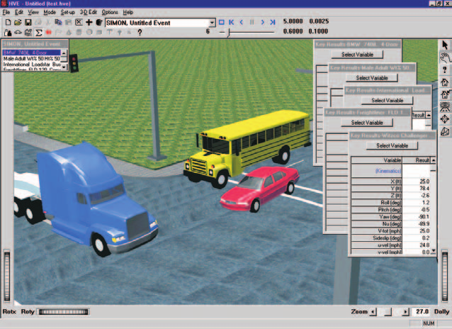

# Chapter 1 — SIMON Program Description

## Overview

SIMON (**SI**mulation **MO**del **N**on-linear) is a dynamic simulation of the response of one or more vehicles to driver inputs, inter-vehicle collision(s) and factors related to the environment (e.g., terrain, atmosphere). SIMON is a simulation model built on a general-purpose 3-D vehicle dynamics engine developed by Engineering Dynamics Corporation. The dynamics engine allows a sprung mass with six degrees of freedom and multiple axles with up to five degrees of freedom per axle. SIMON was specifically designed to take advantage of the rich feature set available in the HVE simulation environment, including the HVE Brake Designer, Driver Model and Tire Blow-out Model.

## General Features and Capabilities

Each SIMON vehicle may have up to three axles (six axles for full trailers) and single or dual tires. Independent and solid axle suspensions are allowed. SIMON may be used for numerous types of simulation studies. Applications for SIMON include:

- **Single Vehicle Simulation** — SIMON's 3-D simulation model incorporates robust tire and suspension models required for vehicle handling simulation studies, including rollover.
- **Articulated Vehicle Simulation** — SIMON also simulates the dynamics of articulated multi-vehicle trains. The model is general and allows the user to model virtually any vehicle/trailer configuration.
- **Collision Simulation** — SIMON incorporates DyMESH, a general-purpose, 3-D collision model for simulating vehicle-to-vehicle and vehicle-to-barrier collisions.
- **Vehicle Design** — SIMON may be used for vehicle design projects involving suspension, brake (including ABS), tire and steering systems. Using SIMON, these systems may be optimized on the computer before expensive prototyping and testing begins. Parametric studies involving in-use factors, such as weight distribution changes due to occupant loading and payload location, may also be performed.
- **Safety Research** — Safety researchers may use SIMON for reconstructing most crashes involving single or multiple vehicles. Human, vehicle and environment factors may be simulated and evaluated to assist in performing detailed crash studies.

*Figure 1-1: SIMON Event.*

## Model Inputs

SIMON inputs include one or more vehicles. Articulated vehicles are created from individual unit vehicles using compatible front and rear connections. Full trailers are created using a semi-trailer and a front dolly.

Human occupants may also be included in SIMON. Placing a human in a vehicle affects the vehicle's inertial properties and weight distribution; however, human motion relative to the vehicle is not modeled.

An environment is optional. If supplied, the environment may be a simple flat surface or complex 3-D digital terrain map (DTM) from a total station survey. An unlimited number of friction zones may be supplied.

## Model Outputs

SIMON output reports include the following HVE Output Reports:

- Accident History
- Damage Data
- Damage Profiles
- Driver Controls
- Environment Data
- Event Data
- Human Data
- Messages
- Program Data
- Trajectory Simulation
- Variable Output
- Vehicle Data

## Validation

The validation of SIMON for unit vehicle (UV), articulated vehicle (AV) and vehicle collision (VC) simulation has been completed and is available in Reference 17. A summary of the validation test matrix is shown in Table 1-1.

This test matrix represents a cross-section of the types of events for which SIMON was intended. It is anticipated that additional validations will be published as they are performed.

**Table 1-1 SIMON Validation Study. Matrix of test configurations.**

| Test | Description | Validation By |
|------|-------------|---------------|
| UV-1 | Passenger Car Combined Steering and Braking [12] | Experiment, EDVSM |
| UV-2 | Passenger Car Alternate Ramp Traversal [12] | Experiment, EDVSM |
| UV-3 | Light Truck Rollover [13] | Experiment, EDVSM |
| UV-4 | Straight 3-Axle Truck (30 mph), Combined Braking and Steering [14] | Experiment, EDVDS |
| AV-1 | Chevrolet Pickup (55 mph) towing Open-wheel Utility Trailer, ISO Lane-change with braking | EDSMAC4 |
| AV-2 | Tractor-trailer (27 mph), Combined Braking and Steering (U of M) [14] | Experiment, EDVDS |
| VC-1 | 1992 Ford Explorer (45.9 mph) vs. 1984 Ford F-150 Pickup (46.1 mph), 55 Degree Angled Impact [15] | Experiment, EDSMAC4 |
| VC-3 | 1974 Ford Torino (21.23 mph) vs. 1974 Ford Pinto (0 mph), 10 Degree Offset Rear-end Impact (Calspan, RICSAC 3) [16] | Experiment, EDSMAC4 |
| VC-7 | 1974 Chev Chevelle Malibu (31.53 mph) vs. 1974 Ford Pinto (31.53 mph), 60 degree Angled Impact (Calspan, RICSAC 2) [16] | Experiment, EDSMAC4 |
| VC-8 | 1974 Chev Chevelle Malibu (21.47 mph) vs. 1975 Volkswagen Rabbit (21.47 mph), 60 degree Angled Impact (Calspan, RICSAC 6) [16] | Experiment, EDSMAC4 |
| VC-11 | 1974 Honda Civic CVCC (31.35 mph) vs. 1974 Ford Torino (31.35 mph), 90 Degree Angled Impact (Calspan, RICSAC 10) [16] | Experiment, EDSMAC4 |

## Basic Procedure

The procedure for using SIMON is essentially the same as using any simulation model in the HVE environment:

- Use the HVE Human Editor to add one or more human occupants or pedestrians to the case (this step is optional).
- Use the HVE Vehicle Editor to add one or more vehicles to the case. Optionally, edit any of the default vehicle parameters.
- Optionally, use the HVE Environment Editor to create an environment. A 2- or 3-dimensional terrain may also be added.
- Use the HVE Event Editor to set up and execute the SIMON simulation model by performing the following steps:
  - Choose the humans and vehicle(s) in the desired order.

    > **NOTE:** The order determines how articulated vehicles are connected: a vehicle without a front connection is assumed to be a unit vehicle or the first vehicle in a vehicle train.

    > **NOTE:** The order in which humans are selected determines the vehicles in which the human(s) are riding: a human is riding in the first vehicle preceding it in the selection list.

  - Choose the SIMON simulation model.
- The next step is to set up the event. For each human and vehicle in the Event Humans and Vehicles list:
  - Position the object in the environment (or vehicle, in the case of human occupants) and supply a velocity.
  - Optionally, assign Driver Controls (Steering, Braking, Throttle, Gear Selection).
  - Optionally, assign a collision pulse.
  - Optionally, assign a payload.
  - Optionally, assign tire blow-out, wheel displacement and/or brake temperature and adjustment data.
  - Optionally, assign locations for one or more accelerometers.
- Execute the simulation event.
- Modify the initial conditions, driver controls and other parameters as required to achieve the desired match between simulation and test conditions.
- Use the HVE Playback Editor to view the various reports.
- If desired, produce a simulation movie of the simulation.

<!-- NAV -->

---

← Previous: [SIMON — Simulation Model Non-Linear](README.md)  |  [Index](README.md)  |  Next: [Chapter 2 — SIMON Program Input](02-program-input.md) →

<!-- /NAV -->
