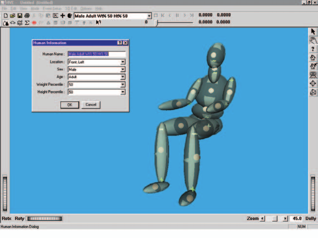
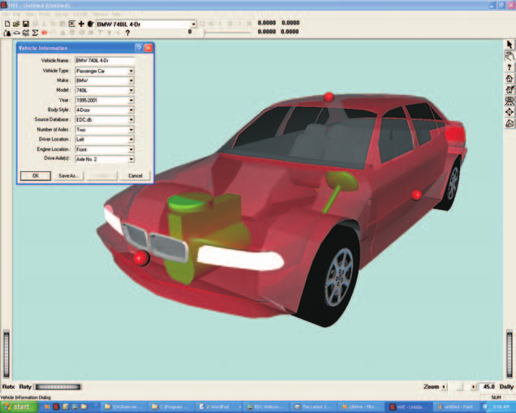
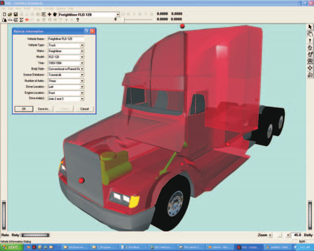
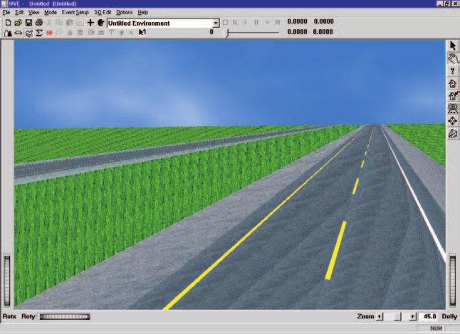
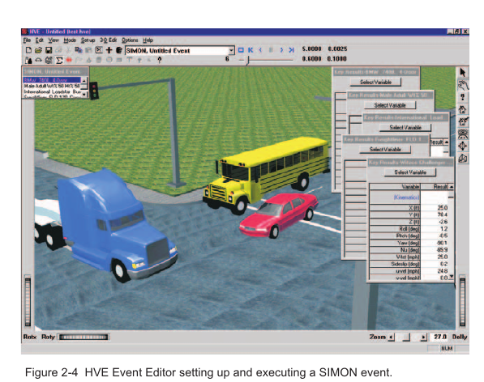
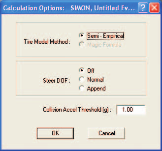
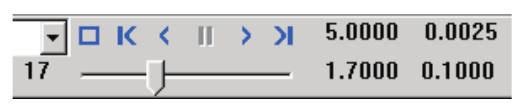

# Chapter 2 — SIMON Program Input

This chapter defines the objects (humans, vehicles and environment) and the event set-up parameters (positions, velocities, driver controls, and so forth) used by the SIMON analysis. In general, the chapter is divided into the following sections:

- **Objects** — The number of humans and vehicles, and the specific human, vehicle, and environment parameters actually used by SIMON.
- **Events** — The various HVE options available for setting up and executing a SIMON event.

## Objects Overview

The objects used by the SIMON model are:

- **Humans** — Human occupants may be placed in vehicles in SIMON, and human pedestrians may be placed in environments in SIMON.
- **Vehicles** — An infinite number of vehicles may be studied by SIMON.
- **Environment** — Like the *real* world, SIMON has exactly one environment.

> **NOTE:** The environment is used in any HVE-compatible reconstruction or simulation model.

The following sections describe how the humans, vehicles and environment provide the required inputs to the SIMON calculation model.

## Humans

SIMON uses humans created using the HVE Human Editor (Figure 2-1). Humans are selected from the Human Database by choosing the following attributes:

- **Location** — SIMON supports all occupant locations (pedestrians will appear in the event but are not used in SIMON calculations)
- **Sex** — SIMON supports both male and female
- **Age** — Adult or child (specified by years of age)
- **Weight Percentile** — SIMON supports all available weight percentiles
- **Height Percentile** — SIMON supports all available height percentiles

To add a human to the current HVE case, perform the following steps:

1. Choose Human mode. The Human Editor is displayed.
2. Choose *Add New Object*. The Human Information dialog is displayed.
3. Click on the *Location, Sex, Age, Weight Percentile,* and *Height Percentile* option buttons to select a human from the database.
4. Enter a name for the current human. A default name is supplied for each selected human. The name is user-editable, and does not affect calculations.

   > **NOTE:** Duplicate human names are not allowed in the same case.

5. Click *OK* to add the human to the current case.

*Figure 2-1: HVE Human Editor.*

> **NOTE:** SIMON is not a human simulator. During simulation, the human occupants do not move relative to the vehicle.

The following human parameters are used by SIMON:

- Inertia
  - Weight

### Inertia

#### Weight

SIMON uses the total weight of the human in order to adjust the inertial properties of the vehicle sprung mass. The weights of all ellipsoids are added together to compute the total human weight. The total weight is applied to the vehicle at the vehicle-fixed coordinates of the pelvis CG. Neither the rotational segment inertias nor the body configuration is used by SIMON.

## Vehicles

SIMON uses vehicles created using the HVE Vehicle Editor (Figure 2-2). Vehicles are selected from the Vehicle Database by choosing the following attributes:

- **Type** — SIMON supports all vehicle types including: *Passenger Car, Pickup, Van, Sport-Utility, Truck, Trailer, Dolly, Fixed Barrier* and *Movable Barrier*.
- **Make** — SIMON supports all available vehicle makes.
- **Model** — SIMON supports all available vehicle models, within the limits defined by number of axles; see below.
- **Year** — SIMON supports all available vehicle years.
- **Body Style** — SIMON supports all available vehicle body styles.

Each vehicle also has the following additional user-editable parameters:

- **Number of Axles** — SIMON supports 0-, 1-, 2- and 3-axled vehicles.
- **Driver Location** — The *Driver Location* is not used by SIMON. However, if *Driver Location* is *None*, the Driver Controls (Steering, Brakes, Throttle, Gears) will not be available during Event mode.
- **Engine Location** — The Engine Location is not used by SIMON. However, if *Engine Location is None*, the Throttle and Gear Tables will not be available during Event mode.
- **Drive Axle(s)** — SIMON supports all drive axles.

To add a vehicle to the current HVE case, perform the following steps:

1. Choose Vehicle mode. The Vehicle Editor is displayed.
2. Choose *Add New Object*. The Vehicle Information dialog is displayed.
3. Click on the *Type, Make, Model, Year* and *Body Style* option buttons to select a vehicle from the database.
4. If desired, modify the *Number of Axles, Driver Location, Engine Location* and *Drive Axle(s)* for the current vehicle.
5. Enter a name for the current vehicle. A default name is supplied for each selected vehicle. Its name is user-editable, and does not affect calculations.

   > **NOTE:** Duplicate vehicle names are not allowed in the same case.

6. Click *OK* to add the vehicle to the current case.

*Figure 2-2: HVE Vehicle Editor showing a passenger car and a truck.*

The following Vehicle Parameter groups are used by SIMON:

- Sprung Mass
  - Inertias
  - Move CG
  - Connections
  - Aerodynamic Drag
  - Body Torsion
  - Geometry File
- Unsprung Mass
  - Suspension Data
  - Brake Data
  - Tire Data
  - Wheel Location
- Steering System
- Braking System
- Drivetrain
  - Engine
  - Transmission
  - Differential
  - Inertia
- Exterior Stiffness

The specific data used in each of the above parameter groups are defined in Tables 2-1 through 2-5.

### Sprung Mass

The Sprung Mass parameters are shown in Table 2-1. Information on each group is provided below.

**Table 2-1 Vehicle Sprung Mass Parameters Used By SIMON.**

| Parameter | Description |
|-----------|-------------|
| Sprung Weight | Weight of vehicle sprung mass |
| Sprung Mass Roll, Pitch and Yaw Inertia, and x-z Product of Inertia | Rotational inertia of sprung mass about the vehicle-fixed x, y and z axes, respectively, and x-z product of inertia |
| Move CG x, y, z | Relocates the CG in the vehicle-fixed x, y and z directions. This entry causes an automatic adjustment of all vehicle coordinate-related parameters (e.g., contact surface, belt anchor points). |
| Geometry File | Vehicle exterior 3-D mesh and dimensions used by DyMESH |
| Inter-vehicle Connections | Type, location, and properties of front and rear connections |
| Aerodynamic Drag | Drag coefficient, projected surface area, and center of pressure x, y, z coordinates for each surface or device that is defined as installed |

#### Inertias

SIMON uses the sprung vehicle weight (converted to mass according to the current gravitational constant; see Environment), as well as the roll, pitch, and yaw rotational inertia and x-z product of inertia of the sprung mass.

The total weight is often entered because it is the value traditionally obtained from data sources. However, the equations of motion require that the sprung mass be known. To obtain this value, SIMON simply deducts the weight of the suspensions and wheels from the total weight.

#### Move CG

Move CG is not directly used by SIMON, i.e., the current values do not show up in the SIMON results. However, the Move CG fields may be used in the Vehicle Editor to quickly move the vehicle's center of gravity; the x, y, z coordinates for the wheels and other vehicle-fixed components are updated to reflect the new CG location.

#### Geometry File

The Geometry File supplies the vehicle exterior vertex data used by DyMESH.

#### Contact Surfaces

Contact Surface parameters are not used by SIMON.

#### Belt Restraints

Belt Restraint parameters are not used by SIMON.

#### Airbag Restraints

Airbag Restraint parameters are not used by SIMON.

#### Inter-vehicle Connections

Inter-vehicle Connection parameters define the type, location and mechanical properties of the front and rear vehicle connections. The x, y, and z location is specified relative to the vehicle CG. The z coordinates for each vehicle determine the elevation at the connection point, and thus establish the pitch angle of the trailer.

Dollys may be either *fixed* or *converter* dollys. A fixed dolly is permanently attached to the front of the trailer and normally has a hinged drawbar. A converter dolly is removable. It normally has a hinged fifth wheel and a fixed drawbar. See Chapter 4 for more information about drawbar types and their characteristics.

The *Connection Friction, Radius* and *Maximum Articulation Angle* are only supplied for the rear connections.

> **NOTE:** Every trailer will have a pre-defined front connection. However, not every tow vehicle has a pre-defined rear connection. Use the Vehicle Editor to confirm the vehicle has a connection.

#### Drag Forces

Aerodynamic drag forces are allowed to act on up to six surfaces (front, rear, right, left, top, bottom) and two user-defined devices (e.g. front or rear wing). These forces are functions of projected area, *Aerodynamic Drag Coefficient*, wind speed and air density. By default, the front surface is assigned aerodynamic properties. Assignment of aerodynamic properties for other surfaces is left up to the user. See Chapter 4 for more information about aerodynamic drag forces.

### Unsprung Mass

The Unsprung Mass parameters used by SIMON are shown in Tables 2-2 and 2-3. Information on each group is provided below.

#### Wheel Location

SIMON allows for the definition of x, y, z coordinates for each wheel center without any assumption of vehicle symmetry. The specific parameters used by SIMON are shown in Table 2-2.

> **NOTE:** SIMON uses $z_{wheel}$ and the tire radius (see Tire Parameters) to calculate static CG elevation above ground.

> **NOTE:** It is possible, therefore, that one tire, on a four wheeled vehicle, could be out of contact with the ground in both static and dynamic conditions.

#### Brake

SIMON uses Time Lag and Time Rise in controlling brake torque application. Each wheel's brake assembly optionally can be described using the HVE Brake Designer (see HVE User's Manual, Section Eleven, Chapters 29 and 30, and reference 1). SIMON does not use the wheel brake system Antilock Effectiveness. Instead, SIMON uses the HVE ABS Model to simulate ABS. This is a robust, algorithm-driven ABS simulation model. See also Brake System (later in this chapter), HVE User's Manual, Chapter 31, *Anti-lock Braking Systems*, and references 10 and 11.

**Table 2-2 Vehicle Unsprung Mass, Wheel and Brake Parameters Used By SIMON.**

| Parameter | Description |
|-----------|-------------|
| Wheel Location | Vehicle-fixed x, y, z coordinates for each wheel |
| Brake Time Lag, Brake Time Rise | Time delay from initiation of pedal force to initiation of brake pressure at the wheel, and amount of time necessary to build up brake torque after pressure reaches the wheel |
| Brake Assembly Type, Brake Push-out Pressure, Brake Torque Ratio | Type of generic, disc, or drum brake (Brake Designer), and physical parameters of the brake system |
| Brake Proportioning Ratio, Brake Pstart | Ratio for splitting brake pressure between front and rear brakes, and pressure at which proportioning begins |
| ABS Wheel Data Parameters | Algorithm-dependent parameters used by the selected ABS model (see Brake System) |

#### Tire

SIMON uses a modified version of the EDC Semi-empirical Tire Model developed for EDVDS [2, 3]. The HVE tire parameters provide the following data groups:

- Physical Data
- Friction Table
- Cornering Stiffness Table
- Camber Stiffness Table
- Slip vs. Rolloff Table

SIMON's use of these parameters is described below and in Table 2-3.

##### Physical Data

The Tire Physical Data used by SIMON are shown in Table 2-3. The tire's unloaded radius is used to establish the vehicle's static CG elevation. Aligning torque is not used.

##### Friction Table

The Friction Data used by SIMON are shown in Table 2-3. If there is no slippage in the contact patch, SIMON uses the *Longitudinal Stiffness* value. Otherwise, SIMON interpolates between the data in the Friction vs. Longitudinal slip table to calculate friction for the current load and speed at each time-step.

The *In-use Factor* is a convenient way to reduce or increase the dependent friction values (peak and slide friction) for all loads and speeds by making just one adjustment.

##### Cornering Stiffness Table

The Cornering Stiffness data used by SIMON are shown in Table 2-3. SIMON interpolates between the data in the $F_y$ vs. Slip Angle table to calculate cornering stiffness for the correct load and speed at each time-step.

The *In-use Factor* is a convenient way to reduce or increase the dependent cornering stiffness values for all loads and speeds by making just one adjustment.

> **NOTE:** If you are simulating a vehicle with a flat tire, you'll probably want to use the HVE Tire Blow-out Model (see Event).

**Table 2-3 Vehicle Unsprung Mass, Tire Parameters Used By SIMON.**

| Parameter | Description |
|-----------|-------------|
| Tire Unloaded Radius | Tire radius before any load is applied |
| Tire Initial and Secondary Deflection Rates, Deflection at Secondary Rate and Maximum Deflection | The initial spring rate of the tire, and the spring rate after a specified amount of tire deflection. The maximum deflection is used to determine when tire deflection exceeds an allowable value. |
| Pneumatic Trail | In the tire-fixed coordinate system, the x' coordinate of the center of pressure |
| Weight, Spin Inertia, Steer Inertia | The weight and rotational inertia (about the spin and steer axes) of the tire/wheel/brake assembly |
| Linear and Velocity Dependent Rolling Resistance Constant | Constants accounting for rolling resistance due to tire and terrain properties |
| Tire Friction Table, Test Load/Speed | The load and speed for a given set of friction results |
| Peak Longitudinal Friction, Peak Lateral Friction, Slide Friction, Slip at Peak Friction and Longitudinal Stiffness | Tire frictional and longitudinal stiffness properties at the specified load and speed |
| Friction In-use Factor | Multiplier for Longitudinal and Slide Friction |
| Tire Cornering Stiffness Table, Test Load and Speed | The load and speed for a given cornering stiffness value |
| Cornering Stiffness | Tire lateral force per unit of tire lateral slip for small amounts of lateral slip |
| Cornering Stiffness In-use Factor | Multiplier for Cornering Stiffness values |
| Tire Camber Stiffness Table, Test Load and Speed | The load and speed for a given camber stiffness value |
| Camber Stiffness | Tire lateral force per unit of inclination angle for small amounts of inclination angle |
| Camber Stiffness In-use Factor | Multiplier for Camber Stiffness values |

##### Camber Stiffness Table

The Camber Stiffness data used by SIMON are shown in Table 2-3. SIMON interpolates between the data in the $F_y$ vs. Inclination Angle table to calculate camber stiffness for the correct load and speed at each time-step.

The *In-use Factor* is a convenient way to reduce or increase the dependent camber stiffness values for all loads and speeds by making just one adjustment.

##### Slip vs. Rolloff Table

SIMON does not use either the longitudinal or lateral Slip vs. Rolloff Tables.

#### Suspension

The HVE Suspension Model provides the following data groups:

- Springs and Shocks
- Inertia
- Jounce/Rebound Stops
- Spindle Axis
- Camber Table
- Anti-pitch Table
- Roll Steer Table

SIMON supports all suspension types, including those with tandem axles. Independent suspension types do not use inertial properties (the weight of the suspension arms is ignored; the weight of the brake and wheel are included with the tire). Independent and solid axle suspension types use different camber and roll-steer parameters. Spindle axis is only available for steerable wheels (see Steering System). SIMON's use of these parameters is described below.

#### Inter-tandem Axle Load Transfer

Inter-tandem Axle Load Transfer is not used by SIMON.

#### Springs and Shocks

SIMON uses the individual spring rates for the right and left springs on an axle. They need not be equal.

Roll Center Height and Lateral Spring Spacing apply for each axle.

> **NOTE:** Remember that roll center height is measured from the sprung mass CG, and is positive downwards.

Damping properties, like spring rates, are applied to the right and left sides of each axle. They need not be equal.

The Spring and Shock data used by SIMON are shown in Table 2-4.

**Table 2-4 Suspension Mechanical and Geometry Parameters Used By SIMON.**

| Parameter | Description |
|-----------|-------------|
| Wheel Ride Rate | Linear force vs. Deflection characteristic measured at the wheel |
| Auxiliary Roll Stiffness | Moment per unit of body roll produced by the addition of an anti-sway bar |
| Roll Center Height | Vertical distance from the vehicle CG to the roll axis measured at the suspension |
| Lateral Spring Spacing | Lateral distance between right and left side suspensions |
| Shock Damping | Damping at wheel |
| Coulomb Friction and Friction Null Band | Coulomb friction and friction null band at wheel |
| Suspension Inertias | Weight and roll/yaw rotational inertia of the suspension, excluding wheels and brakes |
| Maximum Deflection at Jounce/Rebound Stop | Maximum suspension travel in jounce/rebound |
| Linear and Cubic Deflection Rates at Jounce/Rebound Stop | Linear and cubic stiffness rates of jounce/rebound stop |
| Energy Ratio of Jounce/Rebound Stop | Ratio of stop relaxation force to stop compression force |
| Caster | Rearward tilt of steering axis |
| Kingpin Inclination Angle | Inward tilt of steering axis |
| Stub Axle Length | Distance from steering axis to wheel center |
| Steering Offset (Scrub Radius) | Distance from wheel plane to steering axis at ground plane |
| Steering Stop Angles | Steer angle for right and left steering stops |
| Steering Stop Stiffness | Mechanical stiffness of steering stops |
| Camber | Camber and Half-track change as a function of jounce/rebound (constant camber value used for solid axle suspension) |
| Roll Steer | Constant, linear, quadratic, and cubic coefficient of roll steer (constant roll steer value used for solid axle suspension) |

#### Inertias

Inertial mass parameters do not include the weight of the brake assemblies or wheels (brake and wheel inertias are included with the tire). The Suspension Inertia data used by SIMON are shown in Table 2-4.

#### Jounce and Rebound Stops

The linear and cubic deflection rate of the suspension stops is the effective value at the wheel. Left and right side suspension stops are not assumed to be the same. The Jounce and Rebound Stop data used by SIMON are shown in Table 2-4.

#### Spindle Axis

Caster, kingpin inclination angle, stub axle length and steering offset are used to orient the wheel (wheel camber and inclination angles change as the wheel jounces and steers).

> **NOTE:** Wheel Camber (below) also affects wheel orientation.

Steer stop data (stop angles and stop stiffness) are used when the Steer Degree of Freedom option is selected.

#### Camber and Half-track Change Tables

A constant Camber value may be assigned at each wheel for a solid axle suspension.

Camber and half-track tables apply only to independent suspension types. The default properties for the right side and left side tires are the same, but they may be edited individually.

#### Anti-pitch

Anti-pitch force vs. Suspension jounce and rebound are not used by SIMON.

#### Roll Steer

A Roll Steer vs. Jounce/Rebound Table is used for independent suspension types; a single value is used for solid axles. The roll steer properties for the right and left side tires are not assumed to be the same.

### Exterior

The Vehicle Exterior Stiffness Data are used by the DyMESH collision routine within the SIMON physics model; see DyMESH manual.

### Steering System Data

SIMON uses the steering gear ratio if the *At Driver* Steering Table option is used during Event set-up (see Table 2-5). SIMON also uses steering column friction and friction null band, and steering column inertia if the Steer Degree of Freedom option is selected.

If the Steer Degree of Freedom Normal option is selected, SIMON ignores user-entered steering system data and computes steer angles based on driving surface inputs. If the Append option is selected, SIMON uses the user-entered steering system data until the last timestep for which data are entered; after that, the Steer Degree of Freedom model is used.

The steering system data used by SIMON are shown in Table 2-5.

**Table 2-5 Steering System, Brake System, and Drivetrain Parameters Used By SIMON.**

| Parameter | Description |
|-----------|-------------|
| Steering Gear Ratio | Ratio of steering wheel angle to wheel angle |
| Steering Column Friction and Friction Null Band | Friction and friction null band of steering column |
| Steering Column Inertia | Rotational inertia of the steering column |
| Brake Pedal Ratio | Ratio of brake system pressure to pedal force |
| Engine Power vs. Speed Table | Tables of engine power vs. engine speed for open and closed throttle positions |
| Transmission Ratio | Ratio of engine to drive shaft rotation |
| Differential Ratio | Ratio of drive shaft to axle rotation |
| Drivetrain Inertia | Rotational inertia of the drivetrain |

### Brake System Data

The Brake System pedal ratio (system pressure per unit of pedal force) is used if the *Pedal Force* Brake Table option is used during Event set-up (see Table 2-5).

The Brake System Data also include the HVE ABS System Model option. If this model is invoked, SIMON uses the ABS System Data parameters and ABS Wheel Data parameters. See also HVE User's Manual, Chapter 31, *Anti-lock Braking Systems*, and reference 10.

> **NOTE:** See also Wheel Brake Data (Unsprung Mass Parameters) for related information.

### Drivetrain Data

Engine power as a function of engine speed is defined for both wide-open throttle and closed throttle positions. The Drivetrain data (engine power vs. speed, transmission ratio, differential ratio, drivetrain inertia) are used if the *Percent Wide-open Throttle* option is used during Event set-up (see Table 2-7). Rotational inertia includes the engine, transmission, driveline, and differential.

The drivetrain data used by SIMON are shown in Table 2-5.

The user-entered Power vs. Engine Speed Table defines the valid range of engine speeds for a given event. If the maximum engine speed in the table is exceeded, the simulation terminates with an error message (see Messages).

> **NOTE:** The typical solution to this problem is to shift sooner.

The transmission may have up to 12 forward ratios, plus reverse and neutral. The differential may have up to three ratios.

## Environment

SIMON uses the environment created by the HVE Environment Editor (Figure 2-3). The environment is created by defining the following groups of attributes:

- Visual Data
- Physical Data

### Creating an Environment

To add an environment to the current HVE case, perform the following steps:

1. Choose Environment mode. The Environment Editor is displayed.
2. Choose *Add New Object*. The Environment Information dialog is displayed.
3. Click on the *Location* combo box to select the desired city, state and country, and associated *Latitude, Longitude* and *GMT*.
4. Enter the *Time* and *Date* for the event.
5. Enter the *Angle of the X axis, Wind Speed* and *Direction, Barometric Pressure* and *Temperature* for the event.
6. Enter the *Gravity Constant* for the event.
7. Enter an environment name. A default name is supplied for the current environment. The name is user-editable, and does not affect calculations.
8. Click *OK* to add the environment to the current case.

The Visual and Physical attribute groups are defined below.

*Figure 2-3: HVE Environment Editor.*

### Visual Data

The following visual parameters may be edited:

- **Environment Location** — A database containing the name (City/State/Country), Latitude and Longitude and GMT for the selected location.
- **Time and Date** — The local standard time and date for the event.

The visual data are not used by the event; they are provided for studies related to visibility at the time of an event (e.g., avoidability of an accident).

> **NOTE:** The visual data (Location, Time, Date and Angle of earth-fixed X axis) affect the lighting of the event! Depending on your view (Camera Position) the scene may be shaded and difficult to see. If the time is after sundown, the view will be dark.

### Physical Data

The Physical Data groups are:

- Angle of X Axis
- Wind Speed and Direction
- Atmospheric Temperature and Pressure
- Gravity Constant
- 3-D Surface Geometry

The specific physical environment data used by SIMON are described below and in Table 2-6.

**Table 2-6 Environment Model Parameters Used By SIMON.**

| Parameter | Description |
|-----------|-------------|
| Angle of X Axis | The angle between the earth-fixed X axis and true North |
| Wind Speed and Direction | Local wind speed and direction relative to earth-fixed X axis |
| Atmospheric Temperature and Pressure | Local atmospheric temperature and pressure |
| Gravitational Constant | Local gravitational constant |
| 3-D Surface Geometry (Elevation, Friction Factor) | The polygon database used to create the 3-D environment describing the physical characteristics of the driving surface |

#### Angle Of X Axis

The angle of the X axis is used to position the earth-fixed coordinate system on the surface of the earth.

> **NOTE:** The angle is specified relative to true North. If you are using a compass to determine direction at the scene of an accident, you should provide a correction factor before entering this angle.

> **NOTE:** The angle of the X axis affects how you visualize a SIMON event because it affects the location of the sun.

#### Wind Speed and Direction

SIMON uses Wind Speed and Direction together with vehicle velocity and exterior to calculate aerodynamic forces acting on the vehicle (see Chapter 4, Calculation Method).

> **NOTE:** Enter the wind direction relative to the earth-fixed coordinate system.

#### Atmospheric Temperature and Pressures

Atmospheric temperature and pressure are used to calculate the density of the air. The density, in turn, is used in the aerodynamic calculations.

#### Gravity Constant

The gravity constant converts mass to force. An object's mass and rotational inertias are properties that are the same throughout the universe; however, the weight of an object is dependent on the local gravitational constant.

#### 3-D Surface Geometry

The 3-D Surface Geometry is used by the tire model in SIMON to calculate the elevation, slope and friction multiplier for the current X, Y position of the tire.

Rapid changes in surface elevation, such as curbs, during one integration timestep may cause severe tire force causing the run to terminate. If this occurs, you should try reducing the integration timestep or smoothing, to the degree possible, the surface.

## Event

SIMON uses the HVE Event Editor (Figure 2-4) to create, set up and execute an event. Each of these topics is described below.

### Creating An Event

A SIMON event is created using the Event Information dialog.

To create a SIMON event:

1. Choose Event mode. The Event Editor is displayed.
2. Choose *Add New Object*. The Event Information dialog is displayed.
3. Optional: Select humans from the Active Humans list.
4. Select vehicles from the Active Vehicles list.

   > **NOTE:** The order in which humans and vehicles are selected is important in SIMON, as in all HVE-compatible physics models. Humans are assigned to be "riding" in the vehicle that is chosen directly before them. For combination vehicles, trailers and dollys are also assigned to be attached to the vehicle chosen immediately before them.

5. Select the calculation model, *SIMON*, from the Calculation Model options list.
6. Enter an event name. A default name is supplied for the selected event. The name is user-editable, and does not affect calculations.

   > **NOTE:** Duplicate event names are not allowed in the same case.

7. Click *OK* to create the SIMON event.

   > **NOTE:** If you choose a vehicle that is not compatible with SIMON, a message will be displayed describing the problem. You will not be allowed to proceed until SIMON-compatible objects are selected.

*Figure 2-4: HVE Event Editor setting up and executing a SIMON event.*

### Setting Up an Event

SIMON uses the following event set-up options:

- Position/Velocity — Vehicles
- Position/Velocity — Humans
- Driver Controls
- Collision Pulse
- Vehicle Mesh
- Vehicle Payload
- Vehicle Wheels
- Accelerometers

The specific Event Set-up data used by SIMON are defined in Table 2-7.

**Table 2-7 Event Set-up Parameters Used By SIMON.**

| Parameter | Description |
|-----------|-------------|
| Vehicle Initial Position | Earth-fixed X, Y, Z coordinates and roll, pitch, yaw angles of the vehicle sprung mass at the start of the simulation |
| Vehicle Initial Velocity | Total velocity and sideslip angle, and roll, pitch and yaw angular velocities at the start of the simulation |
| Human Initial Position | For occupants, the vehicle-fixed x, y, z coordinates and roll, pitch and yaw angles of the human pelvis segment; for pedestrians, the positions are defined in the earth-fixed coordinate system |
| Human Initial Velocity | Any initial velocity is ignored by SIMON |
| Driver Controls, Steer Table | Steer Table Option: Steering Wheel Angle vs. time, or Tire Steer Angle vs. time |
| Driver Controls, Brake Table | Brake Table Option: Brake Pedal Force vs. time, or Wheel Brake Force vs. time, or Percent Available Friction vs. time |
| Driver Controls, Throttle Table | Throttle Table Option: Percent Wide-open Throttle vs. time, or Tractive Force vs. time, or Percent Available Friction vs. time |
| Driver Controls, Gear Table | Gear Table Option: Transmission Gear vs. time, or Differential vs. time |
| Driver Controls, HVE Driver Model | Variable Steering control parameters, Neuro-muscular Filter |
| Collision Pulse | Pulse Table Type: Vehicle-fixed Force and Moment vs. time |
| Vehicle Mesh (DyMESH Only) | Weld Distance, Tessellation Length, Water-tight Status, Inter-vehicle Friction, Restitution |
| Payload | Location, Weight and roll, pitch and yaw moments of inertia of payload |
| Accelerometers | Vehicle-fixed x, y, z coordinates for up to five accelerometers |
| Wheels, Blow-out | Start time and Duration, stiffness factor, and rolling resistance factor for tire blow-out model |
| Wheels, Damage | Start time and Duration, Vehicle-fixed change in Wheel Coordinates and Camber, Percent of Lock-up Torque |
| Wheels, Brake | Initial Lining/Drum Temperatures, Stroke, and Start Time, Duration and Percent of Brake Failure |
| Wheels, Tire-Terrain | Tire-Terrain Model, Radial Spring Parameters, Sidewall Impact Parameters |

#### Position/Velocity

Like all simulations, SIMON requires initial positions and velocities to be supplied by the user.

Unit vehicles and tow vehicles are positioned relative to the earth-fixed coordinate system by supplying the X, Y, Z coordinates of the CG, and roll ($\Phi$), pitch ($\Theta$) and yaw ($\Psi$) angles about vehicle x, y and z axes, respectively.

> **NOTE:** Z, roll and pitch are supplied automatically when AutoPosition is selected from the Options menu.

Trailers and dollys are positioned relative to their respective tow vehicle by supplying the initial roll, pitch and yaw articulation angles. Roll and pitch are determined by the environment if AutoPosition is selected. The default yaw articulation angle is 0.0 degrees.

The velocities of unit and tow vehicles are supplied in the form of a total velocity and sideslip angle.

> **NOTE:** The vehicle-fixed u (forward) and v (side) velocity components are calculated using the total velocity and sideslip angle. Vertical velocity is initially set to zero.

Trailer and dolly articulation angular velocities are assigned relative to the tow vehicle. The default angular velocities are 0.0 degrees/second.

For human occupants, positions are specified relative to the original, unloaded vehicle CG. However, HVE stores the positions relative to the CG altered to reflect the addition of humans and any payloads. Any initial velocity entered by the user is ignored by SIMON. The positions are used with the occupant body weights to adjust the weight and CG location of the sprung mass.

> **NOTE:** Although human pedestrians are not used by SIMON, they can be placed in events to add to the scene. Pedestrian positions are defined relative to the earth-fixed coordinate system.

#### Driver Controls

SIMON uses the following Driver Controls:

- **Steering** — A table of steering inputs as a function of time. All input options (*At Driver* and *At Axle*) are supported.

  > **NOTE:** If selected, the Steer Degree of Freedom Model will override any user-entered steering inputs, unless the Append Option is selected.

- **Brakes** — A table of braking inputs as a function of time. All input options (*Pedal Force, Wheel Force* and *Percent Available Friction*) are supported.

  > **NOTE:** The Pedal Force option is recommended (see Chapter 4, Calculation Method).

- **Throttle** — A table of throttle inputs as a function of time. All input options (*Percent Wide Open Throttle (%WOT), Wheel Force* and *Percent Available Friction*) are supported.

  > **NOTE:** The %WOT option is recommended (see Chapter 4, Calculation Method).

- **Gears** — A table of instructions for shifting gears as a function of time.
- **HVE Driver Model** — Options for using the Path Follower, Speed Follower, and Neuro-muscular Filter. The HVE Driver Model is a closed-loop driver simulator which calculates driver input as a function of time (see Chapter 4 and [4]).

The Driver Controls Data used by SIMON are shown in Table 2-7.

#### Damage Profiles

The Damage Profiles data are not used by SIMON.

#### Collision Pulse

SIMON supports a user-entered impulse table (forces and moments vs. time). The impulse table is available by selecting Set-up, Collision Pulse for the selected vehicle. The effect of non-modeled external forces (e.g., wind) may be studied using this option.

#### Vehicle Mesh

The Vehicle Mesh options used by SIMON include the ability to tessellate the vehicle mesh, assign inter-vehicle friction and relaxation length values between the selected object and target objects. These options are used in vehicle collision simulations by the DyMESH 3-D collision algorithm.

#### Vehicle Payload

The Payload Data used by SIMON include the payload x, y, z coordinates relative to the vehicle's CG, and the payload rotational inertias. One payload may be entered per vehicle. SIMON computes a new sprung mass CG location and new sprung mass rotational inertias based on these data.

#### Vehicle Wheels

SIMON supports the Tire Blow-out Model [10], Wheel Damage option, HVE Brake Designer (HVE User's Manual, See Section Eleven and References 1 and 11) and the Tire-Terrain Model options. These options allow the user to study event-related phenomena at each wheel. The individual parameters are shown in Table 2-7. Also, refer to the HVE User's Manual, Menu Reference, Edit Menu, for detailed information regarding these options.

#### Accelerometers

SIMON allows the user to place virtual accelerometers in the vehicle at up to five vehicle-fixed locations. These accelerometers can be used to track the total acceleration and acceleration components at various locations within the vehicle (e.g., specific seat locations). The accelerometer outputs are included in the Variable Output, Accelerometer group (see Chapter 3, Variable Output).

#### Contacts

The Contacts data are not used by SIMON.

#### Restraints

The Restraints data are not used by SIMON.

### Event Calculation Options

*(updated: this section is verified against the current SIMON Calculation Options dialog source, `HVEINV-64/SimonCalcOptionsDlg.cpp`. The dialog has grown considerably since the Fifth Edition manual, which described only three options — Tire Model Method, Steer DOF and Collision Acceleration Threshold.)*

*Figure 2-5: SIMON Calculation Options Dialog (legacy version).*

SIMON's Calculation Options include:

- **Tire Model Method** — A radio button defining available tire models. The current dialog offers *Semi-Empirical, Vers 1*, *Semi-Empirical, Vers 2* (the default) and *Semi-Empirical, Vers 3*. *(updated: the Fifth Edition manual showed only "Semi-Empirical" and a disabled "Magic Formula" option; the current dialog instead offers three versions of the semi-empirical tire model.)*
- **Steer DOF** (Off/Normal/Append/AutoStart) — Selecting this option allows tire forces to affect wheel heading. This is equivalent to the driver taking their hands off the steering wheel. *(updated: the AutoStart option has been added since the Fifth Edition manual.)*

  > **NOTE:** If Normal Steer DOF is selected, any user-entered driver control inputs will be ignored. If Append Steer DOF is selected, SIMON switches from user-entered driver control input to the Steer DOF at the time of the last entry in the Driver Steering Table.

  > **NOTE:** Using the Append option provides a powerful tool for simulating post-collision vehicle behavior during which the driver's hands come off the steering wheel.

- **Hydroplaning Model** (Off/NASA/NASA-TTI/Gallaway) — Selects the model used to compute tire hydroplaning on wet road surfaces (see `Physics/Source/Simon/Hydroplane.cpp`). The default is Off. *(updated: option added since the Fifth Edition manual. A Blythe-Day label also exists in the resource file but is not currently presented in the dialog.)*
- **Connection Model** (Use Both Vehicles / Use Heavier Vehicle / Use Tow Veh Properties) — Selects which vehicle's properties govern the stiffness of an inter-vehicle connection (e.g., tractor-trailer articulation). The default is Use Heavier Vehicle. *(updated: option added since the Fifth Edition manual.)*
- **Connection Failure Start Time** — The earliest simulation time (sec) at which an inter-vehicle connection is permitted to fail. *(updated: option added since the Fifth Edition manual.)*
- **Solid Axle Inertia** (Use Axle Only / Use Axle + Wheels) — Selects whether solid-axle roll inertia is computed from the axle alone or from the combined axle and wheel inertias. The default is Use Axle + Wheels. *(updated: option added since the Fifth Edition manual.)*
- **Accident History Basis** (Force/Acceleration) — Selects the basis used by SIMON to detect the impact and separation times reported in the Accident History report. With *Force* (the default), the collision phase is bounded by the presence of collision (DyMESH) contact force; with *Acceleration*, the collision phase begins and ends when the vehicles' total acceleration crosses the Collision Acceleration Threshold. *(updated: option added since the Fifth Edition manual; see `USE_IMPACT_FORCE`/`USE_TOTAL_ACCEL` in `Physics/Source/Simon/PHYDEF.H`.)*
- **Collision Acceleration Threshold** — The minimum acceleration required to initiate the collision phase of a crash. Delta-V integration begins at this point. *(updated: in the current dialog this field is active only when the Accident History Basis is set to Acceleration; its default value is initialized to the environment's gravity constant, i.e., 1 g.)*
- **Include Free Space** — A checkbox controlling how crush depth is reported in the Damage Data report. When unchecked (the default), the crush tables report crush depth excluding free space (*Crush Depth, Excl. Free Space*); when checked, the reported crush depth includes the free space between the exterior surface and the underlying crushable structure (*Crush Depth, Incl. Free Space*). *(updated: option added since the Fifth Edition manual; see `CrushDepthDisplay`/`SHOW_TOTAL_CRUSH` in `Physics/Source/Simon/PHYINPUT.CPP`.)*

### DyMESH Options

*(updated: this section is new. In the current version of HVE, SIMON events include a separate DyMESH Options dialog — see `HVEINV-64/DyMeshOptionsDlg.cpp` — which controls the DyMESH 3-D collision algorithm. SIMON is the HVE simulation model that uses DyMESH.)*

The DyMESH Options dialog contains the following options:

**General:**

- **Use DyMESH** — Master checkbox enabling the DyMESH 3-D collision algorithm for the event. This option requires a DyMESH license; all remaining options are available only when Use DyMESH is checked.
- **Include Environment** — Extends DyMESH collision detection to include vehicle-environment mesh contact (e.g., striking a rigid barrier or terrain feature), in addition to vehicle-vehicle contact.
- **Force To x-y Plane** — Constrains the DyMESH collision force to act in the horizontal (x-y) plane.
- **Tow Vehicle / Trailer Contact** — Enables DyMESH mesh contact between vehicles joined by an inter-vehicle connection (e.g., jackknife contact between a tractor and its trailer).
- **DyMESH Version No** (Version 3 / Version 4) — Selects the version of the DyMESH collision algorithm.
- **DyMESH Start Time** (sec) — Simulation time at which DyMESH vehicle-vehicle collision detection begins.
- **DyMESH Environment Start Time** (sec) — Simulation time at which DyMESH vehicle-environment collision detection begins.

**Advanced:**

- **Search Option** (Automatic / Set Box Size) — Selects the contact search method. Automatic sizes the collision search region automatically; Set Box Size uses the user-entered box size (in) to define the search region surrounding each vehicle.
- **Smoothing Model** (Version 1 / Version 2) — Selects the mesh smoothing algorithm applied to the damaged vehicle mesh.

### Simulation Controls

SIMON uses the current simulation control parameters in the Simulation Controls dialog (see Options Menu, Simulation Controls). The Simulation parameters used by SIMON are shown in Table 2-8.

> **NOTE:** The output time interval should be an even multiple of the vehicle trajectory integration timestep. For example, if the integration timestep is 0.02, the output interval might be 5 × 0.02, or 0.10.

**Table 2-8 Simulation Control Parameters Used By SIMON.**

| Parameter | Description |
|-----------|-------------|
| Vehicle Trajectory Integration Timestep | The integration timestep used by the numerical integration routine |
| Output Interval | The timestep used to send output results back to HVE |
| Maximum Simulation Time | Maximum length of the run |
| Min Linear Velocity, Min Angular Velocity | The linear and angular velocities used to terminate the run (if the linear and angular velocities for all vehicles are simultaneously less than these termination velocities, the run terminates) |

### Get Surface Information Options

SIMON uses a function called GetSurfaceInfo to determine on which environment polygon each tire is riding. This function searches below the X, Y coordinates of each tire contact patch (in the case of the Point Contact Tire-Terrain Model) or in the direction of the radial and sidewall springs (in the case of the Radial Spring and Sidewall Impact Tire-Terrain Models) to determine the friction and other characteristics of the terrain in the vicinity of the tire.

The default value of GetSurfaceInfo is *From Previous Polygon*. This results in fastest execution, but does not work for all environments. Refer to the User's Manual for further information about how GetSurfaceInfo works.

When the Sidewall Impact Tire-Terrain Model is used, the Search Direction Z component may need to be set to a small, positive value, say 0.001, to account for small rounding errors in the curb geometry.

### Executing An Event

To execute a SIMON event, use the Event Controller, shown in Figure 2-4 as a component of the Event Editor, and again in Figure 2-6. The Event Controller's buttons have the following functions:

- **Reset** — Reinitialize the calculation model for re-execution
- **Rewind to Start** — Return to the start of the simulation
- **Reverse** — Play the simulation backwards
- **Pause** — Pause the simulation
- **Play** — Execute the event or play the simulation forwards
- **Advance to End** — Advance to the end of the simulation

*Figure 2-6: Event Controller.*

> **NOTE:** If you make any changes to an event (humans, vehicles, environments, or event set-up options), those changes will have no effect unless you press Reset before pressing Play.

> **NOTE:** Remember to use HVE's Options Menu to choose useful options, such as Key Results, Axes, Velocity Vectors and Skidmarks.

<!-- NAV -->

---

← Previous: [Chapter 1 — SIMON Program Description](01-program-description.md)  |  [Index](README.md)  |  Next: [Chapter 3 — SIMON Program Output](03-program-output.md) →

<!-- /NAV -->
