# Chapter 3 — SIMON Program Output

This chapter defines the outputs available from a SIMON event. The reports produced by SIMON are available in the HVE Playback Editor.

## Overview

SIMON produces three types of output reports:

- **Alpha-Numeric Reports** — Reports containing text and numeric information, such as vehicle dimensional parameters
- **Variable Output Tables** — Reports containing tabular simulation results as a function of time
- **Trajectory Simulations** — Viewers containing dynamic, 3-D visual simulations

> **NOTE:** Each of these reports may be printed on the system printer. To print a report, click on the menu bar of the desired output report (the menu bar will change colors indicating that it is selected), then either choose Print from HVE's Files menu or click on the Print icon in the toolbar. Refer to the HVE User's Manual for further details.

To view any of these reports, perform the following steps:

1. Choose Playback mode. The Playback Editor is displayed.
2. Choose *Add New Object*. The Report Window Information dialog is displayed, showing a list of all the current events in the case.
3. Select a SIMON event from the Active Events List. Once an event is selected, the Selected Output option list is displayed, containing all the available reports for the selected event.
4. Choose the desired report from the Selected Output list. The available output reports are:
   - Accident History
   - Damage Data
   - Damage Profiles
   - Driver Controls
   - Environment Data
   - Event Data
   - Human Data
   - Messages
   - Program Data
   - Trajectory Simulation
   - Variable Output
   - Vehicle Data
5. Enter a Report Window Name. A default name is supplied for the selected preview window. The name is user-editable, and does not affect calculations.

   > **NOTE:** Duplicate Report Window names are not allowed. Because HVE truncates the name to 30 characters, you should ensure that two truncated names are not the same.

6. Click *OK* to display the report.

## Alpha-Numeric Reports

SIMON produces the following alpha-numeric reports:

- **Accident History** — A table of initial, impact, separation and final positions and velocities
- **Damage Data** — A table of vehicle collision data, such as delta-V
- **Driver Data** — A series of tables containing driver input data (steering, brakes, throttle) used by SIMON
- **Environment Data** — A series of tables containing the environment data used by SIMON
- **Event Data** — A series of tables containing the event data used by SIMON
- **Human Data** — A series of tables containing the human locations and weights
- **Messages** — A list of messages produced by the current run
- **Program Data** — A table containing program control information for the current run
- **Vehicle Data** — A series of tables containing the vehicle data used by SIMON

An example of each of these numeric output reports from SIMON is shown on the following pages.

### Accident History

The Accident History Report displays a table of initial, impact, separation and final positions and velocities for the vehicle. A typical Accident History Report is shown in Figure 3-1.

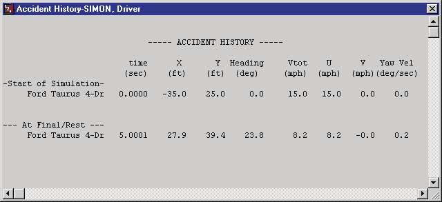
*Figure 3-1: Typical Accident History Output Report issued by SIMON.*

*(updated: the current SIMON Calculation Options dialog includes an **Accident History Basis** option. Impact and separation rows in the Accident History report may be detected either from **Impact Force** or from vehicle **Acceleration** exceeding a user-set threshold; see Chapter 2, Event Calculation Options.)*

### Damage Data

The Damage Data Report displays a table containing vehicle collision information, such as delta-V. A typical Damage Data Report is shown in Figure 3-2.

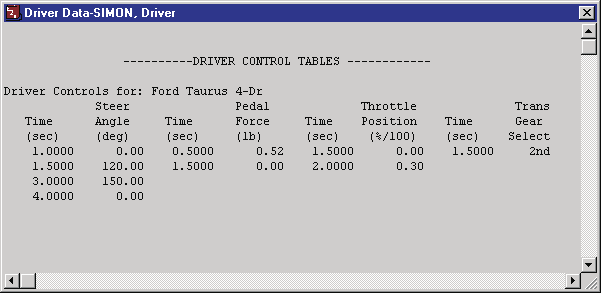
*Figure 3-2: Typical Damage Data Report issued by SIMON.*

*(updated: the current Damage Data report also includes CDC(s), collision impulse data — up to 10 impulses per vehicle — and crush depth tables. When the **Include Free Space** calculation option is changed, the crush tables switch between "Excl. Free Space" and "Incl. Free Space" measurements; see Chapter 2, Event Calculation Options.)*

### Driver Data

Individual Driver Control tables for steering, braking, throttle and gear selection used by SIMON in the current event. A typical Driver Controls Output Report is shown in Figure 3-3.

*Figure 3-3: Typical Driver Controls Output Report issued by SIMON.*

### Environment Data

The Environment Data Output Report consists of two sections of data:

- **General Environment Data** — Environmental parameters used by SIMON including air temperature, pressure and density; wind speed and direction; and gravity constant
- **3-D Environment Terrain Data** — Name of and information about the environment geometry file

A typical Environment Data Output Report is shown in Figure 3-4.

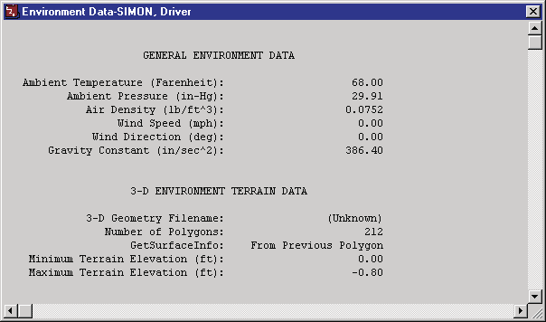
*Figure 3-4: Typical Environment Data Output Report issued by SIMON.*

### Event Data

The Event Data Output Report lists event-specific data for each vehicle. These data include:

- **Payload Information** — Mass and location of optional payload
- **Accelerometer Information** — Location of optional accelerometers
- **Wheel Data** — Information regarding optional wheel displacements, brake assembly, and tire blow-outs for each wheel location

A typical Event Data Output Report is shown in Figure 3-5.

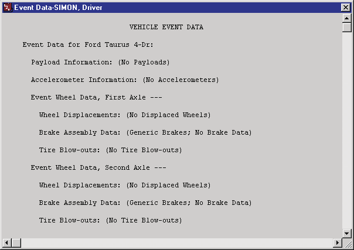
*Figure 3-5: A portion of a typical Event Data Output Report issued by SIMON.*

### Human Data

A typical Human Data Output Report is shown in Figure 3-6. Human data includes total weight, vehicle-fixed x, y, z location, and seat position for occupants, and earth-fixed X, Y, Z location for pedestrians.

> **NOTE:** Coordinates are for the pelvis CG.

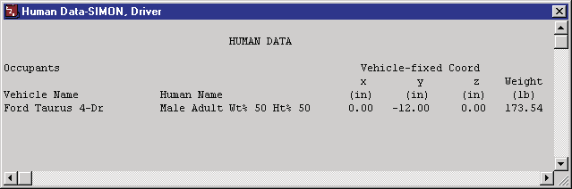
*Figure 3-6: Typical Human Data Output Report issued by SIMON.*

### Messages

A typical Messages Report is shown in Figure 3-7. For a complete listing of messages issued by SIMON, see Chapter 6.

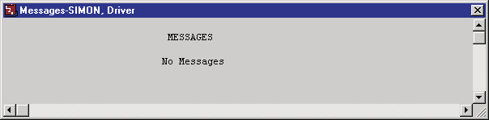
*Figure 3-7: Typical Messages Output Report issued by SIMON.*

### Program Data

The Program Data Report includes the following information:

- **Simulation Controls** — Integration parameters used for the current event (integration method, maximum simulation time, integration timestep, output interval, linear and angular termination velocities)
- **Calculation Options** — GetSurfaceInfo option, Tire Model Method, Steer Degree of Freedom, Articulation Option, DyMESH Option
- **DyMESH Options** — When DyMESH is used, the report lists the DyMESH options in effect (e.g., Restitution Model, Search Option, Pushback Option, Inter-vehicle Friction, Crush Height For Stiffness)

A typical Program Data Report is shown in Figure 3-8.

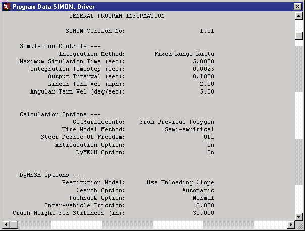
*Figure 3-8: Typical Program Data Output Report issued by SIMON.*

### Vehicle Data

The Vehicle Data Report includes the following information:

- **Vehicle General Information** — Includes make, model, year, body style, basic vehicle configuration, and specific EDC vehicle version number
- **Sprung Mass Dimensional and Inertial Properties** — The dimensional and inertial parameters used by SIMON in the current event.
- **Connection Properties** — The connection parameters used by SIMON in the current event.
- **Aerodynamic Properties** — Sprung mass aerodynamic parameters used by SIMON in the current event.
- **Brake, Steering, and Drivetrain Properties** — Brake, steering, and drivetrain parameters (including engine, transmission and differential) used by SIMON in the current event.
- **Tire and Wheel Properties** — The tire and wheel parameters used by SIMON in the current event
- **Suspension Properties** — The suspension parameters used by SIMON in the current event.

A portion of a typical Vehicle Data Output Report is shown in Figure 3-9.

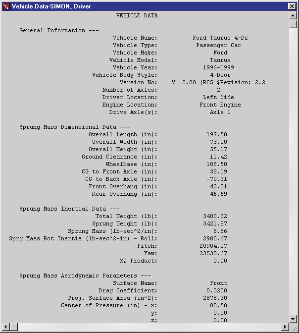
*Figure 3-9: A portion of a typical Vehicle Data Output Report issued by SIMON.*

## Graphic Reports

SIMON produces no Graphic Output Reports.

> **NOTE:** Graphs of simulation results vs time may be produced using the Variable Output window (see next section).

## Variable Output Table

SIMON produces a Variable Output table containing the time-based simulation results. The Variable Output groups produced by SIMON are as follows:

### Vehicle Output Groups

- **Kinematics** — Position, velocity and acceleration for the vehicle
- **Kinetics** — Summation of tire, drag and collision forces and moments acting at the CG of each vehicle
- **Accelerometers** — Linear accelerations at user-specified locations
- **Tires** — The tire output parameters existing at the tire contact patch (compare with Wheel Output, below)
- **Wheels** — The wheel output parameters existing at the wheel's hub (compare with Tire output, above)
- **Connections** — Articulation angles and inter-vehicle connection forces
- **Drivetrain** — Engine and transmission parameters used by SIMON
- **Driver** — Current levels of driver inputs (steering, braking and throttle)

An example of a Variable Output table is shown in Figure 3-10. Detailed listings of each Variable Output parameter produced by SIMON are found in Tables 3-1, 3-2, and 3-3. For more information about HVE Variable Output parameters, refer to the HVE User's Manual, Chapter 16, Event Model.

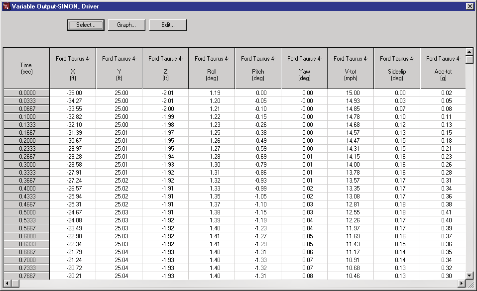
*Figure 3-10: Typical Variable Output Table from SIMON.*

**Table 3-1 General Vehicle Variable Output Table**

| Parameter | Description |
|-----------|-------------|
| Vehicle Kinematic Data | X, Y, Z position of CG; $\Phi$, $\Theta$, $\Psi$ orientation; $\nu$ (Course Angle); Total linear velocity; u, v, w components; Sideslip angle; p, q, r angular velocities; Total linear accel; forward, lat, vert components; u-dot, v-dot, w-dot linear components; p-dot, q-dot, r-dot angular accelerations |
| Vehicle Kinetic Data | $F_x$, $F_y$, $F_z$ Suspension; $M_x$, $M_y$, $M_z$ Suspension; $F_x$, $F_y$, $F_z$ Impact; $M_x$, $M_y$, $M_z$ Impact; $F_x$, $F_y$, $F_z$ Aerodynamic; $M_x$, $M_y$, $M_z$ Aerodynamic; $F_x$, $F_y$, $F_z$ Connection; $M_x$, $M_y$, $M_z$ Connection |
| Accelerometer Data | Total linear accel; forward, lat, vert components for each accelerometer |
| Damage Data * | Vertex is changed (Flag); Vertex ID; x, y, z vertex coordinates; $F_x$, $F_y$, $F_z$ vertex force components |

\* Not selectable by user.

**Table 3-2 Vehicle Component Variable Output Table**

| Parameter | Description |
|-----------|-------------|
| Tire Data | X, Y, Z position of tire contact patch; $F'_x$, $F'_y$, $F'_z$; Tire radius, Tire Deflection; Longitudinal slip; Slip angle; Inclination angle; Skid flag; Friction multiplier; $u_x$, $u_y$, $u_z$ (unit vector for surface normal); Soil Constants N, Kphi, Kc (Soft Soil Tire-Terrain Model); $F_x'$, $F_y'$ Flow Force (Soft Soil Model); Fx Sidewall, Fy Sidewall, Fz Sidewall |
| Wheel Data | x, y, z location of each wheel center; Axle z deflection from equilibrium (solid axle); Axle roll (solid axle); Vehicle-fixed wheel camber; Wheel spin displacement; Steer angle ($\delta$) at each steerable wheel; Axle z-dot deflection rate (solid axle); Axle roll rate (solid axle); Vehicle-fixed wheel camber rate; Wheel spin velocity; Steer velocity at each steerable wheel; Axle z-dot-dot deflection acceleration (solid axle); Axle roll acceleration (solid axle); Wheel spin acceleration; Steer acceleration at each steerable wheel (steer DOF only); $F_x$, $F_y$, $F_z$ (wheel); Steer axis moment at each steerable wheel (steer DOF only); Spring deflection; Spring deflection rate; Total suspension force; Individual spring and damper suspension forces; Drive, brake torque; Auxiliary stiffness from sway bar; Brake stroke, pressure; Brake interface, drum, lining temperature |
| Connection Data | $\Phi$, $\Theta$, $\Psi$ articulation; $F_x$, $F_y$, $F_z$; $M_x$, $M_y$, $M_z$ |
| Drivetrain Data | Engine speed; Engine power; Engine torque; Transmission ratio; Differential ratio |

**Table 3-3 Vehicle Driver Variable Output Table**

| Parameter | Description |
|-----------|-------------|
| Driver Data (for "At Driver" Driver Table options only) | Throttle position; Brake pedal; Brake system; Transmission, differential gear; Steer angle (all options) |
| Driver Data (for HVE Driver Model) | Steering Wheel Angular Velocity; CG Path Error; Preview Distance; Path error at preview distance; X, Y at preview distance |

## Trajectory Simulations

SIMON produces a trajectory simulation and a damage profile (if a vehicle collision has been simulated using DyMESH) of the current event. The trajectory simulation is a 3-D visualization of the data displayed in the Variable Output table (see previous section). An example of a trajectory simulation is shown in Figure 3-11. The damage profile is a time-domain 3-D visualization of the deformation of the vehicle mesh calculated by DyMESH during the vehicle collision.

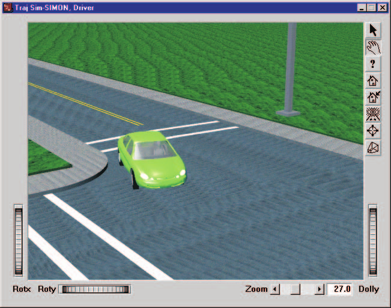
*Figure 3-11: Typical Trajectory Simulation Report issued by SIMON.*

### Displaying a Trajectory Simulation

The Trajectory Simulation is controlled using the Playback Controller (Figure 3-12).

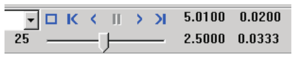
*Figure 3-12: Playback Controller.*

The Playback Controller's buttons have the following functions:

- **Reset** — Returns to the start of the simulation and reinitializes the video output device (this applies a hardware reset and is otherwise the same as the *Rewind to Start* button, below).
- **Rewind to Start** — Return to the start of the simulation
- **Reverse** — Play the simulation backwards
- **Pause** — Pause the simulation
- **Play** — Execute the event or play the simulation forwards
- **Advance to End** — Advance to the end of the simulation

> **NOTE:** The Playback Controller also includes additional features used for creating video. Refer to the HVE User's Manual, Playback Editor and Video Output sections, for further details.

### Displaying a Damage Profile

You must have a Trajectory Simulation open in order to play the Damage Profile and, thus, view the vehicle damage. With both the Damage Profile and Trajectory Simulation viewers open, the Damage Profile viewer is controlled with the Playback Controller. In fact, you will notice the Trajectory Simulation playing at the same time.

<!-- NAV -->

---

← Previous: [Chapter 2 — SIMON Program Input](02-program-input.md)  |  [Index](README.md)  |  Next: [Chapter 4 — Calculation Method](04-calculation-method.md) →

<!-- /NAV -->
