# Chapter 4 — Calculation Method

## Basis For Analysis

SIMON is a dynamic simulation analysis of one or more vehicles. SIMON is a simulation model incorporating a general purpose 3-D dynamics engine developed by Engineering Dynamics Corporation. SIMON includes a sprung mass with six degrees of freedom (x, y, z, roll, pitch, yaw) and unsprung masses with three degrees of freedom per axle (axle roll, z and steer for solid axle suspensions; axle steer and right and left wheel z for independent suspensions).

The vehicle model includes the following basic components for each vehicle unit:

- Sprung mass
- Up to three axles (full trailers may have up to six axles)
- Independent or solid axle suspension for each axle
- Single or dual tires at each wheel location
- Front and rear inter-vehicle connections
- Exterior geometry
- Aerodynamic surface(s)
- Payload(s)
- Human occupant(s)
- Steering system
- Braking system
- Drivetrain

The basic vehicle model is shown in Figure 4-1.

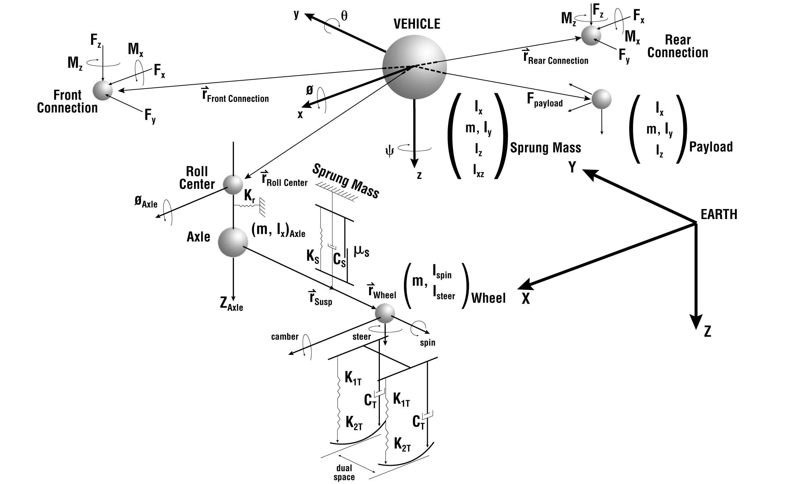
*Figure 4-1: SIMON Vehicle Model.*

## Equations of Motion

The system of equations requires three coordinate systems:

- **Inertial reference system** — This is the earth-fixed coordinate system defined by an orthogonal (right-handed) X, Y, Z coordinate axis system. The Z-axis is parallel to the gravity vector, hence it is pointed downward. The X and Y directions are arbitrary (within the requirement of orthogonality).
- **Vehicle reference system** — This is the vehicle-fixed coordinate system defined by an orthogonal (right-handed) x, y, z coordinate system attached to the sprung mass. Its origin is coincident with the sprung mass center of gravity (CG). The x-axis defines the forward vehicle direction, the y-axis points to the vehicle's right side and the z-axis points towards the bottom of the vehicle.
- **Tire reference system** — This is the tire-fixed coordinate system defined by an orthogonal, right-handed coordinate system fixed to the tire. It has as its origin the perpendicular intersection between the tire plane, the road plane (i.e., terrain) and a plane through the wheel center. The x′-axis lies in the road plane and points in the tire-fixed forward direction, the y′-axis points to the right and the z′-axis is a radial vector in the tire plane normal to the road plane.

These coordinate systems follow SAE Recommended Practice J-670e [5].

The equations that govern the general, non-linear, unsteady motion of the vehicle sprung mass are based on Euler's equations of motion written with respect to the (moving) vehicle reference system. The choice of the moving reference frame greatly simplifies the calculation of external forces and avoids the appearance of the moments and products of inertia in the equations of motion. The derivation for these equations may be found in reference 6. Much of the following development may also be found in reference 9 of this manual.

The equations of motion take the general form:

$$
\begin{aligned}
\sum F_x &= m(\dot u + wq - vr)\\
\sum F_y &= m(\dot v + ur - wp)\\
\sum F_z &= m(\dot w + vp - uq)\\
\sum M_x &= \dot L_x + qL_z - rL_y\\
\sum M_y &= \dot L_y + rL_x - pL_z\\
\sum M_z &= \dot L_z + pL_y - qL_x
\end{aligned}
\qquad (\text{Eq. 1})
$$

where

| Symbol | Definition |
|---|---|
| $u,v,w$ | vehicle-fixed components of linear velocity |
| $p,q,r$ | vehicle-fixed components of angular velocity |
| $F_x,F_y,F_z$ | vehicle-fixed components of external forces |
| $M_x,M_y,M_z$ | vehicle-fixed components of external moments |
| $L_x,L_y,L_z$ | vehicle-fixed components of angular momentum |

Assuming symmetry in the xy and yz planes, the xy and yz products of inertia are zero. However, symmetry is not assumed in the xz plane, so $I_{xz}$ is included in the angular equations, thus

$$
\begin{aligned}
M_x &= I_x\dot p - I_{xz}\dot r - qr(I_y - I_z) - qpI_{xz}\\
M_y &= I_y\dot q - (r^2 - p^2)I_{xz} - rp(I_z - I_x)\\
M_z &= I_z\dot r - I_{xz}\dot p - pq(I_x - I_y) + qrI_{xz}
\end{aligned}
\qquad (\text{Eq. 2})
$$

### Sprung Mass

In the derivation that follows, the Euler equations of motion include the inertial coupling effects of the unsprung masses. When combined with the other applied external forces acting on the sprung mass,

$$
\sum \vec F_{Total} = \sum \vec F_{Suspension} + \sum \vec F_{Connection} + \sum \vec F_{Collision} + \sum \vec F_{Aerodynamic} + \sum \vec F_{Unsprung\,Mass}
\qquad (\text{Eq. 3})
$$

where

| Term | Definition |
|---|---|
| $\sum \vec F_{Suspension}$ | Vehicle-fixed components of suspension forces |
| $\sum \vec F_{Connection}$ | Vehicle-fixed components of connection forces |
| $\sum \vec F_{Collision}$ | Vehicle-fixed components of collision forces |
| $\sum \vec F_{Aerodynamic}$ | Vehicle-fixed components of aerodynamic forces |
| $\sum \vec F_{Unsprung\,Mass}$ | Vehicle-fixed components of inertial forces from unsprung masses (described in the next section) |

In the vehicle-fixed x-direction, each unsprung mass is assumed to act as a point mass. Thus, Newton's 2nd law yields

$$
m_{Sprung}(\dot u - vr + wq) + \left(m_{Sprung} + \sum m_{Unsprung}\right) g\sin\theta = \sum F_{x_{Total}}
\qquad (\text{Eq. 4})
$$

where

| Symbol | Definition |
|---|---|
| $m_{Sprung}$ | Sprung mass |
| $\sum m_{Unsprung}$ | Total unsprung mass (axles + wheels) |
| $g$ | Gravitational constant |
| $\theta$ | Vehicle-fixed pitch angle |

In the vehicle-fixed y-direction, Newton's 2nd law yields

$$
m_{Sprung}(\dot v + ur - wp) - \left(m_{Sprung} + \sum m_{Unsprung}\right) g\cos\theta\sin\phi = \sum F_{y_{Total}}
\qquad (\text{Eq. 5})
$$

where $\phi$ = vehicle-fixed roll angle.

In the vehicle-fixed z-direction, Newton's 2nd law yields

$$
m_{Sprung}(\dot w + vp - uq) - m_{Sprung}\, g\cos\theta\cos\phi = \sum F_{z_{Total}}
\qquad (\text{Eq. 6})
$$

Rotational motion is handled in a similar manner. The external forces acting on the sprung mass are

$$
\sum \vec M_{Total} = \sum \vec M_{Suspension} + \sum \vec M_{Connection} + \sum \vec M_{Collision} + \sum \vec M_{Aerodynamic} + \sum \vec M_{Unsprung\,Mass}
\qquad (\text{Eq. 7})
$$

where the external moments from suspensions, connections, and so forth, are defined in the vehicle-fixed axis system.

The following equation defines roll motion about the vehicle-fixed x-axis:

$$
I_x\dot p - I_{xz}\dot r - qr(I_y - I_z) - qpI_{xz} + \left(\sum mz\right)_{Unsprung} g\cos\theta\sin\phi = \sum M_{x_{Total}}
\qquad (\text{Eq. 8})
$$

For pitch rotation about the vehicle-fixed y-axis, the equation is

$$
I_y\dot q - (r^2 - p^2)I_{xz} - rp(I_z - I_x) + \left(\sum mz\right)_{Unsprung} g\sin\theta = \sum M_{y_{Total}}
\qquad (\text{Eq. 9})
$$

For motion about the vehicle-fixed z-axis, the equation is

$$
\left(I_z + \sum I_{z_{Unsprung}}\right)\dot r - I_{xz}\dot p - pq(I_x - I_y) + qrI_{xz} + \left(\sum mx\right)_{Unsprung} g\cos\theta\sin\phi - \left(\sum my\right)_{Unsprung} g\sin\theta = \sum M_{z_{Total}}
\qquad (\text{Eq. 10})
$$

where $x, y$ = vehicle-fixed components for location of unsprung mass CGs (refer to the next section for more information regarding the exact definitions for x, y coordinate locations).

### Unsprung Mass

Calculation of the motion of the sprung mass requires the contributions of the inertial coupling of the unsprung masses in the vehicle-fixed x- and y-directions; thus, the calculation of the vehicle-fixed components of acceleration of the unsprung masses is necessary. Assuming the unsprung masses are point masses moving with respect to the (moving) vehicle, the vehicle-fixed accelerations for an unsprung mass are

$$
a_x = \dot u - vr + wq + \ddot x + 2q\dot z - 2r\dot y - x(q^2 + r^2) + y(pq - \dot r) + z(pr + \dot q)
\qquad (\text{Eq. 11})
$$

$$
a_y = \dot v + ur - wp + \ddot y + 2r\dot x - 2p\dot z + x(pq + \dot r) - y(p^2 + r^2) + z(qr - \dot p)
\qquad (\text{Eq. 12})
$$

where $x, y, z$ = vehicle-fixed components for location of unsprung mass CGs.

> **NOTE:** The acceleration in the z-direction is not required because the unsprung masses are not directly coupled in the z-direction.

The constraints placed on the motion of the unsprung masses by the connections between the sprung and unsprung masses are such that there is no relative motion between the unsprung and sprung masses in the vehicle-fixed x-direction. Thus, $\ddot x = 0$. Therefore, in Newton's 2nd law form, the inertial coupling forces for unsprung mass $i$ may be rewritten as

$$
F_{x_i} = m_i a_{x_i} = m_i\left(\dot u - vr + wq + 2\dot z_i + 2r\dot y_i - x_i(q^2 + r^2) + y_i(pq + \dot r) + z_i(pr + \dot q)\right)
\qquad (\text{Eq. 13})
$$

and

$$
F_{y_i} = m_i a_{y_i} = m_i\left(\dot v + ur - wp - 2p\dot z_i + x_i(pq + \dot r) - y_i(p^2 + r^2) + z_i(qr - \dot p)\right)
\qquad (\text{Eq. 14})
$$

The unsprung mass positions and their derivatives appear in the above inertial coupling equations. Thus, the vehicle-fixed positions, velocities and accelerations for the unsprung masses are required. These kinematics are different for independent and solid axle suspension types.

#### Independent Suspensions

An independent suspension includes two degrees of freedom that are inertially coupled to the sprung mass: the vertical motion (vehicle-fixed z-direction) for each wheel (see Figure 4-2). Wheel lateral velocity is considered negligible, thus, the $2r\dot y$ term vanishes from Eq. 13. The wheel x-coordinate relative to the vehicle center of gravity is equal to the user-assigned wheel coordinate, possibly modified by occupants and payloads and event-related wheel x-displacement. Thus,

$$
x_{Wheel} = x_{Initial} + \Delta x_{Payload} + \Delta x_{Occupants} + \Delta x_{Displ}
\qquad (\text{Eq. 15})
$$

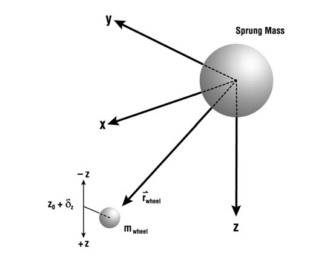
*Figure 4-2: Degrees of freedom for an independent suspension. Dynamic motion of each wheel is defined in the vehicle-fixed z-direction (spin and steer angular dynamic motion may also be defined as an option; see Wheel Spin and Steering System sections).*

The wheel y-coordinate is defined by the user-assigned wheel y-coordinate, possibly modified by occupants and payloads and event-related wheel displacement. In addition, the wheel lateral location changes for an independent suspension due to the effects of the half-track change during wheel jounce and rebound. Thus,

$$
y_{Wheel} = y_{Initial} + \Delta y_{Payload} + \Delta y_{Occupants} + \Delta y_{Displ} + \frac{dy_w}{dz}
\qquad (\text{Eq. 16})
$$

where $\dfrac{dy_w}{dz}$ = half-track change interpolated from the user-entered Half-track vs. Jounce/Rebound table.

The wheel z-coordinate is initially defined by the user-assigned z-coordinate, again, possibly modified by payloads, occupants and event-related displacement. However, the z-wheel position is a degree of freedom, thus the current wheel position is governed by its equation of motion in the z-direction. Thus,

$$
z_{Wheel} = z_{Initial} + \Delta z_{Payload} + \Delta z_{Occupants} + \Delta z_{Displ} + \delta z_{Wheel}
\qquad (\text{Eq. 17})
$$

where $\delta z_{Wheel}$ = current wheel z-displacement from initial (equilibrium) position.

Newton's 2nd law applied to the equation for vertical wheel motion results in

$$
\sum F_{z_{Unsprung}} = F_{z_{Tire}} - F_{Suspension} + m_{Unsprung}\left(uq - vp + g\cos\theta\cos\phi - x_{Wheel}\,pr - y_{Wheel}\,qr + z_{Wheel}(p^2 + r^2)\right)
\qquad (\text{Eq. 18})
$$

#### Solid Axle Suspensions

A solid axle suspension also includes two degrees of freedom inertially coupled to the sprung mass: axle vertical motion (vehicle-fixed z-direction) and axle roll about the roll center (see Figure 4-3).

Unlike independent suspensions, for solid axle suspensions the equations of motion describe the motion of the solid axle roll center, not the individual wheels.

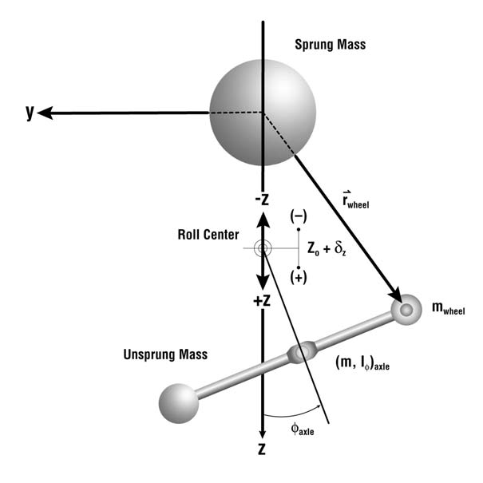
*Figure 4-3: Degrees of freedom for a solid axle suspension.*

The vehicle-fixed x-coordinate of the unsprung mass is equal to the average of the current wheel x-coordinates (see Eq. 15).

The unsprung mass y- and z-coordinates have the following kinematic relationships (refer to Figure 4-3):

$$
\begin{aligned}
y &= -\rho\sin\phi & \text{(Eq. 19)}\\
\dot y &= -\rho\dot\phi\cos\phi & \text{(Eq. 20)}\\
\ddot y &= \rho(\dot\phi^2\sin\phi - \ddot\phi\cos\phi) & \text{(Eq. 21)}\\
z &= z_{Static} + \delta_{Axle} + \rho\cos\phi & \text{(Eq. 22)}\\
\dot z &= \dot\delta_{Axle} - \rho\dot\phi\cos\phi & \text{(Eq. 23)}\\
\ddot z &= \ddot\delta_{Axle} - \rho(\dot\phi^2\cos\phi + \ddot\phi\sin\phi) & \text{(Eq. 24)}
\end{aligned}
$$

where

| Symbol | Definition |
|---|---|
| $\rho$ | Fixed distance from roll center to sprung mass (downward +) |
| $\phi$ | Vehicle-fixed axle roll angle |
| $z_{Static}$ | Initial distance from the vehicle CG to the roll center |
| $\delta_{Axle}$ | Current vertical deflection of roll center from initial (equilibrium) position |

Newton's 2nd law applied to axle vertical motion is

$$
\sum F_{z_{Unsprung}} = F_{z_{Tire}} - F_{z_{Suspension}} + m_{Unsprung}\left(uq - vp + g\cos\theta\cos\phi + \rho\dot\phi^2 + 2p\rho\dot\phi - x_{Axle}\,pr + \rho\phi qr + (\rho + z_{Axle})(p^2 + q^2)\right)
\qquad (\text{Eq. 25})
$$

For solid axle roll-axis rotation, application of Newton's 2nd law yields

$$
\begin{aligned}
\sum M_{\phi_{Unsprung}} ={}& M_{\phi_{Tire}} - M_{\phi_{Suspension}} \\
&+ m_{Unsprung}\,\rho\Big(ur - wp - 2p\dot z + 2p\rho\phi\dot\phi + x_{Axle}\,pq + \rho\phi(p^2 + r^2) \\
&\qquad + (\rho + z_{Axle})qr - g\cos\theta\sin(\phi_{Sprung} + \phi_{Axle})\Big) \\
&+ m_{Unsprung}\,\rho\phi\left(vp - uq - 2p\rho\dot\phi + x_{Axle}\,pr - (\rho + z_{Axle})(p^2 + q^2)\right) \\
&- I_{Axle,\phi}\,\phi(r^2 - q^2) - I_{Axle,\phi}\,qr
\end{aligned}
\qquad (\text{Eq. 26})
$$

### Wheel Spin

Calculation of wheel spin velocity, $\Omega$, requires the wheel spin acceleration, $\dot\Omega$. Spin acceleration arises from drive and brake torques and from tire rolling resistance, as shown in the free-body diagram in Figure 4-4 (for purposes of clarification, only torque-producing forces are shown in the figure).

For driven axles, the model is complicated by the introduction of the coupling effect of the differential and from the introduction of drivetrain rotational inertia. The differential equation for the spin degree of freedom at each wheel includes these effects:

$$
\left(I_{Wheel,Rt} + \frac{I_{Drivetrain}\,\eta_{Diff}^2}{4}\right)\frac{d}{dt}\Omega_{Wheel,Rt} + \left(\frac{I_{Drivetrain}\,\eta_{Diff}^2}{4}\right)\frac{d}{dt}\Omega_{Wheel,Lt} = \left[-F_{x'}r + M_{Rolling} + T_b + (\zeta T_d)\right]_{Right\ Tires}
\qquad (\text{Eq. 27})
$$

$$
\left(I_{Wheel,Lt} + \frac{I_{Drivetrain}\,\eta_{Diff}^2}{4}\right)\frac{d}{dt}\Omega_{Wheel,Lt} + \left(\frac{I_{Drivetrain}\,\eta_{Diff}^2}{4}\right)\frac{d}{dt}\Omega_{Wheel,Rt} = \left[-F_{x'}r + M_{Rolling} + T_b + (\zeta T_d)\right]_{Left\ Tires}
\qquad (\text{Eq. 28})
$$

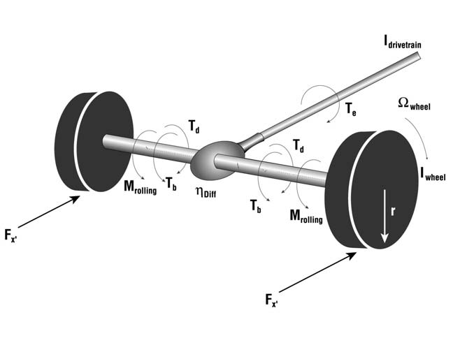
*Figure 4-4: Wheel spin degree of freedom moments and forces.*

The solution of Eqs. 27 and 28 for $\dot\Omega$ yields the following:

$$
\dot\Omega_{Wheel,Rt} = \xi_{Wheel,Rt}\left(T_d + T_b - F_{x'}r + M_{Rolling}\right)_{Wheel,Rt} - \xi_{Wheel,Lt}\left(T_d + T_b - F_{x'}r + M_{Rolling}\right)_{Wheel,Lt}
\qquad (\text{Eq. 29})
$$

and

$$
\dot\Omega_{Wheel,Lt} = \xi_{Wheel,Rt}\left(T_d + T_b - F_{x'}r + M_{Rolling}\right)_{Wheel,Lt} - \xi_{Wheel,Lt}\left(T_d + T_b - F_{x'}r + M_{Rolling}\right)_{Wheel,Rt}
\qquad (\text{Eq. 30})
$$

Once $\dot\Omega$ is determined for each wheel, the wheel spin velocity is integrated directly:

$$
\Omega = \Omega_{Prev} + \int \dot\Omega\,dt
\qquad (\text{Eq. 31})
$$

In the preceding development,

| Symbol | Definition |
|---|---|
| $\Omega$ | Wheel spin velocity |
| $\Omega_{Prev}$ | Wheel spin velocity during previous integration timestep |
| $T_d$ | Wheel drive torque $= T_e \times \eta_{Trans} \times \eta_{Diff} \times \zeta$ (Eq. 32) |
| $T_e$ | Engine torque (see Eq. 51) |
| $\eta_{Trans}$ | Transmission ratio |
| $\eta_{Diff}$ | Differential ratio |
| $\zeta$ | Torque split (fraction of engine torque applied to specified wheel) |
| $F_{x'}$ | Tire circumferential force |
| $r$ | Tire effective rolling radius |
| $M_{Rolling}$ | Tire rolling resistance moment |
| $I_{Wheel}$ | Total wheel spin inertia: tire + rim (×2 if dual tires) + axle + any spinning portion of brake |
| $I_{Drivetrain}$ | Total rotational inertia of drivetrain components: engine + transmission + driveline |
| $\xi$ | Wheel inertial factor |

$$
\xi = \frac{B}{B - A}\ \text{for the right-side wheel};\qquad \xi = \frac{A}{C - A}\ \text{for the left-side wheel}
$$

where

$$
A = \frac{I_{Drivetrain}\,\eta_{Diff}^2}{4},\qquad B = I_{Wheel,Rt} + A,\qquad C = I_{Wheel,Lt} + A
$$

> **NOTE:** In the calculation of wheel drive torque, $T_d$ (above), $\zeta$ is the "torque function" that determines how the drive torque is distributed between the drive wheels. By default, SIMON assumes the drive torque is split equally between all drive wheels.

## Steering System

The steering system includes the steering gear ratio (steer angle at the steering wheel divided by the steer angle at the axle). This ratio is used when the At Steering Wheel steer table option is selected.

SIMON also incorporates a Steer Degree of Freedom model. The Steer Degree of Freedom model is activated by selecting the appropriate option in SIMON's Calculation Options dialog. *(updated: the current Calculation Options dialog offers four Steer DOF settings — Off, Normal, Append and AutoStart; see Chapter 2.)*

The engineering model used by the Steer Degree of Freedom option is shown in Figure 4-5. The linkage is assumed to be rigid, thus the angular acceleration about the steering axis is the same for right-side and left-side wheels. External steer forces are generated at the tire-road interface, thus producing moments about the steering axis according to the tire pneumatic trail. The moments are resisted by steer system inertia and internal coulomb friction. Steering is limited by right and left steering stops at each wheel.

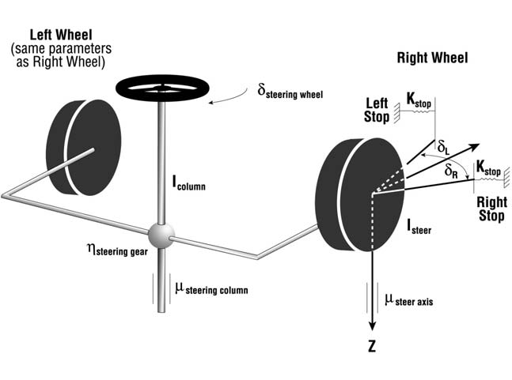
*Figure 4-5: Steering system model used for Steer Degree of Freedom option.*

Application of Newton's 2nd law to the steering system, ignoring inertial coupling effects, results in

$$
\sum M_{Steering} = I_{Steering}\,\ddot\psi
\qquad (\text{Eq. 33})
$$

where

| Symbol | Definition |
|---|---|
| $\sum M_{Steering}$ | Sum of external moments acting on steering system components |
| $I_{Steering}$ | Total rotational inertia of steering system components |
| $\psi$ | Steer angle of each steerable wheel about its steering axis (thus, $\ddot\psi$ is the angular acceleration) |

The sum of external moments is

$$
\sum M_{Steering} = M_{Stops} + M_{Steer\ Axis\ Friction} + M_{Steering\ Column\ Friction} + M_{Tires}
\qquad (\text{Eq. 34})
$$

where

| Term | Definition |
|---|---|
| $M_{Stops}$ | Moments about wheel steer axis produced by contact with steering stops |
| $M_{Steer\ Axis\ Friction}$ | Moments about wheel steer axis produced by coulomb friction in the steering ball joints or king pin |
| $M_{Steering\ Column\ Friction}$ | Moment about the steering column axis produced by coulomb friction between the steering shaft and bushings or bearings |
| $M_{Tires}$ | Moments about the wheel steer axis produced by the tire forces and pneumatic trail at the tire-ground shear interface (contact patch) |

### Steering Stop Torque

Steer angles are limited by steering stops at the right- and left-side wheels. Each wheel's steering stops limit the steer angle for both right and left steering inputs; the right-steer and left-steer stop angles need not be equal.

> **NOTE:** For example, it is possible during a left turn for the stop at the left-side wheel to engage before the stop for the right-side wheel.

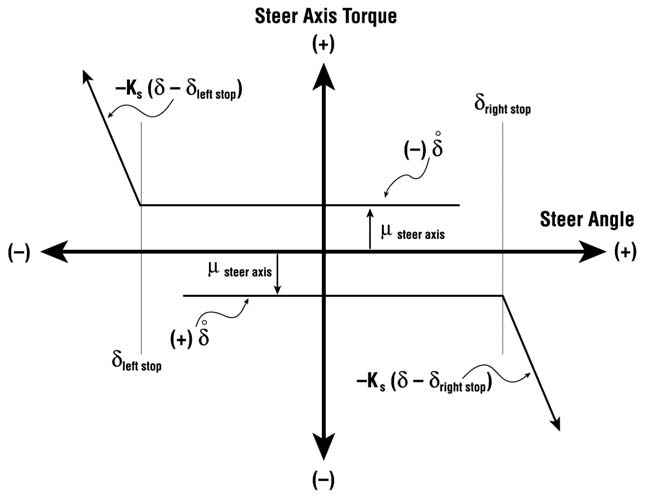
*Figure 4-6: Steer axis friction and stop torque vs. steer angle.*

The steering stop torque at each stop is

$$
M_{Stop} =
\begin{cases}
0, & \text{for } \delta_{Steer} \le \delta_{Stop} \text{ or } \mathrm{sgn}\delta_{Steer} \ne \dot\delta_{Steer}\\[4pt]
K_{Stop}\left(\delta_{Steer} - \delta_{Stop}\right), & \text{for } \delta_{Steer} > \delta_{Stop}
\end{cases}
\qquad (\text{Eq. 35})
$$

where $K_{Stop}$ = steering stop mechanical stiffness for the specified steering stop.

The above equations are for right steer; a steer to the left produces the same torque magnitude but opposite in direction. The general characteristic for steer axis torque is shown in Figure 4-6.

### Steer Axis Torque

Torque is also produced by steering rotation of the wheel about its steer axis. However, no torque is produced unless the steer velocity is non-zero. Thus, a minimum value of steer velocity is required to develop the assigned frictional torque. This minimum steer velocity is called a friction null band. The steer axis torque at each steer axis is

$$
M_{Steer\ Axis} =
\begin{cases}
\mu_{Steer}\,\dfrac{\dot\delta_{Steer}}{\varepsilon}, & \text{for } \left|\dot\delta_{Steer}\right| \le \varepsilon\\[6pt]
\mu_{Steer\ Axis}\mathrm{sgn}\dot\delta_{Steer}, & \text{for } \left|\dot\delta_{Steer}\right| > \varepsilon
\end{cases}
\qquad (\text{Eq. 36})
$$

where

| Symbol | Definition |
|---|---|
| $\varepsilon$ | Steering friction null band |
| $\mu_{Steer\ Axis}$ | Steer axis friction torque for each wheel |

### Steering Column Torque

The steering column and steering gear introduce additional friction torque. Like steer axis torque, described above, there is no steering column frictional torque unless the steer velocity is non-zero. The steering column frictional torque is

$$
M_{Steering\ Column} =
\begin{cases}
\mu_{Steering\ Column}\times\dfrac{\dot\psi_{Steer}}{\varepsilon}\mathrm{sgn}(-\dot\delta_{Steer}), & \text{for } \left|\dot\delta_{Steer}\div\eta\right| \le \varepsilon\\[6pt]
\mu_{Steering\ Column}\mathrm{sgn}(-\dot\delta_{Steer}), & \text{for } \left|\dot\delta_{Steer}\div\eta\right| > \varepsilon
\end{cases}
\qquad (\text{Eq. 37})
$$

where

| Symbol | Definition |
|---|---|
| $\mu_{Steering\ Column}$ | Steering column frictional torque |
| $\eta$ | Steering gear ratio (column angle : wheel angle) |

### Tire-Ground Torque

Forces at the tire-ground shear interface are the external input to the steering system. Because these forces do not act through the steer axis at its intersection with the ground plane (see Figure 4-7), an external moment is produced.

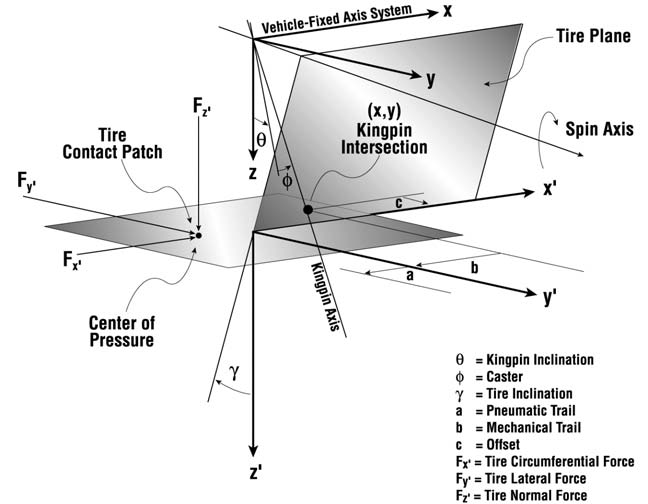
*Figure 4-7: Close-up view of torque-producing mechanism at tire-ground shear interface.*

Inspection of Figure 4-7 reveals the idealized point of application of the tire force, $F_x, F_y, F_z$, acts at a distance, $d_x$ and $d_y$, from the wheel steer axis at the ground plane.

> **NOTE:** SIMON assumes the offset, $d_y$, and mechanical trail are zero.

The external moment thus produced at each tire is

$$
M_{Tire} = F_x\left(r_y + r_z\gamma\right) + F_y\left(r_x + (T_P + T_M)\cos\delta_G\cos\theta_x\right) + F_z\left(r_x\sin\gamma\right)
\qquad (\text{Eq. 38})
$$

where

| Symbol | Definition |
|---|---|
| $F_x, F_y, F_z$ | Vehicle-fixed tire force components |
| $r_x, r_y, r_z$ | Vehicle-fixed components of distance from wheel center to tire-ground contact point |
| $T_P$ | Tire pneumatic trail |
| $T_M$ | Mechanical trail (assumed ≈ 0) |
| $\gamma$ | Inclination angle (angle from tire z′ axis to ground surface normal) |
| $\delta_G$ | Wheel vehicle-fixed steer angle relative to ground plane (see Eq. 84) |
| $\theta_x$ | Angle from vehicle x-axis to ground plane (see Eq. 72) |

> **NOTE:** Dual tires often have different tire force components, tire radii and tire-ground contact characteristics. Therefore, each dual tire must be handled separately.

### Steering System Rotational Inertia

The rotational inertia of the entire steering system is

$$
I_{Steering} = I_{Steer,Rt} + I_{Steer,Lt} + I_{Column}\times\eta
\qquad (\text{Eq. 39})
$$

where

| Symbol | Definition |
|---|---|
| $I_{Steer,Rt}$ | Total steer rotational inertia for right-side wheel: tire + rim (×2 if dual tires) + any steering portion of brake |
| $I_{Steer,Lt}$ | Total rotational inertia for left-side wheel |
| $I_{Column}$ | Total rotational inertia of steering column, including steering gearbox |
| $\eta$ | Steering gear ratio |

## Payloads

SIMON supports a payload on each unit vehicle. Note that this means the tow vehicle, trailer(s) and dolly(s) may each have an individual payload. The effect of the payload is simply to change the inertial properties and CG location of the vehicle's sprung mass.

Given a payload with inertial properties $m, I_x, I_y, I_z$, placing the payload at a distance, $\vec r$, from the sprung mass center of gravity changes the sprung mass inertial properties as follows:

$$
m_{Total} = m_{Sprung} + m_{Payload}
\qquad (\text{Eq. 40})
$$

$$
\eta = \frac{m_{Payload}}{m_{Total}}
\qquad (\text{Eq. 41})
$$

$$
\Delta_x = \eta r_x,\qquad \Delta_y = \eta r_y,\qquad \Delta_z = \eta r_z
\qquad (\text{Eq. 42})
$$

where $\vec\Delta$ = payload adjustment.

Adding a payload to a vehicle does not cause the vehicle to be repositioned on the road (in the real world or in HVE!). Rather, adding a payload simply relocates the center of gravity within the vehicle. This effectively changes the x, y, z coordinates of all vehicle-fixed components (wheels, inter-vehicle connections, etc). For each component, the coordinates are changed

$$
\vec C_{Adjusted} = \vec C_{Original} - \vec\Delta
\qquad (\text{Eq. 43})
$$

where $\vec C_{Adjusted}$ = adjusted x, y, z coordinates for component $C$ (e.g., the adjusted vehicle-fixed coordinates of the right front wheel).

The adjustment in center of gravity location and the additional rotational inertias of the payload affect rotational inertias of the sprung mass. This effect can be calculated using the parallel axis theorem.

Let

$$
dV_x = \Delta_y + \Delta_z,\qquad dV_y = \Delta_x + \Delta_z,\qquad dV_z = \Delta_x + \Delta_y
\qquad (\text{Eq. 44})
$$

and

$$
dP_x = r_y + r_z - dV_x,\qquad dP_y = r_z + r_x - dV_y,\qquad dP_z = r_x + r_y - dV_z
\qquad (\text{Eq. 45})
$$

The adjusted rotational inertias for the vehicle sprung mass are

$$
\begin{aligned}
I_{Adjusted,x} &= I_{Original,x} + I_{Payload,x} + m_{Sprung}\,dV_x^2 + m_{Payload}\,dP_x^2\\
I_{Adjusted,y} &= I_{Original,y} + I_{Payload,y} + m_{Sprung}\,dV_y^2 + m_{Payload}\,dP_y^2\\
I_{Adjusted,z} &= I_{Original,z} + I_{Payload,z} + m_{Sprung}\,dV_z^2 + m_{Payload}\,dP_z^2
\end{aligned}
\qquad (\text{Eq. 46})
$$

where

| Symbol | Definition |
|---|---|
| $\vec{dV}$ | Adjustment in vehicle CG location in vehicle-fixed roll, pitch and yaw planes |
| $\vec{dP}$ | Payload distance from adjusted CG in vehicle-fixed roll, pitch and yaw planes |

## Human Occupants

Human occupants may be added to vehicles. Mathematically, the result is equivalent to adding multiple payloads, using the procedures described above. The effect is to change the inertial properties and weight distribution of the vehicle. Humans do not move relative to the vehicle; their motion is not simulated.

## Driver Controls

SIMON provides user-entered driver controls for steering, braking, throttle and gear selection. These driver controls are entered in the form of open-loop tables of driver input vs. time. SIMON also provides a closed-loop option, called the HVE Driver Model.

### Steering

Steering inputs may be provided for right and left side wheels at each steerable axle. At Steering Wheel and At Axle options are supported. If the At Steering Wheel option is selected, the right side and left side wheel steer angles are equal to the current table entry divided by the axle's steering gear ratio.

### HVE Driver Model

SIMON supports the HVE Driver Model. The HVE Driver Model is a closed-loop driver control model that uses driver control attributes and the SIMON vehicle dynamics model to attempt to follow a user-specified path. This model is described in detail in HVE reference [4].

### Braking

Braking inputs may be provided for each wheel. The At Pedal option is the most robust model and its use is recommended. Using the At Pedal option causes SIMON to use the brake torque ratio supplied for each individual wheel. Wheel spin inertias and coupling within the differential are also included when the At Pedal option is selected.

Braking Force and Percent Available Friction brake table options are also allowed. If either of these methods is used, spin inertias and differential coupling are irrelevant and are ignored.

### HVE Brake Designer

If the At Pedal braking option is selected, SIMON uses the HVE Brake Designer. Detailed brake component designs can be created and edited in the Vehicle Editor. The resulting brake design is then used during SIMON simulations. The brake torque is calculated dynamically for each wheel according to the mechanical design of the brake assembly as well as the current brake pressure, lining/drum temperature and sliding speed. The current lining friction is determined from the lining temperature and sliding speed; thus, brake fade can be simulated.

The HVE Brake Designer is described in detail in the HVE Designer Manual. Additional information may be found in reference [1].

### Throttle

Throttle inputs may be provided for each drive axle. The Percent Wide-open Throttle (% WOT) option is the most robust and its use is recommended. Using the % WOT option causes SIMON to use the entire drivetrain model (see next section). Wheel spin inertias and coupling within the differential are also included when the % WOT option is selected.

Tractive Effort and Percent Available Friction options are also allowed. If either of these methods is used, spin inertias and differential coupling are irrelevant and are ignored.

### Gear Selection

If the % WOT throttle option (above) is selected, the Gear Selection table is used for setting the time and gear selections for each gear shift.

> **NOTE:** If no gear selection entries are made, the vehicle's transmission will be in neutral and no amount of throttle will cause the vehicle to accelerate!

## Wheel Torque

Wheel torque arises from driver throttle and brake inputs from open-loop driver tables (see Driver Controls, above).

### Brake Torque

SIMON uses three optional methods for computing the current level of attempted brake torque. These are:

- At Pedal
- Braking Force
- Percent Available Friction

These methods are described in the following section.

#### At Pedal Braking Option

If the At Pedal brake table option is used, the attempted brake torque, $T_b$, at each wheel is calculated as follows:

$$
T_b = T_{Ratio}(p - p_0)
\qquad (\text{Eq. 47})
$$

where

| Symbol | Definition |
|---|---|
| $T_b$ | Attempted brake torque at wheel |
| $T_{Ratio}$ | Brake Torque Ratio, the attempted brake torque produced per unit of actuation pressure |
| $p$ | Current application pressure at wheel cylinder or air chamber (after proportioning) |
| $p_0$ | Pushout Pressure (psi) |

Torque ratio for generic brake types is entered directly by the user for each wheel. For brakes created using the HVE Brake Designer, the torque ratio is calculated from the brake's mechanical design and material parameters and current operational characteristics (lining temperature and sliding speed).

If the HVE ABS Model is invoked, wheel brake pressures are modulated according to the selected ABS algorithm (see HVE User's Manual, Chapter 31).

#### Brake Pressure Proportioning

The pressure at the wheel cylinder or air chamber is the product of the current pedal force (interpolated from the Driver Controls, Pedal Force table) and the vehicle brake pedal ratio. The presence of a proportioning valve will reduce the pressure at the wheel as follows:

$$
p =
\begin{cases}
p_{Table}, & \text{for } p_{Table} \le p_{Proportion}\\[4pt]
p_{Proportion} + \eta\left(p_{Table} - p_{Proportion}\right), & \text{for } p_{Table} > p_{Proportion}
\end{cases}
\qquad (\text{Eq. 48})
$$

where

| Symbol | Definition |
|---|---|
| $p$ | Brake system pressure effective at wheel |
| $p_{Table}$ | Brake system pressure effective at source (master cylinder or storage reservoir) $= F_{Table}\times R$ |
| $F_{Table}$ | Current brake pedal force interpolated from At Pedal brake table |
| $R$ | Vehicle brake pedal ratio |
| $p_{Proportion}$ | System pressure at which proportioning begins |
| $\eta$ | Proportioning ratio (wheel pressure : source pressure) |

#### Brake Force and Percent Available Friction Options

If the Brake Force or Percent Available Friction brake table options are used, the attempted brake torque, $T_b$, is calculated directly:

$$
T_b =
\begin{cases}
F_{Wheel}\times\max\left(r_{Tire,Inner}, r_{Tire,Outer}\right), & \text{for BrakeForceMethod}\\[6pt]
\theta_{Wheel}\times\displaystyle\sum_{i=0}^{N}\mu_p F_R\,r_{Tire}, & \text{for \%AvailFrictionMethod}
\end{cases}
\qquad (\text{Eq. 49})
$$

where

| Symbol | Definition |
|---|---|
| $F_{Wheel}$ | Attempted brake force from Brake Force table |
| $r_{Tire}$ | Current tire radius |
| $\theta_{Wheel}$ | Attempted brake input from % Available Friction table |
| $N$ | Number of tires at wheel location |
| $\mu_P$ | Peak coefficient of friction for tire |
| $F_R$ | Current radial tire force (normal to the terrain) |

> **NOTE:** If the Brake Force method is used and the wheel location uses dual tires, $T_b$ is based on the largest tire radius.

> **NOTE:** Use of the Wheel Brake Force and Percent Available Friction options is discouraged because they bypass SIMON's brake system model and ignore the effects of the wheel spin degree of freedom. In addition, ABS simulation is not possible.

### Drive Torque

SIMON uses three optional methods for computing the current level of attempted drive torque. These are:

- Percent Wide-open Throttle
- Tractive Effort
- Percent Available Friction

These methods are described in the following section.

#### Percent Wide-Open Throttle Option

If the Percent Wide-open Throttle table option is used, the attempted drive torque, $T_d$, at each wheel is calculated as follows:

$$
\dot\theta_e = \eta_{Differential}\times\eta_{Transmission}\times\frac{\displaystyle\sum_{i=1}^{N}\Omega_{Wheel}}{N}
\qquad (\text{Eq. 50})
$$

$$
T_e = T_{CT} + \lambda\left(T_{WOT} - T_{CT}\right)
\qquad (\text{Eq. 51})
$$

where

| Symbol | Definition |
|---|---|
| $\eta_{Differential}$ | Current numerical ratio of differential from driver controls, differential gear table |
| $\eta_{Transmission}$ | Current numerical ratio of transmission from driver controls, transmission gear table |
| $\dot\theta_e$ | Current engine speed |
| $\Omega_{Wheel}$ | Current wheel spin velocity (see Eq. 31) |
| $N$ | Number of drive wheels |
| $T_e$ | Current engine torque (this result is used in Eq. 32) |
| $T_{CT}$ | Closed throttle engine torque at $\dot\theta_e$ from engine torque vs. engine speed table (negative) |
| $T_{WOT}$ | Wide-open-throttle engine torque at $\dot\theta_e$ from engine torque vs. engine speed table |
| $\lambda$ | Current throttle position, interpolated from driver controls, throttle table |

#### Tractive Effort and Percent Available Friction Options

If the Tractive Effort or Percent Available Friction throttle table options are used, the attempted drive torque, $T_d$, is calculated directly:

$$
T_d =
\begin{cases}
F_{Wheel}\times\max\left(r_{Tire,Inner}, r_{Tire,Outer}\right), & \text{for TractiveEffortMethod}\\[6pt]
\theta_{Wheel}\times\displaystyle\sum_{i=1}^{N}\mu_P F_R\,r_{Tire}, & \text{for \%AvailableFrictionMethod}
\end{cases}
\qquad (\text{Eq. 52})
$$

(Definitions are the same as for the Braking Tables; see above.)

## Wheel Position

Calculation of wheel center earth-fixed coordinates requires a transformation from the vehicle-fixed reference frame to the inertial reference frame. This transformation matrix, $A$, is given by

$$
A = \begin{bmatrix}
\cos\psi\cos\theta & \sin\psi\cos\theta & -\sin\theta\\
-\sin\psi\cos\phi + \cos\psi\sin\phi\sin\theta & \cos\psi\cos\phi + \sin\phi\sin\psi\sin\theta & \sin\phi\cos\theta\\
\sin\psi\sin\phi + \cos\psi\sin\theta\cos\phi & -\cos\psi\sin\phi + \sin\psi\sin\theta\cos\phi & \cos\theta\cos\phi
\end{bmatrix}
\qquad (\text{Eq. 53})
$$

where

| Symbol | Definition |
|---|---|
| $\psi$ | Vehicle yaw angle |
| $\theta$ | Vehicle pitch angle |
| $\phi$ | Vehicle roll angle |

> **NOTE:** The order of rotations is yaw, pitch, roll.

Calculation of these Euler angles requires integration of the rotational velocity components, $p, q, r$ (see Eqs. 8 through 10). The integrated values are

$$
\begin{aligned}
\dot\phi &= p + (q\sin\phi + r\cos\phi)\tan\theta & \text{(Eq. 54)}\\
\dot\theta &= q\cos\phi - r\sin\phi & \text{(Eq. 55)}\\
\dot\psi &= (q\sin\phi + r\cos\phi)\sec\theta & \text{(Eq. 56)}
\end{aligned}
$$

Note that the presence of $\tan\theta$ and $\sec\theta$ results in a singularity at 90 degree pitch angle. If necessary, an axis indexing scheme can be implemented to eliminate this singularity.

Given the current vehicle sprung mass orientation in space, the earth-fixed (inertial) wheel center coordinates are

$$
\begin{bmatrix}X_w\\ Y_w\\ Z_w\end{bmatrix} = \begin{bmatrix}X_{CG}\\ Y_{CG}\\ Z_{CG}\end{bmatrix} + A\cdot\begin{bmatrix}x_w\\ y_w\\ z_w\end{bmatrix}
\qquad (\text{Eq. 57})
$$

where

| Term | Definition |
|---|---|
| $[X_w\ Y_w\ Z_w]^T$ | Earth-fixed wheel center coordinates |
| $[X_{CG}\ Y_{CG}\ Z_{CG}]^T$ | Earth-fixed vehicle CG coordinates |
| $[x_w\ y_w\ z_w]^T$ | Vehicle-fixed wheel center coordinates |

The calculation of vehicle-fixed wheel center coordinates is dependent upon the suspension type.

### Solid Axle Suspension

For solid axle suspension types, the vehicle-fixed wheel center coordinates are given by

$$
\begin{aligned}
x_{Wheel} &= x_{Initial} + \Delta x_{Displ} & \text{(Eq. 58)}\\
y_{Wheel} &= y_{Initial} + \phi_{Axle}\,\rho_{Axle} + \Delta y_{Displ} & \text{(Eq. 59)}\\
z_{Wheel} &= z_{Initial} + \delta_{Axle} + \phi_{Axle}\,y_{Initial} + \Delta z_{Displ} & \text{(Eq. 60)}
\end{aligned}
$$

where

| Symbol | Definition |
|---|---|
| $[x,y,z]_{Initial}$ | Vehicle-fixed wheel x, y, z coordinates at the start of the simulation (may include displacements due to occupants and payload) |
| $[\Delta x,\Delta y,\Delta z]_{Displ}$ | Wheel x, y, z displacements from user-entered wheel displacement table |
| $\delta_{Axle}$ | Current roll center displacement from equilibrium |
| $\phi_{Axle}$ | Current vehicle-fixed axle roll angle |

### Independent Suspension

For independent suspension types, the vehicle-fixed wheel center coordinates are given by

$$
x_{Wheel} = x_{Initial} + \Delta x_{Displ}
\qquad (\text{Same as Eq. 58})
$$

$$
y_{Wheel} = y_{Initial} + \Delta y_{Displ} + \frac{dy_w}{dz}
\qquad (\text{Eq. 61})
$$

$$
z_{Wheel} = z_{Initial} + \Delta z_{Displ} + \delta_{Wheel}
\qquad (\text{Eq. 62})
$$

where

| Symbol | Definition |
|---|---|
| $\dfrac{dy_w}{dz}$ | Change in wheel y-coordinate due to half-track change |
| $\delta_{Wheel}$ | Current wheel z-displacement from equilibrium position |

*(updated: in the current code, when DyMESH wheel contact is enabled, wheel x-y displacement can also result dynamically from collision forces on the wheel mesh — see the Sprung Mass Impact Model section below.)*

## Vehicle-fixed Wheel Orientation

Wheel orientation with respect to the vehicle-fixed axis system is defined by three angles (see Figure 4-8):

- **Wheel Steer,** $\delta_M$ — Wheel rotation about an axis parallel to the vehicle-fixed z (yaw) axis
- **Wheel Camber,** $\gamma_M$ — Wheel rotation about an axis parallel to the vehicle-fixed x (roll) axis
- **Wheel Spin,** $\omega_M$ — Wheel rotation about an axis parallel to the vehicle-fixed y (pitch) axis

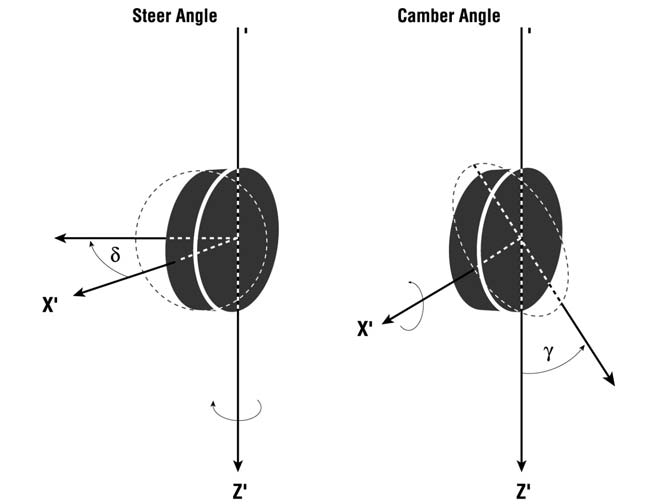
*Figure 4-8: Vehicle-fixed wheel orientation.*

Wheel spin is calculated by the equations of motion for each wheel (see Eqs. 27 through 32). If the steer degree of freedom option is selected, wheel steer is calculated by the equations of motion for the steering system (see Eqs. 33 through 39). Otherwise, wheel steer and wheel camber are determined from user-defined suspension properties, look-up tables and driver control tables. The manner in which the wheel orientations are calculated is dependent upon suspension type.

### Independent Suspension

Wheel camber angle, $\gamma_w$, for independent suspensions is determined using the vehicle suspension camber change table, by linear interpolation of the tabular inputs of camber vs. wheel jounce/rebound.

Wheel steer angle, $\delta_w$, for an independent suspension is determined first from the open-loop driver input table, using linear interpolation of the tabular inputs of wheel steer angle vs. time. If the At Axle steering option is used, the right-side and left-side steer angles may differ; if the At Steering Wheel option is used, the right-side and left-side steer angles are the same, and are equal to the table value divided by the steering gear ratio.

In addition to the current steering input from the driver steer table, steering may also occur as a result of rotation of the sprung mass about its roll axis (e.g., while cornering). The associated vertical wheel travel (jounce for the outside wheel; rebound for the inside wheel) can induce additional steering because of the kinematics of the suspension and steering arms. Thus, for an independent suspension, the total steer angle at a wheel is

$$
\delta_w = \delta_T + \kappa_0 + \kappa_1\,dz_w + \kappa_2\,dz_w^2 + \kappa_3\,dz_w^3
\qquad (\text{Eq. 63})
$$

where

| Symbol | Definition |
|---|---|
| $\delta_T$ | Steer angle interpolated from driver control table |
| $dz$ | Current wheel displacement from equilibrium |
| $\kappa_0,\kappa_1,\kappa_2,\kappa_3$ | Constant, first-order, second-order and third-order coefficients of roll steer vs. wheel jounce/rebound defined for each wheel |

Note that the right-side and left-side wheels may have different roll steer values. This is, in fact, what happens when a single wheel drops into a pothole.

> **NOTE:** This is called "Bump Steer".

### Solid Axle Suspension

Wheel camber angle, $\gamma_w$, for solid axle suspensions is determined by the equation of motion: because the camber angle is fixed with respect to the axle, the camber angle is equal to the vehicle-fixed axle roll angle, plus any axle camber set. Thus,

$$
\gamma_w = \phi_{Axle} + d\gamma_w
\qquad (\text{Eq. 64})
$$

where

| Symbol | Definition |
|---|---|
| $\phi_{Axle}$ | Vehicle-fixed axle roll angle (see Eq. 26) |
| $d\gamma_w$ | User-entered axle camber set |

Wheel steer angle, $\delta_w$, for a solid axle suspension is determined in the same manner as for independent suspension, described earlier, except that roll steer is not a function of individual wheel jounce/rebound; rather it is a function of the axle roll, $\phi_{Axle}$, with respect to the sprung mass. Thus,

$$
\delta_w = \delta_T + \kappa_\phi\,\phi_{Axle}
\qquad (\text{Eq. 65})
$$

where $\kappa_\phi$ = solid axle roll steer coefficient.

## Tire Contact Patch Velocity

The calculation of tire forces requires definition of the tire slip angle, which, in turn, requires calculation of velocity components at the tire contact patch. These velocity components are first calculated in the vehicle-fixed reference frame and then projected onto the ground plane beneath the tire. The calculation of these velocity components is a function of the vehicle's current CG velocity, vehicle-fixed wheel position and suspension type.

### Solid Axle

Contact patch velocity for a solid axle suspension is the result of the superimposed components of vehicle CG velocity and individual wheel center velocities. In addition, the contact patch is at a distance, $\vec h_w$, from the wheel center; this distance affects the individual contact patch velocity components. For a solid axle suspension, the resulting contact patch velocities are

$$
\begin{aligned}
u_{Tire} &= u - r(y_w + h_y) + q(z_w + h_z) & \text{(Eq. 66)}\\
v_{Tire} &= v - p(z_w + h_z) + r(x_w + h_x) & \text{(Eq. 67)}\\
w_{Tire} &= w - q(x_w + h_x) + (p + \dot\phi_{Axle})(y_w + h_y) + \dot z_{Axle} & \text{(Eq. 68)}
\end{aligned}
$$

where

| Symbol | Definition |
|---|---|
| $u,v,w$ | Vehicle-fixed forward, lateral and vertical velocity components |
| $p,q,r$ | Roll, pitch and yaw angular velocities about the vehicle-fixed axes |
| $x_w,y_w,z_w$ | Current vehicle-fixed wheel coordinates |
| $\dot z_{Axle}$ | Current axle vertical velocity |
| $\dot\phi_{Axle}$ | Current axle roll velocity |
| $h_x,h_y,h_z$ | Current vehicle-fixed components of distance from wheel center to tire contact patch |

### Independent Suspension

Contact patch velocity for an independent suspension is calculated using the same approach as that used for a solid axle suspension, except that the wheel positions and velocities are handled differently (e.g., see Eqs. 15 through 24). For an independent suspension, the contact patch velocities are

$$
u_{Tire} = u - r(y_w + h_y) + q(z_w + h_z)
\qquad (\text{Same as Eq. 66})
$$

$$
v_{Tire} = v - pz_w - h_z\left(p + \frac{d\gamma}{dz}\dot z_w\right) + r(x_w + h_x) + \frac{dy_w}{dz}\dot z_w
\qquad (\text{Eq. 69})
$$

$$
w_{Tire} = w - q(x_w + h_x) + py_w + \left(p + \frac{d\gamma}{dz}\dot z_w\right)h_y + \dot z_w
\qquad (\text{Eq. 70})
$$

where

| Symbol | Definition |
|---|---|
| $\dfrac{d\gamma}{dz}$ | Wheel camber change with respect to jounce/rebound interpolated from camber change table |
| $\dot z_w$ | Current vertical wheel velocity |
| $\dfrac{dy_w}{dz}$ | Wheel half-track change with respect to jounce/rebound interpolated from half-track table |

### Velocity in the Ground Plane

Finally, the velocity in the ground plane is determined. The forward and lateral components of this velocity are required for the tire slip angle calculation.

First define

$$
\begin{bmatrix}\cos\alpha_x\\ \cos\beta_x\\ \cos\gamma_x\end{bmatrix} = A\cdot\begin{bmatrix}1\\ 0\\ 0\end{bmatrix} = \text{the direction cosines for the vehicle-fixed x-axis}
$$

and

$$
\begin{bmatrix}\cos\alpha_y\\ \cos\beta_y\\ \cos\gamma_y\end{bmatrix} = A\cdot\begin{bmatrix}0\\ 1\\ 0\end{bmatrix} = \text{the direction cosines for the vehicle-fixed y-axis}
$$

The desired velocity is the projection onto the ground plane of the previously calculated contact patch velocity. The components of the projection of the vehicle-fixed x-axis onto the ground plane are

$$
\vec A_X = \begin{bmatrix}a_{x_i}\\ a_{x_j}\\ a_{x_k}\end{bmatrix} = \begin{bmatrix}
u_{Terrain_Z}\cos\beta_y - u_{Terrain_Y}\cos\gamma_y\\
u_{Terrain_X}\cos\gamma_y - u_{Terrain_Z}\cos\alpha_y\\
u_{Terrain_Y}\cos\alpha_y - u_{Terrain_X}\cos\beta_y
\end{bmatrix}
\qquad (\text{Eq. 71})
$$

The angle between the vehicle-fixed x-axis and its projection onto the ground plane is their dot product

$$
\theta_X = \arccos\left(\frac{\cos\alpha_x\,a_{x_i} + \cos\beta_x\,a_{x_j} + \cos\gamma_x\,a_{x_k}}{\sqrt{a_{x_i}^2 + a_{x_j}^2 + a_{x_k}^2}}\right)
\qquad (\text{Eq. 72})
$$

and the sign of $\theta_x$ is given by

$$
\mathrm{sgn}(\theta_x) = \mathrm{sgn}\left(\cos\gamma_x - \frac{a_{x_k}}{\sqrt{a_{x_i}^2 + a_{x_j}^2 + a_{x_k}^2}}\right)
\qquad (\text{Eq. 73})
$$

The forward velocity component of the tire contact point in the ground plane is

$$
u_{GP} = u_{Tire}\cos\theta_x - w_{Tire}\sin\theta_x
\qquad (\text{Eq. 74})
$$

The same procedure is used to calculate the components of the projection of the vehicle-fixed y-axis onto the ground plane,

$$
\vec A_y = \begin{bmatrix}a_{y_i}\\ a_{y_j}\\ a_{y_k}\end{bmatrix} = \begin{bmatrix}
u_{Terrain_Y}\cos\gamma_x - u_{Terrain_Z}\cos\beta_x\\
u_{Terrain_Z}\cos\alpha_x - u_{Terrain_X}\cos\gamma_x\\
u_{Terrain_X}\cos\beta_x - u_{Terrain_Y}\cos\alpha_x
\end{bmatrix}
\qquad (\text{Eq. 75})
$$

The angle between the vehicle-fixed y-axis and its projection onto the ground plane is their dot product

$$
\phi_y = \arccos\left(\frac{\cos\alpha_y\,a_{y_i} + \cos\beta_y\,a_{y_j} + \cos\gamma_y\,a_{y_k}}{\sqrt{a_{y_i}^2 + a_{y_j}^2 + a_{y_k}^2}}\right)
\qquad (\text{Eq. 76})
$$

and the sign of $\phi_y$ is given by

$$
\mathrm{sgn}(\phi_y) = \mathrm{sgn}\left(\cos\gamma_y - \frac{a_{y_k}}{\sqrt{a_{y_i}^2 + a_{y_j}^2 + a_{y_k}^2}}\right)
\qquad (\text{Eq. 77})
$$

The lateral velocity component of the tire contact point in the ground plane is

$$
v_{GP} = v_{Tire}\cos\phi_y - w_{Tire}\sin\phi_y
\qquad (\text{Eq. 78})
$$

## Tire-Road Contact Patch

Tire force calculations require that the tire-road interface be defined in terms of normal and shear forces, and resulting tire deflection. To perform these calculations requires a careful analysis of the wheel's orientation with respect to an arbitrary surface (terrain), as shown in Figure 4-9.

### Terrain Definition

The first step is to define the terrain (contact patch coordinates, friction multiplier and surface normal) beneath the tire. This step is performed using HVE's `GetSurfaceInfo()` function. Given the current earth-fixed coordinates, $X_t, Y_t$, of the tire's center of rotation, `GetSurfaceInfo()` searches the entire environment polygon database until it finds the polygon beneath the tire (see Figure 4-10). For this polygon, `GetSurfaceInfo()` returns the earth-fixed elevation, $Z_t$, beneath the tire center, as well as the friction multiplier, $f$, and unit vector, $\vec U_{Terrain}$, representing the surface normal for the polygon directly beneath each tire.

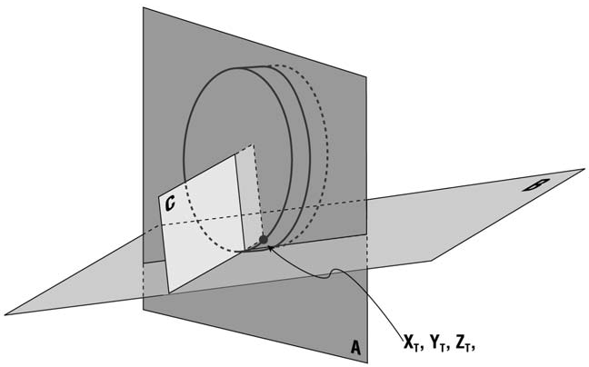
*Figure 4-9: Wheel-terrain geometry.*

## Tire-Ground Orientation

The tire-ground orientation is defined by the tire inclination angle, $\gamma_w$, and steer angle, $\delta_w$, relative to the surface beneath the wheel, as shown in Figure 4-9. A line in the earth-fixed coordinate system normal to the wheel plane is defined by a unit vector, $\vec U_w$:

$$
\vec U_w = \begin{bmatrix}u_{w_X}\\ u_{w_Y}\\ u_{w_Z}\end{bmatrix} = A\cdot\begin{bmatrix}-\sin\delta_w\\ \cos\gamma_w\cos\delta_w\\ \sin\gamma_w\cos\delta_w\end{bmatrix}
\qquad (\text{Eq. 79})
$$

where

| Symbol | Definition |
|---|---|
| $A$ | Transformation matrix (see Eq. 53) |
| $\gamma_w$ | Vehicle-fixed camber angle |
| $\delta_w$ | Vehicle-fixed steer angle |

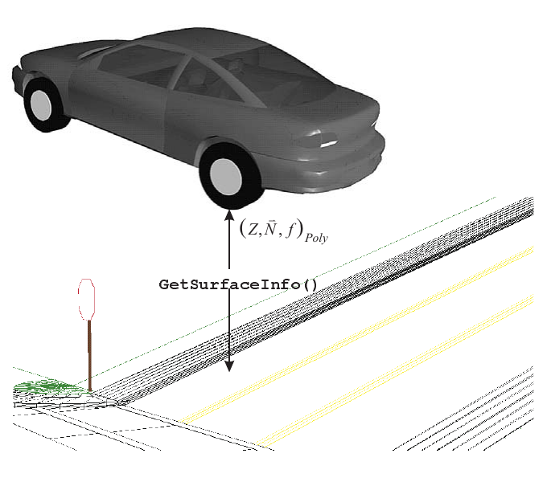
*Figure 4-10: GetSurfaceInfo() returns the terrain surface elevation, Z, friction multiplier, f, and surface normal, U, for the earth-fixed X,Y coordinates beneath the tire.*

Defining the surface normal returned by `GetSurfaceInfo()` as

$$
\vec U_{Terrain} = \begin{bmatrix}U_{Terrain_X}\\ U_{Terrain_Y}\\ U_{Terrain_Z}\end{bmatrix},
\qquad (\text{Eq. 80})
$$

the angle between the terrain surface normal, $\vec U_{Terrain}$, and the wheel normal, $\vec U_w$, is

$$
\alpha = \arccos\left(U_{Terrain_X}U_{w_X} + U_{Terrain_Y}U_{w_Y} + U_{Terrain_Z}U_{w_Z}\right)
\qquad (\text{Eq. 81})
$$

and the inclination angle relative to the ground, $\Gamma_w$, is

$$
\Gamma_W = \frac{\pi}{2} - \alpha
\qquad (\text{Eq. 82})
$$

The steer angle in the ground plane is the product of the vehicle-fixed steer angle, $\delta_w$, and the difference between the earth-fixed steer axis, $\vec U_\delta$, and surface normal, $\vec U_T$. The unit vector defining the earth-fixed angle of the steer axis is given by

$$
\vec U_\delta = \begin{bmatrix}U_{\delta_X}\\ U_{\delta_Y}\\ U_{\delta_Z}\end{bmatrix} = A\cdot\begin{bmatrix}0\\ -\sin\gamma_w\\ \cos\gamma_w\end{bmatrix}
\qquad (\text{Eq. 83})
$$

Then the steer angle relative to the ground, $\Psi_w$, is

$$
\Psi_w = \delta_w\left(U_{Terrain_X}U_{\delta_X} + U_{Terrain_Y}U_{\delta_Y} + U_{Terrain_Z}U_{\delta_Z}\right)
\qquad (\text{Eq. 84})
$$

### Tire-Ground Contact Point

The tire-ground contact point is defined by the intersection of three planes: the wheel plane, the plane of the terrain beneath the wheel center, and a plane through the wheel center perpendicular to the first two planes. This point is defined by three equations:

$$
\begin{aligned}
\lambda_1 &= X_w U_{w_X} + Y_w U_{w_Y} + Z_w U_{w_Z} & \text{(Eq. 85)}\\
\lambda_2 &= X_w U_{Terrain_X} + Y_w U_{Terrain_Y} + Z_w U_{Terrain_Z} & \text{(Eq. 86)}\\
\lambda_3 &= X_w D_1 + Y_w D_2 + Z_w D_3 & \text{(Eq. 87)}
\end{aligned}
$$

where

| Symbol | Definition |
|---|---|
| $\lambda_1$ | The equation defining the wheel plane |
| $\lambda_2$ | The equation defining the plane for the terrain beneath the wheel |
| $\lambda_3$ | The equation defining a plane perpendicular to $\lambda_1$ and $\lambda_2$ passing through the wheel center $X_w, Y_w, Z_w$ |
| $\vec U_w$ | Unit vector for the line in the earth-fixed coordinate system normal to the wheel plane (see Eq. 79) |
| $\vec U_{Terrain}$ | Unit vector for the terrain surface normal returned by `GetSurfaceInfo()` |
| $\vec D$ | Unit vector defining a line normal to both the wheel plane and the plane for the terrain beneath the wheel |

$$
\vec D = \begin{bmatrix}D_1\\ D_2\\ D_3\end{bmatrix} = \begin{bmatrix}
U_{w_Y}U_{Terrain_Z} - U_{Terrain_Y}U_{w_Z}\\
U_{w_Z}U_{Terrain_X} - U_{Terrain_Z}U_{w_X}\\
U_{w_X}U_{Terrain_Y} - U_{Terrain_X}U_{w_Y}
\end{bmatrix}
\qquad (\text{Eq. 88})
$$

The earth-fixed coordinates, $\vec T = [X_T\ Y_T\ Z_T]^T$, for the tire-ground contact point may now be solved directly using Eqs. 85 through 87. In matrix form,

$$
\begin{bmatrix}
U_{w_X} & U_{w_Y} & U_{w_Z}\\
U_{Terrain_X} & U_{Terrain_Y} & U_{Terrain_Z}\\
D_1 & D_2 & D_3
\end{bmatrix}\cdot\begin{bmatrix}X_T\\ Y_T\\ Z_T\end{bmatrix} = \begin{bmatrix}\lambda_1\\ \lambda_2\\ \lambda_3\end{bmatrix}
\qquad (\text{Eq. 89})
$$

## Tire Radial Deflection

Once the contact point is determined, the tire radial deflection can be calculated directly from the earth-fixed distance, $D$, between the wheel center, $X_w, Y_w, Z_w$, and the tire-ground contact point, $X_T, Y_T, Z_T$:

$$
D = \sqrt{(X_w - X_T)^2 + (Y_w - Y_T)^2 + (Z_w - Z_T)^2}
\qquad (\text{Eq. 90})
$$

Based on the distance from the wheel center to the terrain contact point, the current tire rolling radius, $r_T$, is

$$
r_T =
\begin{cases}
D, & \text{for } D < r_u\\
r_u, & \text{for } D \ge r_u
\end{cases}
\qquad (\text{Eq. 91})
$$

It is now a simple matter to calculate the tire radial deflection in the wheel plane by comparing the tire unloaded radius, $r_u$, with the current tire radius, $r_T$:

$$
\delta_T = r_u - r_T
\qquad (\text{Eq. 92})
$$

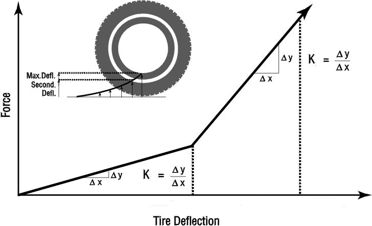
*Figure 4-11: 2-step radial tire stiffness used for calculating the current tire radial force.*

## Tire Radial Force

Tire radial force is calculated in the direction of the tire deflection according to the tire force-deflection properties (see Figure 4-11) and current deflection,

$$
F_R =
\begin{cases}
\xi K_T\,\delta_r, & \text{for } \delta_r < \delta_2\\[4pt]
\xi K_T\left(\overline K_T(\delta_r - \delta_2) + \delta_2\right), & \text{for } \delta_r \ge \delta_2
\end{cases}
\qquad (\text{Eq. 93})
$$

where

| Symbol | Definition |
|---|---|
| $F_R$ | Radial tire force (force in the tire plane in the direction of the tire deflection) |
| $K_T$ | Tire initial radial stiffness |
| $\overline K_T$ | Tire secondary stiffness multiplier |
| $\delta_2$ | Tire radial deflection at which $\overline K_T$ begins |
| $\xi$ | Tire restitution characteristic |

$$
\xi =
\begin{cases}
1.0, & \text{for } \delta_r > \delta_{r_{previous\ timestep}}\\
\lambda, & \text{for } \delta_r \le \delta_{r_{previous\ timestep}}
\end{cases}
$$

and $\lambda$ = tire stiffness multiplier ($0 \le \lambda \le 1$) for rebound.

If the current tire deflection, $\delta_r$, exceeds the maximum allowable tire deflection, $\delta_{max}$, SIMON terminates and returns a message to HVE telling the user that the current tire deflection is excessive.

> **NOTE:** $\delta_{max}$ is user-editable (see Tire, Physical Properties). By default, $\delta_{max}$ is set equal to the section height of the tire. Tire deflection beyond $\delta_{max}$ indicates wheel rim deformation — a condition beyond the scope of the tire model. (To properly model such behavior would require non-linear finite element analysis.)

Tire radial force, $F_R$, is an important fundamental property as one of the primary inputs to the tire model which is used to calculate braking and cornering force.

## Tire Model

SIMON uses the EDC semi-empirical tire model developed for EDVDS [2]. The basis for the EDC semi-empirical tire model is the HSRI tire model, developed at the University of Michigan Transportation Research Institute [3]. The model was extended to allow large tire slip angles, drive torque (i.e., tire forces that accelerate the vehicle) and drive and/or brake torque when the vehicle is rolling backwards. The SIMON implementation for load- and speed-dependent tire properties has been extended by replacing the method of partial derivatives with a table look-up method. An overview of the extended model is provided below for purposes of comparison with the HSRI and EDVDS tire models.

*(updated: the current Calculation Options dialog offers three versions of the semi-empirical tire model — Vers 1, Vers 2 (default) and Vers 3 — representing successive refinements of the implementation in `Physics/Source/Simon/Tire.cpp`. A hydroplaning model (NASA, NASA-TTI or Gallaway; see `Physics/Source/Simon/Hydroplane.cpp`) may also be selected, which reduces the available tire-road friction as a function of speed, water depth and tire parameters.)*

The semi-empirical tire model describes empirically what is occurring at the tire-road shear interface, according to the current tire-road conditions. It employs a simplified theory assuming an adhesion region and a sliding region. The major assumptions made by the tire model are:

- The contact patch can be divided into two regions: an adhesion region and a sliding region.
- The shear force generated in the adhesion region depends on the elastic properties of the tire, and the shear force generated in the sliding region depends on the frictional properties at the tire-road interface.

The inputs required by the tire model are

| Input | Definition |
|---|---|
| $F_o$ | Vertical load for up to three test loads |
| $V_o$ | Longitudinal velocity for up to three test speeds |
| $\mu_p, \mu_s, S_{\mu_p}$ | Peak and slide tire-road friction and longitudinal slip at peak friction for each load and speed (these data generate a µ-slip curve for each test load and speed; see Figure 4-12) |
| $C_\alpha$ | Cornering stiffness for up to three test loads and speeds (see Figure 4-13) |
| $C_\gamma$ | Camber stiffness for up to three test loads and speeds (see Figure 4-14) |

During execution, the current tire radial load, $F_R$, rolling radius, $r_T$, and forward velocity component in the ground plane, $u_{GP}$, are calculated (see Eqs. 93, 91 and 74, respectively). In addition, the current longitudinal slip, $S$, is calculated:

$$
S = 1 - \Omega\left(\frac{r_T}{u_{GP}}\right)
\qquad (\text{Eq. 94})
$$

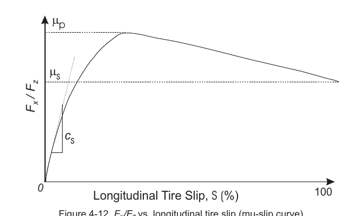
*Figure 4-12: Fx/Fz vs. longitudinal tire slip (mu-slip curve).*

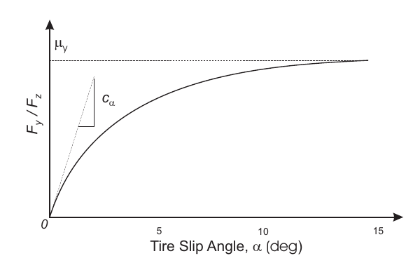
*Figure 4-13: Fy/Fz vs. tire slip angle, α.*

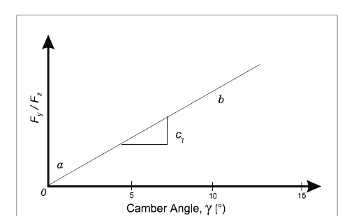
*Figure 4-14: Fy/Fz vs. tire inclination angle, γ.*

Based on the above test tire parameters and the current tire load and velocity, the effective values are calculated using linear interpolation,

$$
\mu_p' = f(F_R, u_{GP}),\quad \mu_s' = f(F_R, u_{GP}),\quad S_{\mu_p}' = f(F_R, u_{GP}),\quad C_\alpha' = f(F_R, u_{GP}),\quad C_\gamma' = f(F_R, u_{GP})
$$

From these data, the following intermediate parameters are computed:

$$
a = \left(1.0 + S_{\mu_p}'\right)\left(1.0 - S_{\mu_p}'\right)^2
\qquad (\text{Eq. 95})
$$

$$
b = \left(1.0 - S_p'\right)\left(\mu_s'\left(S_p' + 2.0\right) - \mu_p'\left(2.0S_p' + 1.0\right)\right)
\qquad (\text{Eq. 96})
$$

$$
c = \left(\mu_s' - \mu_p'\right)\mu_s'
\qquad (\text{Eq. 97})
$$

$$
B = \frac{-b + \sqrt{b^2 - 4ac}}{2a}
\qquad (\text{Eq. 98})
$$

$$
A = \mu_s' + B
\qquad (\text{Eq. 99})
$$

$$
C = \mu_s' + B\left(1.0 - S_{\mu_p}'\right)
\qquad (\text{Eq. 100})
$$

From the above values, the effective friction, $\mu$, and longitudinal slip stiffness, $C_s$, are then computed as follows:

$$
C_s = \frac{C^2 F_z\left(1.0 - S_p'\right)}{4.0S_p'\left(C - \mu_p'\right)}
\qquad (\text{Eq. 101})
$$

$$
\mu = A - BS
\qquad (\text{Eq. 102})
$$

Based on the above parameters, the fraction of the adhesion region of the total contact patch, $X_s/L$ (where $L$ is the total length of the contact patch, and $X_s$ is the distance from the front of the contact patch to the point where sliding starts), is calculated as follows:

$$
D_t = \sqrt{(C_s S)^2 + (C_\alpha'\sin\alpha)^2}
\qquad (\text{Eq. 103})
$$

$$
\frac{X_s}{L} = \frac{\mu F_z(1.0 - S)}{2.0D_t}
\qquad (\text{Eq. 104})
$$

$X_s/L$ is limited to 1.0 (note that $X_s/L = 1.0$ means there is no sliding region). If $X_s/L = 1.0$, the longitudinal and lateral tire forces, $F_{x'}$ and $F_{y'}$, respectively, are

$$
F_{x'} = \frac{C_s S}{1.0 - S}
\qquad (\text{Eq. 105})
$$

and

$$
F_{y'} = \frac{-C_\alpha'\sin\alpha}{1.0 - S}
\qquad (\text{Eq. 106})
$$

If $X_s/L < 1.0$, there is some sliding at the tire-road interface. For this condition, the tire forces in the adhesion region and sliding region are computed separately. $F_{x'}$ and $F_{y'}$ tire forces in the adhesion region are

$$
F_{x'_{Adhesion}} = C_s S\left(\frac{\mu F_z}{2.0D_t}\right)^2(1.0 - S)
\qquad (\text{Eq. 107})
$$

and

$$
F_{y'_{Adhesion}} = -C_\alpha\sin\alpha\left(\frac{\mu F_z}{2.0D_t}\right)^2(1.0 - S)
\qquad (\text{Eq. 108})
$$

The tire force components in the sliding region are:

$$
F_{x'_{Sliding}} = \mu F_z\left(1.0 - \frac{X_s}{L}\right)\left(\frac{S}{\sqrt{S^2 + \sin^2\alpha}}\right)
\qquad (\text{Eq. 109})
$$

and

$$
F_{y'_{Sliding}} = -\mu F_z\left(1.0 - \frac{X_s}{L}\right)\left(\frac{\sin\alpha}{\sqrt{S^2 + \sin^2\alpha}}\right)
\qquad (\text{Eq. 110})
$$

The total tire force is the sum of the force in the adhesion and sliding regions,

$$
F_{x'} = F_{x'_{Adhesion}} + F_{x'_{Sliding}}
\qquad (\text{Eq. 111})
$$

and

$$
F_{y'} = F_{y'_{Adhesion}} + F_{y'_{Sliding}}
\qquad (\text{Eq. 112})
$$

The tire model uses the current vertical tire load, $F_z$, and the fraction of the sliding region at the tire-road interface to set the skid flag, $SF$:

$$
\text{if}\ \begin{Bmatrix}F_Z > F_{z,min}\\ \text{and}\\ \frac{X_s}{L} < \tau\end{Bmatrix},\quad SF = \text{TRUE}
\qquad (\text{Eq. 113})
$$

In the above development, the original HSRI model has been modified in three ways: First, the tangent function used by the HSRI model has been replaced by the sine function. This change allows the EDC tire model to properly handle slip angles throughout the continuous range $-\pi \le \alpha \le \pi$. (Note that $\tan\alpha \to \infty$ as $\alpha \to 90$ degrees, resulting in an infinite lateral tire force and the resulting integration failure in the HSRI model.) Second, longitudinal slip, $S$, has been replaced by $|S|$ in the EDC model to allow for drive torque at the tire-road interface. Third, as was mentioned earlier, load- and speed-dependent tire parameters are now calculated from data tables, using linear interpolation, rather than using partial derivatives.

### Rolling Resistance

The original EDC semi-empirical tire model has also been extended to include a circumferential tire moment from rolling resistance. The rolling resistance moment, $M_{Rolling}$, is given by

$$
M_{Rolling} = r\left(\sigma_0 F_R + \sigma_v \left|u_{GP}\right|\right)\cdot\left(-\mathrm{sgn}(\Omega)\right)\cdot R_{rMult}
\qquad (\text{Eq. 114})
$$

where

| Symbol | Definition |
|---|---|
| $r$ | Tire rolling radius |
| $\sigma_0$ | Load-dependent rolling resistance coefficient |
| $\sigma_v$ | Velocity-dependent rolling resistance coefficient |
| $F_R$ | Radial tire force |
| $u_{GP}$ | Forward component of tire velocity in ground plane |
| $\Omega$ | Wheel spin angular velocity |
| $R_{rMult}$ | Rolling-resistance multiplier applied by the hydroplaning model (unity when no hydroplaning is active) |

The $-\mathrm{sgn}(\Omega)$ factor makes the moment resist wheel rotation, and the $R_{rMult}$ factor scales rolling resistance according to the selected hydroplaning model. (For $\left|\Omega\right| < $ a minimum spin threshold the moment is linearly ramped toward zero to avoid chatter.)

The rolling resistance moment contributes to the equations of motion for the wheel spin degree of freedom (see Eqs. 27 through 32).

## Suspension Force

Independent and solid axle suspensions are supported in SIMON. The equations of motion for each suspension type were discussed earlier (see Eqs. 7 through 10 and 18 through 26). Suspension force calculations for both models are identical. The force is calculated using a spring-damper model with additional coulomb friction, as shown in the model in Figure 4-15. The spring is free to move only in the vehicle-fixed z-direction. The total suspension force is the sum of the spring force, damping (shock absorber) force and coulomb friction force. The force from an anti-sway bar, used for producing additional roll stiffness, is also included in the model. Mathematically, the force, $F_s$, at each suspension location is

$$
F_S = K\delta + C\dot\delta + F_\mu + \frac{K_{rs}}{\vec r_s}\phi_{Axle}
\qquad (\text{Eq. 115})
$$

where

| Symbol | Definition |
|---|---|
| $K$ | Linear spring rate of suspension spring |
| $\delta$ | Spring deflection from equilibrium (+ down) |
| $C$ | Velocity-dependent damping rate |
| $\dot\delta$ | Spring deflection rate |
| $F_\mu$ | Coulomb friction |
| $K_{rs}$ | Auxiliary roll stiffness of anti-sway bar |
| $\vec r_s$ | Spring location, y-coordinate |
| $\phi_{Axle}$ | Vehicle-fixed axle roll angle |

The model also includes suspension stops for both jounce (−) and rebound (+) spring deflections (see Figure 4-16). The effect of a suspension stop is to limit suspension travel by increasing significantly the suspension stiffness. The suspension force generated at a suspension stop is expressed mathematically as

$$
F_{Stop} =
\begin{cases}
K_1\delta_{Stop} + K_3\delta_{Stop}^3, & \text{for } \delta\cdot\dot\delta \ge 0\\[4pt]
\eta\left(K_1\delta_{Stop} + K_3\delta_{Stop}^3\right), & \text{for } \delta\cdot\dot\delta < 0
\end{cases}
\qquad (\text{Eq. 116})
$$

where

| Symbol | Definition |
|---|---|
| $K_1$ | Stop linear rate |
| $K_3$ | Stop cubic rate |
| $\delta_{Stop}$ | Deformation of suspension stop |
| $\eta$ | Stop energy ratio |
| $\delta\cdot\dot\delta$ | (−) if stop deformation is decreasing (used for reducing $F_{Stop}$; see Eq. 116) |

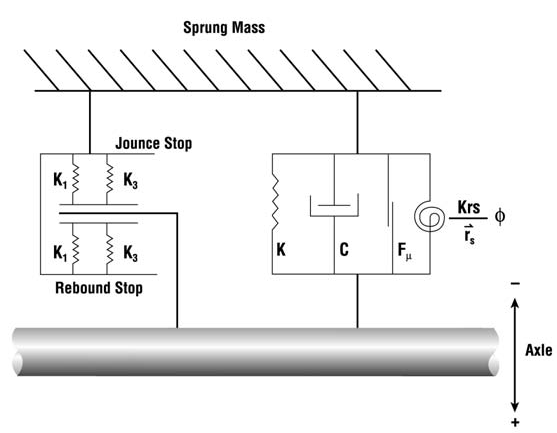
*Figure 4-15: Suspension force model.*

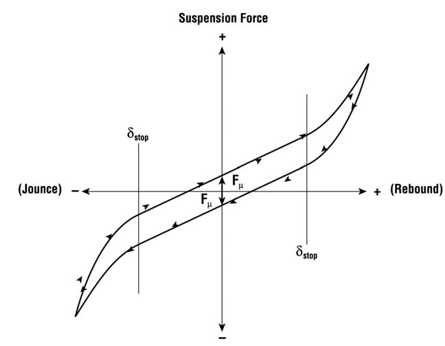
*Figure 4-16: Force produced by suspension stops.*

## Inter-Vehicle Connection Model

In a multi-vehicle train (e.g., a tractor-semitrailer), each sprung mass is allowed six degrees of freedom. The sprung masses are connected by constraint forces and moments acting at the inter-vehicle connection points, as shown in Figure 4-17.

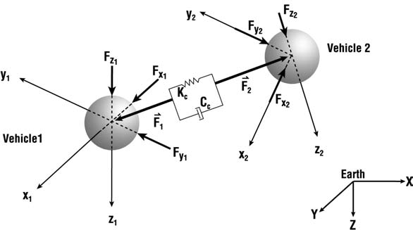
*Figure 4-17: Inter-vehicle connection force.*

### Connection Force

The constraint force is first calculated in the inertial (earth-fixed) reference system, then resolved according to each vehicle-fixed system. In the earth-fixed system,

$$
\vec F_C = \left(\vec R_n - \vec R_{n+1}\right)\cdot K_C + \left(\vec V_n - \vec V_{n+1}\right)\cdot C_C
\qquad (\text{Eq. 117})
$$

where

| Symbol | Definition |
|---|---|
| $\vec R_n - \vec R_{n+1}$ | Earth-fixed distance between connection points on vehicles $n$ and $n+1$ |
| $K_C$ | Constraint spring rate for vehicle pair. For the default Connection Model (Use Heavier Vehicle) $K_C = \max\left(m_{n_{Sprung}}, m_{n+1_{Sprung}}\right)\cdot g$ |
| $\vec V_n - \vec V_{n+1}$ | Earth-fixed relative velocity between connection points on vehicles $n$ and $n+1$ |
| $C_C$ | Constraint damping rate for vehicle pair $= 0.5\sqrt{K_{C_n}\max\left(m_{n_{Sprung}}, m_{n+1_{Sprung}}\right)}$ |

*(updated: the current Calculation Options dialog adds a Connection Model option that selects which sprung mass governs the constraint rates, and a Connection Failure Start Time that sets the earliest time at which a connection is permitted to fail; see Chapter 2. The three Connection Model settings are:*
- *Use Heavier Vehicle (default) — the constraint weight is the heavier sprung mass, $\max\left(m_{n_{Sprung}}, m_{n+1_{Sprung}}\right)\cdot g$, as shown above.*
- *Use Both Vehicles — a weighted blend of the two sprung masses is used, $0.75\,m_{Sprung,min} + 0.25\,m_{Sprung,max}$ (times $g$), for both $K_C$ and $C_C$.*
- *Use Tow Veh Properties — the tow vehicle's user-entered rear-connection stiffness and damping values are used directly instead of a mass-derived rate.*
*)*

Calculation of connection earth-fixed position, $\vec R$, employs the $A$ matrix defined in Eq. 53,

$$
\vec R = \begin{bmatrix}R_X\\ R_Y\\ R_Z\end{bmatrix} = \begin{bmatrix}CG_X\\ CG_Y\\ CG_Z\end{bmatrix} + A\cdot\begin{bmatrix}r_x\\ r_y\\ r_z\end{bmatrix}
\qquad (\text{Eq. 118})
$$

where

| Term | Definition |
|---|---|
| $[R_X\ R_Y\ R_Z]^T$ | Earth-fixed X, Y, Z coordinates of the connection point |
| $[r_x\ r_y\ r_z]^T$ | Vehicle-fixed x, y, z coordinates of connection point |

The equations of motion require the earth-fixed connection force to be resolved in the vehicle-fixed reference frame for each vehicle. The vehicle-fixed components of the connection force are

$$
\vec f_{C_n} = \begin{bmatrix}f_{x_{C_n}}\\ f_{y_{C_n}}\\ f_{z_{C_n}}\end{bmatrix} = -A_n^T\cdot\begin{bmatrix}F_{X_{C_n}}\\ F_{Y_{C_n}}\\ F_{Z_{C_n}}\end{bmatrix}
\qquad (\text{Eq. 119})
$$

for the towing vehicle and

$$
\vec f_{C_{n+1}} = \begin{bmatrix}f_{x_{C_{n+1}}}\\ f_{y_{C_{n+1}}}\\ f_{z_{C_{n+1}}}\end{bmatrix} = A_{n+1}^T\cdot\begin{bmatrix}F_{X_{C_{n+1}}}\\ F_{Y_{C_{n+1}}}\\ F_{Z_{C_{n+1}}}\end{bmatrix}
\qquad (\text{Eq. 120})
$$

for the trailing vehicle.

The total force sums from each connection (front and rear) are

$$
\sum \vec F_{Conn} = \vec f_{C_{Front}} + \vec f_{C_{Rear}}
\qquad (\text{Eq. 121})
$$

To calculate the velocities, a similar procedure is used. First, the vehicle-fixed velocity components for the connection are required:

$$
\begin{aligned}
u_{Conn} &= u - ry_{Conn} + qz_{Conn} & \text{(Eq. 122)}\\
v_{Conn} &= v - pz_{Conn} + rx_{Conn} & \text{(Eq. 123)}\\
w_{Conn} &= w - qx_{Conn} + py_{Conn} & \text{(Eq. 124)}
\end{aligned}
$$

These velocities are next transformed to the earth-fixed reference system,

$$
\vec V_C = \begin{bmatrix}V_{X_C}\\ V_{Y_C}\\ V_{Z_C}\end{bmatrix} = A\cdot\begin{bmatrix}u_{Conn}\\ v_{Conn}\\ w_{Conn}\end{bmatrix}
\qquad (\text{Eq. 125})
$$

These earth-fixed velocity components are used in Eq. 117.

### Connection Moments

SIMON models roll and yaw moment transfers between connected vehicles. The roll moment is the result of a difference in roll angle between connected vehicles and the yaw moment results from friction in the connection.

The roll moment is calculated as follows:

$$
\gamma = \psi_n - \psi_{n+1}
\qquad (\text{Eq. 126})
$$

$$
M_{x_n} = \left(\phi_{n+1}\cos\gamma - \phi_n\right)K_{Frame_n} + \left(\dot\phi_{n+1}\cos\gamma - \dot\phi_n\right)C_{Frame_n}
\qquad (\text{Eq. 127})
$$

where

| Symbol | Definition |
|---|---|
| $\gamma$ | Yaw articulation angle between vehicles $n$ and $n+1$ |
| $K_{Frame_n}$ | Frame torsional stiffness for vehicle $n$ (user-entered) |
| $C_{Frame_n}$ | Frame torsional damping for vehicle $n$ |

The friction moment is

$$
M_{Friction_n} =
\begin{cases}
\mu_{Conn}F_{z_{Conn}}r_{Conn}, & \text{for } \dot\gamma \ge \omega\\[6pt]
\left(\dfrac{\dot\gamma}{\omega}\right)\mu_{Conn}F_{z_{Conn}}, & \text{for } \dot\gamma < \omega
\end{cases}
\qquad (\text{Eq. 128})
$$

where

| Symbol | Definition |
|---|---|
| $\mu_{Conn}$ | Friction coefficient at connection |
| $F_{z_{Conn}}$ | Vehicle-fixed z-component of connection force (see Eqs. 119 and 120) |
| $r_{Conn}$ | Moment radius for connection |
| $\omega$ | Null band for friction torque at connection |

The total moments from the rear connection of vehicle $n$ are

$$
\begin{aligned}
M_{x_{Conn_n}} &= -f_{y_{C_n}}r_z + f_{z_{C_n}}r_y + M_{Roll_x} & \text{(Eq. 129)}\\
M_{y_{Conn_n}} &= -f_{z_{C_n}}r_x + f_{x_{C_n}}r_z & \text{(Eq. 130)}\\
M_{z_{Conn_n}} &= -f_{x_{C_n}}r_y + f_{y_{C_n}}r_x + M_{Friction_n} & \text{(Eq. 131)}
\end{aligned}
$$

And the total moments from the front connection of vehicle $n+1$ are

$$
\begin{aligned}
M_{x_{Conn_{n+1}}} &= -f_{y_{C_{n+1}}}r_z + f_{z_{Conn_{n+1}}}r_y - M_{Roll_n}\cos\gamma & \text{(Eq. 132)}\\
M_{y_{Conn_{n+1}}} &= -f_{z_{C_{n+1}}}r_x + f_{x_{C_{n+1}}}r_z - M_{Roll_n}\sin\gamma & \text{(Eq. 133)}\\
M_{z_{C_{n+1}}} &= -f_{x_{C_{n+1}}}r_y + f_{y_{C_{n+1}}}r_x - M_{Friction_n} & \text{(Eq. 134)}
\end{aligned}
$$

The total connection moments on vehicle $n$ are

$$
\sum \vec M_C = \vec M_{n_{Rear}} + \vec M_{n_{Front}}
\qquad (\text{Eq. 135})
$$

## Dollys

Two types of dollys are supported by SIMON:

- **Converter Dolly** — The fifth wheel articulates about the pitch axis, and the drawbar is rigidly attached to the dolly. The result is that brake torque is resisted at the pintle hook of the tow vehicle.

  > **NOTE:** Thus, trailer braking results in a vertical load transfer to the rear of the tow vehicle.

- **Fixed Dolly** — The fifth wheel is fixed to the trailer and is not free to articulate about its pitch axis. The drawbar is hinged.

  > **NOTE:** Thus, there is no load transfer to the tow vehicle.

The two dolly types are shown in Figure 4-18.

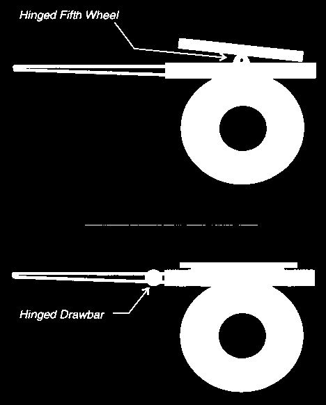
*Figure 4-18: Converter (above) and Fixed (below) dollys.*

## Aerodynamics Model

SIMON includes a lumped parameter aerodynamics model that includes drag on all six vehicle surfaces (front, back, right, left, top and bottom), as well as two additional, user-defined devices, such as a front or rear wing (see Figure 4-19). Air properties (temperature and pressure) are supplied by the Environment Editor, allowing SIMON to study various effects, such as cross-wind, on vehicle handling performance.

Aerodynamic forces and moments produced by each surface act on the sprung mass. To compute these forces, the earth-fixed wind velocity must first be calculated,

$$
\vec V_{Wind} = \begin{bmatrix}V_{X_{Wind}}\\ V_{Y_{Wind}}\\ V_{Z_{Wind}}\end{bmatrix} = \begin{bmatrix}S_{Wind}\cos(\psi_{Wind} - \pi)\\ S_{Wind}\sin(\psi_{Wind} - \pi)\\ 0\end{bmatrix}
\qquad (\text{Eq. 136})
$$

where

| Symbol | Definition |
|---|---|
| $S_{Wind}$ | User-entered wind speed |
| $\psi_{Wind}$ | User-entered wind direction relative to earth-fixed X-axis |

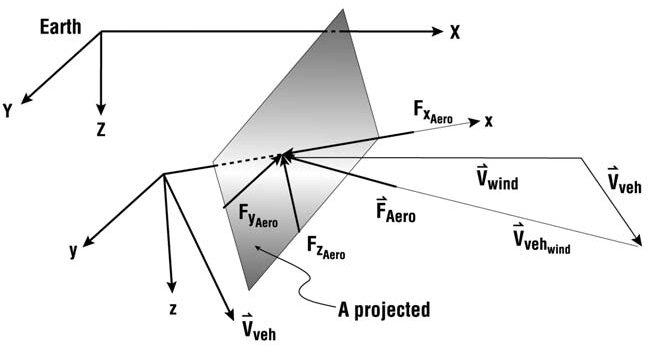
*Figure 4-19: Aerodynamic forces and moments.*

The earth-fixed components of the vehicle velocity vector are

$$
\vec V_{Veh} = \begin{bmatrix}V_{X_{Veh}}\\ V_{Y_{Veh}}\\ V_{Z_{Veh}}\end{bmatrix} = A\cdot\begin{bmatrix}u\\ v\\ w\end{bmatrix}
\qquad (\text{Eq. 137})
$$

Next, calculate the earth-fixed components of the total relative wind velocity acting on the vehicle,

$$
\vec V' = \begin{bmatrix}V'_{X_{Wind}}\\ V'_{Y_{Wind}}\\ V'_{Z_{Wind}}\end{bmatrix} = \vec V_{Wind} - \vec V_{Veh} = \begin{bmatrix}V_{X_{Wind}}\\ V_{Y_{Wind}}\\ V_{Z_{Wind}}\end{bmatrix} - \begin{bmatrix}V_{X_{Veh}}\\ V_{Y_{Veh}}\\ V_{Z_{Veh}}\end{bmatrix}
\qquad (\text{Eq. 138})
$$

Finally, the vehicle-fixed components of the total relative wind velocity are computed:

$$
\vec V_{VehWind} = \begin{bmatrix}V_{x_{Wind}}\\ V_{y_{Wind}}\\ V_{z_{Wind}}\end{bmatrix} = A^T\begin{bmatrix}V'_{X_{Wind}}\\ V'_{Y_{Wind}}\\ V'_{Z_{Wind}}\end{bmatrix}
\qquad (\text{Eq. 139})
$$

SIMON uses HVE's aerodynamics model, which allows up to eight individual surfaces to produce aerodynamic forces and moments on the sprung mass. The aerodynamic force on each surface is

$$
\vec F_{Aero} = \begin{bmatrix}f_{x_{Aero}}\\ f_{y_{Aero}}\\ f_{z_{Aero}}\end{bmatrix} = C_A\begin{bmatrix}V_{x_{Wind}}\cdot\mathrm{sgn}\!\left(V_{x_{Wind}}^2\right)\\ V_{y_{Wind}}\cdot\mathrm{sgn}\!\left(V_{y_{Wind}}^2\right)\\ V_{z_{Wind}}\cdot\mathrm{sgn}\!\left(V_{z_{Wind}}^2\right)\end{bmatrix}
\qquad (\text{Eq. 140})
$$

where $C_A$ = aerodynamic constant for each surface:

$$
C_A = \frac{C_d A\rho}{2g}
$$

where

| Symbol | Definition |
|---|---|
| $C_d$ | Aerodynamic drag coefficient |
| $A$ | Projected surface area |
| $\rho$ | Air density $= \dfrac{P_{Barometric}}{GasConst\cdot T_{Absolute}}$ |

> **NOTE:** By default, the front surface is normally assigned aerodynamic properties. Assignment of aerodynamic properties for other surfaces is left up to the user.

Finally, the sum of the vehicle-fixed aerodynamic forces and moments is computed,

$$
\vec F_{Aero} = \begin{bmatrix}F_{x_{Aero}}\\ F_{y_{Aero}}\\ F_{z_{Aero}}\end{bmatrix} = \begin{bmatrix}\sum_{i=1}^{N} f_{x_{Aero}}\\ \sum_{i=1}^{N} f_{y_{Aero}}\\ \sum_{i=1}^{N} f_{z_{Aero}}\end{bmatrix}
\qquad (\text{Eq. 141})
$$

and

$$
\vec M_{Aero} = \begin{bmatrix}M_{x_{Aero}}\\ M_{y_{Aero}}\\ M_{z_{Aero}}\end{bmatrix} = \begin{bmatrix}\sum_{i=1}^{N}\left(-f_{y_{Aero}}r_{z_{CP}} + f_{z_{Aero}}r_{y_{CP}}\right)\\ \sum_{i=1}^{N}\left(-f_{z_{Aero}}r_{x_{CP}} + f_{x_{Aero}}r_{z_{CP}}\right)\\ \sum_{i=1}^{N}\left(-f_{x_{Aero}}r_{y_{CP}} + f_{y_{Aero}}r_{z_{CP}}\right)\end{bmatrix}
\qquad (\text{Eq. 142})
$$

where

| Symbol | Definition |
|---|---|
| $N$ | Number of aerodynamic surfaces or devices in use |
| $r_{CP}$ | Center of pressure for surface, $i$ |

These forces and moments are included in the dynamics engine (see Eqs. 3 and 7).

## Sprung Mass Impact Model

SIMON uses HVE's DyMESH collision model to compute 3-dimensional forces and moments resulting from inter-vehicle collision. Simultaneous collision forces between any number of vehicles are allowed. The DyMESH collision model is described in references 7 and 8. In general, vehicle-fixed force components are calculated for each vertex. These forces are summed and the resulting summed forces and moments acting on the sprung mass are supplied to the dynamics engine (see Eqs. 3 and 7).

*(updated: the current DyMESH implementation — `Physics/Include/DYMESH.H`, `Physics/Source/LibHve/Dymesh.cpp` and the SIMON-side interface in `Physics/Source/Simon/PHYMODEL.CPP` — includes several capabilities beyond those described in the Fifth Edition manual:)*

- *Two selectable algorithm versions (Version 3 and Version 4) and two mesh smoothing models, selected in the DyMESH Options dialog (see Chapter 2).*
- *Vehicle-environment collision detection (Include Environment) with independent vehicle and environment start times.*
- *Tow vehicle/trailer mesh contact for articulated vehicles.*
- *DyMESH wheel contact and wheel damage. Each wheel can carry its own collision mesh (`DyMeshWheels()` and `UpdateWheelMeshDamage()` in `PHYMODEL.CPP`). Collision forces acting on a wheel mesh are added to the sprung mass, and forces exceeding the wheel's user-entered damage thresholds (Max No-Damage Force/Moment, Deformation Rate and Max Force/Moment — see the Event Editor's Vehicle Wheels dialog) produce permanent wheel displacement and reorientation, which in turn affect the wheel kinematics of Eqs. 58–62.*
- *Wheel displacement capping. In the current code, the collision-induced x-y displacement of a wheel during a timestep is tracked against the maximum contact movement of the wheel mesh vertices for that timestep (`MaxContactDispl`); the computed force-based displacement is capped so it can never exceed the actual contact motion, and no displacement is produced when there is no mesh contact movement. This prevents overprediction of wheel set-back or track-width change in severe impacts ("Track and cap wheel contact displacement in DyMesh wheel updates," commits `12131c2`/`16a1825`).*

## Software Implementation

The above physics model and component modules are implemented in a single HVE-compatible physics model, named SIMON.

SIMON is programmed using the C programming language. It is a modular program and includes several C functions to perform specific tasks. A general flow chart for SIMON is shown in Figure 4-20.

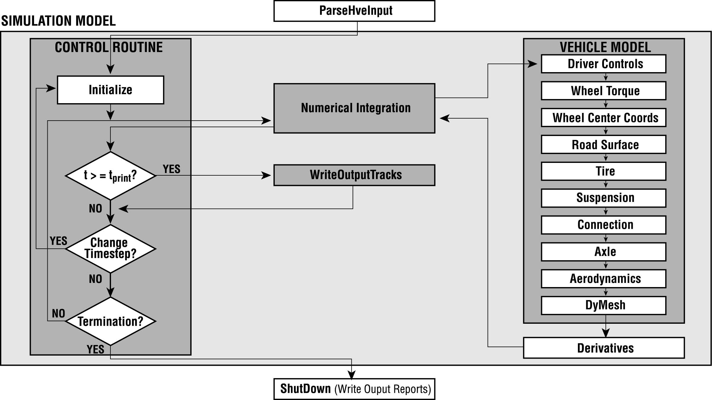
*Figure 4-20: Flowchart for SIMON main calculation procedures.*

*(updated: the current SIMON engine sources reside in `Physics/Source/Simon/` — principal modules include `PHYMAIN.CPP` (main calculation loop), `PHYMODEL.CPP` (dynamics model and DyMESH interface), `PHYINPUT.CPP` (input processing and reports), `Tire.cpp` (tire model), `TORQUE.CPP` (wheel torque), `WHEELPOS.CPP` (wheel position), `suspension.cpp`, `sprungmass.cpp`, `AXLE.CPP`, `AERO.CPP` (aerodynamics), `connection.cpp` (inter-vehicle connections), `DRIVER.CPP` (driver model), `Hydroplane.cpp` (hydroplaning), `CollisionPulse.cpp` (collision pulse), `Road.cpp`, `OUTPUT.CPP` and `PINT1.CPP` (numerical integration).)*

<!-- NAV -->

---

← Previous: [Chapter 3 — SIMON Program Output](03-program-output.md)  |  [Index](README.md)  |  Next: [Chapter 5 — SIMON Tutorial](05-tutorial.md) →

<!-- /NAV -->
