# Chapter 4 — Calculation Method

## Basis For Analysis

SIMON is a dynamic simulation analysis of one or more vehicles. SIMON is a simulation model incorporating a general purpose 3-D dynamics engine developed by Engineering Dynamics Corporation. SIMON includes a sprung mass with six degrees of freedom (x, y, z, roll, pitch, yaw) and unsprung masses with three degrees of freedom per axle (axle roll, z and steer for solid axle suspensions; axle steer and right and left wheel z for independent suspensions).

The vehicle model includes the following basic components for each vehicle unit:

- Sprung mass
- Up to three axles (full trailers may have up to six axles)
- Independent or solid axle suspension for each axle
- Single or dual tires at each wheel location
- Front and rear inter-vehicle connections
- Exterior geometry
- Aerodynamic surface(s)
- Payload(s)
- Human occupant(s)
- Steering system
- Braking system
- Drivetrain

The basic vehicle model is shown in Figure 4-1.

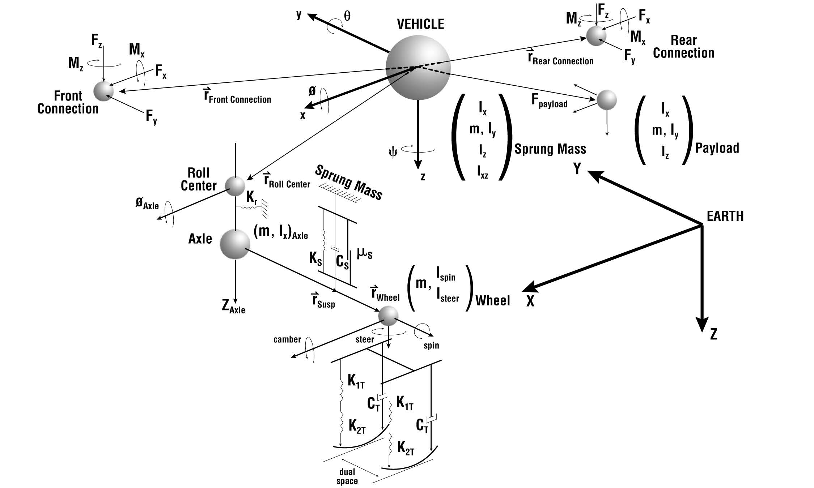
*Figure 4-1: SIMON Vehicle Model.*

## Equations of Motion

The system of equations requires three coordinate systems:

- **Inertial reference system** — This is the earth-fixed coordinate system defined by an orthogonal (right-handed) X, Y, Z coordinate axis system. The Z-axis is parallel to the gravity vector, hence it is pointed downward. The X and Y directions are arbitrary (within the requirement of orthogonality).
- **Vehicle reference system** — This is the vehicle-fixed coordinate system defined by an orthogonal (right-handed) x, y, z coordinate system attached to the sprung mass. Its origin is coincident with the sprung mass center of gravity (CG). The x-axis defines the forward vehicle direction, the y-axis points to the vehicle's right side and the z-axis points towards the bottom of the vehicle.
- **Tire reference system** — This is the tire-fixed coordinate system defined by an orthogonal, right-handed coordinate system fixed to the tire. It has as its origin the perpendicular intersection between the tire plane, the road plane (i.e., terrain) and a plane through the wheel center. The x′-axis lies in the road plane and points in the tire-fixed forward direction, the y′-axis points to the right and the z′-axis is a radial vector in the tire plane normal to the road plane.

These coordinate systems follow SAE Recommended Practice J-670e [5].

The equations that govern the general, non-linear, unsteady motion of the vehicle sprung mass are based on Euler's equations of motion written with respect to the (moving) vehicle reference system. The choice of the moving reference frame greatly simplifies the calculation of external forces and avoids the appearance of the moments and products of inertia in the equations of motion. The derivation for these equations may be found in reference 6. Much of the following development may also be found in reference 9 of this manual.

The equations of motion take the general form:

$$
\begin{aligned}
\sum F_x &= m(\dot u + wq - vr)\\
\sum F_y &= m(\dot v + ur - wp)\\
\sum F_z &= m(\dot w + vp - uq)\\
\sum M_x &= \dot L_x + qL_z - rL_y\\
\sum M_y &= \dot L_y + rL_x - pL_z\\
\sum M_z &= \dot L_z + pL_y - qL_x
\end{aligned}
\qquad (\text{Eq. 1})
$$

where

| Symbol | Definition |
|---|---|
| $u,v,w$ | vehicle-fixed components of linear velocity |
| $p,q,r$ | vehicle-fixed components of angular velocity |
| $F_x,F_y,F_z$ | vehicle-fixed components of external forces |
| $M_x,M_y,M_z$ | vehicle-fixed components of external moments |
| $L_x,L_y,L_z$ | vehicle-fixed components of angular momentum |

Assuming symmetry in the xy and yz planes, the xy and yz products of inertia are zero. However, symmetry is not assumed in the xz plane, so $I_{xz}$ is included in the angular equations, thus

$$
\begin{aligned}
M_x &= I_x\dot p - I_{xz}\dot r - qr(I_y - I_z) - qpI_{xz}\\
M_y &= I_y\dot q - (r^2 - p^2)I_{xz} - rp(I_z - I_x)\\
M_z &= I_z\dot r - I_{xz}\dot p - pq(I_x - I_y) + qrI_{xz}
\end{aligned}
\qquad (\text{Eq. 2})
$$

### Sprung Mass

In the derivation that follows, the Euler equations of motion include the inertial coupling effects of the unsprung masses. When combined with the other applied external forces acting on the sprung mass,

$$
\sum \vec F_{Total} = \sum \vec F_{Suspension} + \sum \vec F_{Connection} + \sum \vec F_{Collision} + \sum \vec F_{Aerodynamic} + \sum \vec F_{Unsprung\,Mass}
\qquad (\text{Eq. 3})
$$

where

| Term | Definition |
|---|---|
| $\sum \vec F_{Suspension}$ | Vehicle-fixed components of suspension forces |
| $\sum \vec F_{Connection}$ | Vehicle-fixed components of connection forces |
| $\sum \vec F_{Collision}$ | Vehicle-fixed components of collision forces |
| $\sum \vec F_{Aerodynamic}$ | Vehicle-fixed components of aerodynamic forces |
| $\sum \vec F_{Unsprung\,Mass}$ | Vehicle-fixed components of inertial forces from unsprung masses (described in the next section) |

In the vehicle-fixed x-direction, each unsprung mass is assumed to act as a point mass. Thus, Newton's 2nd law yields

$$
m_{Sprung}(\dot u - vr + wq) + \left(m_{Sprung} + \sum m_{Unsprung}\right) g\sin\theta = \sum F_{x_{Total}}
\qquad (\text{Eq. 4})
$$

where

| Symbol | Definition |
|---|---|
| $m_{Sprung}$ | Sprung mass |
| $\sum m_{Unsprung}$ | Total unsprung mass (axles + wheels) |
| $g$ | Gravitational constant |
| $\theta$ | Vehicle-fixed pitch angle |

In the vehicle-fixed y-direction, Newton's 2nd law yields

$$
m_{Sprung}(\dot v + ur - wp) - \left(m_{Sprung} + \sum m_{Unsprung}\right) g\cos\theta\sin\phi = \sum F_{y_{Total}}
\qquad (\text{Eq. 5})
$$

where $\phi$ = vehicle-fixed roll angle.

In the vehicle-fixed z-direction, Newton's 2nd law yields

$$
m_{Sprung}(\dot w + vp - uq) - m_{Sprung}\, g\cos\theta\cos\phi = \sum F_{z_{Total}}
\qquad (\text{Eq. 6})
$$

Rotational motion is handled in a similar manner. The external forces acting on the sprung mass are

$$
\sum \vec M_{Total} = \sum \vec M_{Suspension} + \sum \vec M_{Connection} + \sum \vec M_{Collision} + \sum \vec M_{Aerodynamic} + \sum \vec M_{Unsprung\,Mass}
\qquad (\text{Eq. 7})
$$

where the external moments from suspensions, connections, and so forth, are defined in the vehicle-fixed axis system.

The following equation defines roll motion about the vehicle-fixed x-axis:

$$
I_x\dot p - I_{xz}\dot r - qr(I_y - I_z) - qpI_{xz} + \left(\sum mz\right)_{Unsprung} g\cos\theta\sin\phi = \sum M_{x_{Total}}
\qquad (\text{Eq. 8})
$$

For pitch rotation about the vehicle-fixed y-axis, the equation is

$$
I_y\dot q - (r^2 - p^2)I_{xz} - rp(I_z - I_x) + \left(\sum mz\right)_{Unsprung} g\sin\theta = \sum M_{y_{Total}}
\qquad (\text{Eq. 9})
$$

For motion about the vehicle-fixed z-axis, the equation is

$$
\left(I_z + \sum I_{z_{Unsprung}}\right)\dot r - I_{xz}\dot p - pq(I_x - I_y) + qrI_{xz} + \left(\sum mx\right)_{Unsprung} g\cos\theta\sin\phi - \left(\sum my\right)_{Unsprung} g\sin\theta = \sum M_{z_{Total}}
\qquad (\text{Eq. 10})
$$

where $x, y$ = vehicle-fixed components for location of unsprung mass CGs (refer to the next section for more information regarding the exact definitions for x, y coordinate locations).

### Unsprung Mass

Calculation of the motion of the sprung mass requires the contributions of the inertial coupling of the unsprung masses in the vehicle-fixed x- and y-directions; thus, the calculation of the vehicle-fixed components of acceleration of the unsprung masses is necessary. Assuming the unsprung masses are point masses moving with respect to the (moving) vehicle, the vehicle-fixed accelerations for an unsprung mass are

$$
a_x = \dot u - vr + wq + \ddot x + 2q\dot z - 2r\dot y - x(q^2 + r^2) + y(pq - \dot r) + z(pr + \dot q)
\qquad (\text{Eq. 11})
$$

$$
a_y = \dot v + ur - wp + \ddot y + 2r\dot x - 2p\dot z + x(pq + \dot r) - y(p^2 + r^2) + z(qr - \dot p)
\qquad (\text{Eq. 12})
$$

where $x, y, z$ = vehicle-fixed components for location of unsprung mass CGs.

> **NOTE:** The acceleration in the z-direction is not required because the unsprung masses are not directly coupled in the z-direction.

The constraints placed on the motion of the unsprung masses by the connections between the sprung and unsprung masses are such that there is no relative motion between the unsprung and sprung masses in the vehicle-fixed x-direction. Thus, $\ddot x = 0$. Therefore, in Newton's 2nd law form, the inertial coupling forces for unsprung mass $i$ may be rewritten as

$$
F_{x_i} = m_i a_{x_i} = m_i\left(\dot u - vr + wq + 2\dot z_i + 2r\dot y_i - x_i(q^2 + r^2) + y_i(pq + \dot r) + z_i(pr + \dot q)\right)
\qquad (\text{Eq. 13})
$$

and

$$
F_{y_i} = m_i a_{y_i} = m_i\left(\dot v + ur - wp - 2p\dot z_i + x_i(pq + \dot r) - y_i(p^2 + r^2) + z_i(qr - \dot p)\right)
\qquad (\text{Eq. 14})
$$

The unsprung mass positions and their derivatives appear in the above inertial coupling equations. Thus, the vehicle-fixed positions, velocities and accelerations for the unsprung masses are required. These kinematics are different for independent and solid axle suspension types.

#### Independent Suspensions

An independent suspension includes two degrees of freedom that are inertially coupled to the sprung mass: the vertical motion (vehicle-fixed z-direction) for each wheel (see Figure 4-2). Wheel lateral velocity is considered negligible, thus, the $2r\dot y$ term vanishes from Eq. 13. The wheel x-coordinate relative to the vehicle center of gravity is equal to the user-assigned wheel coordinate, possibly modified by occupants and payloads and event-related wheel x-displacement. Thus,

$$
x_{Wheel} = x_{Initial} + \Delta x_{Payload} + \Delta x_{Occupants} + \Delta x_{Displ}
\qquad (\text{Eq. 15})
$$

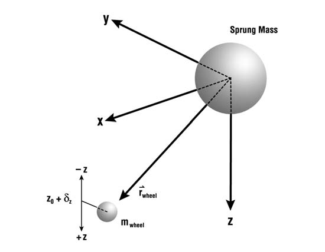
*Figure 4-2: Degrees of freedom for an independent suspension. Dynamic motion of each wheel is defined in the vehicle-fixed z-direction (spin and steer angular dynamic motion may also be defined as an option; see Wheel Spin and Steering System sections).*

The wheel y-coordinate is defined by the user-assigned wheel y-coordinate, possibly modified by occupants and payloads and event-related wheel displacement. In addition, the wheel lateral location changes for an independent suspension due to the effects of the half-track change during wheel jounce and rebound. Thus,

$$
y_{Wheel} = y_{Initial} + \Delta y_{Payload} + \Delta y_{Occupants} + \Delta y_{Displ} + \frac{dy_w}{dz}
\qquad (\text{Eq. 16})
$$

where $\dfrac{dy_w}{dz}$ = half-track change interpolated from the user-entered Half-track vs. Jounce/Rebound table.

The wheel z-coordinate is initially defined by the user-assigned z-coordinate, again, possibly modified by payloads, occupants and event-related displacement. However, the z-wheel position is a degree of freedom, thus the current wheel position is governed by its equation of motion in the z-direction. Thus,

$$
z_{Wheel} = z_{Initial} + \Delta z_{Payload} + \Delta z_{Occupants} + \Delta z_{Displ} + \delta z_{Wheel}
\qquad (\text{Eq. 17})
$$

where $\delta z_{Wheel}$ = current wheel z-displacement from initial (equilibrium) position.

Newton's 2nd law applied to the equation for vertical wheel motion results in

$$
\sum F_{z_{Unsprung}} = F_{z_{Tire}} - F_{Suspension} + m_{Unsprung}\left(uq - vp + g\cos\theta\cos\phi - x_{Wheel}\,pr - y_{Wheel}\,qr + z_{Wheel}(p^2 + r^2)\right)
\qquad (\text{Eq. 18})
$$

#### Solid Axle Suspensions

A solid axle suspension also includes two degrees of freedom inertially coupled to the sprung mass: axle vertical motion (vehicle-fixed z-direction) and axle roll about the roll center (see Figure 4-3).

Unlike independent suspensions, for solid axle suspensions the equations of motion describe the motion of the solid axle roll center, not the individual wheels.

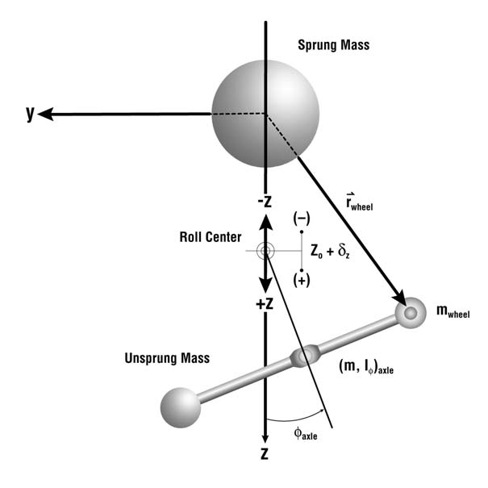
*Figure 4-3: Degrees of freedom for a solid axle suspension.*

The vehicle-fixed x-coordinate of the unsprung mass is equal to the average of the current wheel x-coordinates (see Eq. 15).

The unsprung mass y- and z-coordinates have the following kinematic relationships (refer to Figure 4-3):

$$
\begin{aligned}
y &= -\rho\sin\phi & \text{(Eq. 19)}\\
\dot y &= -\rho\dot\phi\cos\phi & \text{(Eq. 20)}\\
\ddot y &= \rho(\dot\phi^2\sin\phi - \ddot\phi\cos\phi) & \text{(Eq. 21)}\\
z &= z_{Static} + \delta_{Axle} + \rho\cos\phi & \text{(Eq. 22)}\\
\dot z &= \dot\delta_{Axle} - \rho\dot\phi\cos\phi & \text{(Eq. 23)}\\
\ddot z &= \ddot\delta_{Axle} - \rho(\dot\phi^2\cos\phi + \ddot\phi\sin\phi) & \text{(Eq. 24)}
\end{aligned}
$$

where

| Symbol | Definition |
|---|---|
| $\rho$ | Fixed distance from roll center to sprung mass (downward +) |
| $\phi$ | Vehicle-fixed axle roll angle |
| $z_{Static}$ | Initial distance from the vehicle CG to the roll center |
| $\delta_{Axle}$ | Current vertical deflection of roll center from initial (equilibrium) position |

Newton's 2nd law applied to axle vertical motion is

$$
\sum F_{z_{Unsprung}} = F_{z_{Tire}} - F_{z_{Suspension}} + m_{Unsprung}\left(uq - vp + g\cos\theta\cos\phi + \rho\dot\phi^2 + 2p\rho\dot\phi - x_{Axle}\,pr + \rho\phi qr + (\rho + z_{Axle})(p^2 + q^2)\right)
\qquad (\text{Eq. 25})
$$

For solid axle roll-axis rotation, application of Newton's 2nd law yields

$$
\begin{aligned}
\sum M_{\phi_{Unsprung}} ={}& M_{\phi_{Tire}} - M_{\phi_{Suspension}} \\
&+ m_{Unsprung}\,\rho\Big(ur - wp - 2p\dot z + 2p\rho\phi\dot\phi + x_{Axle}\,pq + \rho\phi(p^2 + r^2) \\
&\qquad + (\rho + z_{Axle})qr - g\cos\theta\sin(\phi_{Sprung} + \phi_{Axle})\Big) \\
&+ m_{Unsprung}\,\rho\phi\left(vp - uq - 2p\rho\dot\phi + x_{Axle}\,pr - (\rho + z_{Axle})(p^2 + q^2)\right) \\
&- I_{Axle,\phi}\,\phi(r^2 - q^2) - I_{Axle,\phi}\,qr
\end{aligned}
\qquad (\text{Eq. 26})
$$

### Wheel Spin

Calculation of wheel spin velocity, $\Omega$, requires the wheel spin acceleration, $\dot\Omega$. Spin acceleration arises from drive and brake torques and from tire rolling resistance, as shown in the free-body diagram in Figure 4-4 (for purposes of clarification, only torque-producing forces are shown in the figure).

For driven axles, the model is complicated by the introduction of the coupling effect of the differential and from the introduction of drivetrain rotational inertia. The differential equation for the spin degree of freedom at each wheel includes these effects:

$$
\left(I_{Wheel,Rt} + \frac{I_{Drivetrain}\,\eta_{Diff}^2}{4}\right)\frac{d}{dt}\Omega_{Wheel,Rt} + \left(\frac{I_{Drivetrain}\,\eta_{Diff}^2}{4}\right)\frac{d}{dt}\Omega_{Wheel,Lt} = \left[-F_{x'}r + M_{Rolling} + T_b + (\zeta T_d)\right]_{Right\ Tires}
\qquad (\text{Eq. 27})
$$

$$
\left(I_{Wheel,Lt} + \frac{I_{Drivetrain}\,\eta_{Diff}^2}{4}\right)\frac{d}{dt}\Omega_{Wheel,Lt} + \left(\frac{I_{Drivetrain}\,\eta_{Diff}^2}{4}\right)\frac{d}{dt}\Omega_{Wheel,Rt} = \left[-F_{x'}r + M_{Rolling} + T_b + (\zeta T_d)\right]_{Left\ Tires}
\qquad (\text{Eq. 28})
$$

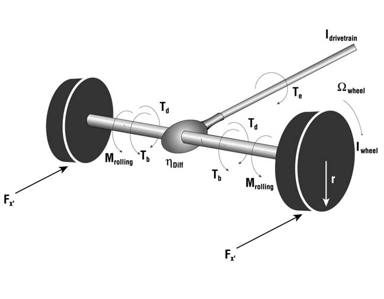
*Figure 4-4: Wheel spin degree of freedom moments and forces.*

Collecting the applied moments at each wheel as

$$
M = T_d + T_b + M_{Collision} - F_{x'}r + M_{Rolling}
\qquad (\text{Eq. 28a})
$$

Eqs. 27 and 28 form a pair of simultaneous equations in the two spin
accelerations, whose exact solution is

$$
\dot\Omega_{Wheel,Rt} = \frac{M_{Rt}\,I_{Wheel,Lt} + \left(M_{Rt} - M_{Lt}\right)A}{I_{Wheel,Rt}I_{Wheel,Lt} + A\left(I_{Wheel,Rt} + I_{Wheel,Lt}\right)}
\qquad (\text{Eq. 29})
$$

and

$$
\dot\Omega_{Wheel,Lt} = \frac{M_{Lt}\,I_{Wheel,Rt} + \left(M_{Lt} - M_{Rt}\right)A}{I_{Wheel,Rt}I_{Wheel,Lt} + A\left(I_{Wheel,Rt} + I_{Wheel,Lt}\right)}
\qquad (\text{Eq. 30})
$$

where

$$
A = \frac{I_{Drivetrain}\,\eta_{Diff}^2}{4}
$$

For a non-driven axle, $I_{Drivetrain}$ is zero, $A$ vanishes, and Eqs. 29 and
30 reduce to $\dot\Omega = M/I_{Wheel}$ at each wheel independently.

*(updated: earlier editions solved Eqs. 27 and 28 using a pair of "wheel
inertial factors", $\xi$. That method was replaced by the direct solution given
above, and the factors are no longer used. The moment term also now includes
the collision moment, $M_{Collision}$, which is the wheel spin moment produced
by the 3-D mesh collision model when a wheel is being contacted; it is zero
otherwise.)*

Once $\dot\Omega$ is determined for each wheel, the wheel spin velocity is integrated directly:

$$
\Omega = \Omega_{Prev} + \int \dot\Omega\,dt
\qquad (\text{Eq. 31})
$$

In the preceding development,

| Symbol | Definition |
|---|---|
| $\Omega$ | Wheel spin velocity |
| $\Omega_{Prev}$ | Wheel spin velocity during previous integration timestep |
| $T_d$ | Wheel drive torque $= T_e \times \eta_{Trans} \times \eta_{Diff} \times \zeta$ (Eq. 32) |
| $T_e$ | Engine torque (see Eq. 51) |
| $\eta_{Trans}$ | Transmission ratio |
| $\eta_{Diff}$ | Differential ratio |
| $\zeta$ | Torque split (fraction of engine torque applied to specified wheel) |
| $F_{x'}$ | Tire circumferential force |
| $r$ | Tire effective rolling radius |
| $M_{Rolling}$ | Tire rolling resistance moment |
| $I_{Wheel}$ | Total wheel spin inertia: tire + rim (×2 if dual tires) + axle + any spinning portion of brake |
| $I_{Drivetrain}$ | Total rotational inertia of drivetrain components: engine + transmission + driveline |
| $M_{Collision}$ | Wheel spin moment from the 3-D mesh collision model (zero unless the wheel is being contacted) |
| $T_b$ | Applied brake torque at wheel (see *Brake Torque*) |

The spin velocity of Eq. 31 is advanced with a first-order update at each tire
force timestep rather than by the vehicle's main integrator.

> **NOTE:** In the calculation of wheel drive torque, $T_d$ (above), $\zeta$ is the "torque function" that determines how the drive torque is distributed between the drive wheels. By default, SIMON splits the drive torque equally between all drive wheels; if the vehicle is equipped with traction control the split is redistributed between the wheels. See *Drive Torque — Torque split* (Eq. 51g).

## Steering System

The steering system includes the steering gear ratio (steer angle at the steering wheel divided by the steer angle at the axle). This ratio is used when the At Steering Wheel steer table option is selected.

SIMON also incorporates a Steer Degree of Freedom model. The Steer Degree of Freedom model is activated by selecting the appropriate option in SIMON's Calculation Options dialog. *(updated: the current Calculation Options dialog offers four Steer DOF settings — Off, Normal, Append and AutoStart; see Chapter 2.)*

The engineering model used by the Steer Degree of Freedom option is shown in Figure 4-5. The linkage is assumed to be rigid, thus the angular acceleration about the steering axis is the same for right-side and left-side wheels. External steer forces are generated at the tire-road interface, thus producing moments about the steering axis. The moments are resisted by steer system inertia and internal coulomb friction. Steering is limited by right and left steering stops at each wheel.

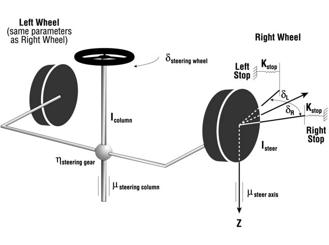
*Figure 4-5: Steering system model used for Steer Degree of Freedom option.*

Application of Newton's 2nd law to the steering system, ignoring inertial coupling effects, results in

$$
\sum M_{Steering} = I_{Steering}\,\ddot\delta_{Steer}
\qquad (\text{Eq. 33})
$$

where

| Symbol | Definition |
|---|---|
| $\sum M_{Steering}$ | Sum of external moments acting on steering system components |
| $I_{Steering}$ | Total rotational inertia of steering system components |
| $\delta_{Steer}$ | Steer angle of each steerable wheel about its steering axis (thus, $\ddot\delta_{Steer}$ is the angular acceleration) |

The sum of external moments, taken over both wheels of the axle, is

$$
\sum M_{Steering} = \sum_{Sides}\left(M_{Stops} + M_{Steer\ Axis\ Friction} + M_{Precession} + M_{Tires} + M_{Sidewall} + M_{Collision}\right) + M_{Steering\ Column\ Friction}
\qquad (\text{Eq. 34})
$$

where

| Term | Definition |
|---|---|
| $M_{Stops}$ | Moments about wheel steer axis produced by contact with steering stops |
| $M_{Steer\ Axis\ Friction}$ | Moments about wheel steer axis produced by coulomb friction in the steering ball joints or king pin |
| $M_{Precession}$ | Gyroscopic precession moment produced by the spinning wheel |
| $M_{Tires}$ | Moments about the wheel steer axis produced by the tire forces acting through the trail and scrub radius at the tire-ground shear interface (contact patch) |
| $M_{Sidewall}$ | Moment about the wheel steer axis produced by tire sidewall contact, when the Sidewall Impact Tire-Terrain Model is in use |
| $M_{Collision}$ | Moment about the wheel steer axis produced by the 3-D mesh collision model when the wheel is being contacted |
| $M_{Steering\ Column\ Friction}$ | Moment produced by coulomb friction between the steering shaft and its bushings or bearings, applied once for the axle |

*(updated: earlier editions listed only the stop, steer axis friction, steering
column friction and tire terms. The gyroscopic precession, sidewall and
collision moments are also part of the sum.)*

### Steer angle from the driver

While the Steer Degree of Freedom is not controlling the wheels, the steer
angle at each wheel comes from the driver's steer table. For the At Axle
option, each wheel takes its own table entry directly. For the At Steering
Wheel option, the table entry is a steering wheel angle, and the wheel angle is

$$
\delta = \frac{\delta_{SW}}{\eta}
\qquad (\text{Eq. 33a})
$$

where $\eta$ is the axle's steering gear ratio. Both wheels of the axle receive
the same angle unless **Use Ackermann Steering** is selected in Driver
Controls, in which case the front axle's wheel angles are spread so that the
two wheels point at a common turn center:

$$
\delta_i = \arctan\left(\frac{\tan\delta}{1 - y_i\,\dfrac{\tan\delta}{L}}\right)
\qquad (\text{Eq. 33b})
$$

where $y_i$ is the vehicle-fixed lateral coordinate of the wheel and $L$ is the
wheelbase. For a three-axle vehicle the wheelbase is measured from the front
axle to the midpoint of the rear tandem. If the denominator becomes too small
to evaluate — which happens only at steer angles well beyond any physical
steering stop — the wheel angles are left unchanged for that timestep.

Ackermann steering applies to the front axle only, and only with the At
Steering Wheel option.

*(updated: Ackermann steering was not described in earlier editions.)*

When the HVE Driver Model is following a path, it supplies the steer angle and
steer velocity directly, overriding the steer table. Following a collision the
driver model releases control and the steer table resumes.

### Steer Degree of Freedom modes

The Steer DOF setting determines when the wheels stop following the driver's
steer table and begin responding to the tire forces:

| Setting | Behavior |
| --- | --- |
| Off | The wheels follow the steer table for the whole event. |
| Normal | The steer table is not used at all; the wheels respond to tire forces from the start of the event. |
| Append | The wheels follow the steer table until the time of its last entry, then respond to tire forces for the remainder of the event. |
| AutoStart | The wheels follow the steer table until the vehicle is involved in a collision, then respond to tire forces. |

When AutoStart triggers, each steerable wheel's steer angle is set to the angle
it had at that instant, its steer velocity is set to zero, and the numerical
integration is reinitialized so the new state is carried forward smoothly. Both
vehicles in the collision start together.

While the Steer Degree of Freedom is controlling the wheels, the steering wheel
angle and velocity reported in the output are the average of the two wheel
values multiplied by the steering gear ratio.

*(updated: this subsection describes behavior not documented in earlier
editions.)*

### Steering Stop Torque

Steer angles are limited by steering stops at the right- and left-side wheels. Each wheel's steering stops limit the steer angle for both right and left steering inputs; the right-steer and left-steer stop angles need not be equal.

> **NOTE:** For example, it is possible during a left turn for the stop at the left-side wheel to engage before the stop for the right-side wheel.

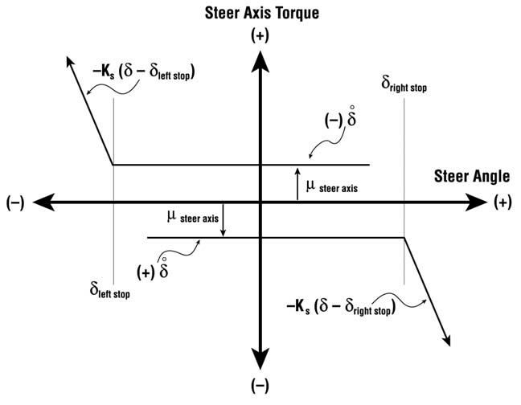
*Figure 4-6: Steer axis friction and stop torque vs. steer angle.*

A stop resists further travel only while the wheel is still turning deeper into
it. The steering stop torque at each stop is therefore

$$
M_{Stop} =
\begin{cases}
-K_{Stop}\left(\delta_{Steer} - \delta_{Stop}\right), & \left|\delta_{Steer}\right| > \left|\delta_{Stop}\right| \text{ and } \mathrm{sgn}\,\dot\delta_{Steer} = \mathrm{sgn}\,\delta_{Steer}\\[6pt]
0, & \text{otherwise}
\end{cases}
\qquad (\text{Eq. 35})
$$

where $K_{Stop}$ is the mechanical stiffness and $\delta_{Stop}$ the travel
limit of the stop being engaged. Each wheel has a stop for each steer
direction, so four stop angles and four stiffnesses apply to a steerable axle;
the stop selected is the one for the wheel and the direction of the current
steer angle. The general characteristic for steer axis torque is shown in
Figure 4-6.

*(updated: earlier editions gave the stop torque as a positive multiple of the
overtravel. The torque opposes the overtravel, and it is released as soon as
the wheel begins to turn back out of the stop, regardless of how far into the
stop it still is.)*

### Steer Axis Torque

Torque is also produced by steering rotation of the wheel about its steer axis. However, no torque is produced unless the steer velocity is non-zero. Thus, a minimum value of steer velocity is required to develop the assigned frictional torque. This minimum steer velocity is called a friction null band. The friction opposes the steer velocity:

$$
M_{Steer\ Axis} =
\begin{cases}
-\mu_{Steer\ Axis}\,\dfrac{\dot\delta_{Steer}}{\varepsilon_{Wheel}}, & \left|\dot\delta_{Steer}\right| < \varepsilon_{Wheel}\\[10pt]
-\mu_{Steer\ Axis}\,\mathrm{sgn}\,\dot\delta_{Steer}, & \left|\dot\delta_{Steer}\right| \ge \varepsilon_{Wheel}
\end{cases}
\qquad (\text{Eq. 36})
$$

where

| Symbol | Definition |
|---|---|
| $\mu_{Steer\ Axis}$ | Steer axis friction torque for each wheel |
| $\varepsilon_{Wheel}$ | Steering friction null band, referred to the wheel (Eq. 36a) |

The friction null band is entered as a steering column velocity, while the
equations of motion work at the wheel, so it is converted before use:

$$
\varepsilon_{Wheel} = \frac{\varepsilon}{\eta}
\qquad (\text{Eq. 36a})
$$

where $\varepsilon$ is the null band as entered and $\eta$ is the steering gear
ratio. The right and left wheels may have different steer axis friction values,
but they share the same steer velocity and therefore the same null band ratio.

*(updated: earlier editions gave the steer axis friction with the sign of the
steer velocity rather than opposing it, and did not describe the conversion of
the null band from the steering column to the wheel.)*

### Steering Column Torque

The steering column and steering gear introduce additional friction torque. Like steer axis torque, described above, there is no steering column frictional torque unless the steer velocity is non-zero. Because the column turns faster than the wheels by the steering gear ratio, the column friction torque is multiplied by that ratio when it is referred to the wheel steer axis:

$$
M_{Steering\ Column} =
\begin{cases}
-\mu_{Steering\ Column}\,\eta\,\dfrac{\dot\delta_{Steer}}{\varepsilon_{Wheel}}, & \left|\dot\delta_{Steer}\right| < \varepsilon_{Wheel}\\[10pt]
-\mu_{Steering\ Column}\,\eta\,\mathrm{sgn}\,\dot\delta_{Steer}, & \left|\dot\delta_{Steer}\right| \ge \varepsilon_{Wheel}
\end{cases}
\qquad (\text{Eq. 37})
$$

where

| Symbol | Definition |
|---|---|
| $\mu_{Steering\ Column}$ | Steering column frictional torque |
| $\eta$ | Steering gear ratio (column angle : wheel angle) |

Unlike the steer axis friction, which acts at each wheel, the steering column
friction is applied once for the axle.

*(updated: earlier editions omitted the steering gear ratio that refers the
column friction torque to the wheel steer axis, and gave the null band
comparison in inconsistent units.)*

### Gyroscopic Precession Torque

A spinning wheel resists being tilted. When the vehicle rolls, or when the
wheel's inclination angle changes as the suspension deflects, the wheel's spin
momentum produces a moment about the steer axis:

$$
M_{Precession} = I_{Spin}\,\Omega\left(p + \dot\gamma\right)\cos\delta_{Steer}
\qquad (\text{Eq. 37a})
$$

where

| Symbol | Definition |
|---|---|
| $I_{Spin}$ | Wheel spin inertia |
| $\Omega$ | Wheel spin velocity |
| $p$ | Vehicle roll velocity |
| $\dot\gamma$ | Rate of change of the wheel's vehicle-fixed inclination angle |

The $\cos\delta_{Steer}$ term projects the moment onto the steer axis. This
torque is what produces the steering disturbance felt when a wheel is loaded or
unloaded during a rapid maneuver.

*(updated: the gyroscopic precession torque was not documented in earlier
editions.)*

### Tire-Ground Torque

Forces at the tire-ground shear interface are the external input to the steering system. Because these forces do not act through the steer axis at its intersection with the ground plane (see Figure 4-7), an external moment is produced.

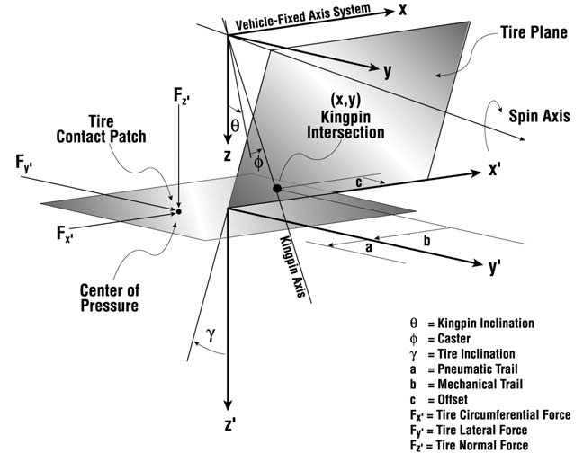
*Figure 4-7: Close-up view of torque-producing mechanism at tire-ground shear interface.*

The tire force acts at the contact patch, which is offset from the steer axis
both fore-and-aft (by the trail) and laterally (by the scrub radius). The
external moment produced at each tire is

$$
M_{Tire} = F_y\,\ell_y - F_x\,\ell_x + F_z\,\ell_z
\qquad (\text{Eq. 38})
$$

with moment arms

$$
\ell_x = r_y + T\sin\delta_G + R_S\cos\delta_G
\qquad (\text{Eq. 38a})
$$

$$
\ell_y = r_x + T\cos\delta_G + R_S\sin\delta_G\cos\theta_x
\qquad (\text{Eq. 38b})
$$

$$
\ell_z = \left(r_x + T\cos\delta_G + R_S\sin\delta_G\right)\sin\gamma
\qquad (\text{Eq. 38c})
$$

The total trail, $T$, is the pneumatic trail less the mechanical trail, and the
mechanical trail follows from the caster angle:

$$
T = T_P - T_M,\qquad T_M = r_z\sin\phi_C
\qquad (\text{Eq. 38d})
$$

The scrub radius follows from the stub axle length and the kingpin
inclination:

$$
R_S = L_{Stub}\cos\gamma - r_z\sin\left(\phi_K + \gamma\right)
\qquad (\text{Eq. 38e})
$$

where

| Symbol | Definition |
|---|---|
| $F_x, F_y, F_z$ | Vehicle-fixed tire force components |
| $r_x, r_y, r_z$ | Vehicle-fixed components of distance from wheel center to tire-ground contact point |
| $T_P$ | Tire pneumatic trail |
| $T_M$ | Mechanical trail |
| $R_S$ | Scrub radius |
| $L_{Stub}$ | Stub axle length |
| $\phi_C$ | Steer axis caster angle |
| $\phi_K$ | Steer axis kingpin inclination |
| $\gamma$ | Inclination angle (angle from tire z′ axis to ground surface normal) |
| $\delta_G$ | Wheel vehicle-fixed steer angle relative to ground plane (see Eq. 84) |
| $\theta_x$ | Angle from vehicle x-axis to ground plane (see Eq. 72) |

The kingpin inclination and stub axle length are taken as positive on the
right-side wheel and negative on the left, so that the scrub radius acts
outboard on both sides.

*(updated: earlier editions stated that the mechanical trail is assumed to be
zero and gave no scrub radius term. Both are calculated from the vehicle's
steer axis geometry, the mechanical trail subtracts from the pneumatic trail
rather than adding to it, and the longitudinal force term is subtracted rather
than added.)*

> **NOTE:** Dual tires often have different tire force components, tire radii and tire-ground contact characteristics. Therefore, each dual tire must be handled separately.

When the Sidewall Impact Tire-Terrain Model is in use, the moment produced about
the steer axis by sidewall contact — a tire striking the vertical face of a
curb, for example — is added to Eq. 38 for each tire.

### Steering System Rotational Inertia

The rotational inertia of the entire steering system is

$$
I_{Steering} = I_{Steer,Rt} + I_{Steer,Lt} + I_{Column}\,\eta^2
\qquad (\text{Eq. 39})
$$

where

| Symbol | Definition |
|---|---|
| $I_{Steer,Rt}$ | Total steer rotational inertia for right-side wheel: tire + rim (×2 if dual tires) + any steering portion of brake |
| $I_{Steer,Lt}$ | Total rotational inertia for left-side wheel |
| $I_{Column}$ | Total rotational inertia of steering column, including steering gearbox |
| $\eta$ | Steering gear ratio |

The column inertia is referred to the wheel steer axis through the square of
the steering gear ratio, as it is for any inertia reflected through a gear
reduction. A high gear ratio therefore makes the steering system substantially
harder to accelerate, which is the dominant contribution for most vehicles.

*(updated: earlier editions multiplied the column inertia by the steering gear
ratio rather than its square.)*

## Payloads

SIMON supports a payload on each unit vehicle. Note that this means the tow vehicle, trailer(s) and dolly(s) may each have an individual payload. The effect of the payload is simply to change the inertial properties and CG location of the vehicle's sprung mass.

Given a payload with inertial properties $m, I_x, I_y, I_z$, placing the payload at a distance, $\vec r$, from the sprung mass center of gravity changes the sprung mass inertial properties as follows:

$$
m_{Total} = m_{Sprung} + m_{Payload}
\qquad (\text{Eq. 40})
$$

$$
\eta = \frac{m_{Payload}}{m_{Total}}
\qquad (\text{Eq. 41})
$$

$$
\Delta_x = \eta r_x,\qquad \Delta_y = \eta r_y,\qquad \Delta_z = \eta r_z
\qquad (\text{Eq. 42})
$$

where $\vec\Delta$ = payload adjustment.

Adding a payload to a vehicle does not cause the vehicle to be repositioned on the road (in the real world or in HVE!). Rather, adding a payload simply relocates the center of gravity within the vehicle. This effectively changes the x, y, z coordinates of all vehicle-fixed components (wheels, inter-vehicle connections, etc). For each component, the coordinates are changed

$$
\vec C_{Adjusted} = \vec C_{Original} - \vec\Delta
\qquad (\text{Eq. 43})
$$

where $\vec C_{Adjusted}$ = adjusted x, y, z coordinates for component $C$ (e.g., the adjusted vehicle-fixed coordinates of the right front wheel).

The adjustment in center of gravity location and the additional rotational inertias of the payload affect rotational inertias of the sprung mass. This effect can be calculated using the parallel axis theorem.

Let

$$
dV_x = \Delta_y + \Delta_z,\qquad dV_y = \Delta_x + \Delta_z,\qquad dV_z = \Delta_x + \Delta_y
\qquad (\text{Eq. 44})
$$

and

$$
dP_x = r_y + r_z - dV_x,\qquad dP_y = r_z + r_x - dV_y,\qquad dP_z = r_x + r_y - dV_z
\qquad (\text{Eq. 45})
$$

The adjusted rotational inertias for the vehicle sprung mass are

$$
\begin{aligned}
I_{Adjusted,x} &= I_{Original,x} + I_{Payload,x} + m_{Sprung}\,dV_x^2 + m_{Payload}\,dP_x^2\\
I_{Adjusted,y} &= I_{Original,y} + I_{Payload,y} + m_{Sprung}\,dV_y^2 + m_{Payload}\,dP_y^2\\
I_{Adjusted,z} &= I_{Original,z} + I_{Payload,z} + m_{Sprung}\,dV_z^2 + m_{Payload}\,dP_z^2
\end{aligned}
\qquad (\text{Eq. 46})
$$

where

| Symbol | Definition |
|---|---|
| $\vec{dV}$ | Adjustment in vehicle CG location in vehicle-fixed roll, pitch and yaw planes |
| $\vec{dP}$ | Payload distance from adjusted CG in vehicle-fixed roll, pitch and yaw planes |

## Human Occupants

Human occupants may be added to vehicles. Mathematically, the result is equivalent to adding multiple payloads, using the procedures described above. The effect is to change the inertial properties and weight distribution of the vehicle. Humans do not move relative to the vehicle; their motion is not simulated.

## Driver Controls

SIMON provides user-entered driver controls for steering, braking, throttle and gear selection. These driver controls are entered in the form of open-loop tables of driver input vs. time. SIMON also provides a closed-loop option, called the HVE Driver Model.

### Steering

Steering inputs may be provided for right and left side wheels at each steerable axle. At Steering Wheel and At Axle options are supported. If the At Steering Wheel option is selected, the right side and left side wheel steer angles are equal to the current table entry divided by the axle's steering gear ratio, unless Use Ackermann Steering is selected, in which case the two front wheels are given different angles so that they point at a common turn center. See *Steering System — Steer angle from the driver* (Eqs. 33a and 33b).

### HVE Driver Model

SIMON supports the HVE Driver Model. The HVE Driver Model is a closed-loop driver control model that uses driver control attributes and the SIMON vehicle dynamics model to attempt to follow a user-specified path. This model is described in detail in HVE reference [4].

### Braking

Braking inputs may be provided for each wheel. The At Pedal option is the most robust model and its use is recommended. Using the At Pedal option causes SIMON to use the brake torque ratio supplied for each individual wheel. Wheel spin inertias and coupling within the differential are also included when the At Pedal option is selected.

Braking Force and Percent Available Friction brake table options are also allowed. If either of these methods is used, spin inertias and differential coupling are irrelevant and are ignored.

### HVE Brake Designer

If the At Pedal braking option is selected, SIMON uses the HVE Brake Designer. Detailed brake component designs can be created and edited in the Vehicle Editor. The resulting brake design is then used during SIMON simulations. The brake torque is calculated dynamically for each wheel according to the mechanical design of the brake assembly as well as the current brake pressure, lining/drum temperature and sliding speed. The current lining friction is determined from the lining temperature and sliding speed; thus, brake fade can be simulated.

The HVE Brake Designer is described in detail in the HVE Designer Manual. Additional information may be found in reference [1].

### Throttle

Throttle inputs may be provided for each drive axle. The Percent Wide-open Throttle (% WOT) option is the most robust and its use is recommended. Using the % WOT option causes SIMON to use the entire drivetrain model (see next section). Wheel spin inertias and coupling within the differential are also included when the % WOT option is selected.

Tractive Effort and Percent Available Friction options are also allowed. If either of these methods is used, spin inertias and differential coupling are irrelevant and are ignored.

### Gear Selection

If the % WOT throttle option (above) is selected, the Gear Selection table is used for setting the time and gear selections for each gear shift.

> **NOTE:** If no gear selection entries are made, the vehicle's transmission will be in neutral and no amount of throttle will cause the vehicle to accelerate!

## Wheel Torque

Wheel torque arises from driver throttle and brake inputs from open-loop driver tables (see Driver Controls, above).

### Brake Torque

SIMON uses three optional methods for computing the current level of attempted brake torque. These are:

- At Pedal
- Braking Force
- Percent Available Friction

These methods are described in the following section.

Whichever method is used, SIMON distinguishes between the **attempted** brake
torque — what the brake system is trying to apply — and the **applied** brake
torque, which is what actually reaches the wheel spin equation after the
low-speed limits of Eqs. 47e through 47h are applied.

#### At Pedal Braking Option

For the At Pedal option, the attempted brake torque at each wheel is produced
by a sequence of steps applied at every timestep. In order, these are:

1. Determine the brake system pressure at the source, from the driver's pedal
   input or from the HVE Driver Model (Eq. 47a).
2. Apply the brake time lag for the wheel (Eq. 47a).
3. Apply proportioning, if a proportioning valve is present (Eq. 48).
4. Apply brake failure, if the wheel's brake is failing (Eq. 47b).
5. Apply the brake rise time (Eq. 47c).
6. Apply yaw stability control modulation, if the vehicle is so equipped.
7. Apply ABS modulation, if the vehicle is so equipped.
8. Update the brake temperatures and calculate the attempted brake torque from
   the resulting wheel pressure (Eq. 47).

A wheel damaged during a collision bypasses this sequence entirely; see
*Wheel damage lockup*, below.

The attempted brake torque, $T_b$, at each wheel is calculated as follows:

$$
T_b = T_{Ratio}\max\left(0,\; p - p_0\right)
\qquad (\text{Eq. 47})
$$

where

| Symbol | Definition |
|---|---|
| $T_b$ | Attempted brake torque at wheel |
| $T_{Ratio}$ | Brake Torque Ratio, the attempted brake torque produced per unit of actuation pressure |
| $p$ | Current application pressure at wheel cylinder or air chamber (after proportioning) |
| $p_0$ | Pushout Pressure (psi) |

Torque ratio for generic brake types is entered directly by the user for each wheel. For brakes created using the HVE Brake Designer, the torque ratio is calculated from the brake's mechanical design and material parameters and current operational characteristics (lining temperature and sliding speed).

Note that the brake produces no torque until the wheel pressure exceeds the
pushout pressure, and none at all when the wheel pressure is zero.

*(updated: earlier editions gave Eq. 47 without the limit at zero. A wheel
pressure below the pushout pressure produces no brake torque; it does not
produce a negative torque.)*

If the HVE ABS Model is invoked, wheel brake pressures are modulated according to the selected ABS algorithm (see HVE User's Manual, Chapter 31).

#### Source pressure and brake time lag

The brake system pressure at the source is the product of the current pedal
force and the vehicle brake pedal ratio. Each wheel has its own brake time lag,
which delays the arrival of that pressure at the wheel:

$$
p_{Table} =
\begin{cases}
0, & t < t_{Lag}\\[4pt]
F_{Table}\!\left(t - t_{Lag}\right) \times R, & t \ge t_{Lag}
\end{cases}
\qquad (\text{Eq. 47a})
$$

where $t_{Lag}$ is the wheel's brake time lag, $F_{Table}$ is the At Pedal
brake table interpolated at the lagged time, and $R$ is the vehicle brake pedal
ratio. Note that the table is evaluated at the lagged time, so the entire pedal
force history is shifted later by the lag rather than merely being suppressed
during it.

When the HVE Driver Model's speed follower is controlling the vehicle, the
pedal force is supplied by the driver model instead of the brake table, and the
brake time lag is not applied. A trailer whose tow vehicle is under speed
follower control uses the tow vehicle's pedal force and pedal ratio. Following
a collision, speed follower control is released and the brake table resumes,
with the time lag applied.

*(updated: the brake time lag and the speed follower interaction were not
documented in earlier editions.)*

#### Brake Pressure Proportioning

The presence of a proportioning valve will reduce the pressure at the wheel as follows:

$$
p =
\begin{cases}
p_{Table}, & \text{for } p_{Table} \le p_{Proportion}\\[4pt]
p_{Proportion} + \eta\left(p_{Table} - p_{Proportion}\right), & \text{for } p_{Table} > p_{Proportion}
\end{cases}
\qquad (\text{Eq. 48})
$$

where

| Symbol | Definition |
|---|---|
| $p$ | Brake system pressure effective at wheel |
| $p_{Table}$ | Brake system pressure effective at source (master cylinder or storage reservoir), Eq. 47a |
| $p_{Proportion}$ | System pressure at which proportioning begins |
| $\eta$ | Proportioning ratio (wheel pressure : source pressure) |

#### Brake failure

A wheel brake may be set to fail during the event. The extent of the failure
ramps linearly from none at the failure start time to the user-specified extent
at the end of the failure duration, and the wheel pressure is reduced by that
fraction:

$$
p \leftarrow p\left(1 - \varepsilon(t)\right),\qquad
\varepsilon(t) =
\begin{cases}
0, & t \le t_{Fail}\\[4pt]
\varepsilon_{Fail}\dfrac{t - t_{Fail}}{\Delta t_{Fail}}, & t_{Fail} < t < t_{Fail} + \Delta t_{Fail}\\[8pt]
\varepsilon_{Fail}, & t \ge t_{Fail} + \Delta t_{Fail}
\end{cases}
\qquad (\text{Eq. 47b})
$$

where $\varepsilon_{Fail}$ is the fraction of total brake failure, $t_{Fail}$
the failure start time and $\Delta t_{Fail}$ the failure duration. A failure
extent of 1.0 removes the wheel's braking entirely.

*(updated: the brake failure model was not documented in earlier editions.)*

#### Brake rise time

The wheel pressure does not reach its commanded value instantaneously. If a
brake rise time is specified for the wheel, the pressure approaches the
commanded value exponentially:

$$
p \leftarrow p_{Prev}\,e^{-\Delta t/\tau} + p\left(1 - e^{-\Delta t/\tau}\right)
\qquad (\text{Eq. 47c})
$$

where $p_{Prev}$ is the wheel pressure at the previous brake calculation,
$\tau$ is the brake rise time and $\Delta t$ is the interval since the previous
brake calculation. A rise time of zero applies the commanded pressure directly.

*(updated: the brake rise time was not documented in earlier editions.)*

#### Brake temperature and fade

Before the torque of Eq. 47 is calculated, SIMON updates the brake
temperatures at each wheel from the work done by the brake during the previous
step, the wheel's rotational speed, the vehicle's total velocity and the
ambient air temperature. Temperatures are tracked at five locations through the
lining and drum cross-section. The lining temperature and the sliding speed
then determine the current lining friction, and therefore the brake torque
ratio of Eq. 47 — this is how brake fade is produced. Fade is available only
for brakes created with the HVE Brake Designer, since a generic brake's torque
ratio is a fixed user entry.

*(updated: earlier editions noted that fade can be simulated but did not
describe where the temperature calculation occurs in the sequence.)*

#### Wheel damage lockup

If a wheel is damaged during the event and the Wheel Damage option specifies a
lockup torque for it, the entire brake system calculation above is bypassed and
the attempted brake torque is set directly from the damage:

$$
T_b = \lambda(t)\,T_{Nominal},\qquad
T_{Nominal} = \mu_{p,max}\,r_{Tire,max}\,F_{z,Static}
\qquad (\text{Eq. 47d})
$$

where $\lambda(t)$ is the wheel's damage lockup fraction, interpolated over the
wheel damage start time and duration in the same way as the other wheel damage
parameters, and $T_{Nominal}$ is a nominal wheel lockup torque formed from the
largest peak friction value and the largest tire radius among the vehicle's
tires, multiplied by the wheel's static vertical load. A lockup fraction of 1.0
therefore corresponds to approximately the torque needed to lock the wheel under
its static load.

The bypass takes effect only when the lockup fraction is meaningfully greater
than zero; below that, the normal brake system calculation applies.

*(updated: the wheel damage lockup torque was not documented in earlier
editions.)*

#### Brake Force and Percent Available Friction Options

If the Brake Force or Percent Available Friction brake table options are used, the attempted brake torque, $T_b$, is calculated directly:

$$
T_b =
\begin{cases}
F_{Wheel}\times\max\left(r_{Tire,Inner}, r_{Tire,Outer}\right), & \text{for the Brake Force method}\\[6pt]
\theta_{Wheel}\times\displaystyle\sum_{i=0}^{N}\mu_p F_R\,r_{Tire}, & \text{for the \% Available Friction method}
\end{cases}
\qquad (\text{Eq. 49})
$$

where

| Symbol | Definition |
|---|---|
| $F_{Wheel}$ | Attempted brake force from Brake Force table |
| $r_{Tire}$ | Current tire radius |
| $\theta_{Wheel}$ | Attempted brake input from % Available Friction table |
| $N$ | Number of tires at wheel location |
| $\mu_P$ | Current peak coefficient of friction for the tire — the value interpolated from the friction table for the tire's current load and speed, scaled by the terrain friction multiplier and by the hydroplaning model if one is selected |
| $F_R$ | Current radial tire force (normal to the terrain) |

> **NOTE:** If the Brake Force method is used and the wheel location uses dual tires, $T_b$ is based on the largest tire radius. The % Available Friction method sums the contribution of each tire at the wheel location.

> **NOTE:** Use of the Wheel Brake Force and Percent Available Friction options is discouraged because they bypass SIMON's brake system model and ignore the effects of the wheel spin degree of freedom. In addition, ABS simulation is not possible.

*(updated: the % Available Friction method sums over the tires at a dual-tire
wheel location; earlier versions used a single tire radius.)*

#### Applied brake torque at low wheel speed

The attempted brake torque calculated above cannot always be applied. A brake
can command more torque than the tire is able to react against the road, and
near zero wheel speed a torque larger than the tire can support would drive the
wheel spin solution unstable — it would spin the wheel backwards. SIMON
therefore limits the attempted torque to the torque actually available at the
tire before applying it to the wheel spin equation.

The torque available at a wheel is the moment its tire forces produce about the
spin axis:

$$
T_{Avail} = \sum_{i=0}^{N} F_{x'_i}\,r_{Tire_i}
\qquad (\text{Eq. 47e})
$$

The limit is applied per axle, because the two wheels of a driven axle are
coupled through the differential. Let $\Omega_{min}$ be the minimum wheel spin
velocity, 0.1 rad/sec. Then:

- **Both wheels turning** ($\left|\Omega\right| > \Omega_{min}$ on both sides).
  The full attempted torque is applied at each wheel, directed opposite to that
  wheel's spin:

  $$
  T_{b,Applied} = -\left|T_b\right|\mathrm{sgn}\left(\Omega\right)
  \qquad (\text{Eq. 47f})
  $$

- **Both wheels at or below the threshold, and the available torque does not
  exceed the attempted torque on either side.** Both wheels are locked, and
  each wheel's applied torque is limited to its own available torque:

  $$
  T_{b,Applied} = -\left|T_{Avail}\right|\mathrm{sgn}\left(\Omega\right)
  \qquad (\text{Eq. 47g})
  $$

- **One wheel turning and one at or below the threshold, or one wheel locked
  and the other not.** The two wheels are treated separately. The turning (or
  unlocked) wheel receives its attempted torque as in Eq. 47f, except that if
  its partner is locked and its own available torque acts in the same direction
  as its spin, its brake is released and no torque is applied. The remaining
  wheel is limited by the torque available to it after the differential has
  transferred torque from the other side:

  $$
  T_{Diff} = T_{Avail,2} - \rho\left(T_{Avail,1} - T_{b,Applied,1}\right),\qquad
  \rho = \frac{A}{I_{Wheel,1} + A}
  \qquad (\text{Eq. 47h})
  $$

  where subscript 1 denotes the turning or unlocked wheel, subscript 2 the
  other wheel, $I_{Wheel}$ is the wheel spin inertia and $A$ is the drivetrain
  inertia term of Eq. 29. If $T_{Diff}$ does not act to slow the wheel, the
  brake is released; if $\left|T_{Diff}\right|$ equals or exceeds the attempted
  brake torque, the attempted torque is applied; otherwise $T_{Diff}$ is
  applied.

$\rho$ is zero on a non-driven axle, so the two wheels of a non-driven axle are
limited independently.

The result of this limiting is that the brake torque reported in the variable
output can be smaller than the torque the brake system is attempting to produce
whenever a wheel is near or at rest, and can momentarily fall to zero when a
wheel is released. This is expected behavior at low speed and does not indicate
a problem with the brake data.

*(updated: this subsection describes behavior not documented in earlier
editions. It applies to the At Pedal, Brake Force and % Available Friction
methods alike.)*

### Drive Torque

SIMON uses three optional methods for computing the current level of attempted drive torque. These are:

- Percent Wide-open Throttle
- Tractive Effort
- Percent Available Friction

These methods are described in the following section. Drive torque is applied
only at drive axles; a non-driven axle receives no drive torque by any method.

#### Percent Wide-Open Throttle Option

If the Percent Wide-open Throttle table option is used, the drivetrain model is
used in full: the current engine speed is derived from the drive wheel speeds
through the transmission and differential, the engine torque is interpolated
from the engine tables at that speed and the current throttle position, and the
result is distributed to the drive wheels.

The engine speed implied by the current road speed is

$$
\dot\theta_{e,Road} = \eta_{Differential}\times\eta_{Transmission}\times\frac{\displaystyle\sum_{i=1}^{N}\Omega_{Wheel}}{N}
\qquad (\text{Eq. 50})
$$

The engine cannot turn more slowly than its idle speed, so the speed used to
look up engine torque is

$$
\dot\theta_e = \max\left(\dot\theta_{e,Road},\; \dot\theta_{Idle}\right)
\qquad (\text{Eq. 50a})
$$

If $\dot\theta_{e,Road}$ exceeds the highest speed in either engine table, the
event terminates with an excessive engine speed message (see
[Chapter 6](06-messages.md)).

The engine torque is then

$$
T_e = T_{CT} + \lambda\left(T_{WOT} - T_{CT}\right)
\qquad (\text{Eq. 51})
$$

where

| Symbol | Definition |
|---|---|
| $\eta_{Differential}$ | Current numerical ratio of differential from driver controls, differential gear table |
| $\eta_{Transmission}$ | Current numerical ratio of transmission (Eq. 51b or 51c) |
| $\dot\theta_{e,Road}$ | Engine speed implied by the current drive wheel speeds |
| $\dot\theta_e$ | Engine speed used for the engine table look-up |
| $\dot\theta_{Idle}$ | Engine idle speed |
| $\Omega_{Wheel}$ | Current wheel spin velocity (see Eq. 31) |
| $N$ | Number of drive wheels |
| $T_e$ | Current engine torque (this result is used in Eq. 32) |
| $T_{CT}$ | Closed throttle engine torque at $\dot\theta_e$ from engine torque vs. engine speed table (negative) |
| $T_{WOT}$ | Wide-open-throttle engine torque at $\dot\theta_e$ from engine torque vs. engine speed table |
| $\lambda$ | Current throttle position, interpolated from driver controls, throttle table |

Below idle speed the engine is not allowed to retard the vehicle: if Eq. 51
returns a negative torque while the road speed implies an engine speed below
idle, the engine torque is set to zero.

$$
T_e = 0 \quad\text{when}\quad T_e < 0 \ \text{and}\ \dot\theta_{e,Road} < \dot\theta_{Idle}
\qquad (\text{Eq. 51a})
$$

*(updated: the idle speed floor of Eq. 50a and the engine braking limit of
Eq. 51a were not described in earlier editions.)*

#### Gear selection

The differential ratio always comes from the driver's differential gear table.
The transmission ratio comes from the driver's gear table for a manual
transmission, or from the automatic shift logic for an automatic transmission.

A gear table is a step function of time, not an interpolation: the gear in
effect is the one from the most recent table entry at or before the current
time. Before the first table entry the transmission is in neutral and the ratio
is zero, which is why a vehicle with no gear table entries will not accelerate
no matter how much throttle is applied.

$$
\eta_{Transmission} = \eta\left(g\right),\qquad g = \text{gear number from the most recent table entry}
\qquad (\text{Eq. 51b})
$$

Gear numbers are ordered with neutral first, reverse second, and the forward
gears after that. The transmission may have up to 12 forward ratios, plus
reverse and neutral; the differential may have up to three ratios.

For an **automatic transmission**, the gear is selected from the current engine
speed and throttle position rather than from a time table. If a gear table
entry selects neutral or reverse, or the transmission is currently in neutral
or reverse, that selection is used directly and no speed-dependent shift is
made. Otherwise the transmission upshift and downshift points — expressed as
throttle positions — are interpolated against engine speed from the vehicle's
automatic shift data, and

$$
\text{Upshift when}\quad \dot\theta_e > \dot\theta_{Max}\quad\text{or}\quad
\left(\lambda < \lambda_{Up}\ \text{and}\ \dot\theta_e\frac{\eta\left(g+1\right)}{\eta\left(g\right)} > \dot\theta_{Min}\right)
\qquad (\text{Eq. 51c})
$$

$$
\text{Downshift when}\quad \dot\theta_e < \dot\theta_{Min}\quad\text{or}\quad
\left(\lambda > \lambda_{Down}\ \text{and}\ \dot\theta_e\frac{\eta\left(g-1\right)}{\eta\left(g\right)} < \dot\theta_{Min} + 0.75\left(\dot\theta_{Max} - \dot\theta_{Min}\right)\right)
\qquad (\text{Eq. 51d})
$$

where

| Symbol | Definition |
|---|---|
| $g$ | Current gear number |
| $\eta(g)$ | Transmission ratio for gear $g$ |
| $\dot\theta_{Min}, \dot\theta_{Max}$ | Minimum and maximum engine speeds for shifting |
| $\lambda_{Up}, \lambda_{Down}$ | Upshift and downshift throttle positions, interpolated against engine speed |

The second condition in each case tests where the engine would land after the
shift, so that a shift is not made if it would leave the engine outside its
usable speed range. At most one shift is made per timestep, and the engine
speed of Eq. 50 is recomputed with the new ratio. Downshifts are permitted only
out of the second forward gear or higher.

*(updated: automatic transmission gear selection was not described in earlier
editions, which described only the driver's gear table.)*

#### Clutch

If **Use Clutch/Torque Converter** is selected in Driver Controls and the
transmission is in reverse or first gear, the engine is allowed to turn faster
than the road speed would imply, as it does when a driver slips the clutch to
pull away. The target
engine speed rises with throttle position from idle to the speed at which the
engine develops its peak wide-open-throttle torque:

$$
\dot\theta_{e,Clutch} = \dot\theta_{Idle} + \lambda\left(\dot\theta_{Peak} - \dot\theta_{Idle}\right)
\qquad (\text{Eq. 51e})
$$

and the clutch slip is the fraction by which the engine is outrunning the
driveline:

$$
s_{Clutch} = 1 - \frac{\dot\theta_{e,Road}}{\dot\theta_{e,Clutch}},\qquad 0 \le s_{Clutch} \le 1
\qquad (\text{Eq. 51f})
$$

While the clutch is slipping, the engine torque of Eq. 51 is looked up at
$\dot\theta_{e,Clutch}$ instead of $\dot\theta_e$. Once the driveline catches
up, the slip falls to zero and the engine speed reverts to Eq. 50a. Clutch slip
is reported in the variable output.

The clutch is active only in reverse and first gear; in any higher gear the
engine speed follows the road speed directly. The transmission type — manual
or automatic — is part of the vehicle's Drivetrain data, while the clutch
setting belongs to the event's Driver Controls.

*(updated: the clutch model was not described in earlier editions.)*

#### Torque split

The engine torque, multiplied by the transmission and differential ratios, is
divided among the drive wheels by the torque split, $\zeta$. By default the
split is equal across every drive wheel:

$$
\zeta = \frac{0.5}{N_{Drive\ Axles}}\quad\text{at each wheel of a drive axle};\qquad
\zeta = 0\quad\text{at a non-driven axle}
\qquad (\text{Eq. 51g})
$$

If the vehicle is equipped with traction control, the traction control model
redistributes the split between the wheels according to the total drive torque
and the vehicle's yaw velocity error, and the split is then no longer equal.
Traction control activity is reported in the variable output.

*(updated: the redistribution of the torque split by traction control was not
described in earlier editions.)*

#### Tractive Effort and Percent Available Friction Options

If the Tractive Effort or Percent Available Friction throttle table options are used, the attempted drive torque, $T_d$, is calculated directly, bypassing the drivetrain model:

$$
T_d =
\begin{cases}
F_{Wheel}\times\max\left(r_{Tire,Inner}, r_{Tire,Outer}\right), & \text{for the Tractive Effort method}\\[6pt]
\theta_{Wheel}\times\displaystyle\max_{i=1}^{N}\left(\mu_p F_R\,r_{Tire}\right), & \text{for the \% Available Friction method}
\end{cases}
\qquad (\text{Eq. 52})
$$

(Definitions are the same as for the Braking Tables; see above.)

> **NOTE:** At a wheel location with dual tires, both drive torque methods use the largest single tire value rather than the sum over the tires. This differs from the % Available Friction brake method, which sums over the tires at the wheel location.

*(updated: earlier editions gave the % Available Friction drive torque as a sum
over the tires at the wheel location. It is the largest value among them.)*

> **NOTE:** Use of the Tractive Effort and Percent Available Friction options is discouraged because they bypass SIMON's drivetrain model and ignore the effects of the wheel spin degree of freedom.

## Wheel Position

Calculation of wheel center earth-fixed coordinates requires a transformation from the vehicle-fixed reference frame to the inertial reference frame. This transformation matrix, $A$, is given by

$$
A = \begin{bmatrix}
\cos\psi\cos\theta & \sin\psi\cos\theta & -\sin\theta\\
-\sin\psi\cos\phi + \cos\psi\sin\phi\sin\theta & \cos\psi\cos\phi + \sin\phi\sin\psi\sin\theta & \sin\phi\cos\theta\\
\sin\psi\sin\phi + \cos\psi\sin\theta\cos\phi & -\cos\psi\sin\phi + \sin\psi\sin\theta\cos\phi & \cos\theta\cos\phi
\end{bmatrix}
\qquad (\text{Eq. 53})
$$

where

| Symbol | Definition |
|---|---|
| $\psi$ | Vehicle yaw angle |
| $\theta$ | Vehicle pitch angle |
| $\phi$ | Vehicle roll angle |

> **NOTE:** The order of rotations is yaw, pitch, roll.

Calculation of these Euler angles requires integration of the rotational velocity components, $p, q, r$ (see Eqs. 8 through 10). The integrated values are

$$
\begin{aligned}
\dot\phi &= p + (q\sin\phi + r\cos\phi)\tan\theta & \text{(Eq. 54)}\\
\dot\theta &= q\cos\phi - r\sin\phi & \text{(Eq. 55)}\\
\dot\psi &= (q\sin\phi + r\cos\phi)\sec\theta & \text{(Eq. 56)}
\end{aligned}
$$

Note that the presence of $\tan\theta$ and $\sec\theta$ results in a singularity at 90 degree pitch angle. If necessary, an axis indexing scheme can be implemented to eliminate this singularity.

Given the current vehicle sprung mass orientation in space, the earth-fixed (inertial) wheel center coordinates are

$$
\begin{bmatrix}X_w\\ Y_w\\ Z_w\end{bmatrix} = \begin{bmatrix}X_{CG}\\ Y_{CG}\\ Z_{CG}\end{bmatrix} + A\cdot\begin{bmatrix}x_w\\ y_w\\ z_w\end{bmatrix}
\qquad (\text{Eq. 57})
$$

where

| Term | Definition |
|---|---|
| $[X_w\ Y_w\ Z_w]^T$ | Earth-fixed wheel center coordinates |
| $[X_{CG}\ Y_{CG}\ Z_{CG}]^T$ | Earth-fixed vehicle CG coordinates |
| $[x_w\ y_w\ z_w]^T$ | Vehicle-fixed wheel center coordinates |

The calculation of vehicle-fixed wheel center coordinates is dependent upon the suspension type.

### Solid Axle Suspension

For solid axle suspension types, the vehicle-fixed wheel center coordinates are given by

$$
\begin{aligned}
x_{Wheel} &= x_{Initial} + \Delta x_{Displ} & \text{(Eq. 58)}\\
y_{Wheel} &= y_{Initial} + \phi_{Axle}\,\rho_{Axle} + \Delta y_{Displ} & \text{(Eq. 59)}\\
z_{Wheel} &= z_{Initial} + \delta_{Axle} + \phi_{Axle}\,y_{Initial} + \Delta z_{Displ} & \text{(Eq. 60)}
\end{aligned}
$$

where

| Symbol | Definition |
|---|---|
| $[x,y,z]_{Initial}$ | Vehicle-fixed wheel x, y, z coordinates at the start of the simulation (may include displacements due to occupants and payload) |
| $[\Delta x,\Delta y,\Delta z]_{Displ}$ | Wheel x, y, z displacements from user-entered wheel displacement table |
| $\delta_{Axle}$ | Current roll center displacement from equilibrium |
| $\phi_{Axle}$ | Current vehicle-fixed axle roll angle |

### Independent Suspension

For independent suspension types, the vehicle-fixed wheel center coordinates are given by

$$
x_{Wheel} = x_{Initial} + \Delta x_{Displ}
\qquad (\text{Same as Eq. 58})
$$

$$
y_{Wheel} = y_{Initial} + \Delta y_{Displ} + \frac{dy_w}{dz}
\qquad (\text{Eq. 61})
$$

$$
z_{Wheel} = z_{Initial} + \Delta z_{Displ} + \delta_{Wheel}
\qquad (\text{Eq. 62})
$$

where

| Symbol | Definition |
|---|---|
| $\dfrac{dy_w}{dz}$ | Change in wheel y-coordinate due to half-track change |
| $\delta_{Wheel}$ | Current wheel z-displacement from equilibrium position |

*(updated: in the current code, when DyMESH wheel contact is enabled, wheel x-y displacement can also result dynamically from collision forces on the wheel mesh — see the Sprung Mass Impact Model section below.)*

## Vehicle-fixed Wheel Orientation

Wheel orientation with respect to the vehicle-fixed axis system is defined by three angles (see Figure 4-8):

- **Wheel Steer,** $\delta_M$ — Wheel rotation about an axis parallel to the vehicle-fixed z (yaw) axis
- **Wheel Camber,** $\gamma_M$ — Wheel rotation about an axis parallel to the vehicle-fixed x (roll) axis
- **Wheel Spin,** $\omega_M$ — Wheel rotation about an axis parallel to the vehicle-fixed y (pitch) axis

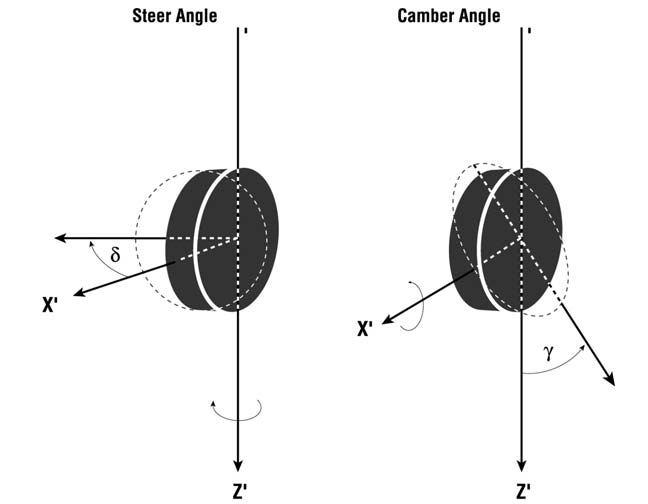
*Figure 4-8: Vehicle-fixed wheel orientation.*

Wheel spin is calculated by the equations of motion for each wheel (see Eqs. 27 through 32). If the steer degree of freedom option is selected, wheel steer is calculated by the equations of motion for the steering system (see Eqs. 33 through 39). Otherwise, wheel steer and wheel camber are determined from user-defined suspension properties, look-up tables and driver control tables. The manner in which the wheel orientations are calculated is dependent upon suspension type.

### Independent Suspension

Wheel camber angle, $\gamma_w$, for independent suspensions is determined using the vehicle suspension camber change table, by linear interpolation of the tabular inputs of camber vs. wheel jounce/rebound.

Wheel steer angle, $\delta_w$, for an independent suspension is determined first from the open-loop driver input table, using linear interpolation of the tabular inputs of wheel steer angle vs. time. If the At Axle steering option is used, the right-side and left-side steer angles may differ; if the At Steering Wheel option is used, the right-side and left-side steer angles are the same, and are equal to the table value divided by the steering gear ratio.

In addition to the current steering input from the driver steer table, steering may also occur as a result of rotation of the sprung mass about its roll axis (e.g., while cornering). The associated vertical wheel travel (jounce for the outside wheel; rebound for the inside wheel) can induce additional steering because of the kinematics of the suspension and steering arms. Thus, for an independent suspension, the total steer angle at a wheel is

$$
\delta_w = \delta_T + \kappa_0 + \kappa_1\,dz_w + \kappa_2\,dz_w^2 + \kappa_3\,dz_w^3
\qquad (\text{Eq. 63})
$$

where

| Symbol | Definition |
|---|---|
| $\delta_T$ | Steer angle interpolated from driver control table |
| $dz$ | Current wheel displacement from equilibrium |
| $\kappa_0,\kappa_1,\kappa_2,\kappa_3$ | Constant, first-order, second-order and third-order coefficients of roll steer vs. wheel jounce/rebound defined for each wheel |

Note that the right-side and left-side wheels may have different roll steer values. This is, in fact, what happens when a single wheel drops into a pothole.

> **NOTE:** This is called "Bump Steer".

### Solid Axle Suspension

Wheel camber angle, $\gamma_w$, for solid axle suspensions is determined by the equation of motion: because the camber angle is fixed with respect to the axle, the camber angle is equal to the vehicle-fixed axle roll angle, plus any axle camber set. Thus,

$$
\gamma_w = \phi_{Axle} + d\gamma_w
\qquad (\text{Eq. 64})
$$

where

| Symbol | Definition |
|---|---|
| $\phi_{Axle}$ | Vehicle-fixed axle roll angle (see Eq. 26) |
| $d\gamma_w$ | User-entered axle camber set |

Wheel steer angle, $\delta_w$, for a solid axle suspension is determined in the same manner as for independent suspension, described earlier, except that roll steer is not a function of individual wheel jounce/rebound; rather it is a function of the axle roll, $\phi_{Axle}$, with respect to the sprung mass. Thus,

$$
\delta_w = \delta_T + \kappa_\phi\,\phi_{Axle}
\qquad (\text{Eq. 65})
$$

where $\kappa_\phi$ = solid axle roll steer coefficient.

## Tire Contact Patch Velocity

The calculation of tire forces requires definition of the tire slip angle, which, in turn, requires calculation of velocity components at the tire contact patch. These velocity components are first calculated in the vehicle-fixed reference frame and then projected onto the ground plane beneath the tire. The calculation of these velocity components is a function of the vehicle's current CG velocity, vehicle-fixed wheel position and suspension type.

### Solid Axle

Contact patch velocity for a solid axle suspension is the result of the superimposed components of vehicle CG velocity and individual wheel center velocities. In addition, the contact patch is at a distance, $\vec h_w$, from the wheel center; this distance affects the individual contact patch velocity components. For a solid axle suspension, the resulting contact patch velocities are

$$
\begin{aligned}
u_{Tire} &= u - r(y_w + h_y) + q(z_w + h_z) & \text{(Eq. 66)}\\
v_{Tire} &= v - p(z_w + h_z) + r(x_w + h_x) & \text{(Eq. 67)}\\
w_{Tire} &= w - q(x_w + h_x) + (p + \dot\phi_{Axle})(y_w + h_y) + \dot z_{Axle} & \text{(Eq. 68)}
\end{aligned}
$$

where

| Symbol | Definition |
|---|---|
| $u,v,w$ | Vehicle-fixed forward, lateral and vertical velocity components |
| $p,q,r$ | Roll, pitch and yaw angular velocities about the vehicle-fixed axes |
| $x_w,y_w,z_w$ | Current vehicle-fixed wheel coordinates |
| $\dot z_{Axle}$ | Current axle vertical velocity |
| $\dot\phi_{Axle}$ | Current axle roll velocity |
| $h_x,h_y,h_z$ | Current vehicle-fixed components of distance from wheel center to tire contact patch |

### Independent Suspension

Contact patch velocity for an independent suspension is calculated using the same approach as that used for a solid axle suspension, except that the wheel positions and velocities are handled differently (e.g., see Eqs. 15 through 24). For an independent suspension, the contact patch velocities are

$$
u_{Tire} = u - r(y_w + h_y) + q(z_w + h_z)
\qquad (\text{Same as Eq. 66})
$$

$$
v_{Tire} = v - pz_w - h_z\left(p + \frac{d\gamma}{dz}\dot z_w\right) + r(x_w + h_x) + \frac{dy_w}{dz}\dot z_w
\qquad (\text{Eq. 69})
$$

$$
w_{Tire} = w - q(x_w + h_x) + py_w + \left(p + \frac{d\gamma}{dz}\dot z_w\right)h_y + \dot z_w
\qquad (\text{Eq. 70})
$$

where

| Symbol | Definition |
|---|---|
| $\dfrac{d\gamma}{dz}$ | Wheel camber change with respect to jounce/rebound interpolated from camber change table |
| $\dot z_w$ | Current vertical wheel velocity |
| $\dfrac{dy_w}{dz}$ | Wheel half-track change with respect to jounce/rebound interpolated from half-track table |

### Velocity in the Ground Plane

Finally, the velocity in the ground plane is determined. The forward and lateral components of this velocity are required for the tire slip angle calculation.

First define

$$
\begin{bmatrix}\cos\alpha_x\\ \cos\beta_x\\ \cos\gamma_x\end{bmatrix} = A\cdot\begin{bmatrix}1\\ 0\\ 0\end{bmatrix} = \text{the direction cosines for the vehicle-fixed x-axis}
$$

and

$$
\begin{bmatrix}\cos\alpha_y\\ \cos\beta_y\\ \cos\gamma_y\end{bmatrix} = A\cdot\begin{bmatrix}0\\ 1\\ 0\end{bmatrix} = \text{the direction cosines for the vehicle-fixed y-axis}
$$

The desired velocity is the projection onto the ground plane of the previously calculated contact patch velocity. The components of the projection of the vehicle-fixed x-axis onto the ground plane are

$$
\vec A_X = \begin{bmatrix}a_{x_i}\\ a_{x_j}\\ a_{x_k}\end{bmatrix} = \begin{bmatrix}
u_{Terrain_Z}\cos\beta_y - u_{Terrain_Y}\cos\gamma_y\\
u_{Terrain_X}\cos\gamma_y - u_{Terrain_Z}\cos\alpha_y\\
u_{Terrain_Y}\cos\alpha_y - u_{Terrain_X}\cos\beta_y
\end{bmatrix}
\qquad (\text{Eq. 71})
$$

The angle between the vehicle-fixed x-axis and its projection onto the ground plane is their dot product

$$
\theta_X = \arccos\left(\frac{\cos\alpha_x\,a_{x_i} + \cos\beta_x\,a_{x_j} + \cos\gamma_x\,a_{x_k}}{\sqrt{a_{x_i}^2 + a_{x_j}^2 + a_{x_k}^2}}\right)
\qquad (\text{Eq. 72})
$$

and the sign of $\theta_x$ is given by

$$
\mathrm{sgn}(\theta_x) = \mathrm{sgn}\left(\cos\gamma_x - \frac{a_{x_k}}{\sqrt{a_{x_i}^2 + a_{x_j}^2 + a_{x_k}^2}}\right)
\qquad (\text{Eq. 73})
$$

The forward velocity component of the tire contact point in the ground plane is

$$
u_{GP} = u_{Tire}\cos\theta_x - w_{Tire}\sin\theta_x
\qquad (\text{Eq. 74})
$$

The same procedure is used to calculate the components of the projection of the vehicle-fixed y-axis onto the ground plane,

$$
\vec A_y = \begin{bmatrix}a_{y_i}\\ a_{y_j}\\ a_{y_k}\end{bmatrix} = \begin{bmatrix}
u_{Terrain_Y}\cos\gamma_x - u_{Terrain_Z}\cos\beta_x\\
u_{Terrain_Z}\cos\alpha_x - u_{Terrain_X}\cos\gamma_x\\
u_{Terrain_X}\cos\beta_x - u_{Terrain_Y}\cos\alpha_x
\end{bmatrix}
\qquad (\text{Eq. 75})
$$

The angle between the vehicle-fixed y-axis and its projection onto the ground plane is their dot product

$$
\phi_y = \arccos\left(\frac{\cos\alpha_y\,a_{y_i} + \cos\beta_y\,a_{y_j} + \cos\gamma_y\,a_{y_k}}{\sqrt{a_{y_i}^2 + a_{y_j}^2 + a_{y_k}^2}}\right)
\qquad (\text{Eq. 76})
$$

and the sign of $\phi_y$ is given by

$$
\mathrm{sgn}(\phi_y) = \mathrm{sgn}\left(\cos\gamma_y - \frac{a_{y_k}}{\sqrt{a_{y_i}^2 + a_{y_j}^2 + a_{y_k}^2}}\right)
\qquad (\text{Eq. 77})
$$

The lateral velocity component of the tire contact point in the ground plane is

$$
v_{GP} = v_{Tire}\cos\phi_y - w_{Tire}\sin\phi_y
\qquad (\text{Eq. 78})
$$

## Tire-Road Contact Patch

Tire force calculations require that the tire-road interface be defined in terms of normal and shear forces, and resulting tire deflection. To perform these calculations requires a careful analysis of the wheel's orientation with respect to an arbitrary surface (terrain), as shown in Figure 4-9.

### Terrain Definition

The first step is to define the terrain (contact patch coordinates, friction multiplier and surface normal) beneath the tire. This step is performed using HVE's surface-information search, controlled by the **Get Surface Information Options**. Given the current earth-fixed coordinates, $X_t, Y_t$, of the tire's center of rotation, the search examines the environment polygon database until it finds the polygon beneath the tire (see Figure 4-10). For this polygon, the search returns the earth-fixed elevation, $Z_t$, beneath the tire center, as well as the friction multiplier, $f$, and unit vector, $\vec U_{Terrain}$, representing the surface normal for the polygon directly beneath each tire.

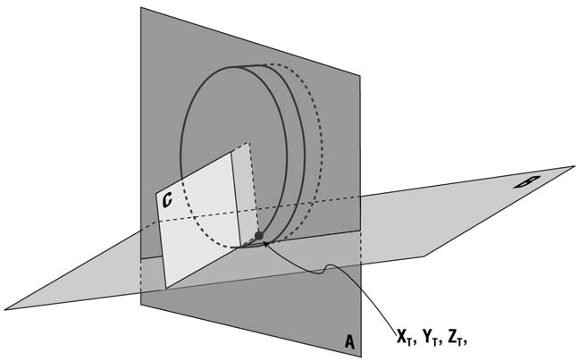
*Figure 4-9: Wheel-terrain geometry.*

## Tire-Ground Orientation

The tire-ground orientation is defined by the tire inclination angle, $\gamma_w$, and steer angle, $\delta_w$, relative to the surface beneath the wheel, as shown in Figure 4-9. A line in the earth-fixed coordinate system normal to the wheel plane is defined by a unit vector, $\vec U_w$:

$$
\vec U_w = \begin{bmatrix}u_{w_X}\\ u_{w_Y}\\ u_{w_Z}\end{bmatrix} = A\cdot\begin{bmatrix}-\sin\delta_w\\ \cos\gamma_w\cos\delta_w\\ \sin\gamma_w\cos\delta_w\end{bmatrix}
\qquad (\text{Eq. 79})
$$

where

| Symbol | Definition |
|---|---|
| $A$ | Transformation matrix (see Eq. 53) |
| $\gamma_w$ | Vehicle-fixed camber angle |
| $\delta_w$ | Vehicle-fixed steer angle |

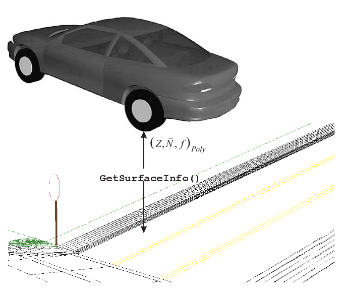
*Figure 4-10: The surface-information search returns the terrain surface elevation, Z, friction multiplier, f, and surface normal, U, for the earth-fixed X,Y coordinates beneath the tire.*

Defining the surface normal returned by the surface-information search as

$$
\vec U_{Terrain} = \begin{bmatrix}U_{Terrain_X}\\ U_{Terrain_Y}\\ U_{Terrain_Z}\end{bmatrix},
\qquad (\text{Eq. 80})
$$

the angle between the terrain surface normal, $\vec U_{Terrain}$, and the wheel normal, $\vec U_w$, is

$$
\alpha = \arccos\left(U_{Terrain_X}U_{w_X} + U_{Terrain_Y}U_{w_Y} + U_{Terrain_Z}U_{w_Z}\right)
\qquad (\text{Eq. 81})
$$

and the inclination angle relative to the ground, $\Gamma_w$, is

$$
\Gamma_W = \frac{\pi}{2} - \alpha
\qquad (\text{Eq. 82})
$$

The steer angle in the ground plane is the product of the vehicle-fixed steer angle, $\delta_w$, and the difference between the earth-fixed steer axis, $\vec U_\delta$, and surface normal, $\vec U_T$. The unit vector defining the earth-fixed angle of the steer axis is given by

$$
\vec U_\delta = \begin{bmatrix}U_{\delta_X}\\ U_{\delta_Y}\\ U_{\delta_Z}\end{bmatrix} = A\cdot\begin{bmatrix}0\\ -\sin\gamma_w\\ \cos\gamma_w\end{bmatrix}
\qquad (\text{Eq. 83})
$$

Then the steer angle relative to the ground, $\Psi_w$, is

$$
\Psi_w = \delta_w\left(U_{Terrain_X}U_{\delta_X} + U_{Terrain_Y}U_{\delta_Y} + U_{Terrain_Z}U_{\delta_Z}\right)
\qquad (\text{Eq. 84})
$$

### Tire-Ground Contact Point

The tire-ground contact point is defined by the intersection of three planes: the wheel plane, the plane of the terrain beneath the wheel center, and a plane through the wheel center perpendicular to the first two planes. This point is defined by three equations:

$$
\begin{aligned}
\lambda_1 &= X_w U_{w_X} + Y_w U_{w_Y} + Z_w U_{w_Z} & \text{(Eq. 85)}\\
\lambda_2 &= X_w U_{Terrain_X} + Y_w U_{Terrain_Y} + Z_w U_{Terrain_Z} & \text{(Eq. 86)}\\
\lambda_3 &= X_w D_1 + Y_w D_2 + Z_w D_3 & \text{(Eq. 87)}
\end{aligned}
$$

where

| Symbol | Definition |
|---|---|
| $\lambda_1$ | The equation defining the wheel plane |
| $\lambda_2$ | The equation defining the plane for the terrain beneath the wheel |
| $\lambda_3$ | The equation defining a plane perpendicular to $\lambda_1$ and $\lambda_2$ passing through the wheel center $X_w, Y_w, Z_w$ |
| $\vec U_w$ | Unit vector for the line in the earth-fixed coordinate system normal to the wheel plane (see Eq. 79) |
| $\vec U_{Terrain}$ | Unit vector for the terrain surface normal returned by the surface-information search |
| $\vec D$ | Unit vector defining a line normal to both the wheel plane and the plane for the terrain beneath the wheel |

$$
\vec D = \begin{bmatrix}D_1\\ D_2\\ D_3\end{bmatrix} = \begin{bmatrix}
U_{w_Y}U_{Terrain_Z} - U_{Terrain_Y}U_{w_Z}\\
U_{w_Z}U_{Terrain_X} - U_{Terrain_Z}U_{w_X}\\
U_{w_X}U_{Terrain_Y} - U_{Terrain_X}U_{w_Y}
\end{bmatrix}
\qquad (\text{Eq. 88})
$$

The earth-fixed coordinates, $\vec T = [X_T\ Y_T\ Z_T]^T$, for the tire-ground contact point may now be solved directly using Eqs. 85 through 87. In matrix form,

$$
\begin{bmatrix}
U_{w_X} & U_{w_Y} & U_{w_Z}\\
U_{Terrain_X} & U_{Terrain_Y} & U_{Terrain_Z}\\
D_1 & D_2 & D_3
\end{bmatrix}\cdot\begin{bmatrix}X_T\\ Y_T\\ Z_T\end{bmatrix} = \begin{bmatrix}\lambda_1\\ \lambda_2\\ \lambda_3\end{bmatrix}
\qquad (\text{Eq. 89})
$$

## Tire Radial Deflection

Once the contact point is determined, the tire radial deflection can be calculated directly from the earth-fixed distance, $D$, between the wheel center, $X_w, Y_w, Z_w$, and the tire-ground contact point, $X_T, Y_T, Z_T$:

$$
D = \sqrt{(X_w - X_T)^2 + (Y_w - Y_T)^2 + (Z_w - Z_T)^2}
\qquad (\text{Eq. 90})
$$

Based on the distance from the wheel center to the terrain contact point, the current tire rolling radius, $r_T$, is

$$
r_T =
\begin{cases}
D, & \text{for } D < r_u\\
r_u, & \text{for } D \ge r_u
\end{cases}
\qquad (\text{Eq. 91})
$$

It is now a simple matter to calculate the tire radial deflection in the wheel plane by comparing the tire unloaded radius, $r_u$, with the current tire radius, $r_T$:

$$
\delta_T = r_u - r_T
\qquad (\text{Eq. 92})
$$

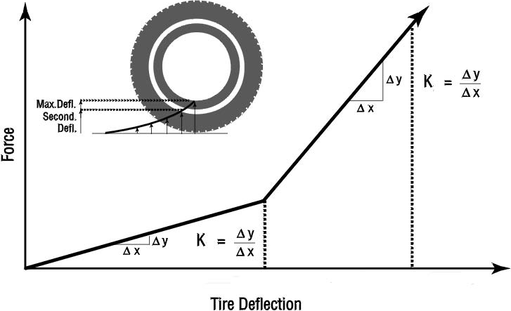
*Figure 4-11: 2-step radial tire stiffness used for calculating the current tire radial force.*

## Tire Radial Force

Tire radial force is calculated in the direction of the tire deflection according to the tire force-deflection properties (see Figure 4-11) and current deflection,

$$
F_R =
\begin{cases}
\xi K_T\,\delta_r, & \text{for } \delta_r < \delta_2\\[4pt]
\xi K_T\left(\overline K_T(\delta_r - \delta_2) + \delta_2\right), & \text{for } \delta_r \ge \delta_2
\end{cases}
\qquad (\text{Eq. 93})
$$

where

| Symbol | Definition |
|---|---|
| $F_R$ | Radial tire force (force in the tire plane in the direction of the tire deflection) |
| $K_T$ | Tire initial radial stiffness |
| $\overline K_T$ | Tire secondary stiffness multiplier |
| $\delta_2$ | Tire radial deflection at which $\overline K_T$ begins |
| $\xi$ | Tire restitution characteristic |

$$
\xi =
\begin{cases}
1.0, & \text{for } \delta_r > \delta_{r_{previous\ timestep}}\\
\lambda, & \text{for } \delta_r \le \delta_{r_{previous\ timestep}}
\end{cases}
$$

and $\lambda$ = tire stiffness multiplier ($0 \le \lambda \le 1$) for rebound.

If the current tire deflection, $\delta_r$, exceeds the maximum allowable tire deflection, $\delta_{max}$, SIMON terminates and returns a message to HVE telling the user that the current tire deflection is excessive.

> **NOTE:** $\delta_{max}$ is user-editable (see Tire, Physical Properties). By default, $\delta_{max}$ is set equal to the section height of the tire. Tire deflection beyond $\delta_{max}$ indicates wheel rim deformation — a condition beyond the scope of the tire model. (To properly model such behavior would require non-linear finite element analysis.)

Tire radial force, $F_R$, is an important fundamental property as one of the primary inputs to the tire model which is used to calculate braking and cornering force.

## Tire Model

SIMON uses the EDC semi-empirical tire model developed for EDVDS [2]. The basis for the EDC semi-empirical tire model is the HSRI tire model, developed at the University of Michigan Transportation Research Institute [3]. The model was extended to allow large tire slip angles, drive torque (i.e., tire forces that accelerate the vehicle) and drive and/or brake torque when the vehicle is rolling backwards. The SIMON implementation for load- and speed-dependent tire properties has been extended by replacing the method of partial derivatives with a table look-up method. An overview of the extended model is provided below for purposes of comparison with the HSRI and EDVDS tire models.

### Tire model versions

*(updated: this subsection describes behavior added since the Fifth Edition
manual, which documented only a single semi-empirical tire model.)*

The Calculation Options dialog offers three versions of the semi-empirical
tire model. They share the structure described in the rest of this section
and differ only in the specific respects listed below. **Vers. 3 is the
default for a new event**, and is the recommended choice for new work; Vers. 1
and Vers. 2 are retained so that results from earlier releases can be
reproduced exactly.

| | Vers. 1 | Vers. 2 | Vers. 3 |
|---|---|---|---|
| Slip-angle function | $\sin\alpha$ | $\tan\alpha$ | $\tan\alpha$ |
| Lateral force reverses when the tire travels rearward | No | Yes | Yes |
| Effective friction limited to the peak friction value | No | No | Yes |
| Low-speed cornering and camber stiffness reduction | No | No | Yes |

The three differences are described where they arise in the development
below: the slip-angle function in Eq. 103a, the rearward-travel sign in
Eqs. 106 and 112, the friction limit in Eq. 102b and the low-speed reduction
in Eq. 104a.

Selecting a version affects only the tire shear-force calculation. It does
not change the radial force model, the rolling resistance model or the
hydroplaning model, all of which are common to all three versions.

### Model assumptions and inputs

The semi-empirical tire model describes empirically what is occurring at the tire-road shear interface, according to the current tire-road conditions. It employs a simplified theory assuming an adhesion region and a sliding region. The major assumptions made by the tire model are:

- The contact patch can be divided into two regions: an adhesion region and a sliding region.
- The shear force generated in the adhesion region depends on the elastic properties of the tire, and the shear force generated in the sliding region depends on the frictional properties at the tire-road interface.

The inputs required by the tire model are

| Input | Definition |
|---|---|
| $F_o$ | Vertical load for up to three test loads |
| $V_o$ | Longitudinal velocity for up to three test speeds |
| $\mu_p, \mu_s, S_{\mu_p}$ | Peak and slide tire-road friction and longitudinal slip at peak friction for each load and speed (these data generate a µ-slip curve for each test load and speed; see Figure 4-12) |
| $C_s$ | Longitudinal stiffness for each test load and speed |
| $C_\alpha$ | Cornering stiffness for up to three test loads and speeds (see Figure 4-13) |
| $C_\gamma$ | Camber stiffness for up to three test loads and speeds (see Figure 4-14) |

During execution, the current tire radial load, $F_R$, rolling radius, $r_T$, and forward velocity component in the ground plane, $u_{GP}$, are calculated (see Eqs. 93, 91 and 74, respectively). In addition, the current longitudinal slip, $S$, is calculated:

$$
S = 1 - \Omega\left(\frac{r_T}{u_{GP}}\right)
\qquad (\text{Eq. 94})
$$

$S$ is limited to the range $-1 \le S \le 1$. When the tire is travelling too
slowly for Eq. 94 to be meaningful (a forward ground-plane speed below
approximately 1 in/sec), longitudinal slip is instead set to zero if the wheel
is also not spinning, or to $\pm 1$ if the wheel is spinning while the vehicle
slides sideways.

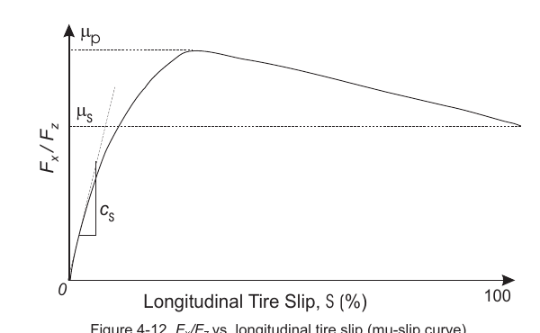
*Figure 4-12: Fx/Fz vs. longitudinal tire slip (mu-slip curve).*

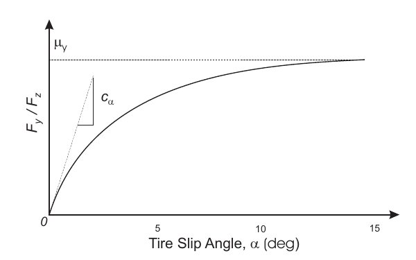
*Figure 4-13: Fy/Fz vs. tire slip angle, α.*

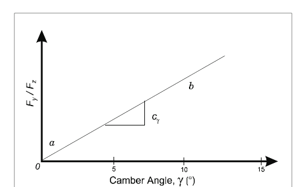
*Figure 4-14: Fy/Fz vs. tire inclination angle, γ.*

Based on the above test tire parameters and the current tire load and velocity, the effective values are calculated using linear interpolation,

$$
\mu_p' = f(F_R, u_{GP}),\quad \mu_s' = f(F_R, u_{GP}),\quad S_{\mu_p}' = f(F_R, u_{GP}),\quad C_s' = f(F_R, u_{GP}),\quad C_\alpha' = f(F_R, u_{GP}),\quad C_\gamma' = f(F_R, u_{GP})
$$

*(updated: the longitudinal stiffness, $C_s'$, is now interpolated from the
tire's Longitudinal Stiffness data in the same way as the other load- and
speed-dependent properties. Earlier editions of this manual gave a formula
that derived $C_s$ from the µ-slip curve parameters; that formula is no longer
used.)*

The interpolated peak and slide friction values are then scaled by the
friction multiplier of the terrain beneath the tire:

$$
\mu_p' \leftarrow \mu_p' \cdot f_{terrain},\qquad \mu_s' \leftarrow \mu_s' \cdot f_{terrain}
\qquad (\text{Eq. 94a})
$$

where $f_{terrain}$ is the surface friction multiplier returned for the current
tire position, further reduced by the hydroplaning model when one is selected
(see *Hydroplaning Model*, below). Note that the terrain friction multiplier
scales friction only; it does not scale longitudinal, cornering or camber
stiffness.

### Effective friction

From these data, the following intermediate parameters are computed:

$$
a = \left(1.0 + S_{\mu_p}'\right)\left(1.0 - S_{\mu_p}'\right)^2
\qquad (\text{Eq. 95})
$$

$$
b = \left(1.0 - S_{\mu_p}'\right)\left(\mu_s'\left(S_{\mu_p}' + 2.0\right) - \mu_p'\left(2.0S_{\mu_p}' + 1.0\right)\right)
\qquad (\text{Eq. 96})
$$

$$
c = \left(\mu_s' - \mu_p'\right)\mu_s'
\qquad (\text{Eq. 97})
$$

$$
B = \frac{-b + \sqrt{b^2 - 4ac}}{2a}
\qquad (\text{Eq. 98})
$$

$$
A = \mu_s' + B
\qquad (\text{Eq. 99})
$$

$$
C = \mu_s' + B\left(1.0 - S_{\mu_p}'\right)
\qquad (\text{Eq. 100})
$$

The effective friction, $\mu$, is then

$$
\mu = A - B\left|S\right|
\qquad (\text{Eq. 102})
$$

$\mu$ is subject to two limits. First, it is never allowed to fall below the
value it would take at fully locked or fully spinning slip:

$$
\mu \ge A - B
\qquad (\text{Eq. 102a})
$$

Second, in **Vers. 3** only, the effective friction is not allowed to exceed
the interpolated peak friction:

$$
\mu \le \mu_p' \qquad (\text{Vers. 3 only})
\qquad (\text{Eq. 102b})
$$

*(updated: Eqs. 102a and 102b describe limits not documented in earlier
editions. Eq. 102b is one of the differences between Vers. 3 and the earlier
versions; in Vers. 1 and Vers. 2 the effective friction may momentarily exceed
the peak value returned by the friction table.)*

### Cornering stiffness at large slip angles

The interpolated cornering stiffness, $C_\alpha'$, describes the tire's
response to small slip angles. Because the lateral force per degree of slip
angle falls off as the slip angle grows, SIMON reduces the cornering stiffness
used in the force calculation as a function of the magnitude of the current
slip angle:

$$
C_\alpha =
\begin{cases}
C_\alpha' & \left|\alpha\right| \le 1^\circ \\[4pt]
C_\alpha'\left(1.0 - \dfrac{1}{3}\cdot\dfrac{\left|\alpha\right| - 1^\circ}{4^\circ}\right) & 1^\circ < \left|\alpha\right| < 5^\circ \\[8pt]
\dfrac{2}{3}C_\alpha' & \left|\alpha\right| \ge 5^\circ
\end{cases}
\qquad (\text{Eq. 100a})
$$

The reduction is symmetric about 180 degrees, so that a tire travelling
rearward sees the same treatment as one travelling forward.

*(updated: Eq. 100a describes behavior not documented in earlier editions of
this manual.)*

### Adhesion and sliding regions

Based on the above parameters, the fraction of the adhesion region of the total contact patch, $X_s/L$ (where $L$ is the total length of the contact patch, and $X_s$ is the distance from the front of the contact patch to the point where sliding starts), is calculated as follows:

$$
D_t = \sqrt{\left(C_s' S\right)^2 + \left(C_\alpha T(\alpha)\right)^2}
\qquad (\text{Eq. 103})
$$

$$
\frac{X_s}{L} = \frac{\mu F_z\left(1.0 - \left|S\right|\right)}{2.0 D_t}
\qquad (\text{Eq. 104})
$$

where $T(\alpha)$ is the slip-angle function, which is the single largest
difference between Vers. 1 and the later versions:

$$
T(\alpha) =
\begin{cases}
\sin\alpha & \text{Vers. 1} \\
\tan\alpha & \text{Vers. 2 and Vers. 3}
\end{cases}
\qquad (\text{Eq. 103a})
$$

In Vers. 2 and Vers. 3 the tangent is guarded against overflow: within a
quarter of a degree of $\pm 90^\circ$, $T(\alpha)$ is clamped to a large finite
value carrying the sign of the tire's forward ground-plane velocity, so that
the lateral force saturates instead of diverging.

*(updated: earlier editions of this manual stated that the EDC model replaces
the HSRI tangent function with the sine function. That is true of Vers. 1
only. Vers. 2 and Vers. 3 restore the tangent function — which is the correct
form for the underlying brush model — and handle the singularity at
$\pm 90^\circ$ by clamping rather than by substituting the sine.)*

$X_s/L$ is limited to 1.0 (note that $X_s/L = 1.0$ means there is no sliding region).

### Low-speed refinement

*(updated: this subsection describes behavior added since the Fifth Edition
manual. It applies to **Vers. 3** only.)*

At very low wheel speeds, the cornering and camber stiffnesses of the
undisturbed model produce lateral forces that are unrealistically large for
the amount of relative motion actually present at the contact patch, which can
make a nearly stopped vehicle drift or jitter. Vers. 3 therefore fades the
stiffnesses toward zero as the wheel comes to rest.

When the tire's circumferential speed, $r_T\Omega$, falls below approximately
2 ft/sec, the cornering and camber stiffnesses used in the force calculation
are scaled by a blending factor:

$$
\Phi(v, v_{ref}) = \frac{2.0}{\dfrac{v_{ref}}{\left|v\right|} + \dfrac{\left|v\right|}{v_{ref}}}
\qquad (\text{Eq. 104a})
$$

$$
C_\alpha \leftarrow C_\alpha\,\Phi\!\left(r_T\Omega,\; v_{ref}\right),\qquad
C_\gamma \leftarrow C_\gamma\,\Phi\!\left(r_T\Omega,\; v_{ref}\right)
\qquad (\text{Eq. 104b})
$$

where $v_{ref} \approx 2$ ft/sec. $\Phi$ equals 1.0 when $\left|v\right| = v_{ref}$
and approaches zero as $\left|v\right| \to 0$, so the reduction phases in
smoothly rather than switching on at a threshold. If the wheel is exactly
stopped, both stiffnesses are set to zero.

While the wheel is below that speed, if the lateral component of the tire's
ground-plane velocity also falls below approximately 1 in/sec, the slip-angle
function is faded by the same blending factor:

$$
T(\alpha) \leftarrow T(\alpha)\,\Phi\!\left(v_{GP},\; 1\ \text{in/sec}\right)
\qquad (\text{Eq. 104c})
$$

again with $T(\alpha)$ set to zero if the lateral velocity is exactly zero.

### Tire forces

If $X_s/L = 1.0$, there is no sliding region and the longitudinal and lateral tire forces, $F_{x'}$ and $F_{y'}$, respectively, are

$$
F_{x'} = s_u\,\frac{C_s' S}{1.0 - \left|S\right|}
\qquad (\text{Eq. 105})
$$

and

$$
F_{y'} = \frac{-C_\alpha T(\alpha)}{1.0 - \left|S\right|}\cdot k_u
\qquad (\text{Eq. 106})
$$

where $s_u$ and $k_u$ account for the direction the tire is travelling:

$$
s_u = -\,\mathrm{sgn}\left(u_{GP}\right),\qquad
k_u =
\begin{cases}
1 & \text{Vers. 1} \\
-s_u & \text{Vers. 2 and Vers. 3}
\end{cases}
\qquad (\text{Eq. 106a})
$$

$s_u$ orients the longitudinal force so that it always opposes the direction
of travel for a braking slip and drives the vehicle for a drive slip, whether
the tire is rolling forward or backward. $k_u$ reverses the lateral force when
the tire is travelling rearward, so that a slip angle measured relative to the
wheel plane produces a lateral force in the correct direction in reverse.
Vers. 1 omits this correction, and consequently returns a lateral force of the
wrong sign for a tire travelling rearward.

*(updated: the direction-of-travel factors in Eq. 106a were not documented in
earlier editions. $k_u$ is one of the differences between Vers. 1 and the
later versions.)*

$F_{y'}$ is set to zero when both ground-plane velocity components of the tire
are below approximately 1 in/sec, so that a stopped tire generates no lateral
force.

If $X_s/L < 1.0$, there is some sliding at the tire-road interface. For this condition, the tire forces in the adhesion region and sliding region are computed separately. $F_{x'}$ and $F_{y'}$ tire forces in the adhesion region are

$$
F_{x'_{Adhesion}} = C_s' S\left(\frac{\mu F_z}{2.0 D_t}\right)^2\left(1.0 - \left|S\right|\right)
\qquad (\text{Eq. 107})
$$

and

$$
F_{y'_{Adhesion}} = -C_\alpha T(\alpha)\left(\frac{\mu F_z}{2.0 D_t}\right)^2\left(1.0 - \left|S\right|\right)
\qquad (\text{Eq. 108})
$$

The tire force components in the sliding region are:

$$
F_{x'_{Sliding}} = \mu F_z\left(1.0 - \frac{X_s}{L}\right)\left(\frac{S}{\sqrt{S^2 + T(\alpha)^2}}\right)
\qquad (\text{Eq. 109})
$$

and

$$
F_{y'_{Sliding}} = -\mu F_z\left(1.0 - \frac{X_s}{L}\right)\left(\frac{T(\alpha)}{\sqrt{S^2 + T(\alpha)^2}}\right)
\qquad (\text{Eq. 110})
$$

The total tire force is the sum of the force in the adhesion and sliding regions, with the same direction-of-travel factors applied as in Eqs. 105 and 106,

$$
F_{x'} = s_u\left(F_{x'_{Adhesion}} + F_{x'_{Sliding}}\right)
\qquad (\text{Eq. 111})
$$

and

$$
F_{y'} = \left(F_{y'_{Adhesion}} + F_{y'_{Sliding}}\right)k_u
\qquad (\text{Eq. 112})
$$

### Camber force

The lateral force produced by the tire's inclination relative to the ground is
added to the lateral force from Eq. 106 or Eq. 112:

$$
F_{y'} \leftarrow F_{y'} + C_\gamma\sin\gamma_G
\qquad (\text{Eq. 112a})
$$

where $\gamma_G$ is the tire inclination angle relative to the ground plane
(see *Tire-Ground Orientation*) and $C_\gamma$ is the camber stiffness — the
value interpolated from the Camber Stiffness table, modified by the tire
blow-out model if one is active and by the low-speed refinement of Eq. 104b.

*(updated: the camber contribution to the lateral tire force was listed as a
model input in earlier editions but the equation using it was not given.)*

### Tire blow-out

*(updated: this subsection describes how the HVE Tire Blow-out Model, which is
set up on the Wheels dialog, enters the tire force calculation. Earlier
editions of this manual documented the blow-out inputs but not their effect on
the tire model.)*

When a tire is flagged as blowing out and the simulation time has reached the
blow-out start time, the cornering stiffness, camber stiffness and both
rolling resistance coefficients are ramped linearly from their normal values
to their blown values over the specified blow-out duration:

$$
X(t) =
\begin{cases}
X_0 & t \le t_{BO} \\[4pt]
X_0 + \left(m_X X_0 - X_0\right)\dfrac{t - t_{BO}}{\Delta t_{BO}} & t_{BO} < t < t_{BO} + \Delta t_{BO} \\[8pt]
m_X X_0 & t \ge t_{BO} + \Delta t_{BO}
\end{cases}
\qquad (\text{Eq. 112b})
$$

where $X$ is any of the affected parameters, $X_0$ is its unblown value,
$t_{BO}$ is the blow-out start time, $\Delta t_{BO}$ is the blow-out duration,
and $m_X$ is the *Stiffness Factor* (for cornering and camber stiffness) or the
*Rolling Resistance Factor* (for the two rolling resistance coefficients).
The reduced values are used for the remainder of the event.

The blow-out model also changes the tire's radial stiffness; that effect is
described under *Tire Radial Force*, above.

### Steeply inclined tires

*(updated: this subsection describes behavior not documented in earlier
editions.)*

The tire force calculation is valid only while the tire's contact plane is
reasonably close to horizontal relative to the wheel. When the tire
inclination angle relative to the ground exceeds approximately 80 degrees, the
model can no longer resolve a meaningful contact patch. In that case:

- If the wheel is being contacted by the 3-D mesh collision model, all tire
  forces, ploughing forces, slip values and the rolling resistance moment are
  faded smoothly toward zero using the blending factor of Eq. 104a, applied to
  the cosine of the inclination angle. This avoids a discontinuity in the
  forces during a wheel impact.
- Otherwise, all of these quantities are set to zero for that tire.

### Skidding

The tire model uses the current vertical tire load, $F_z$, the current
longitudinal slip and the fraction of the sliding region at the tire-road
interface to set the skid flag, $SF$, which controls tiremark generation:

$$
\text{if}\ F_Z > F_{z,min}\ \text{and}\ \begin{Bmatrix}\left|S\right| > S_{\mu_p}'\\ \text{or}\\ \frac{X_s}{L} < \tau\end{Bmatrix},\quad SF = \text{TRUE}
\qquad (\text{Eq. 113})
$$

where $F_{z,min}$ is the minimum tire load for tiremark generation and
$\tau = 0.25$. In words, a tire is marked as skidding when it is carrying
enough load to leave a mark and either its longitudinal slip has passed the
slip at peak friction, or less than a quarter of its contact patch remains in
adhesion.

*(updated: earlier editions of this manual gave only the adhesion-region
condition. The longitudinal slip condition is also present and either one is
sufficient.)*

The tire model additionally reports a normalized lateral saturation value,
used in tiremark determination, which compares the lateral force the tire
would develop from its cornering stiffness alone against the friction
available:

$$
\bar{A} = \frac{1}{2}\min\left(\left|\frac{C_\alpha T(\alpha)}{\mu F_z}\right|,\; 2.0\right)
\qquad (\text{Eq. 113a})
$$

$\bar{A}$ ranges from 0.0 (no lateral demand) to 1.0 (lateral demand at or
beyond twice the available friction) and is reported as the tire's lateral
slip output variable.

### Summary of changes from the HSRI model

In the above development, the original HSRI model has been modified in the
following ways:

1. Load- and speed-dependent tire parameters are calculated from data tables,
   using linear interpolation, rather than using partial derivatives.
2. Longitudinal slip, $S$, has been replaced by $\left|S\right|$ wherever it
   appears as a magnitude, to allow for drive torque at the tire-road
   interface and for a vehicle rolling backwards.
3. The singularity in the HSRI lateral force at $\alpha = \pm 90^\circ$ is
   removed. Vers. 1 does this by substituting the sine function for the
   tangent, which allows the model to handle slip angles throughout the
   continuous range $-\pi \le \alpha \le \pi$ but changes the small-angle
   behavior. Vers. 2 and Vers. 3 retain the tangent function and instead clamp
   it near $\pm 90^\circ$, preserving the correct small-angle response.
4. Direction-of-travel factors are applied to the tire forces (Eq. 106a) so
   that both longitudinal and lateral forces act in the correct direction when
   the vehicle is travelling rearward.
5. Cornering stiffness is reduced at large slip angles (Eq. 100a), and, in
   Vers. 3, cornering and camber stiffness are faded at very low wheel speeds
   (Eq. 104b).

### Rolling Resistance

The original EDC semi-empirical tire model has also been extended to include a circumferential tire moment from rolling resistance. The rolling resistance moment, $M_{Rolling}$, is given by

$$
M_{Rolling} = r\left(\sigma_0 F_R + \sigma_v \left|u_{GP}\right|\right)\cdot\left(-\mathrm{sgn}(\Omega)\right)
\qquad (\text{Eq. 114})
$$

where

| Symbol | Definition |
|---|---|
| $r$ | Tire rolling radius |
| $\sigma_0$ | Load-dependent rolling resistance coefficient |
| $\sigma_v$ | Velocity-dependent rolling resistance coefficient |
| $F_R$ | Radial tire force |
| $u_{GP}$ | Forward component of tire velocity in ground plane |
| $\Omega$ | Wheel spin angular velocity |

The $-\mathrm{sgn}(\Omega)$ factor makes the moment resist wheel rotation. For $\left|\Omega\right|$ below a minimum spin threshold the moment is linearly ramped toward zero to avoid chatter.

The rolling resistance moment contributes to the equations of motion for the wheel spin degree of freedom (see Eqs. 27 through 32).

## Hydroplaning Model

*(updated: this section documents a capability added since the Fifth Edition
manual.)*

When a tire rolls through standing water, a wedge of water builds ahead of the
contact patch. Above a critical speed the wedge lifts the tire off the pavement
and the available tire-road friction collapses. SIMON models this effect by
testing each tire, at each timestep, against a hydroplaning *threshold speed*
computed from the tire and surface conditions, and switching that tire's
friction between its dry-surface and water-surface values accordingly.

### Selecting a model

The hydroplaning model is chosen in the SIMON Calculation Options dialog
(**Hydroplaning Model**):

| Option | Notes |
| --- | --- |
| Off | Default. Friction is the dry-surface value. |
| NASA | NASA (Horne/Borne) spin-down model. |
| NASA-TTI | Modified NASA model including contact-patch aspect ratio. |
| Gallaway | Gallaway/TTI model including water depth and pavement macrotexture. |

A fifth model, *Blythe-Day*, is named in the program's message text but is
**not implemented**: it is not offered as a radio button in the dialog, and any
attempt to request it is rejected with a fatal error, so the event will not run.

> **NOTE:** Hydroplaning cannot be combined with the Soft Soil tire-terrain
> model. Selecting both produces a fatal error and the event will not run.

### Required input data

Hydroplaning is evaluated only where a tire is in contact with an environment
polygon whose object type is **Water**. Each water
polygon carries its own water depth (static or dynamic), friction and material
properties, assigned in the 3-D Editor's Object Attributes dialog. If the
environment contains no water polygons, selecting a hydroplaning model has no
effect on the simulation.

The water polygon's **material friction** is the value the tire's friction multiplier switches to while hydroplaning, so it — not the tread or pressure data — determines *how much* friction remains once the threshold speed is exceeded. The tire and surface data below determine only *when* that switch occurs.

> **NOTE:** The friction used while hydroplaning comes from the water polygon's material friction, assigned in the 3-D Editor's Object Attributes dialog.

The models draw on the following data:

| Symbol | Quantity | Source |
| --- | --- | --- |
| $P$ | Tire inflation pressure (lb/in²) | Tire Physical Data — *Nominal Pressure* |
| $w_t$ | Tread width (in) | Tire Physical Data — *Tread Width* |
| $d_t$ | Tread depth (in) | Tire Physical Data — *Tread Depth* |
| $l_t$ | Contact patch (tread) length (in) | Computed each timestep from the deflected tire radius |
| $WD$ | Water depth (in) | Water polygon (static or dynamic) |
| $TXD$ | Pavement macrotexture depth (in) | Environment material properties |
| $u_{Tire}$ | Forward tire velocity in the ground plane (in/sec) | Simulation state |

The contact patch length is obtained from the undeflected and deflected tire
radii,

$$
l_t = 2\sqrt{r_0^2 - r^2}
$$

so a more heavily loaded (more deflected) tire presents a longer contact patch,
which raises the NASA-TTI threshold speed.

### NASA (Horne/Borne) model

The NASA model predicts the spin-down (total hydroplaning) speed purely from
inflation pressure. A tire hydroplanes when

$$
\left|u_{Tire}\right| > 182.16\sqrt{P}
$$

with $u_{Tire}$ in in/sec and $P$ in lb/in². The coefficient is the familiar
$v_p = 10.35\sqrt{P}$ mph expressed in in/sec ($10.35 \times 17.6 = 182.16$).

### NASA-TTI model

The NASA-TTI model modifies the NASA prediction using the aspect ratio of the
contact patch, so that tire deflection and tread geometry influence the
threshold. A tire hydroplanes when

$$
\left|u_{Tire}\right| > \frac{83.35 - 27.59\,\dfrac{w_t}{l_t} + 1.158319\,P}{0.09144}
$$

The bracketed expression evaluates the threshold in km/h; dividing by
$0.09144$ converts it to in/sec. The implementation follows the form given by
Ong and Fwa citing the 1986 Horne/TTI/NASA work. (An alternative expression
attributed to Badger, $139.92\sqrt{P\,w_t/l_t}$, is not used, because no
supporting reference was available for it.)

If the computed contact patch length is less than 0.5 in — for example, a
tire carrying almost no load — the NASA-TTI model reports no hydroplaning
rather than dividing by a vanishing patch length.

### Gallaway (TTI) model

The Gallaway model is the most detailed of the three, adding water depth and
pavement macrotexture. The predicted hydroplaning speed $V$ (mph) is

$$
V = SD^{0.04}\,P^{0.3}\,(TD + 1)^{0.06}\,A
$$

where $TD$ is the tread depth expressed in 32nds of an inch
($TD = 32\,d_t$), $SD$ is the tire spin-down percentage, which is 10 percent,
and $A$ is the larger of two water-depth/texture terms:

$$
A = \max\left(A_1,\; A_2\right)
$$

$$
A_1 = \frac{10.409}{WD^{0.06}} + 3.507
\qquad
A_2 = \left(\frac{28.952}{WD^{0.06}} - 7.817\right)TXD^{0.14}
$$

For water depths below 0.005 in the water-depth terms are dropped,
giving $A_1 = 3.507$ and $A_2 = -7.817\,TXD^{0.14}$, which avoids the
singularity as $WD \rightarrow 0$. The tire hydroplanes when

$$
\left|u_{Tire}\right| > 17.6\,V
$$

(the factor 17.6 converts $V$ from mph to in/sec).

### Effect on the tire forces

Each model returns the friction multiplier, $F_{Mult}$, that scales the tire's
friction coefficients. Two multipliers are available for every tire: one for
the Road, Friction Zone or Curb polygon under the tire, and a second taken from
the material friction of the **Water** polygon under the tire. Below the
threshold speed the hydroplaning model returns the first (dry-surface) value;
at or above the threshold it returns the water value. The returned multiplier
is applied to *both* the peak and sliding friction coefficients interpolated
from the tire's friction tables:

$$
\mu_{peak} = F_{Mult}\,\mu_p(F_z, u)
\qquad
\mu_{slide} = F_{Mult}\,\mu_s(F_z, u)
$$

Because $\mu_{peak}$ and $\mu_{slide}$ set the ceiling on the shear force the contact patch can develop, substituting the (much lower) water friction for the pavement friction reduces the tire force available in *every* direction. Longitudinal force is lost, so braking and drive traction fall away; lateral force is lost, so the tire can no longer generate the side force needed to hold a curve or resist yaw. This loss of available friction is the entire mechanism by which hydroplaning affects the simulated vehicle; the extra drag of displacing water is not modeled.

> **NOTE:** If no water polygon lies under the tire, the water multiplier is
> the same as the dry-surface multiplier, so selecting a hydroplaning model has
> no effect unless the environment actually contains water polygons beneath the
> tire path.

Because the transition is a threshold test evaluated per tire per timestep, an
individual tire may enter and leave hydroplaning repeatedly during an event —
for example as it crosses a puddle, as load transfer changes its contact patch,
or as the vehicle decelerates back below the threshold speed.

### Hydroplaning state and reporting

SIMON tracks a hydroplaning state for each tire and records when hydroplaning
starts and stops:

| State | Meaning |
| --- | --- |
| Not yet hydroplaned | Tire has not yet hydroplaned. |
| Hydroplaning | Tire is currently hydroplaning; start time and speed recorded. |
| Contact regained | Tire has regained contact; end time and speed recorded. |

The simulation time and forward tire speed are stored at both the start and the
end of each hydroplaning episode. A tire that regains and then again loses
contact returns to the hydroplaning state.

When a hydroplaning model is active, SIMON also fills the water-related tire
output tracks — *Water Depth*, *Macrotexture* and the water friction multiplier
— which can be plotted or tabulated in a Variable Output report (see
[Chapter 3](03-program-output.md)). The *Rolling Resist Mult*, *Fx' (water)* and
*Fy' (water)* tracks are not used.

## Suspension Force

Independent and solid axle suspensions are supported in SIMON. The equations of motion for each suspension type were discussed earlier (see Eqs. 7 through 10 and 18 through 26). The force is calculated using a spring-damper model with additional coulomb friction, as shown in the model in Figure 4-15. The spring is free to move only in the vehicle-fixed z-direction. The total suspension force is the sum of the spring force, the force from any engaged suspension stop, the damping (shock absorber) force, the coulomb friction force, the anti-sway bar force, the jacking force and the static suspension force. Mathematically, the force, $F_S$, at each suspension location is

$$
F_S = K\left(\delta - \delta_{Payload}\right) + F_{Stop} + C\dot\delta + F_\mu + F_{Sway} + F_{Jack} + F_{S_0}
\qquad (\text{Eq. 115})
$$

where

| Symbol | Definition |
|---|---|
| $K$ | Linear spring rate of suspension spring |
| $\delta$ | Spring deflection from equilibrium (+ down), Eq. 115a |
| $\delta_{Payload}$ | Static deflection produced by the payload, Eq. 115c |
| $F_{Stop}$ | Force from an engaged jounce or rebound stop, Eq. 116 |
| $C$ | Velocity-dependent damping rate |
| $\dot\delta$ | Spring deflection rate, Eq. 115b |
| $F_\mu$ | Coulomb friction, Eq. 115d |
| $F_{Sway}$ | Anti-sway bar force, Eq. 115e |
| $F_{Jack}$ | Jacking force (independent suspensions only), Eq. 115f |
| $F_{S_0}$ | Static suspension force at this suspension location |

*(updated: earlier editions of this manual gave $F_S$ as the sum of the spring,
damping, coulomb friction and anti-sway bar forces only. The static suspension
force, the suspension stop force and the jacking force are also part of the
total. Earlier editions also stated that the suspension force calculation is
identical for the two suspension types; the spring deflection, deflection rate,
axle roll angle, anti-sway bar force and jacking force are each calculated
differently for independent and solid axle suspensions, as described below.)*

### Spring deflection and deflection rate

For an **independent suspension**, each side has its own vertical suspension
degree of freedom, and the spring deflection and deflection rate are simply
that degree of freedom and its derivative:

$$
\delta = z_{Susp} + \delta_{Payload},\qquad \dot\delta = \dot z_{Susp}
\qquad (\text{Eq. 115a, independent})
$$

For a **solid axle suspension**, the axle has a single vertical degree of
freedom and a roll degree of freedom, and the deflection at each spring
depends on the spring's lateral position on the axle:

$$
\delta = z_{Axle} + \phi_{Axle}\,y_s + \delta_{Payload},\qquad
\dot\delta = \dot z_{Axle} + \dot\phi_{Axle}\,y_s
\qquad (\text{Eq. 115b, solid axle})
$$

where $y_s$ is the vehicle-fixed y-coordinate of the spring and $\phi_{Axle}$
is the vehicle-fixed axle roll angle.

*(updated: Eqs. 115a and 115b were not given in earlier editions.)*

### Payload static deflection

Adding a payload changes the static load carried by each suspension, and
therefore the position each suspension sits at when the event begins. That
change is applied as a fixed offset:

$$
\delta_{Payload} = \frac{F_{S_0} - F_{S_0,Empty}}{K}
\qquad (\text{Eq. 115c})
$$

where $F_{S_0}$ is the static suspension force with the payload in place and
$F_{S_0,Empty}$ is the static suspension force for the vehicle without it.
$\delta_{Payload}$ is limited so that it cannot place the suspension beyond its
jounce travel limit. The offset is also applied to the initial wheel center and
steer axis positions, so that the vehicle begins the event at the ride height
corresponding to its load.

Note in Eq. 115 that the offset is removed again before the spring force is
computed. The result is that the spring force is measured from the vehicle's
loaded equilibrium position, while the suspension stops engage at the loaded
position — that is, a heavily loaded vehicle begins the event closer to its
jounce stop, as it should, but does not carry a spring preload from the payload
in addition to its static suspension force.

*(updated: this subsection describes behavior not documented in earlier
editions.)*

### Coulomb friction

The coulomb friction force opposes suspension motion at a constant magnitude,
except at very low deflection rates, where it is blended linearly through zero
so that the force does not chatter as the suspension changes direction:

$$
F_\mu =
\begin{cases}
F_f\,\dfrac{\dot\delta}{\dot\delta_h}, & \dot\delta_h > 0 \ \text{and}\ \left|\dot\delta\right| < \dot\delta_h\\[10pt]
F_f\,\mathrm{sgn}\left(\dot\delta\right), & \left|\dot\delta\right| > 0\\[4pt]
0, & \dot\delta = 0
\end{cases}
\qquad (\text{Eq. 115d})
$$

where $F_f$ is the suspension friction force and $\dot\delta_h$ is the
hysteresis deflection rate. Setting the hysteresis rate to zero disables the
blend and applies the full friction force at any non-zero deflection rate.

*(updated: earlier editions listed coulomb friction as a term in Eq. 115 but
did not give its definition.)*

### Anti-sway bar force

The anti-sway bar produces equal and opposite vertical forces at the two sides
of an axle, proportional to the axle roll angle. The lever arm over which the
auxiliary roll stiffness acts differs by suspension type:

$$
F_{Sway} = \pm\,\frac{K_{rs}}{s}\,\phi_{Axle} \quad\text{(solid axle)},\qquad
F_{Sway} = \pm\,\frac{K_{rs}}{t}\,\phi_{Axle} \quad\text{(independent)}
\qquad (\text{Eq. 115e})
$$

where

| Symbol | Definition |
|---|---|
| $K_{rs}$ | Auxiliary roll stiffness of the anti-sway bar |
| $s$ | Lateral spring spacing on the axle (solid axle suspensions) |
| $t$ | Current track width, the lateral distance between the two wheel centers (independent suspensions) |
| $\phi_{Axle}$ | Vehicle-fixed axle roll angle |

The sign is positive on the right side of the axle and negative on the left.

For a solid axle suspension, $\phi_{Axle}$ is the axle roll degree of freedom.
For an independent suspension there is no axle roll degree of freedom, so the
axle roll angle is estimated from the current vertical positions of the two
wheel centers:

$$
\phi_{Axle} = \frac{z_{Wheel,Right} - z_{Wheel,Left}}{t}
\qquad (\text{Eq. 115e-1})
$$

This is a small-angle approximation. If the track width of an independent
suspension is less than one inch, the vehicle data are rejected as invalid and
the event is terminated.

*(updated: earlier editions gave a single anti-sway bar term, $K_{rs}\phi_{Axle}$
divided by the y-coordinate of the spring location, applied without a sign
change between sides. The divisor is the lateral spring spacing for a solid
axle and the track width for an independent suspension, and the force acts in
opposite directions on the two sides.)*

SIMON also reports an auxiliary roll moment for each axle,

$$
M_{Roll} = K_{rs}\,\phi_{Axle}
\qquad (\text{Eq. 115e-2})
$$

which appears in the variable output as the axle sway bar roll moment. This is
a reported quantity only; the roll stiffness enters the equations of motion
through the anti-sway bar forces of Eq. 115e.

### Jacking force

On an independent suspension, the tire's lateral and vertical forces act at the
tire-ground contact point, which is offset from the wheel center. As the
suspension deflects, the linkage changes the wheel's camber angle and its
lateral position. Those two geometric rates convert the tire forces into a
vertical force at the spring — the jacking force:

$$
F_{Jack} = \sum_{Tires}\left[\frac{d\gamma}{dz}\left(F_y h_{c_z} - F_z h_{c_y}\right) - F_y\,\frac{d\left(t/2\right)}{dz}\right]
\qquad (\text{Eq. 115f})
$$

where

| Symbol | Definition |
|---|---|
| $d\gamma/dz$ | Rate of change of vehicle-fixed wheel camber angle with suspension jounce/rebound |
| $d(t/2)/dz$ | Rate of change of the wheel center's vehicle-fixed y-coordinate with suspension jounce/rebound (half-track change) |
| $F_y, F_z$ | Vehicle-fixed lateral and vertical tire forces at this wheel |
| $h_{c_y}, h_{c_z}$ | Vehicle-fixed y and z components of the distance from the wheel center to the tire-ground contact point |

Both geometric rates come from the vehicle's Camber vs. Jounce/Rebound and
Half-track Change vs. Jounce/Rebound data. The jacking force is calculated for
independent suspensions only; for a solid axle the equivalent effect is
included in the axle equations of motion.

*(updated: the jacking force was not documented in earlier editions.)*

### Suspension stops

The model also includes suspension stops for both jounce (−) and rebound (+) spring deflections (see Figure 4-16). The effect of a suspension stop is to limit suspension travel by increasing significantly the suspension stiffness. A stop engages when the spring deflection passes the corresponding travel limit,

$$
\delta_{Stop} =
\begin{cases}
\delta - \delta_{Rebound}, & \delta > \delta_{Rebound}\\[4pt]
\delta - \delta_{Jounce}, & \delta < \delta_{Jounce}\\[4pt]
0, & \text{otherwise}
\end{cases}
\qquad (\text{Eq. 115g})
$$

and the suspension force generated at a suspension stop is expressed mathematically as

$$
F_{Stop} =
\begin{cases}
K_1\delta_{Stop} + K_3\delta_{Stop}^3, & \text{for } \delta\cdot\dot\delta \ge 0\\[4pt]
\eta\left(K_1\delta_{Stop} + K_3\delta_{Stop}^3\right), & \text{for } \delta\cdot\dot\delta < 0
\end{cases}
\qquad (\text{Eq. 116})
$$

where

| Symbol | Definition |
|---|---|
| $K_1$ | Stop linear rate |
| $K_3$ | Stop cubic rate |
| $\delta_{Stop}$ | Deformation of suspension stop |
| $\delta_{Jounce}, \delta_{Rebound}$ | Jounce and rebound travel limits |
| $\eta$ | Stop energy ratio |
| $\delta\cdot\dot\delta$ | (−) if stop deformation is decreasing (used for reducing $F_{Stop}$; see Eq. 116) |

The stop energy ratio makes the stop dissipate energy: while the stop is
unloading, only the fraction $\eta$ of the elastic force is returned. On a
**rebound** stop, the remaining fraction, $\left(1 - \eta\right)F_{Stop}$, is
added to the damping force, so the energy removed from the spring appears in
the shock absorber. On a **jounce** stop the remaining fraction is simply not
applied.

*(updated: the treatment of the energy-ratio remainder was not described in
earlier editions, and it is not the same for the two stops.)*

### Reported suspension forces

The spring force reported in the variable output is the sum of the spring and
stop forces, $K\left(\delta - \delta_{Payload}\right) + F_{Stop}$, rather than
the spring force alone. The reported damping force includes the rebound-stop
contribution described above.

### Suspension limits

SIMON terminates the event and reports a message if a suspension exceeds any of
the following limits:

| Condition | Limit | Message |
|---|---|---|
| Spring deflection | 50 in | *Event Termination: Excessive Suspension Deflection!* |
| Deflection rate | 50,000 in/sec | *Event Termination: Excessive Suspension Velocity!* |
| Spring plus stop force | 20 times the vehicle's sprung plus payload weight | *Event Termination: Excessive Suspension Force!* |

These limits are not applied to a wheel while it is being contacted by the 3-D
mesh collision model, because the forces and deflections during a wheel impact
legitimately exceed them. Wheels being contacted by the collision model are
instead checked against the wheel damage force and moment limits, which produce
the messages *Event Termination: Excessive suspension force from DyMESH wheel
impact* and *Event Termination: Excessive suspension moment from DyMESH wheel
impact*.

Reaching any of these limits normally means the vehicle or event data are
producing an unrealistic response — for example a spring rate, stop rate or
terrain feature that is far outside the range the model was built for.

*(updated: this subsection describes behavior not documented in earlier
editions.)*

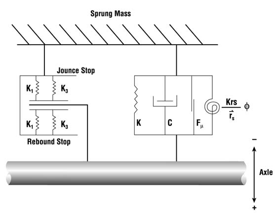
*Figure 4-15: Suspension force model.*

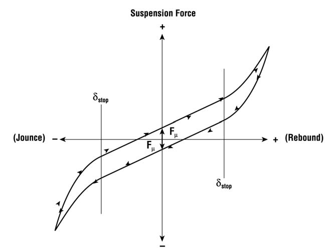
*Figure 4-16: Force produced by suspension stops.*

## Inter-Vehicle Connection Model

In a multi-vehicle train (e.g., a tractor-semitrailer), each sprung mass is allowed six degrees of freedom. The sprung masses are connected by constraint forces and moments acting at the inter-vehicle connection points, as shown in Figure 4-17.

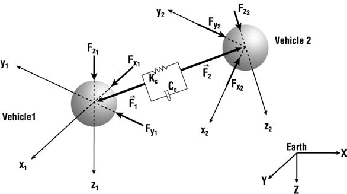
*Figure 4-17: Inter-vehicle connection force.*

### Connection Force

The constraint force is first calculated in the inertial (earth-fixed) reference system, then resolved according to each vehicle-fixed system. In the earth-fixed system,

$$
\vec F_C = \left(\vec R_n - \vec R_{n+1}\right)\cdot K_C + \left(\vec V_n - \vec V_{n+1}\right)\cdot C_C
\qquad (\text{Eq. 117})
$$

where

| Symbol | Definition |
|---|---|
| $\vec R_n - \vec R_{n+1}$ | Earth-fixed distance between connection points on vehicles $n$ and $n+1$ |
| $K_C$ | Constraint spring rate for vehicle pair. For the default Connection Model (Use Heavier Vehicle) $K_C = \max\left(m_{n_{Sprung}}, m_{n+1_{Sprung}}\right)\cdot g$ |
| $\vec V_n - \vec V_{n+1}$ | Earth-fixed relative velocity between connection points on vehicles $n$ and $n+1$ |
| $C_C$ | Constraint damping rate for vehicle pair $= 0.5\sqrt{K_{C_n}\max\left(m_{n_{Sprung}}, m_{n+1_{Sprung}}\right)}$ |

*(updated: the current Calculation Options dialog adds a Connection Model option that selects which sprung mass governs the constraint rates, and a Connection Failure Start Time that sets the earliest time at which a connection is permitted to fail; see Chapter 2. The three Connection Model settings are:*
- *Use Heavier Vehicle (default) — the constraint weight is the heavier sprung mass, $\max\left(m_{n_{Sprung}}, m_{n+1_{Sprung}}\right)\cdot g$, as shown above.*
- *Use Both Vehicles — a weighted blend of the two sprung masses is used, $0.75\,m_{Sprung,min} + 0.25\,m_{Sprung,max}$ (times $g$), for both $K_C$ and $C_C$.*
- *Use Tow Veh Properties — the tow vehicle's user-entered rear-connection stiffness and damping values are used directly instead of a mass-derived rate.*
*)*

Calculation of connection earth-fixed position, $\vec R$, employs the $A$ matrix defined in Eq. 53,

$$
\vec R = \begin{bmatrix}R_X\\ R_Y\\ R_Z\end{bmatrix} = \begin{bmatrix}CG_X\\ CG_Y\\ CG_Z\end{bmatrix} + A\cdot\begin{bmatrix}r_x\\ r_y\\ r_z\end{bmatrix}
\qquad (\text{Eq. 118})
$$

where

| Term | Definition |
|---|---|
| $[R_X\ R_Y\ R_Z]^T$ | Earth-fixed X, Y, Z coordinates of the connection point |
| $[r_x\ r_y\ r_z]^T$ | Vehicle-fixed x, y, z coordinates of connection point |

The equations of motion require the earth-fixed connection force to be resolved in the vehicle-fixed reference frame for each vehicle. The vehicle-fixed components of the connection force are

$$
\vec f_{C_n} = \begin{bmatrix}f_{x_{C_n}}\\ f_{y_{C_n}}\\ f_{z_{C_n}}\end{bmatrix} = -A_n^T\cdot\begin{bmatrix}F_{X_{C_n}}\\ F_{Y_{C_n}}\\ F_{Z_{C_n}}\end{bmatrix}
\qquad (\text{Eq. 119})
$$

for the towing vehicle and

$$
\vec f_{C_{n+1}} = \begin{bmatrix}f_{x_{C_{n+1}}}\\ f_{y_{C_{n+1}}}\\ f_{z_{C_{n+1}}}\end{bmatrix} = A_{n+1}^T\cdot\begin{bmatrix}F_{X_{C_{n+1}}}\\ F_{Y_{C_{n+1}}}\\ F_{Z_{C_{n+1}}}\end{bmatrix}
\qquad (\text{Eq. 120})
$$

for the trailing vehicle.

The total force sums from each connection (front and rear) are

$$
\sum \vec F_{Conn} = \vec f_{C_{Front}} + \vec f_{C_{Rear}}
\qquad (\text{Eq. 121})
$$

To calculate the velocities, a similar procedure is used. First, the vehicle-fixed velocity components for the connection are required:

$$
\begin{aligned}
u_{Conn} &= u - ry_{Conn} + qz_{Conn} & \text{(Eq. 122)}\\
v_{Conn} &= v - pz_{Conn} + rx_{Conn} & \text{(Eq. 123)}\\
w_{Conn} &= w - qx_{Conn} + py_{Conn} & \text{(Eq. 124)}
\end{aligned}
$$

These velocities are next transformed to the earth-fixed reference system,

$$
\vec V_C = \begin{bmatrix}V_{X_C}\\ V_{Y_C}\\ V_{Z_C}\end{bmatrix} = A\cdot\begin{bmatrix}u_{Conn}\\ v_{Conn}\\ w_{Conn}\end{bmatrix}
\qquad (\text{Eq. 125})
$$

These earth-fixed velocity components are used in Eq. 117.

### Connection Moments

SIMON models roll and yaw moment transfers between connected vehicles. The roll moment is the result of a difference in roll angle between connected vehicles and the yaw moment results from friction in the connection.

The roll moment is calculated as follows:

$$
\gamma = \psi_n - \psi_{n+1}
\qquad (\text{Eq. 126})
$$

$$
M_{x_n} = \left(\phi_{n+1}\cos\gamma - \phi_n\right)K_{Frame_n} + \left(\dot\phi_{n+1}\cos\gamma - \dot\phi_n\right)C_{Frame_n}
\qquad (\text{Eq. 127})
$$

where

| Symbol | Definition |
|---|---|
| $\gamma$ | Yaw articulation angle between vehicles $n$ and $n+1$ |
| $K_{Frame_n}$ | Frame torsional stiffness for vehicle $n$ (user-entered) |
| $C_{Frame_n}$ | Frame torsional damping for vehicle $n$ |

The friction moment is

$$
M_{Friction_n} =
\begin{cases}
\mu_{Conn}F_{z_{Conn}}r_{Conn}, & \text{for } \dot\gamma \ge \omega\\[6pt]
\left(\dfrac{\dot\gamma}{\omega}\right)\mu_{Conn}F_{z_{Conn}}, & \text{for } \dot\gamma < \omega
\end{cases}
\qquad (\text{Eq. 128})
$$

where

| Symbol | Definition |
|---|---|
| $\mu_{Conn}$ | Friction coefficient at connection |
| $F_{z_{Conn}}$ | Vehicle-fixed z-component of connection force (see Eqs. 119 and 120) |
| $r_{Conn}$ | Moment radius for connection |
| $\omega$ | Null band for friction torque at connection |

The total moments from the rear connection of vehicle $n$ are

$$
\begin{aligned}
M_{x_{Conn_n}} &= -f_{y_{C_n}}r_z + f_{z_{C_n}}r_y + M_{Roll_x} & \text{(Eq. 129)}\\
M_{y_{Conn_n}} &= -f_{z_{C_n}}r_x + f_{x_{C_n}}r_z & \text{(Eq. 130)}\\
M_{z_{Conn_n}} &= -f_{x_{C_n}}r_y + f_{y_{C_n}}r_x + M_{Friction_n} & \text{(Eq. 131)}
\end{aligned}
$$

And the total moments from the front connection of vehicle $n+1$ are

$$
\begin{aligned}
M_{x_{Conn_{n+1}}} &= -f_{y_{C_{n+1}}}r_z + f_{z_{Conn_{n+1}}}r_y - M_{Roll_n}\cos\gamma & \text{(Eq. 132)}\\
M_{y_{Conn_{n+1}}} &= -f_{z_{C_{n+1}}}r_x + f_{x_{C_{n+1}}}r_z - M_{Roll_n}\sin\gamma & \text{(Eq. 133)}\\
M_{z_{C_{n+1}}} &= -f_{x_{C_{n+1}}}r_y + f_{y_{C_{n+1}}}r_x - M_{Friction_n} & \text{(Eq. 134)}
\end{aligned}
$$

The total connection moments on vehicle $n$ are

$$
\sum \vec M_C = \vec M_{n_{Rear}} + \vec M_{n_{Front}}
\qquad (\text{Eq. 135})
$$

## Dollys

Two types of dollys are supported by SIMON:

- **Converter Dolly** — The fifth wheel articulates about the pitch axis, and the drawbar is rigidly attached to the dolly. The result is that brake torque is resisted at the pintle hook of the tow vehicle.

  > **NOTE:** Thus, trailer braking results in a vertical load transfer to the rear of the tow vehicle.

- **Fixed Dolly** — The fifth wheel is fixed to the trailer and is not free to articulate about its pitch axis. The drawbar is hinged.

  > **NOTE:** Thus, there is no load transfer to the tow vehicle.

The two dolly types are shown in Figure 4-18.

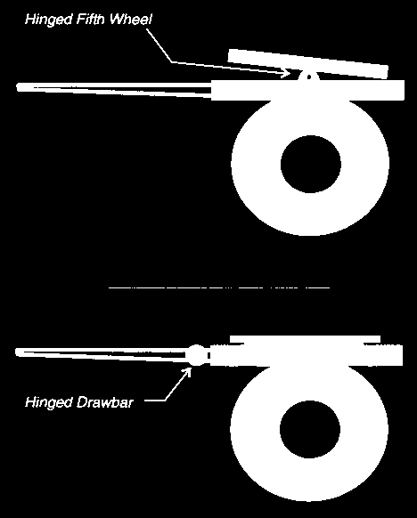
*Figure 4-18: Converter (above) and Fixed (below) dollys.*

## Aerodynamics Model

SIMON includes a lumped parameter aerodynamics model that includes drag on all six vehicle surfaces (front, back, right, left, top and bottom), as well as two additional, user-defined devices, such as a front or rear wing (see Figure 4-19). Air properties (temperature and pressure) are supplied by the Environment Editor, allowing SIMON to study various effects, such as cross-wind, on vehicle handling performance.

Aerodynamic forces and moments produced by each surface act on the sprung mass. To compute these forces, the earth-fixed wind velocity must first be calculated,

$$
\vec V_{Wind} = \begin{bmatrix}V_{X_{Wind}}\\ V_{Y_{Wind}}\\ V_{Z_{Wind}}\end{bmatrix} = \begin{bmatrix}S_{Wind}\cos(\psi_{Wind} - \pi)\\ S_{Wind}\sin(\psi_{Wind} - \pi)\\ 0\end{bmatrix}
\qquad (\text{Eq. 136})
$$

where

| Symbol | Definition |
|---|---|
| $S_{Wind}$ | User-entered wind speed |
| $\psi_{Wind}$ | User-entered wind direction relative to earth-fixed X-axis |

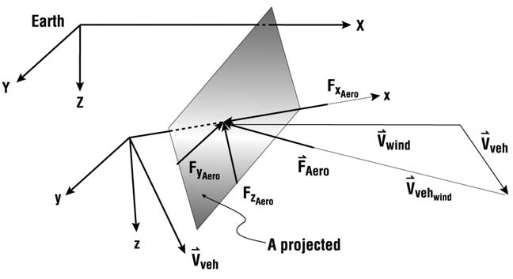
*Figure 4-19: Aerodynamic forces and moments.*

The earth-fixed components of the vehicle velocity vector are

$$
\vec V_{Veh} = \begin{bmatrix}V_{X_{Veh}}\\ V_{Y_{Veh}}\\ V_{Z_{Veh}}\end{bmatrix} = A\cdot\begin{bmatrix}u\\ v\\ w\end{bmatrix}
\qquad (\text{Eq. 137})
$$

Next, calculate the earth-fixed components of the total relative wind velocity acting on the vehicle,

$$
\vec V' = \begin{bmatrix}V'_{X_{Wind}}\\ V'_{Y_{Wind}}\\ V'_{Z_{Wind}}\end{bmatrix} = \vec V_{Wind} - \vec V_{Veh} = \begin{bmatrix}V_{X_{Wind}}\\ V_{Y_{Wind}}\\ V_{Z_{Wind}}\end{bmatrix} - \begin{bmatrix}V_{X_{Veh}}\\ V_{Y_{Veh}}\\ V_{Z_{Veh}}\end{bmatrix}
\qquad (\text{Eq. 138})
$$

Finally, the vehicle-fixed components of the total relative wind velocity are computed:

$$
\vec V_{VehWind} = \begin{bmatrix}V_{x_{Wind}}\\ V_{y_{Wind}}\\ V_{z_{Wind}}\end{bmatrix} = A^T\begin{bmatrix}V'_{X_{Wind}}\\ V'_{Y_{Wind}}\\ V'_{Z_{Wind}}\end{bmatrix}
\qquad (\text{Eq. 139})
$$

SIMON uses HVE's aerodynamics model, which allows up to eight individual surfaces to produce aerodynamic forces and moments on the sprung mass: the six vehicle surfaces (front, right, back, left, top and bottom) plus two user-defined devices.

*(updated: the aerodynamics model has been extended since the Fifth Edition manual. The printed manual described a single drag coefficient per surface, producing one force component along each vehicle axis. Each surface now carries three independent coefficients — **Drag**, **Lift** and **Side** — entered in the Aerodynamic Drag dialog, and each surface develops force in all three vehicle-fixed directions. In addition, a surface now generates force only while the relative wind is actually striking it.)*

Each surface in use has three aerodynamic constants, formed from its coefficients and projected area:

$$
C_D = \frac{C_d A\rho}{2g}
\qquad
C_L = \frac{C_l A\rho}{2g}
\qquad
C_S = \frac{C_s A\rho}{2g}
\qquad (\text{Eq. 140})
$$

where

| Symbol | Definition |
|---|---|
| $C_d$, $C_l$, $C_s$ | Drag, Lift and Side coefficients for the surface |
| $A$ | Projected surface area |
| $\rho$ | Air density $= \dfrac{P_{Barometric}}{GasConst\cdot T_{Absolute}}$ |
| $g$ | Gravitational constant |

### Directional loading

A surface is loaded only when the relative wind strikes its outward face. For each surface, the driving term is the signed square of the relevant relative-wind component, which is zero whenever the wind is blowing on the opposite face:

$$
q^{-} = \begin{cases} -V^2 & V < 0\\ 0 & V \ge 0\end{cases}
\qquad
q^{+} = \begin{cases} +V^2 & V > 0\\ 0 & V \le 0\end{cases}
\qquad (\text{Eq. 141})
$$

The front, right, bottom and front-device surfaces use $q^{-}$; the back, left, top and back-device surfaces use $q^{+}$. Each uses the relative-wind component along its own normal axis — $V_{x_{Wind}}$ for the front, back and both devices, $V_{y_{Wind}}$ for the right and left, and $V_{z_{Wind}}$ for the top and bottom.

This means, for example, that a vehicle travelling forward loads its front surface but not its back surface, and a cross-wind from the right loads the right surface only.

### Force on each surface

The drag constant always acts along the surface's own normal axis; the lift and side constants produce the cross-axis components:

| Surface | $f_{x}$ | $f_{y}$ | $f_{z}$ | Driving term |
|---|---|---|---|---|
| Front | $C_D\,q$ | $-C_S\,q$ | $-C_L\,q$ | $q^{-}$ on $V_{x_{Wind}}$ |
| Right | $-C_S\,q$ | $C_D\,q$ | $-C_L\,q$ | $q^{-}$ on $V_{y_{Wind}}$ |
| Back | $C_D\,q$ | $C_S\,q$ | $C_L\,q$ | $q^{+}$ on $V_{x_{Wind}}$ |
| Left | $C_S\,q$ | $C_D\,q$ | $C_L\,q$ | $q^{+}$ on $V_{y_{Wind}}$ |
| Top | $C_L\,q$ | $C_S\,q$ | $C_D\,q$ | $q^{+}$ on $V_{z_{Wind}}$ |
| Bottom | $-C_L\,q$ | $-C_S\,q$ | $C_D\,q$ | $q^{-}$ on $V_{z_{Wind}}$ |
| Front device | $C_D\,q$ | $-C_S\,q$ | $-C_L\,q$ | $q^{-}$ on $V_{x_{Wind}}$ |
| Back device | $C_D\,q$ | $C_S\,q$ | $C_L\,q$ | $q^{+}$ on $V_{x_{Wind}}$ |

Because the force varies with the square of the relative wind speed, aerodynamic effects grow rapidly with speed and become significant in high-speed handling, cross-wind and downforce studies.

> **NOTE:** By default, the front surface is normally assigned aerodynamic properties. Assignment of aerodynamic properties for other surfaces is left up to the user. A surface takes part in the calculation only if it has been given aerodynamic data.

Finally, the sum of the vehicle-fixed aerodynamic forces and moments is computed,

$$
\vec F_{Aero} = \begin{bmatrix}F_{x_{Aero}}\\ F_{y_{Aero}}\\ F_{z_{Aero}}\end{bmatrix} = \begin{bmatrix}\sum_{i=1}^{N} f_{x_{Aero}}\\ \sum_{i=1}^{N} f_{y_{Aero}}\\ \sum_{i=1}^{N} f_{z_{Aero}}\end{bmatrix}
\qquad (\text{Eq. 142})
$$

and

$$
\vec M_{Aero} = \begin{bmatrix}M_{x_{Aero}}\\ M_{y_{Aero}}\\ M_{z_{Aero}}\end{bmatrix} = \begin{bmatrix}\sum_{i=1}^{N}\left(f_{z_{Aero}}r_{y_{CP}} - f_{y_{Aero}}r_{z_{CP}}\right)\\ \sum_{i=1}^{N}\left(f_{x_{Aero}}r_{z_{CP}} - f_{z_{Aero}}r_{x_{CP}}\right)\\ \sum_{i=1}^{N}\left(f_{y_{Aero}}r_{x_{CP}} - f_{x_{Aero}}r_{y_{CP}}\right)\end{bmatrix}
\qquad (\text{Eq. 143})
$$

*(updated: the printed manual's third row of this moment equation contained a typographical error, using the z-coordinate of the center of pressure in place of the x-coordinate. The yaw moment is the standard cross product of the center-of-pressure position with the surface force, as shown above.)*

where

| Symbol | Definition |
|---|---|
| $N$ | Number of aerodynamic surfaces or devices in use |
| $r_{CP}$ | Center of pressure for surface, $i$ |

These forces and moments are included in the dynamics engine (see Eqs. 3 and 7).

## Sprung Mass Impact Model

SIMON uses HVE's DyMESH collision model to compute 3-dimensional forces and moments resulting from inter-vehicle collision. Simultaneous collision forces between any number of vehicles are allowed. The DyMESH collision model is described in references 7 and 8. In general, vehicle-fixed force components are calculated for each vertex. These forces are summed and the resulting summed forces and moments acting on the sprung mass are supplied to the dynamics engine (see Eqs. 3 and 7).

*(updated: the current DyMESH implementation includes several capabilities beyond those described in the Fifth Edition manual:)*

- *Two selectable algorithm versions (Version 3 and Version 4) and two mesh smoothing models, selected in the DyMESH Options dialog (see Chapter 2).*
- *Vehicle-environment collision detection (Include Environment) with independent vehicle and environment start times.*
- *Tow vehicle/trailer mesh contact for articulated vehicles.*
- *DyMESH wheel contact and wheel damage. Each wheel can carry its own collision mesh. Collision forces acting on a wheel mesh are added to the sprung mass, and forces exceeding the wheel's user-entered damage thresholds (Max No-Damage Force/Moment, Deformation Rate and Max Force/Moment — see the Event Editor's Vehicle Wheels dialog) produce permanent wheel displacement and reorientation, which in turn affect the wheel kinematics of Eqs. 58–62.*
- *Wheel displacement capping. The collision-induced x-y displacement of a wheel during a timestep is tracked against the maximum contact movement of the wheel mesh vertices for that timestep; the computed force-based displacement is capped so it can never exceed the actual contact motion, and no displacement is produced when there is no mesh contact movement. This prevents overprediction of wheel set-back or track-width change in severe impacts.*

### Master and slave vehicles

DyMESH evaluates a collision between a pair of objects, treating one as the
master and the other as the slave. The two roles are not symmetric, so SIMON
alternates them from timestep to timestep, and averages the resulting forces
and moments over successive timesteps so that both treatments contribute to
every step:

$$
\vec F_{Collision} = \frac{1}{2}\left(\vec F_{Current} + \vec F_{Previous}\right),\qquad
\vec M_{Collision} = \frac{1}{2}\left(\vec M_{Current} + \vec M_{Previous}\right)
\qquad (\text{Eq. 144})
$$

The averaging history is kept separately for each pair of colliding objects, so
a vehicle involved in two simultaneous collisions does not mix the two.
Wheel collision forces and moments are averaged in the same way.

Alternation is suspended where the roles are not interchangeable: a fixed
barrier or the environment is always the master, because neither deforms.

*(updated: master/slave alternation and collision force smoothing were not
described in earlier editions. The smoothing model is selectable in the DyMESH
Options dialog; see Chapter 2.)*

### Collision integration timestep

Collision forces rise and fall far more quickly than the forces governing
ordinary trajectory motion, so SIMON integrates the collision phase with a
separate, shorter timestep. At each step the model tests whether any pair of
objects is in contact; if so, the *Collision Integration Timestep* is used for
that step, and otherwise the *Vehicle Trajectory Integration Timestep* is used.
Both are set in the Simulation Controls dialog.

The switch is made for the whole event, not per vehicle: if any pair anywhere
in the event is in contact, every vehicle is integrated at the collision
timestep for that step.

*(updated: the separate collision integration timestep was not described in
earlier editions.)*

### Impact and separation

The Accident History report records the position and velocity of each vehicle
at impact and at separation. Impact is detected when the collision model first
reports contact between the pair. Separation is detected when contact between
the pair is lost.

If the **Accident History Basis** calculation option is set to *Use Impact
Acceleration*, separation is additionally detected when the total acceleration
of both vehicles falls below the *Collision Acceleration Threshold*, whichever
occurs first:

$$
\sqrt{a_x^2 + a_y^2 + a_z^2} < a_{Threshold}\quad\text{for both vehicles}
\qquad (\text{Eq. 145})
$$

*(updated: earlier descriptions of this option stated that the choice governs
both impact and separation. Impact is detected from collision contact
regardless of the setting; the acceleration threshold applies only to
separation, and only as an additional condition alongside loss of contact.)*

### Velocity change

Two different velocity changes are reported, computed in different ways.

The **Accident History delta-V** is the magnitude of the vehicle's change in
earth-fixed velocity between the impact and separation states:

$$
\Delta V = \sqrt{\left(V_{X,Sep} - V_{X,Imp}\right)^2 + \left(V_{Y,Sep} - V_{Y,Imp}\right)^2}
\qquad (\text{Eq. 146})
$$

where each earth-fixed velocity component is formed from the vehicle's forward
and lateral velocity and its heading at that instant. This is a planar
quantity: the vertical velocity change is not included.

The **collision pulse delta-V**, reported for each impulse in the Damage Data
report, is instead obtained by integrating the vehicle's acceleration over the
pulse using the trapezoidal rule:

$$
\Delta\vec V_{Pulse} \mathrel{+}= \frac{1}{2}\left(\vec a + \vec a_{Prev}\right)\Delta t
\qquad (\text{Eq. 147})
$$

with the reported value being the largest magnitude reached before separation.
This one is a full 3-D quantity.

*(updated: neither velocity change calculation was described in earlier
editions. The two are not interchangeable, and they will not agree exactly.)*

### Collision pulses

A vehicle may experience several distinct impulses during an event — a
sideswipe followed by a secondary contact, for example. SIMON identifies each
as a separate collision pulse, up to a maximum of ten per vehicle. Exceeding
that limit terminates the event.

A pulse begins at the first timestep at which the collision model reports force
on the vehicle, and ends once the force has returned to zero and remained there.
While a pulse is in progress SIMON records:

- the peak total collision force and the time it occurred;
- the peak total acceleration;
- the principal direction of force, computed from the direction of the peak
  collision force as an azimuth and a zenith angle, together with the
  equivalent clock direction;
- the impulse center, the force-weighted average position of every mesh vertex
  carrying force during the pulse;
- the collision deformation classification surface, taken from the surface in
  contact at the start of the pulse.

The principal direction of force is not updated after separation, so a pulse
reports the direction associated with its peak force rather than any later
residual contact.

*(updated: the collision pulse data were not described in earlier editions.)*

## Software Implementation

The above physics model and component modules are implemented in a single HVE-compatible physics model, named SIMON.

SIMON is programmed using the C programming language. It is a modular program and includes several C functions to perform specific tasks. A general flow chart for SIMON is shown in Figure 4-20.

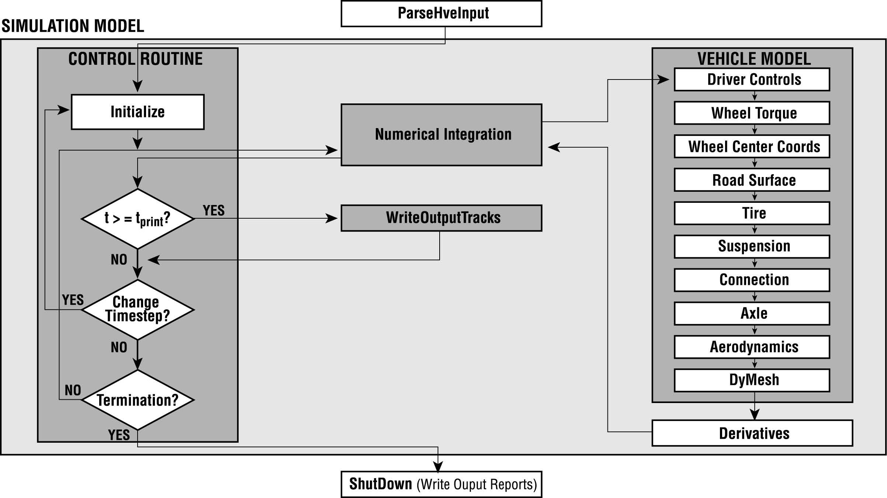
*Figure 4-20: Flowchart for SIMON main calculation procedures.*

*(updated: the current SIMON engine is organized into modules covering the main calculation loop, the dynamics model and DyMESH interface, input processing and reports, the tire model, wheel torque, wheel position, suspension, sprung mass, axles, aerodynamics, inter-vehicle connections, the driver model, hydroplaning, the collision pulse, road and terrain handling, output, and numerical integration.)*

<!-- NAV -->

---

← Previous: [Chapter 3 — SIMON Program Output](03-program-output.md)  |  [Index](README.md)  |  Next: [Chapter 5 — SIMON Tutorial](05-tutorial.md) →

<!-- /NAV -->
