# Chapter 5 — SIMON Tutorial

## Description

The SIMON Tutorial investigates the effects of an ABS braking system on a combined braking and steering maneuver. The example uses an ISO 3888 lane-change maneuver to illustrate how ABS brake systems improve vehicle controllability during severe (limit) maneuvers.

Like all SIMON events, the procedures used in the tutorial involve the following basic steps:

- Creating the vehicle(s)
- Creating the environment
- Executing the SIMON event(s)
- Reviewing the SIMON output reports

This basic procedure is described in detail in this tutorial.

> **NOTE:** It is assumed that HVE is up and running, and that the user is familiar with HVE's basic features, such as using HVE's dialogs, viewers and editors. The purpose of this tutorial is to illustrate those features while setting up and executing a SIMON event.

> **NOTE:** If you are new to HVE and are not familiar with HVE's basic features, you should perform the HVE Tutorial (see HVE User's Manual, Chapter 32) before proceeding with the SIMON Tutorial.

## Getting Started

As in other tutorials, before we get started, let's set the user options so we're all starting on the same page.

> **NOTE:** Most options simply affect the appearance in a viewer during Event or Playback mode. However, some options affect the data used in the analysis. For example, if AutoPosition is On, the vehicle position conforms to the local surface; otherwise, the position is set by the Position/Velocity dialog. Obviously, the resulting difference in initial conditions could substantially change the event.

> **NOTE:** Some of the following options are "toggles" that switch between two different modes. Make sure these options are set correctly.

To set the initial user options, choose the following from the Options Menu:

- Show Key Results
- Hide Axes
- Hide Contacts
- Hide Velocity Vectors
- Show Skidmarks
- Show Targets (this is required for our HVE Driver Model)
- AutoPosition On
- Units equals US
- Render Options:
  - Show Humans as Simple
  - Show Vehicles as Actual
  - Phong Shading Mode
  - Complexity equals Object
  - Render Quality equals 5
  - Texture Quality equals 1
  - Anti-aliasing equals 1
- Playback Options:
  - Playback Interval equals 0.01 seconds

The remaining options will automatically initialize to their default conditions. We're now ready to proceed with the tutorial.

Our goal is to use SIMON to simulate an ISO 3888 lane-change maneuver with and without anti-lock braking (ABS). This tutorial describes how to perform these simulations.

## Creating the Vehicle

First let's add the vehicle to our case. The vehicle is a 2001 Cadillac Catera 4-Dr Sedan. It is fitted with a 4-wheel disc brake system that includes ABS at each wheel. Let's load the vehicle:

1. If the Vehicle Editor is not the current editor, choose Vehicle Mode. The Vehicle Editor is displayed.
2. Click Add New Object. The Vehicle Information dialog is displayed. The Vehicle Information dialog allows the user to select the basic vehicle attributes according to Type, Make, Model, Year and Body Style.

   > **NOTE:** The Vehicle Information dialog also allows you to edit the Driver Location, Engine Location, Number of Axles and Drive Axle(s).

3. Using the option buttons, choose the following vehicle from the Vehicle Database:
   - Type = Passenger Car
   - Make = Cadillac
   - Model = Catera
   - Year = 1997–2001
   - Body Style = 4-Door
   - Source Database = Tutorial.db
   - Drive Axle = Axle 2
4. Click OK to add the Cadillac Catera to the Active Vehicles list.

The Cadillac Catera is displayed in the viewer, as shown in Figure 5-1.

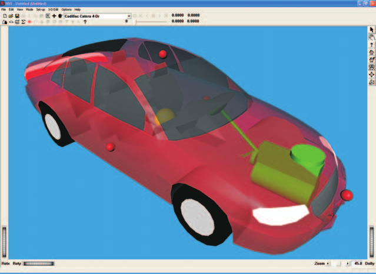
*Figure 5-1: 2001 Cadillac Catera used in the ISO 3888 Lane-Change Maneuver.*

## Editing the Vehicle

Like all vehicles in the EDC Vehicle Database, the Cadillac Catera comes out of the database just as it comes off the showroom floor. However, there is one feature we need to check: the ABS system.

> **NOTE:** In the current version of the EDC Vehicle Database, if a vehicle had the factory option for ABS, ABS is enabled by default.

To check to see if the ABS system is enabled, perform the following steps:

1. Click on the vehicle's brake system icon (i.e., the brake pedal — you may need to look at the vehicle's undercarriage to locate the brake pedal). The Brake System dialog is displayed (see Figure 5-2).
2. Ensure the ABS Installed checkbox is marked to activate the vehicle's ABS system.
3. Press OK to remove the Brake System Data dialog.

The Cadillac Catera is now ready for our ISO lane-change maneuver.

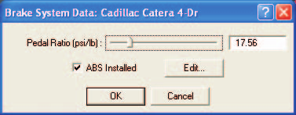
*Figure 5-2: Brake System Data dialog, with the ABS Installed checkbox marked. Note that the Edit button becomes enabled after clicking the checkbox.*

## Creating the Environment

Now, let's add the environment:

1. Choose Environment Mode. The Environment Editor is displayed.
2. Click on Add New Object. The Environment Information dialog is displayed.
3. Using the Location Database combo box, choose Detroit, Michigan, USA. The latitude (42.23.00N), longitude (85.05.00W) and GMT hours from the prime meridian (−5.00) are displayed for the selected location.
4. Edit the date and time of the experimental study: 10/02/2001 and 1500, respectively.
5. Edit the angle from true north to the earth-fixed X axis in our environment: 165 degrees.

   > **NOTE:** The Latitude, Longitude, GMT, Date/Time and angle from true north are used to position the sun in the scene. This is, of course, important because the sun is the primary light source for the scene.

6. Edit the default environment name; enter *ISO 3888 Lane-Change Course*.
7. To add the environment geometry file to our case, click on Open. The Environment Geometry File browser is displayed.
8. Click on the Files of Type option list and choose files of type HVE Geometry Files (*.h3d). A list of environment geometry files using the HVE file format is displayed in the file browser. Double-click on **IsoLaneChangeb.h3d** to choose the environment file and remove the dialog.
9. Press OK.

The selected environment is added to our case and displayed in the Environment Viewer (see Figure 5-3). Manipulate the viewer to view the scene.

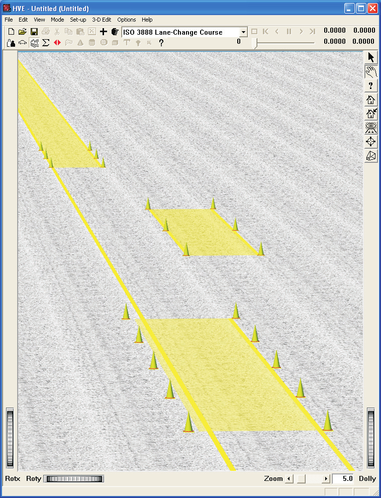
*Figure 5-3: Environment for ISO 3888 Lane-Change Maneuver.*

### Saving the Case

Now that we've created all the objects (vehicle and environment) for our case, let's save the case file.

1. Click on the File menu and choose Save. The Save-as File Selection dialog is displayed.

   > **NOTE:** The Save-as dialog is displayed because the case has not been saved previously, so we need to enter a filename.

2. In the Case Title text field, replace *Untitled* with **SIMON Tutorial Case**.

   > **NOTE:** The Case Title is displayed as a heading on all printed output reports.

3. Place the mouse cursor in the Filename text field and enter **SimonTutorial**.
4. Click SAVE. The current case data are saved in the `hve/supportFiles/case` subdirectory.

> **NOTE:** Saving the file occasionally is a highly recommended practice.

## Creating the Events

Our SIMON Tutorial will include several events. They are both ISO 3888 lane-change maneuvers. The events are identical, with one exception: the first event uses ABS, while the second has ABS disabled. Let's proceed by creating, setting up and executing our first event.

### ISO Lane-Change with ABS

To create the first event, perform the following steps:

1. Choose Event Mode. The Event Editor is displayed.
2. Click on Add New Object. The Event Information dialog is displayed.
3. Select Cadillac Catera from the Active Vehicles list.
4. Select SIMON from the Calculation Method options list.
5. Enter a name for the event: **ISO Lane-Change, w/ABS**.

   > **NOTE:** HVE will append the name of the calculation method to the event name, thus the complete event name will become "SIMON, ISO Lane-Change, w/ABS."

6. Press OK to display the Event Editor.

Now we're ready to set up the first event:

1. Choose Set-up from the menu bar and select Position/Velocity. The Cadillac Catera is displayed at the earth-fixed origin. The Position/Velocity dialog displays the position and velocity for the Initial path position (see Figure 5-4).
2. If the Cadillac is not visible in the viewer, manipulate the viewer until the Cadillac becomes visible.
3. Using the Position/Velocity dialog, enter the vehicle's initial position: X = −80.0 ft, Y = 0.0 ft. Its initial heading angle is 0.0 degrees and need not be modified.

   > **NOTE:** Adjust the viewer by dollying back (using the Dolly thumb wheel) until you can see enough of the entire scene.

4. Click the Velocity Is Assigned checkbox. Enter the initial velocity: 55 mph.

   > **NOTE:** Remember to press Apply or \<Enter\> after entering a value; otherwise the value is not assigned!

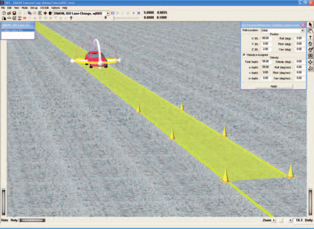
*Figure 5-4: Event Editor, setting up our first SIMON event. The Position/Velocity dialog is used for assigning the Cadillac's initial position and velocity.*

#### Steering Input

The vehicle initial conditions are now established. Let's enter the driver controls.

Because the ISO lane-change maneuver has a pre-defined path, our tutorial is a perfect application for the HVE Driver Model [4]. By defining the same driver model and path for both events, our experiment has only one variable (i.e., with and without ABS). To set up the HVE Driver Model, perform the following steps:

1. Click on the Set-up Menu and select Driver Controls. The Driver Controls dialog is displayed with an empty steer table.
2. Click on the HVE Driver tab. The HVE Driver Model (Path Follower) dialog is displayed.
3. Click the Use Path Follower checkbox.
4. Click on the Driver Data tab. The Driver Data page is displayed.
5. Increase Driver Comfort Level to 1.0 g.
6. Press OK to dismiss the Driver Controls dialog.

We now need to assign the target positions required by the HVE Driver Model. Use the Position/Velocity dialog to assign the target positions shown in Table 5-1.

**Table 5-1 Position and heading angle for each target position.**

| Path Position | X-coord (ft) | Y-coord (ft) | Heading (deg) |
|---|---|---|---|
| Initial | −80.0 | 0.0 | 0.0 |
| Begin Perception | 50.0 | 0.0 | 0.0 |
| Begin Braking | 148.0 | −11.5 | 0.0 |
| Impact | 325.0 | −11.5 | 0.0 |

To assign these target positions, perform the following steps:

> **NOTE:** The Initial position has already been entered.

1. Click on the Path Location list and choose Begin Perception. Then enter the data shown in Table 5-1 for the Begin Perception position.
2. Click on the Path Location list and choose Begin Braking. Then enter the data shown in Table 5-1 for the Begin Braking position.
3. Click on the Path Location list and choose Impact. Then enter the data shown in Table 5-1 for the Impact position.

> **NOTE:** The actual names of these target positions (e.g., Impact) are irrelevant to the HVE Driver Model.

> **NOTE:** Remember to press Apply or \<Enter\> after entering each position; otherwise it is not assigned!

After assigning all the target positions, the Event Editor should appear as shown in Figure 5-5.

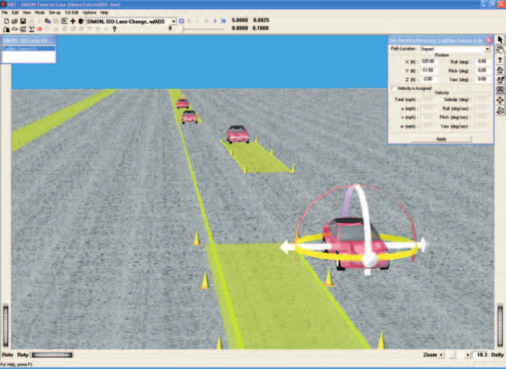
*Figure 5-5: Event Editor, after assigning the target positions used by the HVE Driver Model.*

#### Brake Input

The brake input for our maneuver is very simple: we're simply going to apply a very large pedal force (say 120 lb) at the start of the steering maneuver. To enter the brake table, perform the following steps:

1. Click on the Set-up menu and select Driver Controls. The Driver Controls dialog is displayed.
2. Click on the Driver Controls dialog's Brake tab. The Brake Pedal Force table is displayed.
3. Enter the times and pedal forces as shown in Table 5-2.
4. Press OK to accept the brake table.

**Table 5-2 Brake Table.**

| Time (sec) | Pedal Force (lb) |
|---|---|
| 1.5 | 0.0 |
| 1.6 | 120.0 |

The brake table is now ready for our event.

Let's make one more (rather subtle) change before we execute the event. Because the ABS system will modulate the brake pressure at a relatively high frequency, we should reduce the simulation output time interval to 0.01 seconds from its default value of 0.10 seconds. This change will ensure that we capture the detail in the wheel brake pressure modulation.

1. Click on the Options menu and select Simulation Controls. The Simulation Controls dialog is displayed.
2. Edit the default Output Time Interval, changing it to 0.01 seconds.
3. Press OK to accept the new value.

> **NOTE:** The smaller output interval will increase the execution time.

Now, we're ready to execute the event.

- Using the Event Controller, click Play to execute the event.

Note that the vehicle successfully negotiates the lane change maneuver, even with a heavy brake application. The vehicle comes to a stop after travelling approximately 120 ft. The average deceleration is 0.80 g. Figure 5-6 shows the vehicle at its rest position. Note also the faint tire marks caused by tire scuffing.

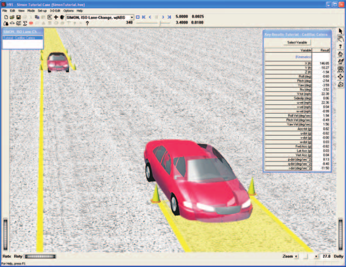
*Figure 5-6: ISO Lane-Change Maneuver, w/ABS.*

> **NOTE:** If you remove the pavement texture, you can see a faint tire mark!

### ISO Lane-Change without ABS

We have now completed the first SIMON event. Let's repeat the test with the ABS disabled. To disable the ABS, we need to go to the Vehicle Editor and work on the brake system:

1. Choose Vehicle Mode. The Vehicle Editor displays the Cadillac Catera.
2. Click on the vehicle's brake system icon (i.e., the brake pedal — you may need to look at the vehicle's undercarriage to locate the brake pedal). The Brake System dialog is displayed (as shown earlier in Figure 5-2).
3. Click on the ABS Installed checkbox to disable the ABS.
4. Press OK to remove the Brake System dialog.

To create the next event, perform the following steps:

1. Choose Event Mode. The Event Editor is displayed.

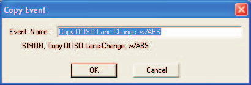
*Figure 5-7: Making a copy of the ISO Lane-Change, w/ABS event.*

We have a choice now. One way to create our next event is to duplicate the steps used while setting up the first event. But there is a much better way!

2. Click on the Edit menu and choose Copy. The Copy Event dialog is displayed (see Figure 5-7).
3. Enter a name for the new event: **ISO Lane-Change, w/o ABS**.

   > **NOTE:** HVE will append the name of the calculation method to the event name, thus the complete event name will become "SIMON, ISO Lane-Change, w/o ABS."

4. Press OK to display the Event Editor.

A duplicate of the first event has been created and set up, and we're ready to execute the lane-change maneuver simulation without ABS enabled.

1. Using the Event Controller, click Reset.
2. Click Play to execute the event with the ABS disabled.

Note that the vehicle's brakes lock and it does not successfully negotiate the lane change maneuver. The vehicle skids straight, running over the cones, and coming to a stop after travelling approximately 140 ft. The average deceleration is 0.66 g. Figure 5-8 shows the vehicle at its rest position. Note also the dark skidmarks caused by locked-wheel braking.

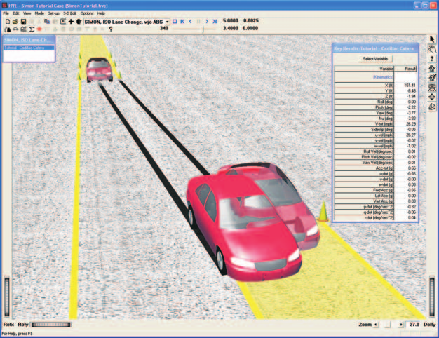
*Figure 5-8: ISO Lane-Change, w/o ABS.*

## Viewing Results

Now that we have produced our SIMON simulations of an ISO 3888 lane-change maneuver with and without ABS, let's take a detailed look at the results. The Playback Editor is used for reviewing and printing reports for each event in the current case, as well as for producing videos.

SIMON produces the following reports:

- **Messages** — A list of messages produced by the current run
- **Accident History** — A table of initial and final positions and velocities
- **Driver Data** — A table of the driver controls used for the current run
- **Environment Data** — A list of the visual and physical environment parameters used by SIMON
- **Event Data** — A table of event-related SIMON options used in the current run
- **Vehicle Data** — A series of tables containing the vehicle data used by SIMON, including tire blow-out information
- **Program Data** — A table containing program control information
- **Variable Output** — A table containing user-selectable, time-dependent simulation results
- **Trajectory Simulation** — A 3-D visualization of the event, displayed at a user-selectable time interval
- **Damage Profiles** — A 3-D visualization of the vehicle damage, displayed at a user-selectable time interval

> **NOTE:** The Damage Profiles report is available only for SIMON events using the DyMESH collision algorithm. The events in this tutorial do not produce a Damage Profile report.

To view the output reports, we need to be in Playback mode:

- Choose Playback Mode. The Playback Editor is displayed.

> **NOTE:** Our tutorial uses the ISO Lane-Change, w/ABS event to illustrate the procedures for viewing output reports. You can use the same procedures for viewing reports for the ISO Lane-Change, w/o ABS event.

### Report Windows

The reports listed above are displayed by selecting Report Windows. Each Report Window contains an individual report.

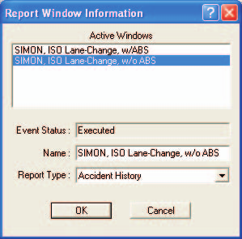
*Figure 5-9: Report Window Information dialog, displaying the name of each event in the current case.*

To view the reports produced by the SIMON, ISO Lane-Change, w/ABS event, perform the following steps:

1. Click Add New Object. The Report Window Information dialog is displayed, as shown in Figure 5-9, and includes a list of the active events. The Report Window Information dialog also includes the user-editable Report Window Name text field and Selected Output option list.
2. Select SIMON, ISO Lane-Change, w/ABS from the Active Events list.
3. Click on the Selected Output option list and choose any of the available reports.
4. Press OK to display the report.

The selected report will be displayed in a resizable window. The following sections illustrate the reports produced for the SIMON, ISO Lane-Change, w/ABS event.

### Messages

SIMON produces a number of messages, depending on the outcome of the event. For a complete listing and explanation of the messages, refer to Chapter 6.

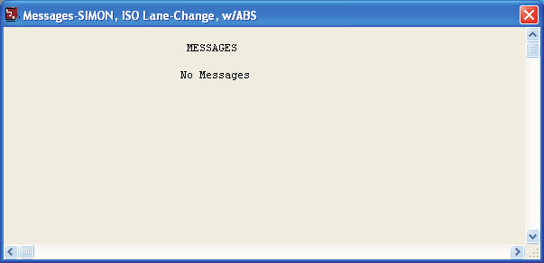
*Figure 5-10: Messages Report for SIMON, ISO Lane-Change, w/ABS.*

To view the Messages report: Add a new Report Window, select the event, choose **Messages** from the Selected Output option list and press OK. The Messages report is displayed as shown in Figure 5-10.

### Accident History

The Accident History report displays the time and total distance traveled, as well as the position and velocity at the start and end of the run.

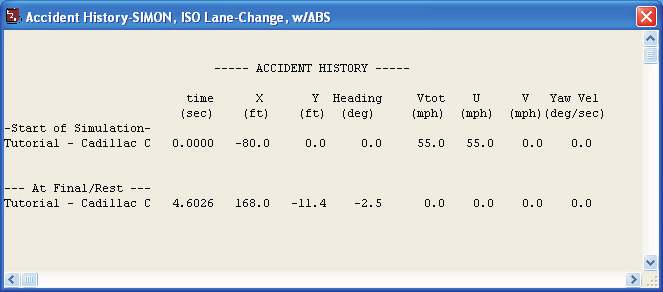
*Figure 5-11: Accident History Report for SIMON, ISO Lane-Change, w/ABS.*

To view the Accident History report: Add a new Report Window, select the event, choose **Accident History** and press OK. The Accident History report is displayed as shown in Figure 5-11.

### Driver Data

The Driver Data report displays the parameters used by the HVE Driver Model and the Braking and Throttle (open-loop) driver tables.

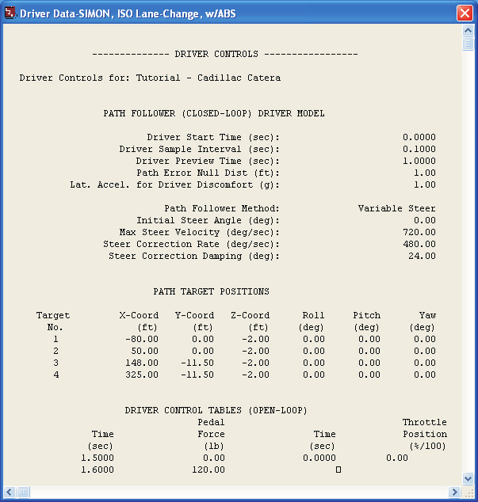
*Figure 5-12: Driver Data Report for SIMON, ISO Lane-Change, w/ABS.*

To view the Driver Data report: Add a new Report Window, select the event, choose **Driver Data** and press OK. The Driver Data report is displayed as shown in Figure 5-12.

### Environment Data

The Environment Data report displays the physical and visual parameters describing the environment.

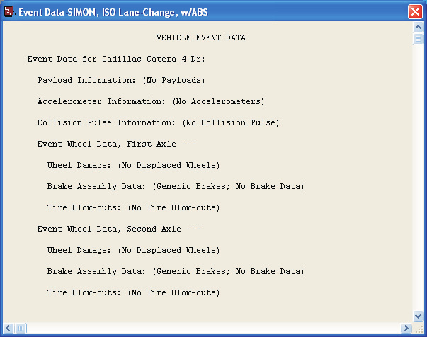
*Figure 5-13: Environment Data Report for SIMON, ISO Lane-Change, w/ABS.*

To view the Environment Data report: Add a new Report Window, select the event, choose **Environment Data** and press OK. The Environment Data report is displayed as shown in Figure 5-13.

### Event Data

The Event Data report displays the event-related parameters (payload, accelerometer, wheel displacement, brake and tire blow-out).

*Figure 5-14: Event Data Report for SIMON, ISO Lane-Change, w/ABS.*

To view the Event Data report: Add a new Report Window, select the event, choose **Event Data** and press OK. The Event Data report is displayed as shown in Figure 5-14.

### Vehicle Data

The Vehicle Data report for SIMON contains all the vehicle data groups (Sprung Mass, Suspensions, Tires, Brakes, etc.).

To view the Vehicle Data report: Add a new Report Window, select the event, choose **Vehicle Data** and press OK. A portion of the Vehicle Data report is shown in Figure 5-15.

> **NOTE:** The SIMON Vehicle Data report is too large to fit in the viewer. Use the scroll bars to view the entire report.

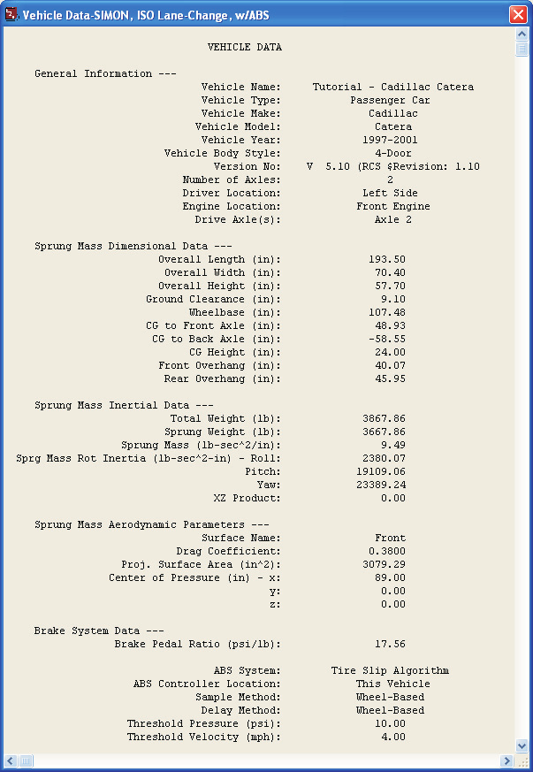
*Figure 5-15: Vehicle Data Report for SIMON, ISO Lane-Change, w/ABS (only a portion of the total report is shown).*

### Program Data

The Program Data report includes the simulation control parameters and other run-time information.

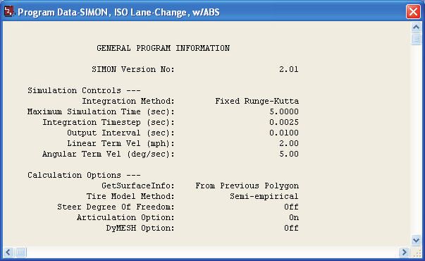
*Figure 5-16: Program Data Report for SIMON, ISO Lane-Change Maneuver.*

To view the Program Data report: Add a new Report Window, select the event, choose **Program Data** and press OK. The Program Data report is displayed as shown in Figure 5-16.

### Variable Output

The Variable Output report is a table of user-selectable, time-dependent simulation results for the current event. To view the Variable Output report: Add a new Report Window, select the event, choose **Variable Output** and press OK.

The Variable Output report is displayed for the SIMON, ISO Lane-Change, w/ABS event. The table is initially empty, so the next step is to select the time-dependent results we wish to display in the table.

#### Variable Selection

The purpose of our SIMON study is to simulate the effects of the ABS brake system on a lane-change maneuver during heavy braking. To document the resulting path, as well as some other pertinent results, let's select the CG path coordinates, velocity and acceleration from the Variable Selection dialog.

- Click on Select Variables in the SIMON, ISO Lane-Change, w/ABS Variable Output window. The Variable Selection dialog for Cadillac Catera 4-Dr is displayed, as shown in Figure 5-17.

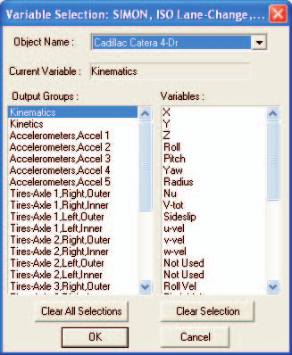
*Figure 5-17: Variable Selection dialog for the Cadillac Catera 4-Dr.*

The Kinematics Output group is the default selection and the Kinematics variable list is displayed. Let's add the System Brake Pressure and the Right Front and Right Rear Wheel Brake Pressures to the Key Results window:

1. Select the Driver Output Group and then select Brake System from the Variables list.
2. Select the Wheel, Axle 1, Right Output Group and then select Brake Press from the Variables list.
3. Select the Wheel, Axle 2, Right Output Group and then select Brake Press from the Variables list.
4. Press OK to add the selected variables to the Variable Output table.

The Variable Output report for the SIMON, ISO Lane-Change, w/ABS event now includes the selected results (see Figure 5-18).

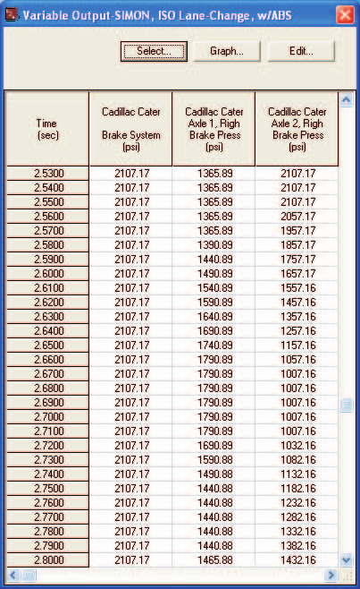
*Figure 5-18: Variable Output Report for SIMON, ISO Lane-Change, w/ABS.*

#### Graphing Results

It is easy to graph the results displayed in the Variable Output table: press **Graph**. The selected results are displayed vs. Time, as shown in Figure 5-19.

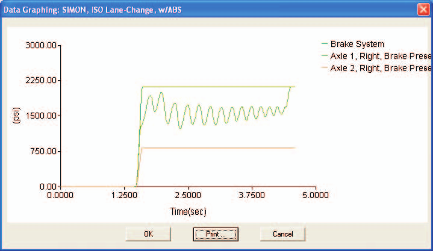
*Figure 5-19: Graph of master cylinder pressure and right front and right rear wheel brake pressures.*

> **NOTE:** The variables selected for graphing must have the same units.

> **NOTE:** Only the first six variables are graphed.

> **NOTE:** Results from the Variable Output table can also be exported to other applications (e.g., Excel).

### Trajectory Simulation

Let's display a trajectory simulation for this event. To view the Trajectory Simulation: Add a new Report Window, select the event, choose **Trajectory Simulation** and press OK.

The Trajectory Simulation viewer is displayed for the SIMON, ISO Lane-Change, w/ABS event (see Figure 5-20). The viewer shows the vehicle at its initial position.

To visualize the motion, perform the following steps:

1. Click Play (single right-arrow). The simulation begins and is displayed at the current Playback output interval.
2. Click Pause. The simulation stops.
3. Click Reverse (single left-arrow). The simulation plays in reverse.
4. Click Pause. The simulation stops.
5. Click Rewind (left arrow with bar). The simulation returns to the start.
6. Click Advance to End (right arrow with bar). The simulation advances to the end of the run.

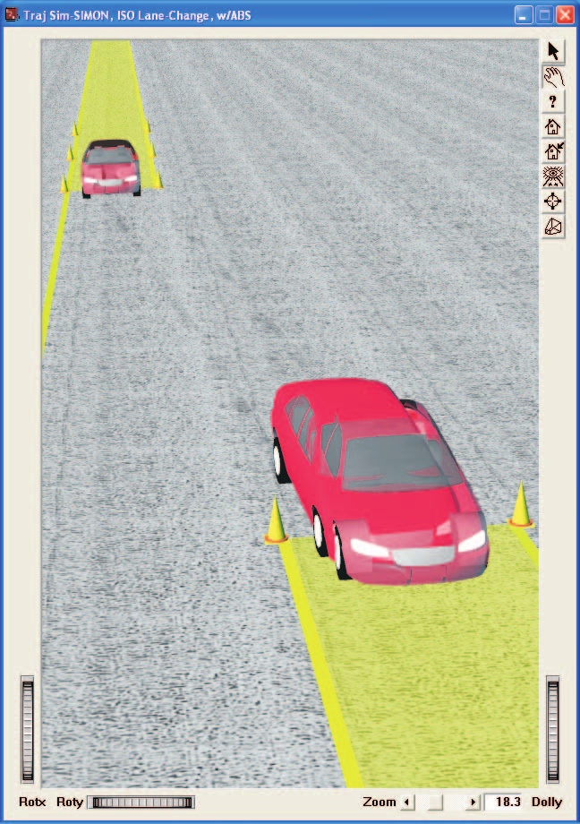
*Figure 5-20: Trajectory Simulation Report for SIMON, ISO Lane-Change Maneuver.*

### Printing

The final step is to print the above reports. Printing reports is simple. All you do is choose a report and print it. For example:

1. Click on the dialog header of the Variable Output — SIMON, ISO Lane-Change, w/ABS report. The dialog header is highlighted and the Variable Output window pops to the top of the display (if it isn't there already), indicating it is the current window.
2. Click on the File menu and choose Print. The Print dialog is displayed, allowing the user to select from several available print options.

   > **NOTE:** Alternatively, you can click on the print icon in the upper menu bar.

3. Press OK. The Variable Output report is printed on the system printer.

That's all there is to it! You can print any other report using the same three steps described above.

> **NOTE:** The Print dialog provides several options. Refer to the HVE User's Manual for more information.

> **NOTE:** The font size of both the printed reports and screen display may be edited by clicking on the Options menu and choosing Preferences. Use the Font Size option list to change the size.

<!-- NAV -->

---

← Previous: [Chapter 4 — Calculation Method](04-calculation-method.md)  |  [Index](README.md)  |  Next: [Chapter 6 — Messages](06-messages.md) →

<!-- /NAV -->
